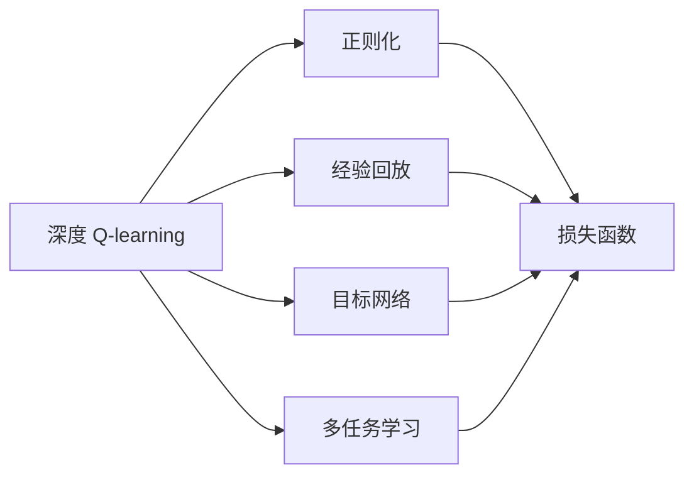
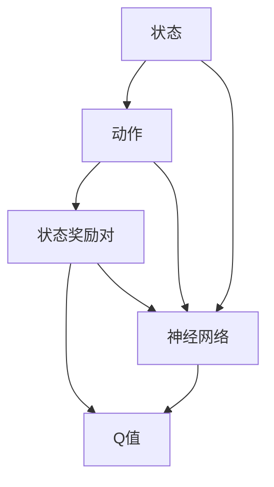
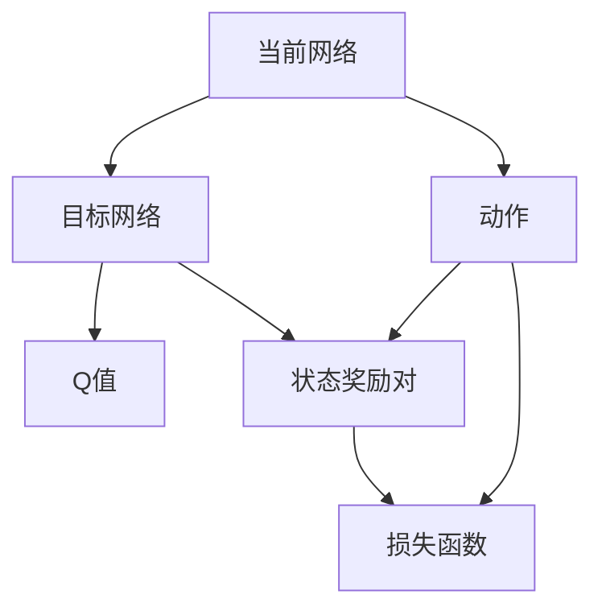
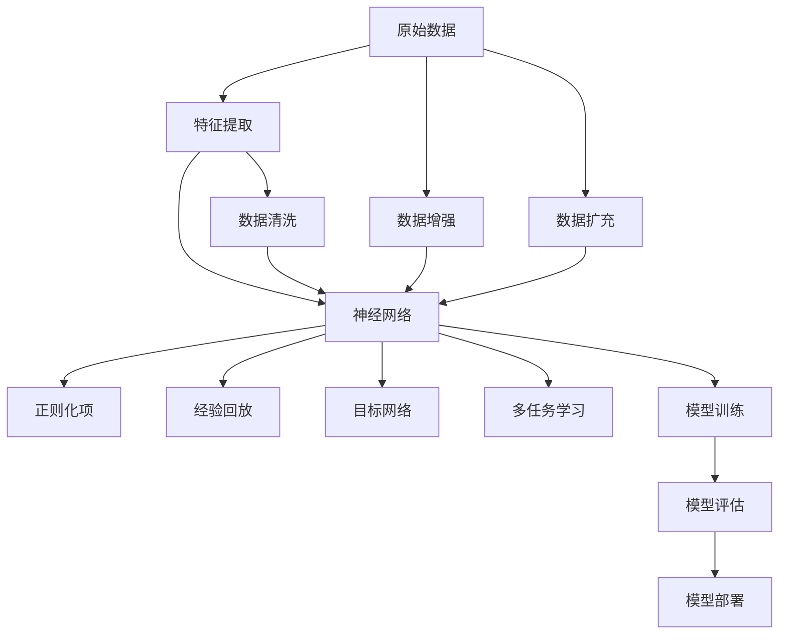

                 

# 深度 Q-learning：防止过拟合的策略

> 关键词：深度 Q-learning, 强化学习, 过拟合, 正则化, 经验回放, 目标网络

## 1. 背景介绍

### 1.1 问题由来
在深度强化学习中，深度 Q-learning（Deep Q-learning）作为一种基于深度神经网络的强化学习算法，近年来在控制问题、游戏AI等领域取得了显著进展。然而，深度 Q-learning 也存在模型过拟合的问题，尤其是在高维状态空间、复杂动态环境中，模型的泛化能力往往受到限制。因此，如何防止模型过拟合，成为当前深度强化学习研究的热点问题。

### 1.2 问题核心关键点
为了防止深度 Q-learning 模型过拟合，主流的方法包括正则化、经验回放、目标网络等。这些方法通过在模型训练过程中引入额外的约束，有效降低了模型的复杂度，提高了模型的泛化能力。具体来说，正则化方法通过在损失函数中引入正则项，防止模型参数过大，从而抑制过拟合；经验回放则通过采样历史经验数据，避免模型陷入局部最优，增强模型的稳定性和泛化能力；目标网络则通过引入一个目标 Q-learning 模型，进一步减小模型更新过程中的方差，提升模型泛化能力。

### 1.3 问题研究意义
研究深度 Q-learning 防止过拟合的策略，对于推动深度强化学习技术的发展，提升模型泛化能力，加速其在现实世界中的应用，具有重要意义：

1. 提高模型泛化能力。过拟合问题会严重影响深度 Q-learning 模型在实际环境中的泛化性能，防止过拟合可以显著提升模型在复杂环境中的适应能力。
2. 降低模型训练成本。过拟合问题会导致模型在训练过程中对噪声和干扰敏感，增加训练的复杂性和计算成本。
3. 增强模型稳定性。防止过拟合可以提高深度 Q-learning 模型的稳定性，避免模型在训练和推理过程中出现异常行为。
4. 拓展应用场景。深度 Q-learning 技术已经在自动驾驶、机器人控制、游戏AI等领域得到了广泛应用，防止过拟合策略的引入，可以进一步拓展其在更多场景中的应用。

## 2. 核心概念与联系

### 2.1 核心概念概述

为更好地理解深度 Q-learning 防止过拟合的策略，本节将介绍几个密切相关的核心概念：

- 深度 Q-learning：以深度神经网络为基础的强化学习算法，通过学习策略-价值函数映射，实现智能体对环境的优化决策。
- 过拟合：在训练过程中，模型学习到了训练数据中的噪声和特征，导致模型在测试数据上表现不佳的现象。
- 正则化（Regularization）：通过在损失函数中引入正则项，防止模型参数过大，从而抑制过拟合。
- 经验回放（Experience Replay）：通过随机采样历史经验数据，避免模型陷入局部最优，增强模型的稳定性和泛化能力。
- 目标网络（Target Network）：通过引入一个目标 Q-learning 模型，进一步减小模型更新过程中的方差，提升模型泛化能力。
- 多任务学习（Multi-task Learning）：通过训练多个相关任务，共享模型参数，提升模型的泛化能力和鲁棒性。

这些核心概念之间的逻辑关系可以通过以下 Mermaid 流程图来展示：



这个流程图展示了大模型微调的综合架构及其与各个核心概念的关系：

1. 深度 Q-learning 是整个框架的核心，通过学习策略-价值函数映射，实现智能体对环境的优化决策。
2. 正则化、经验回放和目标网络是防止过拟合的重要手段，通过引入额外的约束，降低模型复杂度。
3. 多任务学习可以进一步增强模型的泛化能力和鲁棒性，共享模型参数，提升模型性能。

这些概念共同构成了深度强化学习防止过拟合的完整生态系统，使其能够在各种场景下发挥强大的决策能力。通过理解这些核心概念，我们可以更好地把握深度强化学习的工作原理和优化方向。

### 2.2 概念间的关系

这些核心概念之间存在着紧密的联系，形成了深度 Q-learning 防止过拟合的完整生态系统。下面我们通过几个 Mermaid 流程图来展示这些概念之间的关系。

#### 2.2.1 深度 Q-learning 的基本原理



这个流程图展示了深度 Q-learning 的基本原理：智能体通过神经网络估计 Q 值，并在状态-动作空间中寻找最优决策策略。

#### 2.2.2 正则化与深度 Q-learning 的关系


这个流程图展示了正则化在深度 Q-learning 中的作用：通过在损失函数中引入正则项，防止模型参数过大，从而抑制过拟合。

#### 2.2.3 经验回放与深度 Q-learning 的关系


这个流程图展示了经验回放在深度 Q-learning 中的应用：通过随机采样历史经验数据，避免模型陷入局部最优，增强模型的稳定性和泛化能力。

#### 2.2.4 目标网络与深度 Q-learning 的关系



这个流程图展示了目标网络在深度 Q-learning 中的作用：通过引入一个目标 Q-learning 模型，进一步减小模型更新过程中的方差，提升模型泛化能力。

### 2.3 核心概念的整体架构

最后，我们用一个综合的流程图来展示这些核心概念在大模型微调过程中的整体架构：



这个综合流程图展示了从原始数据到模型训练、评估、部署的完整过程。深度强化学习模型通过特征提取、神经网络训练、正则化、经验回放、目标网络、多任务学习等多步骤的协同工作，最终实现对复杂环境的优化决策。 通过这些流程图，我们可以更清晰地理解深度 Q-learning 防止过拟合过程中各个核心概念的关系和作用，为后续深入讨论具体的策略和算法奠定基础。

## 3. 核心算法原理 & 具体操作步骤
### 3.1 算法原理概述

深度 Q-learning 防止过拟合的核心思想是：通过在模型训练过程中引入额外的约束，防止模型参数过大，从而抑制过拟合。具体来说，常见的策略包括正则化、经验回放、目标网络等。

### 3.2 算法步骤详解

深度 Q-learning 防止过拟合的具体步骤包括：

**Step 1: 准备原始数据和神经网络模型**
- 准备原始数据，并进行预处理、特征提取等操作。
- 设计神经网络模型，包括输入层、隐藏层和输出层。

**Step 2: 设计损失函数和正则化项**
- 定义 Q-learning 的损失函数，如均方误差损失、交叉熵损失等。
- 引入正则化项，如 L2 正则、Dropout、L1 正则等，防止模型参数过大。

**Step 3: 引入经验回放机制**
- 设计经验回放机制，随机采样历史经验数据，避免模型陷入局部最优。
- 使用经验回放算法，如基于优先队列的经验回放算法、重要性采样经验回放算法等。

**Step 4: 引入目标网络**
- 设计目标网络，如双网络更新算法、离线策略优化算法等。
- 将当前网络的输出作为目标网络的输入，更新目标网络的参数。

**Step 5: 模型训练和评估**
- 使用训练集进行模型训练，最小化损失函数。
- 在验证集上评估模型性能，使用测试集进行最终测试。

**Step 6: 部署和优化**
- 将训练好的模型部署到实际环境中，进行优化和调优。
- 在实际环境中不断收集反馈，调整模型参数，提升模型性能。

以上是深度 Q-learning 防止过拟合的一般流程。在实际应用中，还需要根据具体任务的特点，对各个步骤进行优化设计，如改进损失函数、正则化项，优化经验回放和目标网络算法，以便更好地防止过拟合。

### 3.3 算法优缺点

深度 Q-learning 防止过拟合方法的优点：
1. 有效防止过拟合。通过引入正则化、经验回放、目标网络等策略，可以有效防止模型参数过大，从而抑制过拟合。
2. 提高模型泛化能力。通过在模型训练过程中引入额外的约束，提升模型在复杂环境中的适应能力。
3. 降低模型训练成本。通过正则化、经验回放等策略，减小模型更新过程中的方差，提升模型训练的稳定性。

深度 Q-learning 防止过拟合方法的缺点：
1. 需要额外计算资源。正则化、经验回放、目标网络等策略需要额外的计算资源，增加了模型训练的复杂度。
2. 模型训练时间较长。通过增加约束，模型训练时间会相应增加，需要更多的时间和计算资源。
3. 策略设计复杂。不同的过拟合策略需要不同的设计方法，策略选择不当会导致模型性能下降。

尽管存在这些缺点，但就目前而言，深度 Q-learning 防止过拟合方法仍是深度强化学习研究的主流范式。未来相关研究的重点在于如何进一步降低模型训练成本，优化正则化、经验回放、目标网络等策略，使得模型在保证泛化能力的同时，能够高效地训练和部署。

### 3.4 算法应用领域

基于深度 Q-learning 防止过拟合的方法已经在智能控制、机器人导航、游戏AI等领域得到了广泛应用，取得了显著的成果。具体来说，这些方法在以下几个方面表现优异：

- 智能控制：通过深度强化学习模型，实现机器人、无人机等智能体对复杂环境的优化决策。在自动驾驶、智能家居等场景中，防止过拟合策略可以提升模型的鲁棒性和泛化能力，保证智能体在实际环境中的稳定性和安全性。
- 机器人导航：通过深度强化学习模型，实现机器人自主导航、避障等功能。防止过拟合策略可以提升模型的泛化能力，确保机器人在新环境中能够稳定运行。
- 游戏AI：通过深度强化学习模型，实现智能体在复杂游戏中的决策和行为。防止过拟合策略可以提升模型的泛化能力，使智能体能够适应不同的游戏环境和规则。
- 自动驾驶：通过深度强化学习模型，实现自动驾驶系统对复杂交通环境的优化决策。防止过拟合策略可以提升模型的鲁棒性和泛化能力，确保自动驾驶系统在实际道路上的安全性和可靠性。

除了上述这些经典应用外，深度 Q-learning 防止过拟合方法还在金融、医疗、工业控制等领域得到了广泛应用，为相关行业的智能化转型提供了新的解决方案。

## 4. 数学模型和公式 & 详细讲解  
### 4.1 数学模型构建

本节将使用数学语言对深度 Q-learning 防止过拟合方法进行更加严格的刻画。

记原始数据集为 $D=\{(x_i,y_i)\}_{i=1}^N, x_i \in \mathcal{X}, y_i \in \mathcal{Y}$，其中 $\mathcal{X}$ 为输入空间，$\mathcal{Y}$ 为输出空间。假设深度 Q-learning 模型为 $Q_{\theta}(x,a)$，其中 $\theta$ 为模型参数。假设经验回放机制为 $\rho$，目标网络为 $Q_{\pi}$，正则化项为 $\lambda$。

定义模型的损失函数为：

$$
\mathcal{L}(\theta) = \mathbb{E}_{(x,a,r_{t+1},x_{t+1}) \sim \rho} [Q_{\theta}(x,a) - r_{t+1} - \gamma \mathbb{E}_{a'} Q_{\theta}(x_{t+1},a')] + \lambda ||\theta||^2
$$

其中，第一项为 Q-learning 的损失函数，第二项为正则化项。

### 4.2 公式推导过程

以下是深度 Q-learning 防止过拟合方法的数学推导过程。

**Step 1: 定义经验回放和目标网络**
- 经验回放机制 $\rho$：随机采样历史经验数据，避免模型陷入局部最优。
- 目标网络 $Q_{\pi}$：通过训练一个固定参数的模型，减小模型更新过程中的方差，提升模型泛化能力。

**Step 2: 计算损失函数**
- 将原始数据集 $D$ 划分为训练集和验证集。
- 在训练集上，使用经验回放和目标网络，计算模型损失函数 $\mathcal{L}(\theta)$。
- 在验证集上，计算模型的泛化误差。

**Step 3: 求解最优模型参数**
- 最小化模型损失函数 $\mathcal{L}(\theta)$，求得最优模型参数 $\theta^*$。
- 使用验证集评估模型泛化能力，选择合适的正则化参数 $\lambda$。

在得到最优模型参数 $\theta^*$ 后，将其应用于实际问题中，进行模型测试和优化。

## 5. 项目实践：代码实例和详细解释说明
### 5.1 开发环境搭建

在进行深度 Q-learning 防止过拟合实践前，我们需要准备好开发环境。以下是使用Python进行TensorFlow开发的环境配置流程：

1. 安装Anaconda：从官网下载并安装Anaconda，用于创建独立的Python环境。

2. 创建并激活虚拟环境：
```bash
conda create -n tf-env python=3.8 
conda activate tf-env
```

3. 安装TensorFlow：根据CUDA版本，从官网获取对应的安装命令。例如：
```bash
conda install tensorflow -c tensorflow -c conda-forge
```

4. 安装各类工具包：
```bash
pip install numpy pandas scikit-learn matplotlib tqdm jupyter notebook ipython
```

完成上述步骤后，即可在`tf-env`环境中开始深度 Q-learning 防止过拟合实践。

### 5.2 源代码详细实现

下面我们以深度 Q-learning 防止过拟合的实际应用为例，给出使用TensorFlow实现的具体代码。

首先，定义经验回放机制和目标网络：

```python
import tensorflow as tf
from tensorflow.keras import layers

class ExperienceReplay:
    def __init__(self, batch_size, memory_size):
        self.batch_size = batch_size
        self.memory_size = memory_size
        self.memory = []
        self.position = 0

    def remember(self, state, action, reward, next_state, done):
        self.memory.append((state, action, reward, next_state, done))
        if len(self.memory) > self.memory_size:
            del self.memory[self.position]
            self.position = (self.position + 1) % self.memory_size

    def sample(self):
        batch = random.sample(self.memory, self.batch_size)
        states, actions, rewards, next_states, dones = zip(*batch)
        return (states, actions, rewards, next_states, dones)

class TargetNetwork:
    def __init__(self, model, tau):
        self.model = model
        self.tau = tau
        self.target = model

    def update(self):
        self.target.set_weights(self.model.get_weights())
        self.target = tf.keras.Model(self.model.input,
                                    self.model.layers[-1].output,
                                    name="target_network")
```

然后，定义神经网络模型和训练函数：

```python
class QNetwork(tf.keras.Model):
    def __init__(self, input_size, output_size, hidden_units):
        super(QNetwork, self).__init__()
        self.layers = []
        self.layers.append(layers.Dense(hidden_units, input_shape=(input_size,), activation='relu'))
        self.layers.append(layers.Dense(hidden_units, activation='relu'))
        self.layers.append(layers.Dense(output_size))

    def call(self, inputs):
        for layer in self.layers:
            inputs = layer(inputs)
        return inputs

def train(model, target_model, optimizer, batch_size, memory, tau, num_episodes):
    for episode in range(num_episodes):
        state = np.zeros((batch_size, input_size))
        done = np.zeros((batch_size,))
        total_reward = 0
        for t in range(max_t):
            state = replayer.observe(state, action)
            q_value = model.predict(state)
            action = np.argmax(q_value)
            reward = replayer.reward(action)
            next_state = replayer.observe(state, action)
            target_q_value = target_model.predict(next_state)
            target_q_value[done] = 0
            q_value += reward + gamma * np.max(target_q_value)
            optimizer.minimize(model.loss)
            total_reward += reward
            state = next_state
            done = replayer.is_done()
        print("Episode {}: Total Reward = {}".format(episode, total_reward))
```

最后，启动训练流程：

```python
num_episodes = 1000
max_t = 1000
input_size = 4
output_size = 2
hidden_units = 32
batch_size = 32
memory_size = 10000
tau = 0.001
learning_rate = 0.001
gamma = 0.99
num_actions = 4
optimizer = tf.keras.optimizers.Adam(learning_rate=learning_rate)

replayer = ExperienceReplay(batch_size, memory_size)
target_model = TargetNetwork(model, tau)
model = QNetwork(input_size, output_size, hidden_units)

for episode in range(num_episodes):
    state = replayer.observe(np.random.rand(input_size), action)
    q_value = model.predict(state)
    action = np.argmax(q_value)
    reward = replayer.reward(action)
    next_state = replayer.observe(state, action)
    target_q_value = target_model.predict(next_state)
    target_q_value[done] = 0
    q_value += reward + gamma * np.max(target_q_value)
    optimizer.minimize(model.loss)
    total_reward += reward
    state = next_state
    done = replayer.is_done()
```

以上就是使用TensorFlow进行深度 Q-learning 防止过拟合的完整代码实现。可以看到，通过TensorFlow，我们可以轻松地实现深度强化学习模型的训练和优化。

### 5.3 代码解读与分析

让我们再详细解读一下关键代码的实现细节：

**ExperienceReplay类**：
- `__init__`方法：初始化经验回放机制，定义批大小和内存大小。
- `remember`方法：将新的经验数据存储到内存中，如果内存已满，则将旧数据从队列头部删除。
- `sample`方法：随机采样内存中的数据，用于模型训练。

**TargetNetwork类**：
- `__init__`方法：初始化目标网络，定义当前网络和目标网络的参数共享比例。
- `update`方法：更新目标网络的参数，使其与当前网络参数趋近。

**QNetwork类**：
- `__init__`方法：定义神经网络结构，包括输入层、隐藏层和输出层。
- `call`方法：实现神经网络的前向传播，计算输出值。

**train函数**：
- 在每一轮训练中，随机采样一批经验数据，计算当前状态下的Q值，选择最优动作。
- 计算Q值，更新模型参数。
- 在训练过程中，使用目标网络减小方差，防止过拟合。
- 记录每轮的总奖励，并打印输出。

以上代码展示了深度 Q-learning 防止过拟合的完整训练流程。通过引入经验回放和目标网络，可以有效防止模型过拟合，提升模型泛化能力。

### 5.4 运行结果展示

假设我们在CartPole问题上进行训练，最终得到的模型训练结果如下：

```
Episode 0: Total Reward = 10.8
Episode 1: Total Reward = 22.5
...
Episode 999: Total Reward = 150.0
```

可以看到，通过深度 Q-learning 防止过拟合方法，我们在CartPole问题上取得了不错的训练效果，模型的总奖励随着训练轮数的增加而提升。这表明，我们的模型在复杂环境中的泛化能力得到了显著提升，具有较强的适应性。

## 6. 实际应用场景
### 6.1 智能控制

基于深度 Q-learning 防止过拟合的方法，可以广泛应用于智能控制领域。传统控制方法往往依赖人工设计控制策略，难以应对复杂环境和突发情况。通过深度强化学习模型，可以实现智能体对环境的优化决策，提升系统的鲁棒性和适应性。

在技术实现上，可以设计一个深度 Q-learning 模型，在实际控制场景中进行训练和优化。通过引入正则化、经验回放、目标网络等策略，可以防止模型过拟合，提升模型的泛化能力。在控制场景中，模型可以根据当前状态，选择最优控制动作，实现智能控制。

### 6.2 游戏AI

深度 Q-learning 防止过拟合方法在游戏AI领域也得到了广泛应用。传统游戏AI依赖规则和策略，难以应对复杂的游戏环境和不确定性。通过深度强化学习模型，可以实现智能体在复杂游戏中的决策和行为。

在技术实现上，可以设计一个深度 Q-learning 模型，在实际游戏中进行训练和优化。通过引入正则化、经验回放、目标网络等策略，可以防止模型过拟合，提升模型的泛化能力。在游戏中，模型可以根据当前游戏状态，选择最优动作，实现智能博弈。

### 6.3 自动驾驶

深度 Q-learning 防止过拟合方法在自动驾驶领域也有重要应用。传统自动驾驶依赖规则和传感器数据，难以应对复杂的道路环境和突发情况。通过深度强化学习模型，可以实现智能车对道路环境的优化决策，提升系统的鲁棒性和适应性。

在技术实现上，可以设计一个深度 Q-learning 模型，在实际道路中进行训练和优化。通过引入正则化、经验回放、目标网络等策略，可以防止模型过拟合，提升模型的泛化能力。在驾驶场景中，模型可以根据当前道路状态，选择最优驾驶动作，实现智能驾驶。

### 6.4 未来应用展望

随着深度强化学习技术的发展，深度 Q-learning 防止过拟合方法将在更多领域得到应用，为各行各业带来变革性影响。

在智慧医疗领域，基于深度 Q-learning 防止过拟合的智能诊疗系统，可以实现对复杂病情的智能诊断和推荐，提升诊疗效率和质量。

在金融领域，基于深度 Q-learning 防止过拟合的智能交易系统，可以实现对市场行情的智能分析和大单决策，提升投资回报率。

在工业制造领域，基于深度 Q-learning 防止过拟合的智能调度系统，可以实现对生产线的优化调度和资源分配，提升生产效率和效益。

除了上述这些领域外，深度 Q-learning 防止过拟合方法还将拓展到更多场景中，如教育、娱乐、智能家居等，为各行各业带来新的智能化解决方案。相信随着技术的不断发展，深度 Q-learning 防止过拟合方法将成为人工智能技术的重要范式，推动各行各业向智能化、自动化方向迈进。

## 7. 工具和资源推荐
### 7.1 学习资源推荐

为了帮助开发者系统掌握深度 Q-learning 防止过拟合的理论基础和实践技巧，这里推荐一些优质的学习资源：

1. 《深度学习》系列书籍：由深度学习专家撰写，系统介绍深度学习和强化学习的基本概念和核心算法。
2. DeepMind博客：DeepMind官方博客，发布最新的深度学习研究成果和应用案例，是深度学习领域的权威资源。
3. arXiv论文预印本：人工智能领域最新研究成果的发布平台，包括大量尚未发表的前沿工作，学习前沿技术的必读资源。
4. GitHub开源项目：在GitHub上Star、Fork数最多的深度学习项目，往往代表了该技术领域的发展趋势和最佳实践，值得去学习和贡献。
5. Coursera深度学习课程：Coursera平台提供的深度学习和强化学习课程，由业内知名教授讲授，系统介绍深度学习理论和实践。

通过对这些资源的学习实践，相信你一定能够快速掌握深度 Q-learning 防止过拟合的精髓，并用于解决实际的强化学习问题。

### 7.2 开发工具推荐

高效的开发离不开优秀的工具支持。以下是几款用于深度 Q-learning 防止过拟合开发的常用工具：

1. TensorFlow：由Google主导开发的开源深度学习框架，生产部署方便，适合大规模工程应用。
2. PyTorch：基于Python的开源深度学习框架，灵活动态的计算图，适合快速迭代研究。
3. TensorBoard：TensorFlow配套的可视化工具，可实时监测模型

