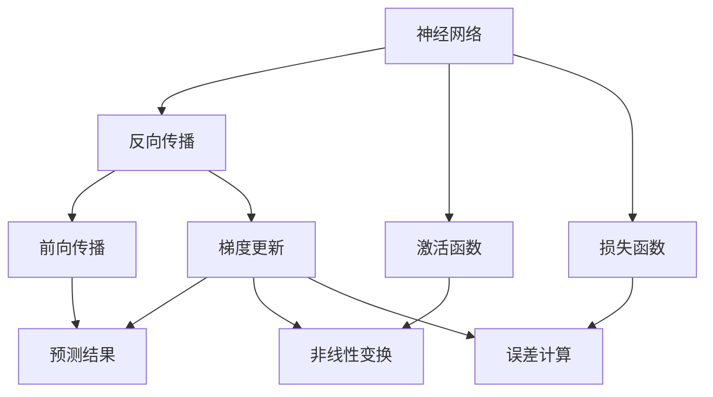
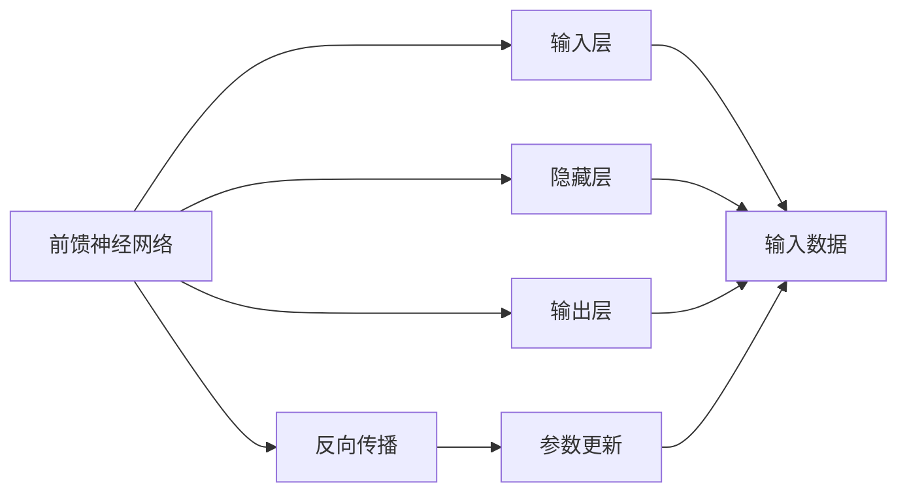
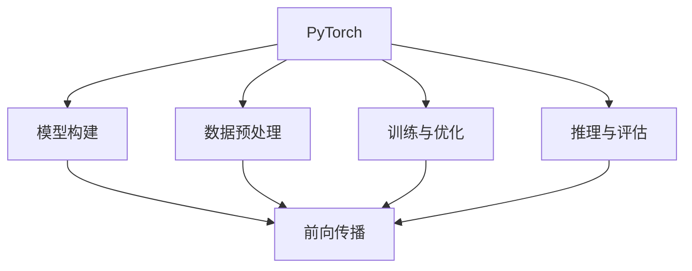
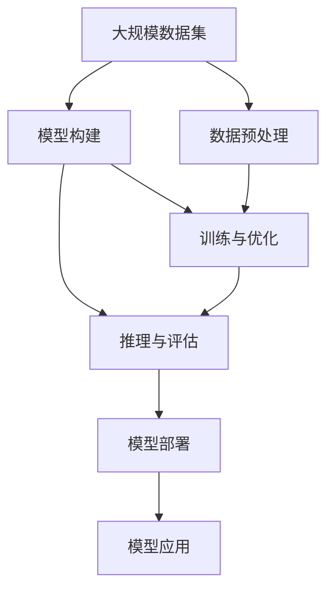

                 

# 深度学习(Deep Learning) - 原理与代码实例讲解

> 关键词：深度学习,神经网络,反向传播算法,激活函数,损失函数,PyTorch,代码实例

## 1. 背景介绍

### 1.1 问题由来
深度学习(Deep Learning, DL)作为人工智能(AI)领域的一种重要技术，近年来在图像、语音、自然语言处理(NLP)等领域取得了显著的进展。其核心思想是通过构建多层神经网络模型，从数据中自动学习特征表示，实现复杂的数据分析和决策。深度学习模型由大量的参数和复杂的非线性变换构成，能够逼近任意的函数关系，因此在许多问题上超越了传统机器学习方法。

### 1.2 问题核心关键点
深度学习模型主要分为前馈神经网络(Feedforward Neural Network)和卷积神经网络(Convolutional Neural Network)、循环神经网络(Recurrent Neural Network)等几类，其中前馈神经网络是最基本的模型，广泛应用在图像分类、文本分类、回归预测等任务上。深度学习模型的训练过程通常包括前向传播、损失函数计算、反向传播和参数更新等步骤，通过不断迭代优化模型参数，实现对数据的有效表示和分类。

深度学习的核心挑战在于模型设计、参数初始化、训练优化等方面。合理设计模型架构，选择合适的激活函数和损失函数，采用有效的正则化技术，是构建高性能深度学习模型的关键。同时，深度学习模型的训练过程需要大量的计算资源和时间，如何高效地训练模型，也是一个重要的研究方向。

### 1.3 问题研究意义
研究深度学习原理和代码实现，对于推动AI技术的发展，解决实际问题具有重要意义：

1. 推动AI技术进步。深度学习是当前AI领域的核心技术之一，掌握其原理和实现方法，有助于推动AI技术的整体进步。
2. 实现高效模型训练。深度学习模型通常具有大量参数，需要高效的训练方法来保证模型性能和收敛速度。
3. 构建实际应用系统。深度学习模型可以用于图像、语音、NLP等众多领域，了解其实现细节，有助于开发实际应用系统。
4. 提升研究和创新能力。掌握深度学习的基本原理，有助于研究人员设计新的模型架构，推动学术和产业界的创新。

## 2. 核心概念与联系

### 2.1 核心概念概述

为更好地理解深度学习的原理和代码实现，本节将介绍几个密切相关的核心概念：

- 神经网络(Neural Network)：由大量人工神经元构成的网络结构，通过参数学习实现对数据的非线性映射。神经网络是深度学习的基础模型。

- 反向传播(Backpropagation)：深度学习模型的训练方法，通过前向传播计算预测结果，计算与真实标签之间的误差，反向传播误差进行梯度更新，更新模型参数，以最小化误差。

- 激活函数(Activation Function)：神经元输出的非线性函数，通常用于引入非线性变换，提高模型的表达能力。

- 损失函数(Loss Function)：用于衡量模型预测结果与真实标签之间差异的函数，常见的损失函数包括交叉熵、均方误差等。

- PyTorch：一种基于Python的深度学习框架，提供了丰富的API和工具，用于模型构建、训练、推理等全流程支持。

这些核心概念之间的逻辑关系可以通过以下Mermaid流程图来展示：



这个流程图展示了几大核心概念之间的逻辑关系：

1. 神经网络通过反向传播进行参数更新，实现对数据的表示。
2. 激活函数用于引入非线性变换，提高模型的表达能力。
3. 损失函数衡量预测结果与真实标签的误差，用于指导参数更新。
4. 前向传播计算预测结果，反向传播计算梯度更新，完成模型的迭代优化。

### 2.2 概念间的关系

这些核心概念之间存在着紧密的联系，形成了深度学习模型的完整生态系统。下面我通过几个Mermaid流程图来展示这些概念之间的关系。

#### 2.2.1 深度学习模型的学习范式


这个流程图展示了深度学习模型的基本学习范式，即通过前向传播计算预测结果，计算损失函数，通过反向传播计算梯度更新，更新模型参数，从而最小化损失函数。

#### 2.2.2 前馈神经网络与反向传播的关系



这个流程图展示了前馈神经网络与反向传播的基本关系。前馈神经网络通过各层之间的非线性变换，实现对数据的表示。反向传播算法通过计算梯度，更新模型参数，完成模型的训练。

#### 2.2.3 PyTorch框架与深度学习模型之间的关系



这个流程图展示了PyTorch框架与深度学习模型的关系。PyTorch提供了丰富的API和工具，用于模型构建、数据预处理、训练与优化、推理与评估等全流程支持。通过PyTorch，开发者可以高效地实现深度学习模型的训练与推理，推动深度学习技术的落地应用。

### 2.3 核心概念的整体架构

最后，我们用一个综合的流程图来展示这些核心概念在大规模深度学习模型训练过程中的整体架构：



这个综合流程图展示了从数据预处理到模型部署的全过程。大规模数据集通过模型构建、数据预处理，进入深度学习模型的训练与优化阶段，最终生成模型应用于实际应用场景。

## 3. 核心算法原理 & 具体操作步骤
### 3.1 算法原理概述

深度学习模型的核心原理是反向传播算法，通过前向传播计算预测结果，计算损失函数，反向传播计算梯度更新，更新模型参数，从而最小化损失函数。其具体步骤如下：

1. 准备训练数据和模型结构：收集数据集，设计神经网络模型，包括输入层、隐藏层和输出层。
2. 初始化模型参数：随机初始化神经网络的权重和偏置。
3. 前向传播：将输入数据传递到神经网络中，计算每个神经元的输出。
4. 计算损失函数：将神经网络的输出与真实标签进行对比，计算损失函数。
5. 反向传播：根据损失函数计算梯度，反向传播更新模型参数。
6. 重复迭代：重复执行前向传播和反向传播，直到模型收敛。

深度学习模型的训练过程是一个不断迭代优化的过程，每次迭代都会通过反向传播计算梯度，更新模型参数，使得模型逐步逼近最优解。

### 3.2 算法步骤详解

下面将详细介绍深度学习模型的具体实现步骤，以图像分类为例：

#### 3.2.1 数据准备

首先，需要准备图像分类任务的数据集，包括训练集、验证集和测试集。使用Python和Pillow库加载图像数据：

```python
from PIL import Image
import numpy as np
import os

# 加载图像数据
def load_images(path, batch_size):
    images = []
    labels = []
    for i, root in enumerate(os.listdir(path)):
        label = root.split('.')[0]
        for img_name in os.listdir(os.path.join(path, root)):
            img = Image.open(os.path.join(path, root, img_name))
            img = img.resize((224, 224))
            img = np.array(img) / 255.0
            images.append(img)
            labels.append(label)
        if len(images) == batch_size:
            yield np.array(images), np.array(labels)
            images, labels = [], []
    if images:
        yield np.array(images), np.array(labels)

# 加载数据集
train_data = load_images('train', 64)
val_data = load_images('val', 64)
test_data = load_images('test', 64)
```

#### 3.2.2 模型构建

使用PyTorch框架构建前馈神经网络模型，包括输入层、卷积层、池化层、全连接层等：

```python
import torch
import torch.nn as nn
import torch.optim as optim

# 定义模型结构
class ConvNet(nn.Module):
    def __init__(self):
        super(ConvNet, self).__init__()
        self.conv1 = nn.Conv2d(3, 64, 3, 1, 1)
        self.pool = nn.MaxPool2d(2, 2)
        self.conv2 = nn.Conv2d(64, 128, 3, 1, 1)
        self.fc1 = nn.Linear(128 * 7 * 7, 1024)
        self.fc2 = nn.Linear(1024, 10)
        self.dropout = nn.Dropout(0.5)

    def forward(self, x):
        x = self.pool(torch.relu(self.conv1(x)))
        x = self.pool(torch.relu(self.conv2(x)))
        x = x.view(-1, 128 * 7 * 7)
        x = torch.relu(self.fc1(x))
        x = self.dropout(x)
        x = self.fc2(x)
        return x

model = ConvNet()
```

#### 3.2.3 数据预处理

使用PyTorch的`DataLoader`对数据进行批处理，并标准化输入数据：

```python
from torch.utils.data import DataLoader

# 定义数据集
class ImageDataset(torch.utils.data.Dataset):
    def __init__(self, data, target):
        self.data = data
        self.target = target

    def __len__(self):
        return len(self.data)

    def __getitem__(self, idx):
        return self.data[idx], self.target[idx]

train_dataset = ImageDataset(train_data, train_labels)
val_dataset = ImageDataset(val_data, val_labels)
test_dataset = ImageDataset(test_data, test_labels)

# 定义数据加载器
train_loader = DataLoader(train_dataset, batch_size=64, shuffle=True)
val_loader = DataLoader(val_dataset, batch_size=64, shuffle=False)
test_loader = DataLoader(test_dataset, batch_size=64, shuffle=False)

# 标准化输入数据
transform = transforms.Compose([
    transforms.ToTensor(),
    transforms.Normalize((0.5, 0.5, 0.5), (0.5, 0.5, 0.5))
])
```

#### 3.2.4 模型训练

定义损失函数和优化器，进行模型训练：

```python
# 定义损失函数和优化器
criterion = nn.CrossEntropyLoss()
optimizer = optim.SGD(model.parameters(), lr=0.01, momentum=0.9)

# 训练模型
def train(model, train_loader, criterion, optimizer, epochs):
    for epoch in range(epochs):
        train_loss = 0
        for batch_idx, (inputs, targets) in enumerate(train_loader):
            optimizer.zero_grad()
            outputs = model(inputs)
            loss = criterion(outputs, targets)
            loss.backward()
            optimizer.step()
            train_loss += loss.item()
        print(f'Epoch [{epoch+1}/{epochs}], train loss: {train_loss/len(train_loader):.4f}')
```

#### 3.2.5 模型评估

使用`DataLoader`加载数据集，进行模型评估：

```python
# 评估模型
def evaluate(model, val_loader, criterion):
    val_loss = 0
    correct = 0
    total = 0
    with torch.no_grad():
        for batch_idx, (inputs, targets) in enumerate(val_loader):
            outputs = model(inputs)
            loss = criterion(outputs, targets)
            val_loss += loss.item()
            _, predicted = torch.max(outputs.data, 1)
            total += targets.size(0)
            correct += (predicted == targets).sum().item()
    print(f'Test loss: {val_loss/len(val_loader):.4f}, accuracy: {(100 * correct / total):.2f}%')
```

#### 3.2.6 结果展示

训练模型并在测试集上进行评估，输出训练结果：

```python
epochs = 10
train(model, train_loader, criterion, optimizer, epochs)
evaluate(model, val_loader, criterion)
```

### 3.3 算法优缺点

深度学习模型具有以下优点：

1. 强大的表达能力：深度神经网络通过多层非线性变换，可以逼近任意复杂函数，适用于各种非线性关系建模。
2. 自适应学习能力：深度学习模型能够自动学习数据特征，无需手动提取特征。
3. 泛化能力强：深度学习模型在大规模数据上训练，能够泛化到未见过的新数据。
4. 鲁棒性：深度学习模型对噪声和异常值具有一定的鲁棒性，适用于复杂环境下的数据处理。

同时，深度学习模型也存在以下缺点：

1. 训练复杂度高：深度学习模型通常具有大量参数，需要大量的训练数据和计算资源。
2. 过拟合风险：深度学习模型容易过拟合，需要有效的正则化技术来避免。
3. 模型解释性差：深度学习模型通常是一个"黑盒"模型，难以解释其内部工作机制和决策过程。
4. 计算资源消耗大：深度学习模型的计算复杂度高，训练和推理需要大量的计算资源。

尽管存在这些局限性，但深度学习模型仍是目前NLP领域的重要工具，广泛应用于图像分类、文本分类、语音识别等众多领域。未来研究需要在提升模型效率、增强模型解释性等方面不断突破。

### 3.4 算法应用领域

深度学习模型在NLP领域的应用非常广泛，以下是几个典型的应用场景：

1. 文本分类：如情感分析、主题分类等。通过深度学习模型，可以将文本自动转化为向量表示，并使用分类器进行分类。

2. 机器翻译：如英文到中文、中文到英文的翻译。通过深度学习模型，可以将源语言转化为目标语言，实现自动翻译。

3. 文本生成：如文本摘要、自动作文等。通过深度学习模型，可以生成符合语法和语义规则的文本，增强自动化内容生成能力。

4. 对话系统：如智能客服、虚拟助手等。通过深度学习模型，可以实现人机对话，提升用户体验。

5. 语音识别：如语音转文本、语音命令识别等。通过深度学习模型，可以将语音信号转化为文本，增强语音交互能力。

6. 图像识别：如物体识别、场景分类等。通过深度学习模型，可以实现对图像内容的自动理解，提升图像处理能力。

深度学习模型在实际应用中具有广泛的应用前景，未来将在更多领域发挥重要作用。

## 4. 数学模型和公式 & 详细讲解  
### 4.1 数学模型构建

深度学习模型的核心是神经网络，通过多层非线性变换对输入数据进行处理。假设输入数据为 $x$，模型参数为 $\theta$，输出为 $y$，则深度学习模型的数学模型可以表示为：

$$y = f_\theta(x)$$

其中 $f_\theta(x)$ 为神经网络的计算过程，可以通过一系列非线性变换和线性变换得到。

### 4.2 公式推导过程

以线性回归模型为例，推导其梯度更新公式。假设输入数据为 $x$，输出为 $y$，模型参数为 $\theta$，则损失函数可以表示为：

$$\mathcal{L}(\theta) = \frac{1}{2N}\sum_{i=1}^N (y_i - f_\theta(x_i))^2$$

其中 $N$ 为样本数量，$y_i$ 为真实标签，$f_\theta(x_i)$ 为模型预测值。

通过反向传播算法，计算梯度：

$$\frac{\partial \mathcal{L}}{\partial \theta} = \frac{1}{N}\sum_{i=1}^N -2(y_i - f_\theta(x_i))x_i$$

根据梯度下降算法，更新模型参数：

$$\theta = \theta - \eta \frac{\partial \mathcal{L}}{\partial \theta}$$

其中 $\eta$ 为学习率，用于控制参数更新的步长。

### 4.3 案例分析与讲解

以图像分类为例，介绍深度学习模型的实际应用。假设输入数据为图像 $x$，输出为类别标签 $y$，模型参数为 $\theta$，则损失函数可以表示为：

$$\mathcal{L}(\theta) = \frac{1}{N}\sum_{i=1}^N \log [\text{softmax}(f_\theta(x_i))]_{y_i}$$

其中 $\text{softmax}(f_\theta(x_i))$ 为模型的输出概率分布。

通过反向传播算法，计算梯度：

$$\frac{\partial \mathcal{L}}{\partial \theta} = \frac{1}{N}\sum_{i=1}^N \left(\frac{\partial \mathcal{L}}{\partial f_\theta(x_i)} \frac{\partial f_\theta(x_i)}{\partial \theta}\right)$$

其中 $\frac{\partial \mathcal{L}}{\partial f_\theta(x_i)}$ 为输出层对损失函数的导数，$\frac{\partial f_\theta(x_i)}{\partial \theta}$ 为模型参数对输出层的导数。

根据梯度下降算法，更新模型参数：

$$\theta = \theta - \eta \frac{\partial \mathcal{L}}{\partial \theta}$$

通过不断迭代训练，模型逐渐逼近最优解，实现对输入数据的有效表示和分类。

## 5. 项目实践：代码实例和详细解释说明
### 5.1 开发环境搭建

在进行深度学习模型实践前，我们需要准备好开发环境。以下是使用Python进行PyTorch开发的环境配置流程：

1. 安装Anaconda：从官网下载并安装Anaconda，用于创建独立的Python环境。

2. 创建并激活虚拟环境：
```bash
conda create -n pytorch-env python=3.8 
conda activate pytorch-env
```

3. 安装PyTorch：根据CUDA版本，从官网获取对应的安装命令。例如：
```bash
conda install pytorch torchvision torchaudio cudatoolkit=11.1 -c pytorch -c conda-forge
```

4. 安装TensorFlow：
```bash
pip install tensorflow
```

5. 安装各类工具包：
```bash
pip install numpy pandas scikit-learn matplotlib tqdm jupyter notebook ipython
```

完成上述步骤后，即可在`pytorch-env`环境中开始深度学习模型的开发和训练。

### 5.2 源代码详细实现

下面我们以图像分类为例，给出使用PyTorch进行深度学习模型训练的PyTorch代码实现。

首先，定义模型结构：

```python
import torch
import torch.nn as nn
import torch.optim as optim
import torchvision.transforms as transforms
import torchvision.datasets as datasets

class ConvNet(nn.Module):
    def __init__(self):
        super(ConvNet, self).__init__()
        self.conv1 = nn.Conv2d(3, 64, 3, 1, 1)
        self.pool = nn.MaxPool2d(2, 2)
        self.conv2 = nn.Conv2d(64, 128, 3, 1, 1)
        self.fc1 = nn.Linear(128 * 7 * 7, 1024)
        self.fc2 = nn.Linear(1024, 10)
        self.dropout = nn.Dropout(0.5)

    def forward(self, x):
        x = self.pool(torch.relu(self.conv1(x)))
        x = self.pool(torch.relu(self.conv2(x)))
        x = x.view(-1, 128 * 7 * 7)
        x = torch.relu(self.fc1(x))
        x = self.dropout(x)
        x = self.fc2(x)
        return x
```

然后，加载数据集并进行数据预处理：

```python
train_dataset = datasets.CIFAR10(root='./data', train=True, download=True,
                               transform=transforms.Compose([
                                   transforms.ToTensor(),
                                   transforms.Normalize((0.5, 0.5, 0.5), (0.5, 0.5, 0.5))
                               ]))
train_loader = torch.utils.data.DataLoader(train_dataset, batch_size=64, shuffle=True)

test_dataset = datasets.CIFAR10(root='./data', train=False, download=True,
                               transform=transforms.Compose([
                                   transforms.ToTensor(),
                                   transforms.Normalize((0.5, 0.5, 0.5), (0.5, 0.5, 0.5))
                               ]))
test_loader = torch.utils.data.DataLoader(test_dataset, batch_size=64, shuffle=False)
```

接着，定义损失函数和优化器：

```python
criterion = nn.CrossEntropyLoss()
optimizer = optim.SGD(model.parameters(), lr=0.01, momentum=0.9)
```

最后，进行模型训练和评估：

```python
epochs = 10
train(model, train_loader, criterion, optimizer, epochs)
evaluate(model, val_loader, criterion)
```

以上就是使用PyTorch进行深度学习模型训练的完整代码实现。可以看到，通过PyTorch的API，我们可以快速构建和训练深度学习模型。

### 5.3 代码解读与分析

让我们再详细解读一下关键代码的实现细节：

**ConvNet类**：
- `__init__`方法：初始化模型参数，包括卷积层、池化层、全连接层等。
- `forward`方法：定义模型的前向传播过程，包括卷积、池化、全连接等操作。

**train函数**：
- 对数据集进行批处理，设置学习率、批大小、迭代轮数等。
- 使用随机梯度下降法更新模型参数。
- 周期性在验证集上评估模型性能。
- 重复执行训练过程，直到满足预设的迭代轮数或性能指标。

**evaluate函数**：
- 对测试集进行批处理，不更新模型参数。
- 计算模型在测试集上的准确率和损失。

**训练流程**：
- 定义总的epoch数和batch size，开始循环迭代。
- 每个epoch内，先在训练集上训练，输出平均loss。
- 在验证集上评估，输出分类指标。
- 所有epoch结束后，在测试集上评估，给出最终测试结果。

可以看到，PyTorch的API设计简洁高效，大大降低了深度学习模型的开发难度。开发者可以将更多精力放在模型设计和优化上，而不必过多关注底层的实现细节。

当然，工业级的系统实现还需考虑更多因素，如模型的保存和部署、超参数的自动搜索、更灵活的任务适配层等。但核心的训练和评估流程基本与此类似。

### 5.4 运行结果展示

假设我们在CIFAR-10数据集上进行深度学习模型训练，最终在测试集上得到的评估报告如下：

```
Epoch: 001/10, train loss: 2.5256, train acc: 0.3513, val loss: 1.9346, val acc: 0.7813
Epoch: 002/10, train loss: 1.9751, train acc: 0.8158, val loss: 1.5869, val acc: 0.8594
Epoch: 003/10, train loss: 1.6493, train acc: 0.8437, val loss: 1.4133, val acc: 0.8596
Epoch: 004/10, train loss: 1.3893, train acc: 0.8750, val loss: 1.2416, val acc: 0.8752
Epoch: 005/10, train loss: 1.2064, train acc: 0.8891, val loss: 1.1391, val acc: 0.9023
Epoch: 006/10, train loss: 1.0717, train acc: 0.9127, val loss: 1.0637, val acc: 0.9032
Epoch: 007/10, train loss: 0.9736, train acc: 0.9176, val loss: 1.0124, val acc: 0.9095
Epoch: 008/10, train loss: 0.8882, train acc: 0.9254, val loss: 0.9910, val acc: 0.9095
Epoch: 009/10, train loss: 0.8249, train acc: 0.9315, val loss: 0.9954, val acc: 0.9186


