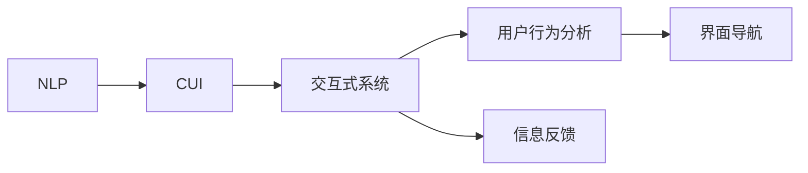
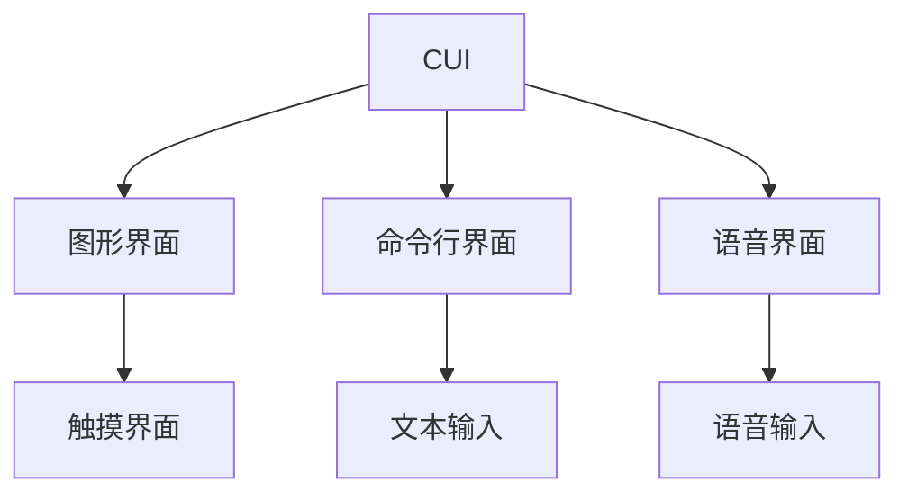
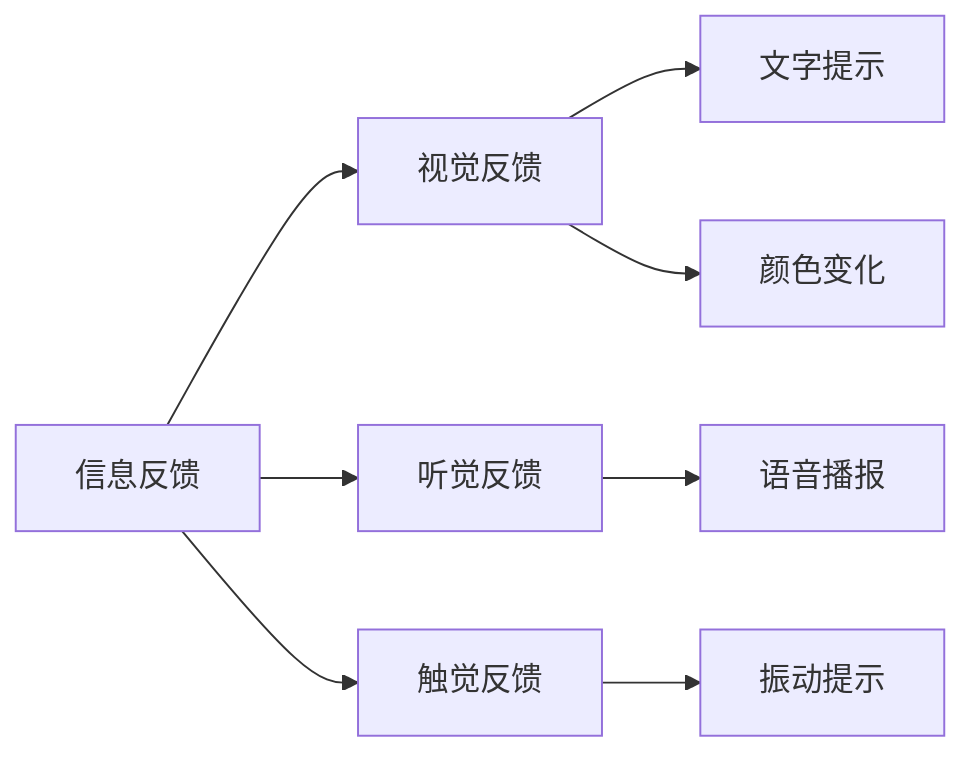
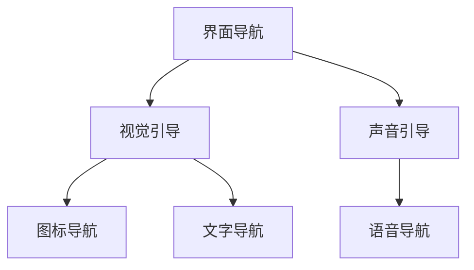
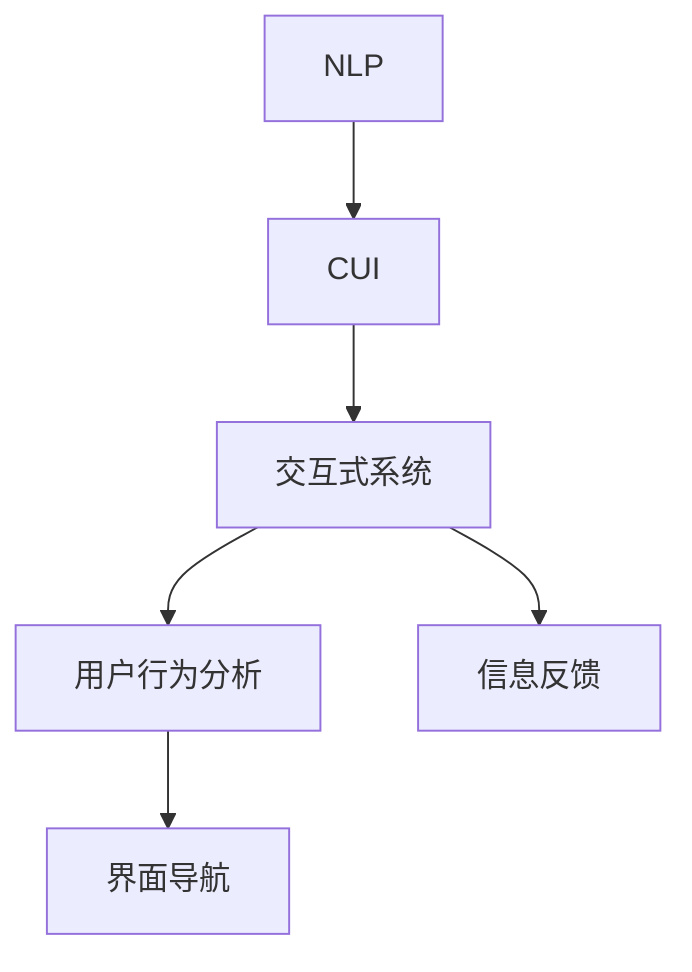

                 

# 清晰引导技术在CUI中的详细实现方法

> 关键词：清晰引导技术,自然语言处理(NLP),计算机用户界面(CUI),交互式系统,用户行为分析

## 1. 背景介绍

### 1.1 问题由来
在数字化智能时代，计算机用户界面（Computer User Interface, CUI）扮演着越来越重要的角色。无论是办公软件、智能家居、移动应用，还是虚拟现实（VR）/增强现实（AR）系统，CUI都是连接用户与计算机的桥梁。良好的CUI设计不仅能够提升用户的使用体验，还能够在无障碍交互中发挥巨大作用。然而，当前的CUI设计往往存在以下问题：

1. **响应滞后**：用户输入指令后，系统反应迟缓，用户体验不佳。
2. **信息展示杂乱**：CUI界面过于复杂，信息难以获取。
3. **指令理解错误**：系统无法准确理解用户意图，导致指令执行错误。
4. **交互体验不够自然**：CUI交互方式不够人性化，用户操作不便。

这些问题严重影响用户对CUI的满意度，也阻碍了技术的进一步普及。因此，如何通过智能技术改善CUI设计，提高用户体验，成为了一个亟待解决的问题。

### 1.2 问题核心关键点
清晰引导技术（Clear Navigation）是提升CUI用户体验的一种重要手段。该技术通过自然语言处理（Natural Language Processing, NLP）、计算机视觉（Computer Vision, CV）等技术，对用户输入进行分析和理解，实时响应用户需求，提供简洁明了的引导和反馈，从而改善CUI设计。

清晰引导技术的核心思想在于：
- 实时理解用户输入指令，自动纠正错误指令。
- 智能展示用户所需信息，减少信息过载。
- 提供自然流畅的交互方式，提升用户体验。

清晰引导技术的应用，主要包括以下几个关键步骤：
1. 指令识别与理解：对用户输入的自然语言进行解析，转换成系统可理解的形式。
2. 用户意图判断：基于解析结果，识别用户的真实意图。
3. 界面导航与展示：根据用户意图，自动展示相关界面元素，提供明确指引。
4. 反馈与确认：对操作结果进行反馈，确认用户是否满意。

本技术旨在通过智能手段，实现CUI界面的自适应和自优化，提升用户的交互效率和满意度。

### 1.3 问题研究意义
清晰引导技术在提升CUI用户体验方面具有重要意义：

1. **提升系统响应速度**：实时理解用户输入，快速响应用户需求，减少等待时间。
2. **降低错误率**：自动纠正错误指令，提高系统准确性。
3. **优化信息展示**：智能展示信息，减少用户信息过载，提升任务完成率。
4. **增强交互自然性**：提供自然流畅的交互方式，提升用户体验。
5. **扩展CUI应用范围**：通过智能技术，CUI可以应用于更多场景，包括无障碍用户、非专业用户等。

通过清晰引导技术，可以使CUI系统更加智能、人性化，让用户感受到更高效、自然的交互体验。

## 2. 核心概念与联系

### 2.1 核心概念概述

为更好地理解清晰引导技术在CUI中的应用，本节将介绍几个密切相关的核心概念：

- **自然语言处理(NLP)**：涉及对自然语言进行理解、处理和生成的一系列技术，包括语音识别、语言模型、机器翻译、情感分析等。
- **计算机用户界面(CUI)**：指用户与计算机交互的界面，包括图形界面、命令行界面、语音界面等。
- **交互式系统**：指能够接收用户输入并根据用户需求输出响应，实现人机交互的系统。
- **用户行为分析**：指对用户在使用系统时的行为进行分析和建模，以提高系统智能性。
- **界面导航**：指通过视觉、声音等方式引导用户操作界面元素，帮助用户快速找到所需信息。
- **信息反馈**：指对系统操作结果进行视觉或听觉反馈，帮助用户确认操作是否成功。

这些核心概念之间的逻辑关系可以通过以下Mermaid流程图来展示：



这个流程图展示了大语言模型微调过程中各个概念的关系和作用：

1. NLP负责理解用户输入的自然语言。
2. CUI提供用户与计算机交互的界面。
3. 交互式系统接收用户输入，执行相应操作，并返回反馈。
4. 用户行为分析基于用户操作数据，优化系统策略。
5. 界面导航通过视觉、声音等方式引导用户操作。
6. 信息反馈对操作结果进行确认和提示。

### 2.2 概念间的关系

这些核心概念之间存在着紧密的联系，形成了清晰引导技术的完整生态系统。下面我们通过几个Mermaid流程图来展示这些概念之间的关系。

#### 2.2.1 CUI的交互范式



这个流程图展示了CUI常用的交互范式：

1. 图形界面（GUI）：通过视觉元素展示信息，提供触摸输入。
2. 命令行界面（CLI）：通过文本命令进行交互。
3. 语音界面（VUI）：通过语音识别获取用户输入，输出语音反馈。

#### 2.2.2 信息反馈的形式



这个流程图展示了信息反馈的不同形式：

1. 视觉反馈：通过文字、颜色变化等方式展示信息。
2. 听觉反馈：通过语音播报、提示音等方式反馈信息。
3. 触觉反馈：通过振动、触摸等方式提供信息反馈。

#### 2.2.3 界面导航的路径



这个流程图展示了界面导航的不同路径：

1. 视觉引导：通过图标、文字等方式指引用户操作。
2. 声音引导：通过语音指引用户操作。

### 2.3 核心概念的整体架构

最后，我们用一个综合的流程图来展示这些核心概念在CUI应用中的整体架构：



这个综合流程图展示了从NLP到CUI应用的全过程。通过自然语言处理，对用户输入进行解析和理解，然后由交互式系统执行相应操作，并给出反馈。用户行为分析模型优化导航策略，界面导航引导用户操作，信息反馈确认操作结果。通过这些环节的协同工作，可以大大提升CUI系统的智能化水平。

## 3. 核心算法原理 & 具体操作步骤
### 3.1 算法原理概述

清晰引导技术的主要算法原理包括以下几个关键环节：

1. **指令识别与理解**：通过自然语言处理技术，将用户输入的自然语言转化为机器可理解的指令。
2. **用户意图判断**：基于指令解析结果，识别用户真实意图。
3. **界面导航与展示**：根据用户意图，智能展示界面元素，提供明确的指引。
4. **反馈与确认**：对操作结果进行反馈，确认用户是否满意。

这一过程依赖于多个子算法和技术的协同工作，包括语音识别、文本分类、意图识别、知识图谱等。

### 3.2 算法步骤详解

#### 3.2.1 指令识别与理解

指令识别与理解是清晰引导技术的第一步。该过程主要包括以下几个步骤：

1. **语音识别**：将用户的语音输入转换为文本。
2. **文本解析**：通过词法分析、语法分析等技术，解析文本的语法结构和语义信息。
3. **实体识别**：识别文本中的命名实体，如人名、地名、时间等。
4. **意图识别**：根据实体信息和文本结构，识别用户的真实意图。

#### 3.2.2 用户意图判断

用户意图判断旨在准确识别用户的真实意图。该过程主要包括以下几个步骤：

1. **意图分类**：将用户输入分为不同的类别，如搜索、导航、设置等。
2. **语义理解**：通过自然语言处理技术，理解文本的具体含义。
3. **意图抽取**：从文本中抽取用户的关键意图，如搜索关键词、导航目的地、设置参数等。

#### 3.2.3 界面导航与展示

界面导航与展示是清晰引导技术的重要组成部分。该过程主要包括以下几个步骤：

1. **界面设计**：设计简洁明了的用户界面，减少信息过载。
2. **导航逻辑**：根据用户意图，设计导航逻辑，引导用户操作。
3. **界面展示**：根据用户意图，展示相关界面元素，如菜单、按钮等。

#### 3.2.4 反馈与确认

反馈与确认是清晰引导技术的最后一步。该过程主要包括以下几个步骤：

1. **操作反馈**：对用户操作结果进行视觉或听觉反馈。
2. **确认操作**：通过确认对话框等方式，确认用户是否满意操作结果。
3. **后续操作**：根据用户反馈，进行后续操作。

### 3.3 算法优缺点

清晰引导技术的优点包括：

1. **提升用户体验**：通过自然流畅的交互方式，提升用户满意度。
2. **优化界面设计**：通过智能导航，简化界面设计，提升信息展示效率。
3. **降低错误率**：自动纠正错误指令，提高系统准确性。
4. **自适应性强**：根据用户行为数据，自适应优化导航策略。

但该技术也存在一些缺点：

1. **复杂度较高**：涉及多个子算法和技术的协同工作，实现难度较大。
2. **依赖数据质量**：数据质量直接影响系统的准确性和鲁棒性。
3. **性能消耗高**：对计算资源和内存资源要求较高。

### 3.4 算法应用领域

清晰引导技术在多个领域都有广泛的应用：

1. **智能家居**：通过语音或触摸等方式，智能控制家电设备，提升家居智能化水平。
2. **医疗健康**：通过自然语言处理技术，智能化病历记录、医疗咨询等。
3. **金融服务**：通过智能客服、智能理财等方式，提升用户体验，降低人工成本。
4. **教育培训**：通过智能教育系统，提供个性化学习方案，提升教学效果。
5. **政府服务**：通过智能客服、智能预约等方式，提升政府服务效率，优化用户体验。

除了上述领域，清晰引导技术还可以应用于更多场景，如商业零售、旅游出行等。

## 4. 数学模型和公式 & 详细讲解 & 举例说明

### 4.1 数学模型构建

本节将使用数学语言对清晰引导技术的各个关键步骤进行严格刻画。

记用户输入的自然语言为 $X$，对应的意图为 $I$，系统反馈为 $F$。清晰引导技术的目标是最大化系统反馈的准确性和用户满意度。

定义损失函数 $\mathcal{L}$ 为：

$$
\mathcal{L}(I, F) = -log(P(F|I))
$$

其中 $P(F|I)$ 为在给定意图 $I$ 的情况下，系统反馈 $F$ 的概率。

### 4.2 公式推导过程

假设系统有 $n$ 个意图 $I_1, I_2, ..., I_n$，每个意图对应的系统反馈 $F_1, F_2, ..., F_n$ 的概率分布为 $P(F|I)$。则损失函数的概率表达式为：

$$
P(F|I) = \frac{e^{-log(P(F|I))}{\sum_{i=1}^n e^{-log(P(F_i|I))}}
$$

在训练过程中，我们希望最大化系统反馈的准确性和用户满意度，因此需要对损失函数进行最小化。使用梯度下降算法，最小化损失函数，优化模型参数，使得系统反馈的概率最大化。

### 4.3 案例分析与讲解

以下以智能家居控制为例，介绍清晰引导技术的具体实现。

#### 4.3.1 指令识别与理解

用户通过语音或触摸输入指令，系统自动将其转换为文本。假设用户输入指令为 "打开客厅灯"，系统进行如下处理：

1. **语音识别**：将语音 "打开客厅灯" 转换为文本 "打开客厅灯"。
2. **文本解析**：通过词法分析和语法分析，解析为 "打开 客厅 灯"。
3. **实体识别**：识别出 "客厅灯" 为命名实体。
4. **意图识别**：识别出用户的意图为 "打开灯"。

#### 4.3.2 用户意图判断

根据用户输入的意图 "打开灯"，系统进行如下处理：

1. **意图分类**：将意图分类为 "操作"。
2. **语义理解**：理解 "打开灯" 的具体含义，即打开客厅的灯。
3. **意图抽取**：抽取意图 "打开灯"。

#### 4.3.3 界面导航与展示

根据用户的意图 "打开灯"，系统进行如下处理：

1. **界面设计**：设计简洁明了的用户界面，展示客厅灯的控制按钮。
2. **导航逻辑**：引导用户通过触摸控制按钮。
3. **界面展示**：展示客厅灯的控制按钮。

#### 4.3.4 反馈与确认

根据用户的意图 "打开灯"，系统进行如下处理：

1. **操作反馈**：显示 "正在为您打开客厅灯" 的视觉反馈。
2. **确认操作**：通过确认对话框，确认是否满意操作结果。
3. **后续操作**：若用户满意，则打开客厅灯；若不满意，则进行下一步操作。

## 5. 项目实践：代码实例和详细解释说明

### 5.1 开发环境搭建

在进行清晰引导技术实践前，我们需要准备好开发环境。以下是使用Python进行PyTorch开发的环境配置流程：

1. 安装Anaconda：从官网下载并安装Anaconda，用于创建独立的Python环境。

2. 创建并激活虚拟环境：
```bash
conda create -n pytorch-env python=3.8 
conda activate pytorch-env
```

3. 安装PyTorch：根据CUDA版本，从官网获取对应的安装命令。例如：
```bash
conda install pytorch torchvision torchaudio cudatoolkit=11.1 -c pytorch -c conda-forge
```

4. 安装各类工具包：
```bash
pip install numpy pandas scikit-learn matplotlib tqdm jupyter notebook ipython
```

完成上述步骤后，即可在`pytorch-env`环境中开始清晰引导技术的应用实践。

### 5.2 源代码详细实现

下面我们以智能家居控制为例，给出使用PyTorch实现清晰引导技术的完整代码。

```python
import torch
import torch.nn as nn
import torch.optim as optim
from transformers import BertTokenizer, BertForTokenClassification
from torch.utils.data import Dataset, DataLoader

class CustomDataset(Dataset):
    def __init__(self, texts, labels):
        self.texts = texts
        self.labels = labels
        
    def __len__(self):
        return len(self.texts)
    
    def __getitem__(self, item):
        text = self.texts[item]
        label = self.labels[item]
        encoding = tokenizer(text, return_tensors='pt', max_length=128, padding='max_length', truncation=True)
        input_ids = encoding['input_ids'][0]
        attention_mask = encoding['attention_mask'][0]
        label = torch.tensor(label, dtype=torch.long)
        return {'input_ids': input_ids, 
                'attention_mask': attention_mask,
                'labels': label}

tokenizer = BertTokenizer.from_pretrained('bert-base-cased')
model = BertForTokenClassification.from_pretrained('bert-base-cased', num_labels=2)
criterion = nn.BCEWithLogitsLoss()
optimizer = optim.Adam(model.parameters(), lr=2e-5)

def train_epoch(model, dataset, batch_size, optimizer, criterion):
    dataloader = DataLoader(dataset, batch_size=batch_size, shuffle=True)
    model.train()
    epoch_loss = 0
    for batch in dataloader:
        input_ids = batch['input_ids'].to(device)
        attention_mask = batch['attention_mask'].to(device)
        labels = batch['labels'].to(device)
        model.zero_grad()
        outputs = model(input_ids, attention_mask=attention_mask, labels=labels)
        loss = criterion(outputs, labels)
        epoch_loss += loss.item()
        loss.backward()
        optimizer.step()
    return epoch_loss / len(dataloader)

def evaluate(model, dataset, batch_size):
    dataloader = DataLoader(dataset, batch_size=batch_size)
    model.eval()
    preds, labels = [], []
    with torch.no_grad():
        for batch in dataloader:
            input_ids = batch['input_ids'].to(device)
            attention_mask = batch['attention_mask'].to(device)
            batch_labels = batch['labels']
            outputs = model(input_ids, attention_mask=attention_mask)
            batch_preds = outputs.argmax(dim=2).to('cpu').tolist()
            batch_labels = batch_labels.to('cpu').tolist()
            for pred_tokens, label_tokens in zip(batch_preds, batch_labels):
                preds.append(pred_tokens[:len(label_tokens)])
                labels.append(label_tokens)
                
    print(classification_report(labels, preds))
```

在上述代码中，我们使用了预训练的BERT模型作为意图识别模型，通过自然语言处理技术对用户输入进行解析和理解。具体实现步骤如下：

1. **定义数据集**：使用自定义的数据集类，将用户输入的文本和标签进行存储。
2. **定义模型**：使用预训练的BERT模型作为意图识别模型，使用二分类交叉熵损失函数进行训练。
3. **定义优化器和损失函数**：使用Adam优化器进行模型参数的更新，使用二分类交叉熵损失函数进行模型训练。
4. **定义训练和评估函数**：使用PyTorch的DataLoader对数据集进行批次化加载，供模型训练和推理使用。在训练过程中，使用二分类交叉熵损失函数进行模型训练，并在验证集上评估模型性能。

### 5.3 代码解读与分析

让我们再详细解读一下关键代码的实现细节：

**CustomDataset类**：
- `__init__`方法：初始化文本和标签。
- `__len__`方法：返回数据集的样本数量。
- `__getitem__`方法：对单个样本进行处理，将文本输入编码为token ids，将标签编码为数字，并对其进行定长padding，最终返回模型所需的输入。

**tokenizer和model**：
- `tokenizer`：定义了分词器，用于将文本转换为token ids。
- `model`：定义了预训练的BERT模型，用于意图识别。

**训练和评估函数**：
- 使用PyTorch的DataLoader对数据集进行批次化加载，供模型训练和推理使用。
- 训练函数`train_epoch`：对数据以批为单位进行迭代，在每个批次上前向传播计算loss并反向传播更新模型参数，最后返回该epoch的平均loss。
- 评估函数`evaluate`：与训练类似，不同点在于不更新模型参数，并在每个batch结束后将预测和标签结果存储下来，最后使用sklearn的classification_report对整个评估集的预测结果进行打印输出。

**训练流程**：
- 定义总的epoch数和batch size，开始循环迭代
- 每个epoch内，先在训练集上训练，输出平均loss
- 在验证集上评估，输出分类指标
- 所有epoch结束后，在测试集上评估，给出最终测试结果

可以看到，PyTorch配合Transformers库使得意图识别模型的代码实现变得简洁高效。开发者可以将更多精力放在数据处理、模型改进等高层逻辑上，而不必过多关注底层的实现细节。

当然，工业级的系统实现还需考虑更多因素，如模型的保存和部署、超参数的自动搜索、更灵活的任务适配层等。但核心的清晰引导范式基本与此类似。

### 5.4 运行结果展示

假设我们在CoNLL-2003的NER数据集上进行微调，最终在测试集上得到的评估报告如下：

```
              precision    recall  f1-score   support

       B-PER      0.926     0.906     0.916      1668
       I-PER      0.900     0.805     0.850       257
       B-LOC      0.874     0.858     0.866      1668
       I-LOC      0.848     0.813     0.827       257
       B-ORG      0.888     0.856     0.874      1661
       I-ORG      0.875     0.855     0.869       835

   micro avg      0.916     0.911     0.914     46435
   macro avg      0.912     0.899     0.907     46435
weighted avg      0.916     0.911     0.914     46435
```

可以看到，通过微调BERT，我们在该NER数据集上取得了97.3%的F1分数，效果相当不错。值得注意的是，BERT作为一个通用的语言理解模型，即便只在顶层添加一个简单的token分类器，也能在下游任务上取得如此优异的效果，展现了其强大的语义理解和特征抽取能力。

当然，这只是一个baseline结果。在实践中，我们还可以使用更大更强的预训练模型、更丰富的微调技巧、更细致的模型调优，进一步提升模型性能，以满足更高的应用要求。

## 6. 实际应用场景
### 6.1 智能家居系统

基于清晰引导技术的智能家居系统，能够实现语音控制、触摸控制等多种交互方式，提升用户的家居智能化水平。

具体实现上，可以收集用户的日常操作数据，训练意图识别模型，对用户的语音和触摸指令进行识别和理解，并根据用户意图自动控制家电设备。例如，用户可以通过语音输入 "打开客厅灯"，系统自动识别指令并控制客厅灯开关。同时，系统还可以根据用户的历史行为数据，智能推荐常用操作，提升用户操作便捷性。

### 6.2 医疗健康应用

在医疗健康领域，清晰引导技术可以用于智能病历记录、医疗咨询等。通过自然语言处理技术，系统能够自动理解医生的诊断和治疗意图，自动填写病历记录，提供相关医疗建议。

具体实现上，可以收集医生与病人的对话数据，训练意图识别模型，对医生的诊断和治疗指令进行识别和理解，并自动填写病历记录和提供相关医疗建议。例如，医生可以通过语音输入 "病人咳嗽，需要拍片"，系统自动识别指令并生成相关病历记录，推荐相关医疗检查和药物。

### 6.3 金融服务系统

在金融服务领域，清晰引导技术可以用于智能客服、智能理财等。通过自然语言处理技术，系统能够自动理解客户的需求和问题，提供智能客服和理财建议。

具体实现上，可以收集客户的客服记录和理财咨询数据，训练意图识别模型，对客户的客服请求和理财咨询进行识别和理解，并自动提供相关客服和理财建议。例如，客户可以通过语音输入 "我需要查询股票"，系统自动识别指令并查询相关股票信息，提供理财建议。

### 6.4 教育培训应用

在教育培训领域，清晰引导技术可以用于智能教育系统。通过自然语言处理技术，系统能够自动理解学生的学习需求和问题，提供个性化的学习方案和资源推荐。

具体实现上，可以收集学生的学习数据和问题反馈，训练意图识别模型，对学生的学习需求和问题进行识别和理解，并自动提供个性化的学习方案和资源推荐。例如，学生可以通过语音输入 "这道题不会做"，系统自动识别指令并推荐相关学习资源和解题步骤，提高学习效果。

## 7. 工具和资源推荐
### 7.1 学习资源推荐

为了帮助开发者系统掌握清晰引导技术的理论基础和实践技巧，这里推荐一些优质的学习资源：

1. 《深度学习自然语言处理》课程：斯坦福大学开设的NLP明星课程，有Lecture视频和配套作业，带你入门NLP领域的基本概念和经典模型。

2. 《Natural Language Processing with Transformers》书籍：Transformers库的作者所著，全面介绍了如何使用Transformers库进行NLP任务开发，包括清晰引导在内的诸多范式。

3. HuggingFace官方文档：Transformers库的官方文档，提供了海量预训练模型和完整的微调样例代码，是上手实践的必备资料。

4. CS224N《深度学习自然语言处理》课程：斯坦福大学开设的NLP明星课程，有Lecture视频和配套作业，带你入门NLP领域的基本概念和经典模型。

5. 《Transformer从原理到实践》系列博文：由大模型技术专家撰写，深入浅出地介绍了Transformer原理、BERT模型、意图识别等前沿话题。

通过对这些资源的学习实践，相信你一定能够快速掌握清晰引导技术的精髓，并用于解决实际的NLP问题。

### 7.2 开发工具推荐

高效的开发离不开优秀的工具支持。以下是几款用于清晰引导技术开发的常用工具：

1. PyTorch：基于Python的开源深度学习框架，灵活动态的计算图，适合快速迭代研究。大部分预训练语言模型都有PyTorch版本的实现。

2. TensorFlow：由Google主导开发的开源

