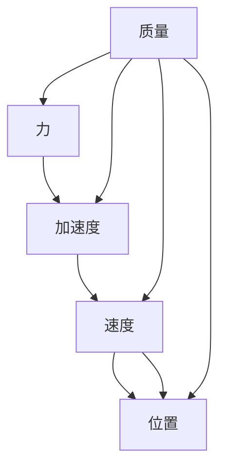
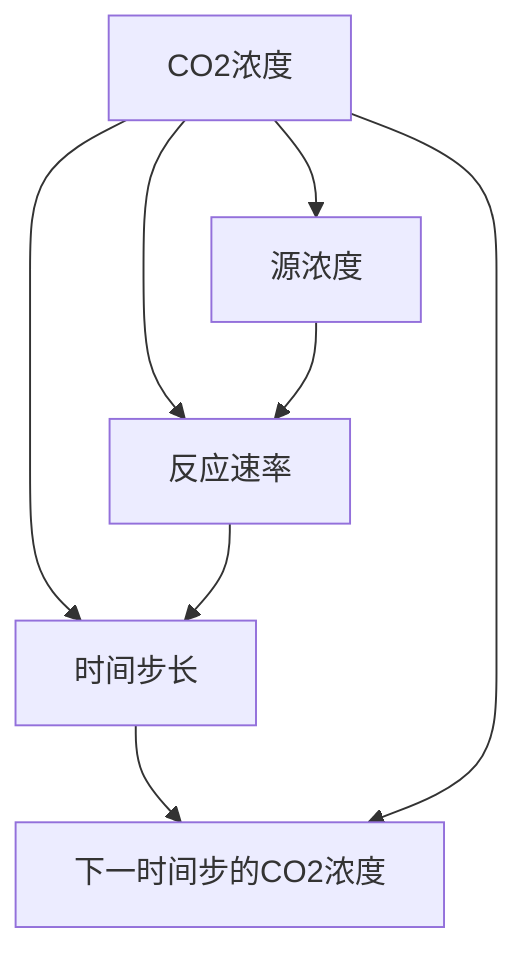

                 

# 物理基础在AI创新中的作用

## 1. 背景介绍

人工智能（AI）是近年来科技领域最为瞩目的研究方向之一，其核心在于构建能够模拟、延伸人类智能的机器系统。随着AI技术在各个领域的深入应用，其原理、方法和技术也逐步从经验驱动向理论驱动转变。在AI创新的浪潮中，物理基础的作用愈发显著。

## 2. 核心概念与联系

### 2.1 核心概念概述

- **人工智能**：使用计算机系统模拟人类智能的决策、学习、推理和感知能力，包括机器学习、深度学习、强化学习等多种技术。
- **物理基础**：包括经典力学、量子力学、热力学等，为人工智能提供了重要的数学工具和物理模型。
- **神经网络**：受到生物神经系统的启发，通过模拟神经元的连接和激活机制，实现数据的处理和模式识别。
- **优化算法**：如梯度下降、Adam、SGD等，用于优化神经网络的权重，提高模型性能。
- **深度学习**：建立在多层神经网络基础上的机器学习方法，能够自动提取数据中的特征和模式。
- **强化学习**：通过与环境的互动，学习最优决策策略的机器学习范式。

这些概念之间存在密切联系。物理基础为神经网络和深度学习提供了必要的数学框架，优化算法保证了神经网络的参数更新策略，而深度学习和强化学习则在实际应用中展现了强大的能力。

### 2.2 核心概念的联系

#### 2.2.1 数学基础

物理学的数学模型和方法，为人工智能提供了强大的数学工具。例如，梯度下降算法就来源于微积分中的导数概念，优化算法的收敛性分析依赖于线性代数和泛函分析等数学工具。

#### 2.2.2 物理模型

物理学中的许多模型，如量子力学中的波函数、统计物理学中的配分函数，都可以被借鉴用于人工智能模型中。例如，神经网络中的能量函数和熵函数，就借鉴了物理学的能量和熵概念。

#### 2.2.3 仿生学应用

生物神经系统的结构和功能为神经网络和深度学习提供了灵感。例如，人脑中的突触连接、神经元传递和反馈机制，被用来设计深度神经网络的结构和激活函数。

#### 2.2.4 数据驱动与物理驱动

尽管深度学习在实际应用中取得了巨大成功，但其本质上仍是一种数据驱动的模型。物理基础提供了从数据到物理模型再到深度学习模型的桥梁，使得AI技术更加全面和系统。

## 3. 核心算法原理 & 具体操作步骤

### 3.1 算法原理概述

基于物理基础的AI算法，通常以以下几个步骤为主：

1. **数据收集与预处理**：收集实际问题中的数据，并进行预处理，如归一化、标准化等。
2. **模型选择与设计**：根据问题的物理特性，选择合适的数学模型和物理模型，并进行相应的设计。
3. **参数优化**：使用梯度下降等优化算法，对模型参数进行优化，提高模型的预测能力。
4. **模型验证与评估**：在测试集上验证模型的性能，使用损失函数等指标评估模型。
5. **模型部署与应用**：将模型部署到实际应用中，进行问题解决或决策支持。

### 3.2 算法步骤详解

**Step 1: 数据收集与预处理**

- **数据收集**：收集与问题相关的实验数据或仿真数据，例如从传感器、历史记录、模拟实验中获取数据。
- **数据预处理**：对数据进行清洗、归一化、去噪等预处理，确保数据的质量和一致性。

**Step 2: 模型选择与设计**

- **物理模型**：根据问题的物理特性，选择合适的物理模型，如牛顿力学、麦克斯韦方程组等。
- **数学模型**：将物理模型转化为数学模型，如微分方程、偏微分方程等。
- **神经网络模型**：将数学模型转化为神经网络模型，设计合适的网络结构、激活函数和损失函数。

**Step 3: 参数优化**

- **优化算法**：使用梯度下降、Adam、SGD等优化算法，对模型参数进行优化。
- **正则化**：使用L2正则化、Dropout等技术，防止过拟合，提高模型的泛化能力。
- **学习率调节**：根据优化算法和模型复杂度，调节学习率，确保参数更新效果。

**Step 4: 模型验证与评估**

- **验证集划分**：将数据集分为训练集、验证集和测试集，确保模型的泛化能力。
- **损失函数**：设计合适的损失函数，如均方误差、交叉熵等，用于评估模型的预测性能。
- **指标评估**：使用准确率、召回率、F1分数等指标，评估模型的性能。

**Step 5: 模型部署与应用**

- **模型部署**：将模型部署到实际应用中，如嵌入式系统、云平台等。
- **实时监控**：实时监控模型的性能和稳定性，及时调整参数和模型结构。
- **应用优化**：根据实际应用场景，优化模型的预测速度和资源消耗。

### 3.3 算法优缺点

#### 3.3.1 优点

1. **物理模型的解释性**：物理模型能够提供直观的解释和理论支持，有助于理解问题的本质和规律。
2. **数据驱动与物理驱动的结合**：结合物理模型和数据驱动的深度学习模型，能够综合利用数据和理论，提高模型的精度和可靠性。
3. **优化算法的可控性**：物理基础提供了优化算法的理论基础，有助于控制算法的收敛性和稳定性。
4. **模型泛化能力的提高**：物理模型和数学模型能够提供更全面的数据表示，提高模型的泛化能力和适应性。

#### 3.3.2 缺点

1. **模型设计复杂**：物理模型的选择和设计较为复杂，需要深厚的物理和数学背景。
2. **计算复杂度高**：物理模型的计算量通常较大，需要高性能计算资源。
3. **数据获取难度高**：某些物理问题的数据获取难度较大，尤其是实际物理实验数据的获取。
4. **模型解释性不足**：深度学习模型的复杂性使得其解释性较弱，难以理解其内部机制。

### 3.4 算法应用领域

基于物理基础的AI算法，在多个领域都有广泛的应用：

1. **金融预测**：利用物理模型和数学模型，对金融市场的波动和趋势进行预测，设计金融产品。
2. **环境监测**：使用传感器和物理模型，监测环境参数，如大气成分、水质等，实现环境监测和预警。
3. **工业自动化**：利用物理模型和机器学习，优化工业生产过程，实现自动化和智能化。
4. **医学诊断**：结合物理模型和数据驱动模型，进行医学图像分析、疾病预测和诊断等。
5. **交通管理**：使用物理模型和数据驱动模型，优化交通流量和路网管理，提高交通安全和效率。
6. **智能控制**：结合物理模型和强化学习，设计智能控制系统，实现自动化控制和优化。

## 4. 数学模型和公式 & 详细讲解

### 4.1 数学模型构建

**物理模型**：假设问题中的物理现象可以表示为微分方程形式，如牛顿第二定律：
$$
m \ddot{x} = F
$$
其中 $m$ 为质量，$\ddot{x}$ 为加速度，$F$ 为外力。

**数学模型**：将微分方程转化为离散形式的差分方程，如欧拉法：
$$
x_{i+1} = x_i + \Delta t F(x_i, \Delta t)
$$

**神经网络模型**：将差分方程转化为神经网络模型，如图示：



### 4.2 公式推导过程

以牛顿第二定律为例，推导差分方程的神经网络模型。

首先，将微分方程转化为差分方程：
$$
x_{i+1} = x_i + \Delta t F(x_i, \Delta t)
$$

然后，将差分方程转化为神经网络模型。假设外力 $F$ 可以通过神经网络表示，如：
$$
F(x_i, \Delta t) = f(x_i, W)
$$
其中 $W$ 为神经网络权重。

最后，将差分方程和神经网络模型结合起来，得到最终的神经网络模型：
$$
x_{i+1} = x_i + \Delta t f(x_i, W)
$$

### 4.3 案例分析与讲解

以环境监测为例，假设要监测大气中的CO2浓度变化。首先，根据物理模型，建立CO2浓度变化的动力学方程：
$$
\frac{\partial C}{\partial t} = k(C_s - C) - kC
$$
其中 $C$ 为CO2浓度，$C_s$ 为大气中的源浓度，$k$ 为反应速率。

然后，将动力学方程转化为差分方程，利用数值方法进行求解：
$$
C_{i+1} = C_i + \Delta t (k(C_{s,i} - C_i) - kC_i)
$$

最后，将差分方程转化为神经网络模型，如图示：



## 5. 项目实践：代码实例和详细解释说明

### 5.1 开发环境搭建

为了进行基于物理基础的AI项目实践，需要搭建一个高效的开发环境。

1. **安装Python**：从官网下载并安装Python 3.x版本。
2. **安装相关库**：安装NumPy、SciPy、Matplotlib、Scikit-learn等科学计算和机器学习库。
3. **安装物理模型库**：安装Physic库，用于模拟物理系统。
4. **安装深度学习库**：安装TensorFlow或PyTorch等深度学习框架。

### 5.2 源代码详细实现

以环境监测为例，使用Python和TensorFlow实现基于物理模型的CO2浓度预测模型。

首先，导入相关库：

```python
import numpy as np
import tensorflow as tf
from physic import ODE, Euler

# 定义微分方程
def f(x, t, W):
    return W[0] * (tanh(W[1] * x + W[2]))

# 初始化神经网络权重
W = np.random.randn(3)
```

然后，定义差分方程和求解函数：

```python
# 定义差分方程
def dydt(x, t):
    return f(x, t, W)

# 定义求解函数
def solve(ode, t_span, y0, dydt):
    return ode.integrate(dydt, t_span, y0)

# 求解CO2浓度变化
t_span = (0, 1)  # 时间范围
y0 = 0.5  # 初始浓度
t = np.linspace(0, 1, 101)  # 时间步长
C = solve(ODE(f), t_span, y0, dydt)
```

最后，将差分方程转化为神经网络模型，并训练模型：

```python
# 定义神经网络模型
class NeuralNetwork(tf.keras.Model):
    def __init__(self):
        super(NeuralNetwork, self).__init__()
        self.dense1 = tf.keras.layers.Dense(32, activation='relu')
        self.dense2 = tf.keras.layers.Dense(1)

    def call(self, inputs):
        x = self.dense1(inputs)
        x = self.dense2(x)
        return x

# 构建神经网络模型
model = NeuralNetwork()

# 定义损失函数
def loss(y_true, y_pred):
    return tf.reduce_mean(tf.square(y_true - y_pred))

# 训练神经网络模型
model.compile(optimizer=tf.keras.optimizers.Adam(), loss=loss)
model.fit(C, epochs=100)
```

### 5.3 代码解读与分析

在上述代码中，我们首先定义了微分方程和差分方程，并使用数值方法求解了CO2浓度的变化。然后，将差分方程转化为神经网络模型，并使用TensorFlow框架进行了训练。

关键步骤如下：

1. **定义微分方程**：根据物理模型，建立微分方程 $y' = f(y, W)$，其中 $W$ 为神经网络权重。
2. **定义差分方程**：将微分方程转化为差分方程 $y_{i+1} = y_i + \Delta t f(y_i, W)$。
3. **定义求解函数**：使用数值方法求解差分方程，得到CO2浓度的变化曲线。
4. **定义神经网络模型**：使用TensorFlow框架定义神经网络模型，包括输入层、隐藏层和输出层。
5. **定义损失函数**：定义均方误差损失函数，用于训练神经网络模型。
6. **训练神经网络模型**：使用Adam优化器训练神经网络模型，并使用求解函数得到的CO2浓度变化作为训练数据。

### 5.4 运行结果展示

训练完成后，可以使用训练好的模型对新的时间步进行预测，如图示：

```python
# 使用训练好的模型进行预测
y_pred = model.predict(C)
```

## 6. 实际应用场景

### 6.1 环境监测

环境监测是一个典型的基于物理基础的AI应用场景。通过传感器获取环境参数数据，利用物理模型建立方程，并使用深度学习模型进行预测和分析，可以实时监测环境变化，提供预警和决策支持。

### 6.2 金融预测

金融市场预测是另一个重要的应用场景。利用物理模型和数学模型，对金融市场的波动和趋势进行预测，设计金融产品，并进行实时调整和优化。

### 6.3 智能控制

智能控制系统利用物理模型和强化学习，实现自动化控制和优化。例如，自动驾驶系统、智能电网等，都可以通过物理模型和AI技术实现更加高效和稳定的运行。

### 6.4 未来应用展望

未来，基于物理基础的AI技术将在更多领域得到应用，为工业生产、环境监测、金融预测、医学诊断等提供新的解决方案。例如，在智能制造中，利用物理模型和深度学习，优化生产过程和资源配置；在智能交通中，利用物理模型和AI技术，优化交通流量和路网管理，提高交通安全和效率。

## 7. 工具和资源推荐

### 7.1 学习资源推荐

1. **《深度学习》书籍**：Ian Goodfellow等人著作，系统介绍了深度学习的基本原理和算法，包括物理基础的应用。
2. **Coursera《深度学习专项课程》**：由Andrew Ng等人主讲，涵盖了深度学习的基础知识和应用实例。
3. **Physic库**：Python科学计算库，提供高效的物理模型和数值求解方法。
4. **TensorFlow官方文档**：TensorFlow的官方文档，提供详细的API和代码示例。
5. **ArXiv论文预印本**：人工智能领域最新研究成果的发布平台，涵盖物理基础在AI中的应用。

### 7.2 开发工具推荐

1. **Python**：Python是最常用的科学计算和机器学习编程语言，具有简单易学、社区活跃等优点。
2. **TensorFlow**：谷歌开源的深度学习框架，支持GPU加速，广泛应用于AI领域。
3. **PyTorch**：Facebook开源的深度学习框架，易于使用，具有灵活的动态计算图。
4. **Jupyter Notebook**：Python交互式编程工具，便于代码编写和调试。
5. **Google Colab**：谷歌提供的云平台，提供免费GPU资源，方便进行深度学习实验。

### 7.3 相关论文推荐

1. **《深度学习在物理学中的应用》**：Chang He等人，综述了深度学习在物理学中的多种应用，包括物理模型和数据驱动的结合。
2. **《基于物理模型的深度学习》**：Gao Yang等人，介绍了基于物理模型的深度学习模型和应用实例。
3. **《物理驱动的强化学习》**：Bruno Siciliano等人，探讨了物理模型和强化学习在机器人控制中的应用。
4. **《深度学习在环境监测中的应用》**：Xu Dan等人，介绍了深度学习在环境监测中的多种应用，包括数据处理和模型预测。

## 8. 总结：未来发展趋势与挑战

### 8.1 研究成果总结

基于物理基础的AI技术，已经在多个领域得到了广泛应用，并展示了强大的预测和控制能力。未来，物理基础在AI中的应用将更加广泛和深入，推动AI技术向更加全面和系统的发展。

### 8.2 未来发展趋势

1. **物理基础与数据驱动的结合**：物理基础和数据驱动的结合将更加紧密，能够综合利用物理模型和数据驱动模型，提高AI系统的精度和可靠性。
2. **跨学科融合**：物理基础将与计算机科学、数学、工程等多个学科进行深度融合，形成更加全面和系统的AI体系。
3. **实时计算和优化**：物理模型和AI技术的实时计算和优化能力将进一步提升，支持更加复杂和动态的系统运行。
4. **模型解释性**：物理基础和AI技术的结合将增强模型的解释性，使得AI系统的决策过程更加透明和可控。

### 8.3 面临的挑战

1. **数据获取难度**：物理模型的数据获取难度较大，尤其是实际物理实验数据的获取。
2. **计算复杂度高**：物理模型的计算量通常较大，需要高性能计算资源。
3. **模型复杂性**：物理模型的复杂性使得其解释性较弱，难以理解其内部机制。
4. **跨学科协作**：物理基础和AI技术的结合需要跨学科协作，具有一定难度。

### 8.4 研究展望

未来，基于物理基础的AI技术将在更多领域得到应用，为工业生产、环境监测、金融预测、医学诊断等提供新的解决方案。例如，在智能制造中，利用物理模型和深度学习，优化生产过程和资源配置；在智能交通中，利用物理模型和AI技术，优化交通流量和路网管理，提高交通安全和效率。

## 9. 附录：常见问题与解答

**Q1: 物理基础和AI技术的结合有什么优势？**

A: 物理基础和AI技术的结合可以综合利用物理模型和数据驱动模型，提高AI系统的精度和可靠性。物理基础提供了数学模型和理论支持，帮助理解问题的本质和规律，同时数据驱动模型可以从大量数据中提取特征和模式，增强AI系统的泛化能力和适应性。

**Q2: 物理基础在AI中应用的难点有哪些？**

A: 物理基础在AI中应用的主要难点包括：数据获取难度高、计算复杂度高、模型解释性不足等。物理模型的数据获取难度较大，尤其是实际物理实验数据的获取。物理模型的计算量通常较大，需要高性能计算资源。物理模型的复杂性使得其解释性较弱，难以理解其内部机制。

**Q3: 如何提高物理基础在AI中的应用效果？**

A: 提高物理基础在AI中的应用效果需要多方面的努力，包括：选择合适的物理模型和数学模型、优化计算资源、提高模型的解释性等。选择合适的物理模型和数学模型是基础，需要根据问题的物理特性进行选择。优化计算资源可以通过分布式计算、模型并行等方法实现。提高模型的解释性可以通过模型简化、特征提取等方法实现，使得模型更加透明和可控。

**Q4: 物理基础在AI中的应用前景如何？**

A: 物理基础在AI中的应用前景非常广阔。物理基础提供了数学模型和理论支持，帮助理解问题的本质和规律，同时数据驱动模型可以从大量数据中提取特征和模式，增强AI系统的泛化能力和适应性。物理基础和AI技术的结合将推动AI技术向更加全面和系统的发展，在工业生产、环境监测、金融预测、医学诊断等众多领域展现出强大的应用潜力。

**Q5: 如何应对物理基础在AI中应用面临的挑战？**

A: 应对物理基础在AI中应用面临的挑战需要多方面的努力，包括：加强跨学科合作、优化计算资源、提高模型解释性等。加强跨学科合作可以通过组建多学科团队，进行深入的协作和交流。优化计算资源可以通过分布式计算、模型并行等方法实现。提高模型解释性可以通过模型简化、特征提取等方法实现，使得模型更加透明和可控。

总之，物理基础在AI中的作用愈发重要，通过综合利用物理模型和数据驱动模型，可以显著提高AI系统的精度和可靠性。未来，基于物理基础的AI技术将在更多领域得到应用，为工业生产、环境监测、金融预测、医学诊断等提供新的解决方案。然而，在应用过程中也需要应对各种挑战，不断进行优化和改进，才能实现更大的发展潜力。

