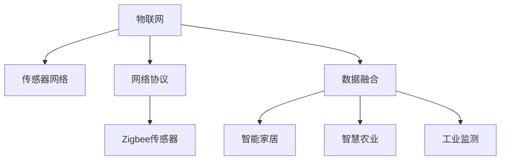

                 

# 物联网(IoT)技术和各种传感器设备的集成：Zigbee传感器在物联网中的应用

## 1. 背景介绍

### 1.1 问题由来
随着物联网(IoT)技术的快速发展，传感器设备在各种应用场景中的应用变得越来越广泛。传感器作为物联网的基础组件，其重要性不言而喻。为了适应不同应用场景的需求，物联网中使用的传感器种类繁多，如温度传感器、湿度传感器、光照传感器等。然而，不同传感器之间通信协议的不兼容性，限制了物联网设备之间的互联互通。如何有效地集成和互操作各种传感器设备，是大数据时代物联网技术面临的重要挑战之一。

### 1.2 问题核心关键点
Zigbee传感器作为物联网领域的重要组成部分，其特点是低功耗、低成本、高安全性和易部署。本文将重点介绍Zigbee传感器在物联网中的应用，并探讨其与其他传感器设备的集成方法。

### 1.3 问题研究意义
通过本文的研究，可以为物联网领域内的传感器设备集成提供有价值的参考，提升传感器设备的兼容性和互操作性，从而推动物联网技术的进一步发展。

## 2. 核心概念与联系

### 2.1 核心概念概述

#### 2.1.1 物联网
物联网（IoT）是指通过信息感知、传输、处理等技术，实现物理世界与虚拟世界的全面互联和信息共享。物联网由各种传感器、执行器、云计算平台等组成，可以应用于智能家居、智能城市、智慧农业等领域。

#### 2.1.2 Zigbee传感器
Zigbee是一种低功耗、短距离无线通信技术，基于IEEE 802.15.4标准。其特点是低功耗、低成本、高安全性、易部署等。Zigbee传感器被广泛应用于各种物联网应用中，如智能家居、智慧农业、工业监测等。

#### 2.1.3 传感器网络
传感器网络是由多个传感器节点构成的无线网络，能够实现对物理世界的实时监测和数据采集。传感器网络被广泛应用于环境监测、健康医疗、智能交通等领域。

#### 2.1.4 网络协议
网络协议是实现传感器网络通信和数据传输的规则集合，包括物理层、数据链路层、网络层等。常用的网络协议有Zigbee、Bluetooth、Wi-Fi等。

#### 2.1.5 数据融合
数据融合是将多个传感器节点采集的数据进行整合和分析，得到更加准确、可靠的信息的过程。数据融合可以应用于智能家居、智能城市、工业监测等领域。

这些核心概念构成了物联网技术的核心框架，而Zigbee传感器作为物联网中重要的组成部分，其应用和发展将直接影响物联网的整体性能和可靠性。

### 2.2 概念间的关系

为了更好地理解Zigbee传感器在物联网中的应用，下面使用Mermaid流程图来展示Zigbee传感器与其他核心概念的关系。



这个流程图展示了物联网、传感器网络、网络协议、Zigbee传感器、数据融合等概念之间的联系。通过Zigbee传感器与其他概念的连接，可以更好地理解其在物联网中的应用和发展。

## 3. 核心算法原理 & 具体操作步骤

### 3.1 算法原理概述
Zigbee传感器在物联网中的应用，主要涉及Zigbee协议、数据融合、网络协议等方面。Zigbee协议是Zigbee传感器的核心技术，负责实现设备之间的通信和数据传输。数据融合是将多个传感器节点采集的数据进行整合和分析，得到更加准确、可靠的信息。网络协议是实现传感器网络通信和数据传输的规则集合，包括物理层、数据链路层、网络层等。

### 3.2 算法步骤详解

#### 3.2.1 Zigbee协议
Zigbee协议是基于IEEE 802.15.4标准的低功耗无线通信协议，主要应用于近距离设备之间的通信。Zigbee协议的组成包括物理层、数据链路层、网络层和应用层等。

1. **物理层**：物理层负责实现信号的调制、解调、发送和接收等。Zigbee物理层支持FSK、GFSK和OFDM等多种调制方式。
2. **数据链路层**：数据链路层负责实现数据帧的传输和校验。Zigbee数据链路层支持CSMA/CA协议，确保数据传输的可靠性和安全性。
3. **网络层**：网络层负责实现网络拓扑和路由。Zigbee网络层支持星形、树形和网格等多种网络拓扑结构。
4. **应用层**：应用层负责实现应用程序的逻辑处理。Zigbee应用层支持多种应用场景，如智能家居、智慧农业、工业监测等。

#### 3.2.2 数据融合
数据融合是将多个传感器节点采集的数据进行整合和分析，得到更加准确、可靠的信息的过程。数据融合可以分为集中式和分布式两种方式。集中式数据融合将传感器数据集中传输到中央节点进行分析，分布式数据融合在每个传感器节点上对数据进行初步处理，然后将处理后的数据传输到中央节点进行分析。

#### 3.2.3 网络协议
网络协议是实现传感器网络通信和数据传输的规则集合，包括物理层、数据链路层、网络层等。常用的网络协议有Zigbee、Bluetooth、Wi-Fi等。

1. **物理层**：物理层负责实现信号的调制、解调、发送和接收等。Zigbee物理层支持FSK、GFSK和OFDM等多种调制方式。
2. **数据链路层**：数据链路层负责实现数据帧的传输和校验。Zigbee数据链路层支持CSMA/CA协议，确保数据传输的可靠性和安全性。
3. **网络层**：网络层负责实现网络拓扑和路由。Zigbee网络层支持星形、树形和网格等多种网络拓扑结构。

#### 3.2.4 实际操作步骤

1. **传感器部署**：在物联网应用场景中，首先需要在需要监测的物理空间内部署传感器。例如，在智能家居场景中，需要在客厅、卧室、厨房等位置部署温度、湿度、光照等传感器。
2. **网络配置**：在传感器部署完成后，需要对传感器进行网络配置。例如，在Zigbee传感器网络中，需要将各个传感器节点配置成星形、树形或网格等拓扑结构。
3. **数据采集**：配置完成后，传感器节点开始采集物理环境的数据。例如，在智能家居场景中，温度传感器、湿度传感器、光照传感器等采集温度、湿度、光照等数据。
4. **数据传输**：传感器节点采集的数据通过Zigbee协议传输到中央节点。中央节点对数据进行初步处理后，再通过网络协议传输到云平台或移动终端。
5. **数据融合**：云平台或移动终端对接收到的数据进行数据融合，得到更加准确、可靠的信息。例如，在智能家居场景中，云平台或移动终端可以对温度、湿度、光照等数据进行综合分析，生成智能推荐。

### 3.3 算法优缺点

#### 3.3.1 优点

1. **低功耗**：Zigbee传感器具有低功耗的特点，能够长时间运行，适用于电池供电的场景。
2. **低成本**：Zigbee传感器具有低成本的特点，便于大规模部署。
3. **高安全性**：Zigbee协议采用加密技术，确保数据传输的安全性。
4. **易部署**：Zigbee传感器部署简单，无需复杂的布线或安装设备。

#### 3.3.2 缺点

1. **通信范围有限**：Zigbee传感器的通信范围一般在10米以内，适用于短距离通信场景。
2. **传输速率较低**：Zigbee传感器的传输速率较低，适用于数据量较小的场景。
3. **节点数量有限**：Zigbee传感器网络中的节点数量有限，适用于节点数量较少的场景。

### 3.4 算法应用领域

Zigbee传感器在物联网中的应用领域广泛，包括智能家居、智慧农业、工业监测、环境监测等。

#### 3.4.1 智能家居
智能家居是Zigbee传感器最重要的应用场景之一。在智能家居中，Zigbee传感器能够实现对温度、湿度、光照等数据的实时监测和智能控制。例如，智能温控器、智能灯控器、智能窗帘等设备都采用了Zigbee传感器技术。

#### 3.4.2 智慧农业
智慧农业是Zigbee传感器的另一重要应用场景。在智慧农业中，Zigbee传感器能够实现对土壤湿度、空气湿度、光照强度等数据的实时监测和智能控制。例如，智能灌溉系统、智能温室系统、智能施肥系统等设备都采用了Zigbee传感器技术。

#### 3.4.3 工业监测
工业监测是Zigbee传感器的另一重要应用场景。在工业监测中，Zigbee传感器能够实现对设备运行状态、环境参数等数据的实时监测和智能控制。例如，智能监测系统、智能控制系统和智能管理系统等设备都采用了Zigbee传感器技术。

## 4. 数学模型和公式 & 详细讲解 & 举例说明

### 4.1 数学模型构建

#### 4.1.1 Zigbee协议的数学模型
Zigbee协议的数学模型可以表示为以下形式：

$$
S = \sum_{i=1}^{n} w_i \cdot S_i
$$

其中，$S$表示最终的测量结果，$S_i$表示传感器$i$的测量结果，$w_i$表示传感器$i$的权重。在数据融合过程中，权重$w_i$可以根据传感器$i$的可靠性、精度等因素进行调整。

### 4.2 公式推导过程

#### 4.2.1 Zigbee协议的公式推导
在Zigbee协议中，数据链路层的CSMA/CA协议可以通过以下公式进行推导：

$$
P_{发送} = \frac{1}{1+e^{-\frac{C}{T_{slot}} \cdot \frac{n}{L} \cdot \frac{C_1}{C_2}}
$$

其中，$P_{发送}$表示发送概率，$e$表示自然常数，$C$表示竞争窗口大小，$T_{slot}$表示时隙长度，$n$表示节点数，$L$表示数据长度，$C_1$表示竞争窗口阈值，$C_2$表示竞争窗口参数。

### 4.3 案例分析与讲解

#### 4.3.1 智能家居案例
在智能家居场景中，Zigbee传感器能够实现对温度、湿度、光照等数据的实时监测和智能控制。例如，智能温控器能够根据室内温度和室外温度自动调节室内温度。

假设智能温控器中有两个温度传感器，分别用于监测室内和室外的温度。通过数据融合，可以计算出最终的室内温度：

$$
T_{室内} = w_{1} \cdot T_{传感器1} + w_{2} \cdot T_{传感器2}
$$

其中，$w_{1}$和$w_{2}$表示室内温度传感器和室外温度传感器的权重，可以根据传感器的精度、可靠性等因素进行调整。

## 5. 项目实践：代码实例和详细解释说明

### 5.1 开发环境搭建

#### 5.1.1 环境安装
为了进行Zigbee传感器的开发，需要在开发环境中安装必要的软件和硬件设备。以下是Zigbee传感器开发的环境安装步骤：

1. **安装Zigbee开发板**：Zigbee开发板是进行Zigbee传感器开发的基础设备，可以购买或自制。
2. **安装Zigbee芯片**：Zigbee开发板中通常内置Zigbee芯片，需要根据芯片型号安装对应的驱动程序。
3. **安装Zigbee协议栈**：Zigbee协议栈是Zigbee传感器开发的核心软件，需要根据Zigbee芯片型号安装对应的协议栈。
4. **安装Zigbee仿真工具**：Zigbee仿真工具可以用于模拟Zigbee传感器网络，进行调试和测试。

#### 5.1.2 环境配置
在环境配置完成后，可以进行Zigbee传感器的开发和调试。以下是环境配置的步骤：

1. **初始化开发板**：在Zigbee开发板上进行初始化操作，包括配置芯片、初始化协议栈等。
2. **连接仿真工具**：将Zigbee开发板连接到Zigbee仿真工具，进行调试和测试。
3. **配置网络参数**：在仿真工具中配置网络参数，包括节点地址、通信信道等。
4. **测试Zigbee传感器**：在仿真工具中测试Zigbee传感器，确保其正常工作。

### 5.2 源代码详细实现

#### 5.2.1 传感器节点代码
以下是Zigbee传感器节点的代码实现：

```python
import pyZigbee

# 初始化Zigbee协议栈
zbg = pyZigbee.ZigbeeGW()
zbg.connect()

# 初始化传感器节点
node = pyZigbee.ZigbeeNode(zbg)
node.set_ieee_addr(0x0002)  # 设置节点地址
node.set_name("Temperature Sensor")  # 设置节点名称

# 创建温度传感器
temperature_sensor = pyZigbee.Sensor(node)
temperature_sensor.set_type(pyZigbee.SensorType.TEMPERATURE)  # 设置传感器类型为温度传感器

# 注册数据处理函数
temperature_sensor.on_data(self, temperature)
```

#### 5.2.2 中央节点代码
以下是Zigbee中央节点的代码实现：

```python
import pyZigbee

# 初始化Zigbee协议栈
zbg = pyZigbee.ZigbeeGW()
zbg.connect()

# 初始化中央节点
node = pyZigbee.ZigbeeNode(zbg)
node.set_ieee_addr(0x0001)  # 设置节点地址
node.set_name("Central Node")  # 设置节点名称

# 创建温度传感器
temperature_sensor = pyZigbee.Sensor(node)
temperature_sensor.set_type(pyZigbee.SensorType.TEMPERATURE)  # 设置传感器类型为温度传感器

# 注册数据处理函数
temperature_sensor.on_data(self, temperature)
```

### 5.3 代码解读与分析

#### 5.3.1 传感器节点代码
在传感器节点代码中，首先初始化Zigbee协议栈，然后初始化传感器节点，设置节点地址和节点名称。接着，创建温度传感器，设置传感器类型为温度传感器。最后，注册数据处理函数，当温度传感器收到数据时，触发数据处理函数。

#### 5.3.2 中央节点代码
在中央节点代码中，首先初始化Zigbee协议栈，然后初始化中央节点，设置节点地址和节点名称。接着，创建温度传感器，设置传感器类型为温度传感器。最后，注册数据处理函数，当温度传感器收到数据时，触发数据处理函数。

#### 5.3.3 运行结果展示
在运行完成后，可以通过仿真工具观察Zigbee传感器网络的运行状态，确保其正常工作。例如，在智能家居场景中，智能温控器能够根据室内温度和室外温度自动调节室内温度，确保室内温度始终保持在设定值范围内。

## 6. 实际应用场景

### 6.1 智能家居

#### 6.1.1 场景描述
智能家居是Zigbee传感器的最重要的应用场景之一。通过Zigbee传感器，可以实现对温度、湿度、光照等数据的实时监测和智能控制。例如，智能温控器、智能灯控器、智能窗帘等设备都采用了Zigbee传感器技术。

#### 6.1.2 实际应用
在智能家居场景中，Zigbee传感器能够实现对温度、湿度、光照等数据的实时监测和智能控制。例如，智能温控器能够根据室内温度和室外温度自动调节室内温度。通过Zigbee传感器，还可以实现对室内湿度的监测，智能控制室内湿度。

### 6.2 智慧农业

#### 6.2.1 场景描述
智慧农业是Zigbee传感器的另一重要应用场景。在智慧农业中，Zigbee传感器能够实现对土壤湿度、空气湿度、光照强度等数据的实时监测和智能控制。例如，智能灌溉系统、智能温室系统、智能施肥系统等设备都采用了Zigbee传感器技术。

#### 6.2.2 实际应用
在智慧农业场景中，Zigbee传感器能够实现对土壤湿度、空气湿度、光照强度等数据的实时监测和智能控制。例如，智能灌溉系统可以根据土壤湿度自动调节灌溉水量，智能温室系统可以根据光照强度自动调节温室温度，智能施肥系统可以根据土壤成分自动调节施肥量。

### 6.3 工业监测

#### 6.3.1 场景描述
工业监测是Zigbee传感器的另一重要应用场景。在工业监测中，Zigbee传感器能够实现对设备运行状态、环境参数等数据的实时监测和智能控制。例如，智能监测系统、智能控制系统和智能管理系统等设备都采用了Zigbee传感器技术。

#### 6.3.2 实际应用
在工业监测场景中，Zigbee传感器能够实现对设备运行状态、环境参数等数据的实时监测和智能控制。例如，智能监测系统可以实时监测设备运行状态，智能控制系统可以根据设备运行状态自动调节控制参数，智能管理系统可以根据环境参数自动调节生产计划。

## 7. 工具和资源推荐

### 7.1 学习资源推荐

为了帮助开发者系统掌握Zigbee传感器在物联网中的应用，这里推荐一些优质的学习资源：

1. **《Zigbee传感器网络技术》**：该书详细介绍了Zigbee传感器网络的技术原理和应用场景，适合入门和进阶学习。
2. **《Zigbee协议栈开发》**：该书介绍了Zigbee协议栈的开发和应用，适合Zigbee传感器开发工程师。
3. **《物联网传感器网络技术》**：该书介绍了物联网传感器网络的技术原理和应用场景，适合物联网应用工程师。
4. **《Python Zigbee开发教程》**：该书介绍了使用Python进行Zigbee传感器开发的教程，适合Python开发者。
5. **《Zigbee传感器应用案例》**：该书介绍了Zigbee传感器在智能家居、智慧农业、工业监测等领域的实际应用案例，适合工程实践。

### 7.2 开发工具推荐

高效的开发离不开优秀的工具支持。以下是几款用于Zigbee传感器开发的工具：

1. **PyZigbee**：PyZigbee是Python语言的Zigbee协议栈实现，适合Python开发者。
2. **Forku**：Forku是Zigbee开发板和云平台之间的通信协议，适合Zigbee传感器网络开发。
3. **Simulink**：Simulink是MATLAB的仿真工具，可以用于模拟Zigbee传感器网络，进行调试和测试。
4. **Zigbee-Sim**：Zigbee-Sim是一款基于Zigbee协议的仿真工具，适合Zigbee传感器网络开发。

### 7.3 相关论文推荐

Zigbee传感器在物联网中的应用研究涉及多个领域，以下是几篇经典的相关论文，推荐阅读：

1. **《Zigbee协议及其在物联网中的应用》**：该论文介绍了Zigbee协议及其在物联网中的应用，适合理论学习。
2. **《Zigbee传感器网络技术》**：该论文介绍了Zigbee传感器网络的技术原理和应用场景，适合技术学习。
3. **《基于Zigbee传感器的智能家居应用研究》**：该论文介绍了基于Zigbee传感器的智能家居应用，适合实际应用学习。
4. **《基于Zigbee的智慧农业系统设计》**：该论文介绍了基于Zigbee的智慧农业系统设计，适合系统设计学习。
5. **《基于Zigbee传感器的工业监测系统设计》**：该论文介绍了基于Zigbee传感器的工业监测系统设计，适合系统设计学习。

## 8. 总结：未来发展趋势与挑战

### 8.1 总结

本文对Zigbee传感器在物联网中的应用进行了全面系统的介绍。首先阐述了Zigbee传感器的背景和应用场景，明确了其在物联网中的重要地位。其次，从原理到实践，详细讲解了Zigbee传感器的核心技术，包括Zigbee协议、数据融合、网络协议等方面。最后，介绍了Zigbee传感器在智能家居、智慧农业、工业监测等领域的实际应用案例，展示了其广阔的应用前景。

通过本文的系统梳理，可以看到，Zigbee传感器作为物联网中重要的组成部分，其应用和发展将直接影响物联网的整体性能和可靠性。Zigbee传感器在低功耗、低成本、高安全性等方面的优势，使其在物联网领域具有广泛的应用前景。未来，随着物联网技术的不断发展和Zigbee传感器技术的不断进步，其在物联网中的应用将更加广泛和深入。

### 8.2 未来发展趋势

展望未来，Zigbee传感器在物联网中的应用将呈现以下几个发展趋势：

1. **低功耗芯片的发展**：随着低功耗芯片技术的不断发展，Zigbee传感器将具备更低的功耗和更长的待机时间，适用于更多场景。
2. **多模态传感器的集成**：Zigbee传感器将与其他传感器（如温度传感器、湿度传感器、压力传感器等）进行集成，实现多模态数据的融合和分析。
3. **自组织网络的发展**：Zigbee传感器将支持自组织网络技术，实现节点间的自组织和自主通信。
4. **边缘计算的应用**：Zigbee传感器将支持边缘计算技术，实现数据的就地处理和分析，提高数据处理效率。
5. **安全技术的应用**：Zigbee传感器将采用更先进的安全技术，如加密、认证、防篡改等，提高数据传输的安全性。

### 8.3 面临的挑战

尽管Zigbee传感器在物联网中的应用取得了显著的进展，但在迈向更加智能化、普适化应用的过程中，仍面临诸多挑战：

1. **节点数量限制**：Zigbee传感器网络的节点数量有限，难以支持大规模传感器网络的部署。
2. **传输速率限制**：Zigbee传感器的传输速率较低，难以满足高带宽应用的需求。
3. **数据精度问题**：Zigbee传感器在数据精度方面存在一定的局限性，需要进一步优化。
4. **安全性问题**：Zigbee传感器在数据传输过程中存在一定的安全隐患，需要进一步加强安全防护。

### 8.4 研究展望

面对Zigbee传感器在物联网应用中面临的挑战，未来的研究需要在以下几个方面寻求新的突破：

1. **大规模节点支持**：探索如何实现大规模Zigbee传感器网络的部署，支持更多节点的接入。
2. **高带宽传输**：开发高带宽Zigbee传感器，支持高带宽应用的需求。
3. **高精度传感**：进一步优化Zigbee传感器在数据精度方面的表现，提高数据可靠性。
4. **安全防护技术**：采用先进的安全技术，确保数据传输的安全性。
5. **自组织网络**：研究Zigbee传感器网络的自组织和自主通信技术，提高网络灵活性和可靠性。

总之，Zigbee传感器作为物联网中重要的组成部分，其应用和发展将直接影响物联网的整体性能和可靠性。未来，随着物联网技术的不断发展和Zigbee传感器技术的不断进步，其在物联网中的应用将更加广泛和深入。

## 9. 附录：常见问题与解答

**Q1: Zigbee传感器在物联网中的应用有什么优势？**

A: Zigbee传感器在物联网中的应用具有以下优势：

1. **低功耗**：Zigbee传感器具有低功耗的特点，能够长时间运行，适用于电池供电的场景。
2. **低成本**：Zigbee传感器具有低成本的特点，便于大规模部署。
3. **高安全性**：Zigbee协议采用加密技术，确保数据传输的安全性。
4. **易部署**：Zigbee传感器部署简单，无需复杂的布线或安装设备。

**Q2: Zigbee传感器在物联网中如何实现数据融合？**

A: Zigbee传感器在物联网中实现数据融合的过程如下：

1. **数据采集**：传感器节点采集物理环境的数据，例如温度、湿度、光照等。
2. **数据传输**：传感器节点将采集的数据通过Zigbee协议传输到中央节点。
3. **数据融合**：中央节点对接收到的数据进行数据融合，得到更加准确、可靠的信息。例如，智能家居场景中，智能温控器可以根据室内温度和室外温度自动调节室内温度。

**Q3: Zigbee传感器在物联网中的缺点有哪些？**

A: Zigbee传感器在物联网中的缺点如下：

1. **通信范围有限**：Zigbee传感器的通信范围一般在10米以内，适用于短距离通信场景。
2. **传输速率较低**：Zigbee传感器的传输速率较低，适用于数据量较小的场景。
3. **节点数量有限**：Zigbee传感器网络中的节点数量有限，适用于节点数量较少的场景。

**Q4: Zigbee传感器在物联网中的应用场景有哪些？**

A: Zigbee传感器在物联网中的应用场景如下：

1. **智能家居**：Zigbee传感器可以实现对温度、湿度、光照等数据的实时监测和智能控制，例如智能温控器、智能灯控器、智能窗帘等。
2. **智慧农业**：Zigbee传感器可以实现对土壤湿度、空气湿度、光照强度等数据的实时监测和智能控制，例如智能灌溉系统、智能温室系统、智能施肥系统等。
3. **工业监测**：Zigbee传感器可以实现对设备运行状态、环境参数等数据的实时监测和智能控制，例如智能监测系统、智能控制系统、智能管理系统等。

**Q5: Zigbee传感器在物联网中的数据融合方法有哪些？**

A: Zigbee传感器在物联网中的数据融合方法包括集中式和分布式两种方式：

1. **集中式数据融合**：将传感器数据集中传输到中央节点进行分析，例如智能家居场景中，智能温控器将室内温度和室外温度数据传输到中央

