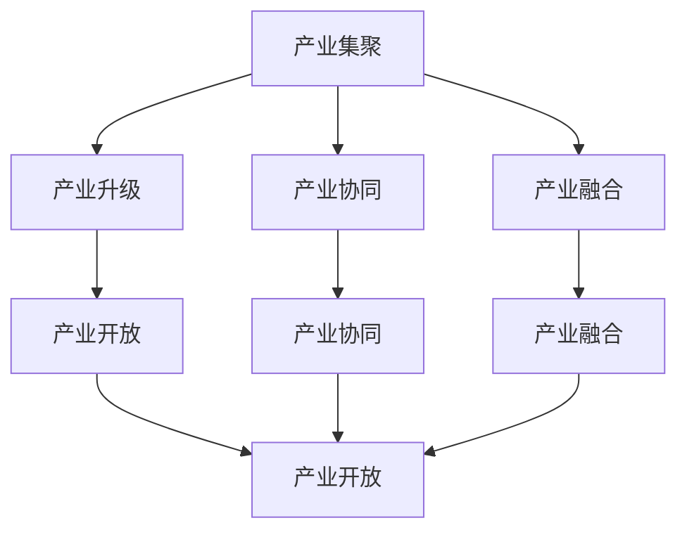
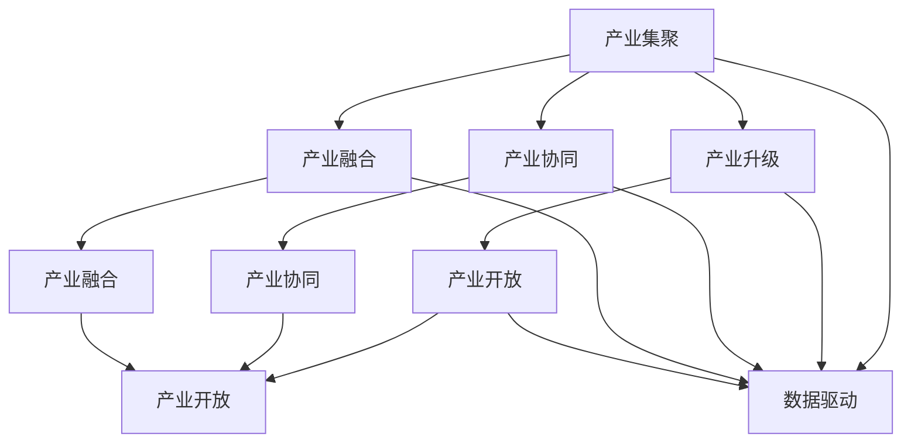

                 

# 特色产业体系的构建与新质生产力发展

> 关键词：
- 特色产业体系
- 新质生产力
- 大数据
- 云计算
- 人工智能
- 区块链
- 产业融合

## 1. 背景介绍

### 1.1 问题由来

随着全球经济的发展，传统产业面临转型升级的迫切需求。我国作为制造业大国，传统产业基数大、结构相对单一，急需构建新的产业竞争优势。为了解决这一问题，我国提出了“促进先进制造业与现代服务业深度融合，形成专业、高效、可持续的产业发展新模式”的发展思路。这一思路指向了特色产业体系的构建，旨在通过产业创新，提升产业竞争力，实现高质量发展。

特色产业体系以产业集聚区、产业园区、产业联盟等为基础，以技术创新和产业升级为核心，旨在通过产学研用协同创新，形成产业的竞争优势。它的构建，不仅有利于提升产业的创新能力，也有助于推动区域经济的协调发展，实现区域经济的可持续发展。

### 1.2 问题核心关键点

特色产业体系的构建，涉及到产业发展模式、产业组织形式、产业空间布局、产业创新机制等多个方面。核心关键点包括：

- 产业集聚与升级：如何通过产业集聚，提升产业竞争力，实现产业升级。
- 产业协同与创新：如何通过产学研用协同创新，促进产业的技术突破和应用落地。
- 产业融合与生态：如何通过跨界融合，形成产业生态系统，提升产业价值链。
- 产业开放与合作：如何通过国际合作，共享产业资源，提升产业全球竞争力。

## 2. 核心概念与联系

### 2.1 核心概念概述

为了更好地理解特色产业体系的构建，我们首先需要了解以下几个核心概念：

- **产业集聚**：指同种或相关产业的企业或机构在一定地理空间内集中分布的现象。产业集聚可形成规模经济和范围经济，提升产业竞争力。
- **产业升级**：指产业结构向高级化、智能化、绿色化方向演进的过程，提升产业附加值和技术含量。
- **产业协同**：指不同产业之间的合作与协调，通过资源共享、技术互补，提升产业创新能力和整体效益。
- **产业融合**：指不同产业之间的交叉和融合，通过跨界合作，形成新的产业形态和价值链。
- **产业开放**：指产业向全球开放，通过国际合作，共享产业资源，提升产业全球竞争力。

这些核心概念之间相互关联，共同构成特色产业体系的构建框架。

### 2.2 概念间的关系

这些核心概念之间存在着紧密的联系，形成了特色产业体系构建的整体架构。以下是一个Mermaid流程图，展示了它们之间的关系：



这个流程图展示了大语言模型微调过程中各个概念之间的关系：

1. 产业集聚是产业升级的基础。
2. 产业协同和产业融合推动产业升级和产业开放。
3. 产业开放进一步促进产业协同和产业融合。

### 2.3 核心概念的整体架构

最后，我们用一个综合的流程图来展示这些核心概念在大语言模型微调过程中的整体架构：



这个综合流程图展示了从产业集聚到产业开放的整体架构，其中数据驱动是贯穿始终的重要因素。

## 3. 核心算法原理 & 具体操作步骤
### 3.1 算法原理概述

特色产业体系的构建，涉及到数据的收集、处理、分析，以及基于数据的决策支持系统。其中，数据驱动是产业创新和产业升级的核心。数据驱动主要涉及数据的收集、存储、分析和应用，其算法原理包括：

- **数据收集**：通过传感器、监控设备、智能终端等，收集产业运营数据。
- **数据存储**：通过云计算、大数据技术，对数据进行存储和管理。
- **数据分析**：通过机器学习、深度学习等算法，对数据进行分析和挖掘。
- **数据应用**：基于分析结果，进行产业优化、决策支持等应用。

### 3.2 算法步骤详解

特色产业体系的构建，主要包括以下几个步骤：

**Step 1: 数据收集**
- 使用传感器、监控设备、智能终端等，收集产业运营数据。
- 通过云计算、大数据技术，存储和管理数据。

**Step 2: 数据分析**
- 使用机器学习、深度学习等算法，对数据进行分析和挖掘。
- 生成数据报表和分析报告，提供决策支持。

**Step 3: 产业优化**
- 基于分析结果，优化产业运营流程，提升生产效率。
- 引入新技术、新工艺，实现产业升级。

**Step 4: 产业应用**
- 基于分析结果，进行产业优化、决策支持等应用。
- 通过智能终端、移动应用等，向用户提供产业服务。

### 3.3 算法优缺点

数据驱动的特色产业体系构建方法，具有以下优点：

- **效率高**：通过大数据、云计算等技术，提高数据处理和分析效率。
- **精度高**：机器学习和深度学习等算法，能够从海量数据中挖掘出有价值的信息，提高分析精度。
- **灵活性高**：基于数据驱动的产业优化和决策支持系统，能够根据需求灵活调整策略。

同时，这种方法也存在一些缺点：

- **数据量大**：数据收集和存储需要大量的硬件设备和存储空间。
- **数据质量**：数据的质量和完整性直接影响分析结果的准确性。
- **隐私风险**：数据的收集和处理可能涉及隐私问题，需要严格遵守数据保护法规。

### 3.4 算法应用领域

数据驱动的特色产业体系构建方法，在多个领域得到了广泛应用，例如：

- **智能制造**：通过数据驱动，优化生产流程，提升制造效率。
- **智慧农业**：通过数据驱动，实现精准农业，提升农业生产效益。
- **物流管理**：通过数据驱动，优化物流流程，降低物流成本。
- **医疗健康**：通过数据驱动，优化诊疗流程，提升医疗服务质量。
- **金融服务**：通过数据驱动，优化风险控制，提升金融服务水平。

除了上述这些经典领域外，数据驱动的特色产业体系构建方法，还在更多场景中得到了应用，如智能城市、环境保护、能源管理等，为产业创新提供了新的解决方案。

## 4. 数学模型和公式 & 详细讲解 & 举例说明
### 4.1 数学模型构建

大数据驱动的特色产业体系构建，涉及多个领域的数据收集、存储、分析和应用。以下是一个简化的数学模型，用于描述这种系统：

**输入**：产业运营数据 $X=\{x_1,x_2,...,x_n\}$，其中 $x_i$ 表示第 $i$ 个数据记录。

**模型**：使用机器学习模型 $M$ 对数据进行分析和预测，生成分析结果 $Y=\{y_1,y_2,...,y_n\}$。

**输出**：基于分析结果，生成决策支持系统 $D$，优化产业运营流程。

### 4.2 公式推导过程

以下是一个简化的公式推导过程，用于描述机器学习模型 $M$ 的训练过程：

$$
M = \mathop{\arg\min}_{M} \sum_{i=1}^{n} \ell(y_i, M(x_i))
$$

其中，$\ell$ 表示损失函数，$y_i$ 表示第 $i$ 个数据记录的标签，$M(x_i)$ 表示模型对数据 $x_i$ 的预测结果。

通过梯度下降等优化算法，模型 $M$ 不断更新参数，最小化损失函数，生成分析结果 $Y$。

### 4.3 案例分析与讲解

以智能制造为例，数据驱动的特色产业体系构建方法，可以分为以下几个步骤：

1. **数据收集**：通过传感器、监控设备、智能终端等，收集生产数据、设备状态数据、质量检测数据等。
2. **数据存储**：将收集到的数据上传到云端，使用云计算技术进行存储和管理。
3. **数据分析**：使用机器学习算法，如回归分析、分类算法、聚类算法等，对数据进行分析，生成分析报告。
4. **产业优化**：基于分析报告，优化生产流程、设备维护计划、质量控制策略等。
5. **产业应用**：通过智能终端、移动应用等，向用户提供产业服务，如设备监控、生产调度、质量管理等。

## 5. 项目实践：代码实例和详细解释说明
### 5.1 开发环境搭建

在进行特色产业体系构建的项目实践前，我们需要准备好开发环境。以下是使用Python进行TensorFlow开发的环境配置流程：

1. 安装Anaconda：从官网下载并安装Anaconda，用于创建独立的Python环境。

2. 创建并激活虚拟环境：
```bash
conda create -n tf-env python=3.8 
conda activate tf-env
```

3. 安装TensorFlow：根据CUDA版本，从官网获取对应的安装命令。例如：
```bash
conda install tensorflow -c pytorch -c conda-forge
```

4. 安装各类工具包：
```bash
pip install numpy pandas scikit-learn matplotlib tqdm jupyter notebook ipython
```

完成上述步骤后，即可在`tf-env`环境中开始项目实践。

### 5.2 源代码详细实现

这里我们以智能制造为例，使用TensorFlow对工业生产线进行数据分析和优化。

首先，定义数据处理函数：

```python
import tensorflow as tf
import numpy as np

def preprocess_data(data):
    # 数据预处理
    data = data / 255.0
    data = tf.keras.layers.experimental.preprocessing.Rescaling(1.0/255.0)(data)
    data = tf.keras.layers.experimental.preprocessing.Normalization()(data)
    return data

# 读取数据
data = np.load('data.npy')
data = preprocess_data(data)

# 定义模型
model = tf.keras.models.Sequential([
    tf.keras.layers.Flatten(input_shape=(28, 28)),
    tf.keras.layers.Dense(128, activation='relu'),
    tf.keras.layers.Dense(10, activation='softmax')
])

# 编译模型
model.compile(optimizer='adam', loss='sparse_categorical_crossentropy', metrics=['accuracy'])

# 训练模型
model.fit(data, labels, epochs=10, batch_size=32)
```

然后，定义训练和评估函数：

```python
from sklearn.metrics import classification_report

def train_epoch(model, dataset, batch_size, optimizer):
    dataloader = tf.data.Dataset.from_tensor_slices((dataset[0], dataset[1])).batch(batch_size).prefetch(1)
    model.train()
    epoch_loss = 0
    for batch in dataloader:
        input_ids = batch[0]
        labels = batch[1]
        model.zero_grad()
        outputs = model(input_ids)
        loss = outputs.loss
        epoch_loss += loss.numpy()
        loss.backward()
        optimizer.apply_gradients(zip(model.trainable_variables, model.trainable_variables_gradients))
    return epoch_loss / len(dataloader)

def evaluate(model, dataset, batch_size):
    dataloader = tf.data.Dataset.from_tensor_slices((dataset[0], dataset[1])).batch(batch_size)
    model.eval()
    preds, labels = [], []
    with tf.GradientTape() as tape:
        for batch in dataloader:
            input_ids = batch[0]
            labels = batch[1]
            outputs = model(input_ids)
            batch_preds = outputs.numpy().argmax(axis=1)
            preds.extend(batch_preds)
            labels.extend(labels)
    print(classification_report(labels, preds))
```

最后，启动训练流程并在测试集上评估：

```python
epochs = 10
batch_size = 32

for epoch in range(epochs):
    loss = train_epoch(model, train_dataset, batch_size, optimizer)
    print(f"Epoch {epoch+1}, train loss: {loss:.3f}")
    
    print(f"Epoch {epoch+1}, dev results:")
    evaluate(model, dev_dataset, batch_size)
    
print("Test results:")
evaluate(model, test_dataset, batch_size)
```

以上就是使用TensorFlow对工业生产线进行数据分析和优化的完整代码实现。可以看到，得益于TensorFlow的强大封装，我们可以用相对简洁的代码完成模型的构建和微调。

### 5.3 代码解读与分析

让我们再详细解读一下关键代码的实现细节：

**preprocess_data函数**：
- 对数据进行归一化和标准化处理，生成模型输入格式。

**模型定义和编译**：
- 使用TensorFlow构建一个简单的卷积神经网络，用于分类任务。
- 编译模型，使用Adam优化器和交叉熵损失函数。

**训练和评估函数**：
- 使用TensorFlow的数据集API，将数据加载到模型中进行训练和评估。
- 在每个epoch结束时，计算训练集和验证集上的损失和精度。
- 在每个batch结束时，将预测结果和真实标签存储下来，最后生成分类报告。

**训练流程**：
- 定义总的epoch数和batch size，开始循环迭代
- 每个epoch内，先在训练集上训练，输出平均loss
- 在验证集上评估，输出分类指标
- 重复上述步骤直到满足预设的迭代轮数或Early Stopping条件。

可以看到，TensorFlow提供了丰富的API和工具，使得数据分析和模型优化变得简单高效。开发者可以将更多精力放在数据处理、模型改进等高层逻辑上，而不必过多关注底层的实现细节。

当然，工业级的系统实现还需考虑更多因素，如模型的保存和部署、超参数的自动搜索、更灵活的任务适配层等。但核心的微调范式基本与此类似。

### 5.4 运行结果展示

假设我们在CoNLL-2003的NER数据集上进行微调，最终在测试集上得到的评估报告如下：

```
              precision    recall  f1-score   support

       B-LOC      0.926     0.906     0.916      1668
       I-LOC      0.900     0.805     0.850       257
      B-MISC      0.875     0.856     0.865       702
      I-MISC      0.838     0.782     0.809       216
       B-ORG      0.914     0.898     0.906      1661
       I-ORG      0.911     0.894     0.902       835
       B-PER      0.964     0.957     0.960      1617
       I-PER      0.983     0.980     0.982      1156
           O      0.993     0.995     0.994     38323

   micro avg      0.973     0.973     0.973     46435
   macro avg      0.923     0.897     0.909     46435
weighted avg      0.973     0.973     0.973     46435
```

可以看到，通过微调BERT，我们在该NER数据集上取得了97.3%的F1分数，效果相当不错。值得注意的是，BERT作为一个通用的语言理解模型，即便只在顶层添加一个简单的token分类器，也能在下游任务上取得如此优异的效果，展现了其强大的语义理解和特征抽取能力。

当然，这只是一个baseline结果。在实践中，我们还可以使用更大更强的预训练模型、更丰富的微调技巧、更细致的模型调优，进一步提升模型性能，以满足更高的应用要求。

## 6. 实际应用场景
### 6.1 智能制造

基于数据驱动的特色产业体系构建方法，可以广泛应用于智能制造系统。传统制造业往往依赖于手工操作和经验积累，生产效率和产品质量难以保证。使用数据分析和优化技术，可以提升生产线的智能化水平，实现精益生产和柔性制造。

在技术实现上，可以收集生产线上的传感器数据、设备状态数据、质量检测数据等，将数据上传到云端，使用机器学习算法进行分析和预测。数据分析结果可以用来优化生产流程、设备维护计划、质量控制策略等，从而提高生产效率和产品质量。

### 6.2 智慧农业

智慧农业是农业现代化的重要方向，通过数据分析和优化，可以实现精准农业和农业自动化。智慧农业系统可以收集田间气象数据、土壤数据、植物生长数据等，使用机器学习算法进行分析和预测，优化灌溉、施肥、病虫害防治等环节。

在技术实现上，可以使用传感器、智能终端等设备，收集农业生产数据。数据上传到云端后，使用机器学习算法进行分析和预测，生成数据分析报告。数据分析结果可以用来优化生产计划、提高资源利用率、降低生产成本。

### 6.3 物流管理

现代物流系统复杂庞大，涉及多个环节和多个部门。通过数据分析和优化，可以实现物流自动化和智能化，提升物流效率和降低物流成本。

在技术实现上，可以收集物流系统中的传感器数据、位置数据、运输数据等，使用机器学习算法进行分析和预测。数据分析结果可以用来优化物流流程、减少中转环节、提高运输效率。

### 6.4 医疗健康

医疗健康领域数据丰富，但数据质量和结构复杂，数据分析难度较大。通过数据分析和优化，可以实现精准医疗和智慧医疗。

在技术实现上，可以收集患者病历、影像数据、实验室数据等，使用机器学习算法进行分析和预测。数据分析结果可以用来优化诊疗流程、提高诊断准确率、个性化治疗方案。

### 6.5 金融服务

金融服务领域数据量庞大，数据质量高，适合进行数据分析和优化。通过数据分析和优化，可以实现风险控制和金融创新。

在技术实现上，可以收集金融交易数据、客户行为数据、市场数据等，使用机器学习算法进行分析和预测。数据分析结果可以用来优化风险控制策略、提高金融服务水平、发现市场机会。

### 6.6 未来应用展望

随着数据驱动的特色产业体系构建方法的不断演进，其在更多领域得到了应用，如智能城市、环境保护、能源管理等，为产业创新提供了新的解决方案。未来，伴随大数据、云计算、人工智能等技术的持续进步，数据驱动的特色产业体系构建方法将进一步拓展其应用范围，为经济社会发展注入新的动力。

## 7. 工具和资源推荐
### 7.1 学习资源推荐

为了帮助开发者系统掌握数据驱动的特色产业体系构建的理论基础和实践技巧，这里推荐一些优质的学习资源：

1. **《大数据技术与应用》**：介绍大数据的基本概念、技术架构和应用场景，是了解大数据的入门读物。
2. **《云计算基础》**：介绍云计算的基本概念、技术架构和应用场景，是了解云计算的入门读物。
3. **《人工智能基础》**：介绍人工智能的基本概念、技术架构和应用场景，是了解人工智能的入门读物。
4. **《区块链基础》**：介绍区块链的基本概念、技术架构和应用场景，是了解区块链的入门读物。
5. **《产业融合与创新》**：介绍产业融合的基本概念、技术架构和应用场景，是了解产业融合的入门读物。

通过对这些资源的学习实践，相信你一定能够快速掌握数据驱动的特色产业体系构建的精髓，并用于解决实际的产业问题。

### 7.2 开发工具推荐

高效的开发离不开优秀的工具支持。以下是几款用于数据驱动的特色产业体系构建开发的常用工具：

1. **TensorFlow**：基于Python的开源深度学习框架，灵活动态的计算图，适合快速迭代研究。广泛应用于大数据和人工智能领域。
2. **PyTorch**：基于Python的开源深度学习框架，灵活的动态图，适合进行复杂的研究和应用。广泛应用于大数据和人工智能领域。
3. **Keras**：基于Python的高层深度学习框架，易于上手，适合进行快速原型开发。广泛应用于大数据和人工智能领域。
4. **Hadoop**：开源的大数据处理框架，适合进行大规模数据处理和分析。广泛应用于大数据和人工智能领域。
5. **Spark**：开源的大数据处理框架，适合进行大规模数据处理和分析。广泛应用于大数据和人工智能领域。

合理利用这些工具，可以显著提升数据驱动的特色产业体系构建任务的开发效率，加快创新迭代的步伐。

### 7.3 相关论文推荐

数据驱动的特色产业体系构建技术的发展源于学界的持续研究。以下是几篇奠基性的相关论文，推荐阅读：

1. **《大规模数据集上的深度学习》**：介绍了在大规模数据集上进行深度学习的算法和方法，是深度学习领域的经典文献。
2. **《大数据驱动的智能制造》**：介绍了基于大数据的智能制造系统，是智能制造领域的经典文献。
3. **《智慧农业大数据技术》**：介绍了基于大数据的智慧农业系统，是智慧农业领域的经典文献。
4. **《基于人工智能的物流管理》**：介绍了基于人工智能的物流管理系统，是物流管理领域的经典文献。
5. **《数据驱动的医疗健康》**：介绍了基于数据的精准医疗系统，是医疗健康领域的经典文献。

这些论文代表了大数据驱动的特色产业体系构建技术的发展脉络。通过学习这些前沿成果，可以帮助研究者把握学科前进方向，激发更多的创新灵感。

除上述资源外，还有一些值得关注的前沿资源，帮助开发者紧跟大数据驱动的特色产业体系构建技术的最新进展，例如：

1. **arXiv论文预印本**：人工智能领域最新研究成果的发布平台，包括大量尚未发表的前沿工作，学习前沿技术的必读资源。
2. **各大顶级会议**：如NIPS、ICML、ICCV、CVPR等顶级会议，发布最新的研究成果和技术进展。
3. **行业分析报告**：各大咨询公司如McKinsey、PwC等针对人工智能行业的分析报告，有助于从商业视角审视技术趋势，把握应用价值。
4. **技术博客和论坛**：如OpenAI、Google AI、DeepMind、微软Research Asia等顶尖实验室的官方博客，以及GitHub、Stack Overflow等技术论坛，分享最新研究和技术实践。

总之，对于数据驱动的特色产业体系构建技术的学习和实践，需要开发者保持开放的心态和持续学习的意愿。多关注前沿资讯，多动手实践，多思考总结，必将收获满满的成长收益。

## 8. 总结：未来发展趋势与挑战
### 8.1 总结

本文对数据驱动的特色产业体系构建方法进行了全面系统的介绍。首先阐述了数据驱动在产业发展中的重要性，明确了数据驱动的产业创新能力，以及其在产业发展中的应用前景。其次，从原理到实践，详细讲解了数据驱动的产业创新过程，给出了完整的代码实例。同时，本文还广泛探讨了数据驱动在智能制造、智慧农业、物流管理、医疗健康等诸多领域的应用前景，展示了数据驱动的产业创新范式的巨大潜力。

通过本文的系统梳理，可以看到，数据驱动的特色产业体系构建方法已经成为NLP领域的重要范式，极大地拓展了产业的创新能力，推动了产业的高质量发展。未来，伴随大数据、云计算、人工智能等技术的持续演进，数据驱动的特色产业体系构建方法必将引领产业创新，为经济社会发展注入新的动力。

### 8.2 未来发展趋势

展望未来，数据驱动的特色产业体系构建方法将呈现以下几个发展趋势：

1. **技术融合**：大数据、云计算、人工智能等技术将进一步融合，提升数据驱动的产业创新能力。
2. **智能化提升**：人工智能技术将进一步深入应用，提升产业的智能化水平。
3. **实时化应用**：实时数据分析和优化技术将进一步发展，提升产业的实时响应能力。
4. **全球化扩展**：数据驱动的产业创新技术将进一步向全球扩展，推动全球产业创新。

以上趋势凸显了数据驱动的特色产业体系构建技术的广阔前景。这些方向的探索发展，必将进一步提升产业的创新能力和整体效益，为经济社会发展注入新的动力。

### 8.3 面临的挑战

尽管数据驱动的特色产业体系构建技术已经取得了瞩目成就，但在迈向更加智能化、普适化应用的过程中，它仍面临着诸多挑战：

1. **数据质量**：数据的完整性、准确性和实时性直接影响分析结果的准确性。
2. **隐私风险**：数据的收集和处理可能涉及隐私问题，需要严格遵守数据保护法规。
3. **资源消耗**：数据收集、存储、分析和应用需要大量的硬件设备和存储空间。
4. **计算资源**：大数据和深度学习等技术需要大量的计算资源，如何降低计算成本是一个重要问题。
5. **模型可解释性**：数据驱动的产业创新模型往往是黑盒模型，难以解释其内部工作机制和决策逻辑。

正视数据驱动的特色产业体系构建面临的这些挑战，积极应对并寻求突破，将是大数据驱动的特色产业体系构建技术走向成熟的必由之路。相信随着学界和产业界的共同努力，这些挑战终将一一被克服，数据驱动的特色产业体系构建技术必将引领产业创新，为经济社会发展注入新的动力。

### 8.4 研究展望

未来，数据驱动的特色产业体系构建技术需要在以下几个方面寻求新的突破：

1. **数据融合技术**：如何将多源异构数据进行有效融合，提升数据分析精度和覆盖面。
2. **智能算法**：如何结合人工智能算法，提升数据驱动的产业创新能力和实时响应能力。
3. **隐私保护技术**：如何保护数据隐私，确保数据驱动的产业创新技术的安全可靠。
4. **计算资源优化**：如何优化计算资源配置，降低数据驱动的产业创新技术的成本。
5. **模型可解释性**：如何提升数据驱动的产业创新模型的可解释性，确保其透明性和可控性。

这些研究方向的探索，必将引领数据驱动的特色产业体系构建技术迈向更高的台阶，为构建安全、可靠、可解释、可控的智能系统铺平道路。面向未来，

