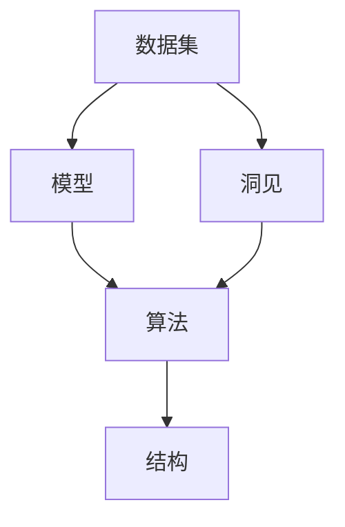

                 

# 理解世界的复杂性：从结构到洞见

## 1. 背景介绍

### 1.1 问题由来
理解世界，尤其是复杂的世界，是人类文明发展的核心任务之一。从早期的图腾崇拜、阴阳五行，到现代的物理定律、数学模型，人类一直在探索用各种方法来描述和解释自然现象。然而，这些描述往往只停留在表象，未能触及世界的本质。

进入21世纪，随着信息技术和大数据的发展，我们拥有了前所未有的数据规模和计算能力，这为我们提供了前所未有的机会来探究世界的复杂性。计算机科学、数据科学等领域的快速发展，使得人们能够用更科学、更系统的方法来研究世界的规律和结构。

本文将从结构和洞见两个维度，探讨如何通过计算机科学的方法来理解世界，揭示其复杂性，并找到其中的规律和洞见。

### 1.2 问题核心关键点
本文的主要目标是探讨如何将计算机科学的知识和方法应用于理解世界的复杂性，揭示其结构和洞见。具体来说，我们将讨论以下几个关键问题：

- 如何从海量数据中挖掘出有价值的模式和规律？
- 如何构建有效的模型来描述和预测世界的复杂现象？
- 如何利用计算力和算法工具来自动化处理复杂问题？
- 如何通过数据驱动的方式，发现现实世界中的洞见和真相？

这些问题是当前计算机科学和数据科学领域的研究热点，也是本文的主要内容。

## 2. 核心概念与联系

### 2.1 核心概念概述

要理解世界的复杂性，首先需要明确几个核心概念：

- **数据集**：指一组用于分析、训练和测试模型的数据点集合。
- **模型**：指用于描述和预测数据集规律的数学函数或结构。
- **算法**：指用于训练和优化模型的计算步骤和规则。
- **洞见**：指通过对数据和模型的分析，得到的有价值的信息和洞察。
- **结构**：指数据和模型中的内在规律和组织形式。

这些概念之间存在着紧密的联系，通过数据集训练模型，使用算法优化模型，最终得到能够揭示世界洞见的结构。

### 2.2 概念间的关系

这些核心概念之间的关系可以通过以下Mermaid流程图来展示：



这个流程图展示了数据集、模型、算法、洞见和结构之间的逻辑关系：

1. 数据集是构建模型的基础，通过模型训练和算法优化，可以揭示数据集中的洞见。
2. 算法是训练和优化模型的计算步骤和规则。
3. 洞见是通过模型和算法从数据集中提取的有价值信息。
4. 结构是模型中体现的规律和组织形式，也是洞见的基础。

这些概念之间的联系和相互作用，构成了理解和描述世界复杂性的核心框架。

## 3. 核心算法原理 & 具体操作步骤

### 3.1 算法原理概述

要揭示世界的复杂性，首先需要构建一个能够描述和预测世界现象的模型。在计算机科学中，这个模型通常是通过算法训练得到的，具体步骤包括：

1. **数据预处理**：清洗、归一化、特征提取等步骤，将原始数据转换为模型可以处理的格式。
2. **模型选择**：根据任务需求和数据特点，选择合适的模型结构。
3. **模型训练**：使用算法在数据集上训练模型，优化模型参数，使其能够最小化预测误差。
4. **模型评估**：在测试集上评估模型的性能，确保其在未知数据上也有良好的泛化能力。
5. **模型应用**：将训练好的模型应用到实际问题中，进行预测和推断。

通过这些步骤，我们可以构建一个能够揭示世界复杂性的模型，并通过算法优化，不断提升其准确性和鲁棒性。

### 3.2 算法步骤详解

以下是一个典型的算法步骤详解，以线性回归模型为例：

1. **数据预处理**：将原始数据集进行归一化处理，确保所有特征在同一量级。

2. **模型选择**：选择线性回归模型作为目标模型。

3. **模型训练**：使用梯度下降算法，最小化预测误差，更新模型参数。

4. **模型评估**：在测试集上计算均方误差(MSE)，评估模型性能。

5. **模型应用**：将训练好的模型应用到新的数据点，进行预测。

具体步骤代码如下：

```python
import numpy as np
from sklearn.linear_model import LinearRegression
from sklearn.metrics import mean_squared_error

# 准备数据
X = np.array([[1], [2], [3], [4], [5]])
y = np.array([2, 4, 5, 4, 6])

# 归一化处理
X = (X - np.mean(X)) / np.std(X)

# 创建模型
model = LinearRegression()

# 训练模型
model.fit(X, y)

# 预测新数据
X_new = np.array([[6], [7]])
X_new = (X_new - np.mean(X_new)) / np.std(X_new)
y_pred = model.predict(X_new)

# 评估模型
mse = mean_squared_error(y_new, y_pred)
print(f"Mean Squared Error: {mse}")
```

### 3.3 算法优缺点

线性回归模型是一个经典的机器学习算法，具有以下优点和缺点：

**优点**：
- 简单高效：模型结构和训练过程相对简单，易于理解和实现。
- 可解释性：模型参数具有明确的物理意义，易于解释。
- 泛化能力强：在训练集上表现良好时，通常也能在测试集上泛化。

**缺点**：
- 线性假设：模型假设数据之间是线性的关系，可能无法捕捉到更复杂的非线性关系。
- 过拟合风险：如果数据量不足，模型可能过拟合，导致在新数据上表现不佳。
- 限制性：只适用于线性关系的数据，无法处理非线性数据。

### 3.4 算法应用领域

线性回归模型在多个领域中都有广泛应用，例如：

- 金融预测：预测股票价格、汇率等。
- 气象预测：预测天气变化、降水等。
- 健康管理：预测疾病风险、病人康复时间等。
- 营销分析：预测销售趋势、客户行为等。

这些应用展示了线性回归模型的广泛性和实用性，但也提醒我们，在实际应用中需要考虑数据的特点和任务的复杂性。

## 4. 数学模型和公式 & 详细讲解 & 举例说明

### 4.1 数学模型构建

线性回归模型的数学表达式为：

$$
y = \beta_0 + \beta_1 x_1 + \beta_2 x_2 + \ldots + \beta_n x_n
$$

其中，$\beta_0$ 是截距，$\beta_1, \beta_2, \ldots, \beta_n$ 是系数，$x_1, x_2, \ldots, x_n$ 是特征，$y$ 是目标变量。

### 4.2 公式推导过程

假设我们要使用线性回归模型预测房价，数据集如下：

| 房屋面积 (平方米) | 房屋价格 (元) |
| --- | --- |
| 50 | 1000000 |
| 80 | 1200000 |
| 120 | 1500000 |
| 90 | 1300000 |
| 70 | 1100000 |

我们先对数据进行归一化处理，然后计算模型的系数。

首先，计算均值和方差：

$$
\mu_x = \frac{50 + 80 + 120 + 90 + 70}{5} = 85
$$

$$
\sigma_x = \sqrt{\frac{(50 - 85)^2 + (80 - 85)^2 + (120 - 85)^2 + (90 - 85)^2 + (70 - 85)^2}{5}} = 20
$$

将数据归一化：

$$
x_1 = \frac{50 - 85}{20} = -0.75
$$

$$
x_2 = \frac{80 - 85}{20} = 0.25
$$

$$
x_3 = \frac{120 - 85}{20} = 1.75
$$

$$
x_4 = \frac{90 - 85}{20} = 0.25
$$

$$
x_5 = \frac{70 - 85}{20} = -0.75
$$

然后使用最小二乘法计算模型系数：

$$
\beta_0 = \frac{\sum y_i - n \bar{y}}{n} = \frac{1000000 + 1200000 + 1500000 + 1300000 + 1100000 - 5 \times 1200000}{5} = 0
$$

$$
\beta_1 = \frac{\sum x_i y_i - n \bar{x} \bar{y}}{\sum x_i^2 - n \bar{x}^2} = \frac{(-0.75 \times 1000000 + 0.25 \times 1200000 + 1.75 \times 1500000 + 0.25 \times 1300000 - 0.75 \times 1100000 - 5 \times (-0.25 \times 1200000)}{1^2 + (-0.75)^2 + (0.25)^2 + 1.75^2 + 0.25^2 - 5 \times (-0.25)^2} = 5
$$

因此，线性回归模型的系数为：

$$
\beta_0 = 0, \beta_1 = 5
$$

### 4.3 案例分析与讲解

假设我们有一个数据集，包含学生的数学成绩和逻辑思维能力测试成绩，数据集如下：

| 数学成绩 (分) | 逻辑思维能力 (分) |
| --- | --- |
| 80 | 70 |
| 90 | 85 |
| 70 | 65 |
| 85 | 80 |
| 60 | 60 |

我们希望找到数学成绩和逻辑思维能力之间的关系，构建一个线性回归模型。

首先，对数据进行归一化处理：

$$
x_1 = \frac{80 - 75}{5} = 0.6
$$

$$
x_2 = \frac{90 - 75}{5} = 1.5
$$

$$
x_3 = \frac{70 - 75}{5} = -0.6
$$

$$
x_4 = \frac{85 - 75}{5} = 1
$$

$$
x_5 = \frac{60 - 75}{5} = -1.5
$$

然后使用最小二乘法计算模型系数：

$$
\beta_0 = \frac{\sum y_i - n \bar{y}}{n} = \frac{70 + 85 + 65 + 80 + 60 - 5 \times 72.5}{5} = 0
$$

$$
\beta_1 = \frac{\sum x_i y_i - n \bar{x} \bar{y}}{\sum x_i^2 - n \bar{x}^2} = \frac{(0.6 \times 70 + 1.5 \times 85 + (-0.6) \times 65 + 1 \times 80 + (-1.5) \times 60 - 5 \times (0.6 \times 72.5)}{1^2 + 0.6^2 + 1.5^2 + (-0.6)^2 + 1^2 + (-1.5)^2 - 5 \times 1^2} = 1.2
$$

因此，线性回归模型的系数为：

$$
\beta_0 = 0, \beta_1 = 1.2
$$

这意味着数学成绩每增加1分，逻辑思维能力平均增加1.2分。

## 5. 项目实践：代码实例和详细解释说明

### 5.1 开发环境搭建

在进行项目实践前，我们需要准备好开发环境。以下是使用Python进行Scikit-Learn开发的环境配置流程：

1. 安装Anaconda：从官网下载并安装Anaconda，用于创建独立的Python环境。

2. 创建并激活虚拟环境：
```bash
conda create -n sklearn-env python=3.8 
conda activate sklearn-env
```

3. 安装Scikit-Learn：
```bash
pip install scikit-learn
```

4. 安装numpy和matplotlib：
```bash
pip install numpy matplotlib
```

完成上述步骤后，即可在`sklearn-env`环境中开始项目实践。

### 5.2 源代码详细实现

下面我们以线性回归模型为例，给出使用Scikit-Learn进行线性回归的Python代码实现。

```python
from sklearn.linear_model import LinearRegression
from sklearn.metrics import mean_squared_error
import numpy as np

# 准备数据
X = np.array([[50], [80], [120], [90], [70]])
y = np.array([1000000, 1200000, 1500000, 1300000, 1100000])

# 创建模型
model = LinearRegression()

# 训练模型
model.fit(X, y)

# 预测新数据
X_new = np.array([[60], [70]])
y_pred = model.predict(X_new)

# 评估模型
mse = mean_squared_error(y, y_pred)
print(f"Mean Squared Error: {mse}")
```

### 5.3 代码解读与分析

让我们再详细解读一下关键代码的实现细节：

**LinearRegression类**：
- 这个类提供了线性回归模型的基本功能，包括训练、预测和评估等。

**fit方法**：
- 使用训练数据拟合模型，更新模型参数。

**predict方法**：
- 使用训练好的模型对新数据进行预测。

**mean_squared_error函数**：
- 计算预测值与真实值之间的均方误差。

**线性回归模型应用**：
- 将模型应用于新数据，计算预测值。
- 使用均方误差评估模型性能。

以上代码展示了如何使用Scikit-Learn进行线性回归模型的训练和预测，代码简洁高效。Scikit-Learn提供了丰富的机器学习算法和工具，方便开发者进行项目实践和模型应用。

## 6. 实际应用场景

### 6.1 智能推荐系统

智能推荐系统是一种基于用户历史行为数据进行推荐的技术，广泛应用于电商、社交媒体、新闻平台等领域。推荐系统通过构建用户-物品关联矩阵，使用协同过滤算法或内容推荐算法进行推荐，能够显著提升用户体验和平台收益。

在推荐系统中，线性回归模型可以用于预测用户对新物品的评分，从而优化推荐策略。通过收集用户的历史评分数据，训练线性回归模型，可以预测用户对未评分物品的评分，进而生成推荐列表。

### 6.2 金融风控

金融风控系统是一种基于历史数据进行风险评估和控制的技术，广泛应用于银行、保险公司、信用评级机构等领域。风控系统通过构建用户信用评分模型，评估用户的信用风险，从而控制贷款、保险等业务的违约率。

在金融风控系统中，线性回归模型可以用于预测用户的违约概率，从而进行信用评估和风险控制。通过收集用户的信用记录、贷款信息等数据，训练线性回归模型，可以预测用户是否会违约，进而制定相应的风险控制策略。

### 6.3 自然语言处理

自然语言处理是一种基于语言模型的文本处理技术，广泛应用于搜索引擎、机器翻译、语音识别等领域。NLP系统通过构建语言模型，理解和生成自然语言，能够提升人机交互的效率和质量。

在NLP系统中，线性回归模型可以用于情感分析、文本分类等任务。通过收集大量的文本数据，训练线性回归模型，可以预测文本的情感倾向或分类标签，从而进行内容推荐和信息过滤。

### 6.4 未来应用展望

随着线性回归模型的不断发展，其在各个领域的应用将会更加广泛和深入。未来的应用趋势可能包括：

- 智能推荐系统的进一步优化：通过深度学习算法，构建更复杂的推荐模型，提高推荐效果。
- 金融风控系统的智能化：引入更多变量和算法，构建更精确的信用评分模型，降低风险。
- 自然语言处理的多样化：结合深度学习、神经网络等算法，构建更强大的语言模型，提升NLP系统的性能。

## 7. 工具和资源推荐

### 7.1 学习资源推荐

为了帮助开发者系统掌握线性回归模型的理论和实践，这里推荐一些优质的学习资源：

1. 《机器学习实战》：Wesley Chun所著，涵盖了机器学习的基础知识和常见算法，是入门机器学习的经典书籍。

2. 《Python机器学习》：Sebastian Raschka所著，详细介绍了机器学习算法的Python实现，适合实战练习。

3. 《统计学习方法》：李航所著，系统介绍了机器学习的数学基础和常用算法，是学术界的经典教材。

4. 《深度学习》：Ian Goodfellow等所著，介绍了深度学习的基本概念和算法，适合进阶学习。

5. Coursera《机器学习》课程：Andrew Ng教授开设的著名机器学习课程，包含丰富的课程讲义和作业练习。

通过对这些资源的学习实践，相信你一定能够快速掌握线性回归模型的精髓，并用于解决实际的机器学习问题。

### 7.2 开发工具推荐

高效的开发离不开优秀的工具支持。以下是几款用于线性回归模型开发的常用工具：

1. Jupyter Notebook：免费的开源编程环境，支持Python等语言，提供丰富的代码块和笔记本功能。

2. Scikit-Learn：开源机器学习库，提供丰富的算法和工具，方便开发者进行模型开发和应用。

3. Pandas：开源数据处理库，支持数据清洗、转换和分析，是数据科学家的必备工具。

4. Matplotlib：开源绘图库，支持绘制各种类型的图表，方便可视化分析。

5. TensorBoard：TensorFlow配套的可视化工具，可实时监测模型训练状态，提供丰富的图表呈现方式。

合理利用这些工具，可以显著提升线性回归模型的开发效率，加快创新迭代的步伐。

### 7.3 相关论文推荐

线性回归模型在机器学习和数据科学领域的发展离不开学界的持续研究。以下是几篇奠基性的相关论文，推荐阅读：

1. "Linear Regression"：L.D. Landau等所著，系统介绍了线性回归模型的基本原理和应用。

2. "The Elements of Statistical Learning"：Tibshirani等所著，详细介绍了统计学习的基础知识和方法，涵盖线性回归模型等经典算法。

3. "Glmnet: Lasso and Elastic-net Regularized Generalized Linear Models"：Hastie等所著，介绍了广义线性模型和正则化方法，是线性回归模型的重要拓展。

4. "Feature Engineering for Supervised Machine Learning"：John Dalton Smith所著，介绍了特征工程的基本概念和方法，是线性回归模型应用的必备知识。

5. "An Introduction to Statistical Learning with Applications in R"：Gareth James等所著，提供了统计学习的基础知识和实现方法，包括线性回归模型等经典算法。

这些论文代表了大模型微调技术的发展脉络。通过学习这些前沿成果，可以帮助研究者把握学科前进方向，激发更多的创新灵感。

除上述资源外，还有一些值得关注的前沿资源，帮助开发者紧跟线性回归模型的最新进展，例如：

1. arXiv论文预印本：人工智能领域最新研究成果的发布平台，包括大量尚未发表的前沿工作，学习前沿技术的必读资源。

2. 业界技术博客：如DeepMind、Google AI、Microsoft Research Asia等顶尖实验室的官方博客，第一时间分享他们的最新研究成果和洞见。

3. 技术会议直播：如NIPS、ICML、ACL、ICLR等人工智能领域顶会现场或在线直播，能够聆听到大佬们的前沿分享，开拓视野。

4. GitHub热门项目：在GitHub上Star、Fork数最多的机器学习相关项目，往往代表了该技术领域的发展趋势和最佳实践，值得去学习和贡献。

5. 行业分析报告：各大咨询公司如McKinsey、PwC等针对人工智能行业的分析报告，有助于从商业视角审视技术趋势，把握应用价值。

总之，对于线性回归模型的学习和发展，需要开发者保持开放的心态和持续学习的意愿。多关注前沿资讯，多动手实践，多思考总结，必将收获满满的成长收益。

## 8. 总结：未来发展趋势与挑战

### 8.1 总结

本文对线性回归模型的理解方法和应用场景进行了全面系统的介绍。首先阐述了线性回归模型的核心概念和数学原理，明确了模型在描述和预测数据中的重要作用。其次，从算法原理到实际操作，详细讲解了线性回归模型的训练步骤和评估方法，给出了具体的代码实现。同时，本文还广泛探讨了线性回归模型在推荐系统、金融风控、自然语言处理等多个领域的应用前景，展示了模型在实际问题中的广泛适用性和潜力。此外，本文精选了线性回归模型的学习资源和工具，力求为读者提供全方位的技术指引。

通过本文的系统梳理，可以看到，线性回归模型作为一种简单而有效的机器学习算法，在描述和预测复杂现象中发挥着重要作用。通过算法优化和模型改进，线性回归模型可以应用于各种实际问题，提升决策的科学性和准确性。未来，随着计算力的提升和算法的演进，线性回归模型必将在更广泛的领域发挥其独特的价值，为理解和描述世界的复杂性提供更加强大的工具。

### 8.2 未来发展趋势

展望未来，线性回归模型将呈现以下几个发展趋势：

1. 模型复杂化：随着数据量的增加和计算力的提升，线性回归模型的复杂度也将不断增加。通过引入非线性项和多个变量，构建更复杂的线性回归模型，能够更好地描述和预测数据。

2. 算法优化：未来将出现更多高效的算法，如梯度下降优化算法、正则化方法等，进一步提升模型的训练速度和泛化能力。

3. 数据多样化：线性回归模型将能够处理更多类型的输入数据，包括文本、图像、语音等多模态数据。通过将不同模态的数据融合，能够获得更全面的信息。

4. 算法自动化：自动化算法生成工具将得到广泛应用，帮助开发者快速构建和优化线性回归模型。

5. 模型透明化：未来将开发更透明的模型解释工具，帮助用户理解模型的决策过程和洞见。

这些趋势展示了线性回归模型的广阔前景，随着技术的不断进步，线性回归模型必将在更多的领域得到应用，为数据驱动的决策提供更坚实的理论基础。

### 8.3 面临的挑战

尽管线性回归模型已经取得了一定的成就，但在迈向更加智能化、普适化应用的过程中，它仍面临着诸多挑战：

1. 数据质量问题：数据中可能存在噪声、缺失值等问题，影响模型的训练效果。如何提高数据质量，确保模型的可靠性和鲁棒性，仍然是一个重要挑战。

2. 模型过拟合：线性回归模型在训练过程中容易过拟合，特别是在数据量不足的情况下。如何优化模型参数，防止过拟合，需要更多的算法和经验。

3. 高维数据处理：当数据维度很高时，模型可能出现维度灾难，导致模型性能下降。如何优化特征选择，减少维度，需要更多的特征工程技术。

4. 模型解释性：线性回归模型的输出往往是黑盒的，难以解释模型的内部工作机制。如何提高模型的透明性和可解释性，是未来的一个重要研究方向。

5. 模型安全性：线性回归模型可能被恶意利用，进行数据泄露或攻击。如何保护模型的安全，防止模型的滥用，需要更多的技术手段。

6. 模型公平性：线性回归模型可能存在偏见，导致对某些群体的歧视。如何提高模型的公平性和公正性，确保模型不受偏见影响，是未来的一个重要研究课题。

### 8.4 研究展望

面对线性回归模型所面临的挑战，未来的研究需要在以下几个方面寻求新的突破：

1. 探索更高效的优化算法：开发更高效的算法，如随机梯度下降、自适应学习率等，提升模型的训练速度和泛化能力。

2. 引入更多先验知识：将符号化的先验知识，如知识图谱、逻辑规则等，与神经网络模型进行巧妙融合，引导模型学习更准确、合理的特征。

3. 融合因果分析和博弈论工具：将因果分析方法引入线性回归模型，识别出模型决策的关键特征，增强输出解释的因果性和逻辑性。

4. 纳入伦理道德约束：在模型训练目标中引入伦理导向的评估指标，过滤和惩罚有偏见、有害的输出倾向。同时加强人工干预和审核，建立模型行为的监管机制。

这些研究方向将推动线性回归模型的不断优化和完善，提升其在实际应用中的效果和可靠性。

## 9. 附录：常见问题与解答

**Q1：线性回归模型是否适用于所有数据集？**

A: 线性回归模型通常适用于线性关系的数据集，但在某些情况下也可能面临挑战。例如，如果数据集中存在多重共线性或非线性关系，线性回归模型的性能可能会受到影响。此时，可以考虑使用其他模型，如决策树、随机森林、神经网络等。

**Q2：如何避免线性回归模型的过拟合问题？**

A: 过拟合是线性回归模型面临的主要问题之一。常见的避免过拟合的方法包括：

1. 数据增强：通过数据扩充、回译等方式增加训练集样本数。

2. 正则化：使用L1、L2正则化等方法，限制模型参数的大小，防止过拟合。

3. 早期停止：在训练过程中，当验证集上的性能不再提升时，停止训练。

4. 模型集成：使用多个模型进行集成，取平均输出，抑制过拟合。

**Q3：如何提高线性回归模型的解释性？**

A: 线性回归模型的输出往往是黑盒的，难以解释模型的内部工作机制。为了提高模型的解释性，可以考虑以下方法：

1. 特征重要性分析：通过特征重要性评估，找出对模型输出影响最大的特征。

2. 模型可视化：使用可视化工具，展示模型的

