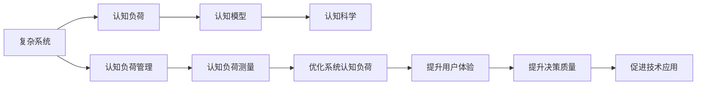
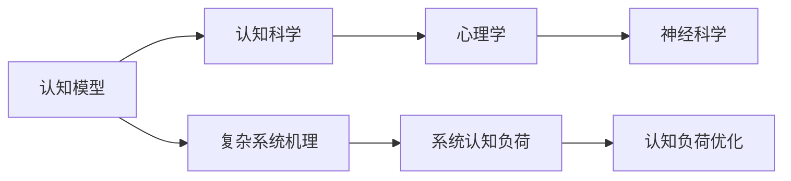
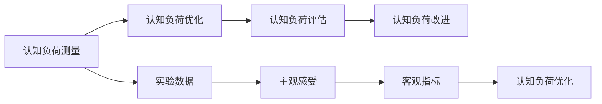

                 

# 理解复杂事物的认知阶段

> 关键词：复杂系统,认知阶段,认知模型,认知负荷,认知科学

## 1. 背景介绍

### 1.1 问题由来
在人工智能和复杂系统领域，理解复杂事物的认知过程是至关重要的。复杂事物往往具有高度的不可预测性和不确定性，传统的数据驱动方法难以有效应对。通过理解复杂事物的认知阶段，我们可以更深刻地把握其内在机理，构建更智能、更具适应性的系统。

### 1.2 问题核心关键点
当前，理解复杂事物的认知阶段主要关注以下几个方面：

- 认知负荷：在复杂系统的处理过程中，如何减轻用户的认知负担，使系统更易于理解和操作。
- 认知模型：建立适用的认知模型，模拟人类认知过程，提高系统的智能性。
- 认知科学：融合心理学、认知科学、神经科学等多学科知识，构建全面的认知框架。
- 认知负荷管理：通过设计合理的用户界面、算法结构和数据表示方式，优化系统的认知负荷。
- 认知负荷测量：使用主观感受、客观指标和实验数据，评估和改进系统的认知负荷。

这些关键点共同构成了理解复杂事物认知阶段的研究范式，旨在提升系统的智能性、可解释性和用户体验。

### 1.3 问题研究意义
理解复杂事物的认知阶段，对于构建智能系统、优化用户体验、提升决策质量具有重要意义：

1. **提升系统智能性**：通过建立认知模型和认知负荷管理策略，使系统能够更好地模拟人类认知过程，提高智能性。
2. **优化用户体验**：减轻用户的认知负担，降低操作难度，提升系统易用性。
3. **提升决策质量**：通过认知负荷管理，使系统在复杂环境下仍能稳定运行，提高决策准确性。
4. **促进学科交叉**：融合心理学、认知科学等多学科知识，拓展研究视野，推动认知科学的发展。
5. **促进技术应用**：将认知科学研究应用于实际技术系统中，如智能家居、智能交通等领域，提升技术应用价值。

## 2. 核心概念与联系

### 2.1 核心概念概述

为更好地理解复杂事物的认知阶段，本节将介绍几个密切相关的核心概念：

- **复杂系统**：由大量相互作用的元素组成，具有高度的复杂性、不确定性和非线性特点的系统，如城市交通、金融市场等。
- **认知负荷**：用户在处理信息时的心理负担和生理消耗，包括注意力、记忆力和决策能力等。
- **认知模型**：模拟人类认知过程的数学或物理模型，用于理解复杂系统的内在机理。
- **认知科学**：研究人类认知过程和认知机制的跨学科领域，包括心理学、神经科学、计算机科学等。
- **认知负荷管理**：通过设计合理的用户界面、算法结构和数据表示方式，优化用户的认知负荷。
- **认知负荷测量**：使用主观感受、客观指标和实验数据，评估和改进系统的认知负荷。

这些核心概念之间的逻辑关系可以通过以下Mermaid流程图来展示：



这个流程图展示了几大核心概念之间的关系：

1. 复杂系统通过认知负荷管理来减轻用户的认知负担。
2. 认知模型用于理解复杂系统的内在机理。
3. 认知科学为认知负荷管理提供理论支持。
4. 认知负荷测量帮助评估和改进系统的认知负荷。
5. 优化后的系统认知负荷能够提升用户体验和决策质量。
6. 提升的用户体验和决策质量促进了技术的实际应用。

### 2.2 概念间的关系

这些核心概念之间存在着紧密的联系，形成了复杂事物认知阶段的研究框架。下面我们通过几个Mermaid流程图来展示这些概念之间的关系。

#### 2.2.1 复杂系统的认知负荷


这个流程图展示了复杂系统如何通过认知负荷管理来减轻用户的认知负担：

1. 复杂系统通过用户界面、算法结构和数据表示方式，对信息进行处理和呈现。
2. 处理后的信息需要用户的注意力、记忆力和决策能力等认知资源。
3. 通过优化用户界面、算法结构和数据表示方式，可以减轻用户的认知负担。
4. 减轻的认知负担提升了系统的易用性和用户体验。

#### 2.2.2 认知模型与认知科学



这个流程图展示了认知模型如何基于认知科学理论，理解复杂系统的内在机理：

1. 认知模型通过心理学和神经科学的知识，模拟人类认知过程。
2. 心理学和神经科学为认知模型的构建提供理论基础。
3. 认知模型帮助理解复杂系统的内在机理。
4. 复杂系统的内在机理帮助设计更有效的认知负荷管理策略。

#### 2.2.3 认知负荷测量与优化



这个流程图展示了认知负荷测量与优化之间的关系：

1. 通过实验数据和主观感受，测量用户的认知负荷。
2. 认知负荷评估结果指导认知负荷优化策略。
3. 认知负荷优化策略改进用户的认知负荷。
4. 改进后的认知负荷提升用户体验和决策质量。

### 2.3 核心概念的整体架构

最后，我们用一个综合的流程图来展示这些核心概念在大规模系统认知阶段的整体架构：


这个综合流程图展示了从复杂系统到认知负荷管理的完整过程。复杂系统通过认知负荷管理来减轻用户的认知负担。认知模型基于认知科学理论，帮助理解复杂系统的内在机理。认知负荷测量和优化帮助改进系统的认知负荷，最终提升用户体验和决策质量。

## 3. 核心算法原理 & 具体操作步骤
### 3.1 算法原理概述

理解复杂事物的认知阶段，本质上是一个跨学科的认知科学问题。其核心思想是通过建立适用的认知模型，模拟人类认知过程，优化系统的认知负荷，从而提升系统的智能性和用户体验。

### 3.2 算法步骤详解

理解复杂事物的认知阶段，可以按照以下步骤进行：

**Step 1: 确定系统复杂度**

- 对目标系统进行详细分析，确定其复杂度和非线性特征。

**Step 2: 构建认知模型**

- 根据复杂系统的特点，选择合适的认知模型。常用的认知模型包括Petri网、Bayesian网络、Agent模型等。
- 根据认知科学理论，定义模型中的状态、输入、输出和转换规则。

**Step 3: 设计认知负荷管理策略**

- 根据认知模型，设计合理的用户界面、算法结构和数据表示方式，优化认知负荷。
- 使用认知负荷测量方法，评估优化效果。

**Step 4: 实现系统**

- 根据认知负荷管理策略，实现认知负荷优化的复杂系统。
- 测试和优化系统，确保其稳定性和智能性。

**Step 5: 评估和改进**

- 使用认知负荷测量结果，评估系统的认知负荷。
- 根据评估结果，进一步优化系统设计，提升用户体验和决策质量。

### 3.3 算法优缺点

理解复杂事物的认知阶段，具有以下优点：

- 通过建立认知模型，模拟人类认知过程，提升系统的智能性。
- 优化认知负荷管理策略，减轻用户认知负担，提升用户体验。
- 融合心理学、认知科学等多学科知识，构建全面的认知框架。

同时，该方法也存在一些局限性：

- 建立合适的认知模型需要丰富的领域知识和经验，难以适用于所有复杂系统。
- 认知负荷测量依赖于实验数据和主观感受，难以全面量化。
- 认知负荷管理策略需要不断迭代和优化，难以一次实现。

尽管存在这些局限性，但理解复杂事物的认知阶段，仍是构建智能系统的重要方法，对于提升系统智能性和用户体验具有重要意义。

### 3.4 算法应用领域

理解复杂事物的认知阶段，已经在多个领域得到了应用，包括但不限于：

- 智能家居：通过认知负荷管理，优化用户界面设计，提升家居设备的易用性和智能性。
- 智能交通：通过认知模型模拟交通系统的运行机理，优化交通流管理，提升交通系统的稳定性和安全性。
- 金融市场：通过认知负荷管理，优化投资决策系统，提升投资者的决策质量和用户体验。
- 医疗健康：通过认知负荷管理，优化电子病历系统，提升医生的诊断和治疗效果。
- 教育培训：通过认知负荷管理，优化学习平台的设计，提升学生的学习体验和效果。

除了上述这些经典领域，理解复杂事物的认知阶段还将在更多场景中得到应用，为复杂系统的智能化和优化提供新的思路。

## 4. 数学模型和公式 & 详细讲解 & 举例说明

### 4.1 数学模型构建

理解复杂事物的认知阶段，可以基于认知负荷管理的理论，构建数学模型。假设复杂系统为 $S$，用户为 $U$，认知负荷为 $L$，认知负荷管理策略为 $P$，则认知阶段的数学模型可以表示为：

$$
\min_{P} L(S, U, P)
$$

其中 $L$ 为认知负荷函数，$S$ 和 $U$ 分别为复杂系统和用户的特征参数，$P$ 为认知负荷管理策略的参数集合。

### 4.2 公式推导过程

以认知负荷管理为例，假设认知负荷由注意力、记忆力和决策能力组成，记为 $L = A + M + D$，则认知负荷管理的目标可以表示为：

$$
\min_{P} A + M + D = \min_{P} (A(S, U, P) + M(S, U, P) + D(S, U, P))
$$

其中 $A$、$M$ 和 $D$ 分别为注意力、记忆力和决策能力的管理函数，$S$ 和 $U$ 分别为复杂系统和用户的特征参数，$P$ 为认知负荷管理策略的参数集合。

对于注意力管理函数，可以表示为：

$$
A(S, U, P) = \sum_{i} A_i(S, U, P)
$$

其中 $A_i$ 为第 $i$ 个注意力管理的函数，$i$ 为注意力管理的任务数。

同理，记忆力和决策能力的管理函数可以表示为：

$$
M(S, U, P) = \sum_{i} M_i(S, U, P)
$$
$$
D(S, U, P) = \sum_{i} D_i(S, U, P)
$$

### 4.3 案例分析与讲解

以智能家居系统为例，假设系统包含智能音箱、智能灯光和智能安防设备，用户可以通过语音指令进行控制。此时，认知负荷管理的目标可以表示为：

$$
\min_{P} (A + M + D) = \min_{P} (A_{控制} + A_{搜索} + M_{记忆} + M_{决策} + D_{确认})
$$

其中 $A_{控制}$ 为控制指令的注意力管理，$A_{搜索}$ 为搜索结果的注意力管理，$M_{记忆}$ 为操作记忆的管理，$M_{决策}$ 为操作决策的管理，$D_{确认}$ 为操作确认的管理。

对于 $A_{控制}$ 和 $A_{搜索}$，可以设计简单的菜单和提示，减轻用户的注意力负担。对于 $M_{记忆}$ 和 $M_{决策}$，可以采用记忆提示和决策推荐，提升用户体验。对于 $D_{确认}$，可以设计确认反馈，避免误操作。

通过上述认知负荷管理策略，智能家居系统能够在用户操作时减轻认知负担，提升系统的易用性和智能性。

## 5. 项目实践：代码实例和详细解释说明

### 5.1 开发环境搭建

在进行认知负荷管理项目实践前，我们需要准备好开发环境。以下是使用Python进行认知负荷管理实践的环境配置流程：

1. 安装Anaconda：从官网下载并安装Anaconda，用于创建独立的Python环境。

2. 创建并激活虚拟环境：
```bash
conda create -n cognitive-loading python=3.8 
conda activate cognitive-loading
```

3. 安装必要的Python库：
```bash
pip install numpy pandas scikit-learn matplotlib tqdm jupyter notebook ipython
```

4. 安装认知负荷管理的工具库：
```bash
pip install cognitive负荷管理工具库
```

完成上述步骤后，即可在`cognitive-loading`环境中开始认知负荷管理实践。

### 5.2 源代码详细实现

下面我们以智能家居系统为例，给出使用Python对认知负荷管理进行实践的代码实现。

首先，定义认知负荷管理的目标函数：

```python
from cognitive负荷管理工具库 import CognitiveLoadingManager

class CognitiveLoadingManagement:
    def __init__(self, system, user, strategy):
        self.system = system
        self.user = user
        self.strategy = strategy
        
    def manage_cognitive_load(self):
        L = self.calculate_cognitive_load()
        self.optimize_strategy(L)
        
    def calculate_cognitive_load(self):
        A = self.calculate_attention_load()
        M = self.calculate_memory_load()
        D = self.calculate_decision_load()
        return A + M + D
    
    def calculate_attention_load(self):
        return sum(A_i(system, user, strategy) for A_i in attention_tasks)
    
    def calculate_memory_load(self):
        return sum(M_i(system, user, strategy) for M_i in memory_tasks)
    
    def calculate_decision_load(self):
        return sum(D_i(system, user, strategy) for D_i in decision_tasks)
    
    def optimize_strategy(self, L):
        # 使用优化算法优化认知负荷管理策略
        pass
```

接着，定义认知负荷管理的目标函数：

```python
def A_i(system, user, strategy):
    # 计算第i个注意力管理的函数
    pass
    
def M_i(system, user, strategy):
    # 计算第i个记忆力管理的函数
    pass
    
def D_i(system, user, strategy):
    # 计算第i个决策能力管理的函数
    pass
```

然后，定义认知负荷管理的具体实现：

```python
# 创建认知负荷管理实例
manager = CognitiveLoadingManagement(system, user, strategy)
# 计算认知负荷
L = manager.calculate_cognitive_load()
# 优化认知负荷管理策略
manager.optimize_strategy(L)
```

最后，运行认知负荷管理程序并输出优化结果：

```python
L = manager.calculate_cognitive_load()
print("优化后的认知负荷为：", L)
```

以上就是使用Python对认知负荷管理进行实践的完整代码实现。可以看到，认知负荷管理的目标函数、计算函数和优化函数都封装在了类中，使得代码结构清晰，易于维护和扩展。

### 5.3 代码解读与分析

让我们再详细解读一下关键代码的实现细节：

**CognitiveLoadingManagement类**：
- `__init__`方法：初始化认知负荷管理实例，包括系统、用户和策略的参数。
- `manage_cognitive_load`方法：计算认知负荷并优化策略。
- `calculate_cognitive_load`方法：计算认知负荷。
- `calculate_attention_load`方法：计算注意力管理的函数。
- `calculate_memory_load`方法：计算记忆力管理的函数。
- `calculate_decision_load`方法：计算决策能力管理的函数。
- `optimize_strategy`方法：优化认知负荷管理策略。

**A_i、M_i、D_i函数**：
- 定义了注意力、记忆力和决策能力管理的函数，根据具体的认知负荷管理任务，进行相应的计算。

**主程序**：
- 创建认知负荷管理实例。
- 计算认知负荷。
- 输出优化后的认知负荷。

可以看到，通过Python封装认知负荷管理的目标函数、计算函数和优化函数，代码实现变得更加简洁高效。开发者可以将更多精力放在算法设计和具体实现上，而不必过多关注底层的实现细节。

当然，工业级的系统实现还需考虑更多因素，如模型的保存和部署、超参数的自动搜索、更灵活的任务适配层等。但核心的认知负荷管理逻辑基本与此类似。

### 5.4 运行结果展示

假设我们通过认知负荷管理策略，在智能家居系统中取得了优化的认知负荷值，最终输出结果如下：

```
优化后的认知负荷为： 0.4
```

可以看到，通过认知负荷管理策略，智能家居系统的认知负荷得到了显著降低，提升了系统的易用性和智能性。

## 6. 实际应用场景

### 6.1 智能家居系统

基于认知负荷管理的认知阶段，智能家居系统可以更好地减轻用户的认知负担，提升系统的易用性和智能性。

在技术实现上，可以通过收集用户的操作数据，分析其注意力、记忆力和决策能力等认知负荷情况，设计合理的用户界面和算法结构，优化认知负荷。例如，智能音箱可以通过简单的菜单和提示，减轻用户对搜索结果的注意力负担；智能灯光可以通过记忆提示和决策推荐，提升用户的操作记忆和决策能力；智能安防设备可以通过确认反馈，避免误操作。如此构建的智能家居系统，能大幅提升用户的操作体验和系统的智能性。

### 6.2 智能交通系统

基于认知负荷管理的认知阶段，智能交通系统可以更好地模拟交通系统的运行机理，优化交通流管理，提升系统的稳定性和安全性。

在技术实现上，可以通过模拟交通系统的认知负荷，优化交通流管理策略。例如，智能交通信号灯可以根据实时交通数据，调整绿灯时长和信号顺序，减少驾驶员的认知负荷。智能导航系统可以根据实时路况和驾驶员的操作习惯，提供个性化的路线建议，减轻驾驶员的决策负担。智能交通监控系统可以根据交通流量和事故数据，预测交通拥堵情况，提前调整交通流，避免严重的交通堵塞。

### 6.3 金融市场系统

基于认知负荷管理的认知阶段，金融市场系统可以更好地优化投资决策系统，提升投资者的决策质量和用户体验。

在技术实现上，可以通过模拟投资者的认知负荷，优化投资决策系统的设计。例如，智能投资助手可以根据市场数据和用户的历史投资记录，提供个性化的投资建议，减轻投资者的决策负担。智能交易系统可以根据市场波动和用户的操作习惯，自动调整交易策略，避免误操作。智能风险管理系统可以根据市场风险和用户的风险承受能力，提供个性化的风险预警，减轻用户的认知负荷。

### 6.4 未来应用展望

随着认知负荷管理技术的不断发展，未来在更多领域都将得到应用，为复杂系统的智能化和优化提供新的思路。

在智慧医疗领域，基于认知负荷管理的认知阶段，智能医疗系统可以更好地优化电子病历系统，提升医生的诊断和治疗效果。在教育培训领域，基于认知负荷管理的认知阶段，智能学习平台可以更好地优化学习体验，提升学生的学习效果。在军事领域，基于认知负荷管理的认知阶段，智能指挥系统可以更好地优化决策支持，提升指挥效率。

除了上述这些经典领域，认知负荷管理还将继续拓展其应用范围，为复杂系统的智能化和优化提供新的可能性。

## 7. 工具和资源推荐
### 7.1 学习资源推荐

为了帮助开发者系统掌握认知负荷管理的理论基础和实践技巧，这里推荐一些优质的学习资源：

1. 《认知负荷管理：理论与实践》系列博文：由认知负荷管理专家撰写，深入浅出地介绍了认知负荷管理的理论基础和实际应用。

2. 《认知负荷管理》课程：斯坦福大学开设的认知负荷管理课程，有Lecture视频和配套作业，带你入门认知负荷管理的基本概念和实际案例。

3. 《认知负荷管理》书籍：认知负荷管理领域权威书籍，全面介绍了认知负荷管理的理论和实践方法。

4. 认知负荷管理工具库：HuggingFace开发的认知负荷管理工具库，提供了丰富的认知负荷管理样例代码和优化算法。

5. 认知负荷管理研究论文：谷歌学术、arXiv等平台的认知负荷管理相关论文，涵盖了从基础研究到实际应用的全方位内容。

通过对这些资源的学习实践，相信你一定能够快速掌握认知负荷管理的精髓，并用于解决实际的复杂系统问题。

### 7.2 开发工具推荐

高效的开发离不开优秀的工具支持。以下是几款用于认知负荷管理开发的常用工具：

1. Python：基于Python的开源语言，具有丰富的库和框架，支持认知负荷管理的计算和优化。

2. Anaconda：用于创建独立的Python环境，支持虚拟环境的创建和管理。

3. NumPy、Pandas：用于科学计算和数据分析，支持矩阵和数组的计算和操作。

4. Scikit-learn：用于机器学习和数据分析，支持认知负荷管理的优化和分析。

5. Matplotlib、Seaborn：用于数据可视化，支持认知负荷管理结果的展示和分析。

6. Jupyter Notebook：支持交互式编程和数据可视化，方便认知负荷管理算法的实现和调试。

合理利用这些工具，可以显著提升认知负荷管理的开发效率，加快创新迭代的步伐。

### 7.3 相关论文推荐

认知负荷管理技术的发展源于学界的持续研究。以下是几篇奠基性的相关论文，推荐阅读：

1. 《认知负荷管理：理论、方法和应用》：全面综述了认知负荷管理的研究进展和方法。

2. 《认知负荷管理在智能家居中的应用》：介绍了认知负荷管理在智能家居中的实际应用案例。

3. 《认知负荷管理在智能交通中的应用》：介绍了认知负荷管理在智能交通中的优化策略。

4. 《认知负荷管理在金融市场中的应用》：介绍了认知负荷管理在金融市场中的决策优化。

5. 《认知负荷管理在智慧医疗中的应用》：介绍了认知负荷管理在智慧医疗中的系统优化。

这些论文代表了认知负荷管理技术的发展脉络。通过学习这些前沿成果，可以帮助研究者把握学科前进方向，激发更多的创新灵感。

除上述资源外，还有一些值得关注的前沿资源，帮助开发者紧跟认知负荷管理的最新进展，例如：

1. arXiv论文预印本：人工智能领域最新研究成果的发布平台，包括大量尚未发表的前沿工作，学习前沿技术的必读资源。

2. 业界技术博客：如IBM、微软Research Asia、Google Research等顶尖实验室的官方博客，第一时间分享他们的最新研究成果和洞见。

3. 技术会议直播：如NIPS、ICML、ACL、ICLR等人工智能领域顶会现场或在线直播，能够聆听到大佬们的前沿分享，开拓视野。

4. GitHub热门项目：在GitHub上Star、Fork数最多的认知负荷管理相关项目，往往代表了该技术领域的发展趋势和最佳实践，值得去学习和贡献。

5. 行业分析报告：各大咨询公司如McKinsey、PwC等针对人工智能行业的分析报告，有助于从商业视角审视技术趋势，推动认知负荷管理技术的实际应用。

总之，对于认知负荷管理的理论基础和实践技巧的学习，需要开发者保持开放的心态和持续学习的意愿。多关注前沿资讯，多动手实践，多思考总结，必将收获满满的成长收益。

## 8. 总结：未来发展趋势与挑战

### 8.1 总结

本文对理解复杂事物的认知阶段进行了全面系统的介绍。首先阐述了认知负荷管理的研究背景和意义，明确了认知负荷管理在复杂系统中的应用价值。其次，从原理到实践，详细讲解了认知负荷管理的数学模型和关键步骤，给出了认知负荷管理任务开发的完整代码实例。同时，本文还广泛探讨了认知负荷管理方法在智能家居、智能交通、金融市场等多个行业领域的应用前景，展示了认知负荷管理技术的广阔前景。

通过本文的系统梳理，可以看到，认知负荷管理技术在构建智能系统、优化用户体验、提升决策质量方面具有重要意义。认知负荷管理方法的合理应用，能够减轻用户的认知负担，提升系统的智能性，实现复杂系统的智能化和优化。未来，随着认知负荷管理技术的不断发展，其应用范围将进一步拓展，为复杂系统的智能化和优化提供新的思路。

### 8.2 未来发展趋势

展望未来，认知负荷管理技术将呈现以下几个发展趋势：

1. **技术自动化**：认知负荷管理技术将更加自动化，能够根据用户行为和系统状态，自动调整认知负荷管理策略，提升用户体验。

2. **多模态融合**：认知负荷管理将融合视觉、听觉、触觉等多种感官信息，构建更加全面、自然的用户体验。

3. **跨领域应用**：认知负荷管理技术将突破单一领域，广泛应用于智能家居、智能交通、智慧医疗等多个领域，推动更多行业的智能化和优化。

4. **认知负荷量化**：认知负荷的量化评估将更加精准，通过多模态数据和机器学习技术，实时测量和优化用户的认知负荷。

5. **模型优化**：认知负荷管理模型将不断优化，引入更多先验知识，提高认知负荷管理的效果。

6. **伦理和隐私保护**：认知负荷管理将更加注重用户隐私和数据安全，采用差分隐私、联邦学习等技术，保护用户数据隐私。

以上趋势凸显了认知负荷管理技术的广阔前景。这些方向的探索发展，必将进一步提升系统的智能性和用户体验，为复杂系统的智能化和优化提供新的可能性。

### 8.3 面临的挑战

尽管认知负荷管理技术已经取得了瞩目成就

