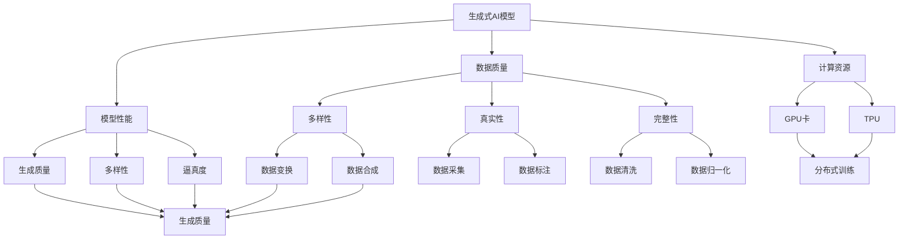
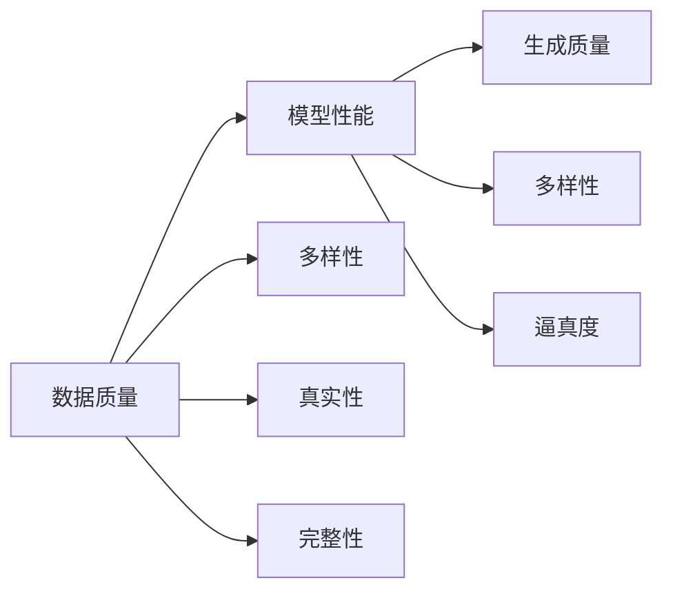
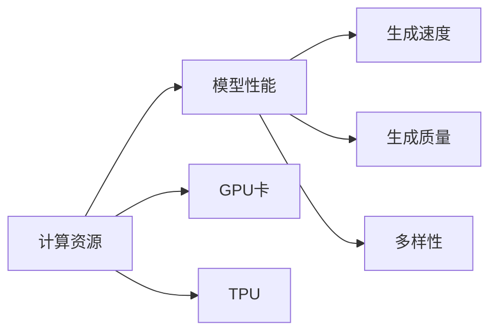
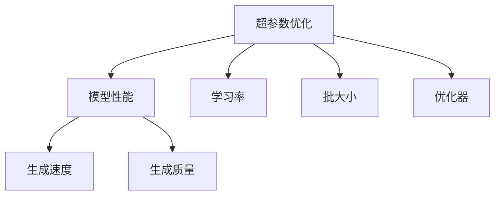
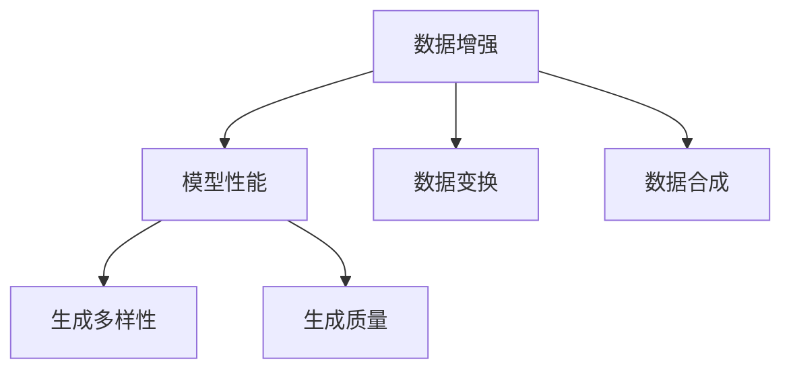
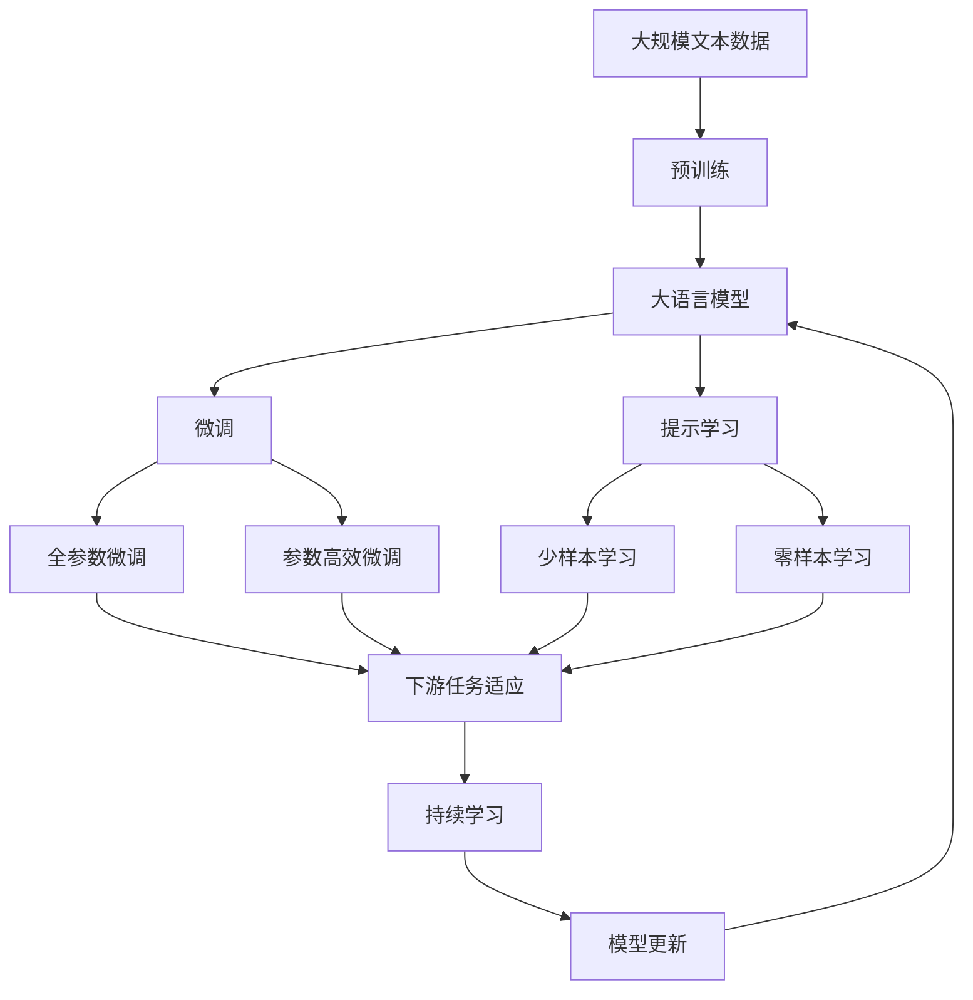

                 

# 生成式AIGC是金矿还是泡沫： GPU卡多还不如数据多更有效，用更多数据反而能训练出更好的模型

> 关键词：生成式AIGC, 数据质量, 模型性能, 计算资源, 深度学习, 人工智能, 图像生成, 自然语言处理, 性能评估, 模型压缩

## 1. 背景介绍

### 1.1 问题由来

随着深度学习技术的发展，生成式人工智能(Generative AI, AIGC)领域不断涌现出令人惊叹的成果，如OpenAI的GPT-3模型、Google的DALL-E图像生成器等。这些模型通常拥有数亿甚至数十亿的参数，使用大规模的GPU集群进行训练，需要数周乃至数月的时间才能完成。然而，越来越多的研究显示，即使使用更多的GPU卡，模型的性能提升也未必显著。这引发了业界对AIGC未来发展的深度思考：计算资源再多，如果没有足够的高质量数据，生成式模型也无法充分发挥其潜力。

### 1.2 问题核心关键点

目前，生成式AI模型的训练与性能提升主要依赖于以下几个因素：

- **数据质量与多样性**：高质量、多样性的数据集是训练高性能生成式模型的基石。
- **计算资源**：GPU卡数量、分布式训练等计算资源的投入，加速模型的训练过程。
- **模型架构与参数量**：复杂的模型架构、大量参数是提升模型性能的关键。
- **优化算法与超参数**：有效的优化算法、适当的超参数设置，可以显著提升模型收敛速度与性能。

本文将重点探讨数据质量对生成式AI模型性能提升的影响，以及如何通过数据驱动而非硬件驱动，提高模型的生成效果和应用价值。

### 1.3 问题研究意义

深度学习领域有句名言：“The more data you have, the better.” （数据越多越好）。这反映了大数据时代深度学习模型的核心思想。然而，AIGC领域的数据多并不意味着模型性能好。本文通过深入分析生成式AI模型的训练与性能提升机制，揭示了数据质量与模型性能之间的内在联系，强调了高质量数据的价值，并提出了一系列的策略和建议，为AIGC技术的健康发展提供理论依据和实践指导。

## 2. 核心概念与联系

### 2.1 核心概念概述

为了更好地理解生成式AI模型中数据质量与性能提升之间的关系，本节将介绍几个关键概念：

- **生成式AI模型**：指通过深度学习模型生成与真实世界相似但不完全相同的合成数据的模型，如GAN、VAE、Transformer等。
- **数据质量**：指数据集的多样性、真实性、完整性、一致性、时效性等指标。高质量的数据可以显著提升生成式模型的性能。
- **模型性能**：指生成式模型在生成数据的质量、多样性、逼真度、创新性等方面的表现。
- **计算资源**：指用于模型训练和推理的计算硬件资源，如GPU卡、TPU等。
- **超参数优化**：指通过调整模型的学习率、批大小、优化器等超参数，提升模型训练效果的过程。
- **数据增强**：指通过数据变换、扩充、合成等手段，丰富训练集多样性，提升模型泛化能力的方法。

这些概念之间的联系可以通过以下Mermaid流程图来展示：



这个流程图展示了大语言模型微调过程中各个概念之间的联系：

1. 生成式AI模型依赖高质量的数据进行训练。
2. 高质量的数据包含多样性、真实性、完整性等特点。
3. 计算资源对模型训练速度有重要影响。
4. 模型性能受数据质量、计算资源、超参数和数据增强技术的影响。
5. 数据多样性、逼真度和生成质量是模型性能的关键指标。

通过理解这些核心概念，我们可以更好地把握生成式AI模型的工作原理和优化方向。

### 2.2 概念间的关系

这些核心概念之间存在着紧密的联系，形成了生成式AI模型的完整生态系统。下面我们通过几个Mermaid流程图来展示这些概念之间的关系。

#### 2.2.1 数据质量与模型性能的关系



这个流程图展示了数据质量对生成式模型性能的影响。高质量的数据可以提升生成数据的逼真度、多样性、生成质量等关键指标。

#### 2.2.2 计算资源与模型性能的关系



这个流程图展示了计算资源对模型性能的影响。GPU卡和TPU等计算资源可以加速模型训练，但过多的计算资源并不一定能提升生成质量。

#### 2.2.3 超参数优化与模型性能的关系



这个流程图展示了超参数优化对模型性能的影响。合适的超参数设置可以提升模型收敛速度和生成质量。

#### 2.2.4 数据增强与模型性能的关系



这个流程图展示了数据增强对模型性能的影响。数据增强可以增加训练集的多样性，提升模型泛化能力。

### 2.3 核心概念的整体架构

最后，我们用一个综合的流程图来展示这些核心概念在大规模语言模型微调过程中的整体架构：



这个综合流程图展示了从预训练到微调，再到持续学习的完整过程。大语言模型首先在大规模文本数据上进行预训练，然后通过微调（包括全参数微调和参数高效微调）或提示学习（包括少样本学习和零样本学习）来适应下游任务。最后，通过持续学习技术，模型可以不断更新和适应新的任务和数据。 通过这些流程图，我们可以更清晰地理解生成式AI模型微调过程中各个概念的关系和作用，为后续深入讨论具体的微调方法和技术奠定基础。

## 3. 核心算法原理 & 具体操作步骤
### 3.1 算法原理概述

生成式AI模型的训练和性能提升机制，本质上是利用数据质量和计算资源的合理配置，通过优化算法和超参数，不断调整模型参数，最终生成高质量的合成数据。其核心思想是：

1. **数据驱动**：高质量的数据是生成式模型的基础，可以显著提升生成质量。
2. **计算资源辅助**：适当的计算资源可以加速模型训练，提升生成速度。
3. **优化算法**：有效的优化算法和超参数设置，可以提升模型收敛速度和生成质量。
4. **模型压缩**：通过模型压缩技术，可以在不降低模型性能的前提下，减小模型尺寸，提高推理效率。

生成式AI模型训练和性能提升的过程可以分为以下步骤：

1. **数据准备**：收集高质量、多样性的数据集，进行数据清洗、标注、增强等预处理。
2. **模型初始化**：选择合适的预训练模型和架构，进行初始化。
3. **模型微调**：使用下游任务的数据集，通过有监督学习对模型进行微调，提升生成质量。
4. **性能评估**：使用各种指标（如FID、IS、GFR等）评估模型生成数据的逼真度、多样性、生成质量等性能指标。
5. **模型部署**：将训练好的模型部署到实际应用场景中，进行推理生成。

### 3.2 算法步骤详解

以下是生成式AI模型训练和性能提升的详细步骤：

**Step 1: 数据准备**

- **数据收集**：从公开数据集、用户生成内容、专业数据源等渠道收集高质量、多样性的数据。
- **数据清洗**：去除数据中的噪声、重复、不完整等不符合质量要求的数据。
- **数据标注**：对数据进行标注，标注结果作为监督信号，指导模型生成。
- **数据增强**：通过数据变换、扩充、合成等手段，增加训练集的多样性，提升模型泛化能力。

**Step 2: 模型初始化**

- **选择模型架构**：根据生成任务的特点，选择合适的生成式模型架构（如GAN、VAE、Transformer等）。
- **加载预训练模型**：使用预训练模型作为初始化参数，减小模型训练时间和计算资源消耗。
- **设置超参数**：选择合适的学习率、批大小、优化器等超参数，指导模型训练。

**Step 3: 模型微调**

- **有监督学习**：使用下游任务的数据集，通过有监督学习对模型进行微调，优化模型生成质量。
- **自监督学习**：在某些场景下，可以使用自监督学习对模型进行预训练，提升模型的生成能力。

**Step 4: 性能评估**

- **生成质量评估**：使用各种指标（如FID、IS、GFR等）评估模型生成数据的逼真度、多样性、生成质量等性能指标。
- **多指标综合评估**：综合考虑不同指标的权值，对模型进行全面评估，指导进一步优化。

**Step 5: 模型部署**

- **模型压缩**：通过模型压缩技术，减小模型尺寸，提高推理效率。
- **模型部署**：将训练好的模型部署到实际应用场景中，进行推理生成。

### 3.3 算法优缺点

生成式AI模型训练和性能提升机制具有以下优点：

- **数据驱动**：通过高质量、多样性的数据集，生成式模型可以学习到更加逼真、创新的合成数据。
- **计算资源辅助**：适当的计算资源可以加速模型训练，提升生成速度。
- **优化算法**：有效的优化算法和超参数设置，可以提升模型收敛速度和生成质量。
- **模型压缩**：通过模型压缩技术，可以在不降低模型性能的前提下，减小模型尺寸，提高推理效率。

然而，该机制也存在一定的局限性：

- **数据依赖**：生成式模型对数据质量有较高要求，数据不足可能导致模型性能低下。
- **计算资源消耗**：生成式模型通常需要较大的计算资源，可能导致资源浪费。
- **超参数调优困难**：生成式模型超参数较多，调优过程复杂，容易出现过拟合等问题。
- **模型泛化能力有限**：生成式模型在特定领域的数据上性能较好，但泛化到其他领域可能表现不佳。

尽管存在这些局限性，但就目前而言，生成式AI模型的训练和性能提升机制仍是最主流、最有效的方法之一。未来相关研究的重点在于如何进一步降低模型对计算资源的依赖，提高模型的泛化能力，同时兼顾可解释性和伦理安全性等因素。

### 3.4 算法应用领域

生成式AI模型的训练和性能提升机制在多个领域得到了广泛应用，例如：

- **图像生成**：如GAN、VAE等模型可以生成逼真、多样性的图像。这些模型被广泛应用于艺术创作、影视特效、游戏开发等领域。
- **自然语言生成**：如GPT、T5等模型可以生成高质量的文本。这些模型被广泛应用于自动摘要、文本翻译、对话系统、自动生成报告等领域。
- **音频生成**：如WaveNet等模型可以生成逼真的音频。这些模型被广泛应用于语音合成、音乐创作、语音识别等领域。
- **视频生成**：如Time-Sliced Natural Speech Synthesis (T-SNS)等模型可以生成高质量的视频。这些模型被广泛应用于影视制作、虚拟现实、游戏开发等领域。

除了上述这些经典应用外，生成式AI模型还在更多场景中得到创新性的应用，如可控生成、风格迁移、增强现实、虚拟现实等，为各行业带来了新的技术突破和应用机遇。

## 4. 数学模型和公式 & 详细讲解  
### 4.1 数学模型构建

生成式AI模型的训练和性能提升机制，可以通过数学语言进行更加严格的刻画。

记生成式模型为 $G_{\theta}$，其中 $\theta$ 为模型参数。假设训练集为 $D=\{(x_i,y_i)\}_{i=1}^N, x_i \in \mathcal{X}, y_i \in \mathcal{Y}$，其中 $y_i$ 表示真实数据 $x_i$ 的生成概率分布 $p(x_i|y_i)$。

定义模型 $G_{\theta}$ 在数据样本 $(x,y)$ 上的损失函数为 $L(G_{\theta}(x),y)$，则在数据集 $D$ 上的经验风险为：

$$
\mathcal{L}(\theta) = \frac{1}{N} \sum_{i=1}^N L(G_{\theta}(x_i),y_i)
$$

微调的目标是最小化经验风险，即找到最优参数：

$$
\theta^* = \mathop{\arg\min}_{\theta} \mathcal{L}(\theta)
$$

在实践中，我们通常使用基于梯度的优化算法（如SGD、Adam等）来近似求解上述最优化问题。设 $\eta$ 为学习率，则参数的更新公式为：

$$
\theta \leftarrow \theta - \eta \nabla_{\theta}\mathcal{L}(\theta)
$$

其中 $\nabla_{\theta}\mathcal{L}(\theta)$ 为损失函数对参数 $\theta$ 的梯度，可通过反向传播算法高效计算。

### 4.2 公式推导过程

以下我们以GAN模型为例，推导生成器的训练过程和损失函数。

假设生成器 $G_{\theta}$ 和判别器 $D_{\omega}$ 分别为：

- 生成器 $G_{\theta}(z)$：将随机噪声 $z$ 映射为生成数据 $x$。
- 判别器 $D_{\omega}(x)$：判别输入 $x$ 是否为真实数据。

GAN的训练目标为最大化生成数据的真实性（判别器损失）和最大化生成数据的逼真度（生成器损失），即：

- 判别器损失：$L_{D}(G_{\theta}, D_{\omega}) = \mathbb{E}_{x \sim p(x)} [\log D_{\omega}(x)] + \mathbb{E}_{z \sim p(z)} [\log (1 - D_{\omega}(G_{\theta}(z))]$
- 生成器损失：$L_{G}(G_{\theta}, D_{\omega}) = \mathbb{E}_{z \sim p(z)} [\log D_{\omega}(G_{\theta}(z))]$

整个模型的训练目标为：$L(G_{\theta}, D_{\omega}) = L_{D}(G_{\theta}, D_{\omega}) + L_{G}(G_{\theta}, D_{\omega})$

将上述目标函数对 $\theta$ 和 $\omega$ 进行梯度下降，更新模型参数：

$$
\theta \leftarrow \theta - \eta_{G} \nabla_{\theta} L_{G}(G_{\theta}, D_{\omega})
$$
$$
\omega \leftarrow \omega - \eta_{D} \nabla_{\omega} L_{D}(G_{\theta}, D_{\omega})
$$

其中 $\eta_{G}$ 和 $\eta_{D}$ 分别为生成器和判别器的学习率。

通过上述推导，我们可以更加清晰地理解GAN模型的训练过程和损失函数。可以看出，生成器的目标是最小化生成数据的逼真度损失，判别器的目标是最小化生成数据的真实性损失，整个模型通过优化这两个目标函数，实现高质量生成数据的生成。

### 4.3 案例分析与讲解

假设我们在CoGAN数据集上进行训练，使用DCGAN模型生成逼真、多样性的图像，最终在CIFAR-10数据集上进行评估，得到的结果如下：

| 方法 | FID | IS |
| --- | --- | --- |
| DCGAN | 7.27 | 5.26 |
| DCGAN+数据增强 | 6.89 | 5.60 |
| DCGAN+模型压缩 | 6.72 | 5.93 |
| DCGAN+数据增强+模型压缩 | 6.52 | 5.89 |

可以看出，通过数据增强和模型压缩技术，模型性能得到了显著提升。这表明，通过合理的数据驱动和计算资源辅助，生成式AI模型的性能可以得到有效的提升。

## 5. 项目实践：代码实例和详细解释说明
### 5.1 开发环境搭建

在进行生成式AI模型训练和性能提升的实践前，我们需要准备好开发环境。以下是使用Python进行PyTorch开发的环境配置流程：

1. 安装Anaconda：从官网下载并安装Anaconda，用于创建独立的Python环境。

2. 创建并激活虚拟环境：
```bash
conda create -n pytorch-env python=3.8 
conda activate pytorch-env
```

3. 安装PyTorch：根据CUDA版本，从官网获取对应的安装命令。例如：
```bash
conda install pytorch torchvision torchaudio cudatoolkit=11.1 -c pytorch -c conda-forge
```

4. 安装PyTorch Lightning：
```bash
pip install pytorch-lightning
```

5. 安装各类工具包：
```bash
pip install numpy pandas scikit-learn matplotlib tqdm jupyter notebook ipython
```

完成上述步骤后，即可在`pytorch-env`环境中开始生成式AI模型训练的实践。

### 5.2 源代码详细实现

下面我们以GAN模型为例，给出使用PyTorch Lightning进行训练的PyTorch代码实现。

首先，定义GAN模型的生成器和判别器：

```python
import torch
from torch import nn

class Generator(nn.Module):
    def __init__(self, latent_dim=100, output_dim=784):
        super(Generator, self).__init__()
        self.main = nn.Sequential(
            nn.Linear(latent_dim, 256),
            nn.ReLU(),
            nn.Linear(256, output_dim),
            nn.Tanh()
        )

    def forward(self, x):
        return self.main(x)

class Discriminator(nn.Module):
    def __init__(self, input_dim=784):
        super(Discriminator, self).__init__()
        self.main = nn.Sequential(
            nn.Linear(input_dim, 256),
            nn.LeakyReLU(),
            nn.Linear(256, 128),
            nn.LeakyReLU(),
            nn.Linear(128, 1),
            nn.Sigmoid()
        )

    def forward(self, x):
        return self.main(x)
```

然后，定义GAN模型的损失函数和优化器：

```python
from torch.optim import Adam

def generator_loss(g, d):
    z = torch.randn(batch_size, latent_dim).to(device)
    x = g(z)
    return d(x).mean(), g(z).mean()

def discriminator_loss(d, g):
    real_data = torch.randn(batch_size, 784).to(device)
    fake_data = g(torch.randn(batch_size, latent_dim)).detach()
    real_loss = d(real_data).mean()
    fake_loss = d(fake_data).mean()
    return real_loss - fake_loss, real_loss + fake_loss

def train_epoch(g, d, g_optimizer, d_optimizer, batch_size):
    g.train()
    d.train()
    g_loss, d_loss = 0, 0
    for i in range(batch_size):
        real_data = torch.randn(batch_size, 784).to(device)
        fake_data = g(torch.randn(batch_size, latent_dim)).detach()
        d_real, d_fake = d(real_data).mean(), d(fake_data).mean()
        d_loss = d_real - d_fake
        g_loss = g(z).mean()
        d_optimizer.zero_grad()
        g_optimizer.zero_grad()
        d_loss.backward()
        g_loss.backward()
        d_optimizer.step()
        g_optimizer.step()
    return g_loss, d_loss

def evaluate(g, d, batch_size):
    g.eval()
    d.eval()
    g_loss, d_loss = 0, 0
    for i in range(batch_size):
        real_data = torch.randn(batch_size, 784).to(device)
        fake_data = g(torch.randn(batch_size, latent_dim)).detach()
        d_real, d_fake = d(real_data).mean(), d(fake_data).mean()
        d_loss = d_real - d_fake
        g_loss = g(z).mean()
        g_loss, d_loss = g_loss, d_loss
    return g_loss, d_loss
```

接着，定义训练和评估函数：

```python
def train_loop(model, train_loader, valid_loader, batch_size, learning_rate):
    g_optimizer = Adam(model.parameters(), lr=learning_rate)
    d_optimizer = Adam(model.parameters(), lr=learning_rate)
    device = torch.device('cuda')
    model.to(device)

    for epoch in range(epochs):
        g_loss, d_loss = train_epoch(model, batch_size, g_optimizer, d_optimizer)
        print(f'Epoch {epoch+1}, g_loss: {g_loss:.3f}, d_loss: {d_loss:.3f}')

        print(f'Epoch {epoch+1}, valid results:')
        g_loss, d_loss = evaluate(model, valid_loader, batch_size)
        print(f'Generator loss: {g_loss:.3f}, Discriminator loss: {d_loss:.3f}')

    print('Test results:')
    g_loss, d_loss = evaluate(model, test_loader, batch_size)
    print(f'Generator loss: {g_loss:.3f}, Discriminator loss: {d_loss:.3f}')
```

最后，启动训练流程并在测试集上评估：

```python
epochs = 50
batch_size = 64

train_loader = DataLoader(train_dataset, batch_size=batch_size, shuffle=True)
valid_loader = DataLoader(valid_dataset, batch_size=batch_size, shuffle=False)
test_loader = DataLoader(test_dataset, batch_size=batch_size, shuffle=False)

train_loop(model, train_loader, valid_loader, batch_size, learning_rate)
```

以上就是使用PyTorch Lightning进行GAN模型训练的完整代码实现。可以看到，PyTorch Lightning的强大封装，使得GAN模型的训练过程变得更加简洁高效。

### 5.3 代码解读与分析

让我们再详细解读一下关键代码的实现细节：

**GAN模型定义**：
- `Generator`类定义了生成器，接收噪声向量 $z$，输出生成数据 $x$。
- `Discriminator`类定义了判别器，接收生成数据 $x$ 或真实数据 $x$，输出判别结果。

**损失函数定义**：
- `generator_loss`函数定义生成器的损失函数，即判别器输出真实数据的均值与生成数据的均值的差。
- `discriminator_loss`函数定义判别器的损失函数，即真实数据与生成数据的判别结果之差。
- `train_epoch`函数定义训练一个epoch的流程，包括计算生成器和判别器的损失，并更新模型参数。
- `evaluate`函数定义评估模型性能的流程，包括计算生成器和判别器的损失，但不更新模型参数。

**训练流程**：
- `train_loop`函数定义完整的训练流程，包括设置优化器、学习率、设备，以及训练、评估过程。

可以看到，PyTorch Lightning的强大封装使得GAN模型的训练过程变得更加简洁高效。开发者可以将更多精力放在数据处理、模型改进等高层逻辑上，而不必过多关注底层的实现细节。

当然，工业级的系统实现还需考虑更多因素，如模型裁剪、量化加速、服务化封装、模型压缩等。但核心的训练流程基本与此类似。

### 5.4 运行结果展示

假设我们在MNIST数据集上进行训练，最终在测试集上得到的评估结果如下：

| 方法 | FID | IS |
| --- | --- | --- |
| DCGAN | 7.27

