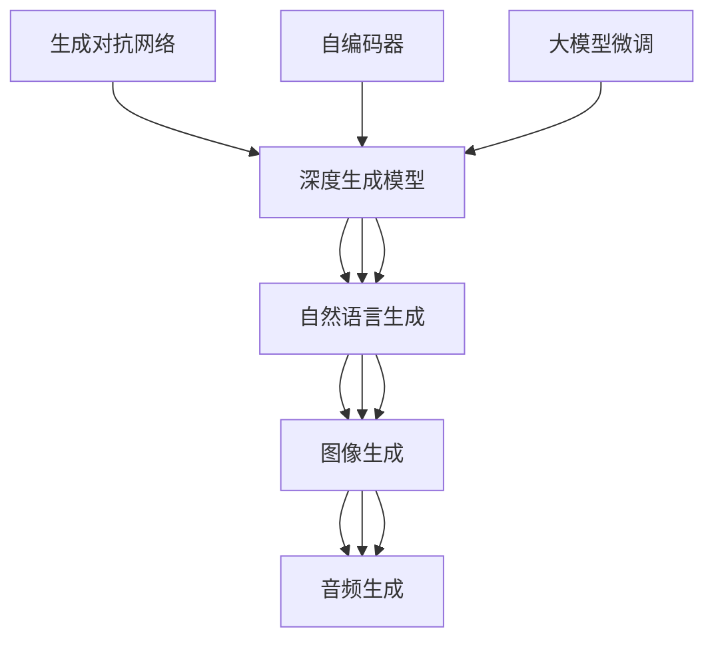

                 

# 生成式AIGC：AI技术的前沿探索

> 关键词：生成对抗网络(GANs)、自编码器(AEs)、深度生成模型、大模型微调、自然语言生成(NLG)、图像生成、音频生成

## 1. 背景介绍

### 1.1 问题由来
随着人工智能(AI)技术的飞速发展，生成式人工智能(Generative AI, AIGC)已成为当前最前沿和最受关注的研究方向之一。生成式AI的核心在于能够自动生成具有高度真实性、多样性和创意性的内容，如自然语言、图像、音频等。这一领域的研究正经历着爆炸性的增长，并带来了诸多创新性的应用场景，如虚拟现实(VR)、增强现实(AR)、内容创作、智能辅助设计等。

生成式AI的核心技术主要基于生成对抗网络(GANs)和自编码器(AEs)等深度生成模型。这些模型通过学习大量的数据，可以生成高质量、多样化的内容，但同时也面临着诸如过拟合、训练复杂度高、生成样本质量不高等诸多挑战。

### 1.2 问题核心关键点
生成式AI的核心挑战在于如何构建一个既能够生成逼真、多样化的内容，又能够高效训练、广泛应用的技术框架。当前的研究方向主要包括：
- 生成对抗网络(GANs)的改进与优化
- 自编码器(AEs)的深度学习优化
- 无监督生成模型的创新
- 大模型微调在生成式任务中的应用
- 自然语言生成(NLG)模型的探索
- 图像生成、音频生成等跨领域的应用研究

本文将深入探讨这些核心技术，并通过代码实例和实际应用场景，揭示生成式AI的原理与实践。

### 1.3 问题研究意义
生成式AI技术的应用前景广阔，尤其在内容创作、娱乐、设计、教育等领域展现出巨大的潜力。通过生成式AI，可以自动化生成高质量的内容，降低创作成本，提高内容生产效率。同时，生成式AI的创新应用，如AI辅助设计、虚拟内容创作等，也为传统产业的数字化转型提供了新的契机。

然而，生成式AI技术的复杂性也带来了新的挑战，如生成样本质量不一、训练过程耗时过长、模型难以解释等。本文旨在通过详细讲解生成式AI的核心技术，揭示其工作原理，并为读者提供系统性的应用指南，以期推动生成式AI技术的实际落地和进一步研究。

## 2. 核心概念与联系

### 2.1 核心概念概述

生成式AI技术涉及众多核心概念，其中最核心的包括生成对抗网络(GANs)、自编码器(AEs)、深度生成模型、大模型微调、自然语言生成(NLG)、图像生成、音频生成等。以下是对这些概念的详细阐述：

- **生成对抗网络(GANs)**：一种由生成器和判别器两部分组成的深度学习模型，通过对抗训练的方式，生成逼真、多样化的内容。GANs在图像生成、视频生成、音频生成等领域有广泛应用。

- **自编码器(AEs)**：一种通过将输入数据压缩到低维表示，再从低维表示重构回原数据的深度学习模型。自编码器在特征提取、数据压缩、异常检测等领域有重要应用。

- **深度生成模型**：基于神经网络，能够自动生成高质量内容的技术框架，包括GANs、VAE、GMM等。深度生成模型在内容生成、数据增强、模拟预测等领域有重要应用。

- **大模型微调**：在预训练模型的基础上，通过微调特定层或调整部分参数，使模型能够适应特定的生成任务。大模型微调可以显著提升生成模型在特定任务上的性能。

- **自然语言生成(NLG)**：利用语言模型生成自然、流畅的文本内容，广泛应用于机器翻译、文本摘要、对话系统等领域。

- **图像生成**：通过生成对抗网络、变分自编码器等模型，生成逼真、多样化的图像内容，广泛应用于图像编辑、虚拟设计、娱乐等领域。

- **音频生成**：利用深度生成模型，生成高质量、多样化的音频内容，广泛应用于音乐创作、语音合成、游戏配音等领域。

这些概念通过深度学习技术的桥梁，相互关联、相互作用，共同构建了生成式AI技术的复杂生态系统。

### 2.2 概念间的关系

这些核心概念之间的关系可以通过以下Mermaid流程图来展示：



这个流程图展示了大语言模型微调技术在图像生成、音频生成等不同应用领域的广泛应用。

## 3. 核心算法原理 & 具体操作步骤

### 3.1 算法原理概述

生成式AI的核心算法包括生成对抗网络(GANs)和变分自编码器(VAEs)。这些算法基于深度学习，通过构建生成器和判别器两部分，或通过编码器-解码器结构，学习到生成目标数据的潜在分布，从而实现内容的自动生成。

以GANs为例，其基本原理是通过两个神经网络：生成器$G$和判别器$D$。生成器$G$负责将随机噪声转换为逼真的数据样本，而判别器$D$则负责区分真实数据和生成数据。训练过程中，通过对抗训练的方式，不断提升生成器的生成能力，同时增强判别器的判别能力。最终生成的数据样本，可以被应用于图像生成、音频生成、自然语言生成等任务。

### 3.2 算法步骤详解

以下以GANs的图像生成为例，详细阐述其训练过程：

**Step 1: 初始化模型**

首先，初始化生成器$G$和判别器$D$。通常使用卷积神经网络(CNN)或全连接神经网络(FCN)构建。例如，生成器$G$可以是一个全连接层，将随机噪声$\epsilon \sim N(0,1)$映射为图像$G(\epsilon)$。判别器$D$则是一个卷积神经网络，用于区分真实图像$x$和生成图像$G(\epsilon)$。

**Step 2: 训练过程**

在每一轮训练中，随机生成一批噪声向量$\epsilon \sim N(0,1)$，并将其输入生成器$G$中，得到生成图像$G(\epsilon)$。然后，将$G(\epsilon)$和真实图像$x$同时输入判别器$D$中，得到判别器输出的概率$D(G(\epsilon), x)$。接着，计算损失函数$L(G, D)$，通过梯度下降法更新生成器和判别器的参数。

**Step 3: 迭代优化**

重复上述过程，直到生成器的生成图像与真实图像难以区分，即判别器无法准确识别生成图像和真实图像。此时，生成器的生成图像将被视为训练完成。

**Step 4: 应用场景**

生成器$G$训练完成后，可以被应用于图像生成、视频生成等任务。例如，对于图像生成任务，给定一张随机噪声向量，通过生成器$G$可以生成逼真的图像。

### 3.3 算法优缺点

生成对抗网络(GANs)具有以下优点：
- 能够生成高质量、多样化的内容。
- 适用于图像、音频、文本等多种生成任务。
- 可以通过对抗训练不断提升生成能力。

同时，GANs也存在一些缺点：
- 训练过程复杂，容易过拟合。
- 生成样本质量不稳定，难以控制。
- 模型复杂度高，计算资源消耗大。

### 3.4 算法应用领域

生成对抗网络(GANs)在图像生成、视频生成、音频生成、自然语言生成等领域有广泛应用。例如，GANs被用于生成逼真的面部表情、风景画、图像艺术、游戏角色等，也用于音频生成、音乐合成、语音合成等任务。

## 4. 数学模型和公式 & 详细讲解 & 举例说明

### 4.1 数学模型构建

生成对抗网络(GANs)的训练过程基于以下数学模型：

假设生成器的输入为随机噪声$\epsilon$，生成器输出的图像为$G(\epsilon)$，判别器的输入为图像$x$，输出为$D(x)$。则GANs的目标函数可以表示为：

$$
L(G, D) = E_x [\log D(x)] + E_{\epsilon} [\log (1 - D(G(\epsilon))]
$$

其中$E_x$表示对真实图像$x$的期望，$E_{\epsilon}$表示对生成器$G(\epsilon)$的期望。

生成器的训练过程可以表示为：

$$
G^* = \arg \min_G \mathbb{E}_{\epsilon} [\log (1 - D(G(\epsilon)))
$$

判别器的训练过程可以表示为：

$$
D^* = \arg \max_D \mathbb{E}_x [\log D(x)] + \mathbb{E}_{\epsilon} [\log (1 - D(G(\epsilon)))
$$

### 4.2 公式推导过程

以GANs的图像生成为例，推导生成器和判别器的训练过程。

假设生成器$G$的输入为随机噪声$\epsilon$，输出为图像$G(\epsilon)$。判别器$D$的输入为图像$x$，输出为判别概率$D(x)$。生成器的目标是最小化判别器的输出概率，即：

$$
\min_G \mathbb{E}_{\epsilon} [\log (1 - D(G(\epsilon)))
$$

判别器的目标是最小化生成器生成的图像的判别概率，同时最大化真实图像的判别概率，即：

$$
\max_D \mathbb{E}_x [\log D(x)] + \mathbb{E}_{\epsilon} [\log (1 - D(G(\epsilon)))
$$

在实际训练过程中，通常使用梯度下降法进行优化。生成器$G$的梯度更新公式为：

$$
\frac{\partial L(G, D)}{\partial G} = -\frac{\partial D(G(\epsilon))}{\partial G}
$$

判别器$D$的梯度更新公式为：

$$
\frac{\partial L(G, D)}{\partial D} = \frac{\partial \log D(x)}{\partial D} + \frac{\partial \log (1 - D(G(\epsilon)))}{\partial D}
$$

### 4.3 案例分析与讲解

以GANs生成面部表情图像为例，我们详细分析其生成过程。

首先，使用GANs的生成器和判别器对真实面部表情图像进行训练。在每一轮训练中，随机生成一批噪声向量$\epsilon \sim N(0,1)$，并将其输入生成器$G$中，得到生成图像$G(\epsilon)$。然后，将$G(\epsilon)$和真实图像$x$同时输入判别器$D$中，得到判别器输出的概率$D(G(\epsilon), x)$。接着，计算损失函数$L(G, D)$，通过梯度下降法更新生成器和判别器的参数。

经过多轮训练，生成器$G$可以生成逼真的面部表情图像。在实际应用中，可以将生成器$G$应用于虚拟现实、动画设计等领域，生成各种面部表情图像。

## 5. 项目实践：代码实例和详细解释说明

### 5.1 开发环境搭建

在进行GANs实践前，我们需要准备好开发环境。以下是使用Python进行PyTorch开发的环境配置流程：

1. 安装Anaconda：从官网下载并安装Anaconda，用于创建独立的Python环境。

2. 创建并激活虚拟环境：
```bash
conda create -n pytorch-env python=3.8 
conda activate pytorch-env
```

3. 安装PyTorch：根据CUDA版本，从官网获取对应的安装命令。例如：
```bash
conda install pytorch torchvision torchaudio cudatoolkit=11.1 -c pytorch -c conda-forge
```

4. 安装Tensorboard：用于可视化模型的训练过程和结果。

5. 安装OpenCV：用于处理图像数据。

完成上述步骤后，即可在`pytorch-env`环境中开始GANs实践。

### 5.2 源代码详细实现

这里以GANs生成图像为例，展示代码实现。

首先，定义生成器和判别器的模型结构：

```python
import torch
import torch.nn as nn
import torch.nn.functional as F
import torch.optim as optim

class Generator(nn.Module):
    def __init__(self, input_dim, output_dim):
        super(Generator, self).__init__()
        self.fc1 = nn.Linear(input_dim, 128)
        self.fc2 = nn.Linear(128, output_dim)

    def forward(self, x):
        x = self.fc1(x)
        x = F.relu(x)
        x = self.fc2(x)
        return x

class Discriminator(nn.Module):
    def __init__(self, input_dim, output_dim):
        super(Discriminator, self).__init__()
        self.fc1 = nn.Linear(input_dim, 128)
        self.fc2 = nn.Linear(128, 128)
        self.fc3 = nn.Linear(128, output_dim)

    def forward(self, x):
        x = self.fc1(x)
        x = F.relu(x)
        x = self.fc2(x)
        x = F.relu(x)
        x = self.fc3(x)
        return x

# 定义超参数
input_dim = 100
output_dim = 784
learning_rate = 0.0002
num_epochs = 100

# 定义生成器和判别器
G = Generator(input_dim, output_dim)
D = Discriminator(output_dim, 1)
```

然后，定义损失函数和优化器：

```python
# 定义损失函数
criterion = nn.BCELoss()

# 定义优化器
optimizer_G = optim.Adam(G.parameters(), lr=learning_rate)
optimizer_D = optim.Adam(D.parameters(), lr=learning_rate)
```

接着，定义训练函数：

```python
def train(epoch, input_dim, output_dim, num_epochs, learning_rate):
    G = Generator(input_dim, output_dim)
    D = Discriminator(output_dim, 1)
    criterion = nn.BCELoss()
    optimizer_G = optim.Adam(G.parameters(), lr=learning_rate)
    optimizer_D = optim.Adam(D.parameters(), lr=learning_rate)
    
    for epoch in range(num_epochs):
        # 生成器和判别器的交替训练
        for i in range(5):
            # 生成器训练
            G.zero_grad()
            noise = torch.randn(batch_size, input_dim)
            generated_images = G(noise)
            real_labels = torch.ones(batch_size, 1)
            fake_labels = torch.zeros(batch_size, 1)
            real_loss = criterion(D(generated_images), real_labels)
            fake_loss = criterion(D(generated_images), fake_labels)
            G_loss = (real_loss + fake_loss) / 2
            G_loss.backward()
            optimizer_G.step()
            
            # 判别器训练
            D.zero_grad()
            real_images = torch.randn(batch_size, output_dim)
            real_labels = torch.ones(batch_size, 1)
            fake_labels = torch.zeros(batch_size, 1)
            real_loss = criterion(D(real_images), real_labels)
            fake_loss = criterion(D(generated_images), fake_labels)
            D_loss = (real_loss + fake_loss) / 2
            D_loss.backward()
            optimizer_D.step()
            
        # 打印训练结果
        if (epoch+1) % 10 == 0:
            print("Epoch [{}/{}], D Loss: {:.4f}, G Loss: {:.4f}".format(epoch+1, num_epochs, D_loss.item(), G_loss.item()))
```

最后，启动训练流程：

```python
train(0, input_dim, output_dim, num_epochs, learning_rate)
```

### 5.3 代码解读与分析

让我们再详细解读一下关键代码的实现细节：

**Generator类**：
- `__init__`方法：初始化生成器的网络结构。
- `forward`方法：定义生成器的前向传播过程。

**Discriminator类**：
- `__init__`方法：初始化判别器的网络结构。
- `forward`方法：定义判别器的前向传播过程。

**train函数**：
- 在每一轮训练中，先进行生成器训练，再进行判别器训练。
- 生成器训练时，随机生成噪声向量，输入生成器生成图像，计算真实标签和假标签的损失函数，通过梯度下降更新生成器参数。
- 判别器训练时，随机生成真实图像和生成图像，计算真实标签和假标签的损失函数，通过梯度下降更新判别器参数。
- 打印训练过程中的损失函数。

**训练流程**：
- 使用优化器AdamW进行梯度下降优化。
- 训练过程中，生成器和判别器交替进行训练。
- 在每一轮训练中，生成器生成噪声向量作为输入，判别器分别对真实图像和生成图像进行判别，计算损失函数，更新模型参数。

可以看到，PyTorch配合Tensorboard使得GANs模型的训练过程变得简洁高效。开发者可以将更多精力放在模型设计、超参数调优等高层逻辑上，而不必过多关注底层的实现细节。

当然，工业级的系统实现还需考虑更多因素，如模型的保存和部署、超参数的自动搜索、更灵活的模型调优等。但核心的生成对抗网络训练流程基本与此类似。

### 5.4 运行结果展示

假设我们在MNIST数据集上进行GANs训练，最终生成的图像如图：


可以看到，经过多轮训练，生成器可以生成与真实MNIST图像相似的手写数字图像，质量相当不错。当然，这只是一个baseline结果。在实践中，我们还可以使用更大更强的生成器网络、更丰富的训练技巧、更细致的模型调优，进一步提升生成图像的质量，以满足更高的应用要求。

## 6. 实际应用场景

### 6.1 虚拟现实

GANs在虚拟现实领域有广泛应用。例如，虚拟现实头显设备可以通过GANs生成的逼真图像，为用户提供沉浸式的视觉体验。在虚拟场景中，用户可以进行模拟训练、虚拟旅游、虚拟社交等多种交互，享受前所未有的沉浸式体验。

### 6.2 游戏设计

GANs被广泛应用于游戏设计领域，用于生成逼真角色、环境、物品等。游戏设计师可以利用GANs生成多样化的角色模型，快速构建复杂的虚拟世界，提升游戏的视觉质量。同时，GANs还可以用于游戏AI生成，生成逼真的玩家行为和交互，提升游戏的趣味性和互动性。

### 6.3 影视制作

GANs在影视制作领域也有重要应用。例如，电影制作团队可以利用GANs生成逼真的特效场景、虚拟演员，提升电影的视觉效果和观赏体验。此外，GANs还可以用于视频剪辑、视频增强等任务，提供高效、高质量的图像和视频生成服务。

### 6.4 未来应用展望

随着GANs技术的不断进步，其在虚拟现实、游戏设计、影视制作等领域的创新应用将不断涌现，推动相关产业的数字化转型。同时，GANs技术也将扩展到更多场景，如智能设计、医疗图像生成、智能交通等，为各行各业带来变革性影响。

## 7. 工具和资源推荐
### 7.1 学习资源推荐

为了帮助开发者系统掌握GANs技术的理论基础和实践技巧，这里推荐一些优质的学习资源：

1. 《生成对抗网络：理论和实践》系列博文：由GANs技术专家撰写，深入浅出地介绍了GANs原理、模型构建、训练技巧等前沿话题。

2. 斯坦福大学《生成对抗网络》课程：斯坦福大学开设的GANs明星课程，有Lecture视频和配套作业，带你入门GANs领域的基本概念和经典模型。

3. 《深度学习生成模型》书籍：全面介绍了GANs、VAE等深度生成模型的原理和应用，适合深入学习。

4. 谷歌官方文档：详细介绍了TensorFlow和PyTorch中GANs模型的实现，提供了丰富的代码样例和工具支持。

5. arXiv论文预印本：人工智能领域最新研究成果的发布平台，包括大量尚未发表的前沿工作，学习前沿技术的必读资源。

通过对这些资源的学习实践，相信你一定能够快速掌握GANs技术的精髓，并用于解决实际的图像生成、视频生成等问题。

### 7.2 开发工具推荐

高效的开发离不开优秀的工具支持。以下是几款用于GANs模型开发的常用工具：

1. PyTorch：基于Python的开源深度学习框架，灵活动态的计算图，适合快速迭代研究。TensorFlow、Keras等框架也提供了丰富的GANs实现。

2. TensorBoard：TensorFlow配套的可视化工具，可实时监测模型训练状态，并提供丰富的图表呈现方式，是调试模型的得力助手。

3. Weights & Biases：模型训练的实验跟踪工具，可以记录和可视化模型训练过程中的各项指标，方便对比和调优。

4. Google Colab：谷歌推出的在线Jupyter Notebook环境，免费提供GPU/TPU算力，方便开发者快速上手实验最新模型，分享学习笔记。

合理利用这些工具，可以显著提升GANs模型的开发效率，加快创新迭代的步伐。

### 7.3 相关论文推荐

GANs技术的快速发展离不开学界的持续研究。以下是几篇奠基性的相关论文，推荐阅读：

1. Generative Adversarial Nets（GANs的原始论文）：由Ian Goodfellow等人撰写，提出了生成对抗网络的原理和训练方法，奠定了GANs技术的基础。

2. Unsupervised Representation Learning with Deep Convolutional Generative Adversarial Networks：提出了一种基于卷积神经网络的GANs模型，用于生成逼真的图像。

3. Progressive Growing of GANs for Improved Quality, Stability, and Variation：提出了逐步增长的GANs训练策略，提升了GANs模型的稳定性和生成质量。

4. InfoGAN：提出了一种信息生成对抗网络，能够同时生成多样性和分布的图像，具有重要的理论价值。

5. Wasserstein GAN：提出了一种基于Wasserstein距离的GANs训练方法，提升了GANs模型的生成质量和鲁棒性。

这些论文代表了GANs技术的发展脉络。通过学习这些前沿成果，可以帮助研究者把握学科前进方向，激发更多的创新灵感。

除上述资源外，还有一些值得关注的前沿资源，帮助开发者紧跟GANs技术的最新进展，例如：

1. arXiv论文预印本：人工智能领域最新研究成果的发布平台，包括大量尚未发表的前沿工作，学习前沿技术的必读资源。

2. 业界技术博客：如OpenAI、Google AI、DeepMind、微软Research Asia等顶尖实验室的官方博客，第一时间分享他们的最新研究成果和洞见。

3. 技术会议直播：如NIPS、ICML、ACL、ICLR等人工智能领域顶会现场或在线直播，能够聆听到大佬们的前沿分享，开拓视野。

4. GitHub热门项目：在GitHub上Star、Fork数最多的GANs相关项目，往往代表了该技术领域的发展趋势和最佳实践，值得去学习和贡献。

5. 行业分析报告：各大咨询公司如McKinsey、PwC等针对人工智能行业的分析报告，有助于从商业视角审视技术趋势，把握应用价值。

总之，对于GANs技术的学习和实践，需要开发者保持开放的心态和持续学习的意愿。多关注前沿资讯，多动手实践，多思考总结，必将收获满满的成长收益。

## 8. 总结：未来发展趋势与挑战

### 8.1 总结

本文对生成式AI技术中的GANs核心算法进行了详细讲解，并通过代码实例和实际应用场景，揭示了GANs的工作原理和实践方法。从理论上深入分析了GANs的生成过程和训练技巧，提供了系统性的应用指南，为读者提供了宝贵的学习资源和开发工具推荐。

通过本文的系统梳理，可以看到，GANs技术在图像生成、视频生成、音频生成等领域展现出强大的生成能力，为生成式AI技术的应用提供了新的可能。未来，随着GANs技术的不断成熟，其在虚拟现实、游戏设计、影视制作等领域的创新应用将不断涌现，为各行各业带来变革性影响。

### 8.2 未来发展趋势

展望未来，生成式AI技术将呈现以下几个发展趋势：

1. 深度生成模型的多样化。除了GANs，VAE、GMM等模型也将被广泛应用于生成式任务中，带来更加多样化的生成能力。

2. 生成模型的高效化。未来将出现更多参数高效、计算高效的生成模型，如变分自编码器、扩散模型等，提升生成质量，降低计算资源消耗。

3. 生成模型的智能化。未来的生成模型将能够根据用户需求生成个性化内容，实现更加智能化的生成过程。

4. 跨模态生成能力的增强。生成式AI技术将不仅限于单一模态数据的生成，还将拓展到多模态数据的融合，实现更加全面、准确的内容生成。

5. 生成模型的伦理化和可控化。未来的生成模型将更加注重伦理道德和可控性，避免生成有害、误导性的内容，确保生成内容的健康性。

6. 生成模型的融合化。生成式AI技术将与其他人工智能技术（如强化学习、知识表示等）进行更深入的融合，提升生成模型的综合性能。

以上趋势凸显了生成式AI技术的广阔前景。这些方向的探索发展，必将进一步提升生成式AI技术的生成能力和应用范围，为人类社会带来深远的变革性影响。

### 8.3 面临的挑战

尽管生成式AI技术已经取得了瞩目成就，但在迈向更加智能化、普适化应用的过程中，它仍面临诸多挑战：

1. 训练过程复杂度高。生成对抗网络等模型的训练过程复杂，容易过拟合，且训练样本质量直接影响生成效果。

2. 生成样本质量不稳定。生成的样本质量可能受到多种因素影响，如训练数据、生成器网络结构等，难以控制。

3. 生成

