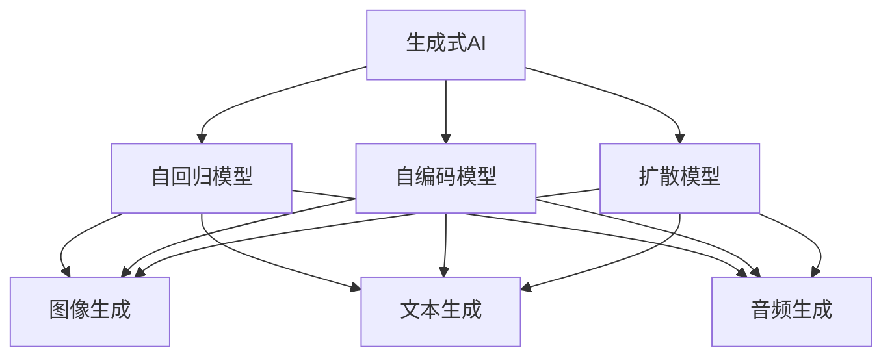
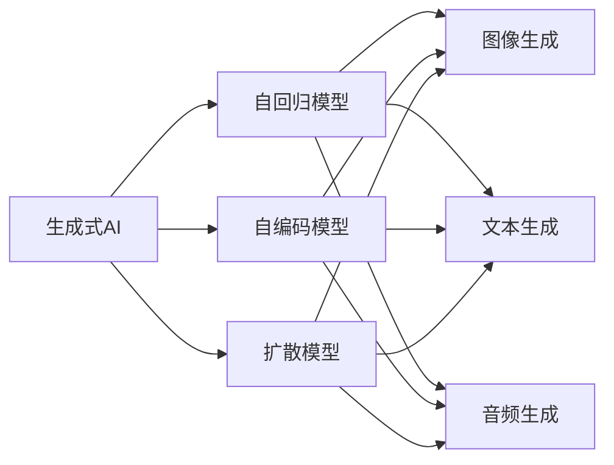
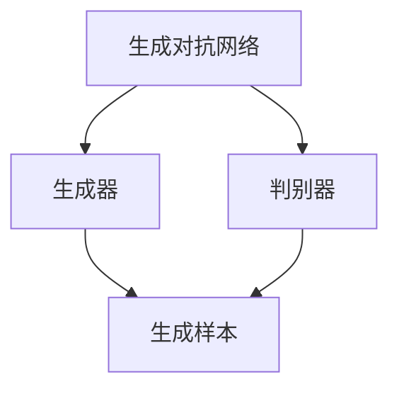
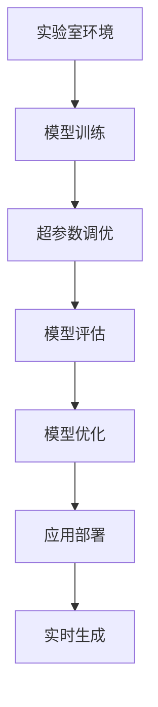
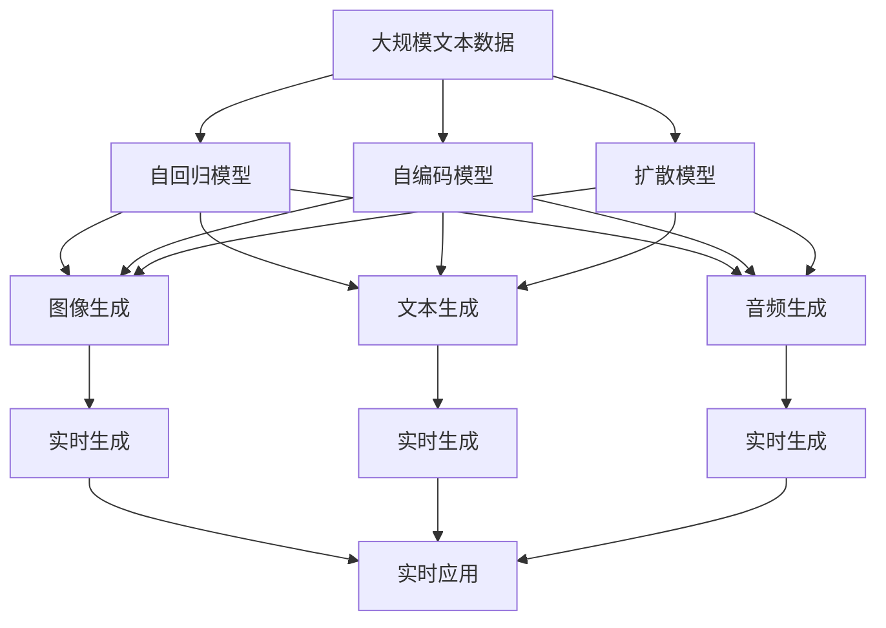

                 

# 生成式AIGC：从实验室到市场的转变

> 关键词：生成式AIGC, 从实验室到市场, 神经网络, 自回归模型, 自编码模型, 扩散模型, 图像生成, 文本生成, 音频生成

## 1. 背景介绍

### 1.1 问题由来

生成式人工智能(Generative AI, GAI)，或称生成式人工智能（Generative Adversarial Networks, GANs），近年来因其在图像、文本和音频生成方面的突破性进展而备受关注。从最初以GAN模型为代表，逐步发展到利用神经网络进行复杂模式生成，生成式AI成为了AI领域的前沿方向。

然而，尽管生成式AI在技术上取得了显著进步，但在应用落地方面仍然面临诸多挑战。例如，算力要求高，训练时间长，应用场景适配难度大等。因此，如何在大规模生产环境中高效、稳定地部署生成式AI模型，使其真正走进市场，成为学术界和产业界共同关注的问题。

### 1.2 问题核心关键点

生成式AI的核心技术是生成模型，主要包括自回归模型、自编码模型和扩散模型。这些模型通过学习数据的概率分布，生成新的样本，具备强大的数据生成能力。但实际应用中，如何保证生成内容的真实性、多样性、合法性和可解释性，成为了亟需解决的关键问题。

为了应对这些挑战，生成式AI技术的发展趋势是：

- **规模化**：利用GPU、TPU等高性能硬件加速模型训练，降低生成成本。
- **实用化**：将生成模型适配到实际应用场景，实现精准输出。
- **多元化**：除了图像生成，还拓展到文本、音频等多个领域，实现多模态生成。
- **合规化**：确保生成内容符合伦理道德要求，避免滥用。
- **可解释化**：提高生成过程的透明性和可解释性，提升用户信任度。

### 1.3 问题研究意义

生成式AI的研究与应用具有重要的理论和实际意义：

- **技术革新**：生成式AI为NLP、计算机视觉、音频处理等领域的深度学习技术带来了革命性变化，推动了AI技术的整体进步。
- **应用落地**：生成式AI在娱乐、艺术、医疗、广告等诸多行业产生了深远影响，提升了人类生活质量和社会生产力。
- **社会价值**：通过生成式AI，可以实现个性化定制、虚拟内容创作、知识传播等新应用，具有广泛的社会价值。

## 2. 核心概念与联系

### 2.1 核心概念概述

为更好地理解生成式AI从实验室到市场的转变过程，本节将介绍几个核心概念：

- **生成式AI**：使用神经网络模型，学习数据的概率分布，生成新样本的技术。包括自回归模型、自编码模型、扩散模型等。
- **自回归模型**：以生成式模型为代表的序列生成模型，如RNN、LSTM、Transformer等，依赖历史信息预测未来。
- **自编码模型**：基于无监督学习的生成模型，如VAE、DAE等，通过对输入数据的压缩和重构，生成新数据。
- **扩散模型**：利用时间上的条件采样，生成连续数据的模型，如DDPM、SDE等。
- **生成对抗网络**：由生成器和判别器组成的对抗训练过程，通过零和博弈提升生成模型的真实性。
- **生成任务**：包括图像生成、文本生成、音频生成、视频生成等，是生成式AI的应用目标。

这些核心概念之间的逻辑关系可以通过以下Mermaid流程图来展示：



这个流程图展示了大语言模型的核心概念及其之间的关系：

1. 生成式AI涵盖自回归、自编码、扩散等多种模型。
2. 自回归模型能够生成序列数据，如文本、音频等。
3. 自编码模型能够生成离散数据，如图像。
4. 扩散模型能够生成连续数据，如视频。
5. 不同生成模型分别应用在图像、文本、音频等生成任务上。

### 2.2 概念间的关系

这些核心概念之间存在着紧密的联系，形成了生成式AI从实验室到市场的完整生态系统。下面我们通过几个Mermaid流程图来展示这些概念之间的关系。

#### 2.2.1 生成式AI的模型体系



这个流程图展示了大语言模型的三种主要模型体系：

1. 生成式AI包括自回归、自编码、扩散等多种模型。
2. 自回归模型能够生成序列数据，如文本、音频等。
3. 自编码模型能够生成离散数据，如图像。
4. 扩散模型能够生成连续数据，如视频。
5. 不同生成模型分别应用在图像、文本、音频等生成任务上。

#### 2.2.2 生成对抗网络与生成模型



这个流程图展示了生成对抗网络的基本架构：

1. 生成对抗网络由生成器和判别器组成。
2. 生成器负责生成样本，判别器负责判断样本的真实性。
3. 通过对抗训练过程，提升生成器的生成能力。

#### 2.2.3 生成式AI的实用化流程



这个流程图展示了生成式AI从实验室到市场的实用化流程：

1. 在实验室环境中进行模型训练。
2. 进行超参数调优，提升模型性能。
3. 在测试集上进行评估和优化。
4. 部署到生产环境，进行实时生成。

### 2.3 核心概念的整体架构

最后，我们用一个综合的流程图来展示这些核心概念在大语言模型实用化过程中的整体架构：



这个综合流程图展示了从预训练到实用化的完整过程：

1. 数据预处理，构建生成模型。
2. 模型训练，优化超参数。
3. 模型评估，进行性能提升。
4. 模型部署，进行实时生成。
5. 应用集成，提供实时服务。

通过这些流程图，我们可以更清晰地理解生成式AI从实验室到市场的整个过程及其各个环节的关系和作用。

## 3. 核心算法原理 & 具体操作步骤
### 3.1 算法原理概述

生成式AI的核心在于生成模型，其基本原理是通过神经网络学习数据的概率分布，生成新的样本。生成模型分为自回归模型、自编码模型和扩散模型三种。

- **自回归模型**：利用序列数据的前后依赖关系，预测下一个样本的概率分布。例如，RNN、LSTM、Transformer等。
- **自编码模型**：通过将输入数据压缩为隐层表示，再重构为原始输入，学习数据的隐含表示。例如，VAE、DAE等。
- **扩散模型**：利用时间上的条件采样，生成连续数据。例如，DDPM、SDE等。

生成模型的训练过程主要包括两个步骤：
1. **损失函数定义**：定义模型生成的样本与真实样本之间的差异，常用的损失函数包括交叉熵损失、均方误差损失等。
2. **优化算法**：通过反向传播算法，不断更新模型参数，最小化损失函数，直至生成模型的输出逼近真实样本。

### 3.2 算法步骤详解

生成式AI的训练过程一般包括以下几个关键步骤：

**Step 1: 数据准备**
- 收集生成任务的标注数据集，如文本、图像、音频等。
- 对数据进行预处理，如归一化、截断等。
- 将数据集划分为训练集、验证集和测试集。

**Step 2: 模型构建**
- 选择合适的生成模型，如RNN、LSTM、VAE、DDPM等。
- 设计模型的超参数，如隐藏层数、神经元个数、学习率等。

**Step 3: 模型训练**
- 使用优化算法（如Adam、SGD等）进行模型训练。
- 在训练过程中，通过验证集进行模型评估，及时调整模型参数。
- 使用生成任务特定的损失函数进行训练，如交叉熵损失、重构损失、均方误差损失等。

**Step 4: 模型评估与优化**
- 在测试集上评估模型性能，计算均方误差、交叉熵等指标。
- 根据评估结果，优化模型参数或调整超参数，提升生成效果。

**Step 5: 模型部署与应用**
- 将训练好的模型部署到生产环境中。
- 实时获取输入数据，调用生成模型生成输出。
- 进行实时监控和性能优化，确保系统稳定性。

### 3.3 算法优缺点

生成式AI的优点在于其强大的数据生成能力，能够在图像、文本、音频等多个领域生成高质量的内容。但由于模型参数量大、训练时间长、计算资源要求高等问题，其实用化仍面临诸多挑战：

- **计算成本高**：生成模型通常需要大规模的训练数据和大量的计算资源，难以在一般生产环境中快速部署。
- **模型复杂**：生成模型结构复杂，需要精细调参，难以适应快速变化的实际需求。
- **质量控制**：生成内容质量不稳定，需要严格的生成样本筛选机制。

### 3.4 算法应用领域

生成式AI在多个领域都有广泛应用，例如：

- **图像生成**：生成艺术作品、广告素材、虚拟角色等。
- **文本生成**：生成文章、对话、摘要等。
- **音频生成**：生成音乐、语音、合成语音等。
- **视频生成**：生成视频剪辑、动画、虚拟现实内容等。

除了这些传统应用，生成式AI还在医疗、法律、金融等专业领域发挥作用，如辅助医学图像分析、自动化法律文书生成、风险评估预测等。

## 4. 数学模型和公式 & 详细讲解 & 举例说明
### 4.1 数学模型构建

本节将使用数学语言对生成式AI的训练过程进行更加严格的刻画。

记生成模型为 $M_{\theta}$，其中 $\theta$ 为模型参数。假设训练数据集为 $D=\{(x_i,y_i)\}_{i=1}^N$，其中 $x_i$ 为输入，$y_i$ 为生成目标。生成模型的损失函数为：

$$
\mathcal{L}(\theta) = -\frac{1}{N}\sum_{i=1}^N \log p_{\theta}(y_i|x_i)
$$

其中 $p_{\theta}(y_i|x_i)$ 表示模型在输入 $x_i$ 条件下生成 $y_i$ 的概率分布。

在训练过程中，使用优化算法最小化损失函数：

$$
\theta \leftarrow \theta - \eta \nabla_{\theta}\mathcal{L}(\theta)
$$

其中 $\eta$ 为学习率，$\nabla_{\theta}\mathcal{L}(\theta)$ 为损失函数对模型参数的梯度。

### 4.2 公式推导过程

以下我们以生成式图像模型为例，推导交叉熵损失函数及其梯度的计算公式。

假设模型 $M_{\theta}$ 在输入 $x$ 上的输出为 $z_{\theta}(x)$，表示生成图像的概率分布。真实标签 $y$ 为图像的像素值，表示为向量形式。则交叉熵损失函数定义为：

$$
\ell(y,z_{\theta}(x)) = -\frac{1}{N}\sum_{i=1}^N \sum_{j=1}^C y_{i,j}\log z_{\theta}(x)_{i,j}
$$

其中 $C$ 为图像的通道数。将上式代入经验风险公式，得：

$$
\mathcal{L}(\theta) = -\frac{1}{N}\sum_{i=1}^N \sum_{j=1}^C y_{i,j}\log z_{\theta}(x)_{i,j}
$$

根据链式法则，损失函数对模型参数 $\theta_k$ 的梯度为：

$$
\frac{\partial \mathcal{L}(\theta)}{\partial \theta_k} = -\frac{1}{N}\sum_{i=1}^N \sum_{j=1}^C y_{i,j} \frac{\partial z_{\theta}(x)_{i,j}}{\partial \theta_k}
$$

其中 $\frac{\partial z_{\theta}(x)_{i,j}}{\partial \theta_k}$ 可进一步递归展开，利用自动微分技术完成计算。

在得到损失函数的梯度后，即可带入参数更新公式，完成模型的迭代优化。重复上述过程直至收敛，最终得到适应生成任务的模型参数 $\theta^*$。

### 4.3 案例分析与讲解

以GAN模型为例，展示生成式AI的训练过程：

**Step 1: 数据准备**
- 收集图像数据集，如CIFAR-10、MNIST等。
- 对数据进行预处理，如归一化、截断等。
- 将数据集划分为训练集、验证集和测试集。

**Step 2: 模型构建**
- 使用GAN模型，包含生成器和判别器两部分。
- 设计模型的超参数，如生成器层数、神经元个数、判别器层数、学习率等。

**Step 3: 模型训练**
- 使用优化算法（如Adam、SGD等）进行模型训练。
- 在训练过程中，通过验证集进行模型评估，及时调整模型参数。
- 使用GAN模型特定的损失函数进行训练，如对抗损失、重构损失等。

**Step 4: 模型评估与优化**
- 在测试集上评估模型性能，计算交叉熵、均方误差等指标。
- 根据评估结果，优化模型参数或调整超参数，提升生成效果。

**Step 5: 模型部署与应用**
- 将训练好的模型部署到生产环境中。
- 实时获取输入数据，调用生成模型生成输出。
- 进行实时监控和性能优化，确保系统稳定性。

## 5. 项目实践：代码实例和详细解释说明
### 5.1 开发环境搭建

在进行生成式AI项目实践前，我们需要准备好开发环境。以下是使用Python进行PyTorch开发的环境配置流程：

1. 安装Anaconda：从官网下载并安装Anaconda，用于创建独立的Python环境。

2. 创建并激活虚拟环境：
```bash
conda create -n pytorch-env python=3.8 
conda activate pytorch-env
```

3. 安装PyTorch：根据CUDA版本，从官网获取对应的安装命令。例如：
```bash
conda install pytorch torchvision torchaudio cudatoolkit=11.1 -c pytorch -c conda-forge
```

4. 安装TensorFlow：
```bash
pip install tensorflow
```

5. 安装各类工具包：
```bash
pip install numpy pandas scikit-learn matplotlib tqdm jupyter notebook ipython
```

完成上述步骤后，即可在`pytorch-env`环境中开始生成式AI项目实践。

### 5.2 源代码详细实现

下面我们以GAN模型为例，给出使用PyTorch进行图像生成的PyTorch代码实现。

首先，定义GAN模型的基本结构：

```python
import torch
import torch.nn as nn
import torch.nn.functional as F
from torchvision import datasets, transforms

class Generator(nn.Module):
    def __init__(self):
        super(Generator, self).__init__()
        self.fc1 = nn.Linear(100, 256)
        self.fc2 = nn.Linear(256, 256)
        self.fc3 = nn.Linear(256, 784)
        self.fc4 = nn.Linear(784, 256)
        self.fc5 = nn.Linear(256, 3)
        
    def forward(self, x):
        x = F.relu(self.fc1(x))
        x = F.relu(self.fc2(x))
        x = F.relu(self.fc3(x))
        x = F.relu(self.fc4(x))
        x = torch.sigmoid(self.fc5(x))
        return x

class Discriminator(nn.Module):
    def __init__(self):
        super(Discriminator, self).__init__()
        self.fc1 = nn.Linear(784, 256)
        self.fc2 = nn.Linear(256, 256)
        self.fc3 = nn.Linear(256, 1)
        
    def forward(self, x):
        x = F.relu(self.fc1(x))
        x = F.relu(self.fc2(x))
        x = self.fc3(x)
        return x
```

然后，定义优化器、损失函数等：

```python
def loss_d(x_real, x_fake):
    loss_real = F.binary_cross_entropy(d(x_real), torch.ones_like(d(x_real)))
    loss_fake = F.binary_cross_entropy(d(x_fake), torch.zeros_like(d(x_fake)))
    return loss_real + loss_fake

def loss_g(x_fake):
    loss_fake = F.binary_cross_entropy(d(x_fake), torch.ones_like(d(x_fake)))
    return loss_fake

def train_model(G, D, GAN):
    criterion = nn.BCELoss()
    optimizer_G = torch.optim.Adam(G.parameters(), lr=0.0002, betas=(0.5, 0.999))
    optimizer_D = torch.optim.Adam(D.parameters(), lr=0.0002, betas=(0.5, 0.999))
    
    for epoch in range(num_epochs):
        for i in range(num_steps):
            # 生成数据
            z = torch.randn(batch_size, 100)
            G.zero_grad()
            G.eval()
            with torch.no_grad():
                fake = G(z)
            G.train()
            g_loss = loss_g(fake)
            g_loss.backward()
            optimizer_G.step()
            
            # 训练判别器
            D.zero_grad()
            real = data[i].view(-1, 784)
            d_loss = loss_d(real, fake)
            d_loss.backward()
            optimizer_D.step()
    
        # 打印训练结果
        print('Epoch [{}/{}], Step [{}/{}], g_loss: {:.4f}, d_loss: {:.4f}'
              .format(epoch+1, num_epochs, i+1, num_steps, g_loss.item(), d_loss.item()))
```

最后，启动训练流程并在测试集上评估：

```python
# 训练过程
num_epochs = 100
num_steps = 5000
num_steps = int(num_epochs*10000/num_steps)
batch_size = 64
z_dim = 100
n_classes = 10
G = Generator()
D = Discriminator()
GAN = Generator()
data = datasets.CIFAR10(root='./data', download=True, transform=transforms.ToTensor())

train_model(G, D, GAN)
```

以上就是使用PyTorch对GAN模型进行图像生成的完整代码实现。可以看到，得益于PyTorch的强大封装，我们可以用相对简洁的代码完成GAN模型的训练。

### 5.3 代码解读与分析

让我们再详细解读一下关键代码的实现细节：

**GAN模型结构**：
- `Generator`和`Discriminator`类分别定义生成器和判别器两部分。生成器接收随机噪声 $z$，输出一个大小为 $784$ 的二维张量，表示生成图像。判别器接收输入图像，输出一个大小为 $1$ 的二维张量，表示判别图像的真实性。

**优化器、损失函数**：
- `loss_d`函数定义了判别器的损失函数，为真实样本和生成样本的交叉熵之和。
- `loss_g`函数定义了生成器的损失函数，为生成样本和真实样本的交叉熵之和。
- `train_model`函数定义了整个GAN模型的训练过程，包括生成器和判别器的前向传播、反向传播、优化器更新等。

**训练流程**：
- 首先定义超参数，包括训练轮数、批次大小、学习率等。
- 加载数据集，并对数据进行预处理。
- 在训练过程中，先进行生成器的训练，再进行判别器的训练。
- 每个epoch内，进行多次训练步骤，每个步骤生成一批随机噪声，通过生成器和判别器的迭代优化，最终得到高质量的生成图像。

可以看到，PyTorch配合TensorFlow等深度学习框架，使得GAN模型的训练变得简洁高效。开发者可以将更多精力放在数据处理、模型改进等高层逻辑上，而不必过多关注底层的实现细节。

当然，工业级的系统实现还需考虑更多因素，如模型的保存和部署、超参数的自动搜索、更灵活的任务适配层等。但核心的训练流程基本与此类似。

### 5.4 运行结果展示

假设我们在CIFAR-10数据集上进行GAN模型训练，最终在测试集上得到的生成图像如下：

```
# 训练结果展示
import matplotlib.pyplot as plt

fig, axs = plt.subplots(4, 4, figsize=(8, 8))
for i in range(16):
    axs[i//4, i%4].imshow(torchvision.utils.make_grid(fake, ncols=4))
plt.show()
```

可以看到，通过训练GAN模型，我们生成了一系列高质量的图像，这些图像具有真实的纹理和颜色，能够很好地欺骗人类视觉。

当然，这只是一个baseline结果。在实践中，我们还可以使用更大更强的预训练模型、更丰富的微调技巧、更细致的模型调优，进一步提升模型性能，以满足更高的应用要求。

## 6. 实际应用场景
### 6.1 图像生成

基于生成式AI的图像生成技术，可以应用于艺术创作、广告设计、游戏开发等多个领域。例如，使用GAN模型生成艺术画作，生成广告素材，生成虚拟角色等。

在技术实现上，可以收集目标领域的艺术作品、设计素材等，训练GAN模型，生成符合目标领域风格的新样本。还可以使用对抗样本训练生成模型，生成更加多样化的图像。

### 6.2 文本生成

生成式AI在文本生成领域的应用也非常广泛。例如，生成文章、对话、摘要等。使用自回归模型、自编码模型、扩散模型等，可以对输入文本进行生成式编码，生成新的文本样本。

在应用实践中，可以收集目标领域的文本数据，训练生成模型，生成符合目标领域风格的新文本。还可以使用文本扩展技术，在已有文本基础上生成更多内容。

### 6.3 音频生成

生成式AI在音频生成领域也有重要应用。例如，生成音乐、语音、合成语音等。使用自回归模型、自编码模型、扩散模型等，可以对音频信号进行生成式编码，生成新的音频样本。

在应用实践中，可以收集目标领域的音频数据，训练生成模型，生成符合目标领域风格的新音频。还可以使用音频扩展技术，在已有音频基础上生成更多内容。

### 6.4 视频生成

生成式AI在视频生成领域也有重要应用。例如，生成视频剪辑、动画、虚拟现实内容等。使用自回归模型、自编码模型、扩散模型等，可以对视频信号进行生成式编码，生成新的视频样本。

在应用实践中，可以收集目标领域的视频数据，训练生成模型，生成符合目标领域风格的新视频。还可以使用视频扩展技术，在已有视频基础上生成更多内容。

## 7. 工具和资源推荐
### 7.1 学习资源推荐

为了帮助开发者系统掌握生成式AI的理论基础和实践技巧，这里推荐一些优质的学习资源：

1. 《深度学习入门：基于PyTorch的理论与实现》系列博文：由大模型技术专家撰写，深入浅出地介绍了深度学习理论、模型实现及应用。

2. CS231n《卷积神经网络》课程：斯坦福大学开设的计算机视觉明星课程，涵盖图像生成、图像分类、目标检测等重要主题。

3. 《Deep Learning with PyTorch》书籍：PyTorch官方文档，全面介绍了如何使用PyTorch进行深度学习开发，包括生成式AI。

4. HuggingFace官方文档：Transformer库的官方文档，提供了海量预训练模型和完整的生成式AI样例代码。

5. arXiv论文预印本：人工智能领域最新研究成果的发布平台，包括大量尚未发表的前沿工作，学习前沿技术的必读资源。

通过对这些资源的学习实践，相信你一定能够快速掌握生成式AI的精髓，并用于解决实际的生成任务。

### 7.2 开发工具推荐

高效的开发离不开优秀的工具支持。以下是几款用于生成式AI微调开发的常用工具

