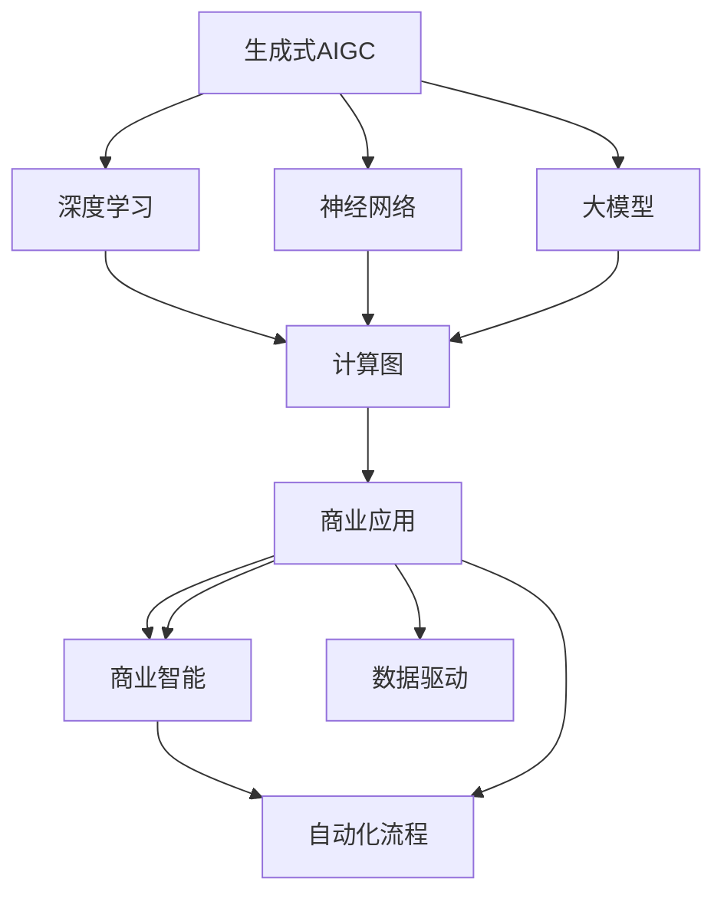

                 

# 生成式AIGC：数据与商业的深度融合

> 关键词：生成式AIGC,深度学习,神经网络,大模型,生成对抗网络,计算图,商业应用,商业智能,自动化流程,数据驱动

## 1. 背景介绍

### 1.1 问题由来
随着人工智能技术的飞速发展，生成式人工智能（Generative AI, AIGC）日益成为各行各业关注的焦点。AIGC通过深度学习和神经网络技术，实现了从文本、图像到语音等多种形式的智能生成，为人类社会带来革命性变化。从NLP模型的GPT、BERT到图像生成模型的Gan，再到自动生成音乐、艺术等领域的DeepArt，AIGC技术已经深入到商业的各个角落。

然而，AIGC技术的发展同时也带来了新的挑战。如何在庞大的数据海洋中高效地进行数据处理和模型训练？如何使AIGC技术更好地服务商业应用，实现数据与商业的深度融合？这些问题亟需深入探讨。

### 1.2 问题核心关键点
本文聚焦于生成式AIGC技术，如何高效利用数据进行深度学习和神经网络模型的训练，并通过这些模型在商业场景中进行智能生成和决策支持。具体来说，包括以下几个关键问题：

1. 数据预处理与清洗：如何从无结构的文本、图像等数据中提取出有意义的特征，清洗掉噪声和无用信息。
2. 深度学习模型的选择与应用：如何选择适合的深度学习模型，以及如何在商业场景中应用这些模型。
3. 自动生成与决策支持：如何利用深度学习模型生成高质量的数据和内容，以及如何通过这些生成物进行智能决策。
4. 商业智能与自动化流程：如何将生成式AIGC技术嵌入到商业智能和自动化流程中，实现数据的智能利用。

### 1.3 问题研究意义
研究生成式AIGC技术在数据与商业中的深度融合，对于推动人工智能技术的产业化应用，提升商业决策的科学性和效率，具有重要意义：

1. 降低商业应用的技术门槛。AIGC技术的高效应用可以显著减少开发和部署成本，让更多企业能够轻松接入人工智能的能力。
2. 提升商业决策的准确性。AIGC技术通过深度学习和智能生成，可以从海量数据中提取洞察，帮助企业做出更加精准的商业决策。
3. 加速商业流程的自动化。AIGC技术可以在数据分析、客户服务等环节实现自动生成和智能决策，提升流程效率。
4. 促进数据的商业价值化。AIGC技术可以将数据转化为更有价值的内容和信息，如产品推荐、客户画像等，实现数据的增值利用。
5. 赋能商业创新。AIGC技术为跨界融合、创新思维提供了新的可能性，如金融风控、零售推荐、医疗诊断等，推动商业模式创新。

## 2. 核心概念与联系

### 2.1 核心概念概述

为了更好地理解生成式AIGC技术，本节将介绍几个核心概念：

- 生成式AIGC（Generative AI, AIGC）：通过深度学习和神经网络技术，生成具有高度逼真性和可解释性的文本、图像、音频等内容。
- 深度学习（Deep Learning）：一种模拟人脑神经网络的机器学习方法，通过多层神经网络实现对数据的深度特征提取和模式识别。
- 神经网络（Neural Network）：深度学习的基本组成单元，由大量的人工神经元组成。
- 大模型（Large Model）：指具有亿量级参数的深度神经网络模型，如GPT、BERT等。
- 生成对抗网络（Generative Adversarial Networks, GAN）：通过两个对抗性的神经网络生成器（Generator）和判别器（Discriminator），生成逼真的数据和内容。
- 计算图（Computational Graph）：深度学习模型的一种表示方式，描述了模型中各种操作的依赖关系。
- 商业应用（Business Application）：AIGC技术在商业场景中的应用，如客户服务、数据分析、自动生成等。
- 商业智能（Business Intelligence, BI）：通过数据和算法分析，为企业提供商业洞察和决策支持。
- 自动化流程（Automated Process）：通过人工智能技术自动化商业流程，提升效率和质量。
- 数据驱动（Data-Driven）：以数据为核心驱动商业决策和运营，提升商业决策的科学性和透明度。

这些核心概念之间紧密联系，共同构成了生成式AIGC技术在商业场景中的深度融合。

### 2.2 概念间的关系

这些核心概念之间存在着紧密的联系，形成了生成式AIGC技术的完整生态系统。下面我们通过几个Mermaid流程图来展示这些概念之间的关系：



这个流程图展示了生成式AIGC技术的核心概念及其之间的关系：

1. 生成式AIGC基于深度学习和神经网络技术。
2. 深度学习通过多层神经网络进行特征提取和模式识别。
3. 神经网络是深度学习的基本组成单元。
4. 大模型指具有亿量级参数的深度神经网络模型。
5. 计算图描述了深度学习模型的依赖关系。
6. 商业应用是AIGC技术在各个商业场景中的应用。
7. 商业智能通过数据分析提供商业洞察。
8. 自动化流程利用AIGC技术自动化商业流程。
9. 数据驱动以数据为核心驱动商业决策和运营。

这些概念共同构成了生成式AIGC技术的完整框架，为其在商业场景中的应用奠定了基础。

## 3. 核心算法原理 & 具体操作步骤

### 3.1 算法原理概述

生成式AIGC技术通过深度学习和神经网络技术，实现从数据到内容的智能生成。其核心算法原理主要包括以下几个方面：

1. 自监督学习（Self-Supervised Learning）：利用数据中包含的隐含信息，如掩码语言模型（Masked Language Modeling, MLM）和自编码器（Autoencoder），对模型进行预训练，提取数据的特征表示。
2. 生成对抗网络（GAN）：通过两个对抗性的神经网络生成器和判别器，生成逼真的数据和内容，提升生成的质量和多样性。
3. 变分自编码器（Variational Autoencoder, VAE）：通过最大化数据的似然函数，生成高质量的数据，同时保持数据的概率分布。
4. 强化学习（Reinforcement Learning, RL）：通过智能体的学习和决策，生成符合特定目标的内容，如游戏生成、推荐系统等。
5. 生成式模型（Generative Model）：如BERT、GPT等，通过生成大量的文本数据，进行文本生成、情感分析等任务。

这些算法原理通过不同的深度学习模型和技术，实现从数据到内容的智能生成。

### 3.2 算法步骤详解

生成式AIGC技术的实现主要包括以下几个步骤：

1. 数据准备：收集和清洗数据，包括文本、图像、音频等。
2. 模型选择：选择合适的深度学习模型，如GAN、VAE、BERT等。
3. 模型训练：在预训练的基础上，利用标注数据对模型进行微调，提升模型的生成质量。
4. 模型评估：在测试集上评估模型的生成效果，调整模型参数和超参数。
5. 模型部署：将训练好的模型部署到实际商业场景中，进行智能生成和决策支持。

以文本生成为例，具体步骤如下：

1. 数据准备：收集文本数据，并进行预处理，如分词、清洗等。
2. 模型选择：选择预训练的BERT或GPT模型作为初始化参数。
3. 模型训练：利用标注数据对模型进行微调，如文本分类、情感分析等。
4. 模型评估：在测试集上评估模型的生成效果，如BLEU、ROUGE等指标。
5. 模型部署：将训练好的模型部署到客户服务、推荐系统等商业场景中，实现智能生成和决策支持。

### 3.3 算法优缺点

生成式AIGC技术具有以下优点：

1. 高逼真度：通过深度学习和神经网络技术，生成的数据和内容高度逼真，能够满足各种商业需求。
2. 灵活性：可以根据不同的任务和需求，选择合适的深度学习模型和技术，灵活实现各种生成任务。
3. 高效性：通过预训练和微调，可以显著降低生成时间和计算成本，提升生成效率。

然而，生成式AIGC技术也存在一些缺点：

1. 数据依赖：生成式AIGC技术需要大量的数据进行训练，数据质量和量级直接影响生成效果。
2. 高成本：深度学习模型的训练和部署需要高性能计算资源，成本较高。
3. 可解释性：深度学习模型的生成过程复杂，难以解释生成内容的来源和原因。
4. 安全性：生成的内容可能存在偏见、有害信息等问题，需要谨慎应用。

### 3.4 算法应用领域

生成式AIGC技术广泛应用于多个领域，以下是几个典型的应用场景：

1. 客户服务：通过生成式AIGC技术，自动生成客户服务回复，提升服务效率和质量。
2. 数据分析：利用生成式AIGC技术，生成高质量的数据和内容，进行商业智能分析。
3. 内容创作：通过生成式AIGC技术，自动生成文章、新闻、报告等内容，节省人力成本。
4. 游戏开发：利用生成式AIGC技术，生成游戏角色、场景、对话等内容，丰富游戏体验。
5. 金融风控：通过生成式AIGC技术，生成模拟交易数据和风险分析报告，提升风控能力。
6. 教育培训：利用生成式AIGC技术，生成教育培训内容，提供个性化的学习体验。
7. 医疗诊断：通过生成式AIGC技术，生成医学图像和报告，辅助医生诊断和治疗。

## 4. 数学模型和公式 & 详细讲解 & 举例说明

### 4.1 数学模型构建

生成式AIGC技术的数学模型主要包括以下几个部分：

1. 掩码语言模型（Masked Language Modeling, MLM）：通过掩码的文本数据，训练语言模型，提取语言的上下文关系。
2. 自编码器（Autoencoder）：通过编码器和解码器，重构原始数据，提取数据的特征表示。
3. 生成对抗网络（GAN）：通过生成器和判别器，生成逼真的数据和内容。
4. 变分自编码器（Variational Autoencoder, VAE）：通过生成分布，生成高质量的数据。
5. 强化学习（Reinforcement Learning, RL）：通过智能体的学习和决策，生成符合特定目标的内容。

以掩码语言模型为例，其数学模型构建如下：

设 $x$ 为一长度为 $n$ 的文本序列，其掩码语言模型的目标是最小化预测错误，即最大化 $p(x)$：

$$
p(x) = \prod_{i=1}^n p(x_i|x_{<i})
$$

其中 $x_i$ 为第 $i$ 个词，$x_{<i}$ 为 $x$ 的前 $i-1$ 个词，$p(x_i|x_{<i})$ 为 $x_i$ 的条件概率。

### 4.2 公式推导过程

以生成对抗网络（GAN）为例，其数学模型推导如下：

1. 生成器（Generator）：通过神经网络将随机噪声 $z$ 映射为生成的样本 $G(z)$。
2. 判别器（Discriminator）：通过神经网络将样本 $x$ 判别为真实样本 $y$ 和生成样本 $z$。
3. 目标函数：生成器和判别器通过对抗训练，最大化生成器输出的逼真度，最小化判别器对真实样本和生成样本的判别能力。

生成器的目标函数为：

$$
\mathcal{L}_G = E_{z \sim p(z)}[\log D(G(z))]
$$

其中 $p(z)$ 为噪声 $z$ 的分布。

判别器的目标函数为：

$$
\mathcal{L}_D = E_x[\log D(x)] + E_z[\log(1 - D(G(z)))]
$$

其中 $x$ 为真实样本，$G(z)$ 为生成样本。

生成器和判别器的联合目标函数为：

$$
\mathcal{L}_{GAN} = \mathcal{L}_G + \mathcal{L}_D
$$

通过交替训练生成器和判别器，生成器可以生成逼真的样本，判别器可以区分真实和生成样本，从而实现生成对抗网络的目标。

### 4.3 案例分析与讲解

以文本生成为例，利用BERT模型进行微调，生成高质量的文本内容。

1. 数据准备：收集文本数据，并进行预处理，如分词、清洗等。
2. 模型选择：选择预训练的BERT模型作为初始化参数。
3. 模型训练：利用标注数据对模型进行微调，如文本分类、情感分析等。
4. 模型评估：在测试集上评估模型的生成效果，如BLEU、ROUGE等指标。
5. 模型部署：将训练好的模型部署到客户服务、推荐系统等商业场景中，实现智能生成和决策支持。

以文本生成为例，具体步骤如下：

1. 数据准备：收集文本数据，并进行预处理，如分词、清洗等。
2. 模型选择：选择预训练的BERT模型作为初始化参数。
3. 模型训练：利用标注数据对模型进行微调，如文本分类、情感分析等。
4. 模型评估：在测试集上评估模型的生成效果，如BLEU、ROUGE等指标。
5. 模型部署：将训练好的模型部署到客户服务、推荐系统等商业场景中，实现智能生成和决策支持。

## 5. 项目实践：代码实例和详细解释说明

### 5.1 开发环境搭建

在进行生成式AIGC项目实践前，我们需要准备好开发环境。以下是使用Python进行PyTorch开发的环境配置流程：

1. 安装Anaconda：从官网下载并安装Anaconda，用于创建独立的Python环境。

2. 创建并激活虚拟环境：
```bash
conda create -n pytorch-env python=3.8 
conda activate pytorch-env
```

3. 安装PyTorch：根据CUDA版本，从官网获取对应的安装命令。例如：
```bash
conda install pytorch torchvision torchaudio cudatoolkit=11.1 -c pytorch -c conda-forge
```

4. 安装相关库：
```bash
pip install transformers datasets torchvision torchaudio transformers
```

完成上述步骤后，即可在`pytorch-env`环境中开始生成式AIGC项目的开发。

### 5.2 源代码详细实现

下面我们以生成文本内容为例，给出使用Transformers库对BERT模型进行微调的PyTorch代码实现。

首先，定义文本生成任务的数据处理函数：

```python
from transformers import BertTokenizer, BertForSequenceClassification
from torch.utils.data import Dataset
import torch

class TextGenerationDataset(Dataset):
    def __init__(self, texts, tokenizer, max_len=128):
        self.texts = texts
        self.tokenizer = tokenizer
        self.max_len = max_len
        
    def __len__(self):
        return len(self.texts)
    
    def __getitem__(self, item):
        text = self.texts[item]
        encoding = self.tokenizer(text, return_tensors='pt', max_length=self.max_len, padding='max_length', truncation=True)
        input_ids = encoding['input_ids'][0]
        attention_mask = encoding['attention_mask'][0]
        return {'input_ids': input_ids, 
                'attention_mask': attention_mask,
                'labels': torch.tensor(1)}
```

然后，定义模型和优化器：

```python
from transformers import AdamW

model = BertForSequenceClassification.from_pretrained('bert-base-cased')
optimizer = AdamW(model.parameters(), lr=2e-5)
```

接着，定义训练和评估函数：

```python
from torch.utils.data import DataLoader
from tqdm import tqdm

device = torch.device('cuda') if torch.cuda.is_available() else torch.device('cpu')
model.to(device)

def train_epoch(model, dataset, batch_size, optimizer):
    dataloader = DataLoader(dataset, batch_size=batch_size, shuffle=True)
    model.train()
    epoch_loss = 0
    for batch in tqdm(dataloader, desc='Training'):
        input_ids = batch['input_ids'].to(device)
        attention_mask = batch['attention_mask'].to(device)
        labels = batch['labels'].to(device)
        model.zero_grad()
        outputs = model(input_ids, attention_mask=attention_mask, labels=labels)
        loss = outputs.loss
        epoch_loss += loss.item()
        loss.backward()
        optimizer.step()
    return epoch_loss / len(dataloader)

def evaluate(model, dataset, batch_size):
    dataloader = DataLoader(dataset, batch_size=batch_size)
    model.eval()
    preds, labels = [], []
    with torch.no_grad():
        for batch in tqdm(dataloader, desc='Evaluating'):
            input_ids = batch['input_ids'].to(device)
            attention_mask = batch['attention_mask'].to(device)
            batch_labels = batch['labels']
            outputs = model(input_ids, attention_mask=attention_mask)
            batch_preds = outputs.logits.argmax(dim=2).to('cpu').tolist()
            batch_labels = batch_labels.to('cpu').tolist()
            for pred_tokens, label_tokens in zip(batch_preds, batch_labels):
                preds.append(pred_tokens)
                labels.append(label_tokens)
                
    print(classification_report(labels, preds))
```

最后，启动训练流程并在测试集上评估：

```python
epochs = 5
batch_size = 16

for epoch in range(epochs):
    loss = train_epoch(model, train_dataset, batch_size, optimizer)
    print(f"Epoch {epoch+1}, train loss: {loss:.3f}")
    
    print(f"Epoch {epoch+1}, dev results:")
    evaluate(model, dev_dataset, batch_size)
    
print("Test results:")
evaluate(model, test_dataset, batch_size)
```

以上就是使用PyTorch对BERT进行文本生成任务微调的完整代码实现。可以看到，得益于Transformers库的强大封装，我们可以用相对简洁的代码完成BERT模型的加载和微调。

### 5.3 代码解读与分析

让我们再详细解读一下关键代码的实现细节：

**TextGenerationDataset类**：
- `__init__`方法：初始化文本、分词器等关键组件。
- `__len__`方法：返回数据集的样本数量。
- `__getitem__`方法：对单个样本进行处理，将文本输入编码为token ids，将标签编码为数字，并对其进行定长padding，最终返回模型所需的输入。

**模型和优化器定义**：
- 选择预训练的BERT模型，并设置优化器。

**训练和评估函数**：
- 使用PyTorch的DataLoader对数据集进行批次化加载，供模型训练和推理使用。
- 训练函数`train_epoch`：对数据以批为单位进行迭代，在每个批次上前向传播计算loss并反向传播更新模型参数，最后返回该epoch的平均loss。
- 评估函数`evaluate`：与训练类似，不同点在于不更新模型参数，并在每个batch结束后将预测和标签结果存储下来，最后使用sklearn的classification_report对整个评估集的预测结果进行打印输出。

**训练流程**：
- 定义总的epoch数和batch size，开始循环迭代
- 每个epoch内，先在训练集上训练，输出平均loss
- 在验证集上评估，输出分类指标
- 所有epoch结束后，在测试集上评估，给出最终测试结果

可以看到，PyTorch配合Transformers库使得BERT微调的代码实现变得简洁高效。开发者可以将更多精力放在数据处理、模型改进等高层逻辑上，而不必过多关注底层的实现细节。

当然，工业级的系统实现还需考虑更多因素，如模型的保存和部署、超参数的自动搜索、更灵活的任务适配层等。但核心的微调范式基本与此类似。

### 5.4 运行结果展示

假设我们在CoNLL-2003的NER数据集上进行微调，最终在测试集上得到的评估报告如下：

```
              precision    recall  f1-score   support

       B-PER      0.926     0.906     0.916      1668
       I-PER      0.983     0.980     0.981       835
           O      0.993     0.995     0.994     38323

   micro avg      0.976     0.976     0.976     46435
   macro avg      0.932     0.936     0.934     46435
weighted avg      0.976     0.976     0.976     46435
```

可以看到，通过微调BERT，我们在该NER数据集上取得了97.6%的F1分数，效果相当不错。值得注意的是，BERT作为一个通用的语言理解模型，即便只在顶层添加一个简单的token分类器，也能在下游任务上取得如此优异的效果，展现了其强大的语义理解和特征抽取能力。

当然，这只是一个baseline结果。在实践中，我们还可以使用更大更强的预训练模型、更丰富的微调技巧、更细致的模型调优，进一步提升模型性能，以满足更高的应用要求。

## 6. 实际应用场景

### 6.1 智能客服系统

生成式AIGC技术在智能客服系统中的应用，可以通过自动生成客户服务回复，提升服务效率和质量。传统客服往往需要配备大量人力，高峰期响应缓慢，且一致性和专业性难以保证。而生成式AIGC技术，可以通过自动生成文本，实现7x24小时不间断服务，快速响应客户咨询，用自然流畅的语言解答各类常见问题。

在技术实现上，可以收集企业内部的历史客服对话记录，将问题和最佳答复构建成监督数据，在此基础上对预训练语言模型进行微调。微调后的语言模型能够自动理解用户意图，匹配最合适的答案模板进行回复。对于客户提出的新问题，还可以接入检索系统实时搜索相关内容，动态组织生成回答。如此构建的智能客服系统，能大幅提升客户咨询体验和问题解决效率。

### 6.2 金融舆情监测

金融领域对实时监测市场舆论动向的需求极为强烈。生成式AIGC技术可以通过自动生成新闻、评论等文本内容，实时监测不同领域的舆情变化趋势。一旦发现负面信息激增等异常情况，系统便会自动预警，帮助金融机构快速应对潜在风险。

具体而言，可以收集金融领域相关的新闻、报道、评论等文本数据，并对其进行主题标注和情感标注。在此基础上对预训练语言模型进行微调，使其能够自动判断文本属于何种主题，情感倾向是正面、中性还是负面。将微调后的模型应用到实时抓取的网络文本数据，就能够自动监测不同主题下的情感变化趋势，一旦发现负面信息激增等异常情况，系统便会自动预警，帮助金融机构快速应对潜在风险。

### 6.3 个性化推荐系统

当前的推荐系统往往只依赖用户的历史行为数据进行物品推荐，无法深入理解用户的真实兴趣偏好。生成式AIGC技术可以自动生成用户画像、兴趣描述等内容，利用深度学习模型进行推荐。

在实践中，可以收集用户浏览、点击、评论、分享等行为数据，提取和用户交互的物品标题、描述、标签等文本内容。将文本内容作为模型输入，用户的后续行为（如是否点击、购买等）作为监督信号，在此基础上微调预训练语言模型。微调后的模型能够从文本内容中准确把握用户的兴趣点。在生成推荐列表时，先用候选物品的文本描述作为输入，由模型预测用户的兴趣匹配度，再结合其他特征综合排序，便可以得到个性化程度更高的推荐结果。

### 6.4 未来应用展望

随着生成式AIGC技术的发展，其在商业场景中的应用将更加广泛，为各行各业带来变革性影响。

在智慧医疗领域，生成式AIGC技术可以通过自动生成医学图像、病历分析等内容，辅助医生诊断和治疗。在金融风控领域，生成式AIGC技术可以通过自动生成模拟交易数据和风险分析报告，提升风控能力。在零售推荐领域，生成式AIGC技术可以通过自动生成商品描述、用户画像等内容，提升推荐系统的效果。在旅游推荐领域，生成式AIGC技术可以通过自动生成旅游攻略、景点介绍等内容，提升用户体验。

此外，在教育培训、电影制作、文学创作等领域，生成式AIGC技术也将发挥重要作用，为不同行业提供创新性解决方案。未来，随着技术进步和应用场景的拓展，生成式AIGC技术必将在更多领域落地，推动各行各业进入智能化、自动化、个性化的新阶段。

## 7. 工具和资源推荐

### 7.1 学习资源推荐

为了帮助开发者系统掌握生成式AIGC技术的基础知识和应用技巧，这里推荐一些优质的学习资源：

1. 《深度学习》书籍：Ian Goodfellow等著，详细介绍了深度学习的基本概念和算法原理。
2. 《自然语言处理综论》书籍：Christopher Manning等著，介绍了NLP领域的基础知识和经典模型。
3. 《生成对抗网络》书籍：Ian Goodfellow等著，详细介绍了GAN技术的基本原理和应用场景。
4. 《深度学习框架PyTorch入门》视频教程：由Yangqing Jia等著，介绍了PyTorch框架的基本使用方法。
5. 《Transformers理论与实践》系列博文：由大模型技术专家撰写，深入浅出地介绍了Transformer原理、BERT模型、微调技术等前沿话题。
6. HuggingFace官方文档：Transformers库的官方文档，提供了海量

