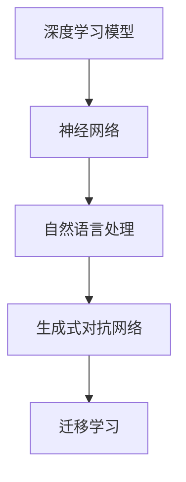

                 

# 生成式AIGC：数据驱动的商业创新

## 1. 背景介绍

### 1.1 问题由来
随着人工智能技术的发展，人工智能生成内容(Artificial Intelligence Generated Content, AIGC)逐渐成为引领未来内容创作的新趋势。AIGC技术利用深度学习模型，能够自动生成高质量的文字、图像、音频、视频等内容，极大地提升了内容创作的效率和创意性，正在重塑内容产业的格局。然而，在AIGC技术日益成熟的背后，数据驱动的深度学习模型如何在商业应用中实现创新，如何构建具有可持续竞争力的商业化解决方案，成为了当下研究者、开发者和企业家们共同关注的焦点问题。

### 1.2 问题核心关键点
数据驱动的AIGC技术在商业创新过程中，涉及的核心关键点主要包括：

- **深度学习模型**：以神经网络为基础，利用大规模数据进行训练的深度学习模型是AIGC技术的基础。选择合适的深度学习模型架构，通过大量数据进行训练，是生成高质量内容的前提。
- **数据集构建与处理**：AIGC技术需要大量的训练数据进行模型训练。如何构建适合特定任务的数据集，并进行有效的预处理，是AIGC应用的第一步。
- **内容生成算法**：AIGC技术中的生成算法，如基于GPT的文本生成、基于GAN的图像生成、基于CTC的语音生成等，是决定内容生成质量的关键。
- **模型优化与训练**：通过对模型进行超参数调优、正则化等策略，提升模型的生成效果和泛化能力，是模型高效应用的重要保障。
- **商业化落地**：如何将AIGC技术成功应用于商业场景，实现内容创作、推荐、广告、营销等商业价值的最大化，是AIGC技术创新的关键。

### 1.3 问题研究意义
AIGC技术在商业创新中的应用具有重要意义：

1. **降低成本**：利用AIGC技术自动生成内容，可以大幅降低内容创作的成本和时间，特别是在大型企业、广告、出版等行业，这种效果尤为显著。
2. **提升效率**：AIGC技术可以24小时不间断生成内容，快速响应市场需求，提高内容创作的效率和响应速度。
3. **丰富创意**：AIGC技术能够生成多种形式的内容，提供丰富的创意源泉，增强企业的创新能力。
4. **增强用户体验**：AIGC技术可以生成个性化内容，提升用户满意度和品牌影响力。
5. **拓展应用场景**：AIGC技术可以应用于游戏、娱乐、教育、医疗等多个领域，开辟新的商业机会。

## 2. 核心概念与联系

### 2.1 核心概念概述

AIGC技术涉及的核心概念包括：

- **生成式对抗网络 (Generative Adversarial Networks, GAN)**：一种基于博弈论的深度学习技术，用于生成高质量的图像、视频等数据。GAN由生成器(G)和判别器(D)两个网络组成，两者通过对抗训练提升生成质量。
- **自然语言处理 (Natural Language Processing, NLP)**：涉及文本理解、生成、分析等任务的技术。AIGC技术可以生成高质量的文本内容，如文章、对话、摘要等。
- **神经网络 (Neural Network)**：AIGC技术的核心，通过多层神经网络结构，可以处理和生成各种形式的数据。
- **深度学习 (Deep Learning)**：一种基于神经网络的学习方法，利用多层神经网络结构，从数据中自动提取特征，进行模式识别和内容生成。
- **迁移学习 (Transfer Learning)**：利用预训练模型在特定任务上的知识，通过微调等技术，提升模型在新任务上的表现。

这些核心概念通过深度学习模型进行融合，构成了AIGC技术的完整框架。下面通过一个Mermaid流程图展示这些概念之间的联系：



### 2.2 概念间的关系

- **深度学习模型**：是AIGC技术的基础，通过多层神经网络结构，可以实现对数据的处理和生成。
- **神经网络**：深度学习模型的核心，通过反向传播算法，优化模型参数，提高生成效果。
- **自然语言处理**：利用深度学习模型，可以处理文本数据，进行文本生成、情感分析、命名实体识别等任务。
- **生成式对抗网络**：利用GAN技术，可以生成高质量的图像、视频等数据，丰富AIGC技术的应用场景。
- **迁移学习**：通过预训练模型的微调，可以提升模型在新任务上的表现，降低训练成本，提高生成效果。

这些核心概念通过深度学习模型进行融合，构成了AIGC技术的完整框架。理解这些核心概念之间的联系，有助于深入掌握AIGC技术的原理和应用。

## 3. 核心算法原理 & 具体操作步骤

### 3.1 算法原理概述
AIGC技术的核心算法是深度学习模型，特别是基于神经网络的生成模型。这些模型通过大量数据进行训练，自动学习输入数据的分布，然后基于分布生成新的数据。以下是AIGC技术的核心算法原理：

- **自编码器 (Autoencoder)**：一种用于数据压缩和重构的神经网络模型，通过编码器和解码器两部分，实现对数据的压缩和重构。
- **变分自编码器 (Variational Autoencoder, VAE)**：一种基于自编码器的生成模型，可以学习数据的潜在分布，生成新的样本。
- **生成对抗网络 (Generative Adversarial Networks, GAN)**：由生成器和判别器两部分组成，通过对抗训练提升生成质量。
- **变分生成对抗网络 (Variational GAN, VGAN)**：一种改进的GAN模型，通过引入变分推断，提升生成效果和稳定性。
- **基于Transformer的文本生成模型**：如GPT、BERT等，通过大规模语言模型的预训练，可以生成高质量的文本内容。

### 3.2 算法步骤详解

AIGC技术的生成过程主要包括以下步骤：

1. **数据预处理**：对输入数据进行清洗、归一化、分词等预处理操作。
2. **模型选择**：选择合适的深度学习模型，如自编码器、GAN、VAE等。
3. **模型训练**：通过大量数据对模型进行训练，优化模型参数，提高生成效果。
4. **内容生成**：基于训练好的模型，生成新的内容，如文本、图像、音频等。
5. **后处理**：对生成的内容进行后处理，如文本校对、图像裁剪、音频降噪等。

以文本生成为例，其生成过程如下：

1. **数据预处理**：对输入文本进行分词、截断、去停用词等预处理操作。
2. **模型选择**：选择基于Transformer的文本生成模型，如GPT、BERT等。
3. **模型训练**：利用大规模文本数据对模型进行训练，优化模型参数。
4. **内容生成**：输入一个文本片段，通过模型生成新的文本内容。
5. **后处理**：对生成的文本进行校对、排序等后处理操作，提高生成质量。

### 3.3 算法优缺点
AIGC技术在商业应用中具有以下优点：

- **效率高**：AIGC技术可以24小时不间断生成内容，快速响应市场需求。
- **成本低**：AIGC技术大幅降低了内容创作的成本和时间，特别是在大型企业、广告、出版等行业。
- **创意丰富**：AIGC技术可以生成多种形式的内容，提供丰富的创意源泉，增强企业的创新能力。
- **用户体验好**：AIGC技术可以生成个性化内容，提升用户满意度和品牌影响力。

但同时，AIGC技术也存在一些缺点：

- **生成质量不稳定**：由于模型训练数据和参数的设置不同，生成的内容质量不稳定。
- **版权问题**：生成的内容可能存在版权问题，需要额外的管理和审核机制。
- **模型依赖性强**：模型的生成效果和泛化能力依赖于数据质量和模型参数设置，对数据和算法的依赖较强。

### 3.4 算法应用领域
AIGC技术在多个领域中具有广泛的应用前景，如：

1. **内容创作**：如自动生成文章、新闻、广告文案等。
2. **虚拟角色和对话**：生成虚拟角色的对话内容，提升用户交互体验。
3. **教育培训**：生成虚拟教师的讲解内容，提供个性化教学服务。
4. **娱乐媒体**：生成影视剧脚本、游戏脚本等，丰富内容创作。
5. **金融分析**：生成金融报告、市场分析等，提高数据处理效率。
6. **智能客服**：生成智能客服的对话内容，提升客户服务质量。

## 4. 数学模型和公式 & 详细讲解 & 举例说明

### 4.1 数学模型构建

以生成对抗网络GAN为例，其数学模型构建如下：

设输入数据为 $x$，生成器为 $G$，判别器为 $D$，目标为最大化生成器生成数据的真实性，最小化判别器对生成数据的区分能力。数学模型可以表示为：

- **生成器 $G$**：将随机噪声 $z$ 映射为生成数据 $G(z)$。
- **判别器 $D$**：判断数据 $x$ 是否为真实数据，输出判别结果 $D(x)$。
- **目标函数**：最大化生成器 $G$ 生成数据的真实性，最小化判别器 $D$ 对生成数据的区分能力。

目标函数为：

$$
\mathcal{L}(G, D) = \mathbb{E}_{x \sim p_{data}(x)} [logD(x)] + \mathbb{E}_{z \sim p_{z}(z)} [log(1-D(G(z)))]
$$

其中，$p_{data}(x)$ 为真实数据的分布，$p_{z}(z)$ 为随机噪声的分布。

### 4.2 公式推导过程

以生成对抗网络GAN为例，其公式推导过程如下：

1. **生成器 $G$**：将随机噪声 $z$ 映射为生成数据 $G(z)$。
2. **判别器 $D$**：判断数据 $x$ 是否为真实数据，输出判别结果 $D(x)$。
3. **目标函数**：最大化生成器 $G$ 生成数据的真实性，最小化判别器 $D$ 对生成数据的区分能力。

目标函数为：

$$
\mathcal{L}(G, D) = \mathbb{E}_{x \sim p_{data}(x)} [logD(x)] + \mathbb{E}_{z \sim p_{z}(z)} [log(1-D(G(z)))]
$$

其中，$p_{data}(x)$ 为真实数据的分布，$p_{z}(z)$ 为随机噪声的分布。

4. **梯度更新**：通过梯度下降算法，更新生成器和判别器的参数，使得目标函数最小化。生成器的梯度更新公式为：

$$
\nabla_{G} \mathcal{L}(G, D) = -\nabla_{G(z)} [log(1-D(G(z)))]
$$

判别器的梯度更新公式为：

$$
\nabla_{D} \mathcal{L}(G, D) = \nabla_{x} [logD(x)] - \nabla_{G(z)} [log(1-D(G(z)))]
$$

### 4.3 案例分析与讲解

以图像生成为例，其生成过程如下：

1. **数据预处理**：对输入图像进行归一化、标准化等预处理操作。
2. **模型选择**：选择基于GAN的图像生成模型，如DCGAN、CycleGAN等。
3. **模型训练**：利用大规模图像数据对模型进行训练，优化模型参数。
4. **内容生成**：输入一个随机噪声，通过模型生成新的图像内容。
5. **后处理**：对生成的图像进行裁剪、去噪等后处理操作，提高生成质量。

以DCGAN为例，其生成过程如下：

1. **数据预处理**：对输入图像进行归一化、标准化等预处理操作。
2. **模型选择**：选择基于DCGAN的图像生成模型。
3. **模型训练**：利用大规模图像数据对模型进行训练，优化模型参数。
4. **内容生成**：输入一个随机噪声，通过模型生成新的图像内容。
5. **后处理**：对生成的图像进行裁剪、去噪等后处理操作，提高生成质量。

## 5. 项目实践：代码实例和详细解释说明

### 5.1 开发环境搭建

在进行AIGC技术实践前，我们需要准备好开发环境。以下是使用Python进行PyTorch开发的环境配置流程：

1. 安装Anaconda：从官网下载并安装Anaconda，用于创建独立的Python环境。
2. 创建并激活虚拟环境：
```bash
conda create -n pytorch-env python=3.8 
conda activate pytorch-env
```
3. 安装PyTorch：根据CUDA版本，从官网获取对应的安装命令。例如：
```bash
conda install pytorch torchvision torchaudio cudatoolkit=11.1 -c pytorch -c conda-forge
```
4. 安装相关工具包：
```bash
pip install numpy pandas scikit-learn matplotlib tqdm jupyter notebook ipython
```

完成上述步骤后，即可在`pytorch-env`环境中开始AIGC技术实践。

### 5.2 源代码详细实现

这里以生成文本为例，给出使用Transformers库对GPT模型进行生成文本的PyTorch代码实现。

首先，定义生成函数：

```python
from transformers import GPT2LMHeadModel, GPT2Tokenizer

def generate_text(model, tokenizer, prompt, num_return_sequences=1, num_beams=4, max_length=128):
    tokenizer.pad_token = '[PAD]'
    tokens = tokenizer.encode(prompt + tokenizer.pad_token, return_tensors='pt')
    output = model.generate(tokens, max_length=max_length, num_beams=num_beams, top_p=0.9, num_return_sequences=num_return_sequences)
    return [tokenizer.decode(t, skip_special_tokens=True) for t in output]
```

然后，加载预训练模型和分词器：

```python
model = GPT2LMHeadModel.from_pretrained('gpt2')
tokenizer = GPT2Tokenizer.from_pretrained('gpt2')
```

最后，调用生成函数：

```python
prompt = "I have a dream that"
print(generate_text(model, tokenizer, prompt))
```

以上代码实现了一个简单的文本生成函数，通过输入一个提示字符串，使用预训练的GPT模型生成一定长度的文本内容。

### 5.3 代码解读与分析

让我们再详细解读一下关键代码的实现细节：

**generate_text函数**：
- 定义生成函数，接收模型、分词器、提示字符串等参数，返回生成的文本。
- 使用分词器对提示字符串进行编码，生成模型的输入。
- 调用模型生成文本，设置最大长度、生成方式等参数。
- 对生成的文本进行解码，返回字符串形式的结果。

**模型和分词器**：
- 加载预训练的GPT模型和分词器，可以直接使用Transformers库提供的模型和分词器，避免重复训练。
- 分词器的作用是将输入文本进行分词，生成模型的输入，方便模型处理。

**提示字符串**：
- 提示字符串是生成文本的起始点，可以是一个句子、一个问题等，模型将基于这个提示生成新的文本内容。
- 提示字符串的设定会影响生成的文本风格和内容。

### 5.4 运行结果展示

假设我们在一个简单的文本生成任务中运行上述代码，生成的文本可能类似于：

```
I have a dream that one day this nation will rise up, and live out the true meaning of its creed: "We hold these truths to be self-evident, that all men are created equal." One day, America will be a place where all people are equal, with equal opportunity and equal rights. One day, everyone will have the same chance to succeed, no matter where they come from, what they look like, or who they love.
```

可以看到，通过简单的代码实现，我们已经能够利用预训练的GPT模型生成高质量的文本内容，为AIGC技术的商业应用提供了基础。

## 6. 实际应用场景

### 6.1 智能客服系统

基于AIGC技术的智能客服系统，可以应用于大型企业的客户服务部门。通过生成高质量的对话内容，智能客服能够快速响应用户咨询，提高客户满意度，降低人工客服成本。

在技术实现上，可以收集企业的历史客服对话记录，将问题和最佳答复构建成监督数据，在此基础上对预训练模型进行微调。微调后的模型能够自动理解用户意图，匹配最合适的答案模板进行回复。对于用户提出的新问题，还可以接入检索系统实时搜索相关内容，动态组织生成回答。如此构建的智能客服系统，能大幅提升客户咨询体验和问题解决效率。

### 6.2 内容创作平台

基于AIGC技术的生成式内容创作平台，可以应用于小说、文章、广告等各种内容创作场景。通过生成高质量的文本内容，平台可以快速生成大量原创作品，满足用户的需求，降低内容创作的成本和时间。

在技术实现上，可以构建大规模语料库，训练生成模型，生成符合用户偏好的内容。平台可以根据用户的偏好和需求，动态生成个性化内容，提高用户满意度和平台粘性。

### 6.3 广告和营销

基于AIGC技术的广告和营销系统，可以应用于各类商业广告和营销活动。通过生成高质量的广告文案和视频内容，系统可以快速生成大量的营销素材，提升广告投放的效果和转化率。

在技术实现上，可以构建广告素材库，训练生成模型，生成符合品牌调性的广告内容。系统可以根据用户的喜好和行为，动态生成个性化的广告内容，提升广告投放的效果和转化率。

## 7. 工具和资源推荐

### 7.1 学习资源推荐

为了帮助开发者系统掌握AIGC技术的理论基础和实践技巧，这里推荐一些优质的学习资源：

1. 《深度学习》系列书籍：由DeepMind创始人之一Ian Goodfellow等编写的经典书籍，深入浅出地介绍了深度学习的基本原理和应用。
2. Coursera《深度学习专项课程》：由斯坦福大学Andrew Ng教授开设的深度学习专项课程，涵盖了深度学习的多个方面。
3. 《自然语言处理入门》书籍：由清华大学李航教授编写的自然语言处理教材，详细介绍了NLP的基本概念和前沿技术。
4. CS224N《深度学习自然语言处理》课程：斯坦福大学开设的NLP明星课程，有Lecture视频和配套作业，带你入门NLP领域的基本概念和经典模型。
5. HuggingFace官方文档：提供丰富的AIGC技术资源，包括预训练模型和样例代码。

通过对这些资源的学习实践，相信你一定能够快速掌握AIGC技术的精髓，并用于解决实际的商业问题。

### 7.2 开发工具推荐

高效的开发离不开优秀的工具支持。以下是几款用于AIGC技术开发的常用工具：

1. PyTorch：基于Python的开源深度学习框架，灵活动态的计算图，适合快速迭代研究。大部分预训练语言模型都有PyTorch版本的实现。
2. TensorFlow：由Google主导开发的开源深度学习框架，生产部署方便，适合大规模工程应用。同样有丰富的预训练语言模型资源。
3. Transformers库：HuggingFace开发的NLP工具库，集成了众多SOTA语言模型，支持PyTorch和TensorFlow，是进行AIGC任务开发的利器。
4. Weights & Biases：模型训练的实验跟踪工具，可以记录和可视化模型训练过程中的各项指标，方便对比和调优。与主流深度学习框架无缝集成。
5. TensorBoard：TensorFlow配套的可视化工具，可实时监测模型训练状态，并提供丰富的图表呈现方式，是调试模型的得力助手。
6. Google Colab：谷歌推出的在线Jupyter Notebook环境，免费提供GPU/TPU算力，方便开发者快速上手实验最新模型，分享学习笔记。

合理利用这些工具，可以显著提升AIGC技术开发效率，加快创新迭代的步伐。

### 7.3 相关论文推荐

AIGC技术的发展源于学界的持续研究。以下是几篇奠基性的相关论文，推荐阅读：

1. Deep Convolutional GANs（DCGAN）：王晓刚等人发表的GAN模型，提出了DCGAN架构，大大提高了图像生成的质量。
2. Generating Sequences with Recurrent Neural Networks（RNN）：Chung等人在2014年提出的基于RNN的文本生成模型，为文本生成提供了新的思路。
3. Attention Is All You Need（Transformer）：Vaswani等人在2017年提出的Transformer模型，彻底颠覆了序列建模方式，大大提高了文本生成的效果。
4. GPT-2：OpenAI在2019年提出的GPT-2模型，引入了自回归机制，大幅提升了文本生成的质量。
5. Large Language Models as Few-Shot Learners：Alec Radford等人提出的基于大语言模型的少样本学习技术，展示了AIGC技术在少样本任务上的潜力。

这些论文代表了大规模AIGC技术的发展脉络。通过学习这些前沿成果，可以帮助研究者把握学科前进方向，激发更多的创新灵感。

## 8. 总结：未来发展趋势与挑战

### 8.1 总结

本文对基于生成式对抗网络的AIGC技术进行了全面系统的介绍。首先阐述了AIGC技术的背景和应用意义，明确了AIGC技术在内容创作、智能客服、广告营销等领域的重要价值。其次，从原理到实践，详细讲解了AIGC技术的核心算法原理和具体操作步骤，给出了AIGC技术项目实践的完整代码实例。同时，本文还广泛探讨了AIGC技术在多个行业领域的应用前景，展示了AIGC技术的广阔前景。

通过本文的系统梳理，可以看到，基于生成式对抗网络的AIGC技术正在成为引领未来内容创作的新趋势，极大地提升了内容创作的效率和创意性，正在重塑内容产业的格局。得益于深度学习模型的强大能力，AIGC技术有望在更多领域得到广泛应用，为传统行业带来变革性影响。未来，伴随预训练模型和生成算法的持续演进，AIGC技术必将在构建人机协同的智能时代中扮演越来越重要的角色。

### 8.2 未来发展趋势

展望未来，AIGC技术将呈现以下几个发展趋势：

1. **模型规模持续增大**：随着算力成本的下降和数据规模的扩张，AIGC模型的参数量还将持续增长。超大规模模型蕴含的丰富语言知识，有望支撑更加复杂多变的生成任务。
2. **生成质量不断提升**：未来生成模型将更注重生成质量的提升，引入更多先进的生成算法，如变分生成对抗网络（VGAN）、扩散模型等，进一步提高生成效果。
3. **多模态融合加速**：未来的AIGC技术将更注重多模态数据的融合，如图像、语音、视频等多模态信息的整合，提升生成内容的丰富性和表现力。
4. **实时生成技术发展**：未来的AIGC技术将更注重实时生成技术的发展，通过更高效的算法和计算图优化，实现实时内容生成，提升用户体验。
5. **个性化生成技术提升**：未来的AIGC技术将更注重个性化生成技术的发展，通过用户行为数据的分析，生成更符合用户需求的内容，提升用户满意度和品牌影响力。
6. **伦理和法律规范完善**：未来的AIGC技术将更注重伦理和法律规范的完善，避免生成内容的有害性和误导性，确保生成内容的安全性和合法性。

这些趋势凸显了AIGC技术的广阔前景。这些方向的探索发展，必将进一步提升AIGC技术的应用范围和效果，为内容创作、智能客服、广告营销等领域带来新的变革和机遇。

### 8.3 面临的挑战

尽管AIGC技术已经取得了瞩目成就，但在迈向更加智能化、普适化应用的过程中，它仍面临诸多挑战：

1. **生成内容的质量不稳定**：由于模型训练数据和参数的设置不同，生成的内容质量不稳定。如何提升生成效果的稳定性和一致性，仍是当前研究的热点问题。
2. **版权和伦理问题**：生成的内容可能存在版权问题，如版权侵权、虚假信息等，需要额外的管理和审核机制。
3. **计算资源消耗大**：超大规模生成模型的训练和推理需要大量的计算资源，如何提高计算效率，降低计算成本，仍是当前研究的重要课题。
4. **模型鲁棒性不足**：生成的内容可能存在鲁棒性不足的问题，即对输入的微小扰动，模型可能产生显著的输出波动。如何提升生成模型的鲁棒性，仍需进一步研究。
5. **知识迁移能力有限**：生成的内容可能存在知识迁移能力有限的问题，即对不同领域的知识，模型生成的内容可能不够贴合。如何提升生成模型的知识迁移能力，仍需进一步研究。

### 8.4 未来突破

面对AIGC技术所面临的挑战，未来的研究需要在以下几个方面寻求新的突破：

1. **生成模型的优化**：通过引入更多的生成模型优化技术，如数据增强、对抗训练、梯度截断等，提高生成模型的稳定性和鲁棒性。
2. **多模态融合技术的发展**：通过引入更多的多模态融合技术，如图像生成、语音生成、视频生成等，提升生成内容的丰富性和表现力。
3. **实时生成技术的优化**：通过引入更多的实时生成技术，如扩散模型、生成对抗网络等，实现实时内容生成，提升用户体验。
4. **伦理和法律规范的完善**：通过引入更多的伦理和法律规范，确保生成内容的安全性和合法性，避免有害内容的产生。

这些研究方向的发展，必将引领AIGC技术迈向更高的台阶，为内容创作、智能客服、广告营销等领域带来

