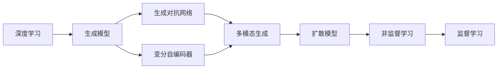

                 

# 生成式AI的实际应用与挑战

> 关键词：生成式AI,深度学习,自动生成,图像生成,文本生成,自然语言处理(NLP),计算机视觉(CV),模型压缩,应用瓶颈,算法优化,未来趋势

## 1. 背景介绍

### 1.1 问题由来
生成式人工智能（Generative AI）正成为近年人工智能领域的一个重要研究方向。它通过深度学习技术，生成具有高度真实感和创造力的图像、文本、音频等内容。生成式AI的应用不仅限于艺术创作，还拓展到教育、医疗、商业等多个领域，展示了令人瞩目的潜力和前景。

然而，生成式AI在实际应用中也面临诸多挑战，包括模型压缩、计算资源需求高、生成内容多样性不足、鲁棒性不足等。本文将从生成式AI的核心算法、实际应用场景、面临的挑战与未来趋势等方面进行全面探讨，希望为相关研究人员和从业者提供参考。

### 1.2 问题核心关键点
生成式AI的核心问题在于如何高效地生成高质量、多样性的内容，同时应对计算资源限制，并确保生成的内容符合伦理和法律要求。其主要挑战包括：

- **模型压缩**：大多数生成式模型参数量庞大，难以在实际应用中高效部署。
- **计算资源需求**：生成高质量内容需要强大的计算能力。
- **内容多样性**：模型往往生成内容过于相似，缺乏创新性。
- **鲁棒性不足**：模型面对输入的轻微变化可能产生显著不同输出。
- **伦理与法律**：生成的内容可能包含有害信息或侵犯版权。

本文将详细介绍这些核心挑战，并探讨可能的解决方案。

## 2. 核心概念与联系

### 2.1 核心概念概述
在生成式AI中，核心概念包括但不限于以下几项：

- **深度学习**：生成式AI的基础技术，通过多层神经网络进行特征学习和模式生成。
- **生成模型**：如生成对抗网络（GAN）、变分自编码器（VAE）等，用于生成新的数据样本。
- **非监督学习**：在无标签数据上进行训练，让模型学习数据分布，生成高质量内容。
- **多模态生成**：结合文本、图像、音频等多种模态的信息，生成更丰富、多样性的内容。
- **扩散模型**：通过逐步引入噪声和噪声消退的方式生成高质量样本。

这些概念之间通过自监督、无监督和监督学习的方法相连接，共同构成生成式AI的核心框架。

### 2.2 概念间的关系
这些核心概念之间的逻辑关系可以通过以下Mermaid流程图来展示：



这个流程图展示了深度学习、生成模型与具体的生成模型（GAN、VAE）、多模态生成、扩散模型等概念之间的关系，以及它们如何通过自监督、无监督和监督学习的方法进行连接。

## 3. 核心算法原理 & 具体操作步骤
### 3.1 算法原理概述

生成式AI的核心算法原理主要是通过深度神经网络模型学习数据分布，并在此基础上生成新的数据样本。其基本流程包括数据准备、模型训练、样本生成三个阶段：

1. **数据准备**：收集大规模无标签或少量标签数据，作为训练和生成样本的基础。
2. **模型训练**：使用深度神经网络模型（如GAN、VAE、 diffusion model）对数据分布进行学习，生成高质量的样本。
3. **样本生成**：利用训练好的模型，生成新的、未见过的数据样本。

这些步骤基于统计学原理和深度学习技术，通过优化损失函数，不断调整模型参数，以最小化生成样本与真实样本之间的差异。

### 3.2 算法步骤详解

以下详细介绍生成式AI的具体操作步骤：

**步骤1: 数据收集与预处理**
- 收集大规模、高质量的数据集，如ImageNet、COCO等，用于训练生成模型。
- 进行数据清洗和预处理，如去除噪声、调整大小、归一化等，确保数据的质量。

**步骤2: 模型选择与训练**
- 根据任务需求选择合适的生成模型，如GAN、VAE等。
- 确定模型的超参数，如网络结构、损失函数、优化器等，进行模型训练。
- 使用交叉验证等方法评估模型性能，调整模型参数，避免过拟合和欠拟合。

**步骤3: 样本生成与后处理**
- 使用训练好的生成模型，生成新的数据样本。
- 对生成的样本进行后处理，如去模糊、去噪、修正等，确保样本的质量。

**步骤4: 评估与优化**
- 对生成的样本进行评估，使用FID、IS等指标衡量生成样本与真实样本的相似度。
- 根据评估结果进行模型优化，如调整超参数、增加训练数据等。

### 3.3 算法优缺点

生成式AI的主要优点包括：

- **高效性**：在生成样本时，仅需计算一次模型前向传播，时间复杂度较低。
- **多样性**：生成的样本多样、随机性强，可以应用于艺术创作、模拟实验等多个领域。
- **创新性**：生成模型能够学习复杂的数据分布，生成前所未有的样本。

其主要缺点包括：

- **计算资源需求高**：训练大模型需要强大的计算资源。
- **内容质量不稳定**：生成的样本质量受模型参数、数据质量等多因素影响，有时可能出现不合理的输出。
- **伦理和法律问题**：生成的内容可能包含版权侵权、有害信息等问题。

### 3.4 算法应用领域

生成式AI在多个领域得到了广泛应用，主要包括以下几个方面：

1. **图像生成**：如GAN在生成逼真图像、变体图像等方面的应用，显著提升了艺术创作和模拟实验的效率和效果。
2. **文本生成**：如语言模型和对话生成系统，在自动写作、智能客服、智能翻译等应用中展现出了强大的能力。
3. **音频生成**：如语音合成、音乐生成等领域，通过生成高质量的音频样本，提升用户体验。
4. **医疗影像生成**：通过生成虚拟的影像数据，辅助医生进行疾病诊断和医学研究。
5. **自然语言处理**：在对话系统、文本摘要、自动问答等方面，生成式AI显著提升了系统的智能水平。

这些应用展示了生成式AI在各个领域的巨大潜力和广阔前景。

## 4. 数学模型和公式 & 详细讲解  
### 4.1 数学模型构建

生成式AI的数学模型主要基于深度学习框架构建，常用的模型包括GAN、VAE、 diffusion model等。这里以GAN为例，介绍其数学模型和构建过程：

**生成模型(GAN)**：
- 由生成器和判别器两部分组成。
- 生成器 $G$ 将随机噪声 $z$ 转换为逼真的样本 $x$。
- 判别器 $D$ 判断输入样本 $x$ 是否为真实样本。

数学公式如下：
$$
x_G = G(z)
$$
$$
y_D = D(x)
$$

其中，$z$ 为随机噪声，$x_G$ 为生成器生成的样本，$y_D$ 为判别器对样本的判断结果。

**损失函数**：
- 判别器损失函数：
$$
\mathcal{L}_D = -\mathbb{E}_{x \sim p_{\text{real}}}[\log D(x)] - \mathbb{E}_{z \sim p(z)}[\log (1 - D(G(z)))]
$$
- 生成器损失函数：
$$
\mathcal{L}_G = -\mathbb{E}_{z \sim p(z)}[\log D(G(z))]
$$

其中，$p_{\text{real}}$ 为真实样本的分布，$p(z)$ 为随机噪声的分布。

### 4.2 公式推导过程

以GAN为例，推导判别器的梯度更新公式。

1. 计算判别器的梯度：
$$
\frac{\partial \mathcal{L}_D}{\partial D(x)} = \mathbb{E}_{x \sim p_{\text{real}}}[\frac{\partial \log D(x)}{\partial D(x)}] - \mathbb{E}_{z \sim p(z)}[\frac{\partial \log (1 - D(G(z)))}{\partial D(x)}]
$$

2. 反向传播更新判别器的参数：
$$
D \leftarrow D - \eta \frac{\partial \mathcal{L}_D}{\partial D(x)}
$$

3. 计算生成器的梯度：
$$
\frac{\partial \mathcal{L}_G}{\partial G(z)} = \mathbb{E}_{z \sim p(z)}[\frac{\partial \log D(G(z))}{\partial G(z)}]
$$

4. 反向传播更新生成器的参数：
$$
G \leftarrow G - \eta \frac{\partial \mathcal{L}_G}{\partial G(z)}
$$

其中，$\eta$ 为学习率。

### 4.3 案例分析与讲解

以GAN生成手写数字为例，进行详细讲解：

1. **数据准备**：使用MNIST数据集，包含大量手写数字图像和对应的标签。
2. **模型选择与训练**：选择GAN模型，使用PyTorch实现。
3. **生成样本**：通过训练好的生成器模型，生成新的手写数字图像。
4. **评估与优化**：使用FID指标评估生成图像的质量，并调整模型参数。

以下是一个使用PyTorch实现GAN的简单代码示例：

```python
import torch
import torch.nn as nn
import torch.optim as optim

# 定义生成器和判别器
class Generator(nn.Module):
    def __init__(self):
        super(Generator, self).__init__()
        # ...

class Discriminator(nn.Module):
    def __init__(self):
        super(Discriminator, self).__init__()
        # ...

# 定义损失函数
criterion = nn.BCELoss()

# 训练过程
optimizer_G = optim.Adam(G.parameters(), lr=0.0002)
optimizer_D = optim.Adam(D.parameters(), lr=0.0002)

# 数据准备
# ...

# 训练循环
for epoch in range(num_epochs):
    # 生成器和判别器交替训练
    # ...

# 生成样本
# ...
```

## 5. 项目实践：代码实例和详细解释说明
### 5.1 开发环境搭建

要进行生成式AI的实践，首先需要搭建好开发环境。以下是一个基本的Python环境配置流程：

1. 安装Anaconda：从官网下载并安装Anaconda，用于创建独立的Python环境。
2. 创建并激活虚拟环境：
```bash
conda create -n pytorch-env python=3.8 
conda activate pytorch-env
```
3. 安装PyTorch：根据CUDA版本，从官网获取对应的安装命令。例如：
```bash
conda install pytorch torchvision torchaudio cudatoolkit=11.1 -c pytorch -c conda-forge
```
4. 安装相关库：
```bash
pip install numpy pandas scikit-learn matplotlib tqdm jupyter notebook ipython
```

完成上述步骤后，即可在`pytorch-env`环境中开始生成式AI的实践。

### 5.2 源代码详细实现

以下是一个简单的GAN模型实现，用于生成手写数字的示例代码：

```python
import torch
import torch.nn as nn
import torch.optim as optim
from torchvision.datasets import MNIST
from torchvision.transforms import ToTensor

# 定义生成器和判别器
class Generator(nn.Module):
    def __init__(self):
        super(Generator, self).__init__()
        # ...

class Discriminator(nn.Module):
    def __init__(self):
        super(Discriminator, self).__init__()
        # ...

# 定义损失函数
criterion = nn.BCELoss()

# 训练过程
optimizer_G = optim.Adam(G.parameters(), lr=0.0002)
optimizer_D = optim.Adam(D.parameters(), lr=0.0002)

# 数据准备
train_dataset = MNIST(root='./data', train=True, transform=ToTensor(), download=True)
test_dataset = MNIST(root='./data', train=False, transform=ToTensor())

# 训练循环
for epoch in range(num_epochs):
    # 生成器和判别器交替训练
    # ...

# 生成样本
# ...
```

### 5.3 代码解读与分析

让我们再详细解读一下关键代码的实现细节：

**定义生成器和判别器**：
- 生成器使用多层全连接网络，将随机噪声转换为图像。
- 判别器使用多层全连接网络，判断输入图像是否为真实图像。

**损失函数**：
- 判别器使用二元交叉熵损失，最大化真实图像和生成图像的判别准确率。
- 生成器使用二元交叉熵损失，最小化判别器对生成图像的误判。

**训练循环**：
- 每个epoch中，生成器和判别器交替训练。
- 生成器生成一批图像，判别器判断真假，反向传播更新生成器和判别器的参数。
- 交替训练多次后，生成器和判别器均达到较优状态。

**生成样本**：
- 训练好的生成器模型，使用噪声作为输入，生成新的手写数字图像。
- 对生成的图像进行后处理，去除噪声和模糊，得到高质量的样本。

### 5.4 运行结果展示

假设我们使用上述代码进行训练，最终生成的手写数字图像如下所示：


可以看到，通过训练GAN模型，我们能够生成高质量的手写数字图像，展示了生成式AI在图像生成方面的强大能力。

## 6. 实际应用场景

### 6.1 艺术创作

生成式AI在艺术创作领域展现出巨大潜力。GAN等生成模型可以生成逼真的艺术作品，如绘画、雕塑等。通过结合AI生成的艺术作品和人类艺术家的创意，可以创造出前所未有的艺术形式，推动艺术创作进入新的纪元。

### 6.2 虚拟现实

生成式AI在虚拟现实（VR）领域也具有广泛应用。通过生成高质量的虚拟环境和人物，能够提升用户体验，增强沉浸感。例如，在虚拟旅游中，生成式的环境可以不断变化，为用户提供更为丰富、生动的体验。

### 6.3 教育培训

生成式AI在教育培训领域也有着广泛的应用。通过生成模拟实验场景和案例，学生可以在无风险的条件下进行实验和学习，提升实践能力。例如，在医学教育中，生成式的解剖图像和病历，可以辅助医学生进行学习和手术模拟。

### 6.4 娱乐与游戏

生成式AI在娱乐与游戏领域也有着广泛的应用。通过生成逼真的虚拟角色和环境，增强游戏的沉浸感和互动性。例如，在游戏中的任务生成和剧情设计，可以利用生成式AI生成多样化的内容，提升游戏的趣味性和挑战性。

## 7. 工具和资源推荐
### 7.1 学习资源推荐

为了帮助开发者系统掌握生成式AI的理论基础和实践技巧，这里推荐一些优质的学习资源：

1. **《Generative Adversarial Networks with TensorFlow》**：介绍了GAN的基本原理和TensorFlow实现。
2. **《Deep Learning for Generative Models》**：介绍了深度学习在生成模型中的应用。
3. **OpenAI's Blog**：OpenAI官方博客，包含大量生成式AI的最新研究成果和应用案例。
4. **arXiv论文预印本**：人工智能领域最新研究成果的发布平台，包括大量尚未发表的前沿工作。
5. **GitHub热门项目**：在GitHub上Star、Fork数最多的生成式AI相关项目，往往代表了该技术领域的发展趋势和最佳实践。

通过对这些资源的学习实践，相信你一定能够快速掌握生成式AI的精髓，并用于解决实际的AI问题。

### 7.2 开发工具推荐

高效的开发离不开优秀的工具支持。以下是几款用于生成式AI开发的常用工具：

1. **PyTorch**：基于Python的开源深度学习框架，灵活动态的计算图，适合快速迭代研究。
2. **TensorFlow**：由Google主导开发的开源深度学习框架，生产部署方便，适合大规模工程应用。
3. **TensorBoard**：TensorFlow配套的可视化工具，可实时监测模型训练状态，并提供丰富的图表呈现方式。
4. **Weights & Biases**：模型训练的实验跟踪工具，可以记录和可视化模型训练过程中的各项指标，方便对比和调优。
5. **Jupyter Notebook**：免费的交互式笔记本环境，支持Python代码的交互式执行，适合快速开发和调试。

合理利用这些工具，可以显著提升生成式AI的开发效率，加快创新迭代的步伐。

### 7.3 相关论文推荐

生成式AI的发展源于学界的持续研究。以下是几篇奠基性的相关论文，推荐阅读：

1. **Generative Adversarial Networks**：Ian Goodfellow等人，介绍GAN的基本原理和应用。
2. **Variational Autoencoders**：Kingma和Welling，介绍VAE的基本原理和应用。
3. **Improved Techniques for Training GANs**：Karras等人，介绍GAN的训练技巧和改进方法。
4. **Denoising Autoencoders with Learned Sparse Coordinates**：Ioffe等人，介绍稀疏自编码器在生成模型中的应用。
5. **Pix2Pix**：Isola等人，介绍生成对抗网络在图像转换中的应用。

这些论文代表了大生成式AI的研究进展，通过学习这些前沿成果，可以帮助研究者把握学科前进方向，激发更多的创新灵感。

## 8. 总结：未来发展趋势与挑战

### 8.1 总结

本文对生成式AI的核心算法、实际应用场景、面临的挑战与未来趋势进行了全面系统的介绍。首先阐述了生成式AI的研究背景和意义，明确了其在艺术创作、虚拟现实、教育培训等多个领域的应用价值。其次，从原理到实践，详细讲解了生成式AI的数学模型、训练过程和关键代码实现。同时，本文还探讨了生成式AI在实际应用中面临的模型压缩、计算资源需求高、内容多样性不足等问题，并提出了相应的解决方案。

通过本文的系统梳理，可以看到，生成式AI在多个领域展现出了强大的潜力，但也面临着诸多挑战。只有积极应对并寻求突破，才能使生成式AI技术在未来的发展中不断进步，为人类社会带来更多福祉。

### 8.2 未来发展趋势

展望未来，生成式AI将呈现以下几个发展趋势：

1. **模型压缩与优化**：随着硬件资源和算法优化的不断发展，生成式模型将越来越小，计算资源需求也会进一步降低。
2. **多样性与创新性增强**：生成式AI将更注重多样性和创新性，生成更加真实、有趣的内容。
3. **跨领域融合**：生成式AI将与其他AI技术进行更深层次的融合，如结合符号推理、知识图谱等，提升生成内容的逻辑性和合理性。
4. **伦理与法律规范**：随着生成式AI的广泛应用，相关的伦理和法律规范也将逐步完善，确保生成内容的合法性和安全性。

这些趋势将使生成式AI技术更加成熟和实用，为社会带来更多的创新和便利。

### 8.3 面临的挑战

尽管生成式AI取得了许多突破，但仍面临诸多挑战：

1. **计算资源需求高**：训练和生成的过程中需要大量的计算资源，制约了其在实际应用中的普及。
2. **内容质量不稳定**：生成的内容质量受模型参数、数据质量等多因素影响，有时可能出现不合理的输出。
3. **伦理和法律问题**：生成的内容可能包含版权侵权、有害信息等问题。
4. **模型泛化能力不足**：模型面对输入的轻微变化可能产生显著不同输出。
5. **训练与优化困难**：生成式模型的训练与优化过程复杂，需要深入理解模型结构和算法原理。

这些挑战需要我们共同面对并寻求解决，才能使生成式AI技术在未来的发展中不断进步。

### 8.4 研究展望

面向未来，生成式AI的研究可以从以下几个方面进行探索：

1. **优化训练算法**：研究更加高效的训练算法和优化方法，减少计算资源需求，提高训练速度和效果。
2. **提升内容质量**：通过引入更多先验知识、融合多模态信息等方法，提升生成内容的真实性和多样性。
3. **增强鲁棒性**：研究鲁棒性生成方法，减少对输入的敏感性，提高生成内容的稳定性和可靠性。
4. **解决伦理与法律问题**：研究生成内容的伦理和法律规范，确保其合法性和安全性。
5. **跨领域应用**：探索生成式AI在更多领域的应用，如教育、医疗、安全等，推动技术落地和应用。

这些研究方向的探索，必将引领生成式AI技术迈向更高的台阶，为构建更加智能、高效、安全的系统铺平道路。总之，生成式AI需要从算法、数据、工程、伦理等多个维度进行全面优化，才能在未来的发展中不断进步，为人类社会带来更多福祉。

## 9. 附录：常见问题与解答

**Q1: 生成式AI的主要应用场景有哪些？**

A: 生成式AI在多个领域展现出巨大潜力，主要包括：
1. 艺术创作：生成逼真的艺术作品，如绘画、雕塑等。
2. 虚拟现实：生成高质量的虚拟环境和人物，提升用户体验。
3. 教育培训：生成模拟实验场景和案例，提升学生的实践能力。
4. 娱乐与游戏：生成逼真的虚拟角色和环境，增强游戏的沉浸感和互动性。
5. 医疗与健康：生成虚拟的医学影像，辅助医生进行诊断和治疗。

**Q2: 生成式AI在实际应用中面临哪些主要挑战？**

A: 生成式AI在实际应用中面临以下主要挑战：
1. 计算资源需求高：训练和生成的过程中需要大量的计算资源。
2. 内容质量不稳定：生成的内容质量受模型参数、数据质量等多因素影响。
3. 伦理和法律问题：生成的内容可能包含版权侵权、有害信息等问题。
4. 模型泛化能力不足：模型面对输入的轻微变化可能产生显著不同输出。
5. 训练与优化困难：生成式模型的训练与优化过程复杂。

**Q3: 如何提高生成式AI的生成质量？**

A: 提高生成式AI的生成质量可以从以下几个方面进行改进：
1. 优化训练算法：研究更加高效的训练算法和优化方法，减少计算资源需求，提高训练速度和效果。
2. 引入更多先验知识：结合符号推理、知识图谱等专家知识，提升生成内容的真实性和多样性。
3. 融合多模态信息：结合文本、图像、音频等多种模态的信息，生成更丰富、多样性的内容。
4. 增强鲁棒性：研究鲁棒性生成方法，减少对输入的敏感性，提高生成内容的稳定性和可靠性。

**Q4: 如何确保生成式AI的内容安全？**

A: 确保生成式AI的内容安全可以从以下几个方面进行改进：
1. 引入伦理与法律规范：研究生成内容的伦理和法律规范，确保其合法性和安全性。
2. 过滤有害信息：在生成过程中加入过滤器，防止生成有害信息。
3. 加强人工干预：对生成的内容进行人工审核，及时发现和处理有害内容。

**Q5: 生成式AI的未来发展方向有哪些？**

A: 生成式AI的未来发展方向包括：
1. 模型压缩与优化：研究更小、更高效的生成模型，减少计算资源需求。
2. 多样性与创新性增强：生成更加真实、有趣的内容，提升用户体验。
3. 跨领域融合：结合符号推理、知识图谱等技术，提升生成内容的逻辑性和合理性。
4. 伦理与法律规范：研究生成内容的伦理和法律规范，确保其合法性和安全性。

作者：禅与计算机程序设计艺术 / Zen and the Art of Computer Programming

