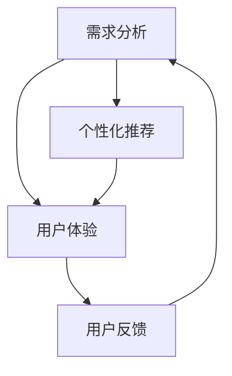

                 

# 用人和做生意的关键：懂得别人的需求

## 1. 背景介绍

在快速变化的商业环境中，无论是人还是企业，都面临着复杂多变的市场挑战。因此，如何理解和满足他人的需求，成为了用人和做生意的关键。本文将围绕这一主题，展开深入探讨。

## 2. 核心概念与联系

### 2.1 核心概念概述

为了更系统地理解用人和做生意的需求，我们需要对几个核心概念进行阐述：

- **需求分析**：通过对用户或客户的需求进行深入分析，明确其痛点和期望，从而制定有针对性的解决方案。
- **用户体验(UX)**：从用户的视角出发，关注产品的易用性、舒适性和情感体验，以提升用户的满意度和忠诚度。
- **用户反馈**：及时收集用户对产品或服务的反馈信息，进行数据分析和改进，不断优化产品体验。
- **个性化推荐**：根据用户的历史行为和偏好，提供个性化的产品或服务推荐，提升用户体验和满意度。

这些概念之间的联系通过以下 Mermaid 流程图来展示：



这个流程图展示了从需求分析到用户体验，再到用户反馈和个性化推荐的整体流程。其中，需求分析是基础，用户体验是结果，用户反馈用于迭代优化，个性化推荐则通过技术手段提升用户体验。

### 2.2 概念间的关系

需求分析、用户体验、用户反馈和个性化推荐之间相互关联，形成一个闭环。

- **需求分析**：需求分析旨在准确理解用户的真实需求，为后续的UX设计和个性化推荐奠定基础。
- **用户体验**：优秀的UX设计能够满足用户需求，提升其满意度和忠诚度。
- **用户反馈**：用户反馈提供了对产品体验的真实反馈，有助于持续改进产品。
- **个性化推荐**：基于用户反馈和行为数据的推荐系统，进一步优化用户体验，提升用户满意度。

这些概念通过不断的循环迭代，形成了一个螺旋上升的改进过程，最终提升产品和服务的整体竞争力。

## 3. 核心算法原理 & 具体操作步骤

### 3.1 算法原理概述

在商业场景中，基于需求分析和用户体验的优化，需要依赖数据驱动的方法。其中，推荐系统是实现个性化推荐的核心工具。推荐系统通过分析用户的行为和偏好，预测用户可能感兴趣的产品，并进行推荐。

推荐系统的核心算法包括：

- 协同过滤(Collaborative Filtering)
- 基于内容的推荐(Content-Based Recommendation)
- 混合推荐(Mixed Recommendation)
- 深度学习推荐(Deep Learning Recommendation)

### 3.2 算法步骤详解

#### 协同过滤算法

协同过滤算法基于用户和物品之间的相似性进行推荐。具体步骤包括：

1. **用户-物品评分矩阵构建**：收集用户对物品的评分数据，构建用户-物品评分矩阵 $R$。
2. **用户相似度计算**：计算用户之间的相似度，通常使用余弦相似度或皮尔逊相关系数。
3. **物品相似度计算**：计算物品之间的相似度，方法同上。
4. **相似性矩阵构建**：根据用户和物品的相似度，构建用户-物品相似性矩阵 $S$。
5. **推荐计算**：通过相似性矩阵计算用户对物品的评分预测值，并进行推荐。

#### 基于内容的推荐

基于内容的推荐算法通过分析物品的特征，预测用户可能感兴趣的产品。具体步骤包括：

1. **物品特征提取**：提取物品的特征，如关键词、标签等。
2. **用户兴趣建模**：基于用户的历史行为，建立用户的兴趣模型。
3. **特征匹配**：计算物品特征与用户兴趣模型的匹配度。
4. **推荐计算**：根据匹配度排序，推荐用户最可能感兴趣的物品。

#### 混合推荐

混合推荐结合了协同过滤和基于内容的推荐方法，通过集成不同算法的结果，提升推荐效果。具体步骤包括：

1. **协同过滤和基于内容推荐的融合**：根据不同的数据特点，选择适合的推荐算法。
2. **融合策略设计**：设计融合不同推荐结果的策略，如加权平均值、加权求和等。
3. **推荐计算**：通过融合策略计算最终推荐结果。

#### 深度学习推荐

深度学习推荐通过构建复杂的神经网络模型，学习用户和物品之间的隐式关联。具体步骤包括：

1. **模型构建**：选择适合的神经网络模型，如循环神经网络(RNN)、卷积神经网络(CNN)等。
2. **数据准备**：准备训练数据，并进行归一化、特征工程等预处理。
3. **模型训练**：使用训练数据训练深度学习模型。
4. **推荐计算**：利用训练好的模型，对新用户和物品进行推荐。

### 3.3 算法优缺点

#### 协同过滤算法

**优点**：
- 简单易实现，对数据量要求较低。
- 能够处理冷启动问题，即推荐新物品给新用户。

**缺点**：
- 对数据稀疏性敏感，容易产生推荐偏差。
- 推荐结果多样性不足，容易陷入局部最优解。

#### 基于内容的推荐

**优点**：
- 依赖物品特征，不需要用户行为数据。
- 推荐结果多样性好，能够推荐新物品给新用户。

**缺点**：
- 需要预先提取特征，数据处理复杂。
- 难以处理动态变化的用户兴趣。

#### 混合推荐

**优点**：
- 结合了协同过滤和基于内容的优点，综合推荐效果。
- 适用于复杂场景，能够处理不同类型的数据。

**缺点**：
- 算法复杂，计算量大。
- 融合策略的设计和优化较为困难。

#### 深度学习推荐

**优点**：
- 能够处理高维稀疏数据，推荐效果优秀。
- 可以学习用户和物品之间的复杂隐式关联。

**缺点**：
- 数据需求量大，计算复杂度高。
- 对模型的选择和调参要求高，容易出现过拟合。

### 3.4 算法应用领域

推荐系统广泛应用于电商、视频、音乐、新闻等多个领域，以下是几个典型的应用场景：

#### 电商平台推荐

电商平台的推荐系统通过分析用户的浏览、购买历史和评分数据，为用户推荐个性化的商品。通过协同过滤和基于内容的结合，能够提升用户的购买转化率和满意度。

#### 视频平台推荐

视频平台的推荐系统通过分析用户的观看历史和评分数据，为用户推荐感兴趣的视频内容。通过深度学习推荐，能够根据用户的观看行为，预测未来的兴趣偏好。

#### 新闻平台推荐

新闻平台的推荐系统通过分析用户的阅读历史和兴趣标签，为用户推荐相关的新闻内容。通过协同过滤和基于内容的推荐，能够提升用户对平台的粘性和忠诚度。

## 4. 数学模型和公式 & 详细讲解  
### 4.1 数学模型构建

推荐系统可以建模为如下优化问题：

$$
\min_{\theta} \frac{1}{2N}\sum_{i=1}^N \sum_{j=1}^M (r_{ij}-\hat{r}_{ij})^2 + \lambda \|\theta\|^2
$$

其中，$r_{ij}$ 表示用户 $i$ 对物品 $j$ 的真实评分，$\hat{r}_{ij}$ 表示模型预测的评分，$\theta$ 为模型参数，$\lambda$ 为正则化系数。

### 4.2 公式推导过程

对于一个用户 $i$，其对物品 $j$ 的评分可以表示为：

$$
\hat{r}_{ij} = \theta^T\phi(x_i)\phi(j)
$$

其中，$\theta$ 为模型参数，$\phi(x_i)$ 和 $\phi(j)$ 分别表示用户和物品的特征映射。

为了训练模型，需要最小化预测评分与真实评分的均方误差：

$$
\min_{\theta} \frac{1}{2N}\sum_{i=1}^N \sum_{j=1}^M (r_{ij}-\hat{r}_{ij})^2 + \lambda \|\theta\|^2
$$

通过求解上述优化问题，可以得到最优的模型参数 $\theta$。

### 4.3 案例分析与讲解

假设有一个电商平台的推荐系统，使用了协同过滤算法。具体实现步骤如下：

1. **数据准备**：收集用户的浏览记录和评分数据，构建用户-物品评分矩阵 $R$。
2. **用户相似度计算**：计算用户之间的余弦相似度，构建用户相似度矩阵 $S$。
3. **物品相似度计算**：计算物品之间的余弦相似度，构建物品相似度矩阵 $S'$。
4. **相似性矩阵融合**：将用户和物品相似性矩阵进行组合，得到综合相似性矩阵 $S''$。
5. **推荐计算**：根据相似性矩阵计算用户对物品的评分预测值，并进行推荐。

## 5. 项目实践：代码实例和详细解释说明

### 5.1 开发环境搭建

在实践推荐系统时，需要安装Python、NumPy、Pandas、Scikit-learn、TensorFlow或PyTorch等常用库。

```bash
pip install numpy pandas scikit-learn tensorflow pytorch
```

### 5.2 源代码详细实现

以下是一个基于协同过滤算法的推荐系统示例，使用Python和TensorFlow实现：

```python
import numpy as np
import tensorflow as tf

# 构建用户-物品评分矩阵
R = np.array([[4, 3, 2],
              [5, 4, 3],
              [1, 2, 1]])

# 构建用户相似度矩阵
S = np.array([[1, 0.6, 0.4],
              [0.6, 1, 0.5],
              [0.4, 0.5, 1]])

# 计算物品相似度矩阵
S_prime = np.transpose(S)

# 计算综合相似性矩阵
S_double = np.dot(S, S_prime)

# 定义损失函数
def loss_function(y_true, y_pred):
    return tf.reduce_mean(tf.square(y_true - y_pred))

# 定义优化器
optimizer = tf.keras.optimizers.Adam(learning_rate=0.01)

# 定义推荐模型
class RecommendationModel(tf.keras.Model):
    def __init__(self):
        super(RecommendationModel, self).__init__()
        self.dense_layer = tf.keras.layers.Dense(1)

    def call(self, inputs):
        x, y = inputs
        prediction = self.dense_layer(tf.multiply(x, y))
        return prediction

# 构建推荐模型
model = RecommendationModel()

# 定义输入和输出
input_shape = (R.shape[0], R.shape[1])
x = tf.keras.layers.Input(shape=input_shape)
y = tf.keras.layers.Input(shape=input_shape)
prediction = model([x, y])
output = tf.keras.layers.Lambda(lambda x: tf.expand_dims(x, axis=-1))(prediction)

# 定义损失函数和优化器
loss = loss_function(tf.stop_gradient(output), tf.stop_gradient(R))
optimizer = tf.keras.optimizers.Adam(learning_rate=0.01)

# 编译模型
model.compile(optimizer=optimizer, loss=loss)

# 训练模型
model.fit([R, R], R, epochs=100, batch_size=2)
```

### 5.3 代码解读与分析

在上述代码中，我们定义了一个基于协同过滤算法的推荐模型。具体步骤如下：

1. **数据准备**：构建用户-物品评分矩阵 $R$ 和用户相似度矩阵 $S$。
2. **模型定义**：定义推荐模型，包括输入层、密集层和输出层。
3. **模型编译**：编译模型，指定优化器和损失函数。
4. **模型训练**：使用训练数据训练模型。

## 6. 实际应用场景

推荐系统已经广泛应用于电商、视频、音乐等多个领域。以下列举几个实际应用场景：

#### 电商平台的推荐

在电商平台，推荐系统可以根据用户的历史浏览记录和购买行为，推荐相关的商品。通过协同过滤和基于内容的结合，能够提升用户的购买转化率和满意度。

#### 视频平台的推荐

在视频平台，推荐系统可以通过分析用户的观看历史和评分数据，为用户推荐感兴趣的视频内容。通过深度学习推荐，能够根据用户的观看行为，预测未来的兴趣偏好。

#### 新闻平台的推荐

在新闻平台，推荐系统可以通过分析用户的阅读历史和兴趣标签，为用户推荐相关的新闻内容。通过协同过滤和基于内容的推荐，能够提升用户对平台的粘性和忠诚度。

## 7. 工具和资源推荐

### 7.1 学习资源推荐

为了更好地学习推荐系统的相关知识，推荐以下学习资源：

1. 《推荐系统实战》：详细介绍了推荐系统的原理和实践，包括协同过滤、深度学习等推荐算法。
2. 《深度学习推荐系统》：介绍了深度学习在推荐系统中的应用，包括RNN、CNN等神经网络模型。
3. Coursera上的《Recommender Systems》课程：由斯坦福大学提供，系统讲解了推荐系统的理论和实践。
4. Kaggle上的推荐系统竞赛：通过实际竞赛，练习推荐系统的构建和优化。

### 7.2 开发工具推荐

以下是几个常用的推荐系统开发工具：

1. TensorFlow和PyTorch：常用的深度学习框架，支持构建复杂的推荐模型。
2. Scikit-learn：提供常用的机器学习算法，包括协同过滤、基于内容的推荐等。
3. Apache Mahout：开源推荐系统库，支持多种推荐算法。
4. Apache Spark：大数据处理框架，支持大规模推荐系统开发。

### 7.3 相关论文推荐

以下是几篇推荐系统的经典论文，推荐阅读：

1. "Collaborative Filtering for Implicit Feedback Datasets"：介绍了协同过滤算法的原理和应用。
2. "Learning from Partially Labeled Data via Matrix Factorization Techniques"：介绍了基于内容的推荐算法。
3. "A hybrid matrix factorization model for e-commerce recommendation systems"：介绍了混合推荐算法的原理和应用。
4. "Deep Interest Networks for Recommendation Systems"：介绍了深度学习推荐算法。

## 8. 总结：未来发展趋势与挑战

### 8.1 总结

本文介绍了用人和做生意的关键——理解并满足他人的需求。通过需求分析、用户体验、用户反馈和个性化推荐等核心概念，展示了推荐的系统化方法和应用场景。我们通过算法原理和具体操作步骤，详细讲解了协同过滤、基于内容的推荐、混合推荐和深度学习推荐等方法，并提供了代码实现和分析。

### 8.2 未来发展趋势

未来推荐系统的发展趋势主要集中在以下几个方面：

1. **个性化推荐**：随着数据量的增加，推荐系统将更加个性化，能够根据用户的动态行为进行实时推荐。
2. **多模态推荐**：推荐系统将融合视觉、语音等多模态数据，提升推荐效果。
3. **深度学习**：深度学习算法将广泛应用于推荐系统，提升推荐效果和泛化能力。
4. **实时推荐**：推荐系统将具备实时推荐能力，能够即时响应用户需求。
5. **分布式推荐**：推荐系统将具备分布式计算能力，能够处理大规模数据。

### 8.3 面临的挑战

尽管推荐系统取得了显著进展，但在应用过程中仍面临以下挑战：

1. **数据隐私问题**：推荐系统需要大量用户数据，如何保护用户隐私是一个重要问题。
2. **数据质量问题**：推荐系统对数据质量要求高，如何处理缺失和噪声数据是一个难点。
3. **计算资源问题**：推荐系统计算量大，如何高效利用计算资源是一个挑战。
4. **推荐偏见问题**：推荐系统容易产生偏见，如何消除推荐偏见是一个难题。
5. **推荐多样性问题**：推荐系统容易产生同质化推荐，如何提升推荐多样性是一个难题。

### 8.4 研究展望

未来的研究需要在以下几个方面寻求突破：

1. **数据隐私保护**：引入差分隐私、联邦学习等技术，保护用户隐私。
2. **数据质量提升**：引入数据增强、异常检测等技术，提升数据质量。
3. **高效计算**：引入分布式计算、模型压缩等技术，高效利用计算资源。
4. **推荐偏见消除**：引入偏见校正、公平推荐等技术，消除推荐偏见。
5. **推荐多样性提升**：引入多样性损失、协同过滤等技术，提升推荐多样性。

通过这些研究和探索，未来的推荐系统将更加智能、高效、公平和安全，能够更好地满足用户的个性化需求，提升用人和做生意的效率和效果。

## 9. 附录：常见问题与解答

**Q1：推荐系统如何处理数据稀疏性问题？**

A: 推荐系统通常使用协同过滤算法来处理数据稀疏性问题。协同过滤算法通过用户和物品的评分数据构建用户相似度和物品相似度矩阵，根据相似度进行推荐。此外，还可以使用矩阵补全技术，填补缺失的评分数据，提高推荐效果。

**Q2：推荐系统如何处理冷启动问题？**

A: 推荐系统通常使用基于内容的推荐算法来处理冷启动问题。基于内容的推荐算法通过分析物品的特征，为用户推荐可能感兴趣的物品。此外，还可以使用用户画像技术，对新用户进行特征构建和推荐。

**Q3：推荐系统如何处理动态用户需求？**

A: 推荐系统通常使用深度学习推荐算法来处理动态用户需求。深度学习推荐算法通过构建神经网络模型，学习用户和物品之间的复杂隐式关联，能够根据用户的动态行为进行实时推荐。

**Q4：推荐系统如何处理推荐偏差问题？**

A: 推荐系统通常使用公平推荐和偏见校正等技术来处理推荐偏差问题。公平推荐算法确保推荐结果对所有用户公平，偏见校正算法通过调整推荐模型参数，消除推荐偏见。

**Q5：推荐系统如何处理推荐多样性问题？**

A: 推荐系统通常使用多样性损失和协同过滤等技术来处理推荐多样性问题。多样性损失通过惩罚同质化推荐，提升推荐多样性。协同过滤通过引入负样本来增加推荐多样性。

---

作者：禅与计算机程序设计艺术 / Zen and the Art of Computer Programming

