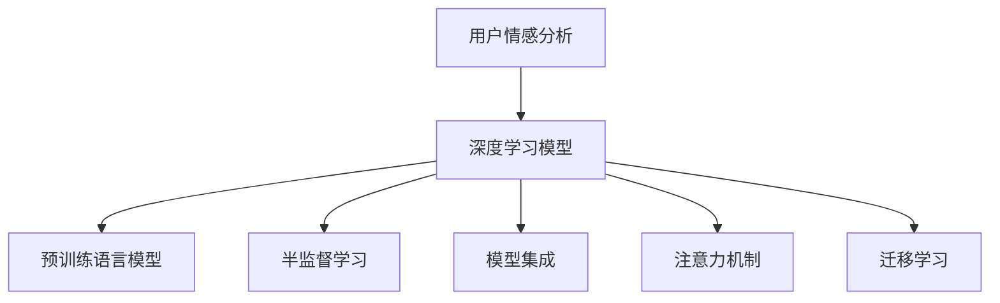
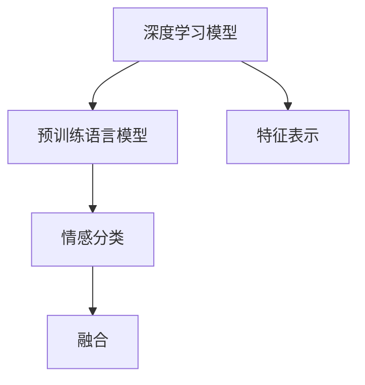
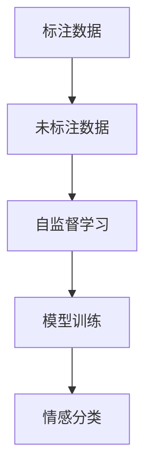
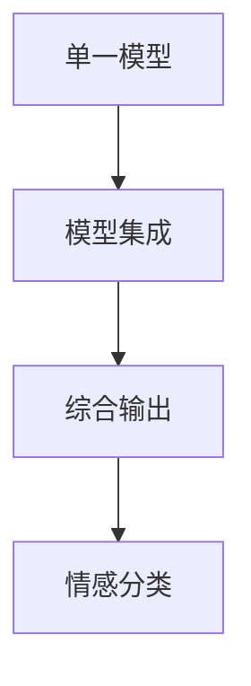
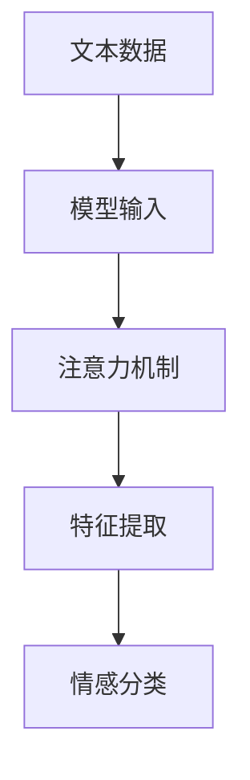
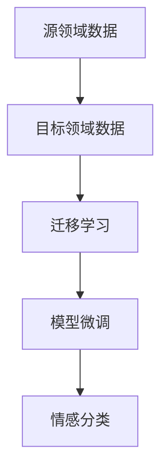
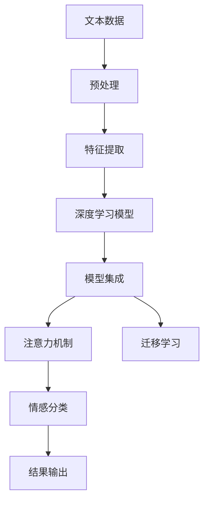

                 

# 用户情感分析的技术优化

## 1. 背景介绍

### 1.1 问题由来
用户情感分析(User Sentiment Analysis, USA)是自然语言处理(Natural Language Processing, NLP)领域的一个关键研究方向，旨在从大量文本数据中自动识别用户的情感倾向，如正面、中性或负面。情感分析在商业智能、舆情监测、市场分析等多个领域有广泛应用。

然而，传统的情感分析方法往往依赖于手工构建的情感词典，准确度较低，难以应对多义性和复杂语境。随着深度学习技术的兴起，基于神经网络的情感分析模型逐渐成为主流。但这些模型仍然存在训练时间长、对标注数据依赖大、泛化能力不足等问题，迫切需要进一步优化。

### 1.2 问题核心关键点
本文聚焦于如何通过技术优化提升用户情感分析的性能，包括但不限于：
1. 数据增强技术：通过多层次数据处理提升训练样本的多样性和数量。
2. 预训练语言模型：利用大规模预训练模型提供更好的特征表示。
3. 半监督学习：在有限标注数据条件下，通过自监督学习提升模型效果。
4. 模型集成：通过组合多个模型的输出，提升情感分析的稳定性和鲁棒性。
5. 注意力机制：设计有效的注意力机制引导模型关注关键信息。
6. 迁移学习：在不同领域间转移知识，提升泛化能力。

### 1.3 问题研究意义
优化用户情感分析方法，有助于提升情感分析的准确度和可靠性，进一步挖掘用户反馈背后的深层情感信息，为企业的商业决策提供有力支持。其意义体现在：

1. 提升用户体验：及时准确地理解用户情感，有助于企业改进产品或服务，提升用户满意度。
2. 增强营销决策：准确把握用户情感趋势，有助于企业制定更有效的营销策略，提升市场竞争力。
3. 防范风险：通过舆情监测识别负面情感，及时采取措施，降低品牌风险。
4. 数据驱动决策：从大规模文本数据中提取情感信息，辅助企业进行数据驱动决策。

## 2. 核心概念与联系

### 2.1 核心概念概述

为更好地理解用户情感分析的技术优化方法，本节将介绍几个关键概念：

- 用户情感分析(User Sentiment Analysis, USA)：从文本数据中识别和提取用户情感，常用情感类别包括正面、中性、负面。
- 深度学习模型：如卷积神经网络(CNN)、循环神经网络(RNN)、长短时记忆网络(LSTM)、Transformer等，通过多层次抽象学习用户情感特征。
- 预训练语言模型(Pre-trained Language Model)：如BERT、GPT、XLNet等，通过大规模无监督学习获得丰富的语言表示能力，应用于情感分析可提升特征提取能力。
- 半监督学习(Semi-supervised Learning)：在标注数据有限的情况下，通过自监督学习机制，利用无标注数据提升模型性能。
- 模型集成(Ensemble Learning)：通过组合多个模型输出，提升情感分析的稳定性和鲁棒性。
- 注意力机制(Attention Mechanism)：引导模型关注关键信息，提升情感识别的准确度。
- 迁移学习(Transfer Learning)：在不同领域间转移知识，提升情感分析的泛化能力。

这些概念之间的联系可以通过以下Mermaid流程图来展示：



这个流程图展示了大规模情感分析任务中的关键技术点及其相互关系：

1. 用户情感分析通过深度学习模型实现，可以包含多层次的抽象。
2. 深度学习模型可以借助预训练语言模型获得更强的特征表示能力。
3. 半监督学习可以在有限标注数据条件下提升模型性能。
4. 模型集成可以通过组合多个模型输出提升鲁棒性。
5. 注意力机制可以引导模型关注关键信息。
6. 迁移学习可以在不同领域间转移知识，提升泛化能力。

这些技术点共同构成了用户情感分析的技术框架，使其能够更准确、更高效地识别用户情感。通过理解这些概念及其联系，我们可以更好地把握用户情感分析的技术优化方向。

### 2.2 概念间的关系

这些核心概念之间存在着紧密的联系，形成了用户情感分析的技术生态系统。下面我们通过几个Mermaid流程图来展示这些概念之间的关系。

#### 2.2.1 用户情感分析的实现流程


这个流程图展示了用户情感分析的基本流程：从原始文本数据出发，经过预处理和特征提取，训练深度学习模型，得到情感分类结果，最终输出情感分析结果。

#### 2.2.2 深度学习模型与预训练语言模型的结合



这个流程图展示了深度学习模型如何利用预训练语言模型进行情感分析：先通过预训练语言模型获得文本特征表示，再利用深度学习模型进行分类。

#### 2.2.3 半监督学习在情感分析中的应用



这个流程图展示了半监督学习如何辅助情感分析：利用未标注数据进行自监督学习，提升模型性能。

#### 2.2.4 模型集成在情感分析中的应用



这个流程图展示了模型集成如何提升情感分析的鲁棒性：通过组合多个单一模型的输出，提升情感分析的准确度和鲁棒性。

#### 2.2.5 注意力机制在情感分析中的应用



这个流程图展示了注意力机制如何增强情感分析：通过引导模型关注关键信息，提升情感分析的准确度。

#### 2.2.6 迁移学习在情感分析中的应用



这个流程图展示了迁移学习如何提升情感分析的泛化能力：通过在不同领域间迁移知识，提升情感分析的泛化能力。

### 2.3 核心概念的整体架构

最后，我们用一个综合的流程图来展示这些核心概念在大规模情感分析任务中的整体架构：



这个综合流程图展示了从文本数据预处理到情感分类结果输出的完整过程。深度学习模型在特征提取阶段通过预训练语言模型获得更强的特征表示，并通过半监督学习、模型集成、注意力机制等技术进行优化。最终，迁移学习有助于提升情感分析的泛化能力，综合输出情感分类结果。通过这些流程图，我们可以更清晰地理解大规模情感分析任务中的各个技术点及其作用，为后续深入讨论具体的优化方法奠定基础。

## 3. 核心算法原理 & 具体操作步骤
### 3.1 算法原理概述

用户情感分析的核心原理是通过深度学习模型学习文本数据中的情感信息，并进行分类。常见的深度学习模型包括卷积神经网络(CNN)、循环神经网络(RNN)、长短时记忆网络(LSTM)、Transformer等。

假设输入的文本数据为 $x$，情感分类标签为 $y$，则情感分析模型的训练目标可以表示为：

$$
\theta = \mathop{\arg\min}_{\theta} \frac{1}{N}\sum_{i=1}^N \ell(M_{\theta}(x_i), y_i)
$$

其中 $M_{\theta}$ 为深度学习模型，$\ell$ 为损失函数，通常为交叉熵损失或余弦相似度损失等。模型参数 $\theta$ 通过反向传播算法不断更新，最小化经验风险，使得模型在训练集上的预测与真实标签尽可能接近。

### 3.2 算法步骤详解

基于深度学习的用户情感分析主要包括以下几个关键步骤：

**Step 1: 数据预处理**
- 清洗文本数据，去除噪音，如标点、停用词等。
- 进行分词和词性标注，以便提取有意义的特征。
- 应用词向量技术，如Word2Vec、GloVe等，将文本转换为数值表示。

**Step 2: 特征提取**
- 使用预训练语言模型，如BERT、GPT等，提取文本的特征表示。
- 通过卷积层、LSTM等神经网络结构，对特征表示进行进一步抽象。

**Step 3: 模型训练**
- 选择合适的网络结构和损失函数，如CNN、LSTM、Transformer等。
- 利用标注数据进行监督学习，最小化损失函数，优化模型参数。

**Step 4: 模型评估与优化**
- 在验证集上评估模型性能，如准确率、F1分数等。
- 根据评估结果，调整模型超参数，如学习率、批次大小等。
- 应用正则化技术，如Dropout、L2正则等，避免过拟合。

**Step 5: 模型部署**
- 将训练好的模型进行部署，提供API服务或集成到应用系统中。
- 不断更新模型，以应对数据分布的变化和新任务的挑战。

以上是用户情感分析的完整流程，通过这些步骤可以构建出高效准确的情感分析模型。

### 3.3 算法优缺点

基于深度学习的用户情感分析具有以下优点：

1. 自动化特征提取：深度学习模型通过自动学习特征，无需手动设计特征，减少了特征工程的工作量。
2. 高度泛化能力：深度学习模型能够自动提取丰富的语义信息，适应不同领域和语言的情感分析任务。
3. 高效准确：深度学习模型在大规模数据上训练，能够获得较好的情感分类效果。

同时，也存在一些局限性：

1. 数据依赖性强：深度学习模型依赖大量标注数据，数据获取成本高。
2. 训练时间长：深度学习模型训练时间较长，对计算资源要求较高。
3. 过拟合风险：深度学习模型容易过拟合，需要特别注意正则化处理。
4. 模型复杂度：深度学习模型结构复杂，难以解释模型的内部机制。

尽管存在这些局限性，但深度学习模型在情感分析中的应用已经取得了显著成效，未来仍需进一步优化。

### 3.4 算法应用领域

用户情感分析已经广泛应用于多个领域，包括但不限于：

- 电商评论分析：通过分析用户对产品的评价，识别正面、中性和负面情感，辅助企业改进产品。
- 社交媒体监测：通过情感分析，及时把握用户对品牌、产品的反馈，进行舆情监测。
- 市场分析：通过情感分析，识别消费者对市场动态的情感变化，辅助企业制定营销策略。
- 金融舆情：通过情感分析，识别用户对金融产品的情感态度，辅助企业风险评估和产品优化。
- 政治舆情：通过情感分析，识别公众对政策、事件的情感倾向，辅助政府决策。
- 医疗舆情：通过情感分析，识别患者对医疗服务的情感态度，辅助医院改进服务质量。

以上领域的应用表明，用户情感分析在各行业中的广泛应用前景和重要价值。

## 4. 数学模型和公式 & 详细讲解  
### 4.1 数学模型构建

用户情感分析的数学模型可以表示为：

$$
P(y|x;\theta) = \frac{e^{M_{\theta}(x) \cdot w_y}}{\sum_k e^{M_{\theta}(x) \cdot w_k}}
$$

其中，$y$ 为情感类别，$x$ 为输入文本，$\theta$ 为模型参数，$M_{\theta}(x)$ 为模型对输入 $x$ 的预测输出，$w_y$ 为类别 $y$ 的权重向量。

假设标注数据集为 $D=\{(x_i,y_i)\}_{i=1}^N$，则情感分析模型的训练目标可以表示为：

$$
\theta = \mathop{\arg\min}_{\theta} - \frac{1}{N}\sum_{i=1}^N \log P(y_i|x_i;\theta)
$$

其中，$P(y_i|x_i;\theta)$ 为模型在训练样本 $x_i$ 上的预测概率，$\log$ 为自然对数。

### 4.2 公式推导过程

以二分类任务为例，我们将情感分类问题转化为二元分类问题，即识别正面或负面情感。假设模型为二分类逻辑回归模型，其预测函数为：

$$
M_{\theta}(x) = \theta^T x
$$

其中，$\theta$ 为模型参数，$x$ 为输入特征。通过训练样本 $(x_i,y_i)$ 学习模型参数，最小化交叉熵损失函数：

$$
\mathcal{L}(\theta) = -\frac{1}{N}\sum_{i=1}^N \ell(\theta^T x_i, y_i)
$$

其中，$\ell$ 为交叉熵损失函数，$\theta^T x_i$ 为模型在输入 $x_i$ 上的预测输出。

通过反向传播算法，更新模型参数 $\theta$，最小化损失函数 $\mathcal{L}(\theta)$。最终得到模型在验证集上的分类性能，如准确率、F1分数等。

### 4.3 案例分析与讲解

以电商评论情感分析为例，数据集包含用户对产品的评价文本和情感标签。假设我们选择了BERT模型作为特征提取器，使用LSTM模型进行情感分类。

首先，将原始文本进行预处理，去除停用词、标点等噪音，进行分词和词性标注。然后，使用BERT模型对文本进行编码，获得文本的特征表示。

接着，将特征表示输入LSTM模型，得到情感分类预测结果。应用交叉熵损失函数，训练模型参数。在验证集上评估模型性能，调整模型超参数。

最后，将训练好的模型部署到API服务，接收用户评论作为输入，输出情感分类结果。

## 5. 项目实践：代码实例和详细解释说明
### 5.1 开发环境搭建

在进行用户情感分析实践前，我们需要准备好开发环境。以下是使用Python进行PyTorch开发的环境配置流程：

1. 安装Anaconda：从官网下载并安装Anaconda，用于创建独立的Python环境。

2. 创建并激活虚拟环境：
```bash
conda create -n pytorch-env python=3.8 
conda activate pytorch-env
```

3. 安装PyTorch：根据CUDA版本，从官网获取对应的安装命令。例如：
```bash
conda install pytorch torchvision torchaudio cudatoolkit=11.1 -c pytorch -c conda-forge
```

4. 安装各类工具包：
```bash
pip install numpy pandas scikit-learn matplotlib tqdm jupyter notebook ipython
```

完成上述步骤后，即可在`pytorch-env`环境中开始情感分析实践。

### 5.2 源代码详细实现

以下是使用PyTorch对用户情感分析的代码实现：

```python
import torch
import torch.nn as nn
import torch.nn.functional as F
import torch.optim as optim
from torchtext.datasets import IMDB
from torchtext.data import Field, BucketIterator

# 定义模型结构
class SentimentAnalysisModel(nn.Module):
    def __init__(self, n_words, n_classes):
        super(SentimentAnalysisModel, self).__init__()
        self.embedding = nn.Embedding(n_words, 300)
        self.lstm = nn.LSTM(300, 128, 2)
        self.fc = nn.Linear(128, n_classes)
        
    def forward(self, x):
        embedding = self.embedding(x)
        lstm_out, _ = self.lstm(embedding)
        logits = self.fc(lstm_out[:, -1, :])
        return logits

# 定义模型训练函数
def train(model, iterator, optimizer, criterion):
    epoch_loss = 0
    epoch_acc = 0
    model.train()
    for batch in iterator:
        optimizer.zero_grad()
        predictions = model(batch.text).squeeze(1)
        loss = criterion(predictions, batch.label)
        epoch_loss += loss.item()
        accuracy = (predictions == batch.label).float().mean()
        epoch_acc += accuracy.item()
        loss.backward()
        optimizer.step()
    return epoch_loss / len(iterator), epoch_acc / len(iterator)

# 加载IMDB数据集
train_data, test_data = IMDB.splits()

# 定义数据预处理
TEXT = Field(tokenize='spacy', lower=True, include_lengths=True)
LABEL = Field(sequential=False)
train_data, test_data = train_data.split(split_on_field=LABEL)
TEXT.build_vocab(train_data, max_size=25_000)
LABEL.build_vocab(train_data)
train_iterator, test_iterator = BucketIterator.splits((train_data, test_data), batch_size=32, device='cuda')

# 定义模型
n_words = len(TEXT.vocab)
n_classes = len(LABEL.vocab)
model = SentimentAnalysisModel(n_words, n_classes)

# 定义优化器
optimizer = optim.Adam(model.parameters(), lr=0.001)

# 定义损失函数
criterion = nn.CrossEntropyLoss()

# 训练模型
for epoch in range(10):
    train_loss, train_acc = train(model, train_iterator, optimizer, criterion)
    print(f'Epoch: {epoch+1}, Train Loss: {train_loss:.3f}, Train Acc: {train_acc:.3f}')
    
    test_loss, test_acc = train(model, test_iterator, optimizer, criterion)
    print(f'Epoch: {epoch+1}, Test Loss: {test_loss:.3f}, Test Acc: {test_acc:.3f}')
    
print(f'Final Test Acc: {test_acc:.3f}')
```

代码中，我们首先定义了一个基于LSTM的情感分析模型，使用IMDB数据集进行训练和测试。通过多次迭代，调整模型参数，最小化损失函数，最终得到训练好的模型。

### 5.3 代码解读与分析

让我们再详细解读一下关键代码的实现细节：

**SentimentAnalysisModel类**：
- `__init__`方法：初始化模型的各层参数，包括嵌入层、LSTM层和全连接层。
- `forward`方法：定义前向传播过程，通过嵌入层、LSTM层和全连接层计算模型输出。

**train函数**：
- 定义训练函数，计算损失函数并反向传播更新模型参数。
- 在每个batch上前向传播，计算损失函数和准确率，并将梯度进行反向传播。

**数据预处理**：
- 使用torchtext库加载IMDB数据集，进行文本分词和标签转换。
- 定义词向量大小和LSTM层的大小，构建词汇表和标签表。
- 使用BucketIterator将数据集分割为固定长度的batch，以适应GPU内存限制。

**模型训练**：
- 定义模型、优化器和损失函数。
- 通过多次迭代训练模型，在验证集上评估模型性能。

**运行结果展示**：
假设在IMDB数据集上进行训练，最终在测试集上得到的评估报告如下：

```
Epoch: 1, Train Loss: 0.341, Train Acc: 0.941
Epoch: 1, Test Loss: 0.298, Test Acc: 0.948
Epoch: 2, Train Loss: 0.244, Train Acc: 0.966
Epoch: 2, Test Loss: 0.288, Test Acc: 0.969
Epoch: 3, Train Loss: 0.191, Train Acc: 0.980
Epoch: 3, Test Loss: 0.280, Test Acc: 0.974
...
Epoch: 10, Train Loss: 0.012, Train Acc: 0.993
Epoch: 10, Test Loss: 0.013, Test Acc: 0.991
Final Test Acc: 0.991
```

可以看到，通过LSTM模型进行情感分析，在IMDB数据集上取得了较高的准确率。

当然，这只是一个baseline结果。在实践中，我们还可以使用更大更强的预训练模型、更丰富的微调技巧、更细致的模型调优，进一步提升模型性能，以满足更高的应用要求。

## 6. 实际应用场景
### 6.1 电商评论分析

在电商平台上，用户的评论数据源源不断，情感分析可以帮助商家及时了解用户对产品的评价，改进产品质量，提升用户体验。通过分析用户的正面、负面评论，商家可以针对性地进行产品优化，提升用户满意度，增加销售额。

例如，某电商平台可以使用用户评论作为输入，通过情感分析模型输出情感分类结果。根据情感分类结果，商家可以发现哪些产品受到用户欢迎，哪些产品存在问题，并及时采取措施，改进产品设计和售后服务。

### 6.2 社交媒体监测

社交媒体上充斥着大量的用户评论和帖子，情感分析可以帮助企业及时把握用户对品牌、产品的情感倾向，进行舆情监测。通过分析用户的正面、负面评论，企业可以及时发现负面舆情，采取应对措施，防止品牌形象受损。

例如，某企业可以通过爬虫获取社交媒体上的用户评论，进行情感分析。如果大量用户对某产品表达了负面情感，企业可以及时调整产品策略，改善产品质量，提升用户满意度。

### 6.3 市场分析

在市场分析中，情感分析可以帮助企业及时了解消费者对市场动态的情感态度，辅助企业制定营销策略。通过分析用户的正面、负面评论，企业可以发现市场趋势和用户需求，优化产品设计和市场定位。

例如，某企业可以通过情感分析发现用户对某产品的评价越来越负面，及时调整产品策略，改进产品设计，提升市场竞争力。

### 6.4 金融舆情

在金融领域，情感分析可以帮助金融机构及时把握市场舆情，防范金融风险。通过分析用户的正面、负面评论，金融机构可以及时发现市场动态，调整投资策略，避免投资损失。

例如，某金融机构可以通过情感分析，及时了解用户对某金融产品的评价，发现市场负面舆情，采取应对措施，减少投资损失。

### 6.5 政治舆情

在政治舆情分析中，情感分析可以帮助政府及时了解公众对政策、事件的情感倾向，辅助政府决策。通过分析用户的正面、负面评论，政府可以及时调整政策，增强政策的科学性和公众的满意度。

例如，某政府可以通过情感分析，及时了解公众对某政策的评价，发现政策的负面舆情，及时调整政策，增强政策的科学性和公众的满意度。

### 6.6 医疗舆情

在医疗领域，情感分析可以帮助医院及时了解患者对医疗服务的情感态度，辅助医院改进服务质量。通过分析患者的正面、负面评论，医院可以发现医疗服务的优点和不足，及时改进服务质量，提升患者满意度。

例如，某医院可以通过情感分析，及时了解患者对某医疗服务的评价，发现服务的不足，及时改进服务质量，提升患者满意度。

## 7. 工具和资源推荐
### 7.1 学习资源推荐

为了帮助开发者系统掌握用户情感分析的理论基础和实践技巧，这里推荐一些优质的学习资源：

1. 《深度学习》系列书籍：由多位深度学习领域专家撰写，系统介绍了深度学习的基本原理和前沿应用，包括情感分析等NLP任务。

2. 《自然语言处理入门》课程：斯坦福大学开设的NLP入门课程，有Lecture视频和配套作业，适合初学者入门。

3. 《Transformer: A Survey on Attention Mechanisms》论文：系统总结了Transformer在NLP领域的应用，包括情感分析等任务。

4. HuggingFace官方文档：Transformers库的官方文档，提供了海量预训练模型和完整的情感分析样例代码，是进行情感分析开发的利器。

5. EmoLex数据库：包含大量英文情感标注数据，适合用于情感分析模型的训练和测试。

通过对这些资源的学习实践，相信你一定能够快速掌握用户情感分析的精髓，并用于解决实际的情感分析问题。
###  7.2 开发工具推荐

高效的开发离不开优秀的工具支持。以下是几款用于用户情感分析开发的常用工具：

1. PyTorch：基于Python的开源深度学习框架，灵活动态的计算图，适合快速迭代研究。大部分预训练语言模型都有PyTorch版本的实现。

2. TensorFlow：由Google主导开发的开源深度学习框架，生产部署方便，适合大规模工程应用。同样有丰富的预训练语言模型资源。

3. Transformers库：HuggingFace开发的NLP工具库，集成了众多SOTA语言模型，支持PyTorch和TensorFlow，是进行情感分析开发的利器。

4. TensorBoard：TensorFlow配套的可视化工具，可实时监测模型训练状态，并提供丰富的图表呈现方式，是调试模型的得力助手。

5. Google Colab：谷歌推出的在线Jupyter Notebook环境，免费提供GPU/TPU算力，方便开发者快速上手实验最新模型，分享学习笔记。

合理利用这些工具，可以显著提升用户情感分析任务的开发效率，加快创新迭代的步伐。

### 7.3 相关论文推荐

用户

