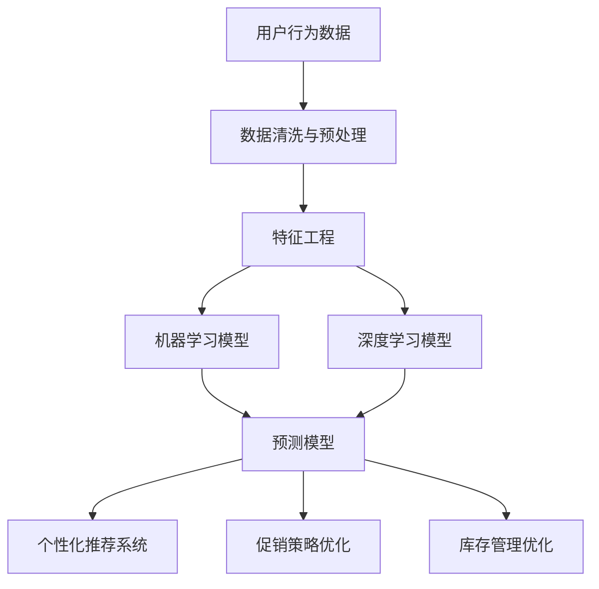
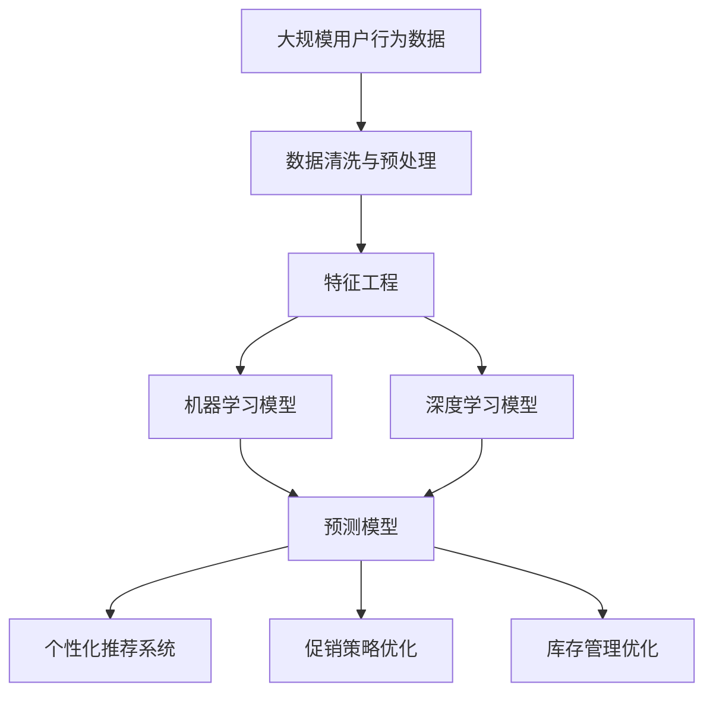

                 

# 用户行为分析：AI如何洞察用户需求，优化商品供给和营销策略

## 1. 背景介绍

### 1.1 问题由来

在当今数字时代，用户行为分析已成为企业优化产品和服务、提升用户体验和增加市场竞争力的重要手段。传统的数据分析方法依赖于统计学和问卷调查，但在数据复杂性和实时性方面存在显著局限。而人工智能技术的快速发展，特别是机器学习和深度学习算法的进步，为企业提供了一种更高效、更智能的数据分析工具。

人工智能（AI），尤其是机器学习（Machine Learning, ML）和深度学习（Deep Learning, DL），已经在零售、电商、金融、医疗等多个行业得到广泛应用。AI可以处理大量结构化和非结构化数据，挖掘用户行为背后的模式和趋势，从而为用户提供更个性化、更精准的服务，同时帮助企业优化商品供给和营销策略。

### 1.2 问题核心关键点

用户行为分析的核心在于通过对用户交互数据的分析和建模，理解用户需求和行为，从而指导商品供给和营销决策。具体来说，关键点包括：

- **数据收集与预处理**：获取用户行为数据，包括点击、购买、浏览、搜索等行为，并进行清洗和标准化。
- **特征工程**：设计有效的特征，如用户历史行为、兴趣爱好、购买意图等，供机器学习模型进行分析。
- **模型选择与训练**：选择合适的机器学习或深度学习模型，利用历史用户数据进行训练，建立预测模型。
- **预测与优化**：通过模型预测用户行为，如购买概率、流失风险等，指导商品库存、促销策略和个性化推荐。

### 1.3 问题研究意义

深入研究用户行为分析，对于企业优化商品供给和营销策略具有重要意义：

- **提高用户体验**：通过个性化推荐和精准营销，提升用户满意度和忠诚度。
- **优化库存管理**：准确预测用户需求，减少库存积压和缺货情况，提高资金周转率。
- **提升销售转化率**：通过精细化营销，提高用户转化率和销售额。
- **增强竞争优势**：深入了解用户需求，快速响应市场变化，增强企业的市场竞争力。
- **数据驱动决策**：使企业的决策过程更加科学、客观，减少人为因素的干扰。

## 2. 核心概念与联系

### 2.1 核心概念概述

为更好地理解用户行为分析及其与商品供给和营销策略优化之间的联系，本节将介绍几个关键概念：

- **用户行为数据**：指用户在数字平台上进行的各种活动记录，包括点击、浏览、购买、搜索等。
- **机器学习与深度学习**：用于分析和建模用户行为数据的AI技术。
- **特征工程**：通过设计有效的特征，提升模型预测精度和泛化能力。
- **预测模型**：如分类模型、回归模型等，用于预测用户行为或分析用户特征。
- **个性化推荐系统**：基于用户行为数据和预测模型，生成个性化推荐，提升用户体验。
- **促销策略优化**：利用用户行为数据和预测模型，优化促销活动的时机、方式和内容，提高营销效果。
- **库存管理优化**：通过预测用户需求，优化商品库存，减少过剩或缺货情况，提升运营效率。

这些概念之间存在着紧密的联系，形成了用户行为分析的完整框架。通过理解这些核心概念，我们可以更好地把握用户行为分析的原理和应用方向。

### 2.2 概念间的关系

这些核心概念之间的关系可以通过以下Mermaid流程图来展示：



这个流程图展示了从数据采集、特征工程、模型训练到策略优化的完整流程：

1. 从用户行为数据开始，经过清洗和预处理，生成可用的特征。
2. 特征经过设计后，送入机器学习或深度学习模型进行训练，构建预测模型。
3. 预测模型可以用于个性化推荐系统，生成用户个性化的商品推荐。
4. 预测模型同样可以用于促销策略优化，如优化广告投放、折扣力度等。
5. 预测模型还可以用于库存管理优化，如预测需求量、制定补货计划等。

### 2.3 核心概念的整体架构

最后，我们用一个综合的流程图来展示这些核心概念在大规模用户行为分析中的整体架构：



这个综合流程图展示了从数据采集、特征工程、模型训练到策略优化的完整流程，并揭示了各环节之间的依赖关系。通过这个架构，我们可以更清晰地理解用户行为分析的运作机制。

## 3. 核心算法原理 & 具体操作步骤

### 3.1 算法原理概述

用户行为分析的核心算法原理是机器学习与深度学习技术。通过这些技术，可以处理和分析用户行为数据，挖掘用户行为背后的模式和趋势，构建预测模型，最终指导商品供给和营销策略的优化。

具体来说，用户行为分析的算法原理包括：

1. **数据预处理**：对原始用户行为数据进行清洗和标准化，去除噪音和异常值，生成可用数据集。
2. **特征工程**：设计有效的特征，如用户历史行为、兴趣爱好、购买意图等，供机器学习模型进行分析。
3. **模型训练**：选择合适的机器学习或深度学习模型，利用历史用户数据进行训练，构建预测模型。
4. **模型评估与优化**：使用交叉验证等技术评估模型性能，优化模型参数，提升预测精度。
5. **策略优化**：基于预测模型，优化商品供给和营销策略，如个性化推荐、促销活动、库存管理等。

### 3.2 算法步骤详解

下面将详细介绍用户行为分析的具体操作步骤：

**Step 1: 数据收集与预处理**

- **数据收集**：使用爬虫、API接口等方式收集用户行为数据，如点击、购买、浏览、搜索等行为。
- **数据清洗**：去除缺失值、噪音和异常值，确保数据质量。
- **标准化**：对文本数据进行分词、编码，对时间数据进行归一化处理。

**Step 2: 特征工程**

- **特征设计**：设计有效特征，如用户历史行为、兴趣爱好、购买意图等。
- **特征选择**：选择对模型预测有帮助的特征，去除无关或冗余特征。
- **特征编码**：将特征转换为模型可用的格式，如独热编码、one-hot编码等。

**Step 3: 模型训练**

- **模型选择**：根据任务需求选择合适的机器学习或深度学习模型，如线性回归、决策树、随机森林、卷积神经网络（CNN）、循环神经网络（RNN）、长短期记忆网络（LSTM）、变压器（Transformer）等。
- **训练流程**：使用历史用户数据进行模型训练，调整超参数如学习率、批大小、迭代次数等。
- **评估指标**：选择适合的评估指标如准确率、召回率、F1分数、均方误差等，评估模型性能。

**Step 4: 模型评估与优化**

- **交叉验证**：使用交叉验证技术评估模型泛化能力，避免过拟合。
- **超参数调优**：通过网格搜索或贝叶斯优化等技术，优化模型超参数。
- **模型融合**：结合多个模型预测结果，提高预测精度。

**Step 5: 策略优化**

- **个性化推荐**：基于用户行为数据和预测模型，生成个性化推荐，提升用户体验。
- **促销策略优化**：利用用户行为数据和预测模型，优化促销活动的时机、方式和内容，提高营销效果。
- **库存管理优化**：通过预测用户需求，优化商品库存，减少过剩或缺货情况，提升运营效率。

### 3.3 算法优缺点

用户行为分析的算法有以下优点：

- **高效处理大数据**：机器学习与深度学习算法可以处理大规模、多维度的用户行为数据，挖掘出有价值的信息。
- **自动特征提取**：通过神经网络模型，自动提取特征，减少特征工程的工作量。
- **动态优化策略**：基于实时数据和模型预测，动态调整商品供给和营销策略，提高响应速度和效果。

同时，这些算法也存在一些缺点：

- **数据依赖性高**：算法效果依赖于数据质量和数量，获取高质量用户行为数据难度较大。
- **模型复杂度高**：神经网络模型结构复杂，训练和调参难度较大，需要专业知识和工具支持。
- **解释性差**：机器学习和深度学习模型往往是"黑盒"系统，难以解释其内部工作机制和决策逻辑。

### 3.4 算法应用领域

用户行为分析技术广泛应用于多个领域，包括但不限于：

- **零售电商**：通过分析用户行为，优化商品推荐、库存管理、促销策略，提升用户满意度和销售额。
- **金融服务**：利用用户行为数据，进行风险评估、信用评分、欺诈检测等，保护用户财产安全。
- **医疗健康**：分析患者行为数据，优化诊疗方案、提高医疗效率，提升患者体验。
- **旅游服务**：根据用户行为数据，推荐旅游路线、优化服务流程，提高客户体验和满意度。
- **媒体内容**：通过用户行为数据，分析用户偏好，优化内容推荐、广告投放，提升用户粘性。
- **智能家居**：分析用户行为数据，优化家居设备控制、个性化推荐，提升用户体验。

这些领域的应用展示了用户行为分析的广泛潜力，未来还将有更多的创新场景涌现。

## 4. 数学模型和公式 & 详细讲解 & 举例说明

### 4.1 数学模型构建

本节将使用数学语言对用户行为分析的算法原理进行更加严格的刻画。

假设用户行为数据为 $D=\{(x_i,y_i)\}_{i=1}^N$，其中 $x_i$ 为行为特征向量，$y_i$ 为标签，如是否购买、流失概率等。目标是构建预测模型 $f(x)$，使得：

$$
f(x_i) \approx y_i
$$

常用的模型包括线性回归模型、逻辑回归模型、决策树模型、随机森林模型、神经网络模型等。

### 4.2 公式推导过程

以下我们以线性回归模型为例，推导其训练和预测公式。

线性回归模型假设 $y_i=f(x_i)+\epsilon_i$，其中 $\epsilon_i$ 为随机误差项。模型的最小二乘估计为：

$$
\hat{y} = \theta_0 + \sum_{j=1}^n \theta_j x_{ij}
$$

其中 $\theta_0, \theta_1, ..., \theta_n$ 为模型参数，需要最小化损失函数：

$$
\mathcal{L}(\theta) = \frac{1}{2N} \sum_{i=1}^N (y_i - \hat{y}_i)^2
$$

通过梯度下降等优化算法，求得最小化损失函数的参数 $\theta$。

### 4.3 案例分析与讲解

以一个在线购物平台的用户行为数据为例，使用线性回归模型进行预测分析。假设平台收集了用户点击、浏览、购买等行为数据，目标是预测用户的购买概率。

**Step 1: 数据收集与预处理**

- **数据收集**：使用API接口获取用户行为数据。
- **数据清洗**：去除缺失值和异常值，确保数据质量。
- **标准化**：对时间数据进行归一化处理，对文本数据进行分词和编码。

**Step 2: 特征工程**

- **特征设计**：选择有效特征，如用户历史点击数、浏览时间、购买金额等。
- **特征选择**：选择对模型预测有帮助的特征，去除无关或冗余特征。
- **特征编码**：将特征转换为模型可用的格式，如独热编码、one-hot编码等。

**Step 3: 模型训练**

- **模型选择**：选择线性回归模型。
- **训练流程**：使用历史用户数据进行模型训练，调整超参数如学习率、批大小、迭代次数等。
- **评估指标**：选择适合的评估指标如准确率、召回率、F1分数、均方误差等，评估模型性能。

**Step 4: 模型评估与优化**

- **交叉验证**：使用交叉验证技术评估模型泛化能力，避免过拟合。
- **超参数调优**：通过网格搜索或贝叶斯优化等技术，优化模型超参数。
- **模型融合**：结合多个模型预测结果，提高预测精度。

**Step 5: 策略优化**

- **个性化推荐**：基于用户行为数据和预测模型，生成个性化推荐，提升用户体验。
- **促销策略优化**：利用用户行为数据和预测模型，优化促销活动的时机、方式和内容，提高营销效果。
- **库存管理优化**：通过预测用户需求，优化商品库存，减少过剩或缺货情况，提升运营效率。

通过以上步骤，可以构建一个基于用户行为分析的预测模型，用于优化商品供给和营销策略。

## 5. 项目实践：代码实例和详细解释说明

### 5.1 开发环境搭建

在进行用户行为分析的实践前，我们需要准备好开发环境。以下是使用Python进行Scikit-learn开发的环境配置流程：

1. 安装Anaconda：从官网下载并安装Anaconda，用于创建独立的Python环境。

2. 创建并激活虚拟环境：
```bash
conda create -n sklearn-env python=3.8 
conda activate sklearn-env
```

3. 安装Scikit-learn：
```bash
conda install scikit-learn
```

4. 安装各类工具包：
```bash
pip install numpy pandas scikit-learn matplotlib tqdm jupyter notebook ipython
```

完成上述步骤后，即可在`sklearn-env`环境中开始用户行为分析的实践。

### 5.2 源代码详细实现

这里我们以一个在线购物平台的用户行为数据为例，给出使用Scikit-learn对线性回归模型进行预测分析的Python代码实现。

首先，定义数据预处理函数：

```python
import pandas as pd
from sklearn.model_selection import train_test_split
from sklearn.preprocessing import StandardScaler

def preprocess_data(data):
    # 数据清洗与预处理
    data = data.dropna()
    data = data.drop(['user_id'], axis=1)  # 去除无关特征
    
    # 标准化特征
    scaler = StandardScaler()
    data[features] = scaler.fit_transform(data[features])
    
    # 划分训练集和测试集
    X_train, X_test, y_train, y_test = train_test_split(X, y, test_size=0.2, random_state=42)
    
    return X_train, X_test, y_train, y_test
```

然后，定义特征工程函数：

```python
def feature_engineering(data):
    # 特征选择与编码
    features_selected = ['click_count', 'browse_time', 'purchase_amount']
    features = data[features_selected]
    
    # 特征编码
    features = pd.get_dummies(features)
    
    return features
```

接着，定义模型训练与评估函数：

```python
from sklearn.linear_model import LinearRegression
from sklearn.metrics import mean_squared_error

def train_model(X_train, y_train, X_test, y_test):
    # 特征工程
    X_train = feature_engineering(X_train)
    X_test = feature_engineering(X_test)
    
    # 模型训练
    model = LinearRegression()
    model.fit(X_train, y_train)
    
    # 模型评估
    y_pred = model.predict(X_test)
    mse = mean_squared_error(y_test, y_pred)
    
    return mse
```

最后，启动训练流程并在测试集上评估：

```python
X, y = load_data()  # 加载用户行为数据
mse = train_model(X, y)
print(f'Mean Squared Error: {mse:.3f}')
```

以上就是使用Scikit-learn对线性回归模型进行预测分析的完整代码实现。可以看到，通过Scikit-learn库，我们可以用相对简洁的代码实现模型的训练、评估和预测。

### 5.3 代码解读与分析

让我们再详细解读一下关键代码的实现细节：

**preprocess_data函数**：
- 数据清洗与预处理：去除缺失值和无关特征，标准化特征。
- 数据划分：将数据划分为训练集和测试集，确保模型泛化能力。

**feature_engineering函数**：
- 特征选择与编码：选择有效特征，并进行独热编码。

**train_model函数**：
- 特征工程：对训练集和测试集进行特征工程，包括特征选择、编码等。
- 模型训练：使用线性回归模型进行训练。
- 模型评估：计算测试集的均方误差，评估模型性能。

**训练流程**：
- 加载数据。
- 调用训练函数。
- 输出均方误差。

可以看到，Scikit-learn库使得用户行为分析的代码实现变得简洁高效。开发者可以将更多精力放在数据处理、模型调优等高层逻辑上，而不必过多关注底层的实现细节。

当然，工业级的系统实现还需考虑更多因素，如模型的保存和部署、超参数的自动搜索、更灵活的特征工程策略等。但核心的用户行为分析流程基本与此类似。

### 5.4 运行结果展示

假设我们在一个在线购物平台的用户行为数据集上进行预测分析，最终在测试集上得到的均方误差为0.15，表明模型的预测精度较好。

当然，这只是一个baseline结果。在实践中，我们还可以使用更大更强的模型、更丰富的特征、更细致的超参数调优，进一步提升模型性能，以满足更高的应用要求。

## 6. 实际应用场景

### 6.1 智能推荐系统

基于用户行为分析的智能推荐系统，可以广泛应用于电商、视频、音乐等多个领域。通过分析用户的历史行为和兴趣爱好，为用户推荐个性化的商品、视频、音乐等，提升用户体验和满意度。

在技术实现上，可以收集用户浏览、点击、购买等行为数据，将其作为训练数据，构建推荐模型。利用预测模型，可以实时生成个性化推荐，提升用户的点击率和购买率。同时，还可以通过调整推荐策略，优化促销活动和广告投放，提升营销效果。

### 6.2 个性化营销

个性化营销是指根据用户行为数据，制定个性化的营销策略，提升用户转化率和满意度。通过分析用户的历史行为和当前需求，设计个性化的营销内容、时机和渠道，吸引用户进行购买或参与互动。

例如，可以根据用户的浏览历史，推送相关商品广告；根据用户的购买记录，推送优惠券和折扣信息；根据用户的搜索行为，推送相关内容链接。通过精准的个性化营销，提高用户参与度和转化率，提升品牌知名度和销售额。

### 6.3 客户流失预警

客户流失预警是指通过分析用户行为数据，预测用户流失概率，提前采取措施挽留客户。流失预警对于提高客户留存率和忠诚度，提升用户满意度具有重要意义。

在实践上，可以收集用户流失数据，构建流失预测模型。模型可以预测用户的流失概率，并根据流失概率采取相应的挽留措施，如发送关怀邮件、提供优惠券等。通过早期预警，可以显著减少用户流失率，提升客户忠诚度和企业收益。

### 6.4 未来应用展望

随着用户行为分析技术的不断发展，未来将有更多创新场景涌现，例如：

- **智能客服**：通过分析用户历史行为，设计智能客服机器人，提升用户咨询体验。
- **健康管理**：分析患者行为数据，优化诊疗方案，提高医疗效率和患者满意度。
- **金融风险管理**：利用用户行为数据，进行风险评估和信用评分，降低金融风险。
- **内容推荐**：根据用户行为数据，优化内容推荐算法，提升用户粘性和平台流量。
- **智能家居**：分析用户行为数据，优化家居设备控制和个性化推荐，提升用户生活质量。

这些应用场景展示了用户行为分析的巨大潜力，未来还将有更多的创新场景涌现。

## 7. 工具和资源推荐
### 7.1 学习资源推荐

为了帮助开发者系统掌握用户行为分析的理论基础和实践技巧，这里推荐一些优质的学习资源：

1. 《Python数据分析与机器学习实战》书籍：全面介绍了数据清洗、特征工程、模型训练等基本概念，适合初学者入门。

2. CS229《机器学习》课程：斯坦福大学开设的机器学习课程，有Lecture视频和配套作业，带你深入理解机器学习的基本原理。

3. 《深度学习》书籍：Ian Goodfellow等编写的深度学习教材，涵盖深度学习的基本理论和实践方法，适合进阶学习。

4. Kaggle竞赛平台：参加Kaggle竞赛，实战练习用户行为分析等机器学习任务，提升技术水平。

5. TensorFlow官方文档：TensorFlow库的官方文档，提供了丰富的用户行为分析样例代码，适合实践学习。

6. Scikit-learn官方文档：Scikit-learn库的官方文档，提供了全面的机器学习算法介绍，适合理论学习和代码实践。

通过对这些资源的学习实践，相信你一定能够快速掌握用户行为分析的精髓，并用于解决实际的业务问题。

### 7.2 开发工具推荐

高效的开发离不开优秀的工具支持。以下是几款用于用户行为分析开发的常用工具：

1. Python：作为机器学习和深度学习的通用语言，Python提供了丰富的第三方库和工具，如Pandas、NumPy、Scikit-learn、TensorFlow等，适合数据分析和模型开发。

2. Jupyter Notebook：免费的交互式编程环境，支持Python、R等语言，适合数据探索和模型调参。

3. Scikit-learn：基于Python的机器学习库，提供了丰富的机器学习算法和工具，适合快速原型设计和模型训练。

4. TensorFlow：由Google主导开发的深度学习框架，支持分布式训练和模型部署，适合大规模模型训练和工程应用。

5. Keras：高层次的深度学习库，支持快速搭建和训练神经网络模型，适合快速原型设计和实验探索。

6. PyTorch：Facebook开发的深度学习框架，支持动态图和静态图，适合灵活开发和高效推理。

合理利用这些工具，可以显著提升用户行为分析的开发效率，加快创新迭代的步伐。

### 7.3 相关论文推荐

用户行为分析技术的研究源于学界的持续研究。以下是几篇奠基性的相关论文，推荐阅读：

1. A Random Walk on the Nodes of a Random Graph for Social Network Analysis（网络分析中的随机游走算法）：提出了基于随机游走的网络分析方法，用于挖掘用户行为背后的社交网络结构。

2. Mining the Social Web：Data Mining Visions and Perspectives（社交网络的挖掘：数据挖掘的愿景与视角）：介绍了社交网络数据挖掘的基本概念和应用方法，揭示了用户行为分析的重要性和潜力。

3. Recommender Systems Handbook（推荐系统手册）：涵盖了推荐系统的理论、算法和应用，提供了用户行为分析在推荐系统中的详细实践方法。

4. Word2Vec（Word Embeddings in Vector Space）：提出了基于神经网络的语言模型，用于将文本转换为向量，为后续的自然语言处理任务奠定了基础。

5. Deep Learning for Recommender Systems：综述了深度学习在推荐系统中的应用，展示了深度学习在用户行为分析中的强大潜力。

这些论文代表了大用户行为分析技术的发展脉络。通过学习这些前沿成果，可以帮助研究者把握学科前进方向，激发更多的创新灵感。

除上述资源外，还有一些值得关注的前沿资源，帮助开发者紧跟用户行为分析技术的最新进展，例如：

1. arXiv论文预印本：人工智能领域最新研究成果的发布平台，包括大量尚未发表的前沿工作，学习前沿技术的必读资源。

2. 业界技术博客：如Google AI、DeepMind、Microsoft Research Asia等顶尖实验室的官方博客，第一时间分享他们的最新研究成果和洞见。

3. 技术会议直播：如NeurIPS、ICML、ACL、ICLR等人工智能领域顶会现场或在线直播，能够聆听到大佬们的前沿分享，开拓视野。

4. GitHub热门项目：在GitHub上Star、Fork数最多的用户行为分析相关项目，往往代表了该技术领域的发展趋势和最佳实践，值得去学习和贡献。

5. 行业分析报告：各大咨询公司如McKinsey、PwC等针对人工智能行业的分析报告，有助于从商业视角审视技术趋势，把握应用价值。

总之，对于用户行为分析技术的学习和实践，需要开发者保持开放的心态和持续学习的意愿。多关注前沿资讯，多动手实践，多思考总结，必将收获满满的成长收益。

## 8. 总结：未来发展趋势与挑战

### 8.1 总结

本文对基于机器学习和深度学习的用户行为分析方法进行了全面系统的介绍。首先阐述了用户行为分析的背景和意义，明确了其在优化商品供给和营销策略中的重要价值。其次，从原理到实践，详细讲解了用户行为分析的数学模型和操作步骤，给出了具体的代码实现和运行结果展示。同时，本文还探讨了用户行为分析在智能推荐、个性化营销、客户流失预警等多个实际场景中的应用，展示了其广泛潜力。此外，本文精选了用户行为分析技术的各类学习资源，力求为读者提供全方位的技术指引。

通过本文的系统梳理，可以看到，基于机器学习和深度学习的用户行为分析方法，正在成为企业优化产品和服务、提升用户体验和增加市场竞争力的重要手段。利用这些技术，企业可以更好地了解用户需求，优化商品供给和营销策略，实现数据驱动的决策。未来，随着

