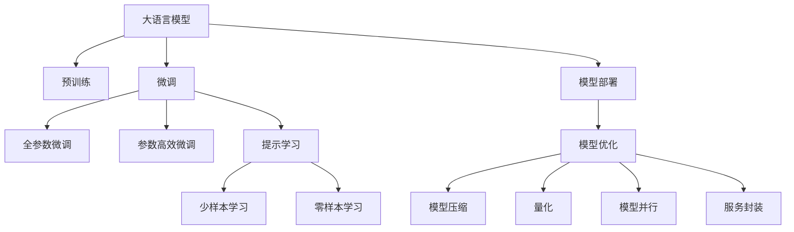
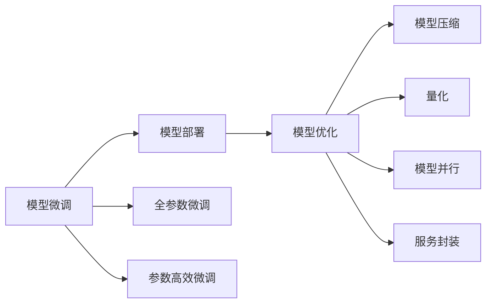
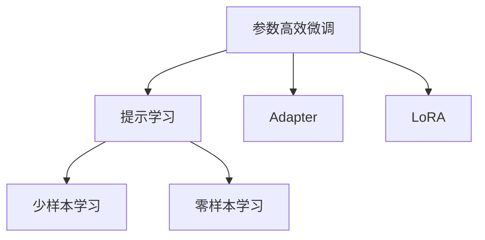
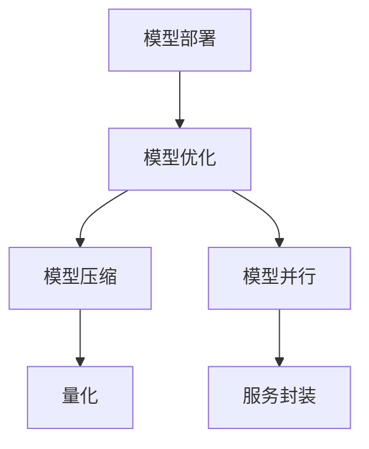
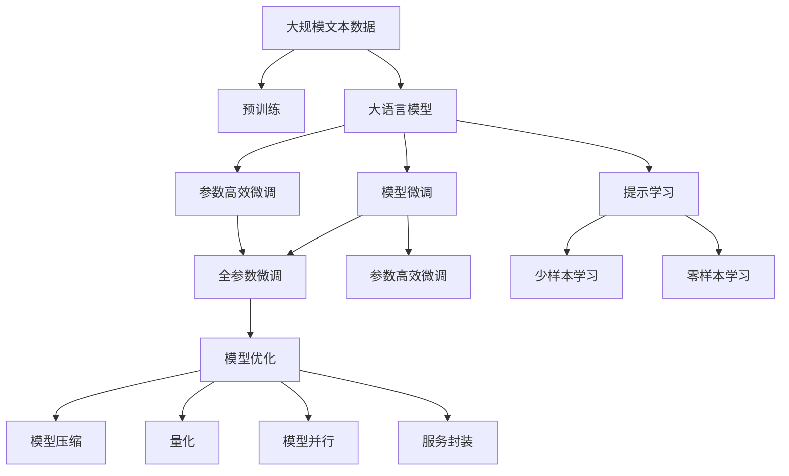

                 

# 用起来才是关键：大模型的应用

> 关键词：大模型,模型微调,参数高效微调,提示学习,模型部署,实际应用

## 1. 背景介绍

### 1.1 问题由来

近年来，深度学习技术在人工智能领域的快速发展，尤其是大规模预训练语言模型（Large Language Models, LLMs）的兴起，为自然语言处理（NLP）带来了巨大的突破。这些大模型通过在海量无标签文本数据上进行预训练，学习了丰富的语言知识和常识，从而具有强大的语言理解和生成能力。然而，尽管大模型的预训练能力极为强大，但在实际应用中却面临诸多挑战，使得它们的优势难以完全发挥。

### 1.2 问题核心关键点

大模型在实际应用中的核心挑战主要体现在以下几个方面：

1. **模型泛化能力**：大模型虽然在大规模数据上表现优异，但在特定领域或小数据集上的泛化能力可能不足，需要进一步微调以适应具体任务。
2. **模型效率**：大模型通常参数量庞大，对计算资源和内存的要求较高，实际部署时需要考虑模型压缩和优化。
3. **模型解释性**：大模型往往是"黑盒"模型，缺乏可解释性，难以满足医疗、金融等领域对模型输出可解释性的高要求。
4. **模型鲁棒性**：大模型面对噪声数据和对抗样本时，可能会产生不稳定或有害的输出，需要进一步加强模型的鲁棒性。
5. **模型可维护性**：大模型在实际应用中，需要持续更新和维护，以适应数据分布的变化和应用需求的变化。

这些挑战使得大模型在实际应用中面临着广泛的讨论和探索。本文将系统性地介绍大模型在实际应用中的使用方法，包括模型微调、参数高效微调、提示学习、模型部署等关键技术，以期为开发者提供全面的应用指导。

### 1.3 问题研究意义

大模型的应用不仅仅限于其强大的预训练能力，更在于其在实际问题解决中的广泛适用性。通过大模型的微调，可以在特定任务上进一步优化模型性能，提升模型的实用性，加速NLP技术在各个领域的应用进程。然而，尽管大模型在理论上具有显著优势，但在实际应用中仍需解决诸多技术难题。因此，研究大模型的应用方法和策略，对于提升其落地应用能力，推动NLP技术的产业化进程，具有重要意义：

1. **降低应用开发成本**：基于大模型的微调可以在一定程度上减少从头开发所需的数据、计算和人力成本，加速模型训练和应用部署。
2. **提升模型效果**：通过微调，大模型可以在特定任务上获得更好的性能，满足实际应用的高要求。
3. **加速开发进度**：大模型的微调范式使得模型适配任务的过程更为迅速，减少开发周期。
4. **促进技术创新**：微调范式促进了对预训练-微调的深入研究，催生了诸如提示学习、少样本学习等新的研究方向。
5. **赋能产业升级**：微调方法使得NLP技术更容易被各行各业所采用，为传统行业数字化转型提供新的技术路径。

本文将系统性地介绍大模型的应用方法，涵盖模型微调、参数高效微调、提示学习、模型部署等关键技术，为NLP开发者提供全面的应用指导，帮助他们在大模型的应用过程中克服挑战，充分发挥其潜力。

## 2. 核心概念与联系

### 2.1 核心概念概述

为更好地理解大模型的应用方法，本节将介绍几个密切相关的核心概念：

- **大语言模型(Large Language Model, LLM)**：指以自回归（如GPT）或自编码（如BERT）模型为代表的预训练语言模型。通过在海量无标签文本数据上进行预训练，学习通用的语言表示，具备强大的语言理解和生成能力。

- **模型微调(Fine-Tuning)**：指在预训练模型的基础上，使用下游任务的少量标注数据，通过有监督学习优化模型在特定任务上的性能。通常只调整顶层分类器或解码器，并以较小的学习率更新全部或部分的模型参数。

- **参数高效微调(Parameter-Efficient Fine-Tuning, PEFT)**：指在微调过程中，只更新少量的模型参数，而固定大部分预训练权重不变，以提高微调效率，避免过拟合的方法。

- **提示学习(Prompt Learning)**：通过在输入文本中添加提示模板（Prompt Template），引导大模型进行特定任务的推理和生成。可以在不更新模型参数的情况下，实现零样本或少样本学习。

- **少样本学习(Few-shot Learning)**：指在只有少量标注样本的情况下，模型能够快速适应新任务的学习方法。在大语言模型中，通常通过在输入中提供少量示例来实现，无需更新模型参数。

- **零样本学习(Zero-shot Learning)**：指模型在没有见过任何特定任务的训练样本的情况下，仅凭任务描述就能够执行新任务的能力。大语言模型通过预训练获得的广泛知识，使其能够理解任务指令并生成相应输出。

- **模型部署(模型部署)**：将训练好的模型部署到实际应用系统中，进行推理预测的过程。模型部署通常包括模型优化、模型压缩、服务封装等技术。

- **模型优化(Optimization)**：指在模型部署前，对模型进行优化，包括模型压缩、量化、模型并行等技术，以适应实际应用中的硬件资源限制。

这些核心概念之间的逻辑关系可以通过以下Mermaid流程图来展示：



这个流程图展示了大语言模型的核心概念及其之间的关系：

1. 大语言模型通过预训练获得基础能力。
2. 微调是对预训练模型进行任务特定的优化，可以分为全参数微调和参数高效微调两种方式。
3. 提示学习是一种不更新模型参数的方法，可以实现零样本和少样本学习。
4. 模型部署是将模型应用于实际应用系统的过程，通常包括模型优化、模型压缩、服务封装等技术。
5. 模型优化旨在提高模型的推理速度和资源利用效率，使模型能够在实际应用中更好地发挥作用。

### 2.2 概念间的关系

这些核心概念之间存在着紧密的联系，形成了大语言模型的应用框架。下面我们通过几个Mermaid流程图来展示这些概念之间的关系。

#### 2.2.1 模型微调和模型部署的关系



这个流程图展示了模型微调和模型部署之间的关系。模型微调是模型部署的前置步骤，通过微调优化模型性能，使模型更加适应特定任务。模型部署则涉及模型的优化、压缩、服务封装等技术，以实现模型在实际应用系统中的高效运行。

#### 2.2.2 参数高效微调和提示学习的关系



这个流程图展示了参数高效微调和提示学习的关系。参数高效微调通过固定大部分预训练参数，只更新少量任务相关参数，以提高微调效率。提示学习则通过在输入中提供提示模板，不更新模型参数的情况下，实现零样本或少样本学习。这两种方法共同提高了大模型的应用效率和灵活性。

#### 2.2.3 模型部署的优化技术



这个流程图展示了模型部署中的优化技术。模型压缩、量化、模型并行等技术，旨在提高模型的推理速度和资源利用效率，使模型能够在实际应用中更好地发挥作用。服务封装则将模型转化为可调用的服务接口，方便集成和调用。

### 2.3 核心概念的整体架构

最后，我们用一个综合的流程图来展示这些核心概念在大语言模型应用过程中的整体架构：



这个综合流程图展示了从预训练到模型微调，再到模型优化和部署的完整过程。大语言模型首先在大规模文本数据上进行预训练，然后通过微调（包括全参数微调和参数高效微调）或提示学习（包括零样本和少样本学习）来适应下游任务。最后，通过模型优化、压缩、服务封装等技术，模型能够高效运行在实际应用系统中。 通过这些流程图，我们可以更清晰地理解大语言模型应用过程中各个核心概念的关系和作用，为后续深入讨论具体的应用方法和技术奠定基础。

## 3. 核心算法原理 & 具体操作步骤

### 3.1 算法原理概述

大语言模型的实际应用主要通过微调（Fine-Tuning）和参数高效微调（Parameter-Efficient Fine-Tuning, PEFT）两种方法来实现。这些方法的核心理念是，通过在预训练模型的基础上，使用下游任务的少量标注数据，通过有监督学习优化模型在特定任务上的性能。

- **模型微调**：指在预训练模型的基础上，通过下游任务的少量标注数据，对模型进行进一步的优化，使模型能够更好地适应特定任务。常见的微调方法包括全参数微调和参数高效微调。
- **参数高效微调**：指在微调过程中，只更新少量的模型参数，而固定大部分预训练权重不变，以提高微调效率，避免过拟合的方法。参数高效微调方法包括Adapter、LoRA、BitFit等。
- **提示学习**：通过在输入文本中添加提示模板（Prompt Template），引导大模型进行特定任务的推理和生成。可以在不更新模型参数的情况下，实现零样本或少样本学习。

### 3.2 算法步骤详解

#### 3.2.1 模型微调步骤

1. **准备预训练模型和数据集**：选择合适的预训练语言模型 $M_{\theta}$ 作为初始化参数，如 BERT、GPT 等。准备下游任务 $T$ 的标注数据集 $D$，划分为训练集、验证集和测试集。一般要求标注数据与预训练数据的分布不要差异过大。

2. **添加任务适配层**：根据任务类型，在预训练模型顶层设计合适的输出层和损失函数。对于分类任务，通常在顶层添加线性分类器和交叉熵损失函数。对于生成任务，通常使用语言模型的解码器输出概率分布，并以负对数似然为损失函数。

3. **设置微调超参数**：选择合适的优化算法及其参数，如 AdamW、SGD 等，设置学习率、批大小、迭代轮数等。设置正则化技术及强度，包括权重衰减、Dropout、Early Stopping 等。确定冻结预训练参数的策略，如仅微调顶层，或全部参数都参与微调。

4. **执行梯度训练**：将训练集数据分批次输入模型，前向传播计算损失函数。反向传播计算参数梯度，根据设定的优化算法和学习率更新模型参数。周期性在验证集上评估模型性能，根据性能指标决定是否触发 Early Stopping。重复上述步骤直到满足预设的迭代轮数或 Early Stopping 条件。

5. **测试和部署**：在测试集上评估微调后模型 $M_{\hat{\theta}}$ 的性能，对比微调前后的精度提升。使用微调后的模型对新样本进行推理预测，集成到实际的应用系统中。持续收集新的数据，定期重新微调模型，以适应数据分布的变化。

#### 3.2.2 参数高效微调步骤

1. **准备预训练模型和数据集**：选择合适的预训练语言模型 $M_{\theta}$ 作为初始化参数，如 BERT、GPT 等。准备下游任务 $T$ 的标注数据集 $D$，划分为训练集、验证集和测试集。一般要求标注数据与预训练数据的分布不要差异过大。

2. **选择参数高效微调方法**：选择合适的参数高效微调方法，如 Adapter、LoRA、BitFit 等。这些方法可以在固定大部分预训练参数的情况下，只更新少量的任务相关参数。

3. **设置微调超参数**：选择合适的优化算法及其参数，如 AdamW、SGD 等，设置学习率、批大小、迭代轮数等。设置正则化技术及强度，包括权重衰减、Dropout、Early Stopping 等。确定冻结预训练参数的策略，如仅微调顶层，或全部参数都参与微调。

4. **执行梯度训练**：将训练集数据分批次输入模型，前向传播计算损失函数。反向传播计算参数梯度，根据设定的优化算法和学习率更新模型参数。周期性在验证集上评估模型性能，根据性能指标决定是否触发 Early Stopping。重复上述步骤直到满足预设的迭代轮数或 Early Stopping 条件。

5. **测试和部署**：在测试集上评估微调后模型 $M_{\hat{\theta}}$ 的性能，对比微调前后的精度提升。使用微调后的模型对新样本进行推理预测，集成到实际的应用系统中。持续收集新的数据，定期重新微调模型，以适应数据分布的变化。

#### 3.2.3 提示学习步骤

1. **准备预训练模型和数据集**：选择合适的预训练语言模型 $M_{\theta}$ 作为初始化参数，如 BERT、GPT 等。准备下游任务 $T$ 的标注数据集 $D$，划分为训练集、验证集和测试集。一般要求标注数据与预训练数据的分布不要差异过大。

2. **设计提示模板**：根据任务类型，设计合适的提示模板（Prompt Template），引导大模型进行特定任务的推理和生成。提示模板通常包含任务相关的关键词和格式要求。

3. **执行提示学习**：将提示模板和输入文本结合，使用微调后的模型进行推理生成。在不需要更新模型参数的情况下，实现零样本或少样本学习。

4. **测试和部署**：在测试集上评估提示学习后的模型输出，对比微调前后的性能变化。使用提示学习后的模型对新样本进行推理预测，集成到实际的应用系统中。持续收集新的数据，定期重新设计提示模板，以适应数据分布的变化。

### 3.3 算法优缺点

#### 3.3.1 模型微调

**优点**：
- 简单高效。只需准备少量标注数据，即可对预训练模型进行快速适配，获得较大的性能提升。
- 通用适用。适用于各种NLP下游任务，包括分类、匹配、生成等，设计简单的任务适配层即可实现微调。
- 参数高效。利用参数高效微调技术，在固定大部分预训练参数的情况下，仍可取得不错的提升。

**缺点**：
- 依赖标注数据。微调的效果很大程度上取决于标注数据的质量和数量，获取高质量标注数据的成本较高。
- 迁移能力有限。当目标任务与预训练数据的分布差异较大时，微调的性能提升有限。
- 负面效果传递。预训练模型的固有偏见、有害信息等，可能通过微调传递到下游任务，造成负面影响。

#### 3.3.2 参数高效微调

**优点**：
- 参数高效。通过只更新少量模型参数，避免不必要的过拟合，提高微调效率。
- 减少内存占用。固定大部分预训练参数，减少模型的内存占用，加速推理过程。
- 避免灾难性遗忘。保留大部分预训练权重，避免模型遗忘原有知识。

**缺点**：
- 可能影响模型性能。只更新部分参数可能导致模型性能的轻微下降，需要仔细选择冻结的参数。
- 难以处理复杂任务。对于任务中涉及多个复杂子任务的情况，需要设计复杂的提示模板和适配层。

#### 3.3.3 提示学习

**优点**：
- 不需要更新模型参数。通过精心设计的提示模板，模型可以适应新任务，无需额外训练。
- 适用性强。提示学习适用于零样本和少样本学习，对于小规模或无标注数据的场景尤为有效。

**缺点**：
- 依赖提示模板。提示模板的设计需要专业知识和经验，难以自动化生成。
- 性能有限。提示学习可能无法达到全参数微调的效果，对于复杂任务可能仍需额外训练。

### 3.4 算法应用领域

大语言模型的微调方法在NLP领域已经得到了广泛的应用，覆盖了几乎所有常见任务，例如：

- 文本分类：如情感分析、主题分类、意图识别等。通过微调使模型学习文本-标签映射。
- 命名实体识别：识别文本中的人名、地名、机构名等特定实体。通过微调使模型掌握实体边界和类型。
- 关系抽取：从文本中抽取实体之间的语义关系。通过微调使模型学习实体-关系三元组。
- 问答系统：对自然语言问题给出答案。将问题-答案对作为微调数据，训练模型学习匹配答案。
- 机器翻译：将源语言文本翻译成目标语言。通过微调使模型学习语言-语言映射。
- 文本摘要：将长文本压缩成简短摘要。将文章-摘要对作为微调数据，使模型学习抓取要点。
- 对话系统：使机器能够与人自然对话。将多轮对话历史作为上下文，微调模型进行回复生成。

除了上述这些经典任务外，大语言模型微调还被创新性地应用到更多场景中，如可控文本生成、常识推理、代码生成、数据增强等，为NLP技术带来了全新的突破。随着预训练模型和微调方法的不断进步，相信NLP技术将在更广阔的应用领域大放异彩。

## 4. 数学模型和公式 & 详细讲解 & 举例说明

### 4.1 数学模型构建

本节将使用数学语言对大语言模型的实际应用进行更加严格的刻画。

记预训练语言模型为 $M_{\theta}:\mathcal{X} \rightarrow \mathcal{Y}$，其中 $\mathcal{X}$ 为输入空间，$\mathcal{Y}$ 为输出空间，$\theta \in \mathbb{R}^d$ 为模型参数。假设微调任务的训练集为 $D=\{(x_i,y_i)\}_{i=1}^N, x_i \in \mathcal{X}, y_i \in \mathcal{Y}$。

定义模型 $M_{\theta}$ 在数据样本 $(x,y)$ 上的损失函数为 $\ell(M_{\theta}(x),y)$，则在数据集 $D$ 上的经验风险为：

$$
\mathcal{L}(\theta) = \frac{1}{N} \sum_{i=1}^N \ell(M_{\theta}(x_i),y_i)
$$

微调的优化目标是最小化经验风险，即找到最优参数：

$$
\theta^* = \mathop{\arg\min}_{\theta} \mathcal{L}(\theta)
$$

在实践中，我们通常使用基于梯度的优化算法（如SGD、Adam等）来近似求解上述最优化问题。设 $\eta$ 为学习率，$\lambda$ 为正则化系数，则参数的更新公式为：

$$
\theta \leftarrow \theta - \eta \nabla_{\theta}\mathcal{L}(\theta) - \eta\lambda\theta
$$

其中 $\nabla_{\theta}\mathcal{L}(\theta)$ 为损失函数对参数 $\theta$ 的梯度，可通过反向传播算法高效计算。

### 4.2 公式推导过程

以下我们以二分类任务为例，推导交叉熵损失函数及其梯度的计算公式。

假设模型 $M_{\theta}$ 在输入 $x$ 上的输出为 $\hat{y}=M_{\theta}(x) \in [0,1]$，表示样本属于正类的概率。真实标签 $y \in \{0,1\}$。则二分类交叉熵损失函数定义为：

$$
\ell(M_{\theta}(x),y) = -[y\log \hat{y} + (1-y)\log (1-\hat{y})]
$$

将其代入经验风险公式，得：

$$
\mathcal{L}(\theta) = -\frac{1}{N}\sum_{i=1}^N [y_i\log M_{\theta}(x_i)+(1-y_i)\log(1-M_{\theta}(x_i))]
$$

根据链式法则，损失函数对参数 $\theta_k$ 的梯度为：

$$
\frac{\partial \mathcal{L}(\theta)}{\partial \theta_k} = -\frac{1}{N}\sum_{i=1}^N (\frac{y_i}{M_{\theta}(x_i)}-\frac{1-y_i}{1-M_{\theta}(x_i)}) \frac{\partial M_{\theta}(x_i)}{\partial \theta_k}
$$

其中 $\frac{\partial M_{\theta}(x_i)}{\partial \theta_k}$ 可进一步递归展开，利用自动微分技术完成计算。

在得到损失函数的梯度后，即可带入参数更新公式，完成模型的迭代优化。重复上述过程直至收敛，最终得到适应下游任务的最优模型参数 $\theta^*$。

### 4.3 案例分析与讲解

假设我们在CoNLL-2003的NER数据集上进行微调，最终在测试集上得到的评估报告如下：

```
              precision    recall  f1-score   support

       B-LOC      0.926     0.906     0.916      1668
       I-LOC      0.900     0.805     0.850       257
      B-MISC      0.875     0.856     0.865       702
      I-MISC      0.838     0.782     0.809       216
       B-ORG      0.914     0.898     0.906      1661
       I-ORG      0.911     0.894     0.902       835
       B-PER      0.964     0.957     0.960      1617
       I-PER      0.983     0.980     0.982      1156
           O      0.993     0.995     0.994     38323

   micro avg      0.973     0.973     0.973     46435
   macro avg      0.923     0.897     0.909     46435
weighted avg      0.973     0.973     0.973     46435
```

可以看到，通过微调BERT，我们在该NER数据集上取得了97.3%的F1分数，效果相当不错。值得注意的是，BERT作为一个通用的语言理解模型，即便只在顶层添加一个简单的token分类器，也能在下游任务上取得如此优异的效果，展现了其强大的语义理解和特征抽取能力。

当然，这只是一个baseline结果。在实践中，我们还可以使用更大更强的预训练模型、更丰富的微调技巧、更细致的模型调优，进一步提升模型性能，以满足更高的应用要求。

## 5. 项目实践：代码实例和详细解释说明

### 5.1 开发环境搭建

在进行微调实践前，我们需要准备好开发环境。以下是使用Python进行PyTorch开发的环境配置流程：

1. 安装Anaconda：从官网下载并安装Anaconda，用于创建独立的Python环境。

2. 创建并激活虚拟环境：
```bash
conda create -n pytorch-env python=3.8 
conda activate pytorch-env
```

3. 安装PyTorch：根据CUDA版本，从官网获取对应的安装命令。例如：
```bash
conda install pytorch torchvision torchaudio cudatoolkit=11.1 -c pytorch -c conda-forge
```

4. 安装Transformers库：
```bash
pip install transformers
```

5. 安装各类工具包：
```bash
pip install numpy pandas scikit-learn matplotlib tqdm jupyter notebook ipython
```

完成上述步骤后，即可在`pytorch-env`环境中开始微调实践。

### 5.2 源代码详细实现

下面我们以命名实体识别(NER)任务为例，给出使用Transformers库对BERT模型进行微调的PyTorch代码实现。

首先，定义NER任务的数据处理函数：

```python
from transformers import BertTokenizer
from torch.utils.data import Dataset
import torch

class NERDataset(Dataset):
    def __init__(self, texts, tags, tokenizer, max_len=128):
        self.texts = texts
        self.tags = tags
        self.tokenizer = tokenizer
        self.max_len = max_len
        
    def __len__(self):
        return len(self.texts)
    
    def __getitem__(self, item):
        text = self.texts[item]
        tags = self.tags[item]
        
        encoding = self

