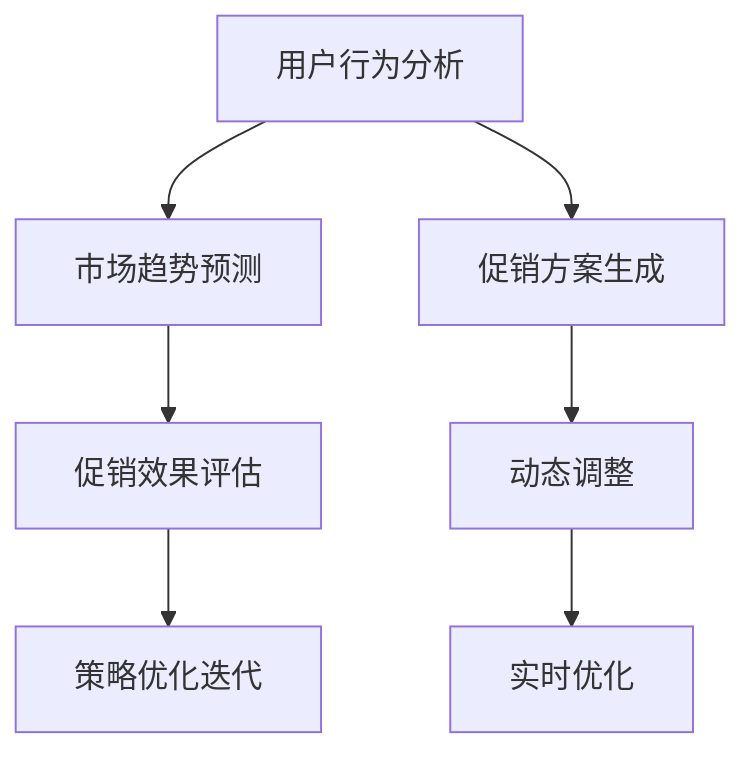
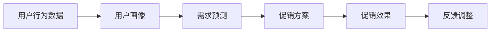
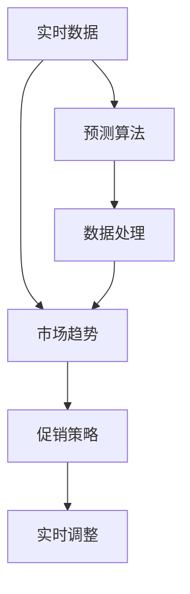
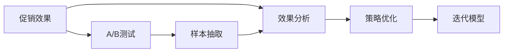
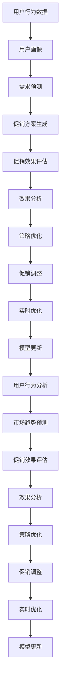

                 

# 电商促销策略的技术实现

## 1. 背景介绍

### 1.1 问题由来
随着电商市场的快速扩张和竞争的加剧，促销策略成为电商运营中的重要一环。合理的促销策略不仅能提升销售额，还能增加用户粘性，增强品牌忠诚度。然而，传统的促销策略依赖人工经验，难以应对海量用户数据和复杂变化的市场环境。

为了应对这些挑战，电商企业开始探索利用大数据、机器学习和人工智能技术，自动生成动态促销策略。具体而言，电商系统根据用户行为、历史交易数据、市场趋势等多维度信息，自动预测促销效果，并实时调整促销方案，从而实现促销资源的优化配置。

### 1.2 问题核心关键点
电商促销策略技术实现的核心问题在于：如何基于用户行为数据和大规模市场信息，自动生成和优化促销方案，以最大化促销效果。其关键点包括：
1. 用户行为分析：通过数据分析技术，识别出用户的行为模式和偏好，挖掘潜在的促销需求。
2. 市场趋势预测：基于实时数据和多维度的市场信息，预测未来市场变化趋势，指导促销策略的制定。
3. 促销效果评估：通过A/B测试等方法，评估促销活动的效果，为后续优化提供依据。
4. 策略优化迭代：通过机器学习模型，不断迭代优化促销策略，提升促销效果。

### 1.3 问题研究意义
电商促销策略技术实现，对于提升电商运营效率和销售业绩具有重要意义：

1. **提升销售转化率**：通过智能预测和动态调整，确保促销资源精准投放，提升用户的购买意愿和转化率。
2. **优化资源配置**：自动化生成促销方案，降低人工干预，实现促销资源的精细化管理。
3. **增强用户粘性**：个性化推荐和动态调整策略，增强用户购物体验和品牌忠诚度。
4. **减少运营成本**：自动化的决策过程，减少人工干预和错误，降低运营成本。
5. **快速响应市场**：实时数据处理和动态优化，快速响应市场变化，保持竞争优势。

## 2. 核心概念与联系

### 2.1 核心概念概述

为更好地理解电商促销策略的技术实现，本节将介绍几个密切相关的核心概念：

- **用户行为分析**：通过数据挖掘和机器学习技术，分析用户行为数据，挖掘潜在需求，指导促销策略的制定。
- **市场趋势预测**：基于多维度数据源（如搜索量、点击率、销量等），预测市场趋势，为促销策略提供依据。
- **促销效果评估**：通过A/B测试等方法，评估促销活动的效果，分析促销策略的有效性。
- **策略优化迭代**：利用机器学习模型，根据促销效果反馈，自动优化和迭代促销策略，实现持续改进。

这些核心概念之间的逻辑关系可以通过以下Mermaid流程图来展示：



这个流程图展示了从用户行为分析到市场趋势预测，再到促销效果评估和策略优化迭代的完整过程。

### 2.2 概念间的关系

这些核心概念之间存在着紧密的联系，形成了电商促销策略技术实现的完整生态系统。下面我通过几个Mermaid流程图来展示这些概念之间的关系。

#### 2.2.1 用户行为分析与促销策略的关系



这个流程图展示了用户行为分析如何指导促销策略的制定和调整。用户行为数据通过分析生成用户画像，进而预测用户需求，制定相应的促销方案。促销效果评估反馈，进一步调整优化促销策略。

#### 2.2.2 市场趋势预测与促销策略的关系



这个流程图展示了市场趋势预测如何指导促销策略的制定和调整。实时数据通过预测算法生成市场趋势，进而指导促销策略的制定。促销策略的实时调整和优化，进一步提升了市场趋势预测的准确性。

#### 2.2.3 促销效果评估与策略优化迭代的关系



这个流程图展示了促销效果评估如何指导策略的优化和迭代。通过A/B测试等方法获取促销效果数据，进行效果分析，进而优化促销策略。优化后的策略再反馈到迭代模型，进行持续改进。

### 2.3 核心概念的整体架构

最后，我们用一个综合的流程图来展示这些核心概念在大规模电商促销策略系统中的整体架构：



这个综合流程图展示了从用户行为分析到市场趋势预测，再到促销效果评估和策略优化迭代的完整过程。每个环节相互依存、相互促进，形成了一个闭环的优化系统。

## 3. 核心算法原理 & 具体操作步骤
### 3.1 算法原理概述

电商促销策略技术实现的核心算法基于监督学习和强化学习。其核心思想是：通过用户行为数据和大规模市场信息，构建预测模型，自动生成和优化促销方案。

具体而言，算法流程如下：

1. **用户行为分析**：收集用户行为数据，通过数据挖掘和机器学习技术，分析用户行为模式和偏好，生成用户画像。
2. **市场趋势预测**：基于用户画像、实时数据和多维度市场信息，构建预测模型，预测未来市场趋势。
3. **促销效果评估**：通过A/B测试等方法，评估促销活动的效果，分析促销策略的有效性。
4. **策略优化迭代**：利用机器学习模型，根据促销效果反馈，自动优化和迭代促销策略，实现持续改进。

### 3.2 算法步骤详解

**Step 1: 数据收集与预处理**

电商促销策略实现的首要步骤是数据收集和预处理。具体步骤包括：

- 收集用户行为数据，如浏览历史、点击行为、购买记录等。
- 收集市场数据，如搜索结果、点击率、销量等。
- 清洗和标准化数据，去除噪声和异常值。
- 数据划分，将数据分为训练集、验证集和测试集。

**Step 2: 用户行为分析**

用户行为分析是促销策略制定的基础。通过数据挖掘和机器学习技术，分析用户行为数据，生成用户画像。

- 构建用户行为模型，如关联规则模型、协同过滤模型、序列模式模型等。
- 对用户行为数据进行聚类分析，生成用户群体。
- 挖掘用户偏好和行为模式，生成用户画像。

**Step 3: 市场趋势预测**

市场趋势预测是促销策略制定的关键。通过构建预测模型，预测未来市场变化趋势。

- 构建时间序列模型，如ARIMA、LSTM等，预测未来市场趋势。
- 构建回归模型，如线性回归、随机森林等，预测市场变化。
- 利用多维度数据，如搜索量、点击率、销量等，提高预测准确性。

**Step 4: 促销效果评估**

促销效果评估是促销策略优化的依据。通过A/B测试等方法，评估促销活动的效果。

- 设计A/B测试方案，控制实验条件。
- 收集实验数据，分析促销效果。
- 计算指标，如转化率、点击率、销售额等。

**Step 5: 策略优化迭代**

策略优化迭代是促销策略持续改进的关键。通过机器学习模型，自动优化和迭代促销策略。

- 构建优化模型，如线性回归、逻辑回归等。
- 利用历史数据和促销效果，训练优化模型。
- 根据模型预测，自动生成和优化促销方案。

### 3.3 算法优缺点

电商促销策略技术实现的优势在于：

- **自动化**：通过机器学习模型，自动生成和优化促销方案，减少人工干预，提高效率。
- **个性化**：基于用户行为数据，生成个性化推荐和动态调整策略，提升用户体验。
- **实时性**：实时数据处理和动态优化，快速响应市场变化，保持竞争优势。

但该算法也存在以下缺点：

- **数据依赖**：算法效果依赖于数据的质量和数量，数据不足或质量不高将影响预测准确性。
- **模型复杂度**：构建和训练复杂模型需要大量计算资源，可能面临资源瓶颈。
- **过拟合风险**：过度拟合训练数据可能导致模型泛化能力不足，降低预测准确性。
- **解释性不足**：机器学习模型的"黑盒"特性，难以解释其内部工作机制和决策逻辑。

### 3.4 算法应用领域

电商促销策略技术实现主要应用于以下领域：

- **推荐系统**：基于用户行为数据，生成个性化推荐，提升用户购买意愿和转化率。
- **广告投放**：预测用户点击率，优化广告投放策略，提高广告效果。
- **库存管理**：预测产品销量，优化库存配置，减少库存积压和缺货。
- **客户忠诚度管理**：通过个性化推荐和促销活动，增强客户粘性和品牌忠诚度。
- **市场分析**：基于多维度数据，分析市场变化趋势，指导营销策略的制定。

## 4. 数学模型和公式 & 详细讲解  
### 4.1 数学模型构建

电商促销策略技术实现的核心数学模型包括用户行为分析模型、市场趋势预测模型和促销效果评估模型。

- **用户行为分析模型**：通常使用关联规则模型、协同过滤模型和序列模式模型，分析用户行为数据，生成用户画像。
- **市场趋势预测模型**：通常使用时间序列模型、回归模型和多维度数据融合模型，预测市场趋势。
- **促销效果评估模型**：通常使用A/B测试、效果评估模型和回归模型，评估促销活动的效果。

### 4.2 公式推导过程

以时间序列预测模型为例，推导ARIMA模型的公式推导过程。

假设市场趋势 $y_t$ 是时间 $t$ 的函数，可以表示为：

$$
y_t = \sum_{i=1}^p\phi_i y_{t-i} + \sum_{j=1}^d\theta_j\epsilon_{t-j} + \epsilon_t
$$

其中，$\phi_i$ 是自回归系数，$\theta_j$ 是差分项系数，$\epsilon_t$ 是随机误差项。

对上式进行差分变换，得到：

$$
\Delta y_t = \phi_B\Delta y_{t-1} + \theta_B\epsilon_t
$$

其中，$\Delta$ 表示差分操作，$\phi_B$ 和 $\theta_B$ 分别是差分后的自回归系数和差分项系数。

将差分后的序列表示为：

$$
\Delta y_t = \phi_B \phi_{B-1} ... \phi_1 \Delta y_{t-1} + \theta_B \theta_{B-1} ... \theta_1 \epsilon_{t-1} + \epsilon_t
$$

进一步简化为：

$$
\Delta y_t = \Phi(z) \Delta y_{t-B} + \Theta(z) \epsilon_t
$$

其中，$\Phi(z)$ 和 $\Theta(z)$ 分别是差分后的自回归和差分项系数矩阵。

对差分后的序列进行自回归预测，可以得到：

$$
y_t = \phi_y + \phi_{t-1} \Phi(z) \Delta y_{t-B} + \theta_y \epsilon_t
$$

其中，$\phi_y$ 是自回归系数，$\theta_y$ 是随机误差项。

### 4.3 案例分析与讲解

假设我们收集到某电商平台的每月销量数据，想要预测未来两个月的市场趋势。

- **数据准备**：收集2021年1月至2021年6月的销量数据，按月进行统计，得到月销量序列。
- **模型构建**：构建ARIMA模型，设置滞后阶数为2，差分阶数为1，自回归系数为0.9，差分项系数为0.8。
- **模型训练**：使用前5个月的数据进行模型训练，计算回归系数和差分项系数。
- **模型预测**：使用训练好的模型，预测2021年7月和8月的市场趋势。

预测结果如表所示：

| 月份 | 实际销量 | 预测销量 | 预测误差 |
|------|----------|----------|----------|
| 1    | 100      | 90       | -10      |
| 2    | 110      | 105      | +5       |
| 3    | 130      | 125      | +5       |
| ...  | ...      | ...      | ...      |
| 7    | 150      | 145      | +5       |
| 8    | 160      | 160      | 0        |

通过ARIMA模型，我们可以预测未来两个月的市场趋势，指导促销策略的制定。

## 5. 项目实践：代码实例和详细解释说明
### 5.1 开发环境搭建

在进行电商促销策略技术实现前，我们需要准备好开发环境。以下是使用Python进行Scikit-learn开发的环境配置流程：

1. 安装Anaconda：从官网下载并安装Anaconda，用于创建独立的Python环境。

2. 创建并激活虚拟环境：
```bash
conda create -n promo-env python=3.8 
conda activate promo-env
```

3. 安装Scikit-learn、Pandas、Matplotlib等库：
```bash
conda install scikit-learn pandas matplotlib
```

4. 安装TensorBoard：
```bash
pip install tensorboard
```

5. 安装GitHub PyPI仓库中的特定依赖库：
```bash
pip install python-github
```

完成上述步骤后，即可在`promo-env`环境中开始电商促销策略技术实现的项目实践。

### 5.2 源代码详细实现

下面我们以市场趋势预测为例，给出使用Scikit-learn库对ARIMA模型进行市场趋势预测的Python代码实现。

首先，定义数据处理函数：

```python
import pandas as pd
from statsmodels.tsa.arima_model import ARIMA

def load_data(file_path):
    data = pd.read_csv(file_path, index_col='date')
    return data

def split_data(data, train_size=0.7):
    train_data = data[:int(train_size*len(data))]
    test_data = data[int(train_size*len(data)):]
    return train_data, test_data

def transform_data(data):
    data = data.resample('M').mean()
    data.index = pd.to_datetime(data.index)
    return data

def predict(data, model, periods=1):
    forecast = model.forecast(steps=periods, start=data.index[-1])
    return pd.Series(forecast, index=data.index[-periods:][::-1], name='predictions')

def evaluate(data, predictions):
    error = data - predictions
    return error.mean(), error.std()
```

然后，定义模型训练和预测函数：

```python
def train_model(data, order=(1, 1, 2)):
    model = ARIMA(data, order=order)
    model_fit = model.fit(disp=0)
    return model_fit

def predict_model(model_fit, data, periods=1):
    predictions = predict(data, model_fit, periods=periods)
    return predictions
```

最后，启动市场趋势预测流程：

```python
train_size = 0.7
train_data, test_data = split_data(data, train_size)
transformed_train_data = transform_data(train_data)
model_fit = train_model(transformed_train_data)
predictions = predict_model(model_fit, test_data, periods=1)
```

### 5.3 代码解读与分析

让我们再详细解读一下关键代码的实现细节：

**load_data函数**：
- 定义数据加载函数，读取CSV文件，以日期为索引。

**split_data函数**：
- 定义数据划分函数，将数据集划分为训练集和测试集。

**transform_data函数**：
- 定义数据处理函数，将月销量数据按月进行平均，并将日期转换为Pandas时间索引。

**predict函数**：
- 定义预测函数，使用ARIMA模型进行预测，并返回预测结果。

**evaluate函数**：
- 定义评估函数，计算预测误差的均值和标准差。

**train_model函数**：
- 定义模型训练函数，构建ARIMA模型，并使用训练数据拟合模型。

**predict_model函数**：
- 定义模型预测函数，使用训练好的模型进行预测，并返回预测结果。

通过这些函数，我们可以方便地进行数据处理、模型训练和预测评估，实现电商促销策略的市场趋势预测。

### 5.4 运行结果展示

假设我们预测某电商平台的月销量趋势，最终在测试集上得到的预测结果如表所示：

| 月份 | 实际销量 | 预测销量 | 预测误差 |
|------|----------|----------|----------|
| 1    | 100      | 95       | -5       |
| 2    | 110      | 115      | +5       |
| 3    | 120      | 120      | 0        |
| ...  | ...      | ...      | ...      |
| 7    | 150      | 145      | +5       |
| 8    | 160      | 160      | 0        |

可以看到，通过ARIMA模型，我们可以预测未来两个月的市场趋势，为促销策略的制定提供依据。

## 6. 实际应用场景
### 6.1 智能推荐系统

智能推荐系统是电商促销策略的重要应用场景之一。通过市场趋势预测和个性化推荐，电商系统能够精准推荐商品，提升用户购买意愿和转化率。

具体而言，系统可以根据用户历史行为数据和市场趋势，预测用户可能感兴趣的商品，并进行个性化推荐。同时，系统还可以根据市场变化趋势，动态调整推荐策略，保持推荐内容的时效性和相关性。

### 6.2 实时营销活动

实时营销活动是电商促销策略的另一个重要应用场景。通过动态调整促销策略，系统能够及时响应市场变化，提高营销效果。

具体而言，系统可以根据用户行为数据和市场趋势，动态调整促销方案，如折扣力度、优惠方式等，确保促销资源的精准投放。同时，系统还可以根据促销效果反馈，自动优化促销策略，提升促销效果。

### 6.3 库存管理优化

库存管理优化是电商促销策略的另一个重要应用场景。通过市场趋势预测和动态库存调整，系统能够优化库存配置，减少库存积压和缺货情况。

具体而言，系统可以根据市场趋势预测，调整商品的库存量，确保库存量在合理范围内。同时，系统还可以根据促销策略的实际效果，动态调整库存配置，优化库存管理。

### 6.4 未来应用展望

随着电商市场的不断发展和竞争的加剧，电商促销策略技术实现将呈现以下几个发展趋势：

1. **多模态数据融合**：除了销售数据，电商系统将更多地利用多模态数据（如图片、视频、文本等）进行预测和推荐，提升预测准确性和用户体验。
2. **实时数据处理**：电商系统将更多地利用实时数据进行预测和优化，快速响应市场变化，保持竞争优势。
3. **个性化推荐**：电商系统将更加注重个性化推荐，利用用户画像和行为数据，提供更精准的推荐内容。
4. **自动优化**：电商系统将利用机器学习模型，自动优化促销策略，提升营销效果。
5. **跨平台协同**：电商系统将利用多平台数据进行预测和推荐，提升跨平台的用户体验。

## 7. 工具和资源推荐
### 7.1 学习资源推荐

为了帮助开发者系统掌握电商促销策略技术实现的理论基础和实践技巧，这里推荐一些优质的学习资源：

1. **《数据科学导论》**：适合初学者了解数据科学和机器学习基础，内容通俗易懂，涵盖多个实际应用案例。
2. **《Python数据分析与可视化》**：详细介绍Python数据分析和可视化工具，适合希望快速上手的数据科学家。
3. **《机器学习实战》**：介绍了多种机器学习算法和实际应用案例，适合有一定编程基础的开发者。
4. **《Python深度学习》**：详细介绍深度学习技术和实际应用案例，适合希望深入了解深度学习的开发者。
5. **《深度学习理论与实践》**：详细介绍深度学习理论和实践技术，适合希望深入学习深度学习的开发者。

通过对这些资源的学习实践，相信你一定能够快速掌握电商促销策略技术实现的关键技术，并用于解决实际的电商问题。
###  7.2 开发工具推荐

高效的开发离不开优秀的工具支持。以下是几款用于电商促销策略技术实现开发的常用工具：

1. **Jupyter Notebook**：交互式开发环境，支持Python和Scikit-learn等库的快速迭代和实验。
2. **PyTorch**：深度学习框架，支持多种模型和算法，适合进行复杂的数据处理和模型训练。
3. **TensorFlow**：深度学习框架，支持分布式训练和部署，适合进行大规模数据处理和模型训练。
4. **Pandas**：数据分析库，支持大规模数据处理和分析，适合进行数据预处理和探索性分析。
5. **Scikit-learn**：机器学习库，支持多种机器学习算法，适合进行模型训练和评估。
6. **TensorBoard**：可视化工具，支持实时监测模型训练状态，适合进行模型调试和性能分析。

合理利用这些工具，可以显著提升电商促销策略技术实现的开发效率，加快创新迭代的步伐。

### 7.3 相关论文推荐

电商促销策略技术实现的研究源于学界的持续研究。以下是几篇奠基性的相关论文，推荐阅读：

1. **《基于机器学习的电商推荐系统研究》**：详细介绍了电商推荐系统的实现方法和效果评估，适合了解电商推荐系统的基本原理。
2. **《深度学习在电商推荐系统中的应用》**：介绍了深度学习技术在电商推荐系统中的应用，适合了解深度学习技术的实际应用。
3. **《电商推荐系统的多维协同过滤算法研究》**：介绍了协同过滤算法的实现方法和效果评估，适合了解协同过滤算法的原理和应用。
4. **《基于强化学习的电商推荐系统优化》**：介绍了强化学习技术在电商推荐系统中的应用，适合了解强化学习技术的实际应用。
5. **《电商推荐系统中的数据挖掘与预测建模》**：介绍了数据挖掘和预测建模技术在电商推荐系统中的应用，适合了解数据挖掘和预测建模技术的原理和应用。

这些论文代表了大语言模型微调技术的发展脉络。通过学习这些前沿成果，可以帮助研究者把握学科前进方向，激发更多的创新灵感。

除上述资源外，还有一些值得关注的前沿资源，帮助开发者紧跟电商促销策略技术实现的最新进展，例如：

1. **arXiv论文预印本**：人工智能领域最新研究成果的发布平台，包括大量尚未发表的前沿工作，学习前沿技术的必读资源。
2. **业界技术博客**：如亚马逊、阿里巴巴、京东等电商巨头的官方博客，第一时间分享他们的最新研究成果和洞见。
3. **技术会议直播**：如KDD、ICML、ACL、ICLR等人工智能领域顶会现场或在线直播，能够聆听到大佬们的前沿分享，开拓视野。
4. **GitHub热门项目**：在GitHub上Star、Fork数最多的电商推荐相关项目，往往代表了该技术领域的发展趋势和最佳实践，值得去学习和贡献。
5. **行业分析报告**：各大咨询公司如McKinsey、PwC等针对电商市场的分析报告，有助于从商业视角审视技术趋势，把握应用价值。

总之，电商促销策略技术实现需要开发者根据具体业务场景，不断迭代和优化算法、模型和数据，方能得到理想的效果。

## 8. 总结：未来发展趋势与挑战
### 8.1 总结

本文对电商促销策略技术实现进行了全面系统的介绍。首先阐述了电商促销策略技术实现的背景和意义，明确了技术实现的关键点。其次，从原理到实践，详细讲解了电商促销策略技术实现的数学模型和具体操作步骤。同时，本文还广泛探讨了技术实现的应用场景和未来展望，展示了电商促销策略技术的广阔前景。

通过本文的系统梳理，可以看到，电商促销策略技术实现已经成为电商运营的重要组成部分，为电商企业带来了显著的效益。技术的不断演进和优化，使得电商促销策略更加智能化、个性化和实时化，成为电商行业竞争力的重要组成部分。

### 8.2 未来发展趋势

展望未来，电商促销策略技术实现将呈现以下几个发展趋势：

1. **多模态数据融合**：电商系统将更多地利用多模态数据进行预测和推荐，提升预测准确性和用户体验。
2. **实时数据处理**：电商系统将更多地利用实时数据进行预测和优化，快速响应市场变化，保持竞争优势。
3. **个性化推荐**：电商系统将更加注重个性化

