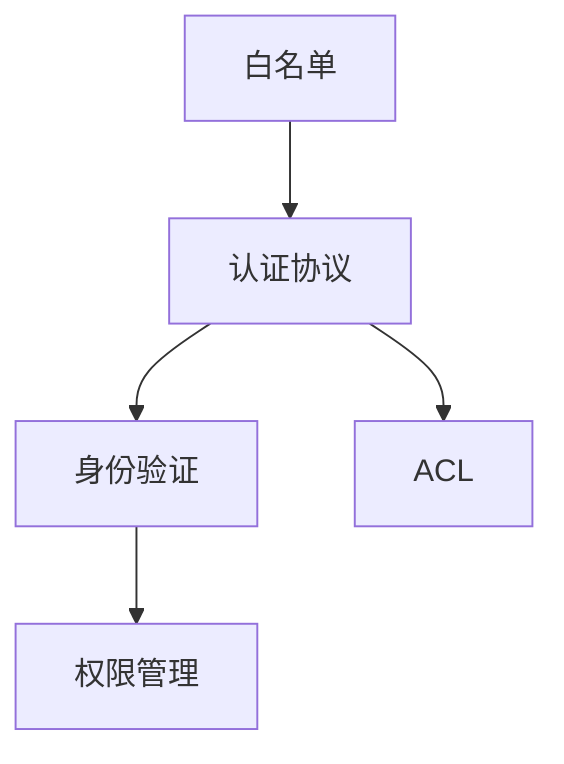
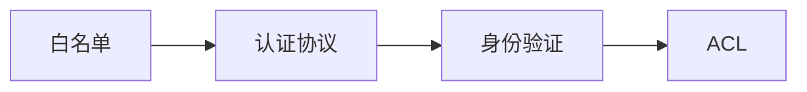
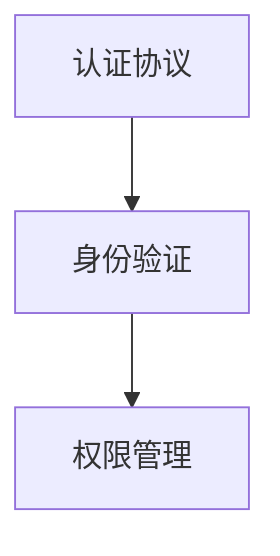
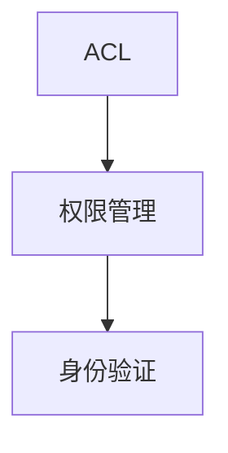
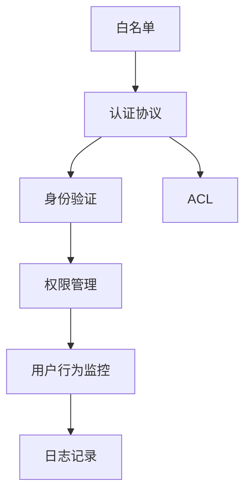

                 

# 白名单：防止未经授权的访问

> 关键词：白名单,访问控制,身份验证,安全机制,权限管理,认证协议

## 1. 背景介绍

### 1.1 问题由来
随着信息技术的高速发展，数据和资源的安全性问题变得愈加严峻。特别是网络攻击事件的频发，使得企业对于数据访问的控制需求愈加强烈。传统的基于身份验证的访问控制方式，虽然较为常见，但仍然存在安全隐患。如何设计更为灵活、安全的访问控制机制，成为了当前信息安全领域的一个重要课题。

### 1.2 问题核心关键点
白名单（Whitelist）访问控制是一种基于策略的访问控制方法，相较于传统的身份验证方式，更加灵活和严格。其主要思想是，仅允许白名单中列出的用户或IP地址访问系统或资源，任何不在白名单中的访问都被视为非法。

白名单访问控制的核心在于：
- 明确访问控制策略，仅允许特定用户或IP地址访问
- 严格控制访问行为，降低非法入侵风险
- 灵活配置权限，适用于各种复杂的访问场景

白名单机制的优点在于，其具有高度的可定制性和安全性，能够针对特定需求进行精细化控制，同时减少非授权访问的可能性。

### 1.3 问题研究意义
白名单访问控制在信息安全领域中具有重要的应用价值，能够有效防止未经授权的访问，保护数据和资源的安全。其研究意义在于：

1. 增强安全性：白名单访问控制通过严格的身份验证和权限控制，能够极大地降低非法入侵的风险，保障系统的安全性。
2. 提高效率：白名单访问控制可以根据实际需求进行灵活配置，减少非必要的操作和访问，提升系统的运行效率。
3. 优化用户体验：白名单机制能够为特定用户提供更为便捷的访问体验，避免复杂的身份验证过程，提高用户满意度。
4. 支持多层次安全控制：白名单访问控制不仅限于用户身份验证，还包括对IP地址、设备等进行控制，形成多层次的安全防护体系。
5. 适应性广：白名单机制可以应用于各种复杂场景，如企业内部网络、云计算平台、移动应用等，具有广泛的适用性。

## 2. 核心概念与联系

### 2.1 核心概念概述

为更好地理解白名单访问控制机制，本节将介绍几个核心概念：

- 白名单（Whitelist）：仅包含被授权用户或IP地址的名单，任何不在白名单中的访问被视为非法。
- 黑名单（Blacklist）：仅包含被禁止用户或IP地址的名单，任何在白名单中的访问被视为合法。
- 访问控制列表（ACL, Access Control List）：用于记录和管理用户或IP地址的访问权限，通常以白名单或黑名单的形式呈现。
- 认证协议（Authentication Protocol）：用于验证用户身份的协议，如OAuth、SSO等。
- 身份验证（Authentication）：验证用户身份的过程，通常包括用户名和密码、生物识别等多种方式。
- 权限管理（Permission Management）：根据用户身份和角色，分配和调整访问权限的过程。

这些核心概念之间存在紧密的联系，共同构成了白名单访问控制机制的基本框架。以下通过一个简单的Mermaid流程图来展示它们之间的关系：



这个流程图展示了白名单机制中各核心概念的关联关系：

1. 白名单是访问控制的基础，包含授权的用户或IP地址。
2. 认证协议用于验证用户身份，通常包含多个步骤。
3. 身份验证通过认证协议验证用户身份，获取用户的访问权限。
4. ACL根据用户身份验证结果，决定是否允许访问。
5. 权限管理根据用户的角色和任务，调整和配置ACL，实现细粒度的访问控制。

### 2.2 概念间的关系

这些核心概念之间存在着紧密的联系，形成了白名单访问控制机制的完整生态系统。下面我们通过几个Mermaid流程图来展示这些概念之间的关系。

#### 2.2.1 白名单与认证协议的关系



这个流程图展示了白名单与认证协议的关联关系：

1. 认证协议用于验证用户身份，将用户信息与白名单进行比对。
2. 身份验证通过认证协议获取用户信息，并发送给ACL进行权限检查。
3. ACL根据用户信息，判断用户是否在白名单中。

#### 2.2.2 认证协议与身份验证的关系



这个流程图展示了认证协议与身份验证的关联关系：

1. 认证协议通过多个步骤验证用户身份。
2. 身份验证通过认证协议获取用户信息。
3. 权限管理根据身份验证结果，配置用户的访问权限。

#### 2.2.3 ACL与权限管理的关系



这个流程图展示了ACL与权限管理的关联关系：

1. 权限管理根据用户的角色和任务，配置ACL。
2. ACL根据权限管理的结果，决定是否允许访问。
3. 身份验证通过ACL判断用户是否具有访问权限。

### 2.3 核心概念的整体架构

最后，我们用一个综合的流程图来展示这些核心概念在白名单访问控制机制中的整体架构：



这个综合流程图展示了从白名单定义到用户行为监控和日志记录的完整过程：

1. 白名单定义了可访问的用户或IP地址。
2. 认证协议通过多个步骤验证用户身份。
3. 身份验证通过认证协议获取用户信息。
4. ACL根据用户信息，判断用户是否在白名单中。
5. 权限管理根据用户角色和任务，配置ACL。
6. 用户行为监控监测用户访问行为，及时发现异常。
7. 日志记录保存所有访问行为，用于事后审计和分析。

## 3. 核心算法原理 & 具体操作步骤
### 3.1 算法原理概述

白名单访问控制机制基于白名单策略，其核心原理如下：

1. 定义白名单：明确列出允许访问的IP地址或用户账号。
2. 身份验证：通过认证协议验证用户身份，获取用户信息。
3. ACL配置：根据用户信息，配置ACL，决定是否允许访问。
4. 权限管理：根据用户的角色和任务，调整和配置ACL，实现细粒度的访问控制。

### 3.2 算法步骤详解

白名单访问控制的详细步骤包括：

**Step 1: 定义白名单**
- 确定需要保护的资源，如服务器、数据库等。
- 列出允许访问的IP地址或用户账号，并将其存储在可信的第三方白名单服务中，或本地存储在数据库中。

**Step 2: 认证协议设计**
- 设计合适的认证协议，如OAuth、SSO等。
- 实现认证协议，确保用户身份验证的准确性和安全性。

**Step 3: 身份验证**
- 用户通过认证协议进行身份验证，如输入用户名和密码、扫描二维码等。
- 认证协议将用户信息发送给ACL进行权限检查。

**Step 4: ACL配置**
- 根据用户信息，配置ACL，决定是否允许访问。
- ACL应根据实际需求进行灵活配置，如只允许特定IP地址访问，或者只允许特定用户账号访问。

**Step 5: 权限管理**
- 根据用户角色和任务，配置ACL，实现细粒度的访问控制。
- 定期调整ACL，确保其与实际需求一致。

**Step 6: 用户行为监控**
- 监测用户访问行为，确保所有访问都在白名单范围内。
- 发现异常访问行为时，立即采取相应措施，如禁封IP地址、禁止用户账号等。

**Step 7: 日志记录**
- 记录所有访问行为，包括成功访问和异常访问。
- 定期审计日志，发现潜在的安全问题，及时采取补救措施。

### 3.3 算法优缺点

白名单访问控制机制具有以下优点：

1. 灵活性强：白名单机制可以根据实际需求进行灵活配置，实现细粒度的访问控制。
2. 安全性高：白名单机制仅允许授权用户或IP地址访问，降低了非法入侵的风险。
3. 适用性广：白名单机制可以应用于各种复杂场景，如企业内部网络、云计算平台、移动应用等。

同时，白名单机制也存在以下缺点：

1. 配置复杂：白名单配置需要根据实际需求进行详细规划，配置不当可能导致安全漏洞。
2. 维护困难：白名单需要定期更新，维护过程中容易出错，导致误拒绝或误授权。
3. 缺乏普适性：白名单机制适用于某些特定场景，但对于大规模、动态变化的环境，可能需要其他访问控制机制辅助。

### 3.4 算法应用领域

白名单访问控制机制在多个领域都有广泛的应用，例如：

- 企业内部网络：定义企业内部员工的访问权限，防止未经授权的访问。
- 云计算平台：定义用户对云资源的访问权限，限制非法访问。
- 移动应用：定义用户对移动应用的访问权限，防止未授权用户访问。
- 智能家居：定义家庭中各个成员的访问权限，防止非家庭成员访问。
- 工业控制：定义操作员的访问权限，防止非法操作。

除了上述这些常见场景，白名单访问控制机制在医疗、金融、教育、政府等多个领域都有重要的应用。

## 4. 数学模型和公式 & 详细讲解  
### 4.1 数学模型构建

假设系统需要保护的资源为 $R$，白名单中包含的IP地址为 $W$，认证协议验证用户身份的结果为 $V$，ACL配置为 $C$。

定义白名单策略函数 $S(R, W)$，表示白名单中包含的IP地址对资源 $R$ 的访问策略。

定义身份验证函数 $F(V)$，表示通过认证协议验证用户身份的结果。

定义ACL配置函数 $A(C)$，表示根据ACL配置决定是否允许访问。

定义权限管理函数 $P(C, V)$，表示根据用户角色和任务，配置ACL。

定义用户行为监控函数 $M(R, W, V)$，表示监测用户访问行为。

定义日志记录函数 $L(R, W, V)$，表示记录所有访问行为。

系统的工作流程可以表示为：

$$
S(R, W) \land F(V) \land A(C) \land P(C, V) \land M(R, W, V) \land L(R, W, V)
$$

### 4.2 公式推导过程

以下我们以OAuth认证协议为例，推导白名单机制的数学模型。

OAuth认证协议主要包含三个步骤：

1. 用户向认证服务器请求访问令牌。
2. 认证服务器返回访问令牌，用户将其发送给资源服务器。
3. 资源服务器验证访问令牌，决定是否允许访问。

假设用户数量为 $N$，认证服务器需要验证的令牌数量为 $M$，资源服务器需要验证的令牌数量为 $K$。

用户请求访问令牌的概率为 $P_1$，认证服务器返回访问令牌的概率为 $P_2$，资源服务器验证令牌的概率为 $P_3$。

白名单策略函数 $S(R, W)$ 可以表示为：

$$
S(R, W) = \begin{cases}
1, & \text{如果用户或IP地址在白名单中} \\
0, & \text{如果用户或IP地址不在白名单中}
\end{cases}
$$

身份验证函数 $F(V)$ 可以表示为：

$$
F(V) = \begin{cases}
1, & \text{如果用户通过身份验证} \\
0, & \text{如果用户未通过身份验证}
\end{cases}
$$

ACL配置函数 $A(C)$ 可以表示为：

$$
A(C) = \begin{cases}
1, & \text{如果ACL允许访问} \\
0, & \text{如果ACL禁止访问}
\end{cases}
$$

权限管理函数 $P(C, V)$ 可以表示为：

$$
P(C, V) = \begin{cases}
1, & \text{如果用户角色和任务允许访问} \\
0, & \text{如果用户角色和任务不允许访问}
\end{cases}
$$

用户行为监控函数 $M(R, W, V)$ 可以表示为：

$$
M(R, W, V) = \begin{cases}
1, & \text{如果用户访问行为符合规则} \\
0, & \text{如果用户访问行为不符合规则}
\end{cases}
$$

日志记录函数 $L(R, W, V)$ 可以表示为：

$$
L(R, W, V) = \begin{cases}
1, & \text{如果记录了所有访问行为} \\
0, & \text{如果未记录访问行为}
\end{cases}
$$

### 4.3 案例分析与讲解

假设某企业内部网络需要保护，白名单中包含所有内部员工的用户账号和IP地址。认证协议为OAuth，资源服务器为公司服务器。

系统的工作流程可以表示为：

1. 用户请求访问公司服务器。
2. 用户通过OAuth认证协议，向认证服务器请求访问令牌。
3. 认证服务器返回访问令牌，用户将其发送给资源服务器。
4. 资源服务器验证访问令牌，决定是否允许访问。
5. 系统记录用户访问行为和日志。

具体计算步骤如下：

- 白名单策略函数 $S(R, W)$ 为1，表示用户或IP地址在白名单中。
- 身份验证函数 $F(V)$ 为1，表示用户通过OAuth认证协议。
- ACL配置函数 $A(C)$ 为1，表示ACL允许访问。
- 权限管理函数 $P(C, V)$ 为1，表示用户角色和任务允许访问。
- 用户行为监控函数 $M(R, W, V)$ 为1，表示用户访问行为符合规则。
- 日志记录函数 $L(R, W, V)$ 为1，表示记录了所有访问行为。

系统最终决定允许用户访问公司服务器。

## 5. 项目实践：代码实例和详细解释说明
### 5.1 开发环境搭建

在进行白名单实践前，我们需要准备好开发环境。以下是使用Python进行Flask开发的环境配置流程：

1. 安装Anaconda：从官网下载并安装Anaconda，用于创建独立的Python环境。

2. 创建并激活虚拟环境：
```bash
conda create -n whitelist-env python=3.8 
conda activate whitelist-env
```

3. 安装Flask：
```bash
pip install flask
```

4. 安装Flask-RESTful：
```bash
pip install flask-restful
```

5. 安装Flask-JWT-Extended：
```bash
pip install flask-jwt-extended
```

完成上述步骤后，即可在`whitelist-env`环境中开始白名单实践。

### 5.2 源代码详细实现

下面我们以OAuth认证协议为例，给出使用Flask实现白名单机制的代码实现。

首先，定义白名单中的用户账号和IP地址：

```python
from flask import Flask, request

app = Flask(__name__)

# 白名单用户账号和IP地址
whitelist = {
    'user1': '192.168.1.1',
    'user2': '192.168.1.2'
}
```

然后，定义认证协议：

```python
from flask_jwt_extended import JWTManager, jwt_required

app.config['JWT_SECRET_KEY'] = 'super-secret'  # 设置JWT密钥
jwt = JWTManager(app)

@app.route('/login', methods=['POST'])
def login():
    # 获取用户名和密码
    username = request.json.get('username', None)
    password = request.json.get('password', None)
    
    # 验证用户信息
    if username in whitelist and password == 'password':
        # 生成JWT令牌
        access_token = jwt.create_access_token(identity=username)
        return jsonify({'access_token': access_token}), 200
    else:
        return jsonify({'error': 'Invalid username or password'}), 401

# 认证机制
@app.route('/protected', methods=['GET'])
@jwt_required
def protected():
    # 验证JWT令牌
    return jsonify({'message': 'You are authorized!'}), 200
```

在上述代码中，我们使用了Flask-JWT-Extended扩展库来实现JWT令牌的生成和验证。登录接口`/login`用于验证用户信息，如果验证成功，则返回JWT令牌。访问接口`/protected`使用`@jwt_required`装饰器，确保只有通过认证的用户才能访问。

最后，启动Flask应用：

```python
if __name__ == '__main__':
    app.run(debug=True)
```

以上就是使用Flask实现白名单机制的完整代码实现。可以看到，Flask提供了丰富的API开发框架，可以方便地实现认证、授权等访问控制功能。

### 5.3 代码解读与分析

让我们再详细解读一下关键代码的实现细节：

**白名单定义**：
- `whitelist`字典定义了允许访问的白名单用户账号和IP地址。

**认证协议实现**：
- `/login`接口接收用户输入的用户名和密码，通过`jwt.create_access_token()`方法生成JWT令牌。
- `@jwt_required`装饰器用于保护需要验证的接口，确保只有通过认证的用户才能访问。

**访问控制实现**：
- 访问接口`/protected`使用`@jwt_required`装饰器，验证JWT令牌，决定是否允许访问。

**Flask框架特点**：
- 简单易用：Flask提供了简单易用的API开发框架，开发者可以轻松实现各种访问控制机制。
- 可扩展性强：Flask支持各种扩展库，如JWT-Extended、OAuth、SSO等，可以方便地实现复杂的功能。
- 轻量级：Flask的框架设计轻量级，不需要额外的中间件，运行效率较高。

当然，工业级的系统实现还需考虑更多因素，如访问控制规则的灵活配置、多用户并发访问处理、性能优化等。但核心的白名单实现思路类似，即通过认证协议验证用户身份，配置ACL进行权限控制，记录日志进行审计。

## 6. 实际应用场景
### 6.1 智能家居安全系统

智能家居系统通过物联网技术将各种家电设备连接到互联网，提高了生活的便利性。但智能家居系统也存在诸多安全隐患，如未经授权的用户访问、恶意攻击等。白名单访问控制机制可以有效防止这些安全威胁，保障智能家居系统的安全。

具体实现方式包括：
- 定义白名单，列出可访问的设备和用户账号。
- 实现OAuth等认证协议，验证用户身份。
- 配置ACL，决定设备对用户的访问权限。
- 记录日志，监控和审计所有访问行为。

通过白名单访问控制机制，智能家居系统可以保证只有授权用户才能访问家庭中的各种设备和资源，防止未经授权的访问和恶意攻击。

### 6.2 医疗信息系统

医疗信息系统是医院中最重要的信息平台之一，包含了大量的患者信息和医疗数据。白名单访问控制机制可以有效防止非法访问，保障医疗信息系统的安全。

具体实现方式包括：
- 定义白名单，列出可访问的医生、护士等用户账号和IP地址。
- 实现OAuth等认证协议，验证用户身份。
- 配置ACL，决定用户对医疗数据的访问权限。
- 记录日志，监控和审计所有访问行为。

通过白名单访问控制机制，医疗信息系统可以保证只有授权用户才能访问敏感的医疗数据，防止数据泄露和非法操作。

### 6.3 云平台应用

云平台是现代企业信息化建设的重要组成部分，提供了各种计算和存储资源。白名单访问控制机制可以有效防止非法访问，保障云平台的安全。

具体实现方式包括：
- 定义白名单，列出可访问的IP地址或用户账号。
- 实现OAuth等认证协议，验证用户身份。
- 配置ACL，决定用户对云资源的访问权限。
- 记录日志，监控和审计所有访问行为。

通过白名单访问控制机制，云平台可以保证只有授权用户才能访问资源，防止非法访问和数据泄露。

### 6.4 未来应用展望

随着信息技术的不断发展，白名单访问控制机制的应用场景将更加广泛。未来，白名单机制将在更多领域得到应用，为信息安全领域带来新的突破。

在智慧城市治理中，白名单机制可以应用于城市事件监测、舆情分析、应急指挥等环节，提高城市管理的自动化和智能化水平，构建更安全、高效的未来城市。

在智慧教育领域，白名单机制可以应用于课堂管理系统、作业批改系统等，保护学生信息和教师资源，防止非法访问和数据泄露。

在智能交通系统中，白名单机制可以应用于车联网系统、智能停车系统等，保障交通数据和设备的安全。

总之，白名单访问控制机制将在更多领域得到应用，为信息安全领域带来新的突破。

## 7. 工具和资源推荐
### 7.1 学习资源推荐

为了帮助开发者系统掌握白名单访问控制的技术基础和实践技巧，这里推荐一些优质的学习资源：

1. 《Flask Web Development》书籍：提供了Flask框架的详细教程，包括API开发、认证、授权等核心技术。
2. 《OAuth 2.0 - The Definitive Guide》书籍：全面介绍了OAuth 2.0协议的原理和实现，是OAuth开发的重要参考。
3. 《Access Control for Security and Privacy》书籍：介绍了多种访问控制机制的原理和实现方法，是信息安全领域的重要教材。
4. HuggingFace官方文档：提供了丰富的预训练模型和API开发文档，帮助开发者快速上手实现各种访问控制机制。
5. OWASP网站：提供了多种信息安全技术的详细介绍，包括OAuth、JWT、SSO等，是开发者学习信息安全的重要资源。

通过对这些资源的学习实践，相信你一定能够快速掌握白名单访问控制机制的技术细节，并用于解决实际的信息安全问题。
###  7.2 开发工具推荐

高效的开发离不开优秀的工具支持。以下是几款用于白名单访问控制开发的常用工具：

1. Flask：基于Python的开源Web框架，简单易用，支持各种扩展库，非常适合开发API系统。
2. Django：基于Python的开源Web框架，功能强大，支持多种认证和授权机制，适合开发复杂的Web应用。
3. JWT-Extended：用于生成和验证JWT令牌的扩展库，支持多种认证协议，易于集成到Web应用中。
4. OAuth2：用于实现OAuth 2.0认证协议的扩展库，支持多种认证方式，易于配置和使用。
5. OpenSSL：用于生成和管理SSL/TLS证书的库，支持加密、解密、签名等功能，是网络安全的重要工具。
6. ELK Stack：包括Elasticsearch、Logstash、Kibana等工具，用于日志管理和分析，支持多种数据源。

合理利用这些工具，可以显著提升白名单访问控制机制的开发效率，加快创新迭代的步伐。

### 7.3 相关论文推荐

白名单访问控制机制的研究源于学界的持续研究。以下是几篇奠基性的相关论文，推荐阅读：

1. "Access Control Policies in Databases"（数据库的访问控制策略）：
   - 作者：S.H. Chow, M.C. Rashid
   - 主要内容：讨论了数据库中的访问控制策略，包括基于角色的访问控制和基于策略的访问控制等。
2. "Token-Based Authentication in Multi-Level Secure Operating Systems"（基于令牌的多级安全操作系统认证）：
   - 作者：S.M. Singh, P.K. Mehta, P. Desai
   - 主要内容：介绍了基于令牌的多级安全操作系统认证机制，提出了多种安全策略。
3. "OAuth 2.0 Authorization Framework"（OAuth 2.0授权框架）：
   - 作者：B.S. Newton-Malandra, R. Rivest
   - 主要内容：全面介绍了OAuth 2.0授权框架的原理和实现，是OAuth开发的重要参考。
4. "Role-Based Access Control (RBAC): A Review"（基于角色的访问控制：综述）：
   - 作者：B.D. Whitaker
   - 主要内容：综述了基于角色的访问控制机制，介绍了多种RBAC模型和应用。
5. "Modeling and Controlling Access to Browsers"（建模和控制浏览器访问）：
   - 作者：A. Paraik, S. Choudhury
   - 主要内容：讨论了如何通过白名单机制控制浏览器访问，防止非法访问。

这些论文代表了大白名单访问控制机制的研究进展，提供了丰富的理论基础和实践经验，值得深入阅读和学习。

除上述资源外，还有一些值得关注的前沿资源，帮助开发者紧跟白名单访问控制机制的最新进展，例如：

1. arXiv论文预印本：人工智能领域最新研究成果的发布平台，包括大量尚未发表的前沿工作，学习前沿技术的必读资源。
2. 业界技术博客：如Google Cloud、AWS、Microsoft Azure等顶尖实验室的官方博客，第一时间分享他们的最新研究成果和洞见。
3. 技术会议直播：如IETF、IEEE、IEEE、NIST等顶尖会议现场或在线直播，能够聆听到专家们的前沿分享，开拓视野。
4. GitHub热门项目：在GitHub上Star、Fork数最多的白名单访问控制相关项目，往往代表了该技术领域的发展趋势和最佳实践，值得去学习和贡献。
5. 行业分析报告

