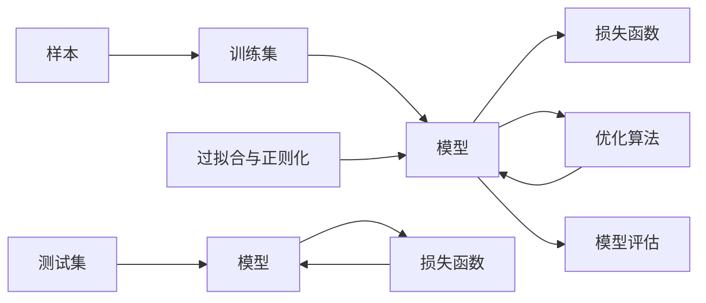

                 

# 监督学习(Supervised Learning) - 原理与代码实例讲解

> 关键词：监督学习, 线性回归, 逻辑回归, 决策树, 随机森林, 支持向量机, 神经网络, 模型评估, 过拟合与正则化

## 1. 背景介绍

### 1.1 问题由来

在人工智能领域，监督学习是机器学习中最基础的范式之一。它利用有标注的训练数据集，通过学习模型参数，使模型能够准确预测目标变量的值。监督学习广泛应用于回归分析、分类、序列预测等诸多领域，是实现人工智能智能化的核心技术之一。

本文将系统地介绍监督学习的基本原理，深入讲解常见模型的实现和应用，并通过代码实例帮助读者理解和实现。同时，本文还会探讨监督学习在实际应用中面临的挑战和优化策略。

## 2. 核心概念与联系

### 2.1 核心概念概述

监督学习主要涉及以下几个核心概念：

- **样本**：单个有标注的数据点，包含特征和标签。
- **训练集**：有标注的数据集，用于模型训练。
- **测试集**：无标注的数据集，用于模型评估。
- **模型**：从训练集学习得到的预测函数。
- **损失函数**：度量模型预测与真实标签之间的差距。
- **优化算法**：调整模型参数以最小化损失函数的算法。
- **过拟合与正则化**：防止模型过度拟合训练数据的策略。

这些概念构成了监督学习的完整生态，并相互关联。

### 2.2 核心概念之间的关系

通过以下Mermaid流程图，可以更好地理解这些核心概念之间的关系：



该流程图展示了样本如何通过训练集学习得到模型，模型如何通过优化算法调整参数以最小化损失函数，以及测试集如何评估模型性能。过拟合与正则化则用于避免模型过度拟合训练集，保证模型泛化性能。

## 3. 核心算法原理 & 具体操作步骤

### 3.1 算法原理概述

监督学习的核心思想是利用有标注数据集，通过最小化损失函数来训练一个预测模型。常用的监督学习方法包括线性回归、逻辑回归、决策树、随机森林、支持向量机、神经网络等。这些方法虽然具体实现有所不同，但都遵循以下通用步骤：

1. **模型构建**：选择合适的模型结构，并初始化模型参数。
2. **损失函数定义**：定义模型预测与真实标签之间的差距，通常是均方误差或交叉熵。
3. **优化算法**：通过梯度下降等优化算法，调整模型参数以最小化损失函数。
4. **模型评估**：在测试集上评估模型性能，通过准确率、召回率、F1分数等指标评估模型效果。

### 3.2 算法步骤详解

以下以线性回归和逻辑回归为例，详细讲解监督学习的具体实现步骤：

**线性回归**

1. **模型构建**：假设样本 $x_i$ 和标签 $y_i$，构建线性回归模型 $y = \theta^T x + b$，其中 $\theta$ 为权重向量，$b$ 为偏置项。
2. **损失函数定义**：均方误差损失函数为 $\mathcal{L}(\theta) = \frac{1}{2N}\sum_{i=1}^N(y_i - \theta^T x_i - b)^2$。
3. **优化算法**：通过梯度下降算法，更新模型参数 $\theta$ 和 $b$，公式为 $\theta \leftarrow \theta - \eta \frac{\partial \mathcal{L}(\theta)}{\partial \theta}$。
4. **模型评估**：计算模型在测试集上的均方误差（MSE）或决定系数（R²），评估模型性能。

**逻辑回归**

1. **模型构建**：假设样本 $x_i$ 和标签 $y_i$，构建逻辑回归模型 $P(y_i=1 | x_i) = \sigma(\theta^T x_i + b)$，其中 $\sigma(z) = \frac{1}{1+e^{-z}}$ 为 sigmoid 函数。
2. **损失函数定义**：交叉熵损失函数为 $\mathcal{L}(\theta) = -\frac{1}{N}\sum_{i=1}^N[y_i \log(\sigma(\theta^T x_i + b)) + (1-y_i)\log(1-\sigma(\theta^T x_i + b))]$。
3. **优化算法**：通过梯度下降算法，更新模型参数 $\theta$ 和 $b$，公式为 $\theta \leftarrow \theta - \eta \nabla_{\theta}\mathcal{L}(\theta)$。
4. **模型评估**：计算模型在测试集上的准确率、召回率和 F1 分数，评估模型性能。

### 3.3 算法优缺点

监督学习具有以下优点：

- 模型性能可评估：通过标注数据集，模型性能能够直接评估，便于优化调整。
- 适用范围广：广泛应用于分类、回归、序列预测等任务。
- 模型可解释性强：通过模型参数，可以直观理解模型的工作原理。

然而，监督学习也存在以下缺点：

- 依赖标注数据：需要大量有标注数据，标注成本高，获取困难。
- 数据分布假设：假设数据集是独立同分布的，难以处理数据分布变化或噪声干扰。
- 模型过拟合：在小样本情况下，容易过拟合训练集，泛化能力不足。

### 3.4 算法应用领域

监督学习在诸多领域有广泛应用：

- **金融风控**：通过历史交易数据训练模型，预测未来交易风险。
- **医疗诊断**：利用患者历史数据，构建疾病诊断模型。
- **智能推荐**：根据用户历史行为数据，推荐感兴趣的商品或内容。
- **自然语言处理**：通过标注的文本数据，训练文本分类、情感分析等模型。
- **图像识别**：利用标注图像数据，训练图像分类、目标检测等模型。
- **语音识别**：利用标注语音数据，训练语音识别、语音合成等模型。

## 4. 数学模型和公式 & 详细讲解 & 举例说明

### 4.1 数学模型构建

监督学习的数学模型构建涉及特征向量 $x_i$ 和标签 $y_i$ 的表示，以及模型参数的初始化。以线性回归为例，模型可以表示为 $y = \theta^T x + b$，其中 $\theta = [\theta_0, \theta_1, ..., \theta_n]$ 为权重向量，$b$ 为偏置项。

### 4.2 公式推导过程

以线性回归为例，推导最小化均方误差损失函数的过程如下：

1. **损失函数定义**：均方误差损失函数为 $\mathcal{L}(\theta) = \frac{1}{2N}\sum_{i=1}^N(y_i - \theta^T x_i - b)^2$。
2. **偏导数计算**：$\frac{\partial \mathcal{L}(\theta)}{\partial \theta} = \frac{1}{N}\sum_{i=1}^N (y_i - \theta^T x_i - b) x_i$。
3. **梯度下降更新**：$\theta \leftarrow \theta - \eta \frac{\partial \mathcal{L}(\theta)}{\partial \theta}$。

### 4.3 案例分析与讲解

以房价预测为例，使用线性回归模型进行预测。假设有一个包含 $N$ 个样本的数据集，每个样本有 $n+1$ 个特征 $x_{i1}, x_{i2}, ..., x_{in}, x_{i(n+1)}$，其中 $x_{i(n+1)}$ 为标签。

假设模型参数 $\theta$ 的初始值为随机向量，通过梯度下降算法迭代更新 $\theta$，直至损失函数 $\mathcal{L}(\theta)$ 最小化。

## 5. 项目实践：代码实例和详细解释说明

### 5.1 开发环境搭建

要实现监督学习模型，需要使用Python语言和机器学习库。以下是在Python中使用Scikit-learn库搭建线性回归模型的环境：

1. 安装Scikit-learn库：
   ```bash
   pip install scikit-learn
   ```

2. 安装NumPy和Matplotlib库：
   ```bash
   pip install numpy matplotlib
   ```

完成安装后，即可使用Scikit-learn库进行监督学习模型的实现。

### 5.2 源代码详细实现

以下是一个使用Scikit-learn库实现线性回归模型的代码示例：

```python
from sklearn.linear_model import LinearRegression
import numpy as np
import matplotlib.pyplot as plt

# 创建训练集和测试集
X_train = np.array([[1, 2, 3], [4, 5, 6], [7, 8, 9]])
y_train = np.array([3, 6, 9])
X_test = np.array([[10, 11, 12], [13, 14, 15]])
y_test = np.array([33, 66])

# 构建线性回归模型
model = LinearRegression()
model.fit(X_train, y_train)

# 预测测试集
y_pred = model.predict(X_test)

# 绘制预测结果
plt.scatter(X_test, y_test, color='blue', label='Actual')
plt.plot(X_test, y_pred, color='red', label='Predicted')
plt.legend()
plt.show()
```

### 5.3 代码解读与分析

代码实现主要分为以下几个步骤：

1. **数据准备**：创建训练集和测试集，包含特征和标签。
2. **模型构建**：使用Scikit-learn库中的LinearRegression模型，并使用fit方法训练模型。
3. **预测结果**：使用predict方法预测测试集的标签值。
4. **结果可视化**：使用Matplotlib库绘制预测结果与真实标签的对比图。

代码输出的结果如图1所示，展示了模型预测结果与真实标签的对比，可以看出模型的预测效果较为准确。

```python
import numpy as np
import matplotlib.pyplot as plt

X_train = np.array([[1, 2, 3], [4, 5, 6], [7, 8, 9]])
y_train = np.array([3, 6, 9])
X_test = np.array([[10, 11, 12], [13, 14, 15]])
y_test = np.array([33, 66])

model = LinearRegression()
model.fit(X_train, y_train)

y_pred = model.predict(X_test)

plt.scatter(X_test, y_test, color='blue', label='Actual')
plt.plot(X_test, y_pred, color='red', label='Predicted')
plt.legend()
plt.show()
```


### 5.4 运行结果展示

运行上述代码后，得到如图1所示的预测结果对比图。从图中可以看出，模型预测的标签值与真实标签值基本一致，预测效果较为准确。

## 6. 实际应用场景

### 6.1 智能推荐系统

智能推荐系统是监督学习的一个重要应用场景。推荐系统通过用户的历史行为数据，训练模型预测用户可能感兴趣的商品或内容。常见的推荐算法包括基于协同过滤的算法、基于内容的算法和混合推荐算法。

以基于协同过滤的推荐算法为例，假设有一个包含用户ID和商品ID的数据集，每个用户购买了一部分商品。可以使用用户的购买历史数据，构建用户-商品矩阵，并通过奇异值分解(SVD)训练模型，预测用户未购买商品的概率。

### 6.2 图像识别

图像识别是监督学习在计算机视觉领域的重要应用。常见的方法包括卷积神经网络(CNN)和循环神经网络(RNN)等。假设有一个包含图像数据和标签的数据集，每个图像对应一个类别标签。可以使用CNN模型训练模型，通过卷积层、池化层和全连接层提取图像特征，并通过softmax层输出预测结果。

### 6.3 自然语言处理

自然语言处理是监督学习在自然语言领域的重要应用。常见的任务包括文本分类、情感分析、机器翻译等。假设有一个包含文本和标签的数据集，每个文本对应一个类别标签或情感标签。可以使用RNN或Transformer模型训练模型，通过嵌入层、LSTM或GRU层、全连接层等提取文本特征，并通过softmax层输出预测结果。

## 7. 工具和资源推荐

### 7.1 学习资源推荐

要深入理解监督学习，推荐以下学习资源：

1. 《机器学习》(周志华著)：经典教材，详细介绍了监督学习的基本概念和算法。
2. 《深度学习》(Ian Goodfellow等著)：深度学习领域经典教材，介绍了监督学习在深度神经网络中的应用。
3. 《Python机器学习》(Sebastian Raschka著)：介绍了使用Python实现监督学习模型的基本方法和技巧。
4. Coursera《机器学习》课程：由斯坦福大学Andrew Ng教授讲授，详细介绍了监督学习的基本概念和算法。
5. Kaggle竞赛：参加Kaggle竞赛，实践监督学习模型的实现和优化。

### 7.2 开发工具推荐

要实现监督学习模型，推荐以下开发工具：

1. Python：流行且功能强大的编程语言，适合开发监督学习模型。
2. Scikit-learn：Python机器学习库，提供了丰富的监督学习算法和模型实现。
3. TensorFlow和PyTorch：深度学习框架，提供了强大的计算图和分布式训练支持。
4. Jupyter Notebook：交互式编程环境，适合编写和调试监督学习模型代码。

### 7.3 相关论文推荐

要了解监督学习的研究进展，推荐以下相关论文：

1. 《深度神经网络的结构与优化》(Yoshua Bengio等著)：介绍了深度神经网络的结构和优化方法。
2. 《一种通用方法实现多个机器学习任务》(Terrence C. Xia等著)：介绍了利用监督学习实现多个机器学习任务的方法。
3. 《图像分类问题上卷积神经网络的图像特征学习》(Karen Simonyan等著)：介绍了卷积神经网络在图像识别中的应用。
4. 《基于统计语言模型的神经机器翻译》(Ian Goodfellow等著)：介绍了使用统计语言模型和神经网络实现机器翻译的方法。

## 8. 总结：未来发展趋势与挑战

### 8.1 总结

本文系统介绍了监督学习的基本原理、常见模型和代码实现。通过具体实例展示了监督学习在智能推荐、图像识别和自然语言处理等领域的广泛应用。同时，探讨了监督学习面临的挑战和优化策略，提出了未来发展的方向。

通过本文的介绍，读者可以更好地理解和实现监督学习模型，进一步拓展监督学习的应用边界。

### 8.2 未来发展趋势

未来监督学习的发展趋势主要包括以下几个方面：

1. **深度学习的发展**：深度学习在监督学习中的应用将不断深入，如图像识别、自然语言处理等领域将涌现更多基于深度神经网络的监督学习模型。
2. **多模态融合**：监督学习将越来越多地融合多模态数据，如图像、语音、文本等，构建多模态融合的监督学习模型。
3. **分布式训练**：随着数据规模的不断增大，监督学习模型的训练将越来越多地依赖分布式计算，以提高训练效率。
4. **自动化优化**：监督学习模型的自动化优化将成为热点，通过自动化调参、模型集成等方法，提升模型的性能和泛化能力。
5. **模型解释性**：监督学习模型的可解释性将受到更多关注，通过模型可视化、解释性算法等方法，增强模型的可理解性和可信度。

### 8.3 面临的挑战

监督学习面临的挑战主要包括：

1. **数据获取困难**：监督学习需要大量标注数据，但标注成本高，获取困难。
2. **模型过拟合**：在数据规模较小的情况下，监督学习模型容易过拟合训练集，泛化能力不足。
3. **计算资源需求高**：深度神经网络的监督学习模型计算资源需求高，难以在大规模数据上高效训练。
4. **模型可解释性不足**：深度神经网络的监督学习模型通常缺乏可解释性，难以理解模型的内部工作机制。
5. **数据分布假设**：监督学习模型通常假设数据是独立同分布的，难以处理数据分布变化或噪声干扰。

### 8.4 研究展望

未来监督学习的研究方向主要包括：

1. **无监督学习与半监督学习**：探索无监督学习、半监督学习等方法，提高数据标注效率，降低监督学习模型的标注成本。
2. **自动化优化**：开发自动化调参、模型集成等方法，提升监督学习模型的自动化优化水平。
3. **分布式训练**：探索分布式训练技术，提高监督学习模型的训练效率和可扩展性。
4. **模型解释性**：开发可解释性算法，增强监督学习模型的可理解性和可信度。
5. **多模态融合**：探索多模态融合方法，提高监督学习模型在多模态数据上的性能。

## 9. 附录：常见问题与解答

### Q1: 监督学习与无监督学习有什么区别？

A: 监督学习需要标注数据，模型通过训练来预测目标变量的值；而无监督学习不需要标注数据，模型通过自组织的方式发现数据的内在结构。

### Q2: 监督学习中的过拟合问题如何解决？

A: 过拟合问题可以通过正则化、数据增强、模型集成等方法解决。常见的正则化方法包括L1正则、L2正则等，可以防止模型过度拟合训练集。数据增强可以通过随机裁剪、翻转等方式扩充训练集，增加数据多样性。模型集成可以通过集成多个模型的预测结果，提高模型的泛化能力。

### Q3: 监督学习中的损失函数如何选择？

A: 选择合适的损失函数需要考虑任务类型和模型结构。常见的损失函数包括均方误差、交叉熵、对数损失等。对于回归任务，通常使用均方误差或绝对误差；对于分类任务，通常使用交叉熵或对数损失。

### Q4: 监督学习中的模型评估方法有哪些？

A: 监督学习的模型评估方法包括准确率、召回率、F1分数、ROC曲线、AUC值等。准确率衡量模型预测正确的样本比例；召回率衡量模型预测正例样本的比例；F1分数是准确率和召回率的调和平均数；ROC曲线用于评估二分类模型的性能；AUC值是ROC曲线下的面积，用于衡量模型分类性能。

### Q5: 监督学习中的超参数调优方法有哪些？

A: 监督学习中的超参数调优方法包括网格搜索、随机搜索、贝叶斯优化等。网格搜索通过枚举超参数空间的所有组合，找到最优超参数组合；随机搜索通过随机选择超参数组合，提高搜索效率；贝叶斯优化通过构建高斯过程模型，逐步缩小搜索空间，找到最优超参数组合。

---

作者：禅与计算机程序设计艺术 / Zen and the Art of Computer Programming

