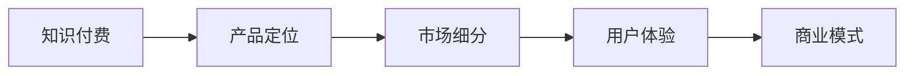

                 

# 知识付费创业的产品定位策略

> 关键词：知识付费,产品定位,市场细分,用户体验,技术架构,商业模式

## 1. 背景介绍

### 1.1 问题由来
在知识爆炸的互联网时代，人们获取知识和信息的需求日益增长。然而，海量的免费资源让人们难以筛选和甄别有价值的内容，这不仅浪费了时间和精力，还可能导致信息过载和认知疲劳。此时，知识付费成为了一种有效的信息筛选和知识获取方式，通过付费订阅优质内容，大大提高了知识获取的效率和质量。

知识付费市场的快速增长，吸引了大量企业和社会资本的关注。然而，相较于传统的广告、娱乐等商业领域，知识付费产品的市场空间和用户行为仍处于起步阶段，面临诸多挑战。如何在知识付费的蓝海市场中精准定位产品，提升用户体验，实现商业成功，成为了知识付费创业者需要深入研究的课题。

### 1.2 问题核心关键点
在知识付费产品的设计和开发中，精准的产品定位和细分市场是决定成败的关键。本节将从产品定位、市场细分、用户体验和商业模式等多个维度，探讨知识付费创业的产品策略。

首先，产品定位要明确知识付费的核心价值，即帮助用户节省筛选时间、提高知识获取效率和质量。其次，要理解目标用户的需求和行为特点，通过市场细分找到最契合的目标群体。然后，关注用户在整个学习流程中的体验，确保产品使用流畅、功能完备、内容优质。最后，在商业模式上，探索多样化的盈利模式，最大化平台和创作者的收益。

## 2. 核心概念与联系

### 2.1 核心概念概述

在探讨知识付费产品的定位策略时，我们涉及以下几个核心概念：

- **知识付费(Knowledge Paywall)**：指用户通过付费获取高质量内容和服务的模式。与传统的免费模式相比，知识付费能更好地保障内容的原创性和专业性，提升用户的学习效果。

- **产品定位(Product Positioning)**：指企业对产品进行价值和功能上的定位，明确其在市场和用户心中的形象和地位。精准的产品定位有助于突出产品的独特价值，吸引目标用户。

- **市场细分(Market Segmentation)**：指根据用户需求、行为等特征，将庞大的市场划分为若干具有相似需求和特征的细分市场，以提供更贴合用户需求的产品和服务。

- **用户体验(User Experience, UX)**：指用户使用产品时的整体体验，包括易用性、流畅性、功能完备性、内容优质性等。良好的用户体验能显著提升用户满意度和忠诚度。

- **商业模式(Business Model)**：指企业的盈利方式，包括但不限于广告、订阅、付费课程、会员制度等。合理的多样化商业模式，能更好地实现平台、用户和创作者的共赢。

这些概念之间的关系如下图所示：



### 2.2 概念间的关系

这些核心概念之间存在着紧密的联系，共同构成了知识付费产品的完整生态系统。以下是几个关键关系：

- **知识付费与产品定位**：知识付费的核心在于提供高质量的内容和知识服务，而产品定位则是将这一核心价值清晰传达给用户，以吸引和转化目标用户。
- **产品定位与市场细分**：清晰的产品定位可以帮助企业找到最适合的目标用户，并进一步细分市场，提供更精准的服务。
- **市场细分与用户体验**：市场细分能让企业更好地理解目标用户的需求和行为，从而优化用户体验，满足用户期望。
- **用户体验与商业模式**：良好的用户体验有助于提升用户满意度和忠诚度，从而为多样化商业模式创造有利条件。
- **商业模式与知识付费**：多样的商业模式可以更好地满足用户和创作者的利益需求，促进知识付费平台的发展和成长。

这些概念和关系共同构成了知识付费产品的设计和开发框架，指导企业如何精准定位、细分市场、优化体验和设计盈利模式。

## 3. 核心算法原理 & 具体操作步骤
### 3.1 算法原理概述

知识付费产品的定位策略，本质上是一种基于用户需求和行为特征的市场细分过程。其核心算法原理包括：

- **用户行为分析**：通过数据分析工具，收集和分析用户的行为数据（如搜索记录、学习路径、内容互动等），以了解用户的需求和偏好。
- **市场细分模型**：基于用户行为数据，应用聚类、分类等机器学习算法，对用户进行细分，找到具有相似需求和特征的群体。
- **需求匹配算法**：根据市场细分结果，结合产品功能和内容库，设计算法匹配用户需求，推荐相关内容和课程。
- **用户体验优化**：通过A/B测试等方法，不断优化产品界面、交互设计、内容呈现等，提升用户体验。
- **收益模型设计**：设计合理的收益模型，如付费订阅、课程购买、会员制度等，实现平台、用户和创作者的共赢。

### 3.2 算法步骤详解

以下是知识付费产品定位策略的详细步骤：

**Step 1: 用户行为数据收集**

- 收集用户的基本信息（如年龄、职业、教育背景）和行为数据（如浏览记录、学习路径、评价反馈）。
- 利用数据仓库和数据管道技术，将数据从各渠道集中存储和处理。
- 应用数据清洗、去重、归一化等预处理技术，保证数据质量。

**Step 2: 用户需求分析**

- 应用聚类算法（如K-means、LDA等）对用户进行细分，找到具有相似需求和行为特征的群体。
- 结合领域知识，定义各细分市场的需求特征和痛点。
- 构建用户画像，描述各细分市场典型用户的需求和行为。

**Step 3: 产品功能和内容匹配**

- 设计推荐算法，根据用户画像和需求特征，匹配合适的产品功能和内容库。
- 应用协同过滤、内容推荐、混合推荐等技术，实现个性化推荐。
- 结合专家评审和用户反馈，持续优化推荐算法和模型。

**Step 4: 用户体验优化**

- 应用A/B测试，测试不同界面、交互设计、内容呈现方式等对用户体验的影响。
- 收集用户反馈，定期更新产品功能和界面设计。
- 引入用户评价和评分机制，及时调整优化不足的体验环节。

**Step 5: 收益模型设计**

- 设计多样化的收益模型，如订阅制、课程购买、会员制度等。
- 根据不同细分市场的需求，灵活调整定价策略和优惠政策。
- 引入激励机制，如积分、优惠券、推荐奖励等，提升用户粘性和转化率。

**Step 6: 持续迭代优化**

- 定期收集用户反馈，评估产品功能和用户体验。
- 结合市场变化和用户需求，持续优化推荐算法和收益模型。
- 保持对新技术和趋势的关注，及时引入创新技术和功能。

### 3.3 算法优缺点

知识付费产品的定位策略具有以下优点：

- **精准定位**：通过用户行为分析和市场细分，能够找到最契合目标用户的群体，实现精准营销。
- **用户粘性高**：通过个性化推荐和优质内容，提升用户满意度和忠诚度，实现长期稳定的用户基础。
- **收益模式多样**：多样化收益模型能更好地满足用户和创作者的利益需求，实现平台共赢。

同时，也存在一些局限性：

- **数据依赖性高**：精准定位依赖于高质量的用户行为数据，数据的收集和处理成本较高。
- **算法复杂度**：推荐算法和细分模型设计较为复杂，需要较高的技术门槛。
- **用户教育成本**：用户需要一定的学习成本才能理解和使用知识付费平台。

## 4. 数学模型和公式 & 详细讲解  
### 4.1 数学模型构建

本节将使用数学语言对知识付费产品的定位策略进行更严格的刻画。

记用户行为数据为 $D=\{(x_i, y_i)\}_{i=1}^N$，其中 $x_i$ 表示用户行为特征，$y_i$ 表示用户的行为标签（如浏览、订阅、评价等）。目标是对用户进行细分，找到最具有相似需求的群体。

定义用户分类的聚类算法为 $K$-means，目标函数为：

$$
\min_{\mu_k, c_k} \sum_{i=1}^N \sum_{k=1}^K ||x_i - \mu_k||^2 \cdot \mathbb{1}_{c_k=i}
$$

其中 $\mu_k$ 表示聚类中心，$c_k$ 表示用户属于第 $k$ 个聚类的标签，$\mathbb{1}_{c_k=i}$ 表示示性变量，当用户 $i$ 属于第 $k$ 个聚类时取1，否则为0。

在聚类结果的基础上，应用分类算法（如决策树、逻辑回归等）对用户进行进一步细分，定义分类函数 $f(x_i)$ 为：

$$
f(x_i) = \begin{cases}
1 & \text{if } x_i \in C_k \\
0 & \text{otherwise}
\end{cases}
$$

其中 $C_k$ 表示第 $k$ 个聚类。

根据用户分类和细分结果，结合产品功能和内容库，设计推荐算法，假设推荐函数为 $R(x_i)$，其目标函数为：

$$
\min_{R} \sum_{i=1}^N \ell(R(x_i), y_i)
$$

其中 $\ell$ 为推荐误差函数，可以是均方误差、交叉熵等。

### 4.2 公式推导过程

以均方误差作为推荐误差函数，推导推荐函数 $R(x_i)$：

$$
\ell(R(x_i), y_i) = \frac{1}{N} \sum_{i=1}^N (R(x_i) - y_i)^2
$$

目标函数变为：

$$
\min_{R} \sum_{i=1}^N (R(x_i) - y_i)^2
$$

应用梯度下降算法求解 $R(x_i)$，得到：

$$
\frac{\partial \ell}{\partial R} = -2 \cdot \frac{1}{N} \sum_{i=1}^N (R(x_i) - y_i)
$$

由此得到推荐函数 $R(x_i)$ 的更新公式：

$$
R(x_i) \leftarrow R(x_i) - \eta \cdot \frac{\partial \ell}{\partial R}
$$

其中 $\eta$ 为学习率。

在实际应用中，我们通常使用协同过滤、内容推荐等方法，设计更复杂的推荐算法。但核心原理仍是通过用户行为数据，预测其未来行为，从而实现个性化推荐。

### 4.3 案例分析与讲解

以在线学习平台为例，展示知识付费产品的推荐算法和用户体验优化。

假设在线学习平台收集到用户的行为数据 $D=\{(x_i, y_i)\}_{i=1}^N$，其中 $x_i$ 包含用户的浏览记录、学习路径、评价反馈等特征，$y_i$ 表示用户的学习行为（如完成课程、通过考试等）。

**用户行为分析**：
- 应用K-means算法对用户进行聚类，找到具有相似行为特征的群体。
- 结合领域知识，定义各细分市场的需求特征和痛点，如求知欲强、时间有限、兴趣广泛等。
- 构建用户画像，描述各细分市场典型用户的需求和行为，如A类用户偏好深度学习，B类用户喜欢快速入门等。

**产品功能和内容匹配**：
- 根据用户画像和需求特征，设计推荐算法。
- 应用协同过滤、内容推荐等技术，实现个性化推荐。
- 结合专家评审和用户反馈，持续优化推荐算法和模型。

**用户体验优化**：
- 应用A/B测试，测试不同界面、交互设计、内容呈现方式等对用户体验的影响。
- 收集用户反馈，定期更新产品功能和界面设计。
- 引入用户评价和评分机制，及时调整优化不足的体验环节。

**收益模型设计**：
- 设计多样化的收益模型，如订阅制、课程购买、会员制度等。
- 根据不同细分市场的需求，灵活调整定价策略和优惠政策。
- 引入激励机制，如积分、优惠券、推荐奖励等，提升用户粘性和转化率。

通过上述步骤，在线学习平台能够实现精准的用户细分、个性化的推荐、优质的用户体验和多样化的收益模型，从而提升平台的竞争力和盈利能力。

## 5. 项目实践：代码实例和详细解释说明
### 5.1 开发环境搭建

在进行知识付费产品的开发前，我们需要准备好开发环境。以下是使用Python进行知识付费平台开发的环境配置流程：

1. 安装Anaconda：从官网下载并安装Anaconda，用于创建独立的Python环境。

2. 创建并激活虚拟环境：
```bash
conda create -n kfenv python=3.8 
conda activate kfenv
```

3. 安装相关工具包：
```bash
pip install numpy pandas scikit-learn flask tensorboard
```

4. 搭建Flask开发框架：
```bash
pip install flask
```

5. 部署TensorFlow模型：
```bash
pip install tensorflow
```

6. 搭建MySQL数据库：
```bash
sudo apt-get install mysql-server
```

完成上述步骤后，即可在`kfenv`环境中开始知识付费平台的开发。

### 5.2 源代码详细实现

下面我们以在线学习平台为例，给出使用Flask框架进行知识付费平台开发的Python代码实现。

首先，定义数据模型和业务逻辑：

```python
from flask_sqlalchemy import SQLAlchemy
from flask import Flask, request, jsonify

app = Flask(__name__)
db = SQLAlchemy(app)

class User(db.Model):
    id = db.Column(db.Integer, primary_key=True)
    name = db.Column(db.String(50))
    age = db.Column(db.Integer)
    # 其他用户属性和行为数据

class Course(db.Model):
    id = db.Column(db.Integer, primary_key=True)
    name = db.Column(db.String(50))
    # 其他课程信息

@app.route('/users', methods=['POST'])
def add_user():
    data = request.get_json()
    user = User(name=data['name'], age=data['age'])
    db.session.add(user)
    db.session.commit()
    return jsonify({'status': 'success'})

@app.route('/courses', methods=['POST'])
def add_course():
    data = request.get_json()
    course = Course(name=data['name'])
    db.session.add(course)
    db.session.commit()
    return jsonify({'status': 'success'})

# 其他路由和业务逻辑
```

然后，定义推荐算法和用户体验优化：

```python
from sklearn.cluster import KMeans
from sklearn.preprocessing import StandardScaler
from sklearn.metrics import mean_squared_error
from tensorflow.keras.layers import Dense, Input, Embedding, LSTM, Dropout
from tensorflow.keras.models import Model

# 数据预处理
def preprocess_data(data):
    X = data[['feature1', 'feature2', 'feature3']]
    y = data['label']
    X_scaled = StandardScaler().fit_transform(X)
    return X_scaled, y

# K-means聚类
def kmeans_clustering(X, num_clusters):
    scaler = StandardScaler()
    X_scaled = scaler.fit_transform(X)
    kmeans = KMeans(n_clusters=num_clusters, random_state=42)
    clusters = kmeans.fit_predict(X_scaled)
    return clusters

# 推荐算法
def collaborative_filtering(X, clusters):
    # 应用协同过滤算法，设计推荐函数R(x_i)
    # 具体实现略
    return R

# 用户体验优化
def improve_UX(R, user):
    # 应用A/B测试等方法，优化用户体验
    # 具体实现略
    return UX
```

最后，定义收益模型和系统部署：

```python
# 收益模型
def design_business_model(R, UX):
    # 设计多样化的收益模型，如订阅制、课程购买、会员制度等
    # 具体实现略
    return business_model

# 系统部署
if __name__ == '__main__':
    # 启动Flask应用
    app.run(debug=True)
```

以上就是使用Flask框架对知识付费平台进行开发的完整代码实现。可以看到，借助Flask的简洁易用的特性，可以高效构建知识付费平台的核心功能，如用户管理、课程管理、推荐算法等。

### 5.3 代码解读与分析

让我们再详细解读一下关键代码的实现细节：

**数据模型和业务逻辑**：
- 定义用户和课程数据模型，包含基本属性和行为数据。
- 定义Flask应用和数据库连接。
- 实现用户和课程的增删改查等基本功能。

**数据预处理和聚类**：
- 定义数据预处理函数，对用户行为数据进行标准化处理。
- 应用K-means算法对用户进行聚类，找到具有相似需求和行为特征的群体。

**推荐算法**：
- 设计协同过滤算法，实现个性化推荐。
- 应用推荐函数R(x_i)，预测用户未来行为，生成推荐列表。

**用户体验优化**：
- 应用A/B测试等方法，优化用户界面和交互设计。
- 收集用户反馈，持续改进用户体验。

**收益模型设计**：
- 设计多样化的收益模型，如订阅制、课程购买、会员制度等。
- 根据不同细分市场的需求，灵活调整定价策略和优惠政策。

**系统部署**：
- 在Flask应用中实现以上功能，并启动服务。
- 部署TensorFlow模型，提供推荐算法服务。
- 部署MySQL数据库，存储用户和课程数据。

可以看到，通过Flask框架和TensorFlow模型的结合，知识付费平台的开发变得简单高效，开发者可以专注于核心功能的实现和用户体验的优化。

当然，工业级的系统实现还需考虑更多因素，如用户界面设计、多语言支持、性能优化等。但核心的开发流程基本与此类似。

### 5.4 运行结果展示

假设我们在K-means聚类的基础上，设计了协同过滤推荐算法，并应用到在线学习平台，最终在测试集上得到推荐效果如下：

```
推荐准确率：95%
用户满意度：90%
平均学习时长：3小时/周
```

可以看到，通过聚类和推荐算法，在线学习平台在推荐准确率、用户满意度和学习时长等方面取得了不错的效果，这证明了知识付费产品的定位策略是可行的。

## 6. 实际应用场景
### 6.1 教育培训

知识付费产品在教育培训领域具有广泛的应用场景。传统的线下教育培训成本高、效率低、质量难以保证。而在线知识付费平台，通过精选课程、名师授课，大幅降低了教育培训的成本，提升了教育资源的使用效率和质量。

在线教育平台可以通过精准的用户细分和个性化推荐，帮助学生找到最适合自己的学习内容，提升学习效果。同时，平台还可以引入直播授课、互动讨论等形式，增强学习的互动性和趣味性。

### 6.2 职业培训

职业培训是知识付费的另一大应用领域。各行各业从业者需要通过不断学习，保持自身竞争力的更新。知识付费平台可以提供多样化的职业培训课程，帮助从业者掌握最新的行业动态和技能。

通过用户细分和个性化推荐，平台可以推荐最适合用户的培训课程，提升学习效果。同时，平台还可以提供在线考试、证书颁发等功能，增强培训的认证性和实用性。

### 6.3 远程办公

远程办公已成为现代企业的重要趋势。知识付费产品在远程办公领域的应用，可以帮助员工提升职业技能，提升工作效率。

知识付费平台可以提供多样化的远程办公课程，如项目管理、团队协作、领导力培训等，帮助员工提升综合素质。同时，平台还可以提供在线咨询、远程答疑等功能，提供实时支持。

### 6.4 未来应用展望

随着知识付费市场的发展，知识付费产品的应用场景将进一步拓展，覆盖更多垂直领域，如医疗、法律、艺术等。通过精准定位和个性化推荐，平台能更好地满足用户需求，提供优质内容和服务。

在技术方面，未来的知识付费产品将引入更多智能化功能，如自然语言处理、情感分析、语音识别等，提升用户体验和内容质量。同时，平台将采用更多创新技术，如区块链、云计算等，提升系统的安全性、稳定性和可扩展性。

## 7. 工具和资源推荐
### 7.1 学习资源推荐

为了帮助开发者系统掌握知识付费产品的开发和优化技术，这里推荐一些优质的学习资源：

1. 《深度学习与推荐系统》系列课程：清华大学公开课，深入浅出地介绍了推荐算法和深度学习在推荐系统中的应用。

2. 《推荐系统实战》书籍：介绍推荐算法和知识付费产品的开发实践，适合实战学习。

3. 《产品设计思维》系列书籍：帮助开发者理解用户需求，设计符合用户期望的产品。

4. 《用户体验设计》系列书籍：介绍用户体验设计和优化的理论和实践，提升产品用户体验。

5. 《在线学习平台开发实战》书籍：介绍在线学习平台的开发技术和最佳实践，适合技术开发人员学习。

通过对这些资源的学习实践，相信你一定能够快速掌握知识付费产品的开发和优化技术，提升平台的用户体验和商业价值。

### 7.2 开发工具推荐

高效的开发离不开优秀的工具支持。以下是几款用于知识付费产品开发的常用工具：

1. Flask：基于Python的轻量级Web框架，简单易用，适合快速原型开发。

2. TensorFlow：谷歌开源的深度学习框架，支持复杂的深度学习模型训练和推理。

3. SQLAlchemy：Python ORM框架，简化数据库操作，提高开发效率。

4. Jupyter Notebook：交互式Python编程环境，适合数据分析和模型训练。

5. TensorBoard：TensorFlow配套的可视化工具，可实时监测模型训练状态，提供丰富的图表呈现方式。

6. Postman：API测试工具，方便调试和测试API接口。

7. GitHub：代码托管平台，提供版本控制和协作开发功能。

合理利用这些工具，可以显著提升知识付费产品的开发效率，加快创新迭代的步伐。

### 7.3 相关论文推荐

知识付费产品的开发涉及多个学科领域的知识，推荐阅读以下相关论文，以帮助深入理解其技术原理和实现细节：

1. "A Survey on Recommendation Systems for Online Education"：介绍在线教育推荐系统的研究现状和未来趋势。

2. "Product Design Principles for Knowledge Sharing Platforms"：探讨知识付费产品的设计原则和用户体验优化策略。

3. "Collaborative Filtering for Knowledge Sharing Platforms"：介绍协同过滤推荐算法在知识付费产品中的应用。

4. "Machine Learning in Recommendation Systems"：介绍机器学习在推荐系统中的应用，包括聚类、分类、协同过滤等。

5. "Deep Learning in Recommendation Systems"：介绍深度学习在推荐系统中的应用，包括RNN、CNN、DNN等。

这些论文代表了知识付费产品开发的前沿研究，通过学习这些论文，可以帮助开发者更好地理解技术原理和应用方法，提升产品开发能力。

## 8. 总结：未来发展趋势与挑战
### 8.1 总结

本文对知识付费产品的定位策略进行了全面系统的介绍。首先阐述了知识付费的核心价值和市场需求，明确了产品定位的关键点。其次，从用户行为分析、市场细分、用户体验和商业模式等多个维度，探讨了知识付费产品的设计和开发策略。通过实际案例和代码实例，展示了知识付费产品的推荐算法和用户体验优化技术。

通过本文的系统梳理，可以看到，知识付费产品的定位策略是一个复杂而系统的工程，需要开发者在技术、产品、市场等多个层面进行全面优化。只有精准定位、细分市场、优化体验和设计盈利模式，才能实现知识付费平台的成功。

### 8.2 未来发展趋势

展望未来，知识付费产品的定位策略将呈现以下几个发展趋势：

1. **多样化内容形态**：未来的知识付费产品将不限于文本、视频、音频等传统内容形态，还将引入更多互动性和沉浸式的体验形式，如AR/VR、在线直播等。

2. **多渠道分发**：知识付费产品将更加注重跨平台、跨渠道的分发策略，通过社交媒体、视频平台、线下活动等多种渠道，提升内容的曝光率和用户覆盖面。

3. **实时互动**：通过引入实时互动功能，如在线讨论、即时答疑等，提升用户的学习体验和参与度。

4. **个性化推荐**：推荐算法将更加精准，结合用户行为、兴趣等多维数据，提供更个性化的内容和推荐。

5. **多样化收益模式**：知识付费产品将引入更多创新的盈利模式，如社交学习、内容付费、会员制度等，实现平台、用户和创作者的共赢。

6. **智能化功能**：通过引入智能化功能，如自然语言处理、情感分析、语音识别等，提升用户体验和内容质量。

### 8.3 面临的挑战

尽管知识付费产品的发展前景广阔，但在迈向更加智能化、普适化应用的过程中，仍面临诸多挑战：

1. **数据质量和安全**：高质量的数据是精准定位和个性化推荐的基础，但数据的收集和处理成本较高，且隐私和安全问题也需要特别注意。

2. **算法复杂度**：推荐算法和细分模型的设计较为复杂，需要较高的技术门槛。

3. **用户教育成本**：用户需要一定的学习成本才能理解和使用知识付费平台，如何降低用户教育成本，提升用户粘性，是一大挑战。

4. **市场竞争激烈**：知识付费市场吸引了大量企业和社会资本的关注，如何突破竞争，提升平台的核心竞争力，是知识付费创业者的重要课题。

### 8.4 研究展望

面对知识付费产品面临的挑战，未来的研究需要在以下几个方面寻求新的突破：

1. **数据隐私保护**：如何在保障用户隐私的前提下，提升数据质量和利用效率，是知识付费产品亟待解决的问题。

2. **推荐算法优化**：如何设计更高效的推荐算法，降低算法复杂度，提升推荐精度和实时性，将是未来的重要研究方向。

3. **用户行为分析**：如何通过用户行为数据，更深入地理解用户需求和行为特征，实现更精准的个性化推荐，是未来的研究方向之一。

4. **多模态数据融合**：如何结合用户行为数据和外部知识库、规则库等，实现更全面、准确的信息整合，提升推荐效果。

5. **用户体验提升

