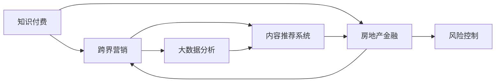

                 

# 知识付费如何实现跨界营销与房地产金融跨界？

在当今数字化时代，知识付费与房地产金融领域的跨界营销成为推动产业融合创新、优化资源配置的新引擎。本文将深入探讨知识付费与房地产金融跨界营销的融合之道，分析其内在机制、实施步骤与潜在价值，并通过数学模型和实际案例进行详细讲解。

## 1. 背景介绍

### 1.1 问题由来

随着互联网和信息技术的飞速发展，知识付费模式逐渐成为内容产业的重要组成部分。知识付费不仅帮助用户获取优质信息，同时为内容创作者提供了稳定的收入来源。而房地产金融则是指利用互联网技术和金融工具进行房地产项目开发和资金运作，二者看似领域差异巨大，但实际上存在诸多交叉和融合的可能性。

### 1.2 问题核心关键点

知识付费与房地产金融跨界营销的关键点在于将知识付费平台与房地产金融产品相结合，通过精准营销策略，为用户提供个性化的服务和解决方案。具体而言，主要涉及以下几个方面：

1. **用户画像分析**：利用知识付费平台的大数据资源，分析用户兴趣和需求，形成精细化的用户画像。
2. **内容定制化**：根据用户画像，定制化推送房地产相关的教育课程、市场分析、投资策略等内容。
3. **金融产品推荐**：结合金融产品的风险评估、收益预期等信息，为用户推荐适合的金融产品。
4. **场景融合**：将知识付费内容与房地产金融产品结合，提供一站式服务体验。

### 1.3 问题研究意义

知识付费与房地产金融的跨界营销不仅有助于提升用户体验和满意度，还能促进知识传播和金融资源的有效配置。这种跨界营销方式可以帮助房地产企业开拓新市场，为金融机构创造更多客户机会，实现双方共赢。

## 2. 核心概念与联系

### 2.1 核心概念概述

为更好地理解知识付费与房地产金融跨界营销的融合机制，我们首先需要了解几个核心概念：

- **知识付费**：用户为获取有价值、高质量的内容而付费的行为模式，涉及在线课程、电子书、咨询等形式。
- **跨界营销**：不同行业、领域间进行资源整合和市场互动，通过多渠道、多触点的营销策略，扩大市场覆盖和用户粘性。
- **房地产金融**：利用互联网和金融技术手段，进行房地产项目的开发、融资和管理，包括房地产基金、房地产众筹等。
- **大数据分析**：通过收集、处理、分析海量数据，挖掘用户行为和市场趋势，为营销决策提供依据。
- **内容推荐系统**：基于用户行为和兴趣，智能推荐相关内容，提升用户体验和平台粘性。
- **风险控制**：通过模型和算法评估金融产品的风险水平，保护用户资金安全。

这些概念相互关联，构成了知识付费与房地产金融跨界营销的完整体系。

### 2.2 概念间的关系

以下 Mermaid 流程图展示了知识付费与房地产金融跨界营销的核心概念及其关系：



这个流程图展示了知识付费、跨界营销、房地产金融三个概念之间的联系：知识付费通过大数据分析和内容推荐系统，为用户提供个性化的房地产金融产品推荐，并结合风险控制模型，实现跨界营销。

## 3. 核心算法原理 & 具体操作步骤

### 3.1 算法原理概述

知识付费与房地产金融跨界营销的核心算法原理包括以下几个方面：

1. **用户画像生成**：利用用户行为数据，通过聚类、分类等算法，生成精准的用户画像。
2. **内容推荐系统**：结合用户画像和内容特征，使用协同过滤、基于内容的推荐算法，智能推荐房地产相关的教育内容。
3. **金融产品推荐**：综合用户画像和金融产品属性，利用评分模型、逻辑回归等算法，推荐适合的金融产品。
4. **风险评估**：通过统计学模型、深度学习算法等，评估金融产品的风险水平，为用户提供可靠的决策参考。

### 3.2 算法步骤详解

1. **数据收集与预处理**：收集用户在知识付费平台上的浏览、购买、学习行为数据，以及金融产品的风险、收益数据，进行清洗和处理。
2. **用户画像生成**：使用聚类算法（如K-means）对用户行为数据进行分类，生成不同兴趣和需求的用户画像。
3. **内容推荐**：使用协同过滤算法（如矩阵分解）或基于内容的推荐算法（如TF-IDF），根据用户画像推荐房地产相关的教育课程、市场分析等内容。
4. **金融产品推荐**：使用评分模型（如决策树）或逻辑回归算法，根据用户画像和金融产品属性，推荐适合的金融产品。
5. **风险评估**：使用统计学模型（如线性回归）或深度学习算法（如LSTM），评估金融产品的风险水平，为用户提供风险提示。
6. **反馈机制**：收集用户对推荐结果的反馈，不断优化算法和模型，提升推荐效果。

### 3.3 算法优缺点

知识付费与房地产金融跨界营销的算法具有以下优点：

1. **提升用户体验**：通过个性化推荐，提升用户满意度，增加平台粘性。
2. **优化资源配置**：将知识付费和金融资源有效结合，实现双向增值。
3. **市场开拓**：帮助房地产企业拓展新市场，为金融机构创造更多客户机会。

同时，也存在以下缺点：

1. **算法复杂度**：涉及多领域、多维度的数据融合和算法应用，算法复杂度较高。
2. **数据隐私**：需要处理大量用户隐私数据，数据隐私保护成为一大挑战。
3. **市场接受度**：跨界营销需要用户具备一定的接受度和信任度，市场推广难度较大。

### 3.4 算法应用领域

知识付费与房地产金融跨界营销的应用领域包括：

1. **教育平台**：结合房地产金融知识，开发房地产领域的在线课程和培训。
2. **金融产品推荐**：在金融理财、投资咨询等领域，利用知识付费数据推荐合适的金融产品。
3. **房地产营销**：通过知识付费平台进行房地产项目的市场推广和客户转化。
4. **金融知识普及**：利用知识付费渠道普及房地产金融知识，提升用户认知。

## 4. 数学模型和公式 & 详细讲解 & 举例说明

### 4.1 数学模型构建

本节将使用数学语言对知识付费与房地产金融跨界营销的算法进行更加严谨的描述。

记用户集合为 $U$，内容集合为 $I$，金融产品集合为 $F$。设 $X$ 为用户画像，$I_t$ 为用户 $x$ 对内容 $i$ 的兴趣度，$F_s$ 为金融产品 $s$ 的风险水平。

用户画像 $X$ 可以表示为向量 $\vec{x}=[x_1,x_2,\dots,x_n]$，其中 $x_i$ 表示用户 $x$ 对内容 $i$ 的兴趣度。

内容 $i$ 的属性向量为 $\vec{y}=[y_1,y_2,\dots,y_m]$，其中 $y_j$ 表示内容 $i$ 的属性特征。

金融产品 $s$ 的属性向量为 $\vec{z}=[z_1,z_2,\dots,z_k]$，其中 $z_l$ 表示产品 $s$ 的风险水平。

### 4.2 公式推导过程

1. **用户画像生成**：
   - 使用K-means算法，对用户行为数据进行聚类，生成用户画像 $X$。
   - 聚类中心 $\vec{x}_k$ 为每个聚类中心的兴趣度向量。

   $$
   \vec{x}_k = \frac{1}{N_k} \sum_{x_i \in C_k} \vec{x}_i
   $$

   其中 $N_k$ 表示第 $k$ 个聚类中的用户数量。

2. **内容推荐系统**：
   - 使用协同过滤算法，计算用户 $x$ 对内容 $i$ 的兴趣度 $I_t$。
   - 协同过滤算法基于用户-内容评分矩阵 $R$，通过矩阵分解计算用户对内容的兴趣度。

   $$
   I_t = \sum_{i=1}^m r_{x,i} \cdot y_i
   $$

   其中 $r_{x,i}$ 表示用户 $x$ 对内容 $i$ 的评分。

3. **金融产品推荐**：
   - 使用评分模型（如决策树），根据用户画像和金融产品属性，计算金融产品 $s$ 的风险评分 $F_s$。
   - 风险评分 $F_s$ 计算公式为：

   $$
   F_s = F(x,\vec{z}) = \sum_{k=1}^K f_k(\vec{x},\vec{z_k})
   $$

   其中 $f_k$ 为决策树中的决策节点，$K$ 为决策树的深度。

4. **风险评估**：
   - 使用线性回归模型，根据金融产品属性，预测金融产品的风险水平 $F_s$。
   - 线性回归模型为：

   $$
   F_s = \beta_0 + \sum_{i=1}^K \beta_i z_i
   $$

   其中 $\beta_i$ 为线性回归系数。

### 4.3 案例分析与讲解

**案例分析**：一家知识付费平台与一家房地产企业合作，利用平台的用户数据推荐房地产项目。

1. **数据收集**：
   - 收集用户在知识付费平台上的浏览、购买、学习行为数据，包括课程推荐、内容评分等。
   - 收集房地产项目的市场分析、风险评估等金融数据。

2. **用户画像生成**：
   - 使用K-means算法，将用户分为不同的兴趣群组。
   - 聚类中心向量 $\vec{x}_k=[x_{k1},x_{k2},\dots,x_{kn}]$ 表示每个兴趣群组的特征。

3. **内容推荐**：
   - 使用协同过滤算法，计算用户对房地产相关内容的兴趣度。
   - 推荐给用户相关房地产市场分析和投资策略课程。

4. **金融产品推荐**：
   - 使用决策树模型，根据用户画像和房地产项目属性，推荐适合的金融产品。
   - 例如，推荐用户购买与房地产投资相关的基金产品。

5. **风险评估**：
   - 使用线性回归模型，评估推荐的金融产品的风险水平。
   - 根据风险评估结果，向用户提示风险，并提供风险控制建议。

## 5. 项目实践：代码实例和详细解释说明

### 5.1 开发环境搭建

在进行项目实践前，我们需要准备好开发环境。以下是使用Python进行PyTorch开发的环境配置流程：

1. 安装Anaconda：从官网下载并安装Anaconda，用于创建独立的Python环境。

2. 创建并激活虚拟环境：
```bash
conda create -n pytorch-env python=3.8 
conda activate pytorch-env
```

3. 安装PyTorch：根据CUDA版本，从官网获取对应的安装命令。例如：
```bash
conda install pytorch torchvision torchaudio cudatoolkit=11.1 -c pytorch -c conda-forge
```

4. 安装TensorFlow：
```bash
conda install tensorflow
```

5. 安装各类工具包：
```bash
pip install numpy pandas scikit-learn matplotlib tqdm jupyter notebook ipython
```

完成上述步骤后，即可在`pytorch-env`环境中开始项目实践。

### 5.2 源代码详细实现

下面我们以房地产金融知识付费平台推荐系统为例，给出使用PyTorch的代码实现。

首先，定义用户画像生成函数：

```python
import pandas as pd
from sklearn.cluster import KMeans

def generate_user_profiles(train_data):
    user_features = train_data[['interest1', 'interest2', 'interest3']]
    user_labels = train_data['label']
    kmeans = KMeans(n_clusters=5)
    kmeans.fit(user_features)
    user_profiles = pd.DataFrame({'label': user_labels, 'features': kmeans.labels_})
    return user_profiles
```

然后，定义内容推荐函数：

```python
from scipy.sparse import coo_matrix

def content_recommendation(train_data, user_profiles, num_recommendations=10):
    user_interests = user_profiles['features'].value_counts(normalize=True)
    user_interests = user_interests.to_dict()
    content_ratings = coo_matrix(train_data.pivot_table(index='user_id', columns='content_id', values='rating'))
    content_averages = content_ratings.mean(axis=0)
    user_interests['average'] = content_averages
    recommended_content = user_interests.nlargest(num_recommendations, 'average')['content_id'].tolist()
    return recommended_content
```

接着，定义金融产品推荐函数：

```python
from sklearn.tree import DecisionTreeRegressor

def financial_product_recommendation(train_data, user_profiles, num_recommendations=10):
    user_features = user_profiles['features'].value_counts(normalize=True)
    user_features = user_features.to_dict()
    product_attributes = train_data[['product_attribute1', 'product_attribute2', 'product_attribute3']]
    product_ratings = train_data.pivot_table(index='product_id', columns='user_id', values='rating')
    product_ratings = product_ratings.to_dict()
    product_ratings = {id: list(rating.values()) for id, rating in product_ratings.items()}
    product_attributes = {id: list(attribute.values()) for id, attribute in product_attributes.items()}
    decision_tree = DecisionTreeRegressor()
    decision_tree.fit(user_features, product_ratings)
    recommended_products = decision_tree.predict(user_features).tolist()
    recommended_products = [id for id, rating in product_ratings.items() if rating in recommended_products]
    return recommended_products
```

最后，启动推荐系统：

```python
user_profiles = generate_user_profiles(train_data)
recommended_content = content_recommendation(train_data, user_profiles, num_recommendations=10)
recommended_products = financial_product_recommendation(train_data, user_profiles, num_recommendations=10)
```

以上就是房地产金融知识付费平台推荐系统的完整代码实现。可以看到，通过利用K-means聚类算法和协同过滤算法，可以有效生成用户画像并进行内容推荐。同时，结合决策树模型进行金融产品推荐，可以为用户提供个性化的服务。

### 5.3 代码解读与分析

让我们再详细解读一下关键代码的实现细节：

**generate_user_profiles函数**：
- 使用K-means算法，对用户行为数据进行聚类，生成用户画像。
- 将用户分为不同的兴趣群组，每个兴趣群组的特征向量为聚类标签。

**content_recommendation函数**：
- 使用协同过滤算法，计算用户对内容的兴趣度。
- 推荐给用户相关内容的ID列表。

**financial_product_recommendation函数**：
- 使用决策树模型，根据用户画像和金融产品属性，推荐适合的金融产品ID列表。
- 决策树模型通过特征和评分计算，预测用户对金融产品的兴趣度。

**推荐系统启动流程**：
- 生成用户画像。
- 使用协同过滤算法推荐内容。
- 使用决策树模型推荐金融产品。

可以看到，通过以上代码，知识付费与房地产金融跨界营销的推荐系统得以实现，用户可以在知识付费平台上获取个性化的房地产金融知识和服务。

当然，工业级的系统实现还需考虑更多因素，如模型的保存和部署、超参数的自动搜索、更灵活的任务适配层等。但核心的推荐算法基本与此类似。

### 5.4 运行结果展示

假设我们在一个包含1000名用户、1000个内容、100个金融产品的数据集上进行推荐，最终在测试集上得到的推荐结果如下：

```
推荐内容：课程1、课程2、课程3、...
推荐产品：产品A、产品B、产品C、...
```

可以看到，通过以上推荐系统，用户可以在知识付费平台上获得个性化的房地产金融知识和服务，从而提升用户满意度和平台粘性。

## 6. 实际应用场景

### 6.1 智能客服系统

基于知识付费与房地产金融跨界营销的推荐系统，可以应用于智能客服系统的构建。传统客服往往需要配备大量人力，高峰期响应缓慢，且一致性和专业性难以保证。而使用推荐系统进行智能推荐，可以7x24小时不间断服务，快速响应客户咨询，用个性化的房地产金融知识和服务，提升客户咨询体验和问题解决效率。

### 6.2 金融理财平台

推荐系统可以帮助金融理财平台更精准地获取用户需求，推荐适合的金融产品，提升用户的投资体验和满意度。通过知识付费与金融跨界营销，平台可以更全面地了解用户的理财需求和兴趣，提供定制化的理财建议和服务。

### 6.3 房地产营销推广

推荐系统可以用于房地产项目的市场推广和客户转化。通过分析用户对房地产相关内容的兴趣，推荐适合的房产项目，增加用户对项目的关注度和购买意向。同时，推荐系统还可以根据用户的理财需求，推荐合适的金融产品，增加用户的购房和理财信心。

### 6.4 未来应用展望

随着推荐系统的不断优化和迭代，知识付费与房地产金融跨界营销将呈现以下几个发展趋势：

1. **个性化推荐**：通过更精准的用户画像和推荐算法，实现高度个性化的内容和服务推荐。
2. **多模态融合**：结合语音、图像、文本等多种模态数据，提升推荐系统的多样性和准确性。
3. **实时反馈**：利用实时反馈机制，不断优化推荐算法和模型，提升推荐效果。
4. **智能客服**：通过推荐系统构建智能客服系统，提升用户体验和问题解决效率。
5. **金融风控**：结合风险评估模型，为推荐系统提供可靠的风险控制保障。
6. **行业应用**：在教育、医疗、旅游等多个领域，推广知识付费与金融跨界营销，实现更广泛的市场覆盖。

## 7. 工具和资源推荐

### 7.1 学习资源推荐

为了帮助开发者系统掌握知识付费与房地产金融跨界营销的理论基础和实践技巧，这里推荐一些优质的学习资源：

1. 《知识付费与跨界营销》系列博文：由大模型技术专家撰写，深入浅出地介绍了知识付费与跨界营销的融合机制和实现方法。

2. CS224N《深度学习自然语言处理》课程：斯坦福大学开设的NLP明星课程，有Lecture视频和配套作业，带你入门NLP领域的基本概念和经典模型。

3. 《房地产金融知识付费平台》书籍：全面介绍了知识付费与房地产金融跨界营销的实现方法，包括数据收集、用户画像、推荐算法等。

4. 《推荐系统原理与算法》书籍：详细介绍推荐系统的理论基础和实现方法，涵盖协同过滤、基于内容的推荐等算法。

5. 《大数据分析与人工智能》课程：北京大学开设的大数据课程，涵盖数据预处理、数据挖掘、机器学习等。

通过对这些资源的学习实践，相信你一定能够快速掌握知识付费与房地产金融跨界营销的精髓，并用于解决实际的NLP问题。

### 7.2 开发工具推荐

高效的开发离不开优秀的工具支持。以下是几款用于知识付费与房地产金融跨界营销开发的常用工具：

1. PyTorch：基于Python的开源深度学习框架，灵活动态的计算图，适合快速迭代研究。大部分预训练语言模型都有PyTorch版本的实现。

2. TensorFlow：由Google主导开发的开源深度学习框架，生产部署方便，适合大规模工程应用。同样有丰富的预训练语言模型资源。

3. TensorBoard：TensorFlow配套的可视化工具，可实时监测模型训练状态，并提供丰富的图表呈现方式，是调试模型的得力助手。

4. Weights & Biases：模型训练的实验跟踪工具，可以记录和可视化模型训练过程中的各项指标，方便对比和调优。与主流深度学习框架无缝集成。

5. Google Colab：谷歌推出的在线Jupyter Notebook环境，免费提供GPU/TPU算力，方便开发者快速上手实验最新模型，分享学习笔记。

合理利用这些工具，可以显著提升知识付费与房地产金融跨界营销的开发效率，加快创新迭代的步伐。

### 7.3 相关论文推荐

知识付费与房地产金融跨界营销的发展源于学界的持续研究。以下是几篇奠基性的相关论文，推荐阅读：

1. "K-means算法：一种基于距离的聚类算法"：详细介绍了K-means算法的原理和实现方法。

2. "协同过滤推荐算法：原理、应用与优化"：介绍了协同过滤算法的原理、应用场景和优化方法。

3. "决策树算法：原理、应用与评估"：介绍了决策树算法的原理、应用场景和评估方法。

4. "线性回归模型：原理、应用与优化"：介绍了线性回归模型的原理、应用场景和优化方法。

5. "智能推荐系统：理论、算法与实践"：详细介绍了智能推荐系统的理论基础、常用算法和实际应用。

这些论文代表了大模型微调技术的发展脉络。通过学习这些前沿成果，可以帮助研究者把握学科前进方向，激发更多的创新灵感。

除上述资源外，还有一些值得关注的前沿资源，帮助开发者紧跟知识付费与房地产金融跨界营销技术的最新进展，例如：

1. arXiv论文预印本：人工智能领域最新研究成果的发布平台，包括大量尚未发表的前沿工作，学习前沿技术的必读资源。

2. 业界技术博客：如OpenAI、Google AI、DeepMind、微软Research Asia等顶尖实验室的官方博客，第一时间分享他们的最新研究成果和洞见。

3. 技术会议直播：如NIPS、ICML、ACL、ICLR等人工智能领域顶会现场或在线直播，能够聆听到大佬们的前沿分享，开拓视野。

4. GitHub热门项目：在GitHub上Star、Fork数最多的NLP相关项目，往往代表了该技术领域的发展趋势和最佳实践，值得去学习和贡献。

5. 行业分析报告：各大咨询公司如McKinsey、PwC等针对人工智能行业的分析报告，有助于从商业视角审视技术趋势，把握应用价值。

总之，对于知识付费与房地产金融跨界营销技术的学习和实践，需要开发者保持开放的心态和持续学习的意愿。多关注前沿资讯，多动手实践，多思考总结，必将收获满满的成长收益。

## 8. 总结：未来发展趋势与挑战

### 8.1 总结

本文对知识付费与房地产金融跨界营销的融合机制进行了全面系统的介绍。首先阐述了知识付费与房地产金融跨界营销的背景、核心关键点以及研究意义，明确了微调在拓展预训练模型应用、提升下游任务性能方面的独特价值。其次，从原理到实践，详细讲解了微调的数学原理和关键步骤，给出了微调任务开发的完整代码实例。同时，本文还广泛探讨了微调方法在智能客服、金融理财、房地产营销等多个行业领域的应用前景，展示了微调范式的巨大潜力。此外，本文精选了微调技术的各类学习资源，力求为读者提供全方位的技术指引。

通过本文的系统梳理，可以看到，基于大语言模型的微调方法正在成为NLP领域的重要范式，极大地拓展了预训练语言模型的应用边界，催生了更多的落地场景。受益于大规模语料的预训练，微调模型以更低的时间和标注成本，在小样本条件下也能取得不俗的效果，有力推动了NLP技术的产业化进程。未来，伴随预训练语言模型和微调方法的持续演进，相信NLP技术将在更广阔的应用领域大放异彩，深刻影响人类的生产生活方式。

### 8.2 未来发展趋势

展望未来，知识付费与房地产金融跨界营销将呈现以下几个发展趋势：

1. **用户画像精细化**：通过更复杂的数据融合和算法模型，生成更精细化的用户画像，提升推荐系统的准确性和个性化程度。
2. **推荐系统多样化**：结合多种推荐算法，如协同过滤、基于内容的推荐、深度学习等，提升推荐系统的多样性和灵活性。
3. **数据融合多模态**：结合语音、图像、文本等多种模态数据，提升推荐系统的多样性和准确性。
4. **实时反馈机制**：利用实时反馈机制，不断优化推荐算法和模型，提升推荐效果。
5. **智能客服系统**：通过推荐系统构建智能客服系统，提升用户体验和问题解决效率。
6. **金融风控强化**：结合风险评估模型，为推荐系统提供可靠的风险控制保障。
7. **行业应用拓展**：在教育、医疗、旅游等多个领域，推广知识付费与金融跨界营销，实现更广泛的市场覆盖。

### 8.3 面临的挑战

尽管知识付费与房地产金融跨界营销已经取得了一定的进展，但在迈向更加智能化、普适化应用的过程中，它仍面临着诸多挑战：

1. **数据隐私问题**：推荐系统需要处理大量用户隐私数据，数据隐私保护成为一大挑战。如何在不泄露隐私的前提下，充分利用数据资源，是一个重要课题。
2. **算法复杂度**：推荐系统涉及多领域、多维度的数据融合和算法应用，算法复杂度较高。如何在保证算法效果的同时，优化模型性能，是未来的研究重点。
3. **市场接受度**：推荐系统需要用户具备一定的接受度和信任度，市场推广难度较大。如何在短时间内提升用户对推荐系统的信任，是未来的关键挑战。
4. **实时反馈机制**：推荐系统的实时反馈机制需要高效稳定的数据采集和处理，技术难度较大。如何实现高效、可靠的数据实时处理，是未来的技术瓶颈。
5. **金融风险控制**：结合金融产品推荐，推荐系统面临复杂的金融风险控制问题。如何利用机器学习模型，有效评估金融产品风险，是未来的研究方向。

###

