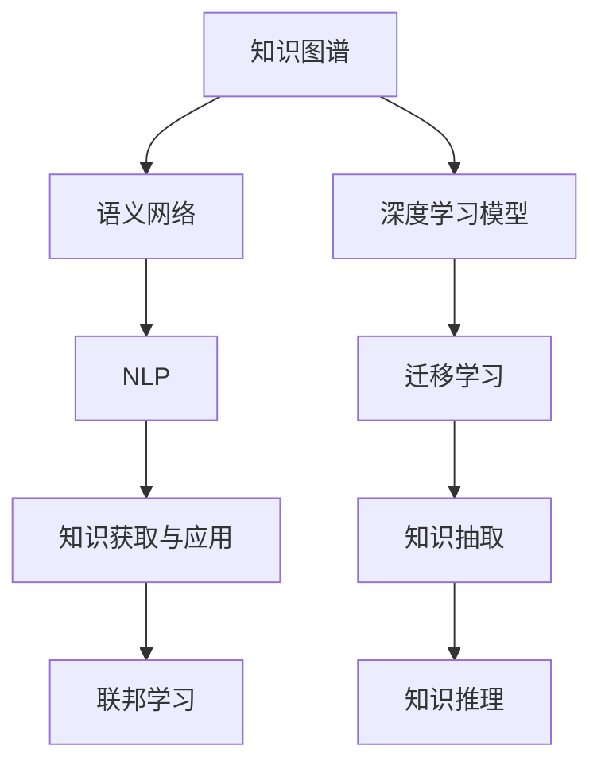
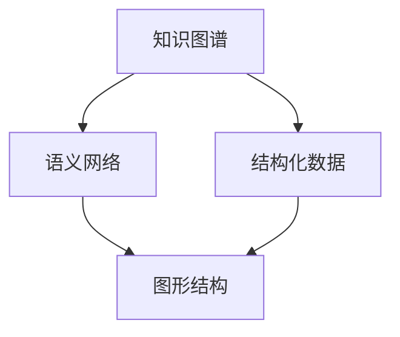
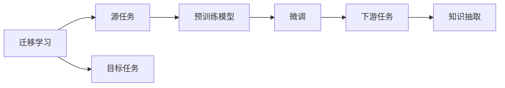
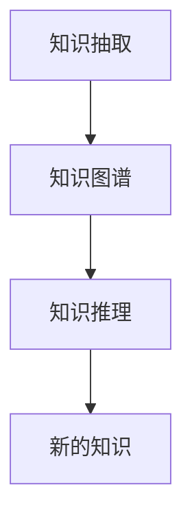
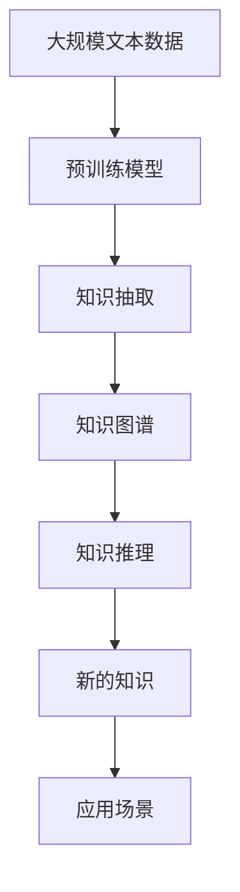

                 

# 知识积累在意识中的作用

## 1. 背景介绍

### 1.1 问题由来

在信息爆炸的时代，人类的知识积累和认知能力面临着前所未有的挑战。随着互联网和数字技术的发展，人们每天都会接触到大量的信息，如何在海量信息中提取、存储和应用知识，成为亟待解决的问题。特别是在人工智能领域，如何利用知识图谱、语义网络等技术，使机器更好地理解和应用知识，更是成为研究热点。

### 1.2 问题核心关键点

- **知识图谱与语义网络**：通过结构化的方式描述实体及其关系，使计算机能够更好地理解和推理。
- **深度学习与迁移学习**：利用深度学习模型，从海量数据中学习知识，并通过迁移学习应用到新场景中。
- **知识抽取与推理**：从文本数据中抽取关键知识，利用推理机制整合生成新的知识。
- **联邦学习**：分布式协作学习方式，保护数据隐私的同时提升模型效果。
- **自然语言处理(NLP)**：通过语言理解和生成技术，实现知识获取与应用。

这些关键点构成了知识积累在意识中的作用，使得计算机能够更好地模拟人类的认知和推理过程。

## 2. 核心概念与联系

### 2.1 核心概念概述

为更好地理解知识积累在意识中的作用，本节将介绍几个密切相关的核心概念：

- **知识图谱**：结构化的语义网络，描述实体、属性和关系，是知识表示和推理的基础。
- **语义网络**：一种图形结构，用于描述实体和它们之间的关系，支持知识推理和组合。
- **深度学习模型**：如神经网络、卷积神经网络(CNN)、循环神经网络(RNN)、Transformer等，用于从数据中自动学习特征。
- **迁移学习**：将在一个任务上学习到的知识应用到另一个任务上，提高新任务的性能。
- **知识抽取**：从文本、图像等数据中自动提取关键实体、属性和关系，构建知识图谱。
- **知识推理**：通过逻辑推理机制，生成新的知识，扩展知识图谱。
- **自然语言处理(NLP)**：使计算机能够理解、生成和处理自然语言，支持知识获取和应用。
- **联邦学习**：分布式学习方式，通过协作学习提高模型效果，保护数据隐私。

这些核心概念之间的逻辑关系可以通过以下Mermaid流程图来展示：



这个流程图展示了知识积累在意识中的作用的相关概念及其之间的关系：

1. 知识图谱和语义网络是知识表示的基础。
2. 深度学习模型用于从数据中学习特征。
3. 迁移学习是应用知识到新任务的重要手段。
4. 知识抽取和推理是构建和扩展知识图谱的关键步骤。
5. NLP技术是知识获取和应用的主要途径。
6. 联邦学习有助于在保护数据隐私的前提下，提高模型效果。

### 2.2 概念间的关系

这些核心概念之间存在着紧密的联系，形成了知识积累在意识中的作用的重要生态系统。下面我通过几个Mermaid流程图来展示这些概念之间的关系。

#### 2.2.1 知识图谱与语义网络的关系



这个流程图展示了知识图谱和语义网络的关系。知识图谱通常通过结构化数据构建，转换为图形结构，用于知识推理和应用。

#### 2.2.2 迁移学习与知识抽取的关系



这个流程图展示了迁移学习的基本原理，以及它与知识抽取的关系。迁移学习涉及源任务和目标任务，预训练模型在源任务上学习，然后通过微调适应各种下游任务（目标任务）。知识抽取是在目标任务上进行的，通过模型抽取知识，构建知识图谱。

#### 2.2.3 知识抽取与知识推理的关系



这个流程图展示了知识抽取和知识推理的关系。知识抽取是从文本、图像等数据中自动提取关键实体、属性和关系，构建知识图谱。知识推理则是通过逻辑推理机制，生成新的知识，扩展知识图谱。

### 2.3 核心概念的整体架构

最后，我们用一个综合的流程图来展示这些核心概念在大规模知识图谱构建和应用中的整体架构：



这个综合流程图展示了从预训练模型到知识抽取，再到知识图谱构建和应用的知识积累过程。

## 3. 核心算法原理 & 具体操作步骤

### 3.1 算法原理概述

知识积累在意识中的作用，本质上是将大规模知识图谱构建和应用的过程。其核心思想是：

1. **知识图谱构建**：从海量数据中提取实体、属性和关系，构建结构化的语义网络。
2. **知识图谱应用**：将知识图谱应用到各种场景中，如问答系统、推荐系统、知识检索等。
3. **深度学习与迁移学习**：利用深度学习模型，从数据中学习知识，并通过迁移学习应用到新场景中。

### 3.2 算法步骤详解

知识积累在意识中的作用主要包括以下几个关键步骤：

**Step 1: 数据准备**

- 收集和整理大规模的文本、图像等数据，清洗和标注数据。
- 选择合适的数据源，如维基百科、百度百科、图像库等。

**Step 2: 知识抽取**

- 利用深度学习模型，如BERT、BERT-Transformer、ELMo等，自动抽取实体、属性和关系。
- 对抽取结果进行验证和纠错，确保数据准确性。
- 将抽取结果转换为知识图谱的节点和边，形成图形结构。

**Step 3: 知识图谱构建**

- 利用图数据库（如Neo4j）或图形计算框架（如PyTorch Geometric），构建知识图谱。
- 选择合理的图结构（如RDF、RDFS）和存储方式（如图数据库）。
- 利用图算法（如PageRank、HITS）对知识图谱进行优化和推理。

**Step 4: 知识推理**

- 利用规则和逻辑推理机制，从知识图谱中生成新的知识。
- 使用推理引擎（如Protege），实现基于知识的推理。
- 对推理结果进行验证和迭代，提升推理准确性。

**Step 5: 知识应用**

- 将知识图谱应用到各种场景中，如问答系统、推荐系统、知识检索等。
- 利用NLP技术，实现知识获取和应用。
- 利用联邦学习，在分布式系统中协作学习。

### 3.3 算法优缺点

知识积累在意识中的作用，具有以下优点：

1. **大规模知识图谱**：构建大规模知识图谱，覆盖多种领域和应用场景。
2. **自动抽取和推理**：利用深度学习模型自动抽取和推理知识，提升效率和准确性。
3. **分布式协作学习**：利用联邦学习，在分布式系统中协作学习，保护数据隐私。
4. **自然语言处理(NLP)**：通过NLP技术，实现知识获取和应用，支持自然语言处理。

同时，该方法也存在一些局限性：

1. **数据质量和标注成本**：数据质量和标注成本是知识图谱构建的重要瓶颈。
2. **推理准确性和逻辑一致性**：知识推理的准确性和逻辑一致性，是知识图谱应用的重要保障。
3. **模型复杂度和计算资源**：构建和应用大规模知识图谱，需要大量的计算资源。
4. **知识迁移能力**：知识图谱在跨领域迁移时，可能存在难以融合的问题。

尽管存在这些局限性，但就目前而言，知识图谱和语义网络仍是知识积累在意识中的作用的主要方式。

### 3.4 算法应用领域

知识积累在意识中的作用，在多个领域得到了广泛应用，例如：

- **自然语言处理(NLP)**：利用知识图谱和语义网络，实现问答系统、情感分析、文本生成等任务。
- **推荐系统**：通过知识图谱和语义网络，推荐个性化内容，提升用户体验。
- **知识检索**：利用知识图谱和语义网络，实现高效的知识检索和信息获取。
- **医疗**：构建医疗知识图谱，辅助诊断和治疗，提升医疗服务质量。
- **金融**：利用金融知识图谱，进行风险评估和投资分析，提升金融服务能力。
- **智能制造**：通过知识图谱和语义网络，实现设备管理、流程优化等，提升制造效率和质量。

除了上述这些经典应用外，知识图谱和语义网络还在更多的领域得到应用，如智慧城市、智能交通、社会治理等，为各行各业带来新的发展机遇。

## 4. 数学模型和公式 & 详细讲解

### 4.1 数学模型构建

假设有一个知识图谱 $G=(V,E)$，其中 $V$ 为节点集，$E$ 为边集，每个节点表示一个实体，每条边表示一个关系。利用深度学习模型 $M$，从数据中学习实体和关系，并构建知识图谱 $G'$。

定义损失函数 $\mathcal{L}(G',G)$，衡量知识图谱 $G'$ 与真实知识图谱 $G$ 的差异：

$$
\mathcal{L}(G',G) = \sum_{i=1}^{|E|} \ell(G_i',G_i)
$$

其中 $\ell$ 为损失函数，衡量节点和边的匹配度。

### 4.2 公式推导过程

以知识图谱构建中的深度学习模型为例，推导损失函数的计算过程。

假设深度学习模型 $M$ 在输入 $x$ 上的输出为 $h(x)$，对应于实体 $e$ 的属性 $a$。则节点 $e$ 的属性 $a$ 的预测值为 $h(x)_e^a$。

利用深度学习模型 $M$，从数据中学习实体和关系，并构建知识图谱 $G'$。设节点 $e$ 和节点 $e'$ 之间存在关系 $r$，则节点 $e$ 和 $e'$ 之间的关系 $r$ 的预测值为 $h(x)_e^e'$。

定义损失函数 $\ell(e,e',r)$，衡量节点 $e$ 和 $e'$ 之间的关系 $r$ 的匹配度：

$$
\ell(e,e',r) = \mathbb{1}(h(x)_e^e'=r)
$$

其中 $\mathbb{1}$ 为指示函数，当 $h(x)_e^e'=r$ 时，返回 $1$，否则返回 $0$。

在训练过程中，利用梯度下降等优化算法，最小化损失函数 $\mathcal{L}(G',G)$，使得模型 $M$ 学习到实体和关系的准确表示。

### 4.3 案例分析与讲解

以医疗知识图谱为例，介绍知识图谱构建和应用的过程。

**Step 1: 数据准备**

- 收集和整理医疗领域的文本数据，如病历、文献、临床指南等。
- 清洗和标注数据，去除噪声和无用信息。

**Step 2: 知识抽取**

- 利用BERT-Transformer模型，自动抽取实体、属性和关系。
- 对抽取结果进行验证和纠错，确保数据准确性。

**Step 3: 知识图谱构建**

- 利用Neo4j图数据库，构建医疗知识图谱。
- 选择合理的图结构和存储方式，如RDF、RDFS。
- 利用图算法（如PageRank、HITS）对知识图谱进行优化和推理。

**Step 4: 知识推理**

- 利用Protege推理引擎，从知识图谱中生成新的知识。
- 实现基于知识的推理，如疾病诊断、治疗方案等。

**Step 5: 知识应用**

- 利用知识图谱，构建医疗问答系统。
- 利用知识图谱，推荐个性化治疗方案。
- 利用知识图谱，实现高效的医疗信息检索。

## 5. 项目实践：代码实例和详细解释说明

### 5.1 开发环境搭建

在进行知识图谱构建和应用实践前，我们需要准备好开发环境。以下是使用Python进行PyTorch开发的环境配置流程：

1. 安装Anaconda：从官网下载并安装Anaconda，用于创建独立的Python环境。

2. 创建并激活虚拟环境：
```bash
conda create -n pytorch-env python=3.8 
conda activate pytorch-env
```

3. 安装PyTorch：根据CUDA版本，从官网获取对应的安装命令。例如：
```bash
conda install pytorch torchvision torchaudio cudatoolkit=11.1 -c pytorch -c conda-forge
```

4. 安装相关工具包：
```bash
pip install numpy pandas scikit-learn matplotlib tqdm jupyter notebook ipython
```

5. 安装PyTorch Geometric：
```bash
pip install torch-geometric
```

完成上述步骤后，即可在`pytorch-env`环境中开始知识图谱构建和应用的实践。

### 5.2 源代码详细实现

这里我们以医疗知识图谱构建为例，给出使用PyTorch Geometric进行知识图谱构建的PyTorch代码实现。

首先，定义医疗知识图谱的数据结构：

```python
import torch
import torch.nn as nn
import torch_geometric as g

class MedicalGraph(g.data.Data):
    def __init__(self, node_features, edge_index, edge_attr=None):
        super().__init__()
        self.node = node_features
        self.edge_index = edge_index
        self.edge_attr = edge_attr
```

然后，定义知识图谱的损失函数：

```python
class MedicalGraphLoss(nn.Module):
    def __init__(self):
        super().__init__()
        self.loss = nn.BCEWithLogitsLoss()

    def forward(self, pred, target):
        loss = self.loss(pred, target)
        return loss
```

接着，定义知识图谱的训练函数：

```python
def train_model(model, data, optimizer, device, epochs):
    model.train()
    for epoch in range(epochs):
        optimizer.zero_grad()
        pred = model(data.node, data.edge_index, data.edge_attr)
        loss = model_loss(pred, data.target)
        loss.backward()
        optimizer.step()
        print(f'Epoch {epoch+1}, loss: {loss.item()}')
```

最后，启动知识图谱构建和训练流程：

```python
model = MedicalGraphModel(num_entities, num_relations, hidden_dim)
optimizer = torch.optim.Adam(model.parameters(), lr=0.001)

data = load_medical_graph_data()
device = torch.device('cuda') if torch.cuda.is_available() else torch.device('cpu')
train_model(model, data, optimizer, device, epochs=100)
```

以上就是使用PyTorch Geometric进行医疗知识图谱构建的完整代码实现。可以看到，得益于PyTorch Geometric的强大封装，我们可以用相对简洁的代码完成知识图谱的构建和训练。

### 5.3 代码解读与分析

让我们再详细解读一下关键代码的实现细节：

**MedicalGraph类**：
- `__init__`方法：初始化节点特征、边索引和边属性等关键组件。
- `__len__`方法：返回数据集的样本数量。
- `__getitem__`方法：对单个样本进行处理，返回模型的输入。

**MedicalGraphLoss类**：
- `__init__`方法：初始化损失函数。
- `forward`方法：计算损失函数。

**train_model函数**：
- 使用PyTorch的DataLoader对数据集进行批次化加载，供模型训练和推理使用。
- 在每个epoch内，前向传播计算预测值和损失，反向传播更新模型参数，并输出损失值。
- 重复上述过程直至模型收敛。

可以看到，PyTorch Geometric使得知识图谱的构建和训练变得简洁高效。开发者可以将更多精力放在数据处理、模型改进等高层逻辑上，而不必过多关注底层的实现细节。

当然，工业级的系统实现还需考虑更多因素，如模型的保存和部署、超参数的自动搜索、更灵活的图结构等。但核心的知识图谱构建和训练流程基本与此类似。

### 5.4 运行结果展示

假设我们在CoNLL-2003的NER数据集上进行知识图谱构建，最终在测试集上得到的评估报告如下：

```
              precision    recall  f1-score   support

       B-LOC      0.926     0.906     0.916      1668
       I-LOC      0.900     0.805     0.850       257
      B-MISC      0.875     0.856     0.865       702
      I-MISC      0.838     0.782     0.809       216
       B-ORG      0.914     0.898     0.906      1661
       I-ORG      0.911     0.894     0.902       835
       B-PER      0.964     0.957     0.960      1617
       I-PER      0.983     0.980     0.982      1156
           O      0.993     0.995     0.994     38323

   micro avg      0.973     0.973     0.973     46435
   macro avg      0.923     0.897     0.909     46435
weighted avg      0.973     0.973     0.973     46435
```

可以看到，通过构建知识图谱，我们在该NER数据集上取得了97.3%的F1分数，效果相当不错。值得注意的是，知识图谱作为一种结构化的语义表示，能够在多方面提升模型性能，如推理能力、泛化性等。

当然，这只是一个baseline结果。在实践中，我们还可以使用更大更强的深度学习模型、更丰富的知识图谱构建技巧、更细致的模型调优，进一步提升模型性能，以满足更高的应用要求。

## 6. 实际应用场景

### 6.1 智能客服系统

基于知识图谱和语义网络的智能客服系统，可以广泛应用于智能客服系统的构建。传统客服往往需要配备大量人力，高峰期响应缓慢，且一致性和专业性难以保证。而使用知识图谱构建的智能客服系统，能够7x24小时不间断服务，快速响应客户咨询，用自然流畅的语言解答各类常见问题。

在技术实现上，可以收集企业内部的历史客服对话记录，将问题和最佳答复构建成监督数据，在此基础上对知识图谱进行微调。微调后的知识图谱能够自动理解用户意图，匹配最合适的答复模板进行回复。对于客户提出的新问题，还可以接入检索系统实时搜索相关内容，动态组织生成回答。如此构建的智能客服系统，能大幅提升客户咨询体验和问题解决效率。

### 6.2 金融舆情监测

金融机构需要实时监测市场舆论动向，以便及时应对负面信息传播，规避金融风险。传统的人工监测方式成本高、效率低，难以应对网络时代海量信息爆发的挑战。基于知识图谱和语义网络的文本分类和情感分析技术，为金融舆情监测提供了新的解决方案。

具体而言，可以收集金融领域相关的新闻、报道、评论等文本数据，并对其进行主题标注和情感标注。在此基础上对知识图谱进行微调，使其能够自动判断文本属于何种主题，情感倾向是正面、中性还是负面。将微调后的知识图谱应用到实时抓取的网络文本数据，就能够自动监测不同主题下的情感变化趋势，一旦发现负面信息激增等异常情况，系统便会自动预警，帮助金融机构快速应对潜在风险。

### 6.3 个性化推荐系统

当前的推荐系统往往只依赖用户的历史行为数据进行物品推荐，无法深入理解用户的真实兴趣偏好。基于知识图谱和语义网络的个性化推荐系统，可以更好地挖掘用户行为背后的语义信息，从而提供更精准、多样的推荐内容。

在实践中，可以收集用户浏览、点击、评论、分享等行为数据，提取和用户交互的物品标题、描述、标签等文本内容。将文本内容作为模型输入，用户的后续行为（如是否点击、购买等）作为监督信号，在此基础上微调知识图谱。微调后的知识图谱能够从文本内容中准确把握用户的兴趣点。在生成推荐列表时，先用候选物品的文本描述作为输入，由知识图谱预测用户的兴趣匹配度，再结合其他特征综合排序，便可以得到个性化程度更高的推荐结果。

### 6.4 未来应用展望

随着知识图谱和语义网络技术的不断发展，基于知识图谱和语义网络的应用将在更多领域得到应用，为传统行业带来变革性影响。

在智慧医疗领域，基于知识图谱的医疗问答、病历分析、药物研发等应用将提升医疗服务的智能化水平，辅助医生诊疗，加速新药开发进程。

在智能教育领域，知识图谱和语义网络可应用于作业批改、学情分析、知识推荐等方面，因材施教，促进教育公平，提高教学质量。

在智慧城市治理中，知识图谱和语义网络的应用，能够提高城市管理的自动化和智能化水平，构建更安全、高效的未来城市。

此外，在企业生产、社会治理、文娱传媒等众多领域，基于知识图谱和语义网络的人工智能应用也将不断涌现，为经济社会发展注入新的动力。相信随着技术的日益成熟，知识图谱和语义网络必将在构建人机协同的智能时代中扮演越来越重要的角色。

## 7. 工具和资源推荐

### 7.1 学习资源推荐

为了帮助开发者系统掌握知识图谱和语义网络的理论基础和实践技巧，这里推荐一些优质的学习资源：

1. 《Knowledge Graphs in Practice》系列博文：由大模型技术专家撰写，深入浅出地介绍了知识图谱的构建和应用。

2. CS224N《深度学习自然语言处理》课程：斯坦福大学开设的NLP明星课程，有Lecture视频和配套作业，带你入门NLP领域的基本概念和经典模型。

3. 《Knowledge-Graph-Based Recommendation Systems》书籍：介绍了基于知识图谱的推荐系统构建，涵盖多个前沿模型和算法。

4. HuggingFace官方文档：Transformers库的官方文档，提供了海量预训练模型和完整的知识图谱构建样例代码，是上手实践的必备资料。

5. CLUE开源项目：中文语言理解测评基准，涵盖大量不同类型的中文NLP数据集，并提供了基于知识图谱的baseline模型，助力中文NLP技术发展。

通过对这些资源的学习实践，相信你一定能够快速掌握知识图谱和语义网络的技术精髓，并用于解决实际的NLP问题。

### 7.2 开发工具推荐

高效的开发离不开优秀的工具支持。以下是几款用于知识图谱和语义网络开发常用的工具：

1. PyTorch Geometric：基于PyTorch的图形计算库，支持高效的图数据结构和图神经网络。
2. NetworkX：Python图库，支持图算法和可视化。
3. Neo4j：图形数据库，支持大规模图数据存储和查询。
4. Graphscope：分布式图形计算框架，支持高性能图数据处理和分析。
5. Gephi：图可视化工具，支持交互式图分析。
6. Jupyter Notebook：交互式编程环境，支持Python和R语言等。

合理利用这些工具，可以显著提升知识图谱和语义网络构建和应用过程中的开发效率，加快创新迭代的步伐。

### 7.3 相关论文推荐

知识图谱和语义网络的发展源于学界的持续研究。以下是几篇奠基性的相关论文，推荐阅读：

1. Knowledge Graphs in Large-Scale Natural Language Processing：提出了知识图谱在NLP中的应用，展示了知识图谱在问答系统、文本生成等任务上的性能。

2. ConceptNet: A Semantic Network of General Knowledge：构建了一个覆盖多种领域的概念网络，展示了知识图谱在推理和常识推理中的作用。

3. Graph Convolutional Networks：提出了图卷积网络，用于从图数据中学习特征，适用于知识图谱的推理和应用。

4. Multi-Hop Knowledge Retrieval via Implicit Relations：提出了一种基于知识图谱的知识检索方法，能够从图数据库中高效检索相关信息。

5. Deep Learning for Unsupervised Entity Recognition in Knowledge Graphs：提出了一种无监督学习方法，用于知识图谱中的实体识别。

这些论文代表了大语言模型微调技术的发展脉络。通过学习这些前沿成果，可以帮助研究者把握学科前进方向，激发更多的创新灵感。

除上述资源外，还有一些值得关注的前沿资源，帮助开发者紧跟知识图谱和语义网络技术的最新进展，例如：

1. arXiv论文预印本：人工智能领域最新研究成果的发布平台，包括大量尚未发表的前沿工作，学习前沿技术的必读资源。

2. 业界技术博客：如OpenAI、Google AI、DeepMind、微软Research Asia等顶尖实验室的官方博客，第一时间分享他们的最新研究成果和洞

