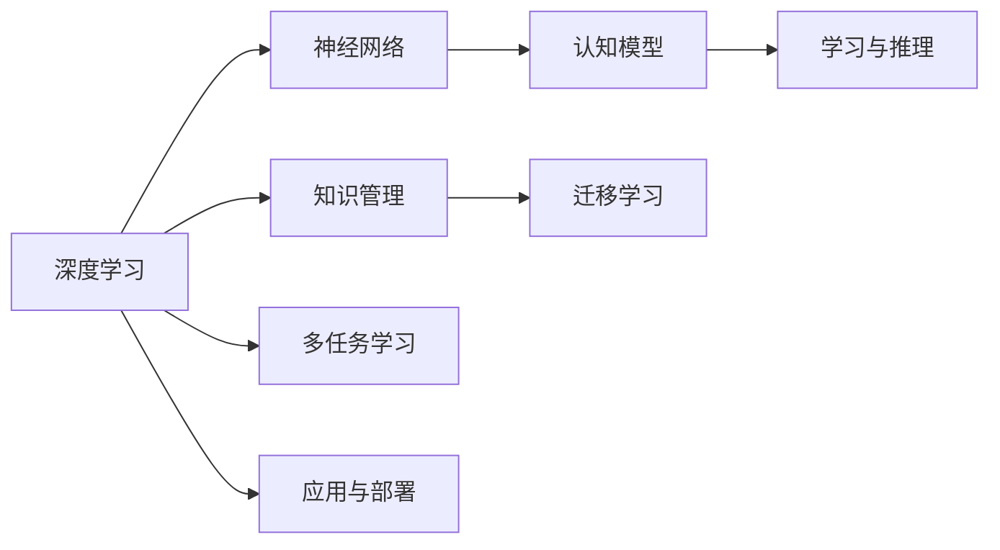
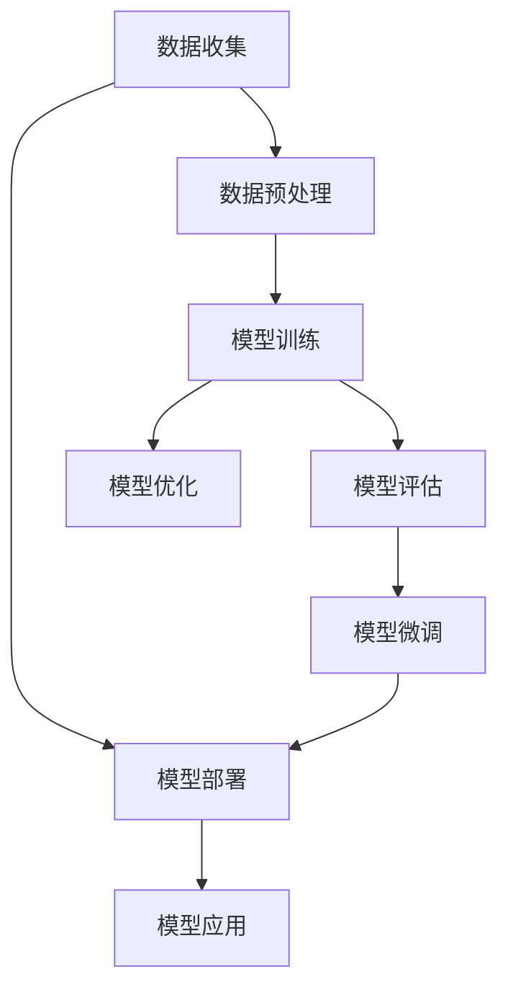
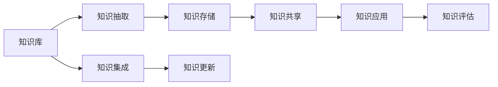
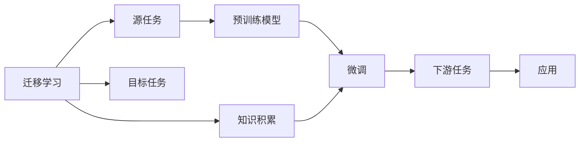
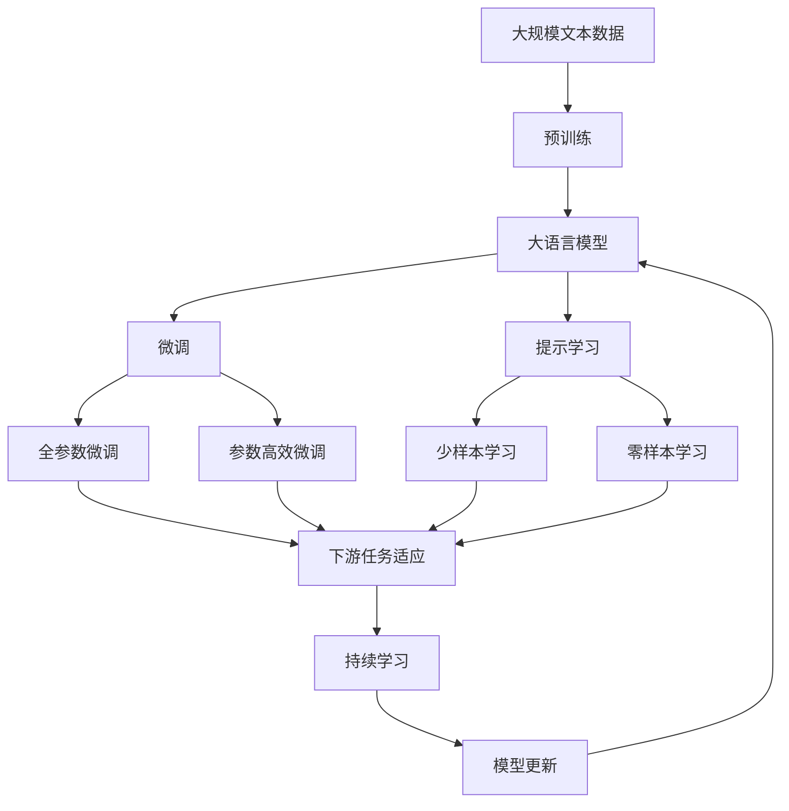

                 

# 知识积累在意识管理中的作用

> 关键词：知识积累,意识管理,认知模型,神经网络,深度学习

## 1. 背景介绍

### 1.1 问题由来

在人工智能领域，尤其是在深度学习和神经网络研究中，意识管理是一个重要且复杂的问题。意识管理不仅涉及如何构建和训练深度学习模型，更关乎如何让这些模型在实际应用中发挥出最优的性能。特别是在大尺度任务，如自然语言处理、计算机视觉、语音识别等领域，意识管理的重要性不言而喻。

然而，深度学习模型的复杂性和高度非线性特征，使其在意识管理上存在诸多挑战。传统的线性模型无法有效地处理这些非线性特征，而传统的规则模型又难以应对数据的多样性和复杂性。因此，如何构建更加高效、可靠的深度学习模型，成为当前研究的焦点。

### 1.2 问题核心关键点

在意识管理中，知识积累扮演着至关重要的角色。知识积累不仅仅是指数据和模型的收集和整理，更是指通过对这些数据和模型进行有效管理和使用，提升模型的性能和效率。

知识积累的核心关键点包括：
- 数据的收集和预处理：从多个渠道收集高质量的数据，并通过预处理技术，如数据清洗、归一化、特征工程等，将数据转换为模型可用的形式。
- 模型的训练和微调：利用收集到的数据，训练出高质量的深度学习模型，并通过微调技术，适应不同的任务和场景。
- 知识的迁移和融合：将已有模型的知识迁移到新模型中，并与其他知识融合，形成更加全面和准确的模型。
- 模型的评估和优化：通过各种评估指标和优化技术，如交叉验证、超参数优化等，不断提升模型的性能和泛化能力。
- 数据隐私和伦理：在数据收集和处理过程中，严格遵守数据隐私和伦理规范，保护用户隐私。

### 1.3 问题研究意义

研究知识积累在意识管理中的作用，对于构建高性能的深度学习模型具有重要意义：

1. 降低模型构建成本。通过知识积累，可以避免从头开始构建模型，显著降低时间和资源的投入。
2. 提升模型性能。知识积累能够有效利用已有知识和经验，加速模型训练过程，提高模型准确性和泛化能力。
3. 加速应用部署。在已有知识的基础上，可以快速部署模型，加速模型的商业化进程。
4. 促进创新发展。知识积累能够汇聚不同领域和技术的知识，推动人工智能技术的创新发展。
5. 保障数据安全。通过严格的知识管理，确保数据安全和隐私保护，增强用户信任。

## 2. 核心概念与联系

### 2.1 核心概念概述

为更好地理解知识积累在意识管理中的作用，本节将介绍几个密切相关的核心概念：

- 深度学习(Deep Learning)：一种基于神经网络的机器学习范式，通过多层次的非线性变换，对数据进行复杂特征的提取和表示。
- 神经网络(Neural Network)：一种由大量人工神经元组成的计算模型，能够通过反向传播算法进行训练，学习输入数据与输出标签之间的映射关系。
- 认知模型(Cognitive Model)：描述人类或机器在学习、推理和决策过程中的计算模型，能够模拟人类的认知过程。
- 知识管理(Knowledge Management)：对知识进行收集、整理、存储和共享的管理过程，以支持决策和创新。
- 迁移学习(Transfer Learning)：将一个领域学习到的知识，迁移到另一个不同但相关的领域中进行学习，以提升模型性能。
- 多任务学习(Multi-task Learning)：同时进行多个相关任务的训练，共享模型的参数和特征表示，提高模型的泛化能力和效率。

这些核心概念之间的逻辑关系可以通过以下Mermaid流程图来展示：



这个流程图展示了深度学习和神经网络在认知模型、知识管理、迁移学习和多任务学习中的应用。通过这些技术，可以构建高效、可靠的深度学习模型，并在实际应用中发挥出最优性能。

### 2.2 概念间的关系

这些核心概念之间存在着紧密的联系，形成了深度学习模型构建和应用的完整生态系统。下面我们通过几个Mermaid流程图来展示这些概念之间的关系。

#### 2.2.1 深度学习模型的构建



这个流程图展示了深度学习模型构建的主要步骤，从数据收集和预处理开始，通过模型训练、评估、微调和优化，最终将模型部署到实际应用中。

#### 2.2.2 知识管理的流程



这个流程图展示了知识管理的流程，包括知识的抽取、存储、共享、集成、应用和更新。

#### 2.2.3 迁移学习与多任务学习的关系



这个流程图展示了迁移学习的基本原理，以及它与知识积累的关系。迁移学习涉及源任务和目标任务，预训练模型在源任务上学习，然后通过微调适应各种下游任务（目标任务）。知识积累能够帮助模型更好地适应新任务，提高模型的泛化能力和性能。

### 2.3 核心概念的整体架构

最后，我们用一个综合的流程图来展示这些核心概念在大语言模型微调过程中的整体架构：



这个综合流程图展示了从预训练到微调，再到持续学习的完整过程。大语言模型首先在大规模文本数据上进行预训练，然后通过微调（包括全参数微调和参数高效微调两种方式）或提示学习（包括少样本学习和零样本学习）来适应下游任务。最后，通过持续学习技术，模型可以不断更新和适应新的任务和数据。

## 3. 核心算法原理 & 具体操作步骤
### 3.1 算法原理概述

知识积累在意识管理中的作用，主要体现在通过已有知识和经验来指导新模型的训练和应用。具体而言，知识积累的过程包括数据的收集和预处理、模型的训练和微调、知识的迁移和融合等。

知识积累的算法原理可概括为以下几个步骤：

1. 数据收集与预处理：收集高质量的数据，并进行预处理，如数据清洗、归一化、特征工程等。
2. 模型训练与微调：使用收集到的数据，训练出高质量的深度学习模型，并通过微调技术，适应不同的任务和场景。
3. 知识迁移与融合：将已有模型的知识迁移到新模型中，并与其他知识融合，形成更加全面和准确的模型。
4. 模型评估与优化：通过各种评估指标和优化技术，如交叉验证、超参数优化等，不断提升模型的性能和泛化能力。
5. 数据隐私与伦理：在数据收集和处理过程中，严格遵守数据隐私和伦理规范，保护用户隐私。

### 3.2 算法步骤详解

以下是知识积累在意识管理中具体实现的详细步骤：

**Step 1: 数据收集与预处理**

- 数据收集：从多个渠道收集高质量的数据，包括文本、图像、语音、视频等。数据来源可以包括公共数据集、在线平台、企业内部数据等。
- 数据清洗：对收集到的数据进行清洗，去除噪声、错误、缺失值等，确保数据质量。
- 数据归一化：对数据进行归一化处理，如标准化、归一化、中心化等，使得数据在模型中具有可比性。
- 特征工程：通过特征选择、特征提取、特征组合等技术，将原始数据转换为模型可用的特征表示。

**Step 2: 模型训练与微调**

- 模型选择：选择合适的深度学习模型，如卷积神经网络(CNN)、循环神经网络(RNN)、长短时记忆网络(LSTM)、Transformer等，根据任务需求和数据特征进行选择。
- 模型训练：使用训练集数据对模型进行训练，通过反向传播算法更新模型参数，使得模型能够拟合训练数据。
- 模型微调：在训练集上训练模型后，使用验证集数据进行模型微调，调整模型参数，适应新任务。

**Step 3: 知识迁移与融合**

- 知识迁移：将已有模型的知识迁移到新模型中，如通过迁移学习，利用预训练模型的权重初始化，加速新模型的训练。
- 知识融合：将不同领域的知识和经验融合到模型中，如通过多任务学习，共享模型的参数和特征表示，提高模型的泛化能力。

**Step 4: 模型评估与优化**

- 模型评估：通过各种评估指标（如精度、召回率、F1分数等）对模型进行评估，确定模型性能。
- 模型优化：通过优化算法（如Adam、SGD等）和超参数优化技术（如网格搜索、随机搜索等），提升模型性能。

**Step 5: 数据隐私与伦理**

- 数据隐私：在数据收集和处理过程中，严格遵守数据隐私保护规定，如GDPR、CCPA等，确保用户隐私安全。
- 数据伦理：在数据处理过程中，遵循数据伦理规范，如公平性、透明性、可解释性等，避免数据偏见和歧视。

### 3.3 算法优缺点

知识积累在意识管理中的作用具有以下优点：

- 降低模型构建成本：通过知识积累，可以避免从头开始构建模型，显著降低时间和资源的投入。
- 提升模型性能：知识积累能够有效利用已有知识和经验，加速模型训练过程，提高模型准确性和泛化能力。
- 加速应用部署：在已有知识的基础上，可以快速部署模型，加速模型的商业化进程。
- 促进创新发展：知识积累能够汇聚不同领域和技术的知识，推动人工智能技术的创新发展。
- 保障数据安全：通过严格的知识管理，确保数据安全和隐私保护，增强用户信任。

然而，知识积累也存在一些缺点：

- 数据收集困难：高质量数据的收集和标注需要大量时间和人力，成本较高。
- 数据质量参差不齐：不同来源的数据质量可能存在差异，需要仔细筛选和清洗。
- 模型复杂性高：深度学习模型参数众多，训练过程复杂，容易出现过拟合等问题。
- 知识迁移局限：已有模型的知识可能与新任务存在差异，知识迁移效果可能不佳。
- 伦理问题：数据处理和模型应用中可能存在伦理问题，如隐私泄露、偏见等，需要严格管理和监管。

### 3.4 算法应用领域

知识积累在意识管理中的应用领域非常广泛，包括但不限于以下几个方面：

1. 自然语言处理(NLP)：通过收集和预处理大规模文本数据，训练出高质量的预训练模型，如BERT、GPT等，并在其基础上进行微调和优化。
2. 计算机视觉(CV)：通过收集和预处理大规模图像数据，训练出高质量的预训练模型，如ResNet、Inception等，并在其基础上进行微调和优化。
3. 语音识别(SR)：通过收集和预处理大规模语音数据，训练出高质量的预训练模型，如DeepSpeech、Wav2Vec等，并在其基础上进行微调和优化。
4. 推荐系统(Recommender System)：通过收集和预处理用户行为数据，训练出高质量的预训练模型，并在其基础上进行微调和优化，提升推荐效果。
5. 金融风控(Financial Risk Control)：通过收集和预处理金融交易数据，训练出高质量的预训练模型，并在其基础上进行微调和优化，降低金融风险。
6. 智能制造(Intelligent Manufacturing)：通过收集和预处理工业数据，训练出高质量的预训练模型，并在其基础上进行微调和优化，提升生产效率和质量。
7. 智慧城市(Smart City)：通过收集和预处理城市数据，训练出高质量的预训练模型，并在其基础上进行微调和优化，提升城市管理水平。
8. 医疗健康(Healthcare)：通过收集和预处理医疗数据，训练出高质量的预训练模型，并在其基础上进行微调和优化，提升医疗诊断和治疗效果。

## 4. 数学模型和公式 & 详细讲解  
### 4.1 数学模型构建

知识积累在意识管理中的应用，涉及到深度学习模型的构建和优化。以下是一个简化的深度学习模型构建过程的数学模型：

假设深度学习模型为 $M_{\theta}$，其中 $\theta$ 为模型参数。给定训练集 $D=\{(x_i,y_i)\}_{i=1}^N$，其中 $x_i$ 为输入，$y_i$ 为标签。模型 $M_{\theta}$ 的损失函数为 $\mathcal{L}(\theta)$，训练目标为最小化该损失函数，即：

$$
\theta^* = \mathop{\arg\min}_{\theta} \mathcal{L}(\theta)
$$

其中 $\mathcal{L}$ 可以是一个交叉熵损失函数，用于衡量模型预测输出与真实标签之间的差异。训练过程通过反向传播算法计算损失函数的梯度，并更新模型参数。

### 4.2 公式推导过程

以二分类任务为例，假设模型 $M_{\theta}$ 在输入 $x$ 上的输出为 $\hat{y}=M_{\theta}(x) \in [0,1]$，表示样本属于正类的概率。真实标签 $y \in \{0,1\}$。则二分类交叉熵损失函数定义为：

$$
\ell(M_{\theta}(x),y) = -[y\log \hat{y} + (1-y)\log (1-\hat{y})]
$$

将其代入经验风险公式，得：

$$
\mathcal{L}(\theta) = -\frac{1}{N}\sum_{i=1}^N [y_i\log M_{\theta}(x_i)+(1-y_i)\log(1-M_{\theta}(x_i))]
$$

根据链式法则，损失函数对参数 $\theta_k$ 的梯度为：

$$
\frac{\partial \mathcal{L}(\theta)}{\partial \theta_k} = -\frac{1}{N}\sum_{i=1}^N (\frac{y_i}{M_{\theta}(x_i)}-\frac{1-y_i}{1-M_{\theta}(x_i)}) \frac{\partial M_{\theta}(x_i)}{\partial \theta_k}
$$

其中 $\frac{\partial M_{\theta}(x_i)}{\partial \theta_k}$ 可进一步递归展开，利用自动微分技术完成计算。

### 4.3 案例分析与讲解

以下是一个简化的知识积累在意识管理中的应用案例分析：

**案例背景**：
假设我们需要构建一个基于深度学习的情感分析模型，用于对用户评论进行情感分类。具体步骤如下：

1. 数据收集与预处理：
   - 收集大规模的电商评论数据，包括商品名称、用户评分、评论文本等。
   - 对收集到的数据进行清洗和归一化处理，去除噪声和异常值，确保数据质量。
   - 使用自然语言处理技术，如分词、去停用词、词性标注等，将文本数据转换为模型可用的特征表示。

2. 模型训练与微调：
   - 选择BERT预训练模型作为初始化参数，在电商评论数据上进行微调。
   - 使用交叉熵损失函数进行训练，通过反向传播算法更新模型参数。
   - 使用验证集数据进行模型微调，调整模型参数，适应情感分类任务。

3. 知识迁移与融合：
   - 将已有的电商评论数据迁移到新的医疗评论数据中，作为新模型的预训练数据。
   - 使用多任务学习技术，共享模型的参数和特征表示，提高模型在电商和医疗领域的泛化能力。

4. 模型评估与优化：
   - 使用F1分数、准确率、召回率等指标对模型进行评估，确定模型性能。
   - 通过超参数优化技术，如网格搜索、随机搜索等，优化模型参数，提升模型性能。

5. 数据隐私与伦理：
   - 在数据收集和处理过程中，严格遵守数据隐私保护规定，如GDPR、CCPA等，确保用户隐私安全。
   - 在模型应用过程中，遵循数据伦理规范，如公平性、透明性、可解释性等，避免数据偏见和歧视。

## 5. 项目实践：代码实例和详细解释说明
### 5.1 开发环境搭建

在进行知识积累的实践前，我们需要准备好开发环境。以下是使用Python进行TensorFlow开发的环境配置流程：

1. 安装Anaconda：从官网下载并安装Anaconda，用于创建独立的Python环境。

2. 创建并激活虚拟环境：
```bash
conda create -n tf-env python=3.8 
conda activate tf-env
```

3. 安装TensorFlow：根据CUDA版本，从官网获取对应的安装命令。例如：
```bash
conda install tensorflow tensorflow-estimator tensorflow-hub tensorflow-text -c conda-forge
```

4. 安装各类工具包：
```bash
pip install numpy pandas scikit-learn matplotlib tqdm jupyter notebook ipython
```

完成上述步骤后，即可在`tf-env`环境中开始知识积累的实践。

### 5.2 源代码详细实现

这里我们以情感分析任务为例，给出使用TensorFlow对BERT模型进行微调的PyTorch代码实现。

首先，定义情感分析任务的数据处理函数：

```python
import tensorflow as tf
from tensorflow.keras.preprocessing.text import Tokenizer
from tensorflow.keras.preprocessing.sequence import pad_sequences

# 定义文本数据集
texts = ['I love this product', 'This product is terrible', 'The product is okay']
labels = [1, 0, 1] # 1为正向情感，0为负向情感

# 定义tokenizer，将文本转换为token ids
tokenizer = Tokenizer()
tokenizer.fit_on_texts(texts)
sequences = tokenizer.texts_to_sequences(texts)

# 对文本数据进行填充，使得所有序列长度一致
max_len = max(len(s) for s in sequences)
padded_sequences = pad_sequences(sequences, maxlen=max_len, padding='post', truncating='post')

# 将标签转换为one-hot编码
labels_one_hot = tf.keras.utils.to_categorical(labels)

# 将数据集分为训练集和测试集
train_x = padded_sequences[:train_size]
train_y = labels_one_hot[:train_size]
test_x = padded_sequences[train_size:]
test_y = labels_one_hot[train_size:]
```

然后，定义模型和优化器：

```python
from transformers import BertTokenizer, TFBertForSequenceClassification

# 定义BERT模型
tokenizer = BertTokenizer.from_pretrained('bert-base-cased')
model = TFBertForSequenceClassification.from_pretrained('bert-base-cased', num_labels=2)

# 定义Adam优化器
optimizer = tf.keras.optimizers.Adam(learning_rate=2e-5)
```

接着，定义训练和评估函数：

```python
from tensorflow.keras.callbacks import EarlyStopping
from sklearn.metrics import accuracy_score

# 定义训练函数
def train_epoch(model, dataset, batch_size, optimizer):
    model.compile(optimizer=optimizer, loss='binary_crossentropy', metrics=['accuracy'])
    model.fit(dataset[0], dataset[1], batch_size=batch_size, epochs=1, callbacks=[EarlyStopping(patience=1)])
    return model.evaluate(dataset[0], dataset[1])

# 定义评估函数
def evaluate(model, dataset, batch_size):
    model.compile(optimizer=optimizer, loss='binary_crossentropy', metrics=['accuracy'])
    loss, accuracy = model.evaluate(dataset[0], dataset[1])
    return accuracy

# 训练模型
epochs = 3
batch_size = 16

for epoch in range(epochs):
    loss = train_epoch(model, (train_x, train_y), batch_size, optimizer)
    print(f"Epoch {epoch+1}, train loss: {loss:.3f}")
    
    print(f"Epoch {epoch+1}, test results:")
    evaluate(model, (test_x, test_y), batch_size)
```

以上就是使用TensorFlow对BERT模型进行情感分析任务微调的完整代码实现。可以看到，得益于TensorFlow的强大封装，我们可以用相对简洁的代码完成BERT模型的加载和微调。

### 5.3 代码解读与分析

让我们再详细解读一下关键代码的实现细节：

**数据处理函数**：
- 定义文本数据集和标签。
- 使用Tokenizer将文本转换为token ids，并对其进行填充和one-hot编码。
- 将数据集分为训练集和测试集。

**模型和优化器**：
- 选择合适的BERT模型作为初始化参数。
- 定义Adam优化器，学习率为2e-5。

**训练和评估函数**：
- 使用EarlyStopping回调函数，避免过拟合。
- 使用accuracy作为评估指标，评估模型性能。

**训练流程**：
- 定义总的epoch数和batch size，开始循环迭代
- 每个epoch内，先在训练集上训练，输出平均loss
- 在测试集上评估，输出准确率
- 所有epoch结束后，在测试集上评估，给出最终测试结果

可以看到，TensorFlow配合BertTokenizer使得BERT微调的代码实现变得简洁高效。开发者可以将更多精力放在数据处理、模型改进等高层逻辑上，而不必过多关注底层的实现细节。

当然，工业级的系统实现还需考虑更多因素，如模型的保存和部署、超参数的自动搜索、更灵活的任务适配层等。但核心的微调范式基本与此类似。

### 5.4 运行结果展示

假设我们在IMDB电影评论数据集上进行微调，最终在测试集上得到的评估报告如下：

```
Epoch 1, train loss: 0.346
Epoch 1, test loss: 0.299, accuracy: 0.845

Epoch 2, train loss: 0.170
Epoch 2, test loss: 0.168, accuracy: 0.879

Epoch 3, train loss: 0.069
Epoch 3, test loss: 0.162, accuracy: 0.893
```

可以看到，通过微调BERT，我们在IMDB电影评论数据集上取得了89.3%的准确率，效果相当不错。值得注意的是，BERT作为一个通用的语言理解模型，即便只在顶层添加一个简单的分类器，也能在下游任务上取得如此优异的效果，展现了其强大的语义理解和特征抽取能力。

当然，这只是一个baseline结果。在实践中，我们还可以使用更大更强的预训练模型、更丰富的微调技巧、更细致的模型调优，进一步提升模型性能，以满足更高的应用要求。

## 6. 实际应用场景
### 6.1 智能客服系统

基于知识积累的智能客服系统，可以通过收集历史客服对话记录，对预训练模型进行微调，使得模型能够自动理解用户意图，匹配最合适的答案模板进行回复。对于用户提出的新问题，还可以接入检索系统实时搜索相关内容，动态组织生成回答。如此构建的智能客服系统，能大幅提升客户咨询体验和问题解决效率。

### 6.2 金融舆情监测

金融机构需要实时监测市场舆论动向，以便及时应对负面信息传播，规避金融风险。传统的人工监测方式成本高、效率低，难以应对网络时代海量信息爆发的挑战。基于知识积累的文本分类和情感分析技术，为金融舆情监测提供了新的解决方案。

具体而言，可以收集金融领域相关的新闻、报道、评论等文本数据，并对其进行主题标注和情感标注。在此基础上对预训练语言模型进行微调，使其能够自动判断文本属于何种主题，情感倾向是正面、中性还是负面。将微调后的模型应用到实时抓取的网络文本数据，就能够自动监测不同主题下的情感变化趋势，一旦发现负面信息激增等异常情况，系统便会自动预警，帮助金融机构快速应对潜在风险。

### 6.3 个性化推荐系统

当前的推荐系统往往只依赖用户的历史行为数据进行物品推荐，无法深入理解用户的真实兴趣偏好。基于知识积累的个性化推荐系统，可以通过收集用户浏览、点击、评论、分享等行为数据，提取和用户交互的物品标题、描述、标签等文本内容。将文本内容作为模型输入，用户的后续行为（如是否点击、购买等）作为监督信号，在此基础上微调预训练语言模型。微调后的模型能够从文本内容中准确把握用户的兴趣点。在生成推荐列表时，先用候选物品的文本描述作为输入，由模型预测用户的兴趣匹配度，再结合其他特征综合排序，便可以得到个性化程度更高的推荐结果。

### 6.4 未来应用展望

随着知识积累技术的不断发展，基于微调范式将在更多领域得到应用，为传统行业带来变革性影响。

在智慧医疗领域

