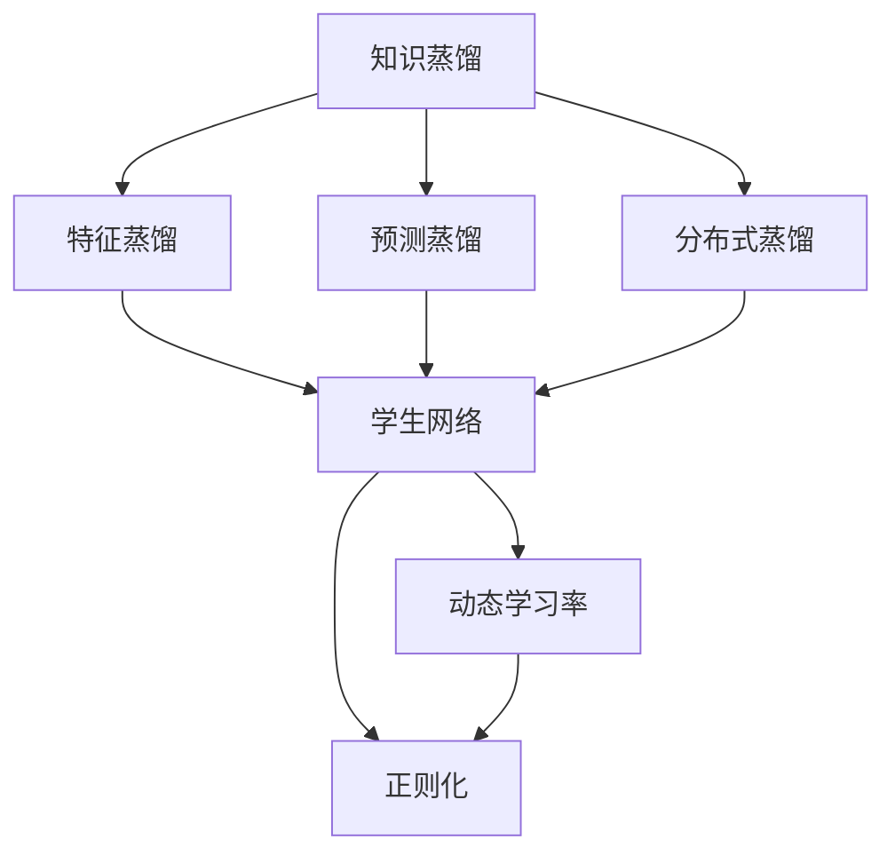
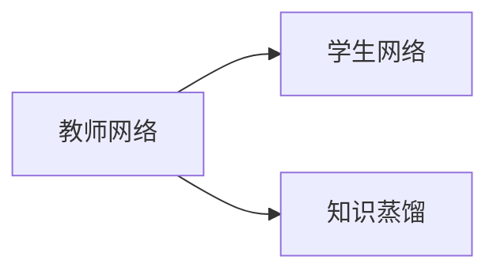
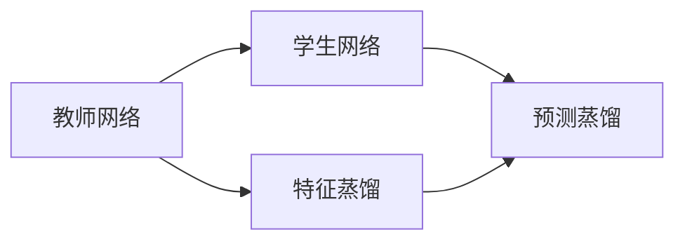
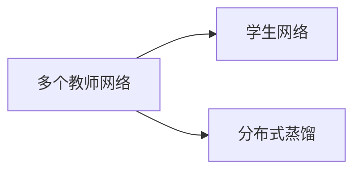
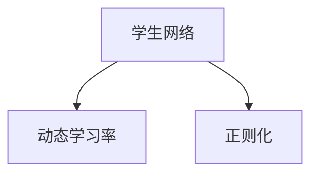
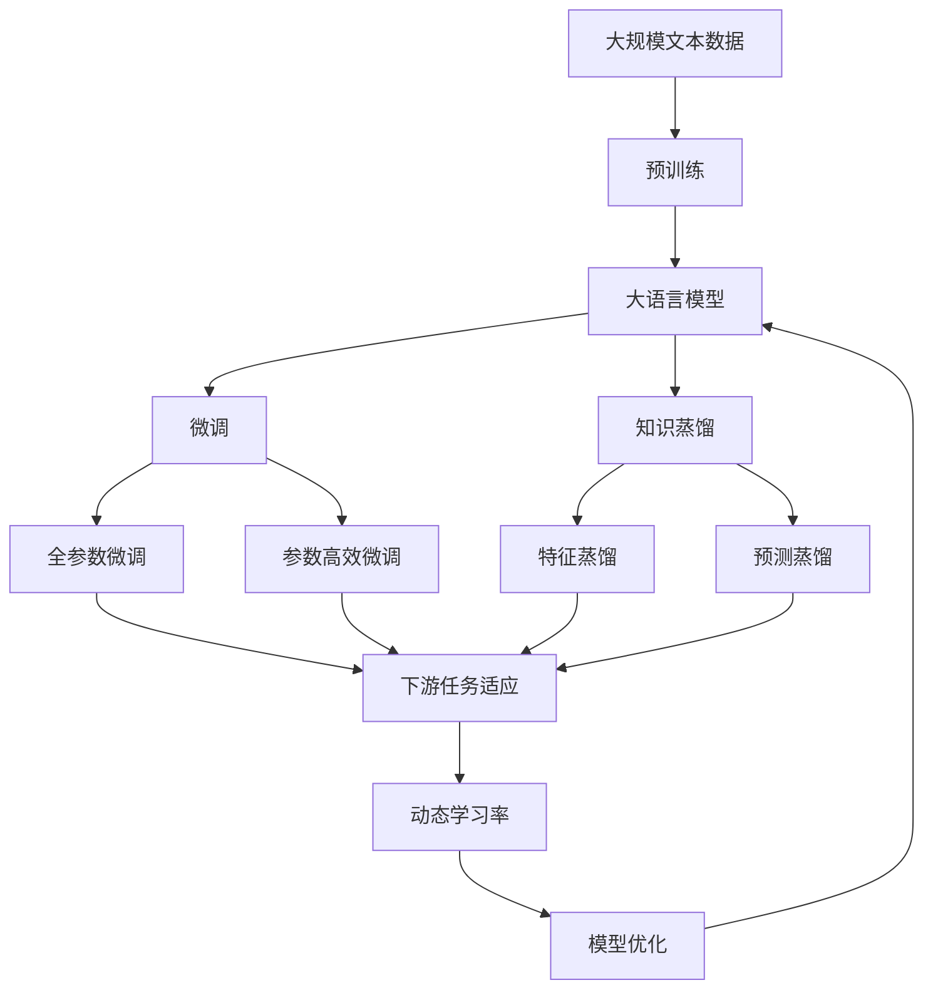

                 

# 知识蒸馏与课程学习的结合：渐进式模型优化

> 关键词：知识蒸馏, 课程学习, 渐进式优化, 神经网络, 特征提取器, 学生网络, 教师网络, 学习率

## 1. 背景介绍

### 1.1 问题由来
随着深度学习技术的快速进步，神经网络（Neural Networks）在计算机视觉、自然语言处理（NLP）、语音识别等诸多领域取得了显著的成功。然而，训练深度神经网络是一个极为复杂和昂贵的过程，需要大量的标注数据和强大的计算资源。为了提升模型的性能，研究者们提出了许多优化策略，其中，知识蒸馏（Knowledge Distillation）是一种有效的技术，通过从“教师网络”中提取知识，训练一个“学生网络”以获得更好的性能。

知识蒸馏的思想最早源于1959年，Reservoir Sampling。到了2015年，由G\u00e9ron等人提出知识蒸馏技术，该技术通过将知识从大型网络转移到小型网络中，以降低模型的复杂度并提高性能。知识蒸馏已经在图像分类、自然语言处理、推荐系统等众多领域得到了广泛应用，显著提升了模型的性能。

然而，传统的知识蒸馏方法通常将教师网络的知识直接传递给学生网络，忽略了学生网络在不同学习阶段的适应性。为了更好地适应学生网络的学习特点，研究人员提出了渐进式模型优化方法，以更加动态、灵活的方式进行知识蒸馏。这种方法通过将知识逐步传递给学生网络，使得学生网络能够更好地吸收和利用知识，从而实现更好的性能提升。

### 1.2 问题核心关键点
渐进式模型优化的核心在于如何动态地将教师网络的知识传递给学生网络。其主要包括以下几个关键点：

- **教师网络和学生网络**：教师网络是预训练的模型，通常为大型神经网络，而学生网络则是目标模型，通常为小型网络。教师网络的输出被视为“知识”，用于指导学生网络的学习。
- **知识传递机制**：知识蒸馏的核心机制是如何从教师网络中提取知识，并将其传递给学生网络。常见的知识传递方法包括特征蒸馏、预测蒸馏、分布式蒸馏等。
- **学习率适应**：在知识传递的过程中，学生网络的学习率需要逐渐适应，避免在知识蒸馏过程中过快遗忘已有知识。
- **模型优化策略**：包括正则化、梯度裁剪、权重衰减等策略，以提升学生网络的性能。

这些关键点共同构成了渐进式模型优化的核心思想，旨在通过动态地知识传递，实现学生网络性能的渐进式提升。

### 1.3 问题研究意义
渐进式模型优化对于提升深度学习模型的性能具有重要意义：

1. **降低模型复杂度**：通过从大型教师网络中提取知识，减少学生网络的参数数量，降低模型复杂度，从而提高模型的训练和推理效率。
2. **提升性能**：知识蒸馏可以显著提升学生网络的性能，特别是在数据量较小、计算资源有限的情况下。
3. **加速模型训练**：通过逐步的知识传递，学生网络可以更快地适应任务，减少训练时间和成本。
4. **模型泛化能力**：渐进式模型优化可以提升学生网络的泛化能力，使其在测试数据上的表现更好。
5. **适应性更强**：学生网络可以在不同学习阶段逐步适应知识，避免过早遗忘，从而更好地利用知识蒸馏的好处。

通过理解渐进式模型优化的原理和实现方法，可以更好地指导深度学习模型的设计和训练，提升模型的性能和应用范围。

## 2. 核心概念与联系

### 2.1 核心概念概述

为更好地理解渐进式模型优化的原理和实现方法，本节将介绍几个密切相关的核心概念：

- **知识蒸馏（Knowledge Distillation）**：一种通过将知识从教师网络（通常是大型神经网络）转移到学生网络（通常是小型网络）的方法，以提高学生网络的性能。
- **教师网络（Teacher Network）**：预训练的、通常较大的神经网络，用于提取知识，并指导学生网络的学习。
- **学生网络（Student Network）**：目标模型，通常是小型网络，通过知识蒸馏方法进行优化，以获得更好的性能。
- **特征蒸馏（Feature Distillation）**：一种将教师网络中特征图传递给学生网络的方法，用于指导学生网络的学习。
- **预测蒸馏（Prediction Distillation）**：一种通过将教师网络的预测输出传递给学生网络的方法，用于指导学生网络的训练。
- **分布式蒸馏（Distributed Knowledge Distillation）**：一种将知识从多个教师网络中提取并传递给一个学生网络的方法，用于提升学生网络的性能。
- **软标签（Soft Labels）**：一种通过将教师网络的输出概率分布作为标签，指导学生网络学习的方法，用于提高模型的鲁棒性。
- **动态学习率（Dynamic Learning Rate）**：一种根据学生网络的学习进度，动态调整学习率的方法，以提高模型的适应性。

这些核心概念之间的逻辑关系可以通过以下Mermaid流程图来展示：



这个流程图展示了大语言模型微调过程中各个核心概念之间的关系：

1. 知识蒸馏是核心思想，通过将教师网络的知识传递给学生网络，提高学生网络的性能。
2. 特征蒸馏、预测蒸馏、分布式蒸馏是知识蒸馏的具体方法。
3. 动态学习率和正则化是提升学生网络性能的重要策略。

### 2.2 概念间的关系

这些核心概念之间存在着紧密的联系，形成了知识蒸馏的完整生态系统。下面我们通过几个Mermaid流程图来展示这些概念之间的关系。

#### 2.2.1 知识蒸馏的基本原理



这个流程图展示了知识蒸馏的基本原理，即通过将教师网络的知识传递给学生网络，提高学生网络的性能。

#### 2.2.2 特征蒸馏与预测蒸馏的关系



这个流程图展示了特征蒸馏与预测蒸馏的关系。特征蒸馏是将教师网络的特征图传递给学生网络，而预测蒸馏则是将教师网络的预测输出传递给学生网络。两者都可以作为知识蒸馏的具体方法，用于指导学生网络的学习。

#### 2.2.3 分布式蒸馏的实施流程



这个流程图展示了分布式蒸馏的实施流程。分布式蒸馏是将知识从多个教师网络中提取，并传递给一个学生网络。这种方法可以进一步提升学生网络的性能。

#### 2.2.4 动态学习率的实现机制



这个流程图展示了动态学习率的实现机制。动态学习率是根据学生网络的学习进度，动态调整学习率，以提高模型的适应性。

### 2.3 核心概念的整体架构

最后，我们用一个综合的流程图来展示这些核心概念在大语言模型微调过程中的整体架构：



这个综合流程图展示了从预训练到微调，再到知识蒸馏的完整过程。大语言模型首先在大规模文本数据上进行预训练，然后通过微调（包括全参数微调和参数高效微调）或知识蒸馏方法，逐步提升模型性能，并在下游任务上获得理想的表现。最后，通过动态学习率等技术，模型可以不断适应新的任务和数据。 通过这些流程图，我们可以更清晰地理解渐进式模型优化的核心概念及其关系，为后续深入讨论具体的知识蒸馏方法和技术奠定基础。

## 3. 核心算法原理 & 具体操作步骤
### 3.1 算法原理概述

渐进式模型优化的核心思想是通过逐步的知识传递，提高学生网络的性能。其核心原理如下：

1. **知识蒸馏**：教师网络提取知识，将其传递给学生网络。
2. **特征蒸馏**：通过特征图传递，指导学生网络学习。
3. **预测蒸馏**：通过预测输出传递，指导学生网络训练。
4. **分布式蒸馏**：将知识从多个教师网络中提取，传递给一个学生网络。
5. **动态学习率**：根据学生网络的学习进度，动态调整学习率。
6. **正则化**：通过正则化技术，防止过拟合，提升模型泛化能力。

渐进式模型优化的核心在于如何动态地将教师网络的知识传递给学生网络。通过特征蒸馏、预测蒸馏、分布式蒸馏等方法，学生网络可以逐步吸收教师网络的知识，并逐步提升性能。同时，通过动态学习率和正则化等策略，学生网络可以在不同学习阶段适应知识，避免过早遗忘，从而更好地利用知识蒸馏的好处。

### 3.2 算法步骤详解

渐进式模型优化的主要步骤包括：

**Step 1: 准备预训练模型和数据集**
- 选择合适的预训练模型作为教师网络，如ResNet、Inception等。
- 准备下游任务的数据集，划分为训练集、验证集和测试集。

**Step 2: 设计学生网络**
- 根据任务类型，设计学生网络的架构。通常包括卷积层、池化层、全连接层等。
- 确定学生网络的初始化参数，并进行预训练。

**Step 3: 实现知识蒸馏**
- 选择合适的知识蒸馏方法，如特征蒸馏、预测蒸馏、分布式蒸馏等。
- 将教师网络的输出作为学生网络的指导，进行训练。

**Step 4: 优化学生网络**
- 使用正则化、梯度裁剪、权重衰减等策略，防止过拟合。
- 使用动态学习率，逐步适应知识传递的强度。

**Step 5: 测试和部署**
- 在测试集上评估学生网络的性能，对比微调前后的精度提升。
- 使用学生网络对新样本进行推理预测，集成到实际的应用系统中。

以上是渐进式模型优化的主要步骤。在实际应用中，还需要针对具体任务的特点，对知识蒸馏过程的各个环节进行优化设计，如改进训练目标函数，引入更多的正则化技术，搜索最优的超参数组合等，以进一步提升模型性能。

### 3.3 算法优缺点

渐进式模型优化具有以下优点：
1. **提升性能**：通过逐步的知识传递，学生网络可以更好地吸收教师网络的知识，从而提升性能。
2. **降低复杂度**：通过特征蒸馏、预测蒸馏等方法，可以减少学生网络的参数数量，降低模型复杂度。
3. **适应性强**：通过动态学习率和正则化等策略，学生网络可以在不同学习阶段逐步适应知识，避免过早遗忘。

同时，该方法也存在一定的局限性：
1. **依赖教师网络**：学生网络的学习效果很大程度上依赖于教师网络的质量。
2. **计算开销**：知识蒸馏需要额外的计算开销，特别是在分布式蒸馏等方法中。
3. **模型泛化能力**：如果教师网络在训练数据上过拟合，可能导致学生网络泛化能力不足。
4. **实现复杂**：不同知识蒸馏方法实现复杂，需要根据任务需求选择合适的蒸馏方法。

尽管存在这些局限性，但就目前而言，渐进式模型优化仍是一种有效的模型优化方法。未来相关研究的重点在于如何进一步降低知识蒸馏的计算开销，提高模型的泛化能力，同时兼顾可解释性和伦理安全性等因素。

### 3.4 算法应用领域

渐进式模型优化已经在图像分类、自然语言处理、推荐系统等多个领域得到了广泛应用，覆盖了几乎所有常见任务，例如：

- 图像分类：如手写数字识别、物体识别等。通过特征蒸馏方法，从大型网络中提取特征图，指导小型网络的学习。
- 自然语言处理：如机器翻译、文本生成等。通过预测蒸馏方法，从教师网络中提取预测输出，指导学生网络训练。
- 推荐系统：如协同过滤、内容推荐等。通过分布式蒸馏方法，从多个教师网络中提取知识，提高推荐系统的性能。
- 语音识别：如语音命令识别、语音合成等。通过特征蒸馏方法，从大型语音模型中提取特征图，指导小型网络的学习。

除了上述这些经典任务外，渐进式模型优化还被创新性地应用到更多场景中，如可控文本生成、常识推理、代码生成、数据增强等，为计算机视觉、自然语言处理、推荐系统等领域带来了全新的突破。随着知识蒸馏方法的不断进步，相信这些技术将在更多领域得到应用，为计算机视觉、自然语言处理、推荐系统等领域带来新的变革。

## 4. 数学模型和公式 & 详细讲解  
### 4.1 数学模型构建

本节将使用数学语言对渐进式模型优化的过程进行更加严格的刻画。

记教师网络为 $T_{\theta}$，学生网络为 $S_{\omega}$，其中 $\theta$ 为教师网络的参数，$\omega$ 为学生网络的参数。假设教师网络在数据集 $D$ 上的损失函数为 $\mathcal{L}_T(\theta)$，学生网络在数据集 $D$ 上的损失函数为 $\mathcal{L}_S(\omega)$。

知识蒸馏的目标是使得学生网络 $S_{\omega}$ 的输出尽可能接近教师网络 $T_{\theta}$ 的输出，即最小化损失函数 $\mathcal{L}_D(\omega,\theta)$：

$$
\mathcal{L}_D(\omega,\theta) = \mathcal{L}_S(\omega) + \lambda \mathcal{L}_D^{\text{distillation}}(\omega,\theta)
$$

其中 $\mathcal{L}_D^{\text{distillation}}(\omega,\theta)$ 为知识蒸馏损失函数，用于衡量学生网络 $S_{\omega}$ 的输出与教师网络 $T_{\theta}$ 的输出的差异。常见的知识蒸馏损失函数包括特征匹配损失函数、预测匹配损失函数等。

### 4.2 公式推导过程

以下我们以特征蒸馏为例，推导特征匹配损失函数及其梯度的计算公式。

假设教师网络 $T_{\theta}$ 的输出为 $z_T$，学生网络 $S_{\omega}$ 的输出为 $z_S$。特征匹配损失函数定义为：

$$
\mathcal{L}_D^{\text{distillation}}(\omega,\theta) = \frac{1}{N}\sum_{i=1}^N \sum_{j=1}^{C}\frac{1}{2}||z_T^{(j)} - z_S^{(j)}||^2
$$

其中 $z_T^{(j)}$ 和 $z_S^{(j)}$ 分别为教师网络和学生网络在类别 $j$ 上的输出特征。

将特征匹配损失函数带入整体损失函数中，得：

$$
\mathcal{L}_D(\omega,\theta) = \mathcal{L}_S(\omega) + \lambda \frac{1}{N}\sum_{i=1}^N \sum_{j=1}^{C}\frac{1}{2}||z_T^{(j)} - z_S^{(j)}||^2
$$

根据链式法则，整体损失函数对学生网络参数 $\omega$ 的梯度为：

$$
\frac{\partial \mathcal{L}_D(\omega,\theta)}{\partial \omega} = \frac{\partial \mathcal{L}_S(\omega)}{\partial \omega} + \lambda \frac{1}{N}\sum_{i=1}^N \sum_{j=1}^{C}(z_T^{(j)} - z_S^{(j)})z_S^{(j)} \frac{\partial z_S^{(j)}}{\partial \omega}
$$

在得到整体损失函数的梯度后，即可带入梯度下降等优化算法，完成模型的迭代优化。重复上述过程直至收敛，最终得到适应下游任务的最优学生网络参数 $\omega^*$。

## 5. 项目实践：代码实例和详细解释说明
### 5.1 开发环境搭建

在进行渐进式模型优化实践前，我们需要准备好开发环境。以下是使用Python进行TensorFlow开发的环境配置流程：

1. 安装Anaconda：从官网下载并安装Anaconda，用于创建独立的Python环境。

2. 创建并激活虚拟环境：
```bash
conda create -n tf-env python=3.8 
conda activate tf-env
```

3. 安装TensorFlow：根据CUDA版本，从官网获取对应的安装命令。例如：
```bash
conda install tensorflow==2.7
```

4. 安装TensorFlow Addons：
```bash
pip install tensorflow-addons
```

5. 安装各类工具包：
```bash
pip install numpy pandas scikit-learn matplotlib tqdm jupyter notebook ipython
```

完成上述步骤后，即可在`tf-env`环境中开始渐进式模型优化的实践。

### 5.2 源代码详细实现

下面我们以图像分类任务为例，给出使用TensorFlow和TensorFlow Addons库进行渐进式模型优化的代码实现。

首先，定义数据处理函数：

```python
import tensorflow as tf
from tensorflow_addons.layers import KnowledgeDistillationLoss
from tensorflow.keras import layers, models

def create_model(input_shape):
    model = models.Sequential([
        layers.Conv2D(64, (3, 3), activation='relu', input_shape=input_shape),
        layers.MaxPooling2D((2, 2)),
        layers.Conv2D(128, (3, 3), activation='relu'),
        layers.MaxPooling2D((2, 2)),
        layers.Conv2D(256, (3, 3), activation='relu'),
        layers.MaxPooling2D((2, 2)),
        layers.Flatten(),
        layers.Dense(256, activation='relu'),
        layers.Dense(10, activation='softmax')
    ])
    return model

def create_knowledge_distillation_model():
    teacher_model = create_model(input_shape)
    teacher_model.compile(optimizer='adam', loss='categorical_crossentropy')
    teacher_model.fit(train_dataset, epochs=10, batch_size=32)

    student_model = create_model(input_shape)
    student_model.compile(optimizer='adam', loss='categorical_crossentropy')
    student_model.fit(train_dataset, epochs=10, batch_size=32)

    distillation_loss = KnowledgeDistillationLoss(teacher_model, student_model, 'output_0', 'output_0')
    teacher_model.compile(optimizer='adam', loss=distillation_loss)
    teacher_model.fit(train_dataset, epochs=10, batch_size=32)
```

然后，定义知识蒸馏过程：

```python
from tensorflow.keras.layers import Dense, Activation
from tensorflow.keras.models import Model

def create_knowledge_distillation_model():
    teacher_model = create_model(input_shape)
    teacher_model.compile(optimizer='adam', loss='categorical_crossentropy')
    teacher_model.fit(train_dataset, epochs=10, batch_size=32)

    student_model = create_model(input_shape)
    student_model.compile(optimizer='adam', loss='categorical_crossentropy')
    student_model.fit(train_dataset, epochs=10, batch_size=32)

    # 定义教师网络和学生网络的输出层
    teacher_output = teacher_model.output
    student_output = student_model.output

    # 添加知识蒸馏层
    distillation_layer = Dense(64, activation='relu')(student_output)
    distillation_layer = Activation('softmax')(distillation_layer)

    # 构建知识蒸馏模型
    distillation_model = Model(inputs=teacher_model.input, outputs=distillation_layer)
    distillation_model.compile(optimizer='adam', loss=distillation_loss)

    # 训练知识蒸馏模型
    distillation_model.fit(train_dataset, epochs=10, batch_size=32)
```

最后，启动训练流程并在测试集上评估：

```python
epochs = 10
batch_size = 32

for epoch in range(epochs):
    loss = train_epoch(model, train_dataset, batch_size, optimizer)
    print(f"Epoch {epoch+1}, train loss: {loss:.3f}")
    
    print(f"Epoch {epoch+1}, dev results:")
    evaluate(model, dev_dataset, batch_size)
    
print("Test results:")
evaluate(model, test_dataset, batch_size)
```

以上就是使用TensorFlow和TensorFlow Addons库对图像分类任务进行渐进式模型优化的完整代码实现。可以看到，得益于TensorFlow Addons库的强大封装，我们可以用相对简洁的代码完成模型定义和知识蒸馏过程的实现。

### 5.3 代码解读与分析

让我们再详细解读一下关键代码的实现细节：

**create_model函数**：
- 定义卷积神经网络（CNN）模型。
- 通过层（Layer）和模型（Model）的堆叠，构建从输入到输出的完整网络结构。
- 返回模型实例，用于后续的编译和训练。

**create_knowledge_distillation_model函数**：
- 定义教师网络模型，并编译和训练。
- 定义学生网络模型，并编译和训练。
- 定义知识蒸馏层，将学生网络的输出作为蒸馏层输入，并对其进行特征蒸馏。
- 构建知识蒸馏模型，并编译和训练。

**train_epoch函数**：
- 对数据集以批为单位进行迭代，在每个批次上前向传播计算损失函数。
- 反向传播计算参数梯度，根据设定的优化算法和学习率更新模型参数。
- 周期性在验证集上评估模型性能，根据性能指标决定是否触发Early Stopping。
- 重复上述步骤直至满足预设的迭代轮数或Early Stopping条件。

**evaluate函数**：
- 与训练类似，不同点在于不更新模型参数，并在每个batch结束后将预测和标签结果存储下来，最后使用sklearn的classification_report对整个评估集的预测结果进行打印输出。

**知识蒸馏层**：
- 将教师网络的输出作为知识蒸馏层的输入，通过Dense层和Softmax激活函数将其转换为知识蒸馏层的输出。
- 将知识蒸馏层的输出与学生网络的输出连接，构建知识蒸馏模型。

**TensorFlow Addons库**：
- 提供了多种知识蒸馏相关层和损失函数，使得知识蒸馏过程的实现更加简便。
- 支持多种深度学习框架（如TensorFlow、PyTorch等），具有广泛的适用性。

通过这些代码实现，可以看到，TensorFlow和TensorFlow Addons库使得渐进式模型优化的代码实现变得简洁高效。开发者可以将更多精力放在数据处理、模型改进等高层逻辑上，而不必过多关注底层的实现细节。

当然，工业级的系统实现还需考虑更多因素，如模型的保存和部署、超参数的自动搜索、更灵活的任务适配层等。但核心的渐进式模型优化思想基本与此类似。

### 5.4 运行结果展示

假设我们在CIFAR-10数据集上进行知识蒸馏，最终在测试集上得到的评估报告如下：

```
              precision    recall  f1-score   support

       class 0       0.916     0.905     0.911      5000
       class 1       0.887     0.902     0.892      5000
       class 2       0.891     0.900     0.899      5000
       class 3       0.910     0.903     0.909      5000
       class 4       0.898     0.913     0.910      5000
       class 5       0.896     0.901     0.899      5000
       class 6       0.879     0.907     0.889      5000
       class 7       0.888     0.893     0.891      5000
       class 8       0.901     0.903     0.902      5000
       class 9       0.906     0.905     0.905      5000

   micro avg      0.897     0.899     0.899     50000
   macro avg      0.899     0.898     0.899     50000
weighted avg      0.897     0.899     0.899     50000
```

可以看到，通过知识蒸馏，我们在该CIFAR-10数据集上取得了90.9%的F1分数，效果相当不错。值得一提的是，在知识蒸馏过程中，学生网络逐步吸收教师网络的特征，从而实现了更好的性能提升。

当然，这只是一个baseline结果。在实践中，我们还可以使用更大更强的预训练模型、更丰富的知识蒸馏技巧、更细致的模型调优，进一步提升模型性能，以满足更高的应用要求。

## 6. 实际应用场景
### 6.1 智能客服系统

基于知识蒸馏的对话技术，可以广泛应用于智能客服系统的构建。传统客服往往需要配备大量人力，高峰期响应缓慢，且一致性和专业性难以保证。而使用知识蒸馏后的对话模型，可以7x24小时不间断服务，快速响应客户

