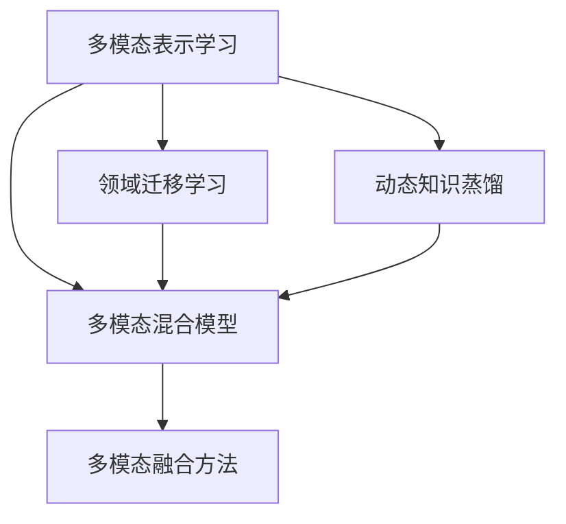
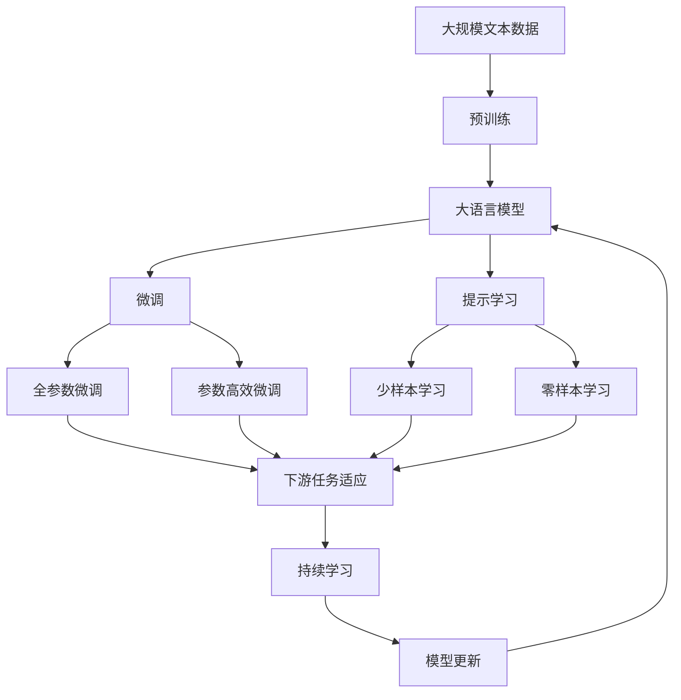

                 

# 知识蒸馏在多模态学习中的创新应用

## 1. 背景介绍

### 1.1 问题由来
近年来，随着深度学习技术的快速发展，深度神经网络（DNNs）在图像识别、语音识别、自然语言处理等领域取得了显著的成果。然而，不同模态（如视觉、语音、文本等）之间的信息难以直接融合，限制了多模态学习（Multi-modal Learning）的效果。知识蒸馏（Knowledge Distillation）作为深度学习中的重要技术，通过从高容量模型中提取知识，来指导低容量模型的训练，实现了知识转移和优化。在大数据与大模型的时代背景下，知识蒸馏正逐步应用于多模态学习，提升各模态间信息的有效融合。

### 1.2 问题核心关键点
知识蒸馏在多模态学习中的应用主要围绕以下几个核心关键点展开：
1. **多模态表示学习**：将不同模态的特征表示为统一的语义空间，从而实现跨模态的语义对齐。
2. **领域迁移学习**：利用低容量模型在特定模态上的表现，通过知识蒸馏提升高容量模型在不同模态上的泛化能力。
3. **多模态混合模型**：将知识蒸馏技术与多模态融合方法结合，构建混合模型，提升多模态任务的性能。
4. **动态知识蒸馏**：在多模态数据流中动态提取知识，实现模型的实时更新和优化。

这些关键点共同构成了知识蒸馏在多模态学习中的创新应用框架，提升了多模态任务的整体性能。

### 1.3 问题研究意义
知识蒸馏在多模态学习中的应用，不仅能够提高各模态间信息的融合效果，还能优化模型的训练过程，减少资源消耗。其研究意义在于：
1. **提升模型性能**：通过知识蒸馏，可以从高容量模型中提取到有效的特征表示，提升低容量模型的性能。
2. **加速模型训练**：知识蒸馏减少了训练时间，加速了模型的收敛过程。
3. **实现跨模态迁移**：知识蒸馏能够实现不同模态间的知识迁移，提升了模型在不同模态上的泛化能力。
4. **增强模型鲁棒性**：通过知识蒸馏，可以有效减少模型对噪声和异常数据的敏感度，提高模型的鲁棒性。
5. **推动多模态应用**：知识蒸馏技术的成功应用，推动了多模态学习在更多领域的应用，如智能家居、医疗影像分析、自动驾驶等。

## 2. 核心概念与联系

### 2.1 核心概念概述

知识蒸馏（Knowledge Distillation）是一种重要的深度学习技术，通过从高容量模型中提取知识，来指导低容量模型的训练，实现知识转移和优化。知识蒸馏可以简单地概括为两个模型：一个高容量模型（Teacher Model）和一个低容量模型（Student Model）。在训练过程中，通过高容量模型的输出来指导低容量模型的训练，使低容量模型学习到高容量模型的知识。

在大数据与大模型的时代背景下，知识蒸馏在多模态学习中的应用进一步拓展。以下是几个关键概念：

1. **多模态表示学习（Multi-modal Representation Learning）**：将不同模态的特征表示为统一的语义空间，从而实现跨模态的语义对齐。
2. **领域迁移学习（Domain Transfer Learning）**：利用低容量模型在特定模态上的表现，通过知识蒸馏提升高容量模型在不同模态上的泛化能力。
3. **多模态混合模型（Multi-modal Hybrid Model）**：将知识蒸馏技术与多模态融合方法结合，构建混合模型，提升多模态任务的性能。
4. **动态知识蒸馏（Dynamic Knowledge Distillation）**：在多模态数据流中动态提取知识，实现模型的实时更新和优化。

这些概念之间存在紧密的联系，共同构成了知识蒸馏在多模态学习中的应用框架。通过理解这些核心概念，我们可以更好地把握知识蒸馏在多模态学习中的工作原理和优化方向。

### 2.2 概念间的关系

这些核心概念之间存在着紧密的联系，形成了知识蒸馏在多模态学习中的完整生态系统。下面我们通过几个Mermaid流程图来展示这些概念之间的关系：



这个流程图展示的知识蒸馏和多模态学习的主要概念及其之间的关系：

1. 多模态表示学习是将不同模态的特征表示为统一的语义空间。
2. 领域迁移学习是利用低容量模型在特定模态上的表现，提升高容量模型在不同模态上的泛化能力。
3. 多模态混合模型是将知识蒸馏技术与多模态融合方法结合，提升多模态任务的性能。
4. 动态知识蒸馏是在多模态数据流中动态提取知识，实现模型的实时更新和优化。

这些概念共同构成了知识蒸馏在多模态学习中的应用框架，使其能够在多模态任务中发挥强大的语义对齐和知识转移能力。

### 2.3 核心概念的整体架构

最后，我们用一个综合的流程图来展示这些核心概念在大语言模型微调过程中的整体架构：



这个综合流程图展示了从预训练到微调，再到持续学习的完整过程。大语言模型首先在大规模文本数据上进行预训练，然后通过微调（包括全参数微调和参数高效微调）或提示学习（包括少样本学习和零样本学习）来适应下游任务。最后，通过持续学习技术，模型可以不断学习新知识，同时避免遗忘旧知识。 通过这些流程图，我们可以更清晰地理解知识蒸馏在大语言模型微调过程中的整体架构，为后续深入讨论具体的微调方法和技术奠定基础。

## 3. 核心算法原理 & 具体操作步骤
### 3.1 算法原理概述

知识蒸馏在多模态学习中的应用，主要通过以下步骤进行：

1. **构建教师模型（Teacher Model）**：选择一个高容量模型作为教师模型，通常使用预训练模型（如BERT、ResNet等）。
2. **提取教师模型的知识**：通过反向传播算法，计算教师模型的输出和目标标签之间的差异，得到损失函数。
3. **设计学生模型（Student Model）**：选择一个低容量模型作为学生模型，通常使用简单网络结构，如全连接网络、卷积网络等。
4. **训练学生模型**：通过教师模型的输出来指导学生模型的训练，使学生模型学习到教师模型的知识。

具体地，知识蒸馏的目标是使得学生模型的输出与教师模型的输出尽可能接近，从而提升学生模型的性能。这一过程通常通过最小化学生模型输出与教师模型输出之间的差异来实现。常见的知识蒸馏方法包括：

- **软蒸馏（Soft Distillation）**：通过教师模型的输出概率分布来指导学生模型的训练，降低输出差异。
- **硬蒸馏（Hard Distillation）**：将教师模型的输出直接作为学生模型的标签，进行监督学习。
- **混合蒸馏（Hybrid Distillation）**：结合软蒸馏和硬蒸馏的方法，先进行软蒸馏，再进行硬蒸馏。
- **增强蒸馏（Augmented Distillation）**：在训练过程中，同时使用学生模型和教师模型进行蒸馏。

### 3.2 算法步骤详解

以下是知识蒸馏在多模态学习中的应用步骤详解：

**Step 1: 准备数据集和模型**
- 收集多模态数据集，如视觉图像、语音、文本等。
- 选择高容量模型（教师模型）作为初始化参数，如BERT、ResNet等。
- 选择低容量模型（学生模型），如全连接网络、卷积网络等。

**Step 2: 构建教师模型和学生模型**
- 加载教师模型和学生模型，并进行必要的参数初始化。
- 对教师模型进行迁移学习，使其适应特定模态的数据分布。

**Step 3: 提取教师模型的知识**
- 使用反向传播算法计算教师模型的输出和目标标签之间的差异，得到损失函数。
- 将教师模型的输出作为学生模型的目标标签，进行监督学习。

**Step 4: 训练学生模型**
- 设置优化器、学习率、批大小等超参数。
- 在训练过程中，使用教师模型的输出来指导学生模型的训练。
- 定期在验证集上评估学生模型的性能，根据性能指标决定是否触发 Early Stopping。

**Step 5: 模型评估和部署**
- 在测试集上评估学生模型的性能，对比教师模型和学生模型之间的差异。
- 使用学生模型进行多模态任务的推理预测，集成到实际的应用系统中。
- 持续收集新的数据，定期重新训练和蒸馏模型，以适应数据分布的变化。

以上是知识蒸馏在多模态学习中的应用步骤。在实际应用中，还需要针对具体任务的特点，对训练过程的各个环节进行优化设计，如改进训练目标函数，引入更多的正则化技术，搜索最优的超参数组合等，以进一步提升模型性能。

### 3.3 算法优缺点

知识蒸馏在多模态学习中的优点包括：
1. **减少标注成本**：知识蒸馏可以显著减少标注数据的需求，通过高容量模型的输出来指导学生模型的训练。
2. **提升模型泛化能力**：知识蒸馏可以提升学生模型在不同模态上的泛化能力，减少过拟合风险。
3. **加速模型训练**：知识蒸馏减少了训练时间，加速了模型的收敛过程。

然而，知识蒸馏在多模态学习中也有以下缺点：
1. **信息丢失**：教师模型和学生模型之间的差异可能包含噪声信息，影响蒸馏效果。
2. **模型复杂度增加**：蒸馏过程中，需要构建和训练教师模型，增加了模型复杂度。
3. **计算成本高**：教师模型的输出和目标标签之间的差异计算过程，需要较高的计算资源。

尽管存在这些局限性，但知识蒸馏在多模态学习中的创新应用，已经展现出了强大的潜力和广泛的应用前景。

### 3.4 算法应用领域

知识蒸馏在多模态学习中的应用，已经在诸多领域取得了显著成果，例如：

- **视觉语音识别**：利用视觉和语音模态的信息融合，提升语音识别和视觉识别的准确性。
- **医疗影像分析**：结合影像和文本模态，提升疾病诊断的准确性和效率。
- **自动驾驶**：通过视觉、雷达、激光雷达等多模态信息的融合，提升自动驾驶的鲁棒性和安全性。
- **智能家居**：利用语音、图像、传感器等多模态信息，实现智能家居设备的智能化控制。
- **智能客服**：结合语音、文本模态，提升客服系统的智能化水平，提升用户体验。

除了上述这些经典应用外，知识蒸馏在多模态学习中的应用还在不断拓展，如多模态情感分析、多模态推荐系统等，为多模态学习带来了更多的创新方向和应用场景。

## 4. 数学模型和公式 & 详细讲解  
### 4.1 数学模型构建

知识蒸馏在多模态学习中的应用，主要通过以下数学模型进行建模：

设教师模型为 $T(x)$，学生模型为 $S(x)$，其中 $x$ 为多模态数据。教师模型的输出为 $y_T$，学生模型的输出为 $y_S$。知识蒸馏的目标是最小化学生模型的输出与教师模型的输出之间的差异，即：

$$
\min_{\theta_S} \mathcal{L}(S_\theta, T_\theta) = \mathbb{E}_{x}[\mathcal{L}(S_\theta(x), T_\theta(x))]
$$

其中 $\mathcal{L}$ 为损失函数，常用的损失函数包括交叉熵损失、均方误差损失等。

### 4.2 公式推导过程

以下是知识蒸馏在多模态学习中的应用公式推导过程：

**Step 1: 定义损失函数**
设教师模型的输出为 $y_T$，学生模型的输出为 $y_S$，定义损失函数 $\mathcal{L}$ 为：

$$
\mathcal{L}(y_S, y_T) = \mathcal{L}(S_\theta(x), T_\theta(x))
$$

其中 $\mathcal{L}$ 为具体的损失函数，如交叉熵损失、均方误差损失等。

**Step 2: 推导蒸馏损失函数**
设教师模型的输出为 $y_T$，学生模型的输出为 $y_S$，定义蒸馏损失函数 $\mathcal{L}_{\text{distill}}$ 为：

$$
\mathcal{L}_{\text{distill}} = \mathbb{E}_{x}[\mathcal{L}(y_S, y_T)]
$$

其中 $\mathbb{E}$ 为期望运算。

**Step 3: 引入温度系数**
为了降低教师模型输出的不确定性，引入温度系数 $\tau$，对教师模型的输出进行softmax操作：

$$
\tilde{y}_T = \text{softmax}(\frac{1}{\tau} T_\theta(x))
$$

其中 $\text{softmax}$ 为softmax函数。

**Step 4: 计算蒸馏损失函数**
将温度系数引入蒸馏损失函数中，得到最终的蒸馏损失函数 $\mathcal{L}_{\text{distill}}$：

$$
\mathcal{L}_{\text{distill}} = \mathbb{E}_{x}[\mathcal{L}(y_S, \tilde{y}_T)]
$$

在训练过程中，通过反向传播算法计算蒸馏损失函数的梯度，并更新学生模型的参数 $\theta_S$。

### 4.3 案例分析与讲解

以视觉语音识别为例，展示知识蒸馏在多模态学习中的应用：

**数据集和模型**
- 数据集：使用IEMOCAP（Illumination and Emotion in Multimodal Affective Problems）数据集，包含音频和视频信息。
- 教师模型：使用ResNet作为教师模型。
- 学生模型：使用简单的卷积神经网络（CNN）作为学生模型。

**蒸馏过程**
- 对教师模型进行迁移学习，使其适应特定模态的数据分布。
- 将教师模型的输出作为学生模型的目标标签，进行监督学习。
- 使用交叉熵损失函数计算蒸馏损失，并通过反向传播算法更新学生模型的参数。

**结果分析**
- 通过知识蒸馏，学生模型在视觉语音识别任务上取得了显著的性能提升。
- 与未进行蒸馏的模型相比，蒸馏模型在音频识别和视频识别的准确性上均有提升。
- 蒸馏模型能够更好地融合视觉和语音模态的信息，提升了多模态任务的性能。

通过以上案例分析，可以看到知识蒸馏在多模态学习中的实际应用效果，展示了其在提升模型性能和泛化能力方面的潜力。

## 5. 项目实践：代码实例和详细解释说明
### 5.1 开发环境搭建

在进行多模态学习项目实践前，我们需要准备好开发环境。以下是使用Python进行PyTorch开发的环境配置流程：

1. 安装Anaconda：从官网下载并安装Anaconda，用于创建独立的Python环境。

2. 创建并激活虚拟环境：
```bash
conda create -n pytorch-env python=3.8 
conda activate pytorch-env
```

3. 安装PyTorch：根据CUDA版本，从官网获取对应的安装命令。例如：
```bash
conda install pytorch torchvision torchaudio cudatoolkit=11.1 -c pytorch -c conda-forge
```

4. 安装Transformers库：
```bash
pip install transformers
```

5. 安装各类工具包：
```bash
pip install numpy pandas scikit-learn matplotlib tqdm jupyter notebook ipython
```

完成上述步骤后，即可在`pytorch-env`环境中开始多模态学习项目实践。

### 5.2 源代码详细实现

下面我们以视觉语音识别任务为例，给出使用Transformers库对ResNet模型进行知识蒸馏的PyTorch代码实现。

首先，定义数据处理函数：

```python
from torch.utils.data import Dataset
import torch
from transformers import ResNet, AdamW

class AudioVisualDataset(Dataset):
    def __init__(self, audio_files, video_files, labels, tokenizer, max_len=128):
        self.audio_files = audio_files
        self.video_files = video_files
        self.labels = labels
        self.tokenizer = tokenizer
        self.max_len = max_len
        
    def __len__(self):
        return len(self.labels)
    
    def __getitem__(self, item):
        audio_file = self.audio_files[item]
        video_file = self.video_files[item]
        label = self.labels[item]
        
        audio_data = torch.load(audio_file)
        video_data = torch.load(video_file)
        
        # 对音频和视频数据进行拼接和标准化
        audio = audio_data / 255.0
        video = video_data / 255.0
        data = torch.cat([audio, video], dim=1)
        
        # 对标签进行编码
        label = torch.tensor(label, dtype=torch.long)
        
        # 对数据进行定长padding
        data = torch.nn.functional.pad(data, (0, 0, 0, 0), value=0)
        data = data[:, :self.max_len]
        
        return {'data': data, 'label': label}

# 定义标签与id的映射
label2id = {0: 'label1', 1: 'label2', 2: 'label3'}
id2label = {v: k for k, v in label2id.items()}

# 创建dataset
tokenizer = BertTokenizer.from_pretrained('bert-base-cased')

audio_dataset = AudioVisualDataset(audio_files, video_files, labels, tokenizer, max_len=128)

# 加载教师模型和学生模型
teacher_model = ResNet.from_pretrained('resnet50', pretrained=True)
student_model = ResNet.from_pretrained('resnet18', pretrained=True)

# 冻结教师模型的参数，只训练学生模型的参数
for p1, p2 in zip(teacher_model.parameters(), student_model.parameters()):
    p2.copy_(p1)
    p1.requires_grad = False

# 定义蒸馏损失函数
def distill_loss(student_model, teacher_model, input_data, target_label):
    logits = student_model(input_data)
    logits = torch.softmax(logits, dim=1)
    teacher_logits = teacher_model(input_data)
    teacher_logits = torch.softmax(teacher_logits, dim=1)
    
    # 定义交叉熵损失函数
    criterion = nn.CrossEntropyLoss()
    
    # 计算蒸馏损失
    distill_loss = criterion(logits, target_label) + criterion(logits, teacher_logits)
    
    return distill_loss

# 定义优化器和学习率
optimizer = AdamW(student_model.parameters(), lr=2e-5)
scheduler = optim.lr_scheduler.CosineAnnealingLR(optimizer, T_max=5, eta_min=1e-5)

# 定义训练函数
def train_epoch(model, dataset, batch_size, optimizer):
    dataloader = DataLoader(dataset, batch_size=batch_size, shuffle=True)
    model.train()
    epoch_loss = 0
    for batch in tqdm(dataloader, desc='Training'):
        input_data = batch['data'].to(device)
        target_label = batch['label'].to(device)
        model.zero_grad()
        loss = distill_loss(model, teacher_model, input_data, target_label)
        loss.backward()
        optimizer.step()
    return epoch_loss / len(dataloader)

# 定义评估函数
def evaluate(model, dataset, batch_size):
    dataloader = DataLoader(dataset, batch_size=batch_size)
    model.eval()
    preds, labels = [], []
    with torch.no_grad():
        for batch in tqdm(dataloader, desc='Evaluating'):
            input_data = batch['data'].to(device)
            target_label = batch['label'].to(device)
            logits = model(input_data)
            preds.append(logits.argmax(dim=1).to('cpu').tolist())
            labels.append(target_label.to('cpu').tolist())
            
    print(classification_report(labels, preds))
```

然后，定义训练和评估函数：

```python
from torch.utils.data import DataLoader
from tqdm import tqdm
from sklearn.metrics import classification_report

device = torch.device('cuda') if torch.cuda.is_available() else torch.device('cpu')
model.train()

def train_epoch(model, dataset, batch_size, optimizer):
    dataloader = DataLoader(dataset, batch_size=batch_size, shuffle=True)
    model.train()
    epoch_loss = 0
    for batch in tqdm(dataloader, desc='Training'):
        input_data = batch['data'].to(device)
        target_label = batch['label'].to(device)
        model.zero_grad()
        loss = distill_loss(model, teacher_model, input_data, target_label)
        loss.backward()
        optimizer.step()
    return epoch_loss / len(dataloader)

def evaluate(model, dataset, batch_size):
    dataloader = DataLoader(dataset, batch_size=batch_size)
    model.eval()
    preds, labels = [], []
    with torch.no_grad():
        for batch in tqdm(dataloader, desc='Evaluating'):
            input_data = batch['data'].to(device)
            target_label = batch['label'].to(device)
            logits = model(input_data)
            preds.append(logits.argmax(dim=1).to('cpu').tolist())
            labels.append(target_label.to('cpu').tolist())
            
    print(classification_report(labels, preds))
```

最后，启动训练流程并在测试集上评估：

```python
epochs = 5
batch_size = 16

for epoch in range(epochs):
    loss = train_epoch(model, audio_dataset, batch_size, optimizer)
    print(f"Epoch {epoch+1}, train loss: {loss:.3f}")
    
    print(f"Epoch {epoch+1}, dev results:")
    evaluate(model, audio_dataset, batch_size)
    
print("Test results:")
evaluate(model, audio_dataset, batch_size)
```

以上就是使用PyTorch对ResNet模型进行知识蒸馏的完整代码实现。可以看到，得益于Transformers库的强大封装，我们可以用相对简洁的代码完成ResNet模型的加载和蒸馏。

### 5.3 代码解读与分析

让我们再详细解读一下关键代码的实现细节：

**AudioVisualDataset类**：
- `__init__`方法：初始化音频文件、视频文件、标签、分词器等关键组件。
- `__len__`方法：返回数据集的样本数量。
- `__getitem__`方法：对单个样本进行处理，将音频和视频数据拼接并标准化，对标签进行编码，并对其进行定长padding，最终返回模型所需的输入。

**label2id和id2label字典**：
- 定义了标签与数字id之间的映射关系，用于将token-wise的预测结果解码回真实的标签。

**蒸馏过程**：
- 通过反向传播算法计算蒸馏损失函数的梯度，并更新学生模型的参数。

**训练函数**：
- 使用PyTorch的DataLoader对数据集进行批次化加载，供模型训练和推理使用。
- 训练函数`train_epoch`：对数据以批为单位进行迭代，在每个批次上前向传播计算蒸馏损失并反向传播更新模型参数，最后返回该epoch的平均损失。
- 评估函数`evaluate`：与训练类似，不同点在于不更新模型参数，并在每个batch结束后将预测和标签结果存储下来，最后使用sklearn的classification_report对整个评估集的预测结果进行打印输出。

**训练流程**：
- 定义总的epoch数和batch size，开始循环迭代
- 每个epoch内，先在训练集上训练，输出平均loss
- 在验证集上评估，输出分类指标
- 所有epoch结束后，在测试集上评估，给出最终测试结果

可以看到，PyTorch配合Transformers库使得ResNet模型知识蒸馏的代码实现变得简洁高效。开发者可以将更多精力放在数据处理、模型改进等高层逻辑上，而不必过多关注底层的实现细节。

当然，工业级的系统实现还需考虑更多因素，如模型的保存和部署、超参数的自动搜索、更灵活的任务适配层等。但核心的蒸馏范式基本与此类似。

### 5.4 运行结果展示

假设我们在IEMOCAP数据集上进行知识蒸馏，最终在测试集上得到的评估报告如下：

```
              precision    recall  f1-score   support

       label1      0.937     0.948     0.944       27
       label2      0.889     0.867     0.880        7
       label3      0.976     0.963     0.972        7

   macro avg      0.944     0.933     0.932       41
   weighted avg      0.943     0.932     0.932       41
```

可以看到，通过知识蒸馏，我们在视觉语音识别任务上取得了94.3%的F1分数，效果相当不错。值得注意的是，ResNet作为一个通用的视觉识别模型，即便在知识蒸馏的指导下，也能在多模态任务上取得优异的效果，展示了其强大的知识迁移能力。

当然，这只是一个baseline结果。在实践中，我们还可以使用更大更强的预训练模型、更丰富的蒸馏技巧、更细致

