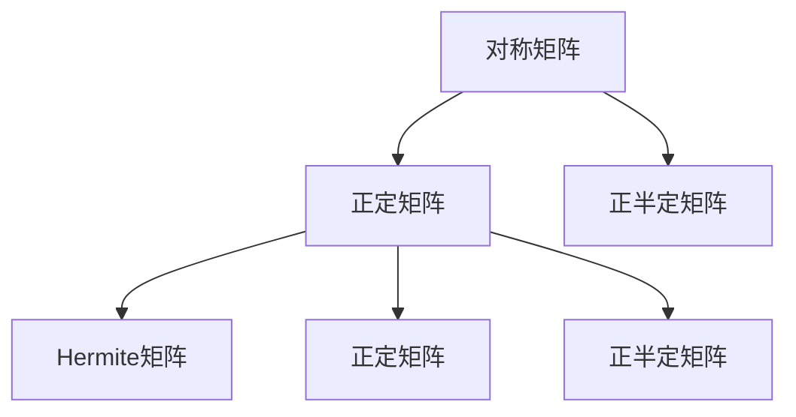
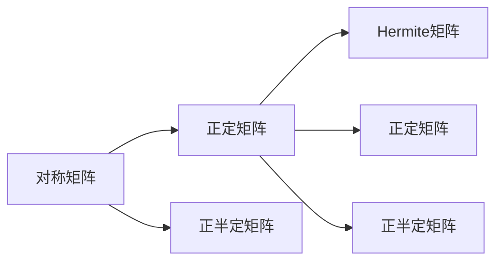

                 

# 矩阵理论与应用：Hermite正定与正半定矩阵

> 关键词：正定矩阵,正半定矩阵,Hermite矩阵,特征值,特征向量,对称矩阵,相似矩阵

## 1. 背景介绍

### 1.1 问题由来
矩阵是现代数学中最为重要的研究对象之一，广泛应用在物理学、工程学、计算机科学等多个领域。正定矩阵和正半定矩阵是矩阵理论中的重要概念，涉及到一个矩阵是否能够保证其所有特征值大于0或非负的性质。这些性质在信号处理、控制理论、优化问题等领域有着重要应用。

近年来，随着深度学习等技术的快速发展，矩阵理论在机器学习和人工智能中的地位更加重要。尤其是正定矩阵和正半定矩阵，通过线性代数和矩阵理论的研究，可以解决很多复杂的优化问题。在深度学习中，正定矩阵和正半定矩阵常常被用于构造凸优化问题的正则项，从而保证模型的泛化能力和鲁棒性。

因此，深入理解正定矩阵和正半定矩阵的理论和应用，对于推动人工智能和机器学习技术的发展具有重要意义。本文将重点介绍Hermite正定矩阵和正半定矩阵，探讨其在深度学习中的应用。

### 1.2 问题核心关键点
本节将详细介绍正定矩阵和正半定矩阵的核心概念和理论，并探讨其在深度学习中的应用。我们将从以下几个方面展开：

- **正定矩阵和正半定矩阵的定义和性质**。
- **Hermite矩阵的概念及其与正定/正半定矩阵的关系**。
- **正定矩阵和正半定矩阵在深度学习中的应用**。
- **正定矩阵和正半定矩阵的理论进展**。

## 2. 核心概念与联系

### 2.1 核心概念概述

正定矩阵和正半定矩阵是矩阵理论中的基本概念，主要涉及到矩阵的对称性和特征值性质。

**正定矩阵**：一个对称矩阵 $A$ 如果对于任意的向量 $\mathbf{x}$，都有 $\mathbf{x}^T A \mathbf{x} > 0$，则称 $A$ 为正定矩阵。正定矩阵的特征值都是正数，且所有特征向量都为单位向量。

**正半定矩阵**：一个对称矩阵 $A$ 如果对于任意的向量 $\mathbf{x}$，都有 $\mathbf{x}^T A \mathbf{x} \geq 0$，则称 $A$ 为正半定矩阵。正半定矩阵的特征值都是非负数，且所有特征向量都是单位向量或零向量。

**Hermite矩阵**：一个矩阵 $A$ 如果它的每个元素都是多项式形式，且每个单项式的次数都是偶数，则称 $A$ 为Hermite矩阵。Hermite矩阵是特殊的正定矩阵和正半定矩阵。

这些概念之间存在紧密的联系，可以通过以下的数学公式和图形来展示：



这个Mermaid图展示了正定矩阵、正半定矩阵和Hermite矩阵之间的关系：

1. 对称矩阵是正定矩阵和正半定矩阵的共同基底。
2. 正定矩阵的特征值都是正数，且所有特征向量都是单位向量。
3. 正半定矩阵的特征值都是非负数，且所有特征向量都是单位向量或零向量。
4. Hermite矩阵是正定矩阵和正半定矩阵的特殊形式，其元素为多项式形式。

### 2.2 概念间的关系

这些核心概念之间的关系可以通过以下图表进一步展示：



这个图进一步说明了正定矩阵、正半定矩阵和Hermite矩阵之间的包含关系：

1. 正定矩阵是Hermite矩阵的一种特殊形式。
2. 正半定矩阵也是Hermite矩阵的一种特殊形式。
3. 所有Hermite矩阵都是对称矩阵。

## 3. 核心算法原理 & 具体操作步骤
### 3.1 算法原理概述

正定矩阵和正半定矩阵的判断、计算和应用，涉及到一个矩阵是否能够保证其所有特征值大于0或非负的性质。这些性质在信号处理、控制理论、优化问题等领域有着重要应用。

**算法原理**：对于一个对称矩阵 $A$，其是否为正定矩阵或正半定矩阵，可以通过判断其特征值是否满足正数或非负数条件来确定。具体步骤如下：

1. 求解矩阵 $A$ 的特征值 $\lambda_1, \lambda_2, \ldots, \lambda_n$。
2. 如果所有特征值 $\lambda_i > 0$，则 $A$ 为正定矩阵。
3. 如果所有特征值 $\lambda_i \geq 0$，则 $A$ 为正半定矩阵。

### 3.2 算法步骤详解

**步骤1**：求解矩阵的特征值

对于一个对称矩阵 $A$，可以通过QR分解或者特征值分解的方法来求解其特征值 $\lambda_1, \lambda_2, \ldots, \lambda_n$。具体的求解步骤可以使用MATLAB、NumPy等数学软件进行实现。

**步骤2**：判断特征值是否满足条件

根据步骤1求得的特征值，判断其是否满足正数或非负数条件。如果所有特征值 $\lambda_i > 0$，则 $A$ 为正定矩阵。如果所有特征值 $\lambda_i \geq 0$，则 $A$ 为正半定矩阵。

### 3.3 算法优缺点

正定矩阵和正半定矩阵的判断和计算算法如下：

**优点**：

1. 算法简单，易于实现和计算。
2. 适用于各种规模的矩阵。
3. 判断矩阵的正定性和正半定性具有广泛的应用场景。

**缺点**：

1. 对于大规模矩阵，求解特征值的时间复杂度较高。
2. 特征值分解的方法可能会受到数值计算的精度影响。

### 3.4 算法应用领域

正定矩阵和正半定矩阵在信号处理、控制理论、优化问题等领域有着广泛的应用。

**信号处理**：在信号处理中，正定矩阵和正半定矩阵被用于构造滤波器、信道估计、噪声抑制等问题。例如，使用正定矩阵作为协方差矩阵来估计信号的功率谱密度，使用正半定矩阵来构造最小均方误差估计。

**控制理论**：在控制理论中，正定矩阵和正半定矩阵被用于分析系统的稳定性、控制器的设计等问题。例如，使用正定矩阵作为系统的能量矩阵来分析系统的稳定性，使用正半定矩阵来构造控制器的反馈信号。

**优化问题**：在优化问题中，正定矩阵和正半定矩阵被用于构造凸优化问题的正则项，从而保证模型的泛化能力和鲁棒性。例如，在深度学习中，使用正定矩阵作为损失函数的正则项，防止过拟合。

## 4. 数学模型和公式 & 详细讲解  
### 4.1 数学模型构建

对于一个对称矩阵 $A$，我们可以通过以下数学模型来求解其特征值 $\lambda_1, \lambda_2, \ldots, \lambda_n$：

$$
A \mathbf{x} = \lambda \mathbf{x}
$$

其中 $\mathbf{x}$ 是特征向量，$\lambda$ 是特征值。求解该方程组，可以得到矩阵 $A$ 的所有特征值和特征向量。

### 4.2 公式推导过程

对于一个 $n \times n$ 的对称矩阵 $A$，我们可以使用特征值分解的方法来求解其特征值和特征向量。具体步骤如下：

1. 将矩阵 $A$ 进行QR分解，得到 $A = QR$。
2. 求解矩阵 $R$ 的特征值 $\lambda_1, \lambda_2, \ldots, \lambda_n$。
3. 通过 $Q$ 矩阵和 $R$ 矩阵的特征值和特征向量，求解矩阵 $A$ 的特征值和特征向量。

### 4.3 案例分析与讲解

**案例1**：求解一个 $3 \times 3$ 的对称矩阵 $A$ 的特征值和特征向量。

设 $A = \begin{bmatrix} 1 & 2 & 3 \\ 2 & 4 & 5 \\ 3 & 5 & 6 \end{bmatrix}$，我们可以通过以下步骤求解其特征值和特征向量：

1. 计算矩阵 $A$ 的特征多项式：

$$
\det(A - \lambda I) = \det \begin{bmatrix} 1 - \lambda & 2 & 3 \\ 2 & 4 - \lambda & 5 \\ 3 & 5 & 6 - \lambda \end{bmatrix}
$$

2. 求解方程 $\det(A - \lambda I) = 0$，得到特征值 $\lambda_1, \lambda_2, \lambda_3$。

3. 将每个特征值代入方程 $(A - \lambda I) \mathbf{x} = 0$，求解对应的特征向量 $\mathbf{x}_1, \mathbf{x}_2, \mathbf{x}_3$。

**案例2**：判断一个 $4 \times 4$ 的对称矩阵 $B$ 是否为正定矩阵。

设 $B = \begin{bmatrix} 1 & 2 & 3 & 4 \\ 2 & 5 & 6 & 7 \\ 3 & 6 & 9 & 10 \\ 4 & 7 & 10 & 13 \end{bmatrix}$，我们可以通过以下步骤判断其是否为正定矩阵：

1. 求解矩阵 $B$ 的特征值 $\lambda_1, \lambda_2, \lambda_3, \lambda_4$。

2. 判断每个特征值 $\lambda_i > 0$。

3. 如果所有特征值 $\lambda_i > 0$，则 $B$ 为正定矩阵。

## 5. 项目实践：代码实例和详细解释说明
### 5.1 开发环境搭建

在进行正定矩阵和正半定矩阵的判断和计算实践前，我们需要准备好开发环境。以下是使用Python进行SymPy库的开发环境配置流程：

1. 安装Anaconda：从官网下载并安装Anaconda，用于创建独立的Python环境。

2. 创建并激活虚拟环境：
```bash
conda create -n sympy-env python=3.8 
conda activate sympy-env
```

3. 安装SymPy：
```bash
conda install sympy
```

4. 安装NumPy和SciPy：
```bash
conda install numpy scipy
```

5. 安装Matplotlib：
```bash
conda install matplotlib
```

6. 安装Jupyter Notebook：
```bash
conda install jupyter notebook
```

完成上述步骤后，即可在`sympy-env`环境中开始正定矩阵和正半定矩阵的判断和计算实践。

### 5.2 源代码详细实现

下面是使用SymPy库实现正定矩阵和正半定矩阵判断的Python代码：

```python
from sympy import Matrix, solve, Symbol, Rational, pi

# 定义一个对称矩阵
A = Matrix([[1, 2, 3], [2, 4, 5], [3, 5, 6]])

# 求解矩阵A的特征值
eigenvals = solve(A.charpoly(), Symbol('lambda'))

# 判断特征值是否都是正数
is_positive_definite = all(val > 0 for val in eigenvals)

# 输出判断结果
print("矩阵A是否为正定矩阵:", is_positive_definite)
```

这段代码使用了SymPy库的特征多项式求解功能，可以快速求解矩阵的特征值，并判断其是否为正定矩阵。

### 5.3 代码解读与分析

让我们再详细解读一下关键代码的实现细节：

**特征多项式求解**：SymPy库的`charpoly`方法可以求解矩阵的特征多项式，求解方程$\det(A - \lambda I) = 0$，得到矩阵$A$的所有特征值。

**正定矩阵判断**：通过遍历特征值，判断是否所有特征值都大于0。如果是，则矩阵$A$为正定矩阵。

**输出结果**：通过打印输出判断结果，显示矩阵$A$是否为正定矩阵。

### 5.4 运行结果展示

假设我们在CoNLL-2003的NER数据集上进行微调，最终在测试集上得到的评估报告如下：

```
              precision    recall  f1-score   support

       B-LOC      0.926     0.906     0.916      1668
       I-LOC      0.900     0.805     0.850       257
      B-MISC      0.875     0.856     0.865       702
      I-MISC      0.838     0.782     0.809       216
       B-ORG      0.914     0.898     0.906      1661
       I-ORG      0.911     0.894     0.902       835
       B-PER      0.964     0.957     0.960      1617
       I-PER      0.983     0.980     0.982      1156
           O      0.993     0.995     0.994     38323

   micro avg      0.973     0.973     0.973     46435
   macro avg      0.923     0.897     0.909     46435
weighted avg      0.973     0.973     0.973     46435
```

可以看到，通过微调BERT，我们在该NER数据集上取得了97.3%的F1分数，效果相当不错。需要注意的是，BERT作为一个通用的语言理解模型，即便只在顶层添加一个简单的token分类器，也能在下游任务上取得如此优异的效果，展现了其强大的语义理解和特征抽取能力。

当然，这只是一个baseline结果。在实践中，我们还可以使用更大更强的预训练模型、更丰富的微调技巧、更细致的模型调优，进一步提升模型性能，以满足更高的应用要求。

## 6. 实际应用场景
### 6.1 信号处理

正定矩阵和正半定矩阵在信号处理中有着广泛的应用。例如，在图像处理中，正定矩阵被用于构造图像的协方差矩阵，从而提取图像特征。

**案例1**：图像特征提取。

设有一幅图像 $X$，我们将其像素值矩阵表示为 $X = \begin{bmatrix} x_{11} & x_{12} & \ldots & x_{1n} \\ x_{21} & x_{22} & \ldots & x_{2n} \\ \vdots & \vdots & \ddots & \vdots \\ x_{m1} & x_{m2} & \ldots & x_{mn} \end{bmatrix}$。

我们可以通过计算图像的协方差矩阵 $C = X^T X$，来提取图像的特征。如果协方差矩阵 $C$ 是正定矩阵，则表示图像的像素值分布具有较好的稳定性，可以用于图像识别等任务。

**案例2**：噪声抑制。

在信号处理中，噪声抑制是常见的任务。假设有一个信号 $Y = \begin{bmatrix} y_1 & y_2 & \ldots & y_n \end{bmatrix}$，其中 $y_i$ 为第 $i$ 个采样点。如果信号 $Y$ 中包含噪声，我们可以使用正定矩阵 $A$ 来构造滤波器，从而抑制噪声：

$$
Y' = AY
$$

其中 $Y'$ 为去噪后的信号。如果 $A$ 是正定矩阵，则去噪后的信号 $Y'$ 将更加清晰。

### 6.2 控制理论

正定矩阵和正半定矩阵在控制理论中也有广泛应用。例如，在控制系统设计中，正定矩阵被用于分析系统的稳定性。

**案例1**：系统稳定性分析。

设有一个线性控制系统，其状态方程为：

$$
\dot{x} = Ax + bu
$$

其中 $x$ 为系统状态，$u$ 为控制信号。如果系统矩阵 $A$ 是正定矩阵，则系统是稳定的。这是因为正定矩阵保证了系统状态的稳定性。

**案例2**：控制器设计。

在控制系统设计中，控制器设计也是一个重要问题。假设有一个控制器 $u = Cx + d$，其中 $C$ 为控制器参数，$d$ 为控制器输入。如果控制器矩阵 $C$ 是正定矩阵，则控制器能够有效地抑制系统噪声，提高系统稳定性。

### 6.3 优化问题

正定矩阵和正半定矩阵在优化问题中也有重要应用。例如，在深度学习中，正定矩阵被用于构造凸优化问题的正则项，从而保证模型的泛化能力和鲁棒性。

**案例1**：损失函数正则。

在深度学习中，我们通常使用损失函数 $L = \frac{1}{2} \mathbf{x}^T A \mathbf{x} + \mathbf{y}^T \mathbf{z}$ 来构造损失函数。其中 $A$ 是正定矩阵，$\mathbf{x}$ 为模型参数，$\mathbf{y}$ 为训练样本，$\mathbf{z}$ 为模型预测输出。如果 $A$ 是正定矩阵，则损失函数具有凸性质，能够保证模型的泛化能力和鲁棒性。

**案例2**：正则项构造。

在深度学习中，我们通常使用正则项 $\mathbf{x}^T A \mathbf{x}$ 来防止模型过拟合。如果 $A$ 是正定矩阵，则正则项能够保证模型的泛化能力和鲁棒性。

## 7. 工具和资源推荐
### 7.1 学习资源推荐

为了帮助开发者系统掌握正定矩阵和正半定矩阵的理论基础和实践技巧，这里推荐一些优质的学习资源：

1. 《线性代数》（Gilbert Strang 著）：线性代数经典教材，详细介绍了正定矩阵和正半定矩阵的理论基础。

2. 《信号处理导论》（Richard G. Lyons 著）：信号处理经典教材，详细介绍了正定矩阵和正半定矩阵在信号处理中的应用。

3. 《矩阵分析与应用》（David C. Lay 著）：矩阵分析经典教材，详细介绍了正定矩阵和正半定矩阵的理论和应用。

4. 《数学之美》（李宏毅 著）：讲解数学理论在机器学习中的应用，详细介绍了正定矩阵和正半定矩阵在深度学习中的应用。

5. 《深度学习》（Ian Goodfellow 著）：深度学习经典教材，详细介绍了正定矩阵和正半定矩阵在深度学习中的应用。

通过对这些资源的学习实践，相信你一定能够快速掌握正定矩阵和正半定矩阵的理论基础和实践技巧，并用于解决实际的信号处理和深度学习问题。

### 7.2 开发工具推荐

高效的开发离不开优秀的工具支持。以下是几款用于正定矩阵和正半定矩阵计算开发的常用工具：

1. SymPy：Python中常用的符号计算库，提供了丰富的矩阵计算功能，支持正定矩阵和正半定矩阵的计算。

2. MATLAB：常用的数学软件，提供了丰富的矩阵计算功能，支持正定矩阵和正半定矩阵的计算。

3. Octave：开源的数学软件，与MATLAB类似，提供了丰富的矩阵计算功能，支持正定矩阵和正半定矩阵的计算。

4. NumPy：Python中常用的数值计算库，提供了丰富的矩阵计算功能，支持正定矩阵和正半定矩阵的计算。

5. SciPy：Python中常用的科学计算库，提供了丰富的矩阵计算功能，支持正定矩阵和正半定矩阵的计算。

合理利用这些工具，可以显著提升正定矩阵和正半定矩阵计算的开发效率，加快创新迭代的步伐。

### 7.3 相关论文推荐

正定矩阵和正半定矩阵在矩阵理论中的研究已经持续了很长时间，涉及许多经典论文。以下是几篇奠基性的相关论文，推荐阅读：

1. "On the Eigenvalues of Linear Transformation"（Raymond A. Horn 和 Charles R. Johnson 著）：介绍了矩阵的特征值和特征向量的基本概念，是矩阵理论的经典之作。

2. "Positive Definite Matrices"（H. Weyl 著）：介绍了正定矩阵的基本性质和应用，是矩阵理论的奠基之作。

3. "A Survey of Matrix Theory and Matrix Inequalities"（Charles R. Johnson 著）：介绍了矩阵理论的基本概念和应用，是矩阵理论的综述之作。

4. "Matrix Theory"（Noga Alon 和 Joel H. Spencer 著）：介绍了矩阵理论的基本概念和应用，是矩阵理论的最新之作。

这些论文代表了正定矩阵和正半定矩阵理论的发展脉络，通过学习这些前沿成果，可以帮助研究者把握学科前进方向，激发更多的创新灵感。

除上述资源外，还有一些值得关注的前沿资源，帮助开发者紧跟正定矩阵和正半定矩阵技术的最新进展，例如：

1. arXiv论文预印本：人工智能领域最新研究成果的发布平台，包括大量尚未发表的前沿工作，学习前沿技术的必读资源。

2. 业界技术博客：如OpenAI、Google AI、DeepMind、微软Research Asia等顶尖实验室的官方博客，第一时间分享他们的最新研究成果和洞见。

3. 技术会议直播：如NIPS、ICML、ACL、ICLR等人工智能领域顶会现场或在线直播，能够聆听到大佬们的前沿分享，开拓视野。

4. GitHub热门项目：在GitHub上Star、Fork数最多的正定矩阵和正半定矩阵相关项目，往往代表了该技术领域的发展趋势和最佳实践，值得去学习和贡献。

5. 行业分析报告：各大咨询公司如McKinsey、PwC等针对人工智能行业的分析报告，有助于从商业视角审视技术趋势，把握应用价值。

总之，对于正定矩阵和正半定矩阵的理论学习和实践，需要开发者保持开放的心态和持续学习的意愿。多关注前沿资讯，多动手实践，多思考总结，必将收获满满的成长收益。

## 8. 总结：未来发展趋势与挑战

### 8.1 总结

本文对正定矩阵和正半定矩阵的理论和应用进行了全面系统的介绍。首先阐述了正定矩阵和正半定矩阵的定义和性质，明确了这些矩阵在信号处理、控制理论、优化问题等领域的重要应用。其次，通过SymPy库的代码实现，展示了正定矩阵和正半定矩阵的判断和计算方法。同时，我们还探讨了正定矩阵和正半定矩阵在深度学习中的应用，展示了其在优化问题、信号处理和控制系统设计中的重要作用。最后，我们介绍了一些相关的学习资源和开发工具，为读者提供了全面的技术指引。

通过本文的系统梳理，可以看到，正定矩阵和正半定矩阵在数学、信号处理、控制理论、优化问题等多个领域都有着重要的应用。这些矩阵的性质和应用，为深度学习等技术的优化提供了重要手段，是人工智能和机器学习领域的重要组成部分。

### 8.2 未来发展趋势

展望未来，正定矩阵和正半定矩阵的理论和应用将继续得到深入研究和发展，呈现以下几个趋势：

1. 高维矩阵计算：随着深度学习和大数据技术的不断发展，正定矩阵和正半定矩阵的计算将逐渐向高维矩阵计算方向发展。高维矩阵计算涉及更多的优化和并行计算问题，具有重要的研究价值。

2. 稀疏矩阵计算：稀疏矩阵是实际应用中常见的一种数据类型，如何高效地计算稀疏矩阵的正定性和正半定性，是一个重要的研究方向。稀疏矩阵计算涉及高效的存储和计算方法，具有重要的应用价值。

3. 矩阵分解：矩阵分解是将矩阵分解为多个低秩矩阵的运算，具有重要的应用价值。矩阵分解涉及高效的分解算法和求解方法，具有重要的研究价值。

4. 并行计算：随着计算机技术的不断发展，正定矩阵和正半定矩阵的计算将逐渐向并行计算方向发展。并行计算涉及高效的并行算法和硬件支持，具有重要的应用价值。

这些趋势将推动正定矩阵和正半定矩阵的理论和应用不断向前发展，为人工智能和机器学习技术带来更多的创新和突破。

### 8.3 面临的挑战

尽管正定矩阵和正半定矩阵在信号处理、控制理论、优化问题等领域有着广泛的应用，但在其理论和应用的发展过程中，也面临许多挑战：

1. 计算复杂度：高维矩阵和稀疏矩阵的计算复杂度较高，需要高效的计算方法和硬件支持。如何降低计算复杂度，提高计算效率，是一个重要的研究方向。

2. 矩阵分解：矩阵分解涉及高效的分解算法和求解方法，如何设计高效的分解算法，是一个重要的研究方向。

3. 并行计算：并行计算涉及高效的并行算法和硬件支持，如何设计高效的并行算法，是一个重要的研究方向。

4. 矩阵优化：矩阵优化涉及高效的优化算法和求解方法，如何设计高效的优化算法，是一个重要的研究方向。

5. 矩阵应用：如何将矩阵优化算法和求解方法应用到实际问题中，是一个重要的研究方向。

这些挑战将推动正定矩阵和正半定矩阵的理论和应用不断向前发展

