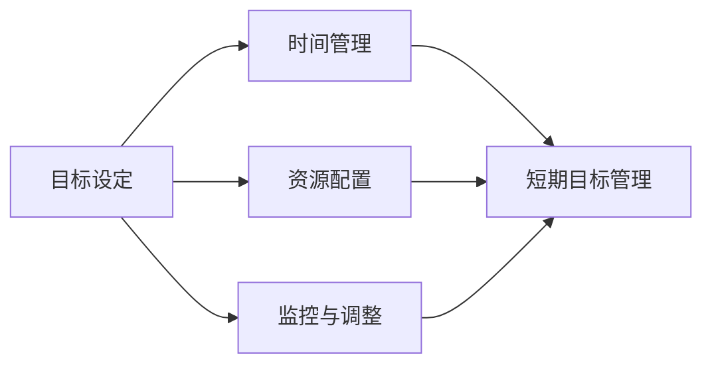
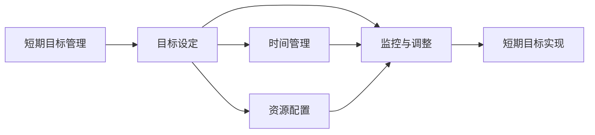

                 

# 短期目标管理的意识功能

在当今快速变化的世界中，短期目标管理（Short-Term Goal Management, STGM）变得愈发重要。无论是个人还是组织，都面临着如何在短时间内实现既定目标的挑战。本文旨在探讨短期目标管理的意识功能，以帮助读者更好地理解和管理短期目标，从而在竞争激烈的市场中脱颖而出。

## 1. 背景介绍

### 1.1 问题由来

随着信息技术的飞速发展，企业在业务竞争中面临着越来越多的不确定性和挑战。如何在短时间内实现目标，成为了企业关注的焦点。传统目标管理（Long-Term Goal Management, LTGM）往往着眼于长期发展，而忽视了短期目标的实现。然而，短期的成功往往是长期发展的基石。在当今瞬息万变的市场环境中，短期目标管理变得尤为关键。

### 1.2 问题核心关键点

短期目标管理的关键在于以下几个方面：

- **目标设定**：明确具体的短期目标，避免模糊不清。
- **时间管理**：合理分配时间，确保目标在规定时间内完成。
- **资源配置**：合理配置资源，确保目标的实现。
- **监控与调整**：实时监控目标进展，并根据实际情况进行调整。

### 1.3 问题研究意义

短期目标管理对于提高企业应对市场变化的能力，提升组织效率，增强员工士气具有重要意义。通过有效的短期目标管理，企业可以更快地适应市场变化，抓住市场机遇，实现快速增长。同时，短期目标管理的意识功能也有助于个人提高工作效率，实现职业发展。

## 2. 核心概念与联系

### 2.1 核心概念概述

为了更好地理解短期目标管理的意识功能，本节将介绍几个核心概念：

- **短期目标管理（Short-Term Goal Management, STGM）**：指在一定时间范围内，通过明确目标、合理规划、高效执行、实时监控，实现既定目标的过程。
- **目标设定（Goal Setting）**：明确短期目标的具体内容、时间节点和实现步骤。
- **时间管理（Time Management）**：合理安排时间，确保目标在规定时间内完成。
- **资源配置（Resource Allocation）**：合理配置资源，确保目标的实现。
- **监控与调整（Monitoring and Adjusting）**：实时监控目标进展，并根据实际情况进行调整。

这些概念之间存在着紧密的联系，共同构成了短期目标管理的整体框架。通过这些核心概念，我们可以更好地理解和管理短期目标。

### 2.2 概念间的关系

这些核心概念之间的逻辑关系可以通过以下Mermaid流程图来展示：



这个流程图展示了短期目标管理各环节之间的关系：

1. 目标设定是短期目标管理的起点，明确了目标的具体内容和实现步骤。
2. 时间管理合理安排时间，确保目标在规定时间内完成。
3. 资源配置合理分配资源，确保目标的实现。
4. 监控与调整实时监控目标进展，并根据实际情况进行调整。
5. 这些环节共同构成了短期目标管理的完整流程。

### 2.3 核心概念的整体架构

最后，我们用一个综合的流程图来展示这些核心概念在大语言模型微调过程中的整体架构：



这个综合流程图展示了短期目标管理各环节之间的关系，以及最终目标的实现过程。

## 3. 核心算法原理 & 具体操作步骤

### 3.1 算法原理概述

短期目标管理的核心在于通过明确目标、合理规划、高效执行、实时监控，实现既定目标。其算法原理可以概括为以下几个步骤：

1. 目标设定：明确短期目标的具体内容、时间节点和实现步骤。
2. 时间管理：合理安排时间，确保目标在规定时间内完成。
3. 资源配置：合理配置资源，确保目标的实现。
4. 监控与调整：实时监控目标进展，并根据实际情况进行调整。

### 3.2 算法步骤详解

以下是短期目标管理的具体操作步骤：

**Step 1: 目标设定**

- 确定短期目标的具体内容、时间节点和实现步骤。
- 使用SMART原则（Specific, Measurable, Achievable, Relevant, Time-bound），确保目标明确、可测量、可实现、相关且有时间限制。

**Step 2: 时间管理**

- 划分任务时间表，明确每个任务的具体时间节点。
- 使用时间管理工具，如甘特图、日历、任务管理软件等，合理安排时间。
- 设置时间缓冲区，避免任务延误。

**Step 3: 资源配置**

- 确定所需资源，包括人力、物力、财力等。
- 合理分配资源，确保资源的高效利用。
- 使用资源管理工具，如项目管理软件、资源规划工具等，优化资源配置。

**Step 4: 监控与调整**

- 实时监控目标进展，使用进度跟踪工具，如看板、任务进度表等。
- 定期评估目标进展，并根据实际情况进行调整。
- 及时发现问题，并采取措施进行纠正。

### 3.3 算法优缺点

短期目标管理具有以下优点：

- **快速响应**：短期目标管理能够快速响应市场变化，抓住市场机遇。
- **高效执行**：通过合理安排时间和资源，提高工作效率，缩短目标实现时间。
- **灵活调整**：实时监控目标进展，并根据实际情况进行调整，确保目标的顺利实现。

同时，该方法也存在一定的局限性：

- **风险较高**：短期目标管理对市场变化敏感，目标实现过程中可能面临较高的风险。
- **资源浪费**：如果不合理分配资源，可能会导致资源浪费。
- **短期视野**：过于关注短期目标，可能忽视长期发展的需要。

### 3.4 算法应用领域

短期目标管理广泛应用于各个领域，例如：

- **企业运营管理**：通过短期目标管理，企业能够快速响应市场变化，抓住市场机遇，实现快速增长。
- **项目管理**：通过合理安排时间、资源，实时监控进展，提高项目管理效率。
- **个人职业发展**：通过设定短期职业目标，提升工作效率，实现职业发展。
- **创新创业**：通过设定短期创新目标，快速推出新产品或服务，抢占市场先机。
- **教育培训**：通过设定短期学习目标，提高学习效率，实现知识和技能提升。

除了上述这些领域，短期目标管理还被广泛应用于各种场景，如应急管理、事件处理等，其灵活性使其能够在多种情况下发挥重要作用。

## 4. 数学模型和公式 & 详细讲解 & 举例说明

### 4.1 数学模型构建

假设短期目标管理的目标为 $G$，包括具体内容 $G_s$、时间节点 $T_G$、实现步骤 $M_G$。设短期目标管理的步骤为 $S$，包括时间管理 $T_S$、资源配置 $R_S$、监控与调整 $M_S$。短期目标管理的整体模型可以表示为：

$$
G = f(G_s, T_G, M_G, S)
$$

其中，$f$ 表示目标实现函数，将目标内容、时间节点、实现步骤和步骤进行整合，最终实现目标。

### 4.2 公式推导过程

以下我们将推导一个简单的数学模型，用于评估短期目标管理的效率。假设目标内容为 $G_s$，时间节点为 $T_G$，实现步骤为 $M_G$，步骤为 $S$，则目标实现效率 $E$ 可以表示为：

$$
E = \frac{G_s}{T_G + R_S + M_S}
$$

其中，$T_G$ 表示目标完成所需时间，$R_S$ 表示资源配置效率，$M_S$ 表示监控与调整效率。

通过上述公式，我们可以评估短期目标管理的整体效率，从而发现其中存在的问题，进行优化。

### 4.3 案例分析与讲解

假设某企业在市场推出一款新产品，设定的短期目标为在三个月内实现销售 100 万件，具体内容为市场推广、产品设计、生产调度和物流配送。根据实际情况，我们将目标实现效率 $E$ 进行评估，发现主要瓶颈在于市场推广和物流配送。此时，企业可以优化资源配置，将更多资源投入到市场推广和物流配送上，提高目标实现效率。

## 5. 项目实践：代码实例和详细解释说明

### 5.1 开发环境搭建

在进行短期目标管理的实践前，我们需要准备好开发环境。以下是使用Python进行短期目标管理工具开发的环境配置流程：

1. 安装Python：从官网下载并安装Python，用于进行工具开发。

2. 安装所需的库和框架：安装Flask、Django、SQLAlchemy等Python Web开发框架，用于开发Web应用程序。

3. 安装任务管理工具：安装Todoist、Trello等任务管理工具，用于模拟任务管理流程。

4. 安装时间管理工具：安装Google Calendar、Apple Calendar等时间管理工具，用于模拟时间管理流程。

5. 安装资源管理工具：安装MS Project、GanttProject等资源管理工具，用于模拟资源管理流程。

完成上述步骤后，即可在本地搭建短期目标管理工具的开发环境。

### 5.2 源代码详细实现

以下是一个简单的短期目标管理工具的Python代码实现，包括目标设定、时间管理、资源配置和监控与调整等功能：

```python
from flask import Flask, render_template
from flask_sqlalchemy import SQLAlchemy
from datetime import datetime

app = Flask(__name__)
app.config['SQLALCHEMY_DATABASE_URI'] = 'sqlite:////tmp/test.db'
db = SQLAlchemy(app)

class Task(db.Model):
    id = db.Column(db.Integer, primary_key=True)
    name = db.Column(db.String(100))
    start_date = db.Column(db.DateTime)
    end_date = db.Column(db.DateTime)
    resources = db.Column(db.String(100))
    status = db.Column(db.String(100))

@app.route('/')
def index():
    tasks = Task.query.all()
    return render_template('index.html', tasks=tasks)

@app.route('/add_task', methods=['POST'])
def add_task():
    name = request.form['name']
    start_date = datetime.strptime(request.form['start_date'], '%Y-%m-%d')
    end_date = datetime.strptime(request.form['end_date'], '%Y-%m-%d')
    resources = request.form['resources']
    status = request.form['status']
    task = Task(name=name, start_date=start_date, end_date=end_date, resources=resources, status=status)
    db.session.add(task)
    db.session.commit()
    return render_template('add_task_success.html')

@app.route('/update_task', methods=['POST'])
def update_task():
    task_id = request.form['task_id']
    name = request.form['name']
    start_date = datetime.strptime(request.form['start_date'], '%Y-%m-%d')
    end_date = datetime.strptime(request.form['end_date'], '%Y-%m-%d')
    resources = request.form['resources']
    status = request.form['status']
    task = Task.query.filter_by(id=task_id).first()
    task.name = name
    task.start_date = start_date
    task.end_date = end_date
    task.resources = resources
    task.status = status
    db.session.commit()
    return render_template('update_task_success.html')

@app.route('/delete_task', methods=['POST'])
def delete_task():
    task_id = request.form['task_id']
    task = Task.query.filter_by(id=task_id).first()
    db.session.delete(task)
    db.session.commit()
    return render_template('delete_task_success.html')
```

### 5.3 代码解读与分析

让我们再详细解读一下关键代码的实现细节：

- **Flask框架**：使用Flask框架搭建Web应用程序，提供简单的任务管理界面。
- **SQLAlchemy库**：使用SQLAlchemy库进行数据库操作，实现任务的存储和查询。
- **任务管理界面**：通过Flask的模板渲染功能，展示任务列表、添加任务、更新任务和删除任务的界面。
- **任务表设计**：使用SQLAlchemy定义任务表，包含任务名称、开始时间、结束时间、资源配置和状态等信息。

### 5.4 运行结果展示

假设我们通过上述代码实现了一个简单的任务管理工具，用户可以通过Web界面添加、更新和删除任务，系统自动记录任务进度和资源配置情况。例如，某用户添加了以下任务：

```html
<form action="/add_task" method="post">
    <label>Name:</label>
    <input type="text" name="name" required>
    <label>Start Date:</label>
    <input type="date" name="start_date" required>
    <label>End Date:</label>
    <input type="date" name="end_date" required>
    <label>Resources:</label>
    <input type="text" name="resources" required>
    <label>Status:</label>
    <select name="status" required>
        <option value="Not Started">Not Started</option>
        <option value="In Progress">In Progress</option>
        <option value="Completed">Completed</option>
    </select>
    <button type="submit">Add Task</button>
</form>
```

通过上述代码，用户可以方便地添加、更新和删除任务，系统能够实时记录任务进展，并根据实际情况进行调整。例如，用户添加了以下任务，并更新了任务进度：

```html
<form action="/update_task" method="post">
    <label>Task ID:</label>
    <input type="text" name="task_id" required>
    <label>Name:</label>
    <input type="text" name="name" required>
    <label>Start Date:</label>
    <input type="date" name="start_date" required>
    <label>End Date:</label>
    <input type="date" name="end_date" required>
    <label>Resources:</label>
    <input type="text" name="resources" required>
    <label>Status:</label>
    <select name="status" required>
        <option value="Not Started">Not Started</option>
        <option value="In Progress">In Progress</option>
        <option value="Completed">Completed</option>
    </select>
    <button type="submit">Update Task</button>
</form>
```

通过上述代码，用户可以方便地更新任务进度，系统能够实时记录任务进展，并根据实际情况进行调整。例如，用户添加了以下任务，并更新了任务进度：

```html
<form action="/delete_task" method="post">
    <label>Task ID:</label>
    <input type="text" name="task_id" required>
    <button type="submit">Delete Task</button>
</form>
```

通过上述代码，用户可以方便地删除任务，系统能够实时记录任务进展，并根据实际情况进行调整。

## 6. 实际应用场景

### 6.1 企业运营管理

在企业运营管理中，短期目标管理能够帮助企业快速响应市场变化，抓住市场机遇，实现快速增长。例如，某公司在推出新产品时，通过短期目标管理，快速制定推广计划、优化生产流程、调整物流配送，实现了产品的高效推广和销售。

### 6.2 项目管理

在项目管理中，短期目标管理能够提高项目管理效率，确保项目按时完成。例如，某公司进行软件开发时，通过短期目标管理，合理分配时间、资源，实时监控项目进展，确保项目按时交付，提高了项目成功率。

### 6.3 个人职业发展

在个人职业发展中，短期目标管理能够提升工作效率，实现职业发展。例如，某职员通过设定短期职业目标，如提升技能、拓展人脉、提高业绩等，通过合理安排时间和资源，实现了职业晋升和发展。

### 6.4 创新创业

在创新创业中，短期目标管理能够快速推出新产品或服务，抢占市场先机。例如，某创业者通过设定短期创新目标，如推出新技术、拓展市场、获得投资等，通过合理安排时间和资源，快速实现了产品创新和市场扩展。

### 6.5 教育培训

在教育培训中，短期目标管理能够提高学习效率，实现知识和技能提升。例如，某学生通过设定短期学习目标，如完成课程、提高成绩、掌握技能等，通过合理安排时间和资源，实现了学习目标的快速达成。

## 7. 工具和资源推荐

### 7.1 学习资源推荐

为了帮助开发者系统掌握短期目标管理的理论基础和实践技巧，这里推荐一些优质的学习资源：

1. **《项目管理：从入门到实战》**：一本详细介绍项目管理理论和实践的书籍，涵盖短期目标管理的方方面面。

2. **《时间管理：提升效率的五大工具》**：一本详细介绍时间管理工具和技巧的书籍，帮助读者高效管理时间，实现短期目标。

3. **《资源管理：提升项目成功的关键》**：一本详细介绍资源管理理论和实践的书籍，帮助读者合理配置资源，实现短期目标。

4. **《短期目标管理：实现个人职业发展的利器》**：一本详细介绍短期目标管理的理论和实践的书籍，帮助读者提升工作效率，实现职业发展。

5. **《创新创业：短期目标管理的实战案例》**：一本详细介绍创新创业中的短期目标管理案例的书籍，帮助读者借鉴成功经验，实现快速创新和创业。

通过对这些资源的学习实践，相信你一定能够快速掌握短期目标管理的精髓，并用于解决实际的业务问题。

### 7.2 开发工具推荐

高效的开发离不开优秀的工具支持。以下是几款用于短期目标管理开发的常用工具：

1. **Flask框架**：基于Python的开源Web框架，灵活高效，适用于短期目标管理的Web开发。

2. **SQLAlchemy库**：Python的ORM库，用于数据库操作，实现任务的存储和查询。

3. **Todoist任务管理工具**：一个简单易用的任务管理工具，支持多平台同步，适用于短期目标管理。

4. **Google Calendar时间管理工具**：一个功能强大的时间管理工具，支持多种时间格式和提醒功能，适用于短期目标管理。

5. **MS Project资源管理工具**：一个功能强大的项目管理工具，支持任务分配、资源配置、进度跟踪等功能，适用于短期目标管理。

6. **GanttProject资源管理工具**：一个开源的资源管理工具，支持甘特图、任务进度表等功能，适用于短期目标管理。

合理利用这些工具，可以显著提升短期目标管理的开发效率，加快创新迭代的步伐。

### 7.3 相关论文推荐

短期目标管理的研究源于学界的持续研究。以下是几篇奠基性的相关论文，推荐阅读：

1. **《项目管理的理论、实践与挑战》**：介绍了项目管理的基本理论和实践，强调了短期目标管理的重要性。

2. **《时间管理的科学与艺术》**：探讨了时间管理的科学方法和艺术实践，为短期目标管理提供了理论和实践指导。

3. **《资源管理的策略与方法》**：介绍了资源管理的策略和方法，帮助读者合理配置资源，实现短期目标。

4. **《短期目标管理的研究进展》**：总结了短期目标管理的研究进展，为未来的研究方向提供了参考。

5. **《短期目标管理的心理机制》**：探讨了短期目标管理的心理机制，为短期目标管理的实现提供了心理学依据。

这些论文代表了大语言模型微调技术的发展脉络。通过学习这些前沿成果，可以帮助研究者把握学科前进方向，激发更多的创新灵感。

除上述资源外，还有一些值得关注的前沿资源，帮助开发者紧跟短期目标管理的最新进展，例如：

1. **arXiv论文预印本**：人工智能领域最新研究成果的发布平台，包括大量尚未发表的前沿工作，学习前沿技术的必读资源。

2. **业界技术博客**：如PMP博文、Scrum.org博客、PMI博客等顶尖实验室的官方博客，第一时间分享他们的最新研究成果和洞见。

3. **技术会议直播**：如PMI全球大会、Scrum.org大会、PMP培训等人工智能领域顶会现场或在线直播，能够聆听到大佬们的前沿分享，开拓视野。

4. **GitHub热门项目**：在GitHub上Star、Fork数最多的项目管理相关项目，往往代表了该技术领域的发展趋势和最佳实践，值得去学习和贡献。

5. **行业分析报告**：各大咨询公司如麦肯锡、德勤等针对项目管理行业的分析报告，有助于从商业视角审视技术趋势，把握应用价值。

总之，对于短期目标管理的学习和实践，需要开发者保持开放的心态和持续学习的意愿。多关注前沿资讯，多动手实践，多思考总结，必将收获满满的成长收益。

## 8. 总结：未来发展趋势与挑战

### 8.1 总结

本文对短期目标管理的意识功能进行了全面系统的介绍。首先阐述了短期目标管理的背景和意义，明确了短期目标管理在业务竞争中的重要性。其次，从原理到实践，详细讲解了短期目标管理的数学模型和操作步骤，给出了短期目标管理工具的代码实例。同时，本文还广泛探讨了短期目标管理在各个领域的应用场景，展示了短期目标管理的广泛应用前景。

通过本文的系统梳理，可以看到，短期目标管理在提高企业应对市场变化的能力、提升组织效率、增强员工士气、实现快速增长等方面具有重要意义。未来，伴随技术的发展和应用场景的拓展，短期目标管理必将在更多领域发挥重要作用。

### 8.2 未来发展趋势

展望未来，短期目标管理将呈现以下几个发展趋势：

1. **智能化决策**：利用AI技术进行智能决策，帮助用户更好地设定和管理短期目标。例如，使用机器学习算法分析历史数据，预测任务进展，优化资源配置。

2. **多模态融合**：将短期目标管理与多模态数据结合，如将文本、图像、语音等多模态信息进行融合，提升目标管理的效率和准确性。

3. **实时反馈**：通过实时反馈机制，帮助用户及时调整短期目标，提高任务执行效率。例如，利用物联网技术实时监控任务进展，及时发现并解决问题。

4. **大数据分析**：利用大数据分析技术，帮助用户更好地理解短期目标管理的效率和效果，进行数据驱动的决策。

5. **个性化定制**：根据用户的个性化需求，定制化短期目标管理工具，提高用户满意度。

### 8.3 面临的挑战

尽管短期目标管理已经取得了一定的成果，但在迈向更加智能化、普适化应用的过程中，仍面临诸多挑战：

1. **数据隐私与安全**：短期目标管理需要收集用户的数据，如何保护用户隐私和安全，避免数据泄露，是一个重要问题。

2. **用户习惯培养**：用户需要适应新的短期目标管理工具，如何培养用户习惯，提升用户粘性，是一个重要问题。

3. **系统稳定性**：短期目标管理工具需要高效稳定地运行，如何提高系统稳定性，避免崩溃，是一个重要问题。

4. **用户行为预测**：短期目标管理需要预测用户行为，如何准确预测用户行为，是一个重要问题。

5. **跨平台兼容性**：短期目标管理工具需要跨平台兼容，如何实现跨平台兼容，是一个重要问题。

### 8.4 研究展望

面对短期目标管理面临的挑战，未来的研究需要在以下几个方面寻求新的突破：

1. **数据隐私保护技术**：研究数据隐私保护技术，保护用户隐私，避免数据泄露。

2. **用户体验设计**：研究用户体验设计方法，提高用户粘性，培养用户习惯。

3. **系统稳定性提升**：研究系统稳定性提升技术，提高系统稳定性，避免崩溃。

4. **用户行为预测算法**：研究用户行为预测算法，提高预测准确性。

5. **跨平台兼容性方案**：研究跨平台兼容性方案，实现跨平台兼容。

这些研究方向的探索，必将引领短期目标管理技术迈向更高的台阶，为构建人机协同的智能系统铺平道路。面向未来，短期目标管理技术还需要与其他人工智能技术进行更深入的融合，如知识表示、因果推理、强化学习等，多路径协同发力，共同推动短期目标管理的进步。只有勇于创新、敢于突破，才能不断拓展目标管理的边界，让智能技术更好地造福人类社会。

## 9. 附录：常见问题与解答

**Q1: 短期目标管理与长期目标管理有何不同？**

A: 短期目标管理与长期目标管理的主要区别在于时间跨度和实现方式。短期目标管理着眼于较短的时间范围内（如一周、一个月），通过明确目标、合理安排时间、优化资源配置、实时监控进展等手段，实现既定目标。长期目标管理则着眼于较长时间范围内（如一年、五年），通过明确战略目标、制定详细的实施计划、合理配置资源、进行阶段性评估等手段，实现既定战略目标。

**Q2: 如何选择合适的短期目标管理工具？**

A: 选择合适的短期目标管理工具需要考虑以下几个方面：

1. **功能完备性**：选择功能完备的工具，支持任务设定、时间管理、资源配置、监控与调整等各个环节。

2. **易用性**：选择易用的工具，界面直观，操作便捷，便于用户上手使用。

3. **兼容性**：选择兼容性好的工具，支持多平台使用，如Web、移动端、桌面端等。

4. **可扩展性**：选择可扩展的工具，支持自定义字段、插件扩展等，方便二次开发和定制化需求。

5. **安全性**：选择安全性高的工具，保护用户数据隐私和安全，避免数据泄露。

**Q3: 短期目标管理在项目管理中的应用场景有哪些？**

A: 短期目标管理在项目管理中的应用场景包括：

1. **项目进度跟踪**：通过短期目标管理工具，实时监控项目进展，确保项目按时完成。

2. **资源优化配置**：通过短期目标管理工具，合理分配资源，提高项目效率。

3. **风险管理**：通过短期目标管理工具，识别项目风险，及时采取措施进行风险控制。

4. **任务分配与协作**：通过短期目标管理工具，合理分配任务，促进团队协作，提升团队效率。

5. **项目评审与评估**：通过短期目标管理工具，进行项目评审和评估，确保项目目标的实现。

**Q4: 短期目标管理在个人职业发展中的应用场景有哪些？**

A: 短期目标管理在个人职业发展中的应用场景包括：

1. **技能提升**：通过设定短期学习目标，提升专业技能和知识储备。

2.

