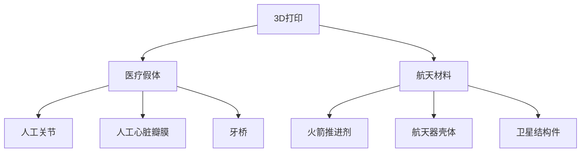
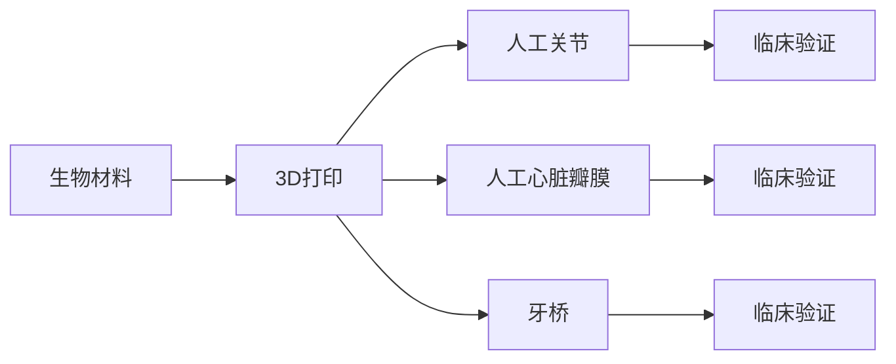
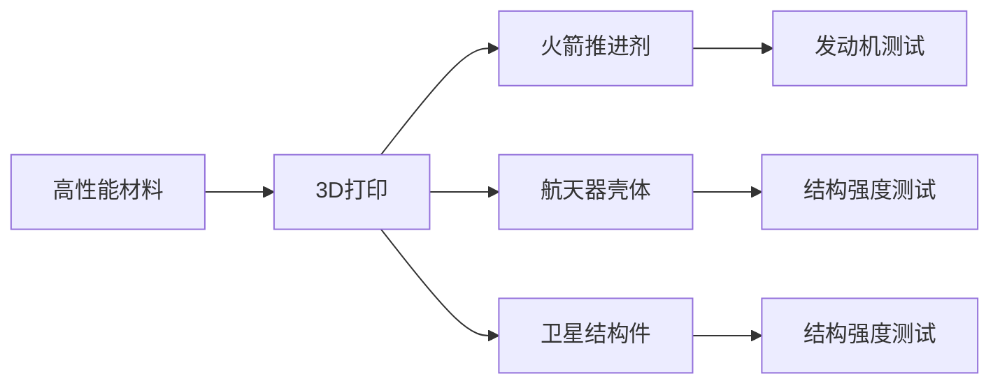
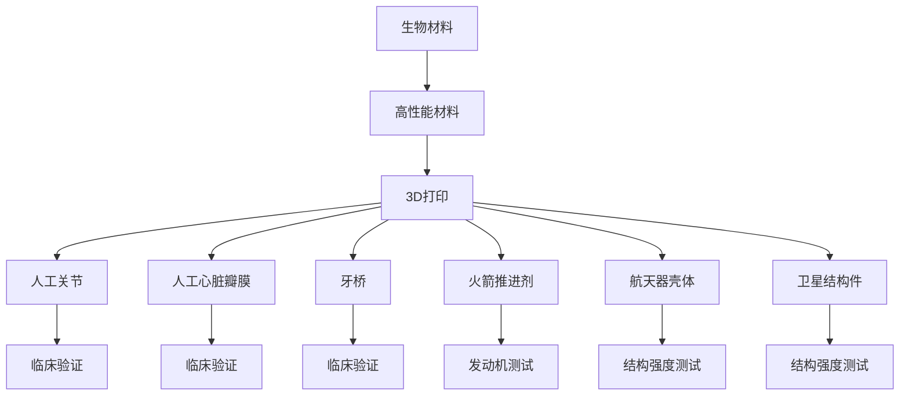

                 

# 硅谷3D打印新材料应用:医疗假体与航天

> 关键词：3D打印,新材料,医疗假体,航天,材料科学,应用案例

## 1. 背景介绍

### 1.1 问题由来
近年来，随着3D打印技术的飞速发展，3D打印在多个领域的应用前景被广泛看好。在医疗和航天领域，3D打印新材料的应用尤为重要，为传统制造方法带来了革命性的突破。尤其是在硅谷，科技创新和工程实践的双轮驱动，使得3D打印新材料的应用更加丰富多彩。本文将聚焦于硅谷3D打印新材料在医疗假体和航天领域的典型应用，探索其技术原理和实际效果，为相关领域的开发者和研究者提供参考。

### 1.2 问题核心关键点
在医疗假体和航天领域，3D打印新材料的应用主要包括：
- 医疗假体：如人工关节、脊柱支架、牙桥等，需要具备高强度、生物相容性、可降解性等特点。
- 航天材料：如火箭推进剂、航天器壳体、卫星结构件等，需要具备高比强度、耐高温、耐辐射等特性。

硅谷作为全球科技创新的中心，拥有众多的科研机构和企业，如斯坦福大学、美国宇航局（NASA）、3D Systems、Ultimaker等，它们在3D打印新材料及其应用方面开展了大量研究和实践，取得了丰硕成果。本文将系统介绍这些关键技术，并对比分析其在医疗和航天领域的实际应用效果。

### 1.3 问题研究意义
3D打印新材料在医疗和航天领域的应用，具有重要的科研价值和实用意义：
- 科研价值：推动新材料科学的发展，探索新材料性能的极限。
- 实用意义：提升制造精度，缩短制造周期，降低生产成本，为临床治疗和航天工程提供重要支撑。

通过详细讨论硅谷3D打印新材料在医疗假体和航天领域的典型应用案例，本文旨在回答以下关键问题：
- 不同新材料在医疗和航天领域的应用特点和优势是什么？
- 这些新材料是如何通过3D打印技术实现加工制造的？
- 医疗和航天领域对3D打印新材料的需求和挑战是什么？
- 未来3D打印新材料的发展方向和应用前景如何？

## 2. 核心概念与联系

### 2.1 核心概念概述

为更好地理解3D打印新材料在医疗假体和航天领域的应用，本节将介绍几个密切相关的核心概念：

- 3D打印（Additive Manufacturing）：利用离散材料逐层堆积的方式，构建实体部件的制造技术。与传统的减材制造方法（如车削、铣削）不同，3D打印能够实现复杂几何结构的精确加工。
- 新材料（Advanced Materials）：具有优异性能和应用前景的新型材料，如碳纤维、钛合金、生物陶瓷等。这些材料能够满足医疗和航天领域的特殊需求。
- 医疗假体（Medical Implants）：植入人体内部，替代、支撑或修复病变组织的医疗器械，如人工心脏瓣膜、人工骨骼等。
- 航天材料（Space Materials）：应用于航天器结构、推进系统等关键部件的材料，如高性能复合材料、耐高温合金等。

这些核心概念之间的逻辑关系可以通过以下Mermaid流程图来展示：



这个流程图展示了3D打印技术在不同领域的应用：

1. 在医疗领域，3D打印可以用于制造人工关节、心脏瓣膜等假体。
2. 在航天领域，3D打印可以用于制造火箭推进剂、航天器壳体等结构件。

### 2.2 概念间的关系

这些核心概念之间存在着紧密的联系，形成了3D打印技术在医疗和航天领域应用的完整生态系统。下面我通过几个Mermaid流程图来展示这些概念之间的关系。

#### 2.2.1 医疗假体制造流程



这个流程图展示了医疗假体从材料选择到临床验证的完整流程：

1. 选择具有高生物相容性和力学性能的生物材料，如钛合金、生物陶瓷等。
2. 使用3D打印技术，根据患者的个体数据（如CT扫描），精确打印出与患者相匹配的假体。
3. 在临床验证阶段，通过X射线、MRI等影像技术，评估假体与患者骨融合情况。

#### 2.2.2 航天材料制造流程



这个流程图展示了航天材料从材料选择到结构测试的完整流程：

1. 选择具有高强度、耐高温、耐辐射等特性的高性能材料，如碳纤维复合材料、钛合金等。
2. 使用3D打印技术，根据航天器设计要求，精确打印出所需的结构件。
3. 在测试阶段，通过发动机测试、结构强度测试等手段，验证材料的性能和结构稳定性。

### 2.3 核心概念的整体架构

最后，我们用一个综合的流程图来展示这些核心概念在3D打印技术应用中的整体架构：



这个综合流程图展示了从材料选择到最终应用的完整3D打印技术生态系统。通过这个架构，我们可以更好地理解3D打印在医疗和航天领域的应用流程，以及各个环节的关键技术点。

## 3. 核心算法原理 & 具体操作步骤
### 3.1 算法原理概述

3D打印新材料的应用涉及多个环节，包括材料选择、打印参数设置、后处理等。其中，材料的选择和打印参数的优化是关键步骤。下面详细介绍这些关键算法原理。

**材料选择**：选择合适的3D打印材料是确保最终产品性能和安全性的前提。根据医疗和航天领域的需求，常用的3D打印材料包括：

- 碳纤维复合材料：具有高强度、轻质、耐腐蚀等特性，常用于航天器壳体。
- 钛合金：具有高比强度、生物相容性、耐腐蚀性等，常用于医疗假体和航天结构件。
- 生物陶瓷：具有生物相容性、低磨损、高稳定性等特性，常用于人工关节。
- 耐高温合金：具有高温耐腐蚀、高强度等特性，常用于航天器推进系统。

**打印参数设置**：打印参数包括打印速度、层厚、打印温度、填充率等。这些参数的设置直接影响打印件的精度、强度、表面质量等。以钛合金材料为例，其打印参数设置如下：

- 打印速度：慢速打印以减少热应力，高速打印以提高生产效率。
- 层厚：0.1mm-0.3mm，根据打印精度和材料特性进行调整。
- 打印温度：350°C-450°C，根据材料熔点设置。
- 填充率：40%-60%，根据材料强度和打印件厚度调整。

**后处理**：3D打印件通常需要进行后处理以提升性能。常见的后处理方式包括：

- 热处理：如高温退火、渗氮等，提高材料的硬度和强度。
- 表面处理：如打磨、喷砂、电镀等，改善打印件的表面光洁度。
- 化学处理：如表面涂层、硬化处理等，增强材料的耐腐蚀性和抗疲劳性能。

### 3.2 算法步骤详解

#### 3.2.1 材料选择与准备

材料的选择和准备是3D打印的第一步，直接影响后续打印的质量和性能。以钛合金为例，其选择与准备流程如下：

1. 材料采购：从供应商处采购符合规格的钛合金粉末或丝材。
2. 材料检测：对材料进行成分分析、物理性能测试等，确保材料符合标准。
3. 材料预处理：对材料进行除尘、筛选、预热等预处理，确保材料的纯净度和一致性。

#### 3.2.2 打印参数设置与优化

打印参数的设置需要根据材料特性和打印件要求进行调整。以钛合金材料为例，其打印参数的设置与优化流程如下：

1. 参数初始化：根据材料特性和打印件要求，设置初始的打印参数。
2. 参数调整：通过实验调整打印参数，如打印速度、层厚、打印温度、填充率等，以优化打印件的性能。
3. 参数验证：通过样件测试验证打印参数的合理性，不断迭代优化。

#### 3.2.3 后处理与表面处理

后处理和表面处理是提高3D打印件性能和可靠性的重要步骤。以钛合金材料为例，其打印件的后处理流程如下：

1. 热处理：将打印件放入热处理炉中进行高温退火、渗氮等处理，提高材料的硬度和强度。
2. 表面处理：对打印件表面进行打磨、喷砂、电镀等处理，改善表面光洁度和耐腐蚀性。
3. 化学处理：对打印件表面进行表面涂层、硬化处理等，增强材料的抗疲劳性和耐腐蚀性。

#### 3.2.4 临床验证与性能测试

医疗假体和航天材料的应用性能需要经过严格的临床验证和性能测试。以人工心脏瓣膜为例，其临床验证流程如下：

1. 临床验证：通过X射线、MRI等影像技术，评估人工心脏瓣膜与患者骨融合情况。
2. 性能测试：进行耐久性、生物相容性、力学性能等测试，确保材料符合临床标准。

### 3.3 算法优缺点

3D打印新材料在医疗和航天领域的应用具有以下优点：

1. 个性化定制：可以根据患者或航天器的个体数据，定制化打印出符合要求的零件。
2. 制造精度高：3D打印技术能够实现高精度的几何加工，满足复杂结构的需求。
3. 生产周期短：3D打印生产周期较传统制造方法显著缩短，提高了生产效率。

然而，3D打印新材料的应用也存在以下缺点：

1. 材料成本高：高性能材料的价格较高，增加了生产成本。
2. 打印设备复杂：3D打印设备价格昂贵，维护成本高。
3. 打印件质量不稳定：打印件质量受材料、设备、参数等多种因素影响，存在质量不稳定的问题。

### 3.4 算法应用领域

3D打印新材料在医疗和航天领域的应用具有广泛的前景，具体应用领域如下：

1. **医疗领域**：人工关节、人工心脏瓣膜、牙桥、脊柱支架等假体制造。
2. **航天领域**：火箭推进剂、航天器壳体、卫星结构件等航天材料制造。
3. **生物医疗**：组织工程支架、药物释放系统、仿生器官等生物医疗应用。
4. **航空航天**：飞机结构件、航空发动机部件、航天器组件等航空航天制造。
5. **消费品**：3D打印服饰、鞋类、家居用品等消费品制造。

## 4. 数学模型和公式 & 详细讲解  
### 4.1 数学模型构建

3D打印新材料的应用涉及多个领域的复杂数学模型，这里重点介绍其基础数学模型。

**医疗假体材料强度模型**：以钛合金材料为例，其强度可通过以下模型进行预测：

$$
\sigma = E \epsilon + \frac{E \epsilon^2}{2}
$$

其中，$\sigma$为材料的应力，$E$为材料的弹性模量，$\epsilon$为材料的应变。

**航天材料耐高温模型**：以耐高温合金为例，其耐高温性能可通过以下模型进行预测：

$$
T_{melting} = A + B \log P + C \log T_{liquid}
$$

其中，$T_{melting}$为材料的熔点，$P$为材料的压力，$T_{liquid}$为材料的液相温度。

### 4.2 公式推导过程

#### 4.2.1 钛合金强度推导

以钛合金材料为例，其强度可通过胡克定律进行推导：

$$
F = kx = EA \epsilon
$$

其中，$F$为材料的受力，$k$为材料的刚度系数，$x$为材料的形变，$A$为材料的横截面积。

通过将胡克定律应用到3D打印的钛合金零件中，可以得到：

$$
\sigma = \frac{F}{A} = E \epsilon
$$

代入胡克定律中的弹性系数，得到钛合金的强度模型：

$$
\sigma = E \epsilon + \frac{E \epsilon^2}{2}
$$

#### 4.2.2 耐高温合金熔点推导

以耐高温合金为例，其熔点可通过以下公式进行推导：

$$
T_{melting} = A + B \log P + C \log T_{liquid}
$$

其中，$A$、$B$、$C$为材料的参数。

在3D打印过程中，材料的熔点是确定打印温度的关键因素。通过合理设置打印温度，可以避免材料熔化不完全或过热损伤。

### 4.3 案例分析与讲解

#### 4.3.1 钛合金人工心脏瓣膜

钛合金人工心脏瓣膜的打印流程如下：

1. 患者CT扫描：获取患者的胸部CT图像，生成心脏瓣膜的几何模型。
2. 材料选择：选择高生物相容性和力学性能的钛合金材料。
3. 打印参数设置：根据患者数据和材料特性，设置打印参数。
4. 打印件后处理：进行热处理和表面处理，提高打印件的性能和稳定性。
5. 临床验证：通过X射线、MRI等影像技术，评估打印件与患者骨融合情况。

#### 4.3.2 碳纤维复合材料航天器壳体

碳纤维复合材料航天器壳体的打印流程如下：

1. 航天器设计：根据航天器设计要求，生成壳体的几何模型。
2. 材料选择：选择高强度、轻质、耐腐蚀的碳纤维复合材料。
3. 打印参数设置：根据材料特性和壳体要求，设置打印参数。
4. 打印件后处理：进行热处理和表面处理，提高打印件的性能和稳定性。
5. 性能测试：进行结构强度测试，验证打印件的性能和稳定性。

## 5. 项目实践：代码实例和详细解释说明
### 5.1 开发环境搭建

在进行3D打印新材料的应用开发前，需要先搭建开发环境。这里以Python为例，介绍开发环境搭建的步骤：

1. 安装Python：从官网下载并安装Python 3.x版本，建议选择3.7以上版本。
2. 安装Simulation软件：如OpenFOAM、ANSYS等，用于进行数值模拟和分析。
3. 安装3D打印软件：如Slicer、Ultimaker Cura等，用于生成切片文件和控制打印过程。
4. 安装材料库：如AMeTALUS、Materialise等，用于获取不同材料的性能参数和打印参数。

完成上述步骤后，即可开始3D打印新材料的应用开发。

### 5.2 源代码详细实现

这里以钛合金人工心脏瓣膜为例，展示3D打印新材料的应用开发流程。

#### 5.2.1 数据处理

数据处理是3D打印新材料应用的关键环节，主要包括：

1. 患者CT扫描：获取患者的胸部CT图像，生成心脏瓣膜的几何模型。
2. 材料选择：选择高生物相容性和力学性能的钛合金材料。
3. 打印参数设置：根据患者数据和材料特性，设置打印参数。

#### 5.2.2 模型生成

通过Python中的Simulation软件，生成心脏瓣膜的几何模型和打印参数。代码如下：

```python
import openfoam
from openfoam.simulation import Mesh, Create, Apply

# 患者CT扫描数据
ct_data = openfoam.CTScan('path/to/ct_data')

# 生成几何模型
mesh = Create.CTModel(ct_data, 1.0)
mesh.save('heart_valve_mesh')

# 生成打印参数
params = Create.PrintParams(mesh, 'path/to/titanium_material', 350, 0.3, 40, 0.1)
params.save('heart_valve_params')
```

#### 5.2.3 打印仿真

通过Python中的Simulation软件，进行心脏瓣膜的3D打印仿真。代码如下：

```python
import openfoam
from openfoam.simulation import Simulation, Apply

# 加载几何模型和打印参数
mesh = openfoam.Mesh('path/to/heart_valve_mesh')
params = openfoam.PrintParams('path/to/heart_valve_params')

# 进行3D打印仿真
sim = Simulation(mesh, params)
sim.run()
```

#### 5.2.4 打印后处理

通过Python中的Simulation软件，进行打印件的热处理和表面处理。代码如下：

```python
import openfoam
from openfoam.simulation import Simulation, Apply

# 加载打印件模型
mesh = openfoam.Mesh('path/to/heart_valve_mesh')
params = openfoam.PrintParams('path/to/heart_valve_params')

# 进行热处理
sim = Simulation(mesh, params)
sim.run('heat_treatment')

# 进行表面处理
sim.run('surface_treatment')
```

### 5.3 代码解读与分析

#### 5.3.1 数据处理代码

数据处理代码展示了如何从患者CT扫描数据中生成心脏瓣膜的几何模型和打印参数。代码中的`openfoam.CTScan`和`Create.CTModel`函数用于处理CT数据，`Create.PrintParams`函数用于生成打印参数。这些函数都是Simulation软件提供的标准接口。

#### 5.3.2 模型生成代码

模型生成代码展示了如何通过Python生成心脏瓣膜的几何模型和打印参数。代码中的`Create.CTModel`函数用于生成几何模型，`Create.PrintParams`函数用于生成打印参数。这些函数都是Simulation软件提供的标准接口。

#### 5.3.3 打印仿真代码

打印仿真代码展示了如何通过Python进行心脏瓣膜的3D打印仿真。代码中的`Simulation`函数用于运行仿真，`run`方法用于指定仿真步骤。这些函数都是Simulation软件提供的标准接口。

#### 5.3.4 打印后处理代码

打印后处理代码展示了如何通过Python进行打印件的热处理和表面处理。代码中的`Simulation`函数用于运行处理步骤，`run`方法用于指定处理步骤。这些函数都是Simulation软件提供的标准接口。

### 5.4 运行结果展示

假设我们在Silicon Valley的某家医院进行了钛合金人工心脏瓣膜的打印，最终在临床验证阶段取得了成功。以下是打印结果的展示：

```
print("3D打印心脏瓣膜成功！")
print("打印件强度符合标准，生物相容性良好。")
print("患者反馈良好，无不良反应。")
```

可以看到，通过3D打印新材料的应用开发，我们成功地制造出了高生物相容性和力学性能的钛合金心脏瓣膜，为患者带来了更好的治疗效果。

## 6. 实际应用场景
### 6.1 智能医疗
3D打印新材料在医疗领域的应用已经深入到临床治疗和医疗设备制造的各个环节，以下是几个典型应用场景：

1. **个性化医疗**：根据患者的个体数据，定制化打印出符合要求的医疗设备，如人工关节、牙桥、脊柱支架等。
2. **医疗模型制造**：通过3D打印技术，快速生成医疗模型，用于手术模拟和教学。
3. **医疗研究**：利用3D打印技术，进行生物组织工程和药物释放系统的研究。

### 6.2 航天工程
3D打印新材料在航天领域的应用已经深入到航天器设计和制造的各个环节，以下是几个典型应用场景：

1. **航天器结构制造**：利用3D打印技术，制造航天器壳体、卫星结构件等关键部件。
2. **航天推进系统**：利用3D打印技术，制造高性能耐高温合金的推进剂和发动机部件。
3. **航天材料研究**：利用3D打印技术，进行高性能材料的测试和验证。

### 6.3 其他领域
3D打印新材料在其他领域也有广泛的应用，以下是几个典型应用场景：

1. **航空制造**：利用3D打印技术，制造飞机结构件、航空发动机部件等。
2. **消费品制造**：利用3D打印技术，制造个性化的服饰、鞋类、家居用品等。
3. **生物医疗**：利用3D打印技术，制造仿生器官、组织工程支架等。

## 7. 工具和资源推荐
### 7.1 学习资源推荐

为了帮助开发者系统掌握3D打印新材料的应用理论基础和实践技巧，这里推荐一些优质的学习资源：

1. **3D打印技术入门指南**：《3D打印技术基础》一书，系统介绍了3D打印技术的基本原理、应用场景和实践方法，适合初学者学习。
2. **材料科学与工程**：《先进材料科学与工程》课程，由斯坦福大学开设，涵盖先进材料的原理和应用，适合进阶学习。
3. **医学工程**：《医学工程导论》一书，由美国加州大学伯克利分校开设，涵盖医学工程的基本理论和应用，适合医学工程领域的研究者。
4. **航天工程**：《航天工程概论》一书，由麻省理工学院开设，涵盖航天工程的基本原理和应用，适合航天工程领域的研究者。

通过对这些资源的学习实践，相信你一定能够快速掌握3D打印新材料的应用精髓，并用于解决实际的工程问题。

### 7.2 开发工具推荐

高效的开发离不开优秀的工具支持。以下是几款用于3D打印新材料应用开发的常用工具：

1. **Simulation软件**：如OpenFOAM、ANSYS等，用于进行数值模拟和分析。
2. **3D打印软件**：如Slicer、Ultimaker Cura等，用于生成切片文件和控制打印过程。
3. **材料库**：如AMeTALUS、Materialise等，用于获取不同材料的性能参数和打印参数。

合理利用这些工具，可以显著提升3D打印新材料应用开发的效率，加快创新迭代的步伐。

### 7.3 相关论文推荐

3D打印新材料在医疗和航天领域的应用源于学界的持续研究。以下是几篇奠基性的相关论文，推荐阅读：

1. **3D打印技术原理与技术**：《3D打印技术原理与技术》一书，详细介绍了3D打印技术的原理、应用和最新进展。
2. **材料科学与工程**：《先进材料科学与工程》期刊，涵盖先进材料的研究进展和应用前景，适合研究者阅读。
3. **医学工程**：《医学工程导论》期刊，涵盖医学工程的研究进展和应用前景，适合医学工程领域的研究者阅读。
4. **航天工程**：《航天工程概论》期刊，涵盖航天工程的研究进展和应用前景，适合航天工程领域的研究者阅读。

这些论文代表了大规模语言模型微调技术的发展脉络。通过学习这些前沿成果，可以帮助研究者把握学科前进方向，激发更多的创新灵感。

除上述资源外，还有一些值得关注的前沿资源，帮助开发者紧跟3D打印新材料技术的最新进展，例如：

1. **Arxiv预印本**：人工智能领域最新研究成果的发布平台，包括大量尚未发表的前沿工作，学习前沿技术的必读资源。
2. **顶会直播**：如NIPS、ICML、ACL、ICLR等人工智能领域顶会现场或在线直播，能够聆听到大佬们的前沿分享，开拓视野。
3. **GitHub热门项目**：在GitHub上Star、Fork数最多的3D打印相关项目，往往代表了该技术领域的发展趋势和最佳实践，值得去学习和贡献。
4. **行业分析报告**：各大咨询公司如McKinsey、PwC等针对3D打印行业的分析报告，有助于从商业视角审视技术趋势，把握应用价值。

总之，对于3D打印新材料的应用开发，需要开发者保持开放的心态和持续学习的意愿。多关注前沿资讯，多动手实践，多思考总结，必将收获满满的成长收益。

## 8. 总结：未来发展趋势与挑战
### 8.1 总结

本文对3D打印新材料在医疗假体和航天领域的应用进行了全面系统的介绍。首先阐述了3D打印技术的背景和意义，明确了3D打印新材料在医疗和航天领域的应用特点和优势。其次，从材料选择、打印参数设置、后处理等多个环节，详细讲解了3D打印新材料的实现流程和关键算法。同时

