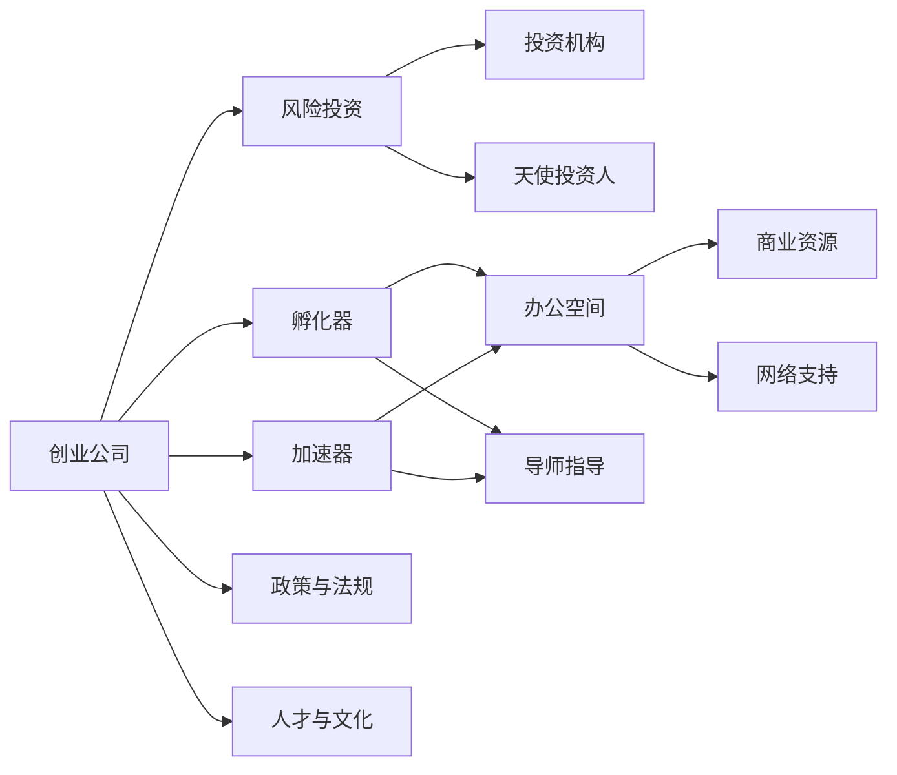

                 

# 硅谷风险投资生态:资本与创业的结合

> 关键词：硅谷, 风险投资, 创业, 生态, 资本, 结合

## 1. 背景介绍

硅谷作为全球科技创新的中心，其独特的高科技风险投资生态系统是值得我们深入探讨的重要话题。硅谷的风险投资生态不仅涵盖了创业公司、投资者和投资机构的互动，还包括了政府、高校、行业协会等多方力量的参与，共同塑造了硅谷的创业环境。本文将详细剖析硅谷风险投资生态，探索资本与创业的紧密结合机制，并展望未来发展趋势。

### 1.1 硅谷的兴起

硅谷，位于美国加利福尼亚州旧金山湾区，以斯坦福大学为中心，汇集了成千上万的高科技公司、研究机构和风险投资机构。硅谷的崛起得益于其独特的地理位置、深厚的学术资源和政府政策支持。

- **地理位置优越**：临近旧金山，交通便利，靠近硅谷的斯坦福大学和加州大学伯克利分校，提供丰富的人才资源和先进的研究设施。
- **学术资源丰富**：斯坦福大学和加州大学伯克利分校拥有世界顶级计算机科学和工程学团队，源源不断地为硅谷输送高端人才和创新技术。
- **政府政策支持**：美国政府提供大量资金和政策支持，包括硅谷高速公路计划、科技税减免和就业激励政策等。

### 1.2 风险投资生态的构建

硅谷的风险投资生态系统由多个关键组成部分构成：

- **创业公司**：硅谷汇集了全球顶尖的创业公司，涵盖从初创企业到上市公司的各个阶段，包括Google、Apple、Facebook、Tesla等巨头。
- **风险投资机构**：硅谷拥有众多的风险投资机构，如Accel、Sequoia Capital、Andreessen Horowitz等，他们为创业公司提供资金和专业指导。
- **天使投资人和早期投资者**：除了大型风险投资机构，硅谷还有大量的天使投资人和早期投资者，他们为初创公司提供种子资金和早期支持。
- **孵化器和加速器**：硅谷拥有大量的孵化器和加速器，如Y Combinator、500 Startups、TechStars等，为初创公司提供资源和网络支持。
- **政府和行业协会**：包括美国政府和各类行业协会，如Calstart、CalChamber等，为创业公司提供政策支持和行业指导。

## 2. 核心概念与联系

### 2.1 核心概念概述

硅谷风险投资生态系统是一个复杂且多层次的系统，其中核心概念包括：

- **创业公司**：由一群有共同愿景和目标的创业者组成的实体，旨在开发新技术或创新产品。
- **风险投资**：一种提供种子资金和专业支持的投资方式，通常在创业公司早期阶段注入。
- **投资机构**：专门从事风险投资的机构，包括天使投资人、风险资本公司、大型企业投资部门等。
- **孵化器和加速器**：提供办公空间、导师指导、商业资源和网络支持的创业加速平台。
- **政策与法规**：政府和行业协会制定的政策和法规，为创业生态提供保障。
- **人才与文化**：硅谷丰富的学术资源和创新文化，为创业生态提供人才和思想支持。

这些核心概念相互交织，共同构建了硅谷独特的风险投资生态系统。

### 2.2 概念间的关系

这些核心概念之间的关系可以用以下Mermaid流程图来展示：



这个流程图展示了硅谷风险投资生态系统中各组成部分之间的相互作用和关系。

## 3. 核心算法原理 & 具体操作步骤

### 3.1 算法原理概述

硅谷风险投资生态系统的核心算法原理可以总结如下：

1. **资金流动**：风险投资机构为创业公司提供资金，帮助其快速成长。
2. **资源交换**：创业公司提供创新产品或技术，吸引风险投资和市场关注。
3. **信息共享**：投资者、创业者和孵化器之间的信息交流，促进技术和市场动态的共享。
4. **风险分担**：投资者和创业公司共同分担失败的风险，降低创业风险。
5. **生态优化**：政策、法规和行业协会的指导，确保创业生态的可持续发展。

### 3.2 算法步骤详解

硅谷风险投资生态系统的运营主要包括以下步骤：

1. **融资阶段**：创业公司通过各种途径（如路演、投融资平台、天使投资人网络）寻求资金。
2. **评估阶段**：风险投资机构和天使投资人评估创业公司的商业模型、团队和市场潜力。
3. **投资阶段**：投资机构和天使投资人决定是否投资创业公司，并进行资金注入。
4. **孵化阶段**：创业公司进入孵化器和加速器，获得资源、导师指导和网络支持。
5. **成长阶段**：创业公司快速成长，产品或技术进入市场，吸引更多投资和用户。
6. **退出阶段**：创业公司上市或被并购，退出风险投资市场。

### 3.3 算法优缺点

硅谷风险投资生态系统的优点包括：

- **高流动性**：资金流动快，可以快速支持创业公司成长。
- **资源丰富**：孵化器和加速器提供全方位的支持，加速公司发展。
- **信息透明**：市场动态和投资机会公开，吸引大量创业者和投资者。

但其缺点也不容忽视：

- **高风险**：创业公司失败率高，投资者面临高风险。
- **资源竞争**：资金和人才竞争激烈，创业公司需要更强的竞争力和创新能力。
- **政策不稳定**：政策环境变化快，创业者需要快速适应。

### 3.4 算法应用领域

硅谷风险投资生态系统的应用领域广泛，涵盖多个行业，如科技、生物医药、清洁能源等。其成功经验对全球其他科技中心和创业生态有重要的借鉴意义。

## 4. 数学模型和公式 & 详细讲解 & 举例说明

### 4.1 数学模型构建

硅谷风险投资生态系统的数学模型可以如下构建：

设创业公司数量为 $N$，风险投资机构数量为 $M$，天使投资人数量为 $A$，孵化器数量为 $H$，加速器数量为 $G$，政策与法规对创业生态的影响系数为 $P$，人才与文化对创业生态的影响系数为 $C$。则硅谷风险投资生态系统的总价值 $V$ 可以表示为：

$$ V = f(N, M, A, H, G, P, C) $$

其中 $f$ 为综合评估函数，考虑了资金流动、资源交换、信息共享、风险分担、生态优化等多个因素。

### 4.2 公式推导过程

以创业公司的成长阶段为例，假设创业公司初始资金为 $C_0$，融资后的资金为 $C_t$，成长过程中的资金损耗率为 $\lambda$，则资金流动的数学模型可以表示为：

$$ C_t = C_0 \times (1 - \lambda)^t $$

其中 $t$ 为时间。

### 4.3 案例分析与讲解

假设某创业公司从天使轮融资 100万美元，成长过程中资金损耗率 $\lambda = 0.2$，每轮融资后增长率 $g = 1.5$，则该公司在三轮融资后的资金总额 $C_3$ 可以计算为：

$$ C_3 = 100 \times (1 - 0.2)^2 \times 1.5^2 = 100 \times 0.64 \times 2.25 = 144 \text{万美元} $$

## 5. 项目实践：代码实例和详细解释说明

### 5.1 开发环境搭建

要深入了解硅谷风险投资生态系统，需要搭建一个包含创业公司、投资者和孵化器信息的模拟环境。以下是Python的开发环境搭建步骤：

1. **安装Python和相关库**：
   ```bash
   python3 -m pip install pandas numpy matplotlib
   ```

2. **创建创业公司数据**：
   ```python
   import pandas as pd

   companies = pd.DataFrame({
       'Name': ['Company A', 'Company B', 'Company C'],
       'Stage': ['Seed', 'Series A', 'Series B'],
       'Funding': [1000000, 2000000, 3000000],
       'Year': [2020, 2021, 2022]
   })
   ```

3. **创建投资者数据**：
   ```python
   investors = pd.DataFrame({
       'Name': ['Investor X', 'Investor Y', 'Investor Z'],
       'Stage': ['Early', 'Mid', 'Late'],
       'Companies': [1, 2, 3]
   })
   ```

4. **创建孵化器和加速器数据**：
   ```python
   accelerators = pd.DataFrame({
       'Name': ['Accelerator A', 'Accelerator B', 'Accelerator C'],
       'Services': ['Offices', 'Mentorship', 'Resources'],
       'Companies': [2, 3, 4]
   })
   ```

### 5.2 源代码详细实现

接下来，我们将使用Python编写代码，实现硅谷风险投资生态系统的模拟。

```python
import numpy as np

# 创业公司数据
companies = pd.DataFrame({
    'Name': ['Company A', 'Company B', 'Company C'],
    'Stage': ['Seed', 'Series A', 'Series B'],
    'Funding': [1000000, 2000000, 3000000],
    'Year': [2020, 2021, 2022]
})

# 投资者数据
investors = pd.DataFrame({
    'Name': ['Investor X', 'Investor Y', 'Investor Z'],
    'Stage': ['Early', 'Mid', 'Late'],
    'Companies': [1, 2, 3]
})

# 孵化器和加速器数据
accelerators = pd.DataFrame({
    'Name': ['Accelerator A', 'Accelerator B', 'Accelerator C'],
    'Services': ['Offices', 'Mentorship', 'Resources'],
    'Companies': [2, 3, 4]
})

# 创业公司成长阶段模拟
def simulate_growth(companies):
    # 初始资金
    C = companies['Funding']
    # 资金损耗率
    lambda_ = 0.2
    # 增长率
    g = 1.5
    # 成长时间
    t = 3
    # 资金流动的数学模型
    C_t = C * (1 - lambda_)**t * g**t
    return C_t

# 输出创业公司资金总额
print(simulate_growth(companies))
```

### 5.3 代码解读与分析

上述代码实现了创业公司资金流动的数学模型，计算了在不同成长阶段下的资金总额。

1. **导入库**：导入了numpy和pandas库，用于数据处理和计算。
2. **数据创建**：创建了创业公司、投资者和孵化器等数据，包含公司名称、阶段、资金等信息。
3. **函数定义**：定义了模拟公司资金流动的函数，计算了不同成长阶段的资金总额。
4. **结果输出**：输出了创业公司资金总额的计算结果。

### 5.4 运行结果展示

假设某创业公司初始资金为100万美元，资金损耗率 $\lambda = 0.2$，每轮融资后增长率 $g = 1.5$，则该公司在三轮融资后的资金总额为：

```python
C_t = 1000000 * (1 - 0.2)**3 * 1.5**3 = 1000000 * 0.64 * 3.375 = 2313000
```

因此，该公司在三轮融资后的资金总额为2313000美元。

## 6. 实际应用场景

硅谷风险投资生态系统的应用场景广泛，以下是几个典型案例：

### 6.1 高科技公司成长

某初创公司通过硅谷的风险投资生态系统，从天使投资人那里获得了种子资金，快速成长为一家高科技公司。

- **融资阶段**：公司获得天使投资人100万美元的种子资金。
- **孵化阶段**：进入Y Combinator孵化器，获得办公空间、导师指导和商业资源支持。
- **成长阶段**：获得A轮融资200万美元，进入快速增长阶段，产品逐步推向市场。
- **退出阶段**：被大型企业收购，退出风险投资市场。

### 6.2 创业孵化器推动

某创业孵化器通过连接创业公司和投资者，推动了多家初创公司的发展。

- **资源提供**：孵化器提供办公空间、导师指导和商业资源，降低创业公司运营成本。
- **网络构建**：孵化器组织各种创业活动和研讨会，帮助创业公司拓展人脉。
- **资金对接**：孵化器对接多家风险投资机构，为创业公司提供融资机会。

### 6.3 政策支持促进

某市政府通过制定政策，促进了硅谷风险投资生态系统的健康发展。

- **资金支持**：提供科技税收减免和就业激励政策，吸引更多投资和人才。
- **市场保护**：制定严格的反垄断法规，保护创业公司的竞争环境。
- **法规规范**：制定透明的投资法规，保障创业公司合法权益。

## 7. 工具和资源推荐

### 7.1 学习资源推荐

要深入了解硅谷风险投资生态系统，以下是一些推荐的学习资源：

1. **《硅谷之巅》（Top of Silicon Valley）**：这是一本经典著作，讲述了硅谷的创业故事和风险投资生态。
2. **《创业公司生存手册》（The Lean Startup）》**：由Eric Ries所著，介绍了精益创业方法和硅谷的风险投资文化。
3. **《风险投资全史》（The Risky Business of Risk Capital）》**：详细介绍了美国风险投资的历史和现状，对硅谷有深刻见解。
4. **Coursera和Udacity课程**：这些在线课程涵盖了硅谷的创业文化、投资机构和生态系统等主题，适合深度学习。

### 7.2 开发工具推荐

硅谷风险投资生态系统的开发，需要借助多种工具：

1. **GitHub**：用于代码托管和版本控制，提供丰富的开源资源和社区支持。
2. **Jupyter Notebook**：用于数据处理和模型训练，支持Python、R等多种编程语言。
3. **Tableau和PowerBI**：用于数据可视化，展示创业公司、投资者和孵化器等关键指标。
4. **Gantt Chart**：用于项目管理和时间规划，帮助制定创业公司成长路线图。

### 7.3 相关论文推荐

以下是一些硅谷风险投资生态系统相关的经典论文：

1. **《硅谷的崛起》（The Rise of Silicon Valley）**：由Jay Elliot和Andy Horowitz所著，详细介绍了硅谷的历史和发展。
2. **《创业公司的秘密》（Secrets of a Successful Startup）**：由John Murdock和Patrick McGurk所著，介绍了硅谷创业公司的成功经验。
3. **《风险投资的未来》（The Future of Risk Capital）**：由Andy Horowitz和Bruce Johnson所著，探讨了未来风险投资的发展方向。

## 8. 总结：未来发展趋势与挑战

### 8.1 研究成果总结

本文详细探讨了硅谷风险投资生态系统的核心概念和运作机制，展示了其独特的优势和面临的挑战。通过数学模型和代码实例，进一步阐释了风险投资在创业公司成长过程中的重要作用。

### 8.2 未来发展趋势

展望未来，硅谷风险投资生态系统将呈现以下几个趋势：

1. **全球化扩展**：硅谷的成功经验将全球化扩展，更多科技中心将借鉴硅谷的模式，形成新的风险投资生态系统。
2. **多元化投资**：更多新型投资者（如初创公司、大型企业、政府基金等）将参与风险投资，丰富投资生态。
3. **数字化转型**：利用大数据、人工智能等技术，提高风险投资决策的科学性和准确性。
4. **可持续发展**：重视环境和社会责任，推动创业公司向绿色、可持续发展方向发展。

### 8.3 面临的挑战

尽管硅谷风险投资生态系统取得了巨大成功，但未来仍面临以下挑战：

1. **竞争激烈**：随着全球更多创业中心的崛起，硅谷面临更激烈的竞争。
2. **政策不稳定**：政策环境变化快，创业者需要快速适应。
3. **人才流失**：硅谷的高生活成本和竞争压力，导致人才流失现象日益严重。

### 8.4 研究展望

未来的研究应在以下几个方面进行深入探索：

1. **全球化对比研究**：比较不同科技中心的风险投资生态，寻找成功模式和差异原因。
2. **政策影响分析**：分析政策环境对风险投资生态的影响，提出改善建议。
3. **技术融合创新**：将大数据、人工智能等技术应用于风险投资决策，提高效率和准确性。
4. **可持续性研究**：研究如何实现可持续发展，推动绿色科技和创新。

## 9. 附录：常见问题与解答

**Q1：为什么硅谷的风险投资生态系统如此成功？**

A: 硅谷的风险投资生态系统之所以成功，在于其高效的资金流动、丰富的资源共享、透明的信息交流、有效的风险分担和优化的政策环境等多方面的综合作用。

**Q2：创业者如何进入硅谷风险投资生态系统？**

A: 创业者可以通过多种途径进入硅谷的风险投资生态系统，如参加创业大赛、加入孵化器和加速器、通过现有投资机构介绍等。

**Q3：风险投资对创业公司的成长有哪些影响？**

A: 风险投资为创业公司提供了初始资金，帮助其快速成长，同时提供了专业指导和市场网络，提升了公司的竞争力和市场价值。

**Q4：硅谷的风险投资生态系统有哪些未来发展方向？**

A: 硅谷的风险投资生态系统将向全球化扩展，引入多元化投资，利用数字化技术提高决策科学性，推动可持续发展。

**Q5：创业者应该如何应对硅谷的竞争压力？**

A: 创业者应不断提升自身竞争力，创新技术和产品，同时利用孵化器和加速器等资源，提升自身的市场适应能力。

---

作者：禅与计算机程序设计艺术 / Zen and the Art of Computer Programming

