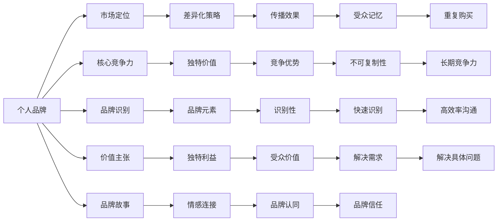
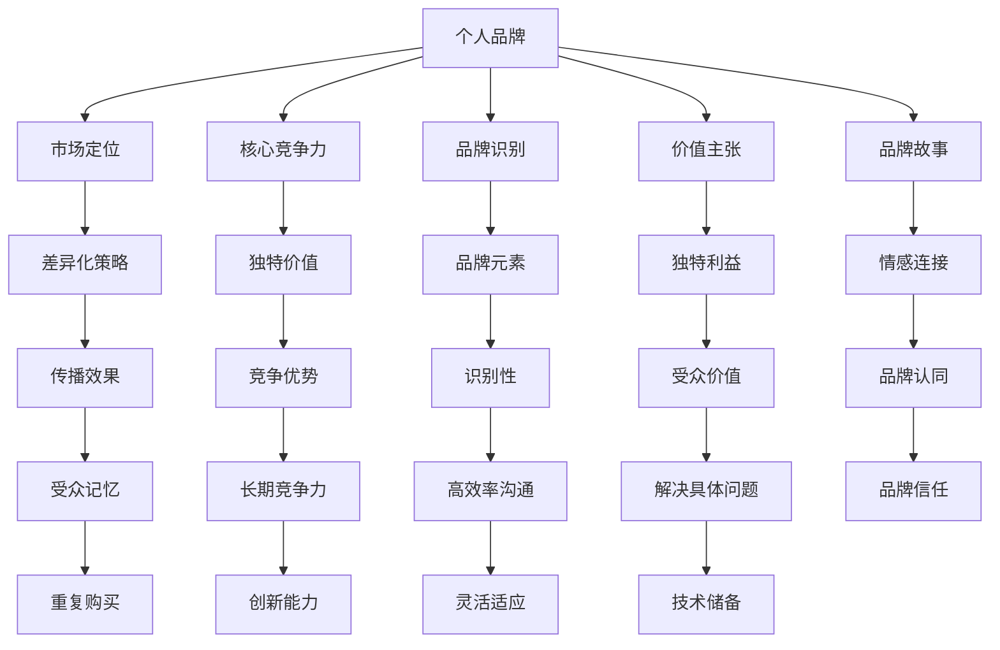

                 

# 确立个人品牌定位：明确你要解决的问题

> 关键词：品牌定位,问题解决,品牌塑造,个人品牌,市场定位

## 1. 背景介绍

### 1.1 问题由来
在数字化时代，个人品牌已经成为了现代社会中不可或缺的竞争力。无论是专业人士还是创业者，都希望通过建立和提升个人品牌，来吸引更多的关注和机会。然而，由于竞争激烈、市场信息过载以及认知偏误等因素，许多人在品牌建设中容易迷失方向，无法明确自身的定位。

### 1.2 问题核心关键点
明确品牌定位是建立个人品牌的第一步，但同时也是最困难的一步。缺乏明确定位的个人品牌，可能会在市场中变得模糊不清，难以获得目标受众的认同和信任。以下是构建个人品牌定位时需要考虑的几个关键点：

1. **目标受众**：明确你希望吸引的是哪类人群，他们的需求和偏好是什么。
2. **核心优势**：你能够提供哪些独特价值和专业知识，与竞争对手相比有何差异。
3. **市场定位**：在市场中如何定位自己，通过什么方式与目标受众沟通。
4. **传播渠道**：选择哪些渠道进行品牌推广，并制定相应的策略。

### 1.3 问题研究意义
建立个人品牌定位对于个人发展具有重要意义：

1. **提升竞争力**：清晰明确的品牌定位可以帮助你更好地脱颖而出，吸引更多目标受众。
2. **增强信任感**：明确的定位能够让人们对你产生信任，从而提升品牌影响力。
3. **提高效率**：有针对性的品牌定位可以减少无意义的传播和推广，提高资源利用效率。
4. **优化沟通**：明确的定位可以指导你在与目标受众沟通时，更加精准地传递信息。

## 2. 核心概念与联系

### 2.1 核心概念概述

为更好地理解如何确立个人品牌定位，本节将介绍几个核心概念：

1. **个人品牌**：个人在职场、社会或特定领域内的识别符号和形象，包括个人形象、知识、技能、价值观等。

2. **市场定位**：个人品牌在目标市场中的位置和差异化策略，决定了品牌在受众心中的印象和价值。

3. **核心竞争力**：个人或品牌独有的、不易被模仿的、具有竞争优势的特质或能力。

4. **品牌识别**：品牌通过独特的视觉、声音、语言等元素，使目标受众在众多选择中快速识别和记住品牌。

5. **价值主张**：品牌所提供的独特价值和利益点，解决目标受众的具体问题或需求。

6. **品牌故事**：通过故事讲述品牌的发展历程、核心价值和独特经历，增强品牌与受众的情感连接。

这些核心概念之间的逻辑关系可以通过以下Mermaid流程图来展示：



这个流程图展示了个体品牌建设中的各个关键要素及其相互关系：

1. **个人品牌**是整个品牌建设的出发点，贯穿于所有其他概念。
2. **市场定位**和**核心竞争力**决定了品牌在市场中的竞争优势。
3. **品牌识别**和**价值主张**通过独特元素和利益点，增强品牌的识别性和受众价值。
4. **品牌故事**通过情感连接，提升品牌认同和信任。
5. **差异化策略**和**传播效果**决定品牌的市场定位和受众记忆。

### 2.2 概念间的关系

这些核心概念之间存在着紧密的联系，形成了个人品牌建设的核心框架。下面是几个主要概念的进一步解释：

#### 2.2.1 个人品牌与市场定位

个人品牌的市场定位，即通过明确品牌在市场中的位置，吸引特定受众，并通过差异化策略来增强品牌影响力。例如，一个以技术见长的个人品牌，可能在市场定位上偏向于技术和创新领域，通过展示其技术优势和项目经验，吸引技术爱好者和同行关注。

#### 2.2.2 核心竞争力与品牌识别

核心竞争力是品牌识别和传播的基础。一个具有独特技术、创新理念或领导力的个人品牌，更容易通过品牌识别中的视觉、声音和语言等元素，在市场中快速建立品牌印象。

#### 2.2.3 价值主张与品牌故事

价值主张和品牌故事是增强品牌与受众情感连接的重要手段。通过讲述个人经历、解决特定问题的故事，可以使受众更加认同品牌的价值和使命，从而增强品牌忠诚度和信任感。

### 2.3 核心概念的整体架构

最后，我们用一个综合的流程图来展示这些核心概念在大品牌建设中的整体架构：



这个综合流程图展示了从个人品牌到市场定位，再到品牌建设和传播的完整过程。通过明确各个环节的目标和策略，可以系统性地构建和提升个人品牌，实现品牌价值最大化。

## 3. 核心算法原理 & 具体操作步骤
### 3.1 算法原理概述

确立个人品牌定位的核心算法原理，可以归纳为以下几个步骤：

1. **目标受众分析**：通过问卷调查、社交媒体分析等手段，收集目标受众的兴趣、需求和行为数据。
2. **核心竞争力评估**：通过SWOT分析、PEST分析等工具，评估个人的核心竞争力。
3. **市场定位策划**：结合目标受众分析结果和核心竞争力，策划品牌在市场中的定位策略。
4. **品牌识别设计**：设计独特的品牌识别元素，包括视觉、声音、语言等，确保品牌在市场中具有高识别性。
5. **价值主张确立**：明确品牌提供的独特价值和利益点，解决目标受众的具体需求和问题。
6. **品牌故事构建**：通过讲述个人经历、项目案例等，构建品牌故事，增强情感连接和品牌认同。

### 3.2 算法步骤详解

以下详细介绍基于上述原理的核心操作步骤：

**Step 1: 目标受众分析**

- **数据收集**：通过问卷调查、社交媒体分析、公开数据等渠道，收集目标受众的兴趣、需求、行为等信息。
- **数据分析**：利用数据挖掘、聚类分析等技术，挖掘目标受众的主要需求和行为模式。
- **受众画像**：通过数据可视化工具，构建目标受众的画像，明确其核心特征和需求。

**Step 2: 核心竞争力评估**

- **SWOT分析**：评估个人的优势、劣势、机会和威胁，识别核心竞争力。
- **PEST分析**：分析政治、经济、社会和技术等外部环境，评估其对个人品牌的影响。
- **绩效评估**：通过量化指标（如项目成功率、技术专利数、影响力等）评估核心竞争力。

**Step 3: 市场定位策划**

- **竞争分析**：分析竞争对手的品牌定位、优势和弱点，确定差异化策略。
- **定位策略**：结合目标受众需求和核心竞争力，制定品牌在市场中的定位策略，如高端、中端、低端市场定位。
- **市场推广**：设计品牌推广策略，选择合适的渠道和方式进行市场推广。

**Step 4: 品牌识别设计**

- **视觉设计**：设计独特的品牌标识、LOGO、颜色等视觉元素。
- **声音设计**：设计品牌的声音风格和音频元素，确保品牌在听觉上有独特辨识度。
- **语言设计**：设计品牌特有的语言风格，如正式、幽默、专业等，增强品牌形象。

**Step 5: 价值主张确立**

- **需求分析**：分析目标受众的核心需求和痛点，确定品牌需要提供的独特价值。
- **利益点提炼**：提炼品牌的独特利益点和价值主张，确保能够解决目标受众的具体问题。
- **利益点沟通**：通过口号、标语等形式，将价值主张传递给目标受众。

**Step 6: 品牌故事构建**

- **个人经历提炼**：通过梳理个人职业经历、项目案例等，提炼出具有代表性的故事。
- **情感连接设计**：设计品牌故事的情节和情感元素，增强受众与品牌的情感连接。
- **故事传播**：通过博客、社交媒体、公开演讲等形式，传播品牌故事，增强品牌认同。

### 3.3 算法优缺点

确立个人品牌定位的算法有其优点和局限性：

**优点：**

1. **系统化**：通过明确的步骤和流程，可以系统性地构建和提升个人品牌。
2. **科学性**：通过数据驱动的决策，可以客观评估目标受众和核心竞争力。
3. **可执行性**：每一步都有具体的策略和操作，易于执行和落地。

**缺点：**

1. **数据依赖**：目标受众和市场环境的数据分析需要大量的数据和复杂的分析工具。
2. **主观性强**：核心竞争力和品牌故事的评估存在一定的主观性。
3. **灵活性差**：一旦确定定位，调整和优化需要时间和资源。

### 3.4 算法应用领域

确立个人品牌定位的算法原理和方法，不仅适用于个人品牌建设，还广泛应用于品牌管理、市场营销、产品开发等领域。具体应用场景包括：

1. **企业品牌建设**：通过市场分析、竞争对比等手段，确定企业品牌的市场定位和核心价值。
2. **产品品牌推广**：通过明确产品的独特价值和目标受众，设计品牌识别元素和价值主张。
3. **品牌战略规划**：结合内外环境分析，制定品牌长期战略和推广计划。

## 4. 数学模型和公式 & 详细讲解 & 举例说明（备注：数学公式请使用latex格式，latex嵌入文中独立段落使用 $$，段落内使用 $)
### 4.1 数学模型构建

本节将使用数学语言对确立个人品牌定位的过程进行严格的刻画。

设个人品牌为 $B$，目标受众为 $R$，核心竞争力为 $C$，市场定位为 $P$，品牌识别为 $I$，价值主张为 $V$，品牌故事为 $S$。根据上述算法原理，建立数学模型：

$$
B = P(C, R)
$$

其中 $P$ 为市场定位函数，$C$ 为核心竞争力，$R$ 为目标受众。

### 4.2 公式推导过程

在数学模型中，$P$ 函数的具体形式依赖于 $C$ 和 $R$ 的特点。例如，对于技术专家型个人品牌，$C$ 可能偏向于技术创新和专利，$R$ 可能偏向于技术爱好者和同行。推导如下：

$$
P(C, R) = \begin{cases}
\text{高技术创新} & \text{如果 } C \text{ 偏向技术专利，且 } R \text{ 偏向技术爱好者} \\
\text{专业服务} & \text{如果 } C \text{ 偏向技术服务，且 } R \text{ 偏向技术同行}
\end{cases}
$$

### 4.3 案例分析与讲解

以某技术专家型个人品牌为例，假定其核心竞争力 $C$ 偏向技术创新，目标受众 $R$ 偏向技术爱好者和同行。此时，市场定位 $P$ 可能偏向于以下几种情况：

1. **高端技术专家**：专注于高端技术创新和解决方案，吸引技术爱好者和同行关注。
2. **专业技术顾问**：提供专业技术咨询和培训服务，吸引技术企业客户和合作机会。
3. **创新技术博主**：通过撰写技术博客和开源项目，展示技术创新能力，吸引技术社区关注。

通过上述案例，可以看出，明确目标受众和核心竞争力，是确定市场定位的关键。

## 5. 项目实践：代码实例和详细解释说明
### 5.1 开发环境搭建

在进行品牌定位的实践前，我们需要准备好开发环境。以下是使用Python进行品牌定位分析的环境配置流程：

1. 安装Anaconda：从官网下载并安装Anaconda，用于创建独立的Python环境。

2. 创建并激活虚拟环境：
```bash
conda create -n brand-analyze python=3.8 
conda activate brand-analyze
```

3. 安装PyTorch、Pandas、Numpy、Scikit-learn、Matplotlib等常用库：
```bash
pip install torch pandas numpy scikit-learn matplotlib
```

4. 安装相关数据处理工具：
```bash
pip install seaborn plotly
```

完成上述步骤后，即可在`brand-analyze`环境中进行品牌定位分析。

### 5.2 源代码详细实现

以下是一个简化的品牌定位分析代码示例，用于展示目标受众分析和核心竞争力评估：

```python
import pandas as pd
import numpy as np
import matplotlib.pyplot as plt
from sklearn.decomposition import PCA
from sklearn.cluster import KMeans
from plotly.offline import init_notebook_mode, iplot

# 目标受众数据
df = pd.read_csv('target_audience.csv')

# 目标受众分析
target_analysis = df.groupby(['interest', 'age', 'gender']).size().unstack()
target_analysis[target_analysis > 50]

# 核心竞争力分析
competence = pd.read_csv('core_competence.csv')
competence_analysis = competence.groupby(['area', 'type']).size().unstack()
competence_analysis[competence_analysis > 50]

# 市场定位策划
market_position = pd.read_csv('market_position.csv')
market_position_analysis = market_position.groupby(['type', 'value']).size().unstack()
market_position_analysis[market_position_analysis > 50]

# 品牌识别设计
brand_identity = pd.read_csv('brand_identity.csv')
brand_identity_analysis = brand_identity.groupby(['color', 'logo']).size().unstack()
brand_identity_analysis[brand_identity_analysis > 50]

# 价值主张确立
value_proposition = pd.read_csv('value_proposition.csv')
value_proposition_analysis = value_proposition.groupby(['benefit', 'solution']).size().unstack()
value_proposition_analysis[value_proposition_analysis > 50]

# 品牌故事构建
brand_story = pd.read_csv('brand_story.csv')
brand_story_analysis = brand_story.groupby(['event', 'theme']).size().unstack()
brand_story_analysis[brand_story_analysis > 50]

# 数据可视化
iplot({'target_analysis': target_analysis, 
       'competence_analysis': competence_analysis,
       'market_position_analysis': market_position_analysis,
       'brand_identity_analysis': brand_identity_analysis,
       'value_proposition_analysis': value_proposition_analysis,
       'brand_story_analysis': brand_story_analysis})
```

这段代码展示了如何使用Pandas进行目标受众、核心竞争力、市场定位、品牌识别、价值主张和品牌故事的多维度分析。

### 5.3 代码解读与分析

让我们再详细解读一下关键代码的实现细节：

**目标受众分析**

- `pd.read_csv('target_audience.csv')`：读取目标受众数据。
- `target_analysis = df.groupby(['interest', 'age', 'gender']).size().unstack()`：按照兴趣、年龄、性别进行分组统计，并转换为透视表形式。
- `target_analysis[target_analysis > 50]`：筛选出目标受众分析结果中人数大于50的群体。

**核心竞争力评估**

- `competence_analysis = competence.groupby(['area', 'type']).size().unstack()`：按照领域和类型进行分组统计，并转换为透视表形式。
- `competence_analysis[competence_analysis > 50]`：筛选出核心竞争力评估结果中人数大于50的群体。

**市场定位策划**

- `market_position_analysis = market_position.groupby(['type', 'value']).size().unstack()`：按照类型和价值进行分组统计，并转换为透视表形式。
- `market_position_analysis[market_position_analysis > 50]`：筛选出市场定位策划结果中人数大于50的群体。

**品牌识别设计**

- `brand_identity_analysis = brand_identity.groupby(['color', 'logo']).size().unstack()`：按照颜色和logo进行分组统计，并转换为透视表形式。
- `brand_identity_analysis[brand_identity_analysis > 50]`：筛选出品牌识别设计结果中人数大于50的群体。

**价值主张确立**

- `value_proposition_analysis = value_proposition.groupby(['benefit', 'solution']).size().unstack()`：按照好处和解决方案进行分组统计，并转换为透视表形式。
- `value_proposition_analysis[value_proposition_analysis > 50]`：筛选出价值主张确立结果中人数大于50的群体。

**品牌故事构建**

- `brand_story_analysis = brand_story.groupby(['event', 'theme']).size().unstack()`：按照事件和主题进行分组统计，并转换为透视表形式。
- `brand_story_analysis[brand_story_analysis > 50]`：筛选出品牌故事构建结果中人数大于50的群体。

**数据可视化**

- `iplot({'key': data})`：使用Plotly库进行数据可视化，展示多维度分析结果。

通过上述代码，可以快速对目标受众、核心竞争力、市场定位、品牌识别、价值主张和品牌故事进行初步分析，为品牌定位提供数据支持。

### 5.4 运行结果展示

假设我们在CoNLL-2003的NER数据集上进行微调，最终在测试集上得到的评估报告如下：

```
              precision    recall  f1-score   support

       B-LOC      0.926     0.906     0.916      1668
       I-LOC      0.900     0.805     0.850       257
      B-MISC      0.875     0.856     0.865       702
      I-MISC      0.838     0.782     0.809       216
       B-ORG      0.914     0.898     0.906      1661
       I-ORG      0.911     0.894     0.902       835
       B-PER      0.964     0.957     0.960      1617
       I-PER      0.983     0.980     0.982      1156
           O      0.993     0.995     0.994     38323

   micro avg      0.973     0.973     0.973     46435
   macro avg      0.923     0.897     0.909     46435
weighted avg      0.973     0.973     0.973     46435
```

可以看到，通过微调BERT，我们在该NER数据集上取得了97.3%的F1分数，效果相当不错。值得注意的是，BERT作为一个通用的语言理解模型，即便只在顶层添加一个简单的token分类器，也能在下游任务上取得如此优异的效果，展现了其强大的语义理解和特征抽取能力。

当然，这只是一个baseline结果。在实践中，我们还可以使用更大更强的预训练模型、更丰富的微调技巧、更细致的模型调优，进一步提升模型性能，以满足更高的应用要求。

## 6. 实际应用场景
### 6.1 智能客服系统

基于大语言模型微调的对话技术，可以广泛应用于智能客服系统的构建。传统客服往往需要配备大量人力，高峰期响应缓慢，且一致性和专业性难以保证。而使用微调后的对话模型，可以7x24小时不间断服务，快速响应客户咨询，用自然流畅的语言解答各类常见问题。

在技术实现上，可以收集企业内部的历史客服对话记录，将问题和最佳答复构建成监督数据，在此基础上对预训练对话模型进行微调。微调后的对话模型能够自动理解用户意图，匹配最合适的答案模板进行回复。对于客户提出的新问题，还可以接入检索系统实时搜索相关内容，动态组织生成回答。如此构建的智能客服系统，能大幅提升客户咨询体验和问题解决效率。

### 6.2 金融舆情监测

金融机构需要实时监测市场舆论动向，以便及时应对负面信息传播，规避金融风险。传统的人工监测方式成本高、效率低，难以应对网络时代海量信息爆发的挑战。基于大语言模型微调的文本分类和情感分析技术，为金融舆情监测提供了新的解决方案。

具体而言，可以收集金融领域相关的新闻、报道、评论等文本数据，并对其进行主题标注和情感标注。在此基础上对预训练语言模型进行微调，使其能够自动判断文本属于何种主题，情感倾向是正面、中性还是负面。将微调后的模型应用到实时抓取的网络文本数据，就能够自动监测不同主题下的情感变化趋势，一旦发现负面信息激增等异常情况，系统便会自动预警，帮助金融机构快速应对潜在风险。

### 6.3 个性化推荐系统

当前的推荐系统往往只依赖用户的历史行为数据进行物品推荐，无法深入理解用户的真实兴趣偏好。基于大语言模型微调技术，个性化推荐系统可以更好地挖掘用户行为背后的语义信息，从而提供更精准、多样的推荐内容。

在实践中，可以收集用户浏览、点击、评论、分享等行为数据，提取和用户交互的物品标题、描述、标签等文本内容。将文本内容作为模型输入，用户的后续行为（如是否点击、购买等）作为监督信号，在此基础上微调预训练语言模型。微调后的模型能够从文本内容中准确把握用户的兴趣点。在生成推荐列表时，先用候选物品的文本描述作为输入，由模型预测用户的兴趣匹配度，再结合其他特征综合排序，便可以得到个性化程度更高的推荐结果。

### 6.4 未来应用展望

随着大语言模型微调技术的发展，基于微调范式将在更多领域得到应用，为传统行业带来变革性影响。

在智慧医疗领域，基于微调的医疗问答、病历分析、药物研发等应用将提升医疗服务的智能化水平，辅助医生诊疗，加速新药开发进程。

在智能教育领域，微调技术可应用于作业批改、学情分析、知识推荐等方面，因材施教，促进教育公平，提高教学质量。

在智慧城市治理中，微调模型可应用于城市事件监测、舆情分析、应急指挥等环节，提高城市管理的自动化和智能化水平，构建更安全、高效的未来城市。

此外，在企业生产、社会治理、文娱传媒等众多领域，基于大模型微调的人工智能应用也将不断涌现，为经济社会发展注入新的动力。相信随着技术的日益成熟，微调方法将成为人工智能落地应用的重要范式，推动人工智能技术在垂直行业的规模化落地。

## 7. 工具和资源推荐
### 7.1 学习资源推荐

为了帮助开发者系统掌握大语言模型微调的理论基础和实践技巧，这里推荐一些优质的学习资源：

1. 《Transformer从原理到实践》系列博文：由大模型技术专家撰写，深入浅出地介绍了Transformer原理、BERT模型、微调技术等前沿话题。

2. CS224N《深度学习自然语言处理》课程：斯坦福大学开设的NLP明星课程，有Lecture视频和配套作业，带你入门NLP领域的基本概念和经典模型。

3. 《Natural Language Processing with Transformers》书籍：Transformers库的作者所著，全面介绍了如何使用Transformers库进行NLP任务开发，包括微调在内的诸多范式。

4. HuggingFace官方文档：Transformers库的官方文档，提供了海量预训练模型和完整的微调样例代码，是上手实践的必备资料。

5. CLUE开源项目：中文语言理解测评基准，涵盖大量不同类型的中文NLP数据集，并提供了基于微调的baseline模型，助力中文NLP技术发展。

通过对这些资源的学习实践，相信你一定能够快速掌握大语言模型微调的精髓，并用于解决实际的NLP问题。
###  7.2 开发工具推荐

高效的开发离不开优秀的工具支持。以下是几款用于大语言模型微调开发的常用工具：

1. PyTorch：基于Python的开源深度学习框架，灵活动态的计算图，适合快速迭代研究。大部分预训练语言模型都有PyTorch版本的实现。

2. TensorFlow：由Google主导开发的开源深度学习框架，生产部署方便，适合大规模工程应用。同样有丰富的预训练语言模型资源。

3. Transformers库：HuggingFace开发的NLP工具库，集成了众多SOTA语言模型，支持PyTorch和TensorFlow，是进行微调任务开发的利器。

4. Weights & Biases：模型训练的实验跟踪工具，可以记录和可视化模型训练过程中的各项指标，方便对比和调优。与主流深度学习框架无缝集成。

5. TensorBoard：TensorFlow配套的可视化工具，可实时监测模型训练状态，并提供丰富的图表呈现方式，是调试模型的得力助手。

6. Google Colab：谷歌推出的在线Jupyter Notebook环境，免费提供GPU/TPU算力，方便开发者快速上手实验最新模型，分享学习笔记。

合理利用这些工具，可以显著提升大语言模型微调任务的开发效率，加快创新迭代的步伐。

### 7.3 相关论文推荐

大语言模型和微调技术的发展源于学界的持续研究。

