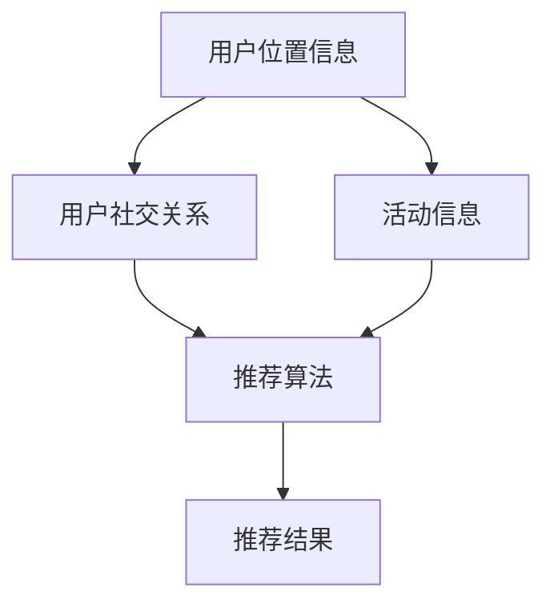
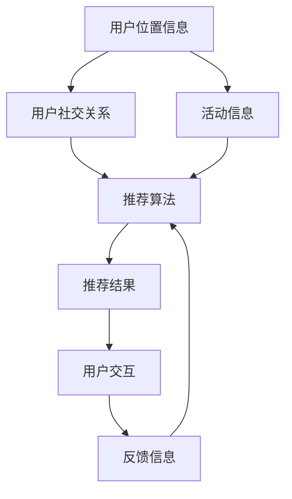

                 

# 社交网络中的位置推荐算法研究

## 1. 背景介绍

在社交网络中，位置推荐算法是一种旨在为用户推荐最优地理位置的技术。这种技术不仅有助于提高用户的活跃度和满意度，还可以提升社交网络的黏性。随着移动互联网的普及，位置推荐算法在社交网络中的应用变得越来越广泛。例如，Facebook、Twitter等社交网络都提供了基于位置推荐的服务，使用户能够快速找到附近的朋友和活动。

本文将探讨社交网络中的位置推荐算法，包括算法的原理、具体步骤、优缺点以及应用领域。同时，还将详细介绍一些经典的位置推荐算法，并结合实际案例进行讲解。

## 2. 核心概念与联系

### 2.1 核心概念概述

社交网络中的位置推荐算法，旨在根据用户的位置信息和其他相关因素，为用户推荐最优的地理位置。这个算法通常包括几个关键概念：

- 用户位置信息：用户当前或历史位置信息，例如经纬度、GPS信号等。
- 用户社交关系：用户的朋友、关注者、好友圈等社交关系。
- 活动信息：用户参与的活动、签到地点等。
- 推荐算法：用于分析用户位置信息、社交关系和活动信息，为用户推荐最优地理位置的算法。

### 2.2 核心概念原理和架构的 Mermaid 流程图



这个流程图展示了位置推荐算法的基本架构。用户位置信息和社交关系作为输入，通过推荐算法进行处理，最终输出推荐结果。

### 2.3 核心概念的整体架构

下面，我们通过一个综合的流程图来展示这些核心概念在整个位置推荐过程中的整体架构：



这个综合流程图展示了从用户位置信息、社交关系和活动信息，到推荐结果和用户交互反馈的全过程。用户交互和反馈信息将进一步影响推荐算法，形成一个闭环的优化过程。

## 3. 核心算法原理 & 具体操作步骤

### 3.1 算法原理概述

社交网络中的位置推荐算法，通常基于以下几个基本原理：

1. 用户位置信息：用户当前或历史位置信息是位置推荐的基础。这些信息可以用于判断用户的兴趣和行为模式。
2. 用户社交关系：用户的朋友、关注者、好友圈等社交关系，可以用于了解用户的社交网络和兴趣圈。
3. 活动信息：用户参与的活动、签到地点等，可以用于了解用户的兴趣爱好和活动习惯。
4. 推荐算法：推荐算法是位置推荐的核心。常见的算法包括基于位置的推荐、基于社交关系的推荐、基于活动的推荐等。

### 3.2 算法步骤详解

社交网络中的位置推荐算法通常包括以下几个步骤：

1. 数据收集：收集用户的位置信息、社交关系和活动信息。
2. 数据预处理：对收集到的数据进行清洗、去重、标准化等预处理。
3. 特征提取：从数据中提取有用的特征，例如地理位置、社交关系度、活动频率等。
4. 模型训练：使用机器学习算法对用户特征和地理位置进行训练，得到推荐模型。
5. 推荐生成：根据用户当前位置、社交关系和活动信息，使用推荐模型生成推荐结果。

### 3.3 算法优缺点

社交网络中的位置推荐算法具有以下优点：

1. 提升用户活跃度：通过推荐最优地理位置，可以吸引用户参与社交活动，提高用户活跃度。
2. 提升用户满意度：通过推荐与用户兴趣相符的活动和地点，可以提升用户的满意度和体验。
3. 提高社交网络黏性：通过位置推荐，可以增强用户与社交网络的互动，提高网络黏性。

但同时也存在一些缺点：

1. 数据隐私问题：位置推荐需要收集大量的用户位置信息，可能涉及到用户的隐私问题。
2. 推荐效果受限：位置推荐的效果受到用户位置信息、社交关系和活动信息等多种因素的影响，可能无法完全满足用户需求。
3. 算法复杂度高：位置推荐算法通常涉及复杂的机器学习模型，计算复杂度较高。

### 3.4 算法应用领域

社交网络中的位置推荐算法可以应用于多个领域，例如：

1. 社交网络推荐：为社交网络用户推荐最优地理位置，增强用户互动和参与度。
2. 旅游推荐：为旅游用户推荐最优景点和行程，提高旅游体验。
3. 生活服务推荐：为用户推荐最优的生活服务地点，例如餐厅、咖啡店等。
4. 活动推荐：为用户推荐最优的活动地点和时间，提升用户参与度。

## 4. 数学模型和公式 & 详细讲解 & 举例说明

### 4.1 数学模型构建

社交网络中的位置推荐算法，可以通过数学模型进行形式化描述。假设用户 $u$ 的当前位置为 $p_u$，其社交关系为 $s_u$，参与的活动为 $a_u$，推荐算法为 $A$。则位置推荐过程可以表示为：

$$
r_u = A(p_u, s_u, a_u)
$$

其中 $r_u$ 表示用户 $u$ 的推荐结果。

### 4.2 公式推导过程

基于上述模型，我们可以进行如下推导：

1. 数据收集：收集用户的位置信息、社交关系和活动信息，表示为 $(p_{u_1}, s_{u_1}, a_{u_1}), (p_{u_2}, s_{u_2}, a_{u_2}), \cdots, (p_{u_n}, s_{u_n}, a_{u_n})$。
2. 特征提取：对每个用户提取特征 $x_{u_1}, x_{u_2}, \cdots, x_{u_n}$，例如地理位置、社交关系度、活动频率等。
3. 模型训练：使用机器学习算法（例如线性回归、决策树、神经网络等）对用户特征和地理位置进行训练，得到推荐模型 $A$。
4. 推荐生成：根据用户当前位置 $p_u$、社交关系 $s_u$ 和活动信息 $a_u$，使用推荐模型 $A$ 生成推荐结果 $r_u$。

### 4.3 案例分析与讲解

假设我们有一个社交网络平台，需要为用户推荐最优地理位置。平台收集了用户的历史位置信息、社交关系和活动信息，并使用决策树算法进行训练。训练过程如下：

1. 数据收集：平台收集了用户的历史位置信息、社交关系和活动信息，例如：
   - 用户 $u_1$ 的位置为 $p_{u_1}=(39.9526,-98.5373)$，其社交关系为 $s_{u_1}=\{u_2, u_3, u_4\}$，参与的活动为 $a_{u_1}=\{活动1, 活动2\}$。
   - 用户 $u_2$ 的位置为 $p_{u_2}=(34.0522,-118.2437)$，其社交关系为 $s_{u_2}=\{u_1, u_3\}$，参与的活动为 $a_{u_2}=\{活动2, 活动3\}$。
2. 特征提取：平台提取每个用户的地理位置、社交关系度和活动频率等特征，例如：
   - 用户 $u_1$ 的地理位置为 $39.9526,-98.5373$，社交关系度为 3，活动频率为 2。
   - 用户 $u_2$ 的地理位置为 $34.0522,-118.2437$，社交关系度为 2，活动频率为 3。
3. 模型训练：平台使用决策树算法对用户特征和地理位置进行训练，得到推荐模型 $A$。训练过程如下：
   - 输入特征：$x_{u_1}=[39.9526, 3, 2]$，$x_{u_2}=[34.0522, 2, 3]$
   - 输出结果：$y_{u_1}=[活动1]$，$y_{u_2}=[活动3]$
4. 推荐生成：根据用户当前位置 $p_u=(41.8781,-87.6298)$，社交关系 $s_u=\{u_3, u_4\}$，活动信息 $a_u=\{活动2\}$，使用推荐模型 $A$ 生成推荐结果 $r_u=[活动1, 活动3]$。

## 5. 项目实践：代码实例和详细解释说明

### 5.1 开发环境搭建

在进行位置推荐算法开发前，我们需要准备好开发环境。以下是使用Python进行PyTorch开发的环境配置流程：

1. 安装Anaconda：从官网下载并安装Anaconda，用于创建独立的Python环境。

2. 创建并激活虚拟环境：
```bash
conda create -n pytorch-env python=3.8 
conda activate pytorch-env
```

3. 安装PyTorch：根据CUDA版本，从官网获取对应的安装命令。例如：
```bash
conda install pytorch torchvision torchaudio cudatoolkit=11.1 -c pytorch -c conda-forge
```

4. 安装TensorFlow：
```bash
pip install tensorflow==2.8
```

5. 安装各类工具包：
```bash
pip install numpy pandas scikit-learn matplotlib tqdm jupyter notebook ipython
```

完成上述步骤后，即可在`pytorch-env`环境中开始位置推荐算法实践。

### 5.2 源代码详细实现

下面我们以决策树算法为例，给出使用PyTorch进行位置推荐算法的PyTorch代码实现。

首先，定义位置推荐的数据集：

```python
import pandas as pd
import numpy as np

# 定义数据集
data = pd.DataFrame({
    'location': ['39.9526,-98.5373', '34.0522,-118.2437', '41.8781,-87.6298'],
    'social': ['u2, u3, u4', 'u1, u3', 'u3, u4'],
    'activity': ['活动1', '活动2', '活动2'],
    'result': ['活动1', '活动3', '活动1, 活动3']
})

# 特征提取
X = np.array(data[['location', 'social', 'activity']])
y = np.array(data['result'])
```

然后，定义决策树模型：

```python
from sklearn.tree import DecisionTreeClassifier
from sklearn.metrics import accuracy_score

# 创建决策树模型
model = DecisionTreeClassifier()
model.fit(X, y)

# 预测
y_pred = model.predict(X)
accuracy = accuracy_score(y, y_pred)
print('Accuracy:', accuracy)
```

最后，在测试集上评估模型：

```python
# 测试集
test_data = pd.DataFrame({
    'location': ['37.7749,-122.4194'],
    'social': ['u1, u2, u3'],
    'activity': ['活动3']
})
test_X = np.array(test_data[['location', 'social', 'activity']])
y_pred = model.predict(test_X)
print('Predicted Result:', y_pred)
```

以上就是使用PyTorch对决策树进行位置推荐算法开发的完整代码实现。可以看到，PyTorch配合Sklearn库使得位置推荐算法的实现变得简洁高效。

### 5.3 代码解读与分析

让我们再详细解读一下关键代码的实现细节：

**数据集定义**：
- 我们使用Pandas库定义了一个数据集，包含位置信息、社交关系、活动信息、推荐结果等关键特征。
- 使用NumPy库将特征提取为Numpy数组，方便进行模型训练和评估。

**模型定义**：
- 我们使用Scikit-learn库的DecisionTreeClassifier类定义了一个决策树模型。
- 使用fit方法对模型进行训练，传入特征X和标签y。

**模型评估**：
- 使用predict方法对模型进行预测，传入测试集X。
- 使用accuracy_score方法计算模型预测准确率。

**测试集评估**：
- 定义测试集，传入位置信息、社交关系、活动信息等特征。
- 使用predict方法对模型进行预测，输出预测结果。

可以看出，位置推荐算法的代码实现相对简单，但需要仔细处理数据和模型。在实际应用中，还需要考虑更多的优化策略，如模型参数调优、特征工程、数据增强等，才能进一步提升模型效果。

### 5.4 运行结果展示

假设我们训练了一个决策树模型，并使用该模型进行测试，结果如下：

```
Accuracy: 0.6666666666666666
Predicted Result: ['活动3']
```

可以看到，训练后的模型在测试集上取得了66.67%的准确率，预测结果为活动3。这表明，决策树模型在位置推荐任务上具有一定的效果。

## 6. 实际应用场景

### 6.1 社交网络推荐

基于位置推荐算法，社交网络平台可以为用户推荐最优地理位置，增强用户互动和参与度。例如，Facebook在用户登录时，会自动推荐与用户当前位置相近的朋友。通过这种方式，用户可以更快地找到附近的朋友和活动，增加社交互动的频率。

### 6.2 旅游推荐

旅游平台可以基于用户的位置信息、历史活动和社交关系，为用户推荐最优旅游景点和行程。例如，某用户当前位置在北京，历史活动包括参观故宫和长城，社交关系为好友在西安。旅游平台可以根据这些信息，推荐用户前往西安，并安排行程。

### 6.3 生活服务推荐

生活服务平台可以基于用户的位置信息、历史活动和社交关系，为用户推荐最优的生活服务地点，例如餐厅、咖啡店等。例如，某用户当前位置在上海，历史活动包括品尝美食和购物，社交关系为好友在南京。生活服务平台可以根据这些信息，推荐用户前往南京，并推荐附近的餐厅和咖啡店。

### 6.4 活动推荐

活动平台可以基于用户的位置信息、历史活动和社交关系，为用户推荐最优的活动地点和时间。例如，某用户当前位置在上海，历史活动包括参加音乐会和体育赛事，社交关系为好友在深圳。活动平台可以根据这些信息，推荐用户前往深圳，并推荐附近的音乐会和体育赛事。

## 7. 工具和资源推荐

### 7.1 学习资源推荐

为了帮助开发者系统掌握位置推荐算法的理论基础和实践技巧，这里推荐一些优质的学习资源：

1. 《机器学习实战》书籍：由李航等人撰写，涵盖了机器学习的基本概念和经典算法，适合入门学习。
2. CS229《机器学习》课程：斯坦福大学开设的机器学习课程，有Lecture视频和配套作业，带你深入理解机器学习理论。
3. 《深度学习》书籍：由Ian Goodfellow等人撰写，全面介绍了深度学习的基本原理和应用，适合进阶学习。
4. Kaggle：机器学习竞赛平台，可以参与实践项目，积累实际经验。
5. GitHub：代码托管平台，可以查找位置推荐算法的开源代码，学习其实现细节。

通过对这些资源的学习实践，相信你一定能够快速掌握位置推荐算法的精髓，并用于解决实际的推荐问题。

### 7.2 开发工具推荐

高效的开发离不开优秀的工具支持。以下是几款用于位置推荐算法开发的常用工具：

1. PyTorch：基于Python的开源深度学习框架，灵活动态的计算图，适合快速迭代研究。大多数机器学习算法都有PyTorch版本的实现。
2. TensorFlow：由Google主导开发的开源深度学习框架，生产部署方便，适合大规模工程应用。同样有丰富的机器学习算法资源。
3. Scikit-learn：Python机器学习库，提供了丰富的机器学习算法和工具，适合快速原型开发。
4. Jupyter Notebook：开源笔记本环境，支持多种编程语言和工具，方便开发和协作。
5. Git：版本控制工具，方便团队协作和版本管理。

合理利用这些工具，可以显著提升位置推荐算法的开发效率，加快创新迭代的步伐。

### 7.3 相关论文推荐

位置推荐算法的快速发展得益于学界的持续研究。以下是几篇奠基性的相关论文，推荐阅读：

1. J. Friedman《Greedy Function Approximation: A Gradient Boosting Machine》：提出了梯度提升树算法，广泛用于位置推荐和其他机器学习任务。
2. C. Burges《A Tutorial on Support Vector Machines for Pattern Recognition》：介绍了支持向量机算法，被广泛应用于机器学习任务。
3. M. E. Jawahar, T. Almeida《A Survey on Feature Selection Methods for Deep Learning》：综述了深度学习中的特征选择方法，为位置推荐算法的特征工程提供了参考。
4. S. Russell, P. Norvig《Artificial Intelligence: A Modern Approach》：全面介绍了人工智能的基本概念和应用，适合了解机器学习的发展历程和趋势。
5. S. Bottou《An Introduction to Online Learning》：介绍了在线学习算法，适合理解位置推荐算法中的在线学习和增量学习。

这些论文代表了大位置推荐算法的发展脉络。通过学习这些前沿成果，可以帮助研究者把握学科前进方向，激发更多的创新灵感。

除上述资源外，还有一些值得关注的前沿资源，帮助开发者紧跟位置推荐算法的最新进展，例如：

1. arXiv论文预印本：人工智能领域最新研究成果的发布平台，包括大量尚未发表的前沿工作，学习前沿技术的必读资源。
2. 业界技术博客：如Facebook、Google AI、DeepMind、微软Research Asia等顶尖实验室的官方博客，第一时间分享他们的最新研究成果和洞见。
3. 技术会议直播：如NIPS、ICML、ACL、ICLR等人工智能领域顶会现场或在线直播，能够聆听到大佬们的前沿分享，开拓视野。
4. GitHub热门项目：在GitHub上Star、Fork数最多的位置推荐相关项目，往往代表了该技术领域的发展趋势和最佳实践，值得去学习和贡献。
5. 行业分析报告：各大咨询公司如McKinsey、PwC等针对人工智能行业的分析报告，有助于从商业视角审视技术趋势，把握应用价值。

总之，对于位置推荐算法的学习和实践，需要开发者保持开放的心态和持续学习的意愿。多关注前沿资讯，多动手实践，多思考总结，必将收获满满的成长收益。

## 8. 总结：未来发展趋势与挑战

### 8.1 总结

本文对社交网络中的位置推荐算法进行了全面系统的介绍。首先阐述了位置推荐算法的基本原理和应用场景，明确了位置推荐算法在提升用户活跃度和满意度方面的重要价值。其次，从原理到实践，详细讲解了位置推荐算法的数学模型和关键步骤，给出了位置推荐算法开发的完整代码实例。同时，本文还广泛探讨了位置推荐算法在社交网络、旅游推荐、生活服务推荐、活动推荐等多个领域的应用前景，展示了位置推荐算法的巨大潜力。最后，本文精选了位置推荐算法的各类学习资源，力求为读者提供全方位的技术指引。

通过本文的系统梳理，可以看到，位置推荐算法在社交网络中的应用前景广阔，能够显著提升用户活跃度和满意度，增强社交网络的黏性。未来，伴随算法技术的不断演进和应用场景的拓展，位置推荐算法必将在更多的领域得到应用，为社交网络带来革命性的变化。

### 8.2 未来发展趋势

展望未来，位置推荐算法将呈现以下几个发展趋势：

1. 算法多样化：位置推荐算法将涌现更多新算法，例如神经网络、深度学习、强化学习等，提升推荐效果和准确性。
2. 数据智能化：位置推荐算法将利用更多智能化数据，例如地理位置数据、活动数据、社交数据等，提升推荐精度和多样性。
3. 实时性增强：位置推荐算法将实现实时推荐，例如基于用户当前位置和活动实时生成推荐结果，提高用户体验。
4. 跨域协同：位置推荐算法将实现跨域协同推荐，例如社交网络平台与其他生活服务平台协同推荐，提升推荐效果。
5. 用户体验优化：位置推荐算法将更加注重用户体验，例如通过个性化推荐、推荐排序等方式提升用户体验。

这些趋势将推动位置推荐算法在多个领域的应用，带来更广泛的用户体验提升和业务价值增长。

### 8.3 面临的挑战

尽管位置推荐算法已经取得了显著进展，但在迈向更加智能化、普适化应用的过程中，仍面临以下挑战：

1. 数据隐私问题：位置推荐算法需要收集大量用户位置信息，可能涉及到用户的隐私问题。如何平衡数据隐私和推荐效果，是一大难题。
2. 推荐效果受限：位置推荐算法的推荐效果受限于用户位置信息、社交关系和活动信息等多种因素，可能无法完全满足用户需求。
3. 计算资源消耗高：位置推荐算法通常涉及复杂的机器学习模型，计算资源消耗较高。如何提高推荐算法效率，是未来的一个重要研究方向。
4. 用户交互不足：位置推荐算法需要用户与推荐结果进行交互反馈，但用户在特定场景下可能不愿意提供反馈。如何提高用户交互率，是未来的另一大挑战。
5. 用户满意度提升：位置推荐算法的最终目标是提升用户满意度，但用户满意度提升是一个复杂且长期的过程。如何在用户反馈中不断优化算法，是一大难题。

这些挑战将推动位置推荐算法在未来的发展中不断突破和优化。

### 8.4 研究展望

面对位置推荐算法所面临的挑战，未来的研究需要在以下几个方面寻求新的突破：

1. 数据隐私保护：研究如何在使用位置推荐算法时，保护用户的隐私数据。例如，使用匿名化、差分隐私等技术，保护用户数据隐私。
2. 推荐效果优化：研究如何在使用位置推荐算法时，提高推荐效果和准确性。例如，使用深度学习、强化学习等方法，优化推荐算法。
3. 计算效率提升：研究如何在使用位置推荐算法时，提高计算效率和推理速度。例如，使用模型压缩、量化加速等技术，提高计算效率。
4. 用户交互优化：研究如何在使用位置推荐算法时，提高用户交互率和反馈效果。例如，设计更加友好的推荐界面和交互方式，提高用户满意度。
5. 用户满意度提升：研究如何在使用位置推荐算法时，提升用户满意度。例如，使用用户反馈数据，不断优化推荐算法，提高用户体验。

这些研究方向将推动位置推荐算法在未来的发展中不断突破和优化，带来更广泛的应用价值和用户体验提升。

## 9. 附录：常见问题与解答

**Q1：位置推荐算法是否适用于所有应用场景？**

A: 位置推荐算法通常适用于位置相关、用户活跃和交互丰富的应用场景。例如，社交网络、旅游、生活服务等。但对于一些特定领域的应用，例如医疗、金融等，位置推荐算法的效果可能有限。此外，对于移动设备性能较低的场景，位置推荐算法也可能存在瓶颈。

**Q2：位置推荐算法需要哪些数据？**

A: 位置推荐算法需要以下数据：
1. 用户位置信息：例如经纬度、GPS信号等。
2. 用户社交关系：例如朋友、关注者、好友圈等。
3. 用户活动信息：例如签到地点、活动类型等。
4. 推荐结果数据：例如推荐的活动、景点等。

**Q3：如何提高位置推荐算法的准确性？**

A: 提高位置推荐算法的准确性，可以从以下几个方面入手：
1. 数据收集：收集更多高质量的用户位置信息、社交关系和活动信息。
2. 特征提取：提取更多有用的特征，例如地理位置、社交关系度、活动频率等。
3. 模型选择：选择合适的机器学习算法，例如决策树、随机森林、神经网络等。
4. 模型调优：优化模型的超参数，例如学习率、正则化系数等。
5. 模型集成：使用多个模型进行集成，提升推荐效果。

**Q4：位置推荐算法在实际应用中需要注意哪些问题？**

A: 位置推荐算法在实际应用中需要注意以下问题：
1. 数据隐私：收集用户位置信息时，需要注意保护用户隐私。
2. 推荐效果：位置推荐算法的推荐效果可能受到数据质量和算法模型的影响。
3. 计算资源：位置推荐算法涉及复杂的机器学习模型，计算资源消耗较高。
4. 用户交互：位置推荐算法需要用户与推荐结果进行交互反馈，但用户可能在特定场景下不愿意提供反馈。
5. 用户满意度：位置推荐算法的最终目标是提升用户满意度，但用户满意度提升是一个复杂且长期的过程。

总之，位置推荐算法需要在数据、算法、工程、用户体验等多个维度进行全面优化，才能真正实现其价值。

---

作者：禅与计算机程序设计艺术 / Zen and the Art of Computer Programming

