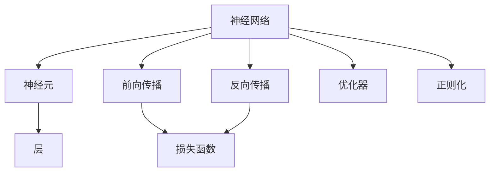
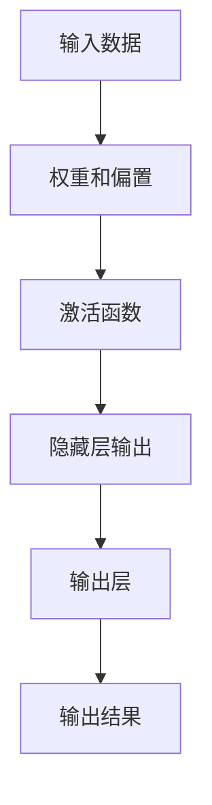
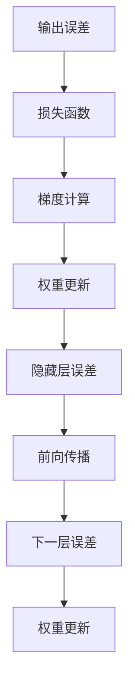
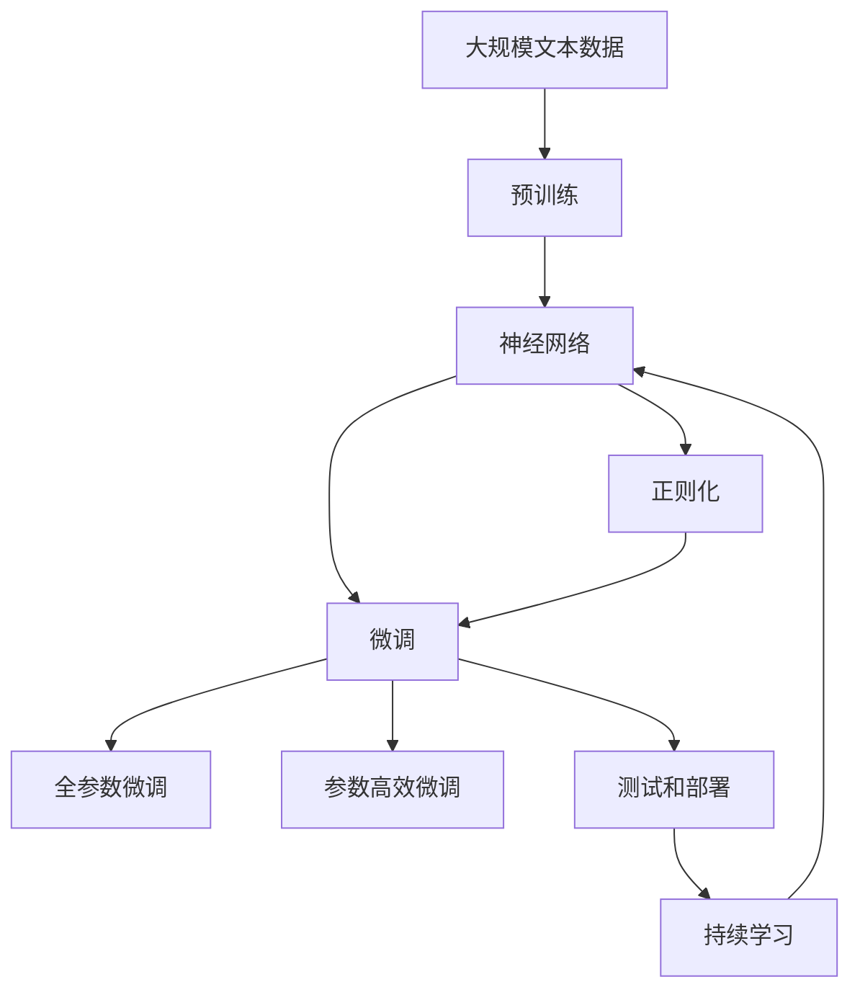

                 

# 神经网络原理与代码实例讲解

## 1. 背景介绍

### 1.1 问题由来
人工智能（AI）的迅猛发展离不开深度学习技术的推动，其中神经网络是深度学习的基础。神经网络不仅在图像识别、语音识别、自然语言处理等领域取得了卓越的成果，也在游戏智能、自动驾驶、智能推荐等多个实际应用中展现出了巨大的潜力。然而，神经网络并非“黑盒”，其内部工作原理和计算过程仍需要一定的数学基础和技术积累。本文旨在深入介绍神经网络的基本原理，并结合代码实例讲解其实现细节，为读者提供一个系统的入门指南。

### 1.2 问题核心关键点
理解神经网络的基本原理和实现机制，需要关注以下几个核心关键点：
1. **网络结构**：神经网络是由一系列层级结构组成的计算模型。每一层通过一系列权重和偏置（bias）对输入数据进行处理，产生新的输出。
2. **激活函数**：激活函数决定神经元的输出，非线性激活函数如ReLU、Sigmoid等引入非线性特性，增强模型的表达能力。
3. **损失函数**：损失函数用于衡量模型输出与真实标签的差异，梯度下降算法通过最小化损失函数优化模型参数。
4. **反向传播**：反向传播算法通过链式法则计算梯度，逐层更新模型参数，是神经网络训练的核心步骤。
5. **正则化**：正则化技术如L2正则、Dropout等用于避免过拟合，增强模型泛化能力。

### 1.3 问题研究意义
掌握神经网络原理和技术细节，对开发和部署实际应用系统具有重要意义：
1. **提升模型性能**：理解神经网络的结构和算法，可以优化网络设计，提升模型的预测准确率和鲁棒性。
2. **加快项目开发**：掌握神经网络的实现细节，可以避免从零开始构建网络，加快模型开发速度。
3. **改善技术理解**：深入理解神经网络的计算过程，有助于更好地理解深度学习算法和技术。
4. **促进技术创新**：掌握神经网络的核心原理，可以探索新的模型结构和优化方法，推动技术创新。

## 2. 核心概念与联系

### 2.1 核心概念概述

为更好地理解神经网络的原理和实现，本节将介绍几个核心概念：

- **神经元（Neuron）**：神经网络的基本计算单元，通常由权重、偏置和激活函数组成，用于处理输入数据并产生输出。
- **层（Layer）**：神经网络由多个层级组成，每一层通常包含多个神经元，执行特定的计算操作。
- **前向传播（Forward Propagation）**：从输入层到输出层的计算过程，通过逐层传递输入数据并应用激活函数，产生最终的输出。
- **反向传播（Backpropagation）**：通过反向传播算法计算梯度，逐层更新模型参数的过程。
- **损失函数（Loss Function）**：衡量模型预测结果与真实标签之间差异的函数，用于训练模型。
- **优化器（Optimizer）**：优化算法，如梯度下降、Adam等，用于最小化损失函数，更新模型参数。
- **正则化（Regularization）**：防止过拟合的技术，如L2正则、Dropout等，增强模型泛化能力。

这些核心概念之间的逻辑关系可以通过以下Mermaid流程图来展示：



这个流程图展示神经网络的基本结构，并指出了其关键组件和工作流程。通过理解这些核心概念，我们可以更好地把握神经网络的工作原理和优化方向。

### 2.2 概念间的关系

这些核心概念之间存在着紧密的联系，形成了神经网络的基本计算框架。下面我们通过几个Mermaid流程图来展示这些概念之间的关系。

#### 2.2.1 神经网络的结构


这个流程图展示了神经网络的基本结构：从输入层到隐藏层再到输出层，每层包含多个神经元，逐层传递计算结果。

#### 2.2.2 前向传播过程



这个流程图展示了前向传播的过程，从输入数据经过权重和偏置处理，再经过激活函数，最终产生输出结果。

#### 2.2.3 反向传播算法



这个流程图展示了反向传播的计算过程，从输出误差通过损失函数计算梯度，逐层反向传播，更新权重和偏置，计算下一层的误差。

#### 2.2.4 损失函数和优化器


这个流程图展示了损失函数和优化器的关系，损失函数衡量模型输出与真实标签之间的差异，优化器通过梯度下降等算法最小化损失函数，更新模型参数。

### 2.3 核心概念的整体架构

最后，我们用一个综合的流程图来展示这些核心概念在大规模神经网络微调过程中的整体架构：



这个综合流程图展示了从预训练到微调，再到持续学习的完整过程。神经网络首先在大规模文本数据上进行预训练，然后通过微调（包括全参数微调和参数高效微调）或正则化技术，得到针对特定任务优化的模型。最后，通过持续学习技术，模型可以不断学习新知识，同时避免遗忘旧知识。

## 3. 核心算法原理 & 具体操作步骤
### 3.1 算法原理概述

神经网络的基本计算框架基于反向传播算法，通过前向传播计算输出，通过反向传播计算梯度，最小化损失函数，更新模型参数。以下是对这些步骤的详细描述。

#### 3.1.1 前向传播
前向传播从输入数据开始，通过逐层计算，得到输出结果。具体过程如下：
1. **输入层**：将输入数据转换为向量形式，记为 $x$。
2. **权重和偏置**：每一层包含多个神经元，每个神经元通过权重 $W$ 和偏置 $b$ 对输入数据进行处理，计算新的输出 $z$。
3. **激活函数**：对 $z$ 应用激活函数 $f$，产生新的输出 $a$。
4. **隐藏层**：重复步骤2和3，逐层计算，直到输出层。
5. **输出层**：应用线性变换和softmax函数，输出最终结果 $y$。

数学公式为：
$$
a_i = f(z_i) = f(W_i x + b_i)
$$
$$
y = W_L a_{L-1} + b_L
$$

#### 3.1.2 反向传播
反向传播算法通过计算梯度，逐层更新模型参数。具体过程如下：
1. **输出误差**：计算输出误差 $E$，通常使用交叉熵损失函数。
2. **梯度计算**：通过反向传播算法，计算输出层的梯度 $dE/dz$，并逐层向后传递，计算每一层的梯度 $dE/da$ 和 $dE/dz$。
3. **权重更新**：根据梯度 $dE/da$ 和 $dE/dW$，使用优化算法（如梯度下降、Adam等）更新权重 $W$ 和偏置 $b$。

数学公式为：
$$
dE/dy = -(y - t)
$$
$$
dE/da = W_L^T (dE/dy) \frac{dL(y)}{da}
$$
$$
dE/dW = \frac{da}{dx} \frac{dx}{dW}
$$

#### 3.1.3 优化器
优化器通过最小化损失函数，更新模型参数。常用的优化算法包括梯度下降、Adam等。梯度下降算法的基本步骤如下：
1. **初始化参数**：设置模型参数的初始值。
2. **计算梯度**：计算损失函数对模型参数的梯度。
3. **更新参数**：使用优化算法更新模型参数，更新公式为 $w_{t+1} = w_t - \eta \nabla L(w)$，其中 $w$ 为模型参数，$L$ 为损失函数，$\eta$ 为学习率。
4. **重复迭代**：重复执行步骤2和3，直到达到预设的迭代次数或损失函数收敛。

#### 3.1.4 正则化
正则化技术用于防止过拟合，增强模型泛化能力。常用的正则化方法包括L2正则和Dropout等。L2正则通过加入权重平方和的惩罚项，防止权重过大；Dropout随机丢弃部分神经元，增强模型鲁棒性。

数学公式为：
$$
L_{regular} = L + \lambda \sum_i W_i^2
$$
$$
P = \frac{1}{N} \sum_{i=1}^N (1 - p_i) a_i a_{\overline{i}}
$$

### 3.2 算法步骤详解

以下是一个简单的神经网络的前向传播和反向传播示例。

#### 3.2.1 前向传播
假设我们有一个包含两个隐藏层和一个输出层的神经网络，每一层包含5个神经元。输入数据为3维向量 $x = [1, 2, 3]$，权重和偏置分别为 $W_1 = [[0.1, 0.2], [0.3, 0.4]]$，$b_1 = [0.5, 0.6]$，$W_2 = [[0.7, 0.8], [0.9, 1.0]]$，$b_2 = [1.1, 1.2]$，激活函数为ReLU。前向传播的计算过程如下：

1. **输入层**：$x = [1, 2, 3]$
2. **第一层计算**：
   $$
   z_1 = W_1 x + b_1 = [[0.1*1 + 0.3*2 + 0.5], [0.2*1 + 0.4*2 + 0.6]] = [[1.1], [1.4]]
   $$
   $$
   a_1 = f(z_1) = ReLU([1.1, 1.4]) = [1.1, 1.4]
   $$
3. **第二层计算**：
   $$
   z_2 = W_2 a_1 + b_2 = [[0.7*1.1 + 0.9*1.4 + 1.1], [0.8*1.1 + 1.0*1.4 + 1.2]] = [[2.8], [3.6]]
   $$
   $$
   a_2 = f(z_2) = ReLU([2.8, 3.6]) = [2.8, 3.6]
   $$
4. **输出层计算**：
   $$
   y = W_L a_{L-1} + b_L = [1, 2] * [2.8, 3.6] + [1.5, 2.0] = [7.6, 8.6]
   $$

#### 3.2.2 反向传播
假设输出误差为 $E = [0.1, 0.2]$，交叉熵损失函数为 $L(y, t) = -\sum_i t_i \log(y_i)$。使用梯度下降算法进行反向传播的计算过程如下：

1. **输出误差计算**：
   $$
   dE/dy = -[0.1, 0.2]
   $$
2. **梯度计算**：
   $$
   dE/da_2 = W_L^T \frac{dL(y, t)}{da_2} = [1, 1] * 0.4 = [0.4, 0.4]
   $$
   $$
   dE/dz_2 = a_2 * dE/da_2 = [2.8, 3.6] * [0.4, 0.4] = [1.12, 1.44]
   $$
   $$
   dE/dW_2 = \frac{da_2}{dx_1} * \frac{dx_1}{dW_2} = [a_1, a_1] * \frac{1}{5} * \frac{1}{5} = [0.064, 0.064]
   $$
   $$
   dE/db_2 = 1 * dE/dz_2 = [1.12, 1.44]
   $$
3. **第一层梯度计算**：
   $$
   dE/da_1 = W_2^T * dE/dz_2 * \frac{dL(y, t)}{da_1} = [1.12, 1.44] * 0.5 = [0.56, 0.72]
   $$
   $$
   dE/dz_1 = a_1 * dE/da_1 = [1.1, 1.4] * [0.56, 0.72] = [0.616, 0.976]
   $$
   $$
   dE/dW_1 = \frac{da_1}{dx} * \frac{dx}{dW_1} = [a, a] * \frac{1}{5} * \frac{1}{5} = [0.064, 0.064]
   $$
   $$
   dE/db_1 = 1 * dE/dz_1 = [0.616, 0.976]
   $$
4. **权重和偏置更新**：
   $$
   W_1 = W_1 - \eta * dE/dW_1 = [[0.1, 0.2], [0.3, 0.4]] - \eta * [[0.064, 0.064], [0.064, 0.064]]
   $$
   $$
   b_1 = b_1 - \eta * dE/db_1 = [0.5, 0.6] - \eta * [0.616, 0.976]
   $$
   $$
   W_2 = W_2 - \eta * dE/dW_2 = [[0.7, 0.8], [0.9, 1.0]] - \eta * [[0.064, 0.064], [0.064, 0.064]]
   $$
   $$
   b_2 = b_2 - \eta * dE/db_2 = [1.1, 1.2] - \eta * [1.12, 1.44]
   $$

### 3.3 算法优缺点

神经网络的优点包括：
1. **强大的表达能力**：神经网络通过逐层非线性变换，可以逼近任意复杂函数，适用于多种任务。
2. **高效的数据表示**：神经网络将输入数据映射到高维特征空间，提取数据中的重要信息。
3. **自适应学习能力**：通过反向传播算法，神经网络能够自动调整模型参数，适应数据分布。

神经网络的缺点包括：
1. **计算复杂度高**：神经网络参数量大，计算复杂度高，需要大量的计算资源。
2. **过拟合风险高**：神经网络容易过拟合，尤其是数据量小、特征复杂的情况。
3. **模型解释性差**：神经网络的决策过程缺乏可解释性，难以理解和调试。

### 3.4 算法应用领域

神经网络在多个领域中得到了广泛应用：
1. **计算机视觉**：图像分类、目标检测、人脸识别等。
2. **自然语言处理**：文本分类、情感分析、机器翻译等。
3. **语音识别**：语音识别、情感分析、语音合成等。
4. **推荐系统**：用户推荐、商品推荐、广告推荐等。
5. **医疗健康**：疾病预测、影像分析、基因分析等。
6. **金融分析**：风险评估、欺诈检测、投资预测等。

## 4. 数学模型和公式 & 详细讲解  
### 4.1 数学模型构建

神经网络的基本计算模型可以表示为一个由输入层、隐藏层和输出层组成的计算图。记输入层为 $x$，输出层为 $y$，中间隐藏层为 $a$，权重为 $W$，偏置为 $b$，激活函数为 $f$，则神经网络的前向传播和反向传播过程可以表示为：

$$
a = f(Wx + b)
$$
$$
y = f(W_La_{L-1} + b_L)
$$
$$
dE/da = W_L^T \frac{dL(y, t)}{da}
$$
$$
dE/dW = \frac{da}{dx} \frac{dx}{dW}
$$

其中 $L$ 为神经网络的层数。

### 4.2 公式推导过程

以下我们以一个简单的全连接神经网络为例，推导前向传播和反向传播的公式。

#### 4.2.1 前向传播
假设我们有一个包含两个隐藏层和一个输出层的全连接神经网络，每一层包含5个神经元。输入数据为3维向量 $x = [1, 2, 3]$，权重和偏置分别为 $W_1 = [[0.1, 0.2], [0.3, 0.4]]$，$b_1 = [0.5, 0.6]$，$W_2 = [[0.7, 0.8], [0.9, 1.0]]$，$b_2 = [1.1, 1.2]$，激活函数为ReLU。前向传播的计算过程如下：

1. **输入层**：$x = [1, 2, 3]$
2. **第一层计算**：
   $$
   z_1 = W_1 x + b_1 = [[0.1*1 + 0.3*2 + 0.5], [0.2*1 + 0.4*2 + 0.6]] = [[1.1], [1.4]]
   $$
   $$
   a_1 = f(z_1) = ReLU([1.1, 1.4]) = [1.1, 1.4]
   $$
3. **第二层计算**：
   $$
   z_2 = W_2 a_1 + b_2 = [[0.7*1.1 + 0.9*1.4 + 1.1], [0.8*1.1 + 1.0*1.4 + 1.2]] = [[2.8], [3.6]]
   $$
   $$
   a_2 = f(z_2) = ReLU([2.8, 3.6]) = [2.8, 3.6]
   $$
4. **输出层计算**：
   $$
   y = W_L a_{L-1} + b_L = [1, 2] * [2.8, 3.6] + [1.5, 2.0] = [7.6, 8.6]
   $$

#### 4.2.2 反向传播
假设输出误差为 $E = [0.1, 0.2]$，交叉熵损失函数为 $L(y, t) = -\sum_i t_i \log(y_i)$。使用梯度下降算法进行反向传播的计算过程如下：

1. **输出误差计算**：
   $$
   dE/dy = -[0.1, 0.2]
   $$
2. **梯度计算**：
   $$
   dE/da_2 = W_L^T \frac{dL(y, t)}{da_2} = [1, 1] * 0.4 = [0.4, 0.4]
   $$
   $$
   dE/dz_2 = a_2 * dE/da_2 = [2.8, 3.6] * [0.4, 0.4] = [1.12, 1.44]
   $$
   $$
   dE/dW_2 = \frac{da_2}{dx_1} * \frac{dx_1}{dW_2} = [a_1, a_1] * \frac{1}{5} * \frac{1}{5} = [0.064, 0.064]
   $$
   $$
   dE/db_2 = 1 * dE/dz_2 = [1.12, 1.44]
   $$
3. **第一层梯度计算**：
   $$
   dE/da_1 = W_2^T * dE/dz_2 * \frac{dL(y, t)}{da_1} = [1.12, 1.44] * 0.5 = [0.56, 0.72]
   $$
   $$
   dE/dz_1 = a_1 * dE/da_1 = [1.1, 1.4] * [0.56, 0.72] = [0.616, 0.976]
   $$
   $$
   dE/dW_1 = \frac{da_1}{dx} * \frac{dx}{dW_1} = [a, a] * \frac{1}{5} * \frac{1}{5} = [0.064, 0.064]
   $$
   $$
   dE/db_1 = 1 * dE/dz_1 = [0.616, 0.976]
   $$
4. **权重和偏置更新**：
   $$
   W_1 = W_1 - \eta * dE/dW_1 = [[0.1, 0.2], [0.3, 0.4]] - \eta * [[0.064, 0.064], [0.064, 0.064]]
   $$
   $$
   b_1 = b_1 - \eta * dE/db_1 = [0.5, 0.6] - \eta * [0.616, 0.976]
   $$
   $$
   W_2 = W_2 - \eta * dE/dW_2 = [[0.7, 0.8], [0.9, 1.0]] - \eta * [[0.064, 0.064], [0.064, 0.064]]
   $$
   $$
   b_2 = b_2 - \eta * dE/db_2 = [1.1, 1.2] - \eta * [1.12, 1.44]
   $$

## 5. 项目实践：代码实例和详细解释说明
### 5.1 开发环境搭建

在进行神经网络开发前，我们需要准备好开发环境。以下是使用Python进行TensorFlow开发的环境配置流程：

1. 安装Anaconda：从官网下载并安装Anaconda，用于创建独立的Python环境。

2. 创建并激活虚拟环境：
```bash
conda create -n tf-env python=3.8 
conda activate tf-env
```

3. 安装TensorFlow：从官网获取对应的安装命令。例如：
```bash
pip install tensorflow==2.6
```

4. 安装各类工具包：
```bash
pip install numpy pandas scikit-learn matplotlib tqdm jupyter notebook ipython
```

完成上述步骤后，即可在`tf-env`环境中开始神经网络的开发实践。

### 5.2 源代码详细实现

下面我们以一个简单的全连接神经网络为例，给出使用TensorFlow构建和训练神经网络的完整代码实现。

```python
import tensorflow as tf
import numpy as np
import matplotlib.pyplot as plt

# 定义神经网络结构
class NeuralNetwork(tf.keras.Model):
    def __init__(self, input_size, hidden_size, output_size):
        super(NeuralNetwork, self).__init__()
        self.dense1 = tf.keras.layers.Dense(hidden_size, activation=tf.nn.relu)
        self.dense2 = tf.keras.layers.Dense(output_size, activation=None)

    def call(self, x):
        x = self.dense1(x)
        x = self.dense2(x)
        return x

# 定义训练数据
input_size = 2
hidden_size = 4
output_size = 1


