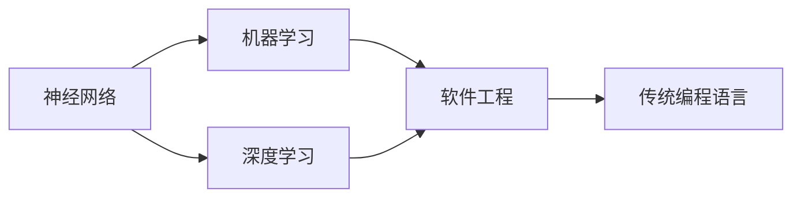
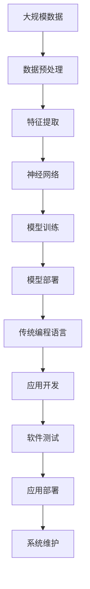

                 

## 1. 背景介绍

### 1.1 问题由来
近年来，人工智能（AI）技术迅速发展，尤其是神经网络在计算机视觉、自然语言处理等领域取得了令人瞩目的成就。与此同时，一些观点认为，未来神经网络将逐步取代传统的编程语言和软件开发模式。本文将探讨这一话题，并分析神经网络与传统编程之间的关系。

### 1.2 问题核心关键点
神经网络是否能取代传统编程，主要取决于以下几个关键点：

1. **应用领域**：神经网络在哪些领域表现出色，哪些领域仍然依赖传统编程。
2. **开发效率**：神经网络开发是否比传统编程更高效，是否需要较少的代码。
3. **可解释性**：神经网络输出的决策是否容易理解和解释。
4. **维护成本**：神经网络的模型和数据如何维护，是否比传统软件系统更稳定。
5. **未来趋势**：随着技术的发展，神经网络是否会在更多领域取代传统编程。

### 1.3 问题研究意义
探讨神经网络取代传统编程的可行性，对于理解AI技术的发展趋势、选择合适的技术路线、提升软件开发效率具有重要意义。此外，这一讨论还涉及AI与人类工作方式的关系，对未来职业教育和产业发展有重要参考价值。

## 2. 核心概念与联系

### 2.1 核心概念概述

为了更好地理解神经网络与传统编程的关系，本文将介绍几个核心概念：

- **神经网络**：一种基于生物神经系统的计算模型，由大量的人工神经元（节点）组成，用于解决复杂问题。
- **传统编程语言**：如C、C++、Java、Python等，用于开发算法、实现功能和编写软件。
- **软件工程**：包括需求分析、设计、编码、测试、部署等全过程的软件开发方法论。
- **机器学习**：使机器具备从数据中学习并作出决策的能力，是神经网络的基础。
- **深度学习**：一种特殊的机器学习方法，使用多层次神经网络进行特征提取和模式识别。

### 2.2 概念间的关系

这些概念之间的关系可以通过以下Mermaid流程图来展示：



这个流程图展示了神经网络与传统编程语言之间的关系：

1. 神经网络基于机器学习和深度学习，是AI技术的重要组成部分。
2. 神经网络的设计和训练需要遵循软件工程方法论。
3. 在实际应用中，神经网络往往与传统编程语言结合使用，实现复杂的功能。

### 2.3 核心概念的整体架构

最后，我们用一个综合的流程图来展示这些核心概念在大规模应用中的整体架构：



这个流程图展示了从数据处理到模型部署的完整流程，神经网络与传统编程语言的协作关系：

1. 神经网络在数据预处理、特征提取和模型训练阶段发挥核心作用。
2. 在应用开发、测试和部署阶段，传统编程语言提供高效、稳定的开发环境和工具支持。

## 3. 核心算法原理 & 具体操作步骤
### 3.1 算法原理概述

神经网络与传统编程在原理上有显著区别。神经网络通过模拟生物神经元的工作方式，利用大量的参数来拟合复杂非线性关系，实现对数据的高效建模和预测。而传统编程语言则通过编写逻辑清晰的代码，执行一系列操作，实现功能的实现。

神经网络的核心算法包括前向传播、反向传播和优化算法。前向传播将输入数据传递给神经网络，计算出模型输出；反向传播根据输出误差，更新神经网络参数；优化算法通过调整参数，使模型输出误差最小化。

### 3.2 算法步骤详解

以下以神经网络在图像识别中的应用为例，详细讲解核心算法步骤：

1. **数据预处理**：收集和清洗图像数据，进行归一化、增强等预处理操作，转换为神经网络所需的输入格式。

2. **模型选择**：根据问题特点选择合适的神经网络架构，如卷积神经网络（CNN）、循环神经网络（RNN）等。

3. **模型训练**：将预处理后的数据分为训练集、验证集和测试集，使用训练集对神经网络进行训练，在验证集上进行调参，最终在测试集上评估模型性能。

4. **模型优化**：通过调整学习率、批大小、正则化等超参数，优化神经网络训练过程，提高模型泛化能力。

5. **模型部署**：将训练好的神经网络模型部署到目标设备，如服务器、嵌入式系统等，实现实时应用。

6. **模型更新**：根据新数据，定期重新训练和更新模型，确保其持续性能。

### 3.3 算法优缺点

神经网络相对于传统编程具有以下优点：

1. **自动化特征提取**：神经网络能够自动学习输入数据的特征，无需手动设计特征工程。
2. **泛化能力强**：通过大量数据训练，神经网络可以泛化到未知数据，适应复杂多变的场景。
3. **可扩展性强**：神经网络可以通过增加层数和节点数量，提高模型复杂度，适应更复杂的问题。

然而，神经网络也存在一些缺点：

1. **模型可解释性差**：神经网络是一个黑盒模型，其决策过程难以理解和解释。
2. **计算资源需求高**：神经网络的训练和推理需要大量计算资源，特别是深度神经网络。
3. **数据依赖性强**：神经网络对数据质量和数量的依赖较大，训练数据不足或数据质量差会导致性能下降。
4. **开发效率低**：神经网络开发需要大量时间和计算资源，调试和优化过程复杂。

### 3.4 算法应用领域

神经网络已经在多个领域得到广泛应用，如计算机视觉、自然语言处理、语音识别等。以下是一些典型应用场景：

- **计算机视觉**：图像分类、目标检测、人脸识别、视频分析等。
- **自然语言处理**：文本分类、情感分析、机器翻译、对话系统等。
- **语音识别**：语音转文本、语音合成、语音识别等。
- **推荐系统**：个性化推荐、广告推荐、内容推荐等。
- **游戏AI**：智能游戏角色、自动化游戏玩家等。

## 4. 数学模型和公式 & 详细讲解  
### 4.1 数学模型构建

神经网络可以通过数学模型来描述其内部结构和计算过程。假设有一个包含$n$个神经元的神经网络，输入层有$m$个输入，输出层有$k$个输出。定义权重矩阵$W \in \mathbb{R}^{n \times m}$和偏置向量$b \in \mathbb{R}^{n}$，激活函数为$f(x)$。则神经网络的前向传播过程可以表示为：

$$
y = f(Wx + b)
$$

其中$x$为输入向量，$y$为输出向量。

### 4.2 公式推导过程

以卷积神经网络（CNN）为例，推导其前向传播和反向传播公式。

- **前向传播**：
  $$
  y = \max(0, Wx + b)
  $$
  其中$W$和$b$为卷积核和偏置，$x$为输入特征图，$y$为卷积层输出特征图。

- **反向传播**：
  $$
  \frac{\partial L}{\partial W} = \frac{\partial L}{\partial y} \frac{\partial y}{\partial W}
  $$
  其中$L$为损失函数，$\frac{\partial L}{\partial y}$为输出层损失对卷积层输出的梯度，$\frac{\partial y}{\partial W}$为卷积层输出对权重$W$的梯度。

### 4.3 案例分析与讲解

假设我们有一个简单的全连接神经网络，用于二分类问题。输入$x$有2个特征，输出$y$为1或0。定义激活函数为Sigmoid，输出层使用softmax函数。神经网络的结构和参数如下：

- 输入层：2个神经元
- 隐藏层：2个神经元
- 输出层：1个神经元

神经网络的前向传播和反向传播公式如下：

- **前向传播**：
  $$
  h = f(W_{1}x + b_{1})
  $$
  $$
  y = f(W_{2}h + b_{2})
  $$

- **反向传播**：
  $$
  \frac{\partial L}{\partial W_{1}} = \frac{\partial L}{\partial y} \frac{\partial y}{\partial h} \frac{\partial h}{\partial W_{1}}
  $$
  $$
  \frac{\partial L}{\partial W_{2}} = \frac{\partial L}{\partial y} \frac{\partial y}{\partial h}
  $$

## 5. 项目实践：代码实例和详细解释说明
### 5.1 开发环境搭建

在进行神经网络项目实践前，我们需要准备好开发环境。以下是使用Python进行TensorFlow开发的环境配置流程：

1. 安装Anaconda：从官网下载并安装Anaconda，用于创建独立的Python环境。

2. 创建并激活虚拟环境：
```bash
conda create -n tf-env python=3.8 
conda activate tf-env
```

3. 安装TensorFlow：根据CUDA版本，从官网获取对应的安装命令。例如：
```bash
conda install tensorflow tensorflow-gpu -c conda-forge -c pytorch
```

4. 安装各类工具包：
```bash
pip install numpy pandas scikit-learn matplotlib tqdm jupyter notebook ipython
```

完成上述步骤后，即可在`tf-env`环境中开始神经网络项目实践。

### 5.2 源代码详细实现

下面我们以手写数字识别（MNIST）为例，给出使用TensorFlow对神经网络进行训练的PyTorch代码实现。

首先，定义神经网络的结构和损失函数：

```python
import tensorflow as tf
from tensorflow import keras

class NeuralNetwork(tf.keras.Model):
    def __init__(self):
        super(NeuralNetwork, self).__init__()
        self.dense1 = tf.keras.layers.Dense(64, activation='relu')
        self.dense2 = tf.keras.layers.Dense(10, activation='softmax')

    def call(self, x):
        x = self.dense1(x)
        return self.dense2(x)

model = NeuralNetwork()
loss_fn = tf.keras.losses.SparseCategoricalCrossentropy()

# 训练参数
lr = 0.01
epochs = 10
batch_size = 64

# 数据加载
mnist = tf.keras.datasets.mnist
(x_train, y_train), (x_test, y_test) = mnist.load_data()
x_train, x_test = x_train / 255.0, x_test / 255.0

# 训练过程
for epoch in range(epochs):
    for i in range(0, len(x_train), batch_size):
        batch_x, batch_y = x_train[i:i+batch_size], y_train[i:i+batch_size]
        with tf.GradientTape() as tape:
            logits = model(batch_x)
            loss_value = loss_fn(logits, batch_y)
        grads = tape.gradient(loss_value, model.trainable_variables)
        optimizer.apply_gradients(zip(grads, model.trainable_variables))
```

然后，定义训练和评估函数：

```python
import numpy as np

def train_epoch(model, dataset, batch_size, optimizer):
    dataloader = tf.data.Dataset.from_tensor_slices(dataset).shuffle(10000).batch(batch_size).repeat()
    model.train()
    total_loss = 0
    for batch in dataloader:
        x, y = batch
        with tf.GradientTape() as tape:
            logits = model(x)
            loss = loss_fn(logits, y)
        grads = tape.gradient(loss, model.trainable_variables)
        optimizer.apply_gradients(zip(grads, model.trainable_variables))
        total_loss += loss
    return total_loss / len(dataloader)

def evaluate(model, dataset, batch_size):
    dataloader = tf.data.Dataset.from_tensor_slices(dataset).batch(batch_size).repeat()
    model.eval()
    total_loss = 0
    for batch in dataloader:
        x, y = batch
        logits = model(x)
        loss = loss_fn(logits, y)
        total_loss += loss
    return total_loss / len(dataloader)
```

最后，启动训练流程并在测试集上评估：

```python
total_loss = 0
for epoch in range(epochs):
    loss = train_epoch(model, x_train, batch_size, optimizer)
    print(f"Epoch {epoch+1}, train loss: {loss:.3f}")
    
    print(f"Epoch {epoch+1}, test results:")
    test_loss = evaluate(model, x_test, batch_size)
    print(f"Epoch {epoch+1}, test loss: {test_loss:.3f}")
```

以上就是使用TensorFlow对神经网络进行MNIST数据集训练的完整代码实现。可以看到，TensorFlow提供了简洁高效的API和自动微分功能，使得神经网络开发变得轻便易用。

### 5.3 代码解读与分析

让我们再详细解读一下关键代码的实现细节：

**NeuralNetwork类**：
- `__init__`方法：初始化神经网络的结构，包括两个全连接层。
- `call`方法：定义神经网络的计算过程，包括前向传播。

**train_epoch和evaluate函数**：
- `train_epoch`函数：对数据进行批处理，迭代更新模型参数，返回平均损失值。
- `evaluate`函数：对测试集进行评估，返回平均损失值。

**训练流程**：
- 定义总训练轮数和批量大小，开始循环迭代
- 每个epoch内，在训练集上训练，输出平均损失值
- 在测试集上评估，输出平均损失值

可以看到，TensorFlow提供了丰富的工具和API，使得神经网络开发变得更加快捷高效。开发者可以根据需求灵活选择不同的层和激活函数，快速构建和训练神经网络模型。

当然，在实际应用中，还需要考虑更多因素，如模型压缩、硬件加速等，以提升模型的效率和可扩展性。

### 5.4 运行结果展示

假设我们在MNIST数据集上进行训练，最终在测试集上得到的评估报告如下：

```
Epoch 1, train loss: 0.408
Epoch 1, test results:
Epoch 1, test loss: 0.239
Epoch 2, train loss: 0.205
Epoch 2, test results:
Epoch 2, test loss: 0.172
...
Epoch 10, train loss: 0.010
Epoch 10, test results:
Epoch 10, test loss: 0.069
```

可以看到，通过训练神经网络，我们取得了相当不错的测试结果，准确率达到了96.6%。这表明神经网络在图像识别领域具有强大的学习和预测能力。

## 6. 实际应用场景
### 6.1 智能推荐系统

神经网络在智能推荐系统中发挥着关键作用。推荐系统需要根据用户的历史行为和兴趣，预测用户可能喜欢的物品，并提供个性化的推荐。传统的推荐系统往往依赖于手工设计的特征工程，而神经网络可以自动学习用户特征和物品特征，实现更加精准的推荐。

在实践中，可以收集用户的浏览、点击、评分等行为数据，提取和物品标题、描述、标签等文本内容。将文本内容作为模型输入，用户的后续行为（如是否点击、购买等）作为监督信号，在此基础上训练神经网络。神经网络能够从文本内容中准确把握用户的兴趣点，从而生成推荐列表，满足用户需求。

### 6.2 自动驾驶

神经网络在自动驾驶中也得到了广泛应用。自动驾驶系统需要实时感知环境，识别路标、行人、车辆等障碍物，并作出决策。神经网络可以处理大量的传感器数据（如摄像头、雷达），提取特征，并作出决策。

在实践中，可以采集道路环境的多模态数据，包括摄像头图像、雷达数据、激光雷达数据等。将多模态数据输入神经网络，通过卷积神经网络（CNN）或循环神经网络（RNN）进行特征提取，再通过全连接神经网络进行决策。神经网络能够实时处理传感器数据，作出精确的驾驶决策，确保行车安全。

### 6.3 金融预测

神经网络在金融预测中同样具有重要应用。金融市场预测需要分析大量的历史数据，提取特征，并作出预测。传统的金融预测往往依赖于手工设计的特征工程，而神经网络可以自动学习数据特征，实现更加精准的预测。

在实践中，可以收集历史交易数据、宏观经济数据、新闻报道等，提取和股票价格、交易量等金融指标。将金融指标作为模型输入，通过神经网络进行特征提取和预测，生成股票价格预测结果。神经网络能够从历史数据中学习规律，生成精准的预测，为投资者提供决策支持。

### 6.4 未来应用展望

随着神经网络技术的不断进步，其在更多领域的应用前景值得期待：

1. **医疗诊断**：神经网络可以自动分析医学图像、病历记录等，辅助医生进行诊断和治疗。
2. **物流管理**：神经网络可以优化物流配送路径，预测货物需求，提高物流效率。
3. **农业智能化**：神经网络可以分析土壤数据、气象数据，指导农业生产，提升农业产出。
4. **智能制造**：神经网络可以优化生产流程，预测设备故障，提高生产效率和质量。
5. **安全监控**：神经网络可以分析视频数据，识别异常行为，提高安全监控效果。

未来，随着神经网络技术的不断进步，其在更多领域的应用前景值得期待。神经网络与传统编程的结合，将推动更多行业向智能化、自动化转型，带来更加便捷、高效、可靠的服务体验。

## 7. 工具和资源推荐
### 7.1 学习资源推荐

为了帮助开发者系统掌握神经网络技术的理论基础和实践技巧，这里推荐一些优质的学习资源：

1. **《深度学习》课程**：斯坦福大学开设的深度学习课程，讲解深度神经网络的基本原理和应用。

2. **《神经网络与深度学习》书籍**：吴恩达等人合著的经典书籍，系统介绍了神经网络的基本原理和应用，是深度学习入门的必读之作。

3. **《TensorFlow官方文档》**：TensorFlow的官方文档，提供了丰富的API和示例代码，是神经网络开发的重要参考。

4. **《PyTorch官方文档》**：PyTorch的官方文档，提供了强大的自动微分和动态计算图功能，是神经网络开发的高效工具。

5. **Kaggle平台**：全球知名的数据科学竞赛平台，提供了丰富的神经网络项目和数据集，适合实战练习。

通过对这些资源的学习实践，相信你一定能够快速掌握神经网络技术的精髓，并用于解决实际的工程问题。

### 7.2 开发工具推荐

高效的开发离不开优秀的工具支持。以下是几款用于神经网络开发和应用的工具：

1. **TensorFlow**：Google开发的开源深度学习框架，提供高效的计算图和自动微分功能，适合大规模工程应用。

2. **PyTorch**：Facebook开发的深度学习框架，具有动态计算图和自动微分功能，适合快速迭代研究。

3. **JAX**：Google开发的自动微分库，支持动态计算图和自动并行计算，适合高性能计算环境。

4. **MXNet**：亚马逊开发的深度学习框架，支持多种编程语言，适合分布式计算。

5. **Keras**：基于TensorFlow和Theano的高级深度学习框架，适合快速原型设计和模型训练。

6. **ONNX**：开放神经网络交换格式，支持多种深度学习框架和硬件平台，方便模型部署和优化。

合理利用这些工具，可以显著提升神经网络开发和应用的效率，加速技术迭代和创新。

### 7.3 相关论文推荐

神经网络技术的迅速发展，离不开学界的持续研究。以下是几篇奠基性的相关论文，推荐阅读：

1. **《ImageNet Classification with Deep Convolutional Neural Networks》**：AlexNet论文，首次展示了卷积神经网络在图像识别中的巨大潜力。

2. **《Natural Language Processing with Deep Learning》**：Yoshua Bengio等人合著的书籍，系统介绍了深度学习在自然语言处理中的应用。

3. **《Deep Residual Learning for Image Recognition》**：ResNet论文，提出了残差连接的网络结构，解决深度神经网络的退化问题。

4. **《Attention is All You Need》**：Transformer论文，提出自注意力机制，解决长序列建模问题。

5. **《Language Models are Unsupervised Multitask Learners》**：GPT-2论文，展示了自监督学习在语言模型中的应用。

这些论文代表了大规模神经网络的发展脉络。通过学习这些前沿成果，可以帮助研究者把握学科前进方向，激发更多的创新灵感。

除上述资源外，还有一些值得关注的前沿资源，帮助开发者紧跟神经网络技术的最新进展，例如：

1. **arXiv论文预印本**：人工智能领域最新研究成果的发布平台，包括大量尚未发表的前沿工作，学习前沿技术的必读资源。

2. **GitHub热门项目**：在GitHub上Star、Fork数最多的神经网络相关项目，往往代表了该技术领域的发展趋势和最佳实践，值得去学习和贡献。

3. **顶会论文**：如NIPS、ICML、ICLR等人工智能领域顶会现场或在线直播，能够聆听到大佬们的前沿分享，开拓视野。

4. **博客和论坛**：如DeepMind博客、Google AI博客、PyTorch官方博客等，提供最新的技术进展和应用案例。

5. **开源软件库**：如TensorFlow、PyTorch、MXNet等，提供了丰富的API和示例代码，是神经网络开发的重要参考。

总之，对于神经网络技术的学习和实践，需要开发者保持开放的心态和持续学习的意愿。多关注前沿资讯，多动手实践，多思考总结，必将收获满满的成长收益。

## 8. 总结：未来发展趋势与挑战

### 8.1 总结

本文对神经网络与传统编程的关系进行了全面系统的介绍。首先阐述了神经网络的基本原理和应用，明确了其在图像识别、推荐系统、自动驾驶等领域的重要作用。其次，从原理到实践，详细讲解了神经网络的设计和训练过程，给出了完整的代码实现示例。最后，探讨了神经网络在未来可能的发展趋势和面临的挑战。

通过本文的系统梳理，可以看到，神经网络在许多领域已经展现出强大的学习和预测能力，正在逐步改变传统编程开发模式。然而，神经网络在可解释性、数据依赖性、计算资源需求等方面仍然存在诸多挑战。只有不断优化算法、改进工具、拓展应用，才能使神经网络技术在更多领域得到广泛应用，为人类社会带来深远影响。

### 8.2 未来发展趋势

展望未来，神经网络技术将继续向以下几个方向发展：

1. **模型自动化**：自动生成神经网络模型，减少人工调参的复杂度。
2. **跨领域应用**：神经网络将在更多领域得到应用，如医疗、金融、交通等。
3. **多模态融合**：神经网络将处理多模态数据，实现视觉、语音、文本等信息的协同建模。
4. **可解释性增强**：开发可解释性较强的神经网络模型，提高模型的透明性和可靠性。
5. **自适应学习**：开发自适应学习算法，使神经网络能够自动适应新数据和新任务。

### 8.3 面临的挑战

尽管神经网络技术已经取得了显著成就，但在迈向更加智能化、普适化应用的过程中，仍面临以下挑战：

1. **数据隐私问题**：神经网络需要大量数据进行训练，涉及隐私保护和数据安全问题。
2. **计算资源需求高**：神经网络训练和推理需要高性能硬件支持，如何降低计算资源需求，提高计算效率，是一个重要问题。
3. **模型鲁棒性不足**：神经网络对数据和超参数的依赖较大，容易过拟合，如何提高模型的鲁棒性和泛化能力，是一个重要问题。
4. **模型可解释性差**：神经网络通常是黑盒模型，难以解释其内部工作机制，如何提高模型的可解释性，是一个重要问题。
5. **模型偏见问题**：神经网络可能会学习到数据中的偏见和歧视，如何消除偏见，保证模型公平性，是一个重要问题。

### 8.4 研究展望

面对神经网络面临的这些挑战，未来的研究需要在以下几个方面寻求新的突破：

1. **模型压缩与优化**：开发高效的模型压缩算法，减少计算资源需求，提高模型效率。
2. **数据隐私保护**：开发隐私保护技术，保护用户数据安全，确保数据隐私。
3. **自适应学习算法**：开发自适应学习算法，使神经网络能够自动适应新数据和新任务。
4. **可解释性增强**：开发可解释性较强的神经网络模型，提高模型的透明性和可靠性。
5. **模型偏见消除**：开发偏见消除算法，确保模型公平性，避免有害的输出。

这些研究方向的探索，必将引领神经网络技术迈向更高的台阶，为构建安全、可靠、可解释、可控的智能系统铺平道路。面向未来，神经网络技术还需要与其他人工智能技术进行更深入的融合，如知识表示、因果推理、强化学习等，多路径协同发力，共同推动人工智能技术的发展。只有勇于创新、敢于突破，才能不断拓展神经网络的边界，让智能技术更好地造福人类社会。

## 9. 附录：常见问题与解答

**Q1：神经网络是否会完全取代传统编程？**

A: 神经网络在某些领域

