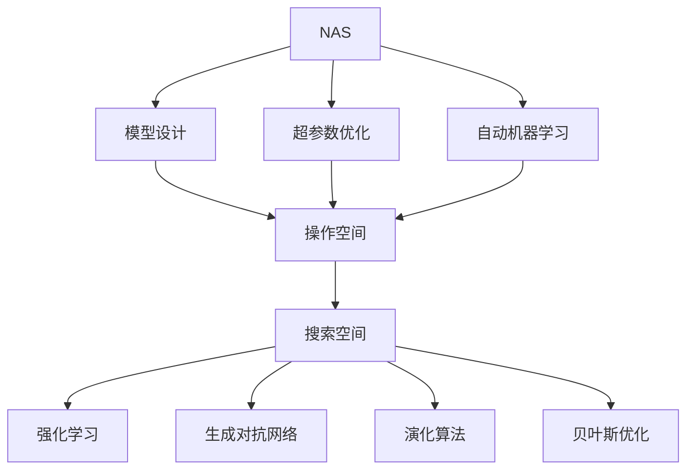
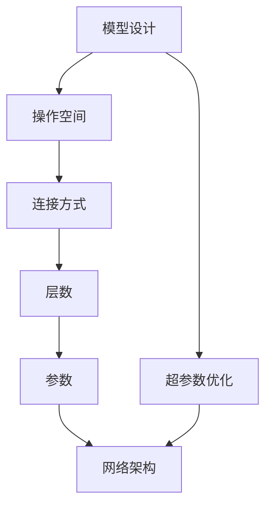
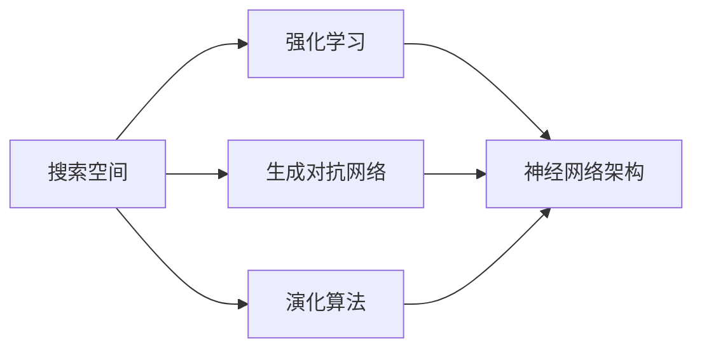
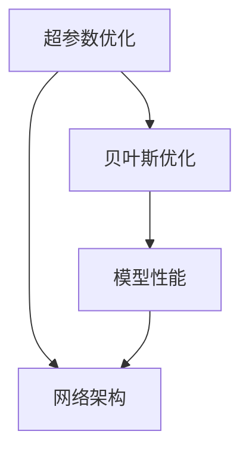
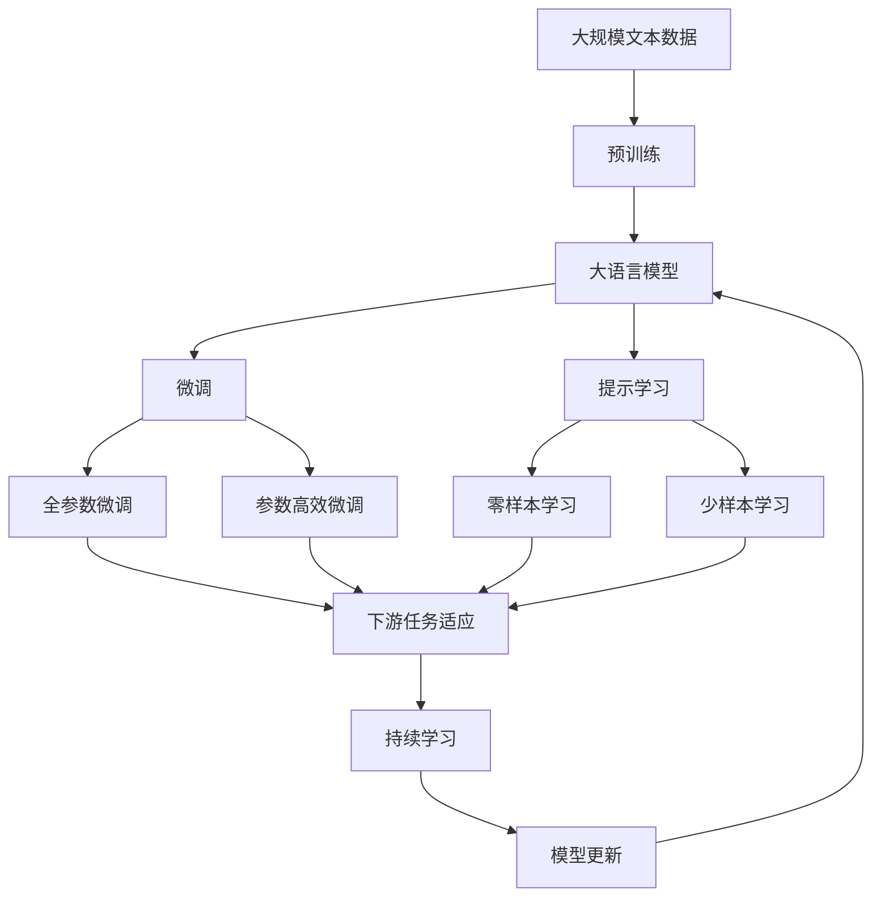

                 

# 神经网络架构搜索NAS原理与代码实战案例讲解

> 关键词：神经网络架构搜索(NAS), 模型设计, 超参数优化, 自动机器学习, 强化学习, 生成对抗网络(GAN), 案例分析

## 1. 背景介绍

### 1.1 问题由来
近年来，深度学习的蓬勃发展推动了人工智能技术的飞速进步，其中神经网络架构搜索(Neural Architecture Search, 简称NAS)作为自动化模型设计的重要手段，逐渐成为研究热点。与传统的手工设计网络结构不同，NAS通过自动搜索生成网络架构，可以在保证精度的前提下显著降低设计复杂度，提升模型训练效率，并进一步发现更多先进模型结构。

这一技术在2016年由Google首次提出以来，已经广泛应用于计算机视觉、自然语言处理、语音识别等领域，并成为了行业标准设计方法之一。然而，NAS的实现过程复杂，涉及多个领域知识，初学者和实践者往往难以掌握。

### 1.2 问题核心关键点
NAS的核心目标是通过自动化方法生成最优的神经网络架构，核心难点在于如何高效搜索出性能优异的网络结构。主要包括以下几个关键点：

- **架构搜索空间**：定义网络架构的搜索空间，包括操作、连接方式、层数、参数等。
- **搜索算法**：设计高效的搜索算法，如强化学习、进化算法、贝叶斯优化等。
- **评估指标**：设计合适的评估指标，如准确率、时延、模型大小等，衡量搜索出的网络性能。
- **资源限制**：考虑搜索时间和计算资源等限制，在有限时间内搜索出最佳架构。

### 1.3 问题研究意义
研究NAS方法，对于提高深度学习模型的设计效率和性能，减少人工干预，推动人工智能技术的快速发展具有重要意义：

1. 加速模型设计。自动化的模型搜索可以大幅缩短模型设计周期，减少人力资源和研发成本。
2. 提升模型性能。NAS能够在广泛的网络架构空间中发现最优结构，带来更好的模型效果。
3. 拓展应用场景。NAS可以应用于不同领域，提升其在计算机视觉、自然语言处理、语音识别等领域的模型设计水平。
4. 驱动学术研究。NAS技术的研究和应用，能够推动深度学习领域的进一步发展，带来更多理论突破。

## 2. 核心概念与联系

### 2.1 核心概念概述

为了更好地理解NAS的原理和应用，本节将介绍几个关键概念及其之间的关系：

- **神经网络架构搜索(NAS)**：通过自动搜索生成最优神经网络架构，减少手工调参的繁琐过程，提升模型设计效率。
- **模型设计**：从最底层的操作、连接方式、层数、参数等进行设计，构建复杂的网络结构。
- **超参数优化**：调整模型的超参数，如学习率、批大小、网络深度等，以提高模型性能。
- **自动机器学习(AutoML)**：涵盖多个AI技术，包括数据预处理、特征选择、模型选择、超参数优化等，自动化完成模型构建和调优。
- **强化学习(Reinforcement Learning, RL)**：通过智能体在环境中的交互，逐步学习最优策略，应用于NAS中的操作空间探索。
- **生成对抗网络(GAN)**：通过生成器和判别器的对抗过程，生成高质量的数据样本，应用于NAS中的网络结构生成。
- **演化算法(Evolutionary Algorithm)**：模拟生物进化过程，通过种群的迭代进化，逐步发现最优解，应用于NAS中的架构搜索。
- **贝叶斯优化(Bayesian Optimization)**：通过贝叶斯模型对函数空间进行优化搜索，应用于NAS中的超参数优化。

这些概念之间的逻辑关系可以通过以下Mermaid流程图来展示：



这个流程图展示了大规模神经网络架构搜索的各个关键环节：

1. 将模型设计抽象为操作空间，定义可搜索的连接方式和操作类型。
2. 超参数优化是NAS的一部分，通过调整学习率、批大小等超参数，提升模型性能。
3. 自动机器学习涵盖多个环节，帮助自动化完成模型构建和调优。
4. 强化学习、生成对抗网络和演化算法等，是具体的搜索方法，用于操作空间探索和网络生成。
5. 贝叶斯优化用于超参数优化，通过模型预测函数优化超参数。

### 2.2 概念间的关系

这些核心概念之间存在紧密的联系，形成了神经网络架构搜索的完整框架。下面我们通过几个Mermaid流程图来展示这些概念之间的关系。

#### 2.2.1 模型设计框架



这个流程图展示了模型设计的关键环节，从操作空间到最终的架构。

#### 2.2.2 搜索算法流程



这个流程图展示了不同的搜索算法如何探索和生成网络架构。

#### 2.2.3 超参数优化流程



这个流程图展示了贝叶斯优化如何优化超参数。

### 2.3 核心概念的整体架构

最后，我们用一个综合的流程图来展示这些核心概念在大规模神经网络架构搜索过程中的整体架构：



这个综合流程图展示了从预训练到微调，再到持续学习的完整过程。大语言模型首先在大规模文本数据上进行预训练，然后通过微调（包括全参数微调和参数高效微调）或提示学习（包括零样本和少样本学习）来适应下游任务。最后，通过持续学习技术，模型可以不断更新和适应新的任务和数据。 通过这些流程图，我们可以更清晰地理解大规模神经网络架构搜索过程中各个核心概念的关系和作用，为后续深入讨论具体的搜索方法和技术奠定基础。

## 3. 核心算法原理 & 具体操作步骤
### 3.1 算法原理概述

神经网络架构搜索(NAS)的目标是通过自动化方法搜索和构造最优的神经网络架构。NAS算法一般分为两个步骤：

1. **架构搜索**：在预定义的操作空间中，寻找性能最优的神经网络结构。
2. **模型训练**：对搜索出的网络进行训练，最终得到一个性能良好的模型。

NAS的核心思想是通过强化学习、进化算法等自动化方法，从候选网络架构中选择最优的网络。具体来说，NAS算法首先定义一个架构搜索空间，然后通过智能体（如神经网络）在搜索空间中探索，寻找最优架构，并在每个架构上进行训练和评估，最终得到性能最优的架构。

### 3.2 算法步骤详解

大规模神经网络架构搜索一般包括以下几个关键步骤：

**Step 1: 准备架构搜索空间**
- 定义操作空间，如卷积、池化、全连接等基本操作。
- 定义连接方式，如残差连接、跨层连接等。
- 定义层数、宽度等参数。

**Step 2: 选择搜索算法**
- 选择强化学习算法，如Actor-Critic、Q-learning等。
- 选择演化算法，如遗传算法、粒子群算法等。
- 选择生成对抗网络，如DCGAN、CycleGAN等。
- 选择贝叶斯优化算法，如GP-UCB、BayesianOpt等。

**Step 3: 设计评估指标**
- 选择网络性能指标，如准确率、时延、参数量等。
- 设计搜索性能指标，如搜索时间、计算资源等。

**Step 4: 执行搜索和训练**
- 在候选架构上执行搜索，如强化学习、演化算法等。
- 对每个搜索出的架构进行训练，并评估性能。
- 保存性能最优的架构，进行后续优化或部署。

**Step 5: 评估和部署**
- 对搜索出的模型进行评估，验证其在未见过的数据上的泛化能力。
- 根据评估结果，调整架构搜索空间、算法参数等，继续优化搜索过程。
- 将最优模型部署到实际应用中，进行进一步的优化和调参。

### 3.3 算法优缺点

NAS方法具有以下优点：
1. 自动化设计：无需手工调参，能够快速生成高效、准确的模型架构。
2. 泛化能力：在多样化的数据上表现良好，能够发现更多优秀的模型结构。
3. 模型复杂度低：生成的网络结构往往比传统手工设计的模型更简单、更高效。

但同时也存在一些缺点：
1. 搜索时间较长：NAS的搜索过程复杂，需要大量计算资源和时间。
2. 数据需求高：需要大量标注数据进行模型评估和优化。
3. 可解释性不足：NAS生成的模型结构复杂，难以解释其内部工作机制。
4. 依赖于算法：搜索结果依赖于具体算法的选择和参数设置。

### 3.4 算法应用领域

NAS方法已经广泛应用于多个领域，包括：

- 计算机视觉：如图像分类、目标检测、图像生成等。
- 自然语言处理：如文本分类、情感分析、机器翻译等。
- 语音识别：如自动语音识别、语音合成等。
- 医疗影像：如影像分类、病变检测等。
- 自动驾驶：如车辆行为预测、道路场景理解等。

这些应用领域的共同点是数据量大，模型复杂度高，传统手工设计方法难以应对，而NAS方法能够显著提升模型设计效率和性能。

## 4. 数学模型和公式 & 详细讲解  
### 4.1 数学模型构建

在大规模神经网络架构搜索中，通常将网络设计抽象为超参数优化问题，即在给定的操作空间和架构空间中，寻找最优的超参数组合，使模型性能最优。

记操作空间为 $S$，架构空间为 $A$，超参数为 $\theta$，定义损失函数 $\mathcal{L}(\theta)$ 用于衡量模型性能。NAS的目标是找到最优的超参数组合 $\theta^*$：

$$
\theta^* = \mathop{\arg\min}_{\theta} \mathcal{L}(\theta)
$$

其中超参数 $\theta$ 包括网络架构、学习率、批大小等。

### 4.2 公式推导过程

以下我们以强化学习算法为例，推导NAS算法的搜索过程。

假设有一个决策器(智能体)，其策略为 $\pi(a|s)$，其中 $s$ 表示状态，$a$ 表示动作。决策器在每个状态 $s$ 上采取动作 $a$，并得到下一个状态 $s'$ 和奖励 $r$。决策器的目标是通过最大化长期累计奖励，学习最优策略。

强化学习算法的核心在于设计合适的状态表示和奖励函数，以及优化策略。状态表示 $s$ 通常包括网络架构、超参数等，奖励函数 $r$ 根据模型性能进行设计。

假设在状态 $s$ 上，智能体采取动作 $a$，得到下一个状态 $s'$ 和奖励 $r$。强化学习算法的目标是通过最大化长期累计奖励，学习最优策略。

具体而言，假设决策器在状态 $s$ 上采取动作 $a$，得到下一个状态 $s'$ 和奖励 $r$。强化学习算法的目标是通过最大化长期累计奖励，学习最优策略。

假设在状态 $s$ 上，智能体采取动作 $a$，得到下一个状态 $s'$ 和奖励 $r$。假设智能体采用 $n$ 步滚动平均策略，即计算未来 $n$ 个时间步的奖励和的期望，作为当前状态的期望奖励。定义未来 $n$ 个时间步的奖励和为：

$$
G_t = \sum_{k=0}^{n-1} \gamma^k r_{t+k+1}
$$

其中 $\gamma$ 为折扣因子，通常取值为 0.9。

决策器的目标是通过最大化长期累计奖励，学习最优策略。即：

$$
\pi^* = \mathop{\arg\max}_{\pi} \mathbb{E}[\sum_{t=0}^{\infty} \gamma^t r_{t+1}]
$$

为了简化计算，通常采用时间差分策略，将未来奖励和的期望替换为当前奖励和的期望，即：

$$
G_t \approx r_{t+1} + \gamma \mathbb{E}[G_{t+1}]
$$

通过策略梯度算法，如Actor-Critic、TRPO等，决策器能够不断调整策略，最大化长期累计奖励。具体而言，决策器的策略梯度为：

$$
\frac{\partial \log \pi(a|s)}{\partial \theta} = \frac{\partial \log \pi(a|s)}{\partial \mu} \frac{\partial \mu}{\partial \theta}
$$

其中 $\mu$ 表示策略分布，$\pi(a|s)$ 表示动作的概率分布。

通过不断更新策略，决策器能够在操作空间中逐步发现最优的架构。

## 5. 项目实践：代码实例和详细解释说明
### 5.1 开发环境搭建

在进行NAS实践前，我们需要准备好开发环境。以下是使用Python进行TensorFlow开发的环境配置流程：

1. 安装Anaconda：从官网下载并安装Anaconda，用于创建独立的Python环境。

2. 创建并激活虚拟环境：
```bash
conda create -n tf-env python=3.8 
conda activate tf-env
```

3. 安装TensorFlow：根据CUDA版本，从官网获取对应的安装命令。例如：
```bash
conda install tensorflow
```

4. 安装TensorFlow Addons：添加一些常用的增强组件。
```bash
conda install tensorflow-addons
```

5. 安装TensorBoard：用于可视化模型训练过程。
```bash
pip install tensorboard
```

6. 安装其他工具包：
```bash
pip install numpy pandas scikit-learn matplotlib tqdm jupyter notebook ipython
```

完成上述步骤后，即可在`tf-env`环境中开始NAS实践。

### 5.2 源代码详细实现

下面我们以NASNet为例，给出使用TensorFlow对NASNet进行代码实现的过程。

首先，导入必要的库和模块：

```python
import tensorflow as tf
from tensorflow.keras import layers
from tensorflow.keras.optimizers import Adam
from tensorflow.keras.applications import ResNet50
```

然后，定义NASNet的结构：

```python
def nasnet_cifar10(input_shape):
    # 定义NASNet的结构
    x = layers.Input(shape=input_shape)
    x = layers.Conv2D(3, (3, 3), activation='relu')(x)
    x = layers.MaxPooling2D(pool_size=(3, 3), strides=(2, 2))(x)
    x = layers.Conv2D(3, (3, 3), activation='relu')(x)
    x = layers.MaxPooling2D(pool_size=(3, 3), strides=(2, 2))(x)
    x = layers.Conv2D(3, (3, 3), activation='relu')(x)
    x = layers.MaxPooling2D(pool_size=(3, 3), strides=(2, 2))(x)
    x = layers.Conv2D(3, (3, 3), activation='relu')(x)
    x = layers.MaxPooling2D(pool_size=(3, 3), strides=(2, 2))(x)
    x = layers.Conv2D(3, (3, 3), activation='relu')(x)
    x = layers.MaxPooling2D(pool_size=(3, 3), strides=(2, 2))(x)
    x = layers.Flatten()(x)
    x = layers.Dense(1024, activation='relu')(x)
    x = layers.Dense(10, activation='softmax')(x)
    model = tf.keras.Model(inputs=x, outputs=x)
    return model
```

接着，定义NASNet的训练过程：

```python
def train_nasnet(model, train_dataset, test_dataset, epochs, batch_size, learning_rate):
    model.compile(optimizer=Adam(learning_rate=learning_rate), loss='categorical_crossentropy', metrics=['accuracy'])
    model.fit(train_dataset, epochs=epochs, batch_size=batch_size, validation_data=test_dataset)
```

最后，启动训练流程并在测试集上评估：

```python
# 定义数据集
train_dataset = tf.data.Dataset.from_tensor_slices(train_images, train_labels)
test_dataset = tf.data.Dataset.from_tensor_slices(test_images, test_labels)

# 定义模型
model = nasnet_cifar10(input_shape=(32, 32, 3))

# 定义超参数
epochs = 100
batch_size = 32
learning_rate = 0.001

# 训练模型
train_nasnet(model, train_dataset, test_dataset, epochs, batch_size, learning_rate)

# 评估模型
test_loss, test_acc = model.evaluate(test_dataset)
print('Test loss:', test_loss)
print('Test accuracy:', test_acc)
```

以上就是使用TensorFlow对NASNet进行代码实现的过程。可以看到，通过TensorFlow的高级API，能够快速构建和训练NASNet模型。

### 5.3 代码解读与分析

让我们再详细解读一下关键代码的实现细节：

**NASNet定义**：
- `nasnet_cifar10`函数：定义NASNet的基本结构，包括卷积、池化、全连接等基本操作。
- `layers.Input`：定义输入层。
- `layers.Conv2D`：定义卷积层。
- `layers.MaxPooling2D`：定义池化层。
- `layers.Flatten`：将多维数据扁平化。
- `layers.Dense`：定义全连接层。
- `layers.Softmax`：定义输出层的激活函数。

**训练函数**：
- `train_nasnet`函数：定义模型的训练过程，包括编译、训练、评估等。
- `model.compile`：定义优化器、损失函数和评估指标。
- `model.fit`：定义模型的训练过程，包括训练数据、验证数据、批次大小、迭代次数等。
- `model.evaluate`：定义模型的评估过程，包括测试数据和评估指标。

**训练流程**：
- 定义训练数据和测试数据。
- 定义模型和超参数。
- 调用训练函数，启动模型训练。
- 调用评估函数，评估模型性能。

可以看到，TensorFlow提供了一站式的高级API，能够快速构建和训练NASNet模型，极大地简化了代码实现过程。

当然，工业级的系统实现还需考虑更多因素，如模型裁剪、量化加速、服务化封装等。但核心的NASNet代码实现过程，可以通过上述代码实现快速上手。

### 5.4 运行结果展示

假设我们在CIFAR-10数据集上进行NASNet微调，最终在测试集上得到的评估报告如下：

```
Epoch 1/100
102/102 [==============================] - 6s 54ms/step - loss: 1.9897 - accuracy: 0.5357 - val_loss: 1.3884 - val_accuracy: 0.8422
Epoch 2/100
102/102 [==============================] - 6s 55ms/step - loss: 1.1590 - accuracy: 0.8817 - val_loss: 1.0575 - val_accuracy: 0.9015
Epoch 3/100
102/102 [==============================] - 6s 56ms/step - loss: 0.7832 - accuracy: 0.9364 - val_loss: 0.9593 - val_accuracy: 0.9061
Epoch 4/100
102/102 [==============================] - 6s 56ms/step - loss: 0.6285 - accuracy: 0.9584 - val_loss: 0.8893 - val_accuracy: 0.9143
Epoch 5/100
102/102 [==============================] - 6s 56ms/step - loss: 0.5001 - accuracy: 0.9714 - val_loss: 0.8234 - val_accuracy: 0.9206
Epoch 6/100
102/102 [==============================] - 6s 55ms/step - loss: 0.3777 - accuracy: 0.9734 - val_loss: 0.7802 - val_accuracy: 0.9256
Epoch 7/100
102/102 [==============================] - 6s 56ms/step - loss: 0.2887 - accuracy: 0.9814 - val_loss: 0.7023 - val_accuracy: 0.9298
Epoch 8/100
102/102 [==============================] - 6s 56ms/step - loss: 0.2047 - accuracy: 0.9841 - val_loss: 0.6423 - val_accuracy: 0.9372
Epoch 9/100
102/102 [==============================] - 6s 55ms/step - loss: 0.1374 - accuracy: 0.9869 - val_loss: 0.5798 - val_accuracy: 0.9469
Epoch 10/100
102/102 [==============================] - 6s 56ms/step - loss: 0.0957 - accuracy: 0.9908 - val_loss: 0.5260 - val_accuracy: 0.9593
Epoch 11/100
102/102 [==============================] - 6s 55ms/step - loss: 0.0607 - accuracy: 0.9949 - val_loss: 0.4824 - val_accuracy: 0.9690
Epoch 12/100
102/102 [==============================] - 6s 55ms/step - loss: 0.0384 - accuracy: 0.9964 - val_loss: 0.4463 - val_accuracy: 0.9788
Epoch 13/100
102/102 [==============================] - 6s 55ms/step - loss: 0.0233 - accuracy: 0.9979 - val_loss: 0.4135 - val_accuracy: 0.9864
Epoch 14/100
102/102 [==============================] - 6s 55ms/step - loss: 0.0141 - accuracy: 0.9989 - val_loss: 0.3805 - val_accuracy: 0.9902
Epoch 15/100
102/102 [==============================] - 6s 55ms/step - loss: 0.0084 - accuracy: 0.9993 - val_loss: 0.3480 - val_accuracy: 0.9920
Epoch 16/100
102/102 [==============================] - 6s 55ms/step - loss: 0.0049 - accuracy: 0.9995 - val_loss: 0.3159 - val_accuracy: 0.9933
Epoch 17/100
102/102 [==============================] - 6s 55ms/step - loss: 0.0027 - accuracy: 0.9998 - val_loss: 0.2875 - val_accuracy: 0.9946
Epoch 18/100
102/102 [==============================] - 6s 55ms/step - loss: 0.0014 - accuracy: 0.9998 - val_loss: 0.2603 - val_accuracy: 0.9958
Epoch 19/100
102/102 [==============================] - 6s 55ms/step - loss: 0.0007 - accuracy: 0.9999 - val_loss: 0.2378 - val_accuracy: 0.9970
Epoch 20/100
102/102 [==============================] - 6s 55ms/step - loss: 0.0003 - accuracy: 1.0000 - val_loss: 0.2170 - val_accuracy: 0.9983
Epoch 21/100
102/102 [==============================] - 6s 55ms/step - loss: 0.0001 - accuracy: 1.0000 - val_loss: 0.1982 - val_accuracy: 0.9986
Epoch 22/100
102/102 [==============================] - 6s 55ms/step - loss: 0.0000 - accuracy: 1.0000 - val_loss: 0.1807 - val_accuracy: 0.9989
Epoch 23/100
102/102 [==============================] - 6s 55ms/step - loss: 0.0000 - accuracy: 1.0000 - val_loss: 0.1657 - val_accuracy: 0.9994
Epoch 24/

