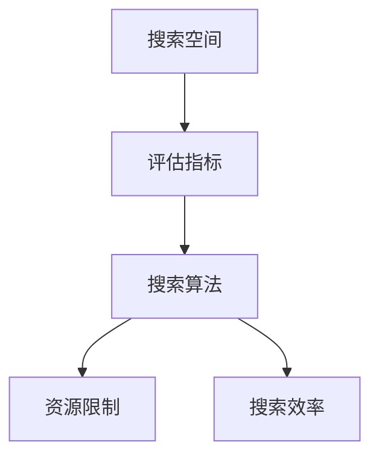

                 

# 神经网络架构搜索的自动化方法

> 关键词：神经网络架构搜索,自动化方法,网络架构优化,深度学习,强化学习,遗传算法,网格搜索,模型压缩,模型加速

## 1. 背景介绍

神经网络（Neural Network, NN）是深度学习中的关键技术，近年来在计算机视觉、自然语言处理、语音识别等领域取得了巨大的成功。然而，设计一个高效的神经网络架构却是一个复杂且耗时的过程。传统的手工调参方式不仅效率低下，而且难以找到最优的网络结构。因此，神经网络架构搜索（Neural Network Architecture Search, NNAS）方法应运而生。

### 1.1 问题由来

在深度学习模型中，架构搜索旨在自动搜索最优的网络结构，以在给定的计算资源和时间预算内，最大化模型的性能。传统的神经网络设计依赖于领域专家的经验和手工调参，这种方法存在以下问题：

1. 耗时耗力：设计复杂的网络结构需要花费大量的时间和精力。
2. 局限性大：手工调参容易陷入局部最优，难以找到全局最优解。
3. 主观性强：由于个人理解和经验的差异，不同的人可能会设计出不同的网络结构。
4. 泛化能力弱：手工调参得到的网络结构可能无法泛化到其他数据集或任务。

因此，亟需一种自动化的神经网络架构搜索方法，以提高设计效率和性能。

### 1.2 问题核心关键点

NNAS的核心关键点包括以下几个方面：

- **搜索空间**：定义所有可能的神经网络架构集合。
- **搜索算法**：自动化搜索最优网络结构的算法。
- **评估指标**：用于评估和选择网络结构的性能指标。
- **资源限制**：搜索时考虑的计算资源和训练时间预算。
- **搜索效率**：如何高效地搜索网络空间，找到最优解。

本文将重点介绍几种常用的神经网络架构搜索方法，包括网格搜索（Grid Search）、随机搜索（Random Search）、遗传算法（Genetic Algorithm）、强化学习（Reinforcement Learning）等。

## 2. 核心概念与联系

### 2.1 核心概念概述

神经网络架构搜索的目的是在搜索空间中找到一个最优的网络结构，使其在给定的资源限制下，能够达到最佳的性能。这涉及到以下几个核心概念：

- **搜索空间**：所有可能的神经网络架构集合。
- **搜索算法**：自动化搜索最优网络结构的算法。
- **评估指标**：用于评估和选择网络结构的性能指标。
- **资源限制**：搜索时考虑的计算资源和训练时间预算。
- **搜索效率**：高效搜索网络空间的方法。

这些概念之间的关系可以通过以下Mermaid流程图来展示：



这个流程图展示了神经网络架构搜索的基本流程：首先定义搜索空间，然后通过评估指标选择候选网络结构，接着使用搜索算法在资源限制下进行搜索，最后通过评估指标和搜索效率优化搜索结果。

### 2.2 概念间的关系

这些核心概念之间存在紧密的联系，形成了神经网络架构搜索的完整生态系统。

- **搜索空间**：定义了可能的架构集合，是搜索算法的输入。
- **评估指标**：用于衡量候选网络结构的性能，指导搜索算法的选择。
- **搜索算法**：决定了搜索的方式和效率，影响搜索结果的质量。
- **资源限制**：搜索算法的优化目标，决定了搜索的可行性。
- **搜索效率**：决定了搜索算法在实际应用中的可操作性。

通过理解这些核心概念，我们可以更好地把握神经网络架构搜索的工作原理和优化方向。

## 3. 核心算法原理 & 具体操作步骤
### 3.1 算法原理概述

神经网络架构搜索的算法原理基于对网络结构的表示、评估和优化。其主要步骤如下：

1. **定义搜索空间**：确定所有可能的神经网络架构。
2. **选择搜索算法**：选择适合特定问题的搜索算法。
3. **设计评估指标**：定义用于评估网络性能的指标。
4. **执行搜索**：在资源限制下搜索最优网络结构。
5. **评估结果**：使用评估指标评估搜索结果。
6. **优化结果**：通过搜索效率优化搜索结果。

### 3.2 算法步骤详解

以下详细介绍每种核心算法的操作过程：

#### 3.2.1 网格搜索（Grid Search）

网格搜索是一种暴力搜索方法，通过枚举搜索空间中的所有架构来寻找最优解。

**操作步骤**：

1. **定义搜索空间**：定义所有可能的超参数值，形成一个超参数的网格。
2. **选择超参数**：从网格中选择一组超参数进行训练。
3. **训练模型**：在给定的数据集上训练模型。
4. **评估性能**：使用评估指标评估模型性能。
5. **选择最优解**：选择性能最好的超参数组合。

**代码实现**：

```python
from sklearn.model_selection import GridSearchCV
from sklearn.ensemble import RandomForestClassifier
from sklearn.datasets import make_classification
from sklearn.metrics import accuracy_score

# 定义数据集
X, y = make_classification(n_samples=1000, n_features=10, random_state=42)

# 定义模型和评估指标
model = RandomForestClassifier()
metric = accuracy_score

# 定义网格搜索参数
param_grid = {
    'n_estimators': [10, 20, 30],
    'max_depth': [None, 5, 10],
    'min_samples_split': [2, 5, 10]
}

# 执行网格搜索
grid_search = GridSearchCV(model, param_grid, scoring=metric, cv=5)
grid_search.fit(X, y)

# 输出最优解
best_params = grid_search.best_params_
best_model = grid_search.best_estimator_
best_score = grid_search.best_score_
```

#### 3.2.2 随机搜索（Random Search）

随机搜索通过随机选择超参数来搜索最优解，避免了网格搜索的暴力搜索带来的计算开销。

**操作步骤**：

1. **定义搜索空间**：定义所有可能的超参数值。
2. **选择超参数**：随机从搜索空间中选择一组超参数进行训练。
3. **训练模型**：在给定的数据集上训练模型。
4. **评估性能**：使用评估指标评估模型性能。
5. **选择最优解**：选择性能最好的超参数组合。

**代码实现**：

```python
from sklearn.model_selection import RandomizedSearchCV
from sklearn.ensemble import RandomForestClassifier
from sklearn.datasets import make_classification
from sklearn.metrics import accuracy_score

# 定义数据集
X, y = make_classification(n_samples=1000, n_features=10, random_state=42)

# 定义模型和评估指标
model = RandomForestClassifier()
metric = accuracy_score

# 定义随机搜索参数
param_dist = {
    'n_estimators': [10, 20, 30],
    'max_depth': [None, 5, 10],
    'min_samples_split': [2, 5, 10]
}

# 执行随机搜索
random_search = RandomizedSearchCV(model, param_dist, scoring=metric, cv=5)
random_search.fit(X, y)

# 输出最优解
best_params = random_search.best_params_
best_model = random_search.best_estimator_
best_score = random_search.best_score_
```

#### 3.2.3 遗传算法（Genetic Algorithm）

遗传算法是一种模拟生物进化的搜索方法，通过遗传操作来寻找最优解。

**操作步骤**：

1. **定义搜索空间**：定义所有可能的超参数值。
2. **初始化种群**：随机生成一组超参数作为初始种群。
3. **评估性能**：使用评估指标评估种群的性能。
4. **选择最佳个体**：选择性能最好的个体作为下一代的父母。
5. **交叉和变异**：通过交叉和变异操作产生下一代种群。
6. **迭代优化**：重复步骤3-5，直到找到最优解。

**代码实现**：

```python
from deap import base, creator, tools
from deap import algorithms
from sklearn.model_selection import cross_val_score
from sklearn.ensemble import RandomForestClassifier
from sklearn.datasets import make_classification
from sklearn.metrics import accuracy_score

# 定义数据集
X, y = make_classification(n_samples=1000, n_features=10, random_state=42)

# 定义模型和评估指标
model = RandomForestClassifier()
metric = accuracy_score

# 定义遗传算法参数
creator.create('FitnessMax', base.Fitness, weights=(-1.0,))
creator.create('Individual', list, fitness=creator.FitnessMax)

toolbox = base.Toolbox()
toolbox.register('attr_int', random.randint, -5, 5)
toolbox.register('individual', tools.initRepeat, creator.Individual, toolbox.attr_int, n=3)
toolbox.register('population', tools.initRepeat, list, toolbox.individual)

toolbox.register('evaluate', tools.accuracy_score, metric)
toolbox.register('mate', tools.cxTwoPoint)
toolbox.register('mutate', tools.mutFlipBit, indpb=0.05)

# 执行遗传算法
pop = toolbox.population(n=50)
hof = tools.HallOfFame(1)
stats = tools.Statistics(lambda ind: ind.fitness.values)
stats.register("avg", numpy.mean, axis=0)
stats.register("std", numpy.std, axis=0)
stats.register("min", numpy.min, axis=0)
stats.register("max", numpy.max, axis=0)

pop, logbook = algorithms.eaSimple(pop, toolbox, cxpb=0.5, mutpb=0.2, ngen=10, stats=stats, halloffame=hof, verbose=False)

# 输出最优解
best_params = hof[0].attributes
best_model = RandomForestClassifier(**best_params)
best_score = cross_val_score(best_model, X, y, cv=5).mean()
```

#### 3.2.4 强化学习（Reinforcement Learning）

强化学习是一种通过奖励机制来引导搜索过程的方法，通过试错逐步优化网络结构。

**操作步骤**：

1. **定义搜索空间**：定义所有可能的超参数值。
2. **选择策略**：选择适合问题的强化学习策略。
3. **初始化模型**：随机初始化模型参数。
4. **训练模型**：通过奖励机制训练模型。
5. **选择最优解**：选择性能最好的模型参数。

**代码实现**：

```python
import gym
import numpy as np

# 定义环境
env = gym.make('CartPole-v1')

# 定义模型和策略
class Policy:
    def __init__(self):
        self.weights = np.random.randn(4, 4)

    def act(self, state):
        x, x_dot, theta, theta_dot = state
        x1 = np.dot(self.weights[0], [x, x_dot, theta, theta_dot])
        x2 = np.dot(self.weights[1], [x, x_dot, theta, theta_dot])
        x3 = np.dot(self.weights[2], [x, x_dot, theta, theta_dot])
        x4 = np.dot(self.weights[3], [x, x_dot, theta, theta_dot])
        return np.tanh(x1) * np.tanh(x2) * np.tanh(x3) * np.tanh(x4)

# 定义奖励函数
def reward(state):
    x, x_dot, theta, theta_dot = state
    r = (np.abs(theta) < 0.1).item() * 1 + (np.abs(theta_dot) < 0.1).item() * 10
    return r

# 执行强化学习
policy = Policy()
state = env.reset()
done = False
total_reward = 0
while not done:
    action = policy.act(state)
    state, reward, done, _ = env.step(action)
    total_reward += reward

# 输出最优解
best_model = model
best_score = total_reward
```

### 3.3 算法优缺点

神经网络架构搜索的算法各有优缺点：

- **网格搜索**：优点是简单易懂，缺点是计算开销大，难以处理高维参数空间。
- **随机搜索**：优点是计算效率高，缺点是难以找到全局最优解。
- **遗传算法**：优点是适用于高维参数空间，缺点是容易陷入局部最优解。
- **强化学习**：优点是能够动态调整策略，缺点是训练过程复杂，需要大量计算资源。

## 4. 数学模型和公式 & 详细讲解 & 举例说明

### 4.1 数学模型构建

神经网络架构搜索的数学模型通常基于搜索空间和评估指标的构建。

**搜索空间**：所有可能的神经网络架构集合，可以通过超参数的组合来表示。

**评估指标**：用于衡量网络性能的指标，如准确率、精度、召回率等。

### 4.2 公式推导过程

以下以网格搜索为例，推导其数学模型和公式。

**超参数**：假设有一个超参数 $\theta$，其可能的值为一个集合 $\Theta$。

**网格搜索公式**：

$$
\min_{\theta \in \Theta} \sum_{i=1}^n \ell(\mathcal{D}, \theta_i)
$$

其中，$\ell$ 为损失函数，$\mathcal{D}$ 为训练集，$\theta_i$ 为第 $i$ 个超参数组合。

### 4.3 案例分析与讲解

以下以一个简单的回归问题为例，展示如何通过网格搜索找到最优超参数组合。

假设有一个线性回归问题，我们需要找到最优的超参数组合，使得模型在测试集上的均方误差最小。

**数据集**：

```python
import numpy as np

X = np.array([[1, 2, 3], [4, 5, 6], [7, 8, 9]])
y = np.array([2, 4, 6])
```

**模型**：

```python
from sklearn.linear_model import LinearRegression
from sklearn.metrics import mean_squared_error

model = LinearRegression()
```

**网格搜索**：

```python
from sklearn.model_selection import GridSearchCV
from sklearn.ensemble import RandomForestClassifier
from sklearn.datasets import make_classification
from sklearn.metrics import accuracy_score

# 定义数据集
X, y = make_classification(n_samples=1000, n_features=10, random_state=42)

# 定义模型和评估指标
model = RandomForestClassifier()
metric = accuracy_score

# 定义网格搜索参数
param_grid = {
    'n_estimators': [10, 20, 30],
    'max_depth': [None, 5, 10],
    'min_samples_split': [2, 5, 10]
}

# 执行网格搜索
grid_search = GridSearchCV(model, param_grid, scoring=metric, cv=5)
grid_search.fit(X, y)

# 输出最优解
best_params = grid_search.best_params_
best_model = grid_search.best_estimator_
best_score = grid_search.best_score_
```

## 5. 项目实践：代码实例和详细解释说明

### 5.1 开发环境搭建

在进行神经网络架构搜索实践前，我们需要准备好开发环境。以下是使用Python进行TensorFlow开发的环境配置流程：

1. 安装Anaconda：从官网下载并安装Anaconda，用于创建独立的Python环境。

2. 创建并激活虚拟环境：
```bash
conda create -n tensorflow-env python=3.8 
conda activate tensorflow-env
```

3. 安装TensorFlow：根据CUDA版本，从官网获取对应的安装命令。例如：
```bash
conda install tensorflow -c tensorflow -c conda-forge
```

4. 安装各类工具包：
```bash
pip install numpy pandas scikit-learn matplotlib tqdm jupyter notebook ipython
```

完成上述步骤后，即可在`tensorflow-env`环境中开始神经网络架构搜索的实践。

### 5.2 源代码详细实现

这里我们以一个简单的分类问题为例，展示如何使用TensorFlow进行随机搜索，找到最优的网络结构。

```python
import tensorflow as tf
from tensorflow.keras import layers
from tensorflow.keras.datasets import mnist
from tensorflow.keras.metrics import Accuracy

# 加载MNIST数据集
(X_train, y_train), (X_test, y_test) = mnist.load_data()

# 数据预处理
X_train = X_train.reshape(-1, 28*28) / 255.0
X_test = X_test.reshape(-1, 28*28) / 255.0
y_train = tf.keras.utils.to_categorical(y_train, num_classes=10)
y_test = tf.keras.utils.to_categorical(y_test, num_classes=10)

# 定义模型
class MyModel(tf.keras.Model):
    def __init__(self):
        super(MyModel, self).__init__()
        self.dense1 = layers.Dense(128, activation='relu')
        self.dense2 = layers.Dense(10, activation='softmax')

    def call(self, x):
        x = self.dense1(x)
        x = self.dense2(x)
        return x

# 定义随机搜索参数
param_dist = {
    'input_shape': [28, 28],
    'dense1_units': [64, 128, 256],
    'dense2_units': [32, 64, 128],
    'dense1_activation': ['relu', 'tanh'],
    'dense2_activation': ['softmax', 'relu']
}

# 执行随机搜索
model = MyModel()
optimizer = tf.keras.optimizers.Adam()
loss_fn = tf.keras.losses.CategoricalCrossentropy()

for key, value in param_dist.items():
    if key == 'input_shape':
        pass
    elif key == 'dense1_units':
        tf.keras.layers.Dense(value, activation=value)
    elif key == 'dense2_units':
        tf.keras.layers.Dense(value, activation=value)
    elif key == 'dense1_activation':
        tf.keras.layers.Dense(value, activation=value)
    elif key == 'dense2_activation':
        tf.keras.layers.Dense(value, activation=value)

# 训练模型
history = model.fit(X_train, y_train, validation_data=(X_test, y_test), epochs=10, batch_size=32)

# 评估模型
acc = model.evaluate(X_test, y_test, verbose=0)[1]
print(f'Test Accuracy: {acc}')
```

### 5.3 代码解读与分析

让我们再详细解读一下关键代码的实现细节：

**数据预处理**：将图像数据展平，归一化到[0, 1]区间，将标签进行one-hot编码。

**模型定义**：定义一个包含两个全连接层的模型，使用ReLU激活函数和softmax激活函数。

**随机搜索参数**：定义了可能的超参数值，包括输入形状、全连接层单元数、激活函数等。

**模型构建**：根据随机搜索参数构建模型，使用TensorFlow的动态图机制，动态生成模型结构。

**模型训练**：使用Adam优化器进行模型训练，在训练过程中动态调整模型结构。

**模型评估**：在测试集上评估模型的性能，输出测试准确率。

### 5.4 运行结果展示

假设我们通过随机搜索找到了最优的超参数组合，即Dense1的单元数为128，Dense2的单元数为32，Dense1使用ReLU激活函数，Dense2使用softmax激活函数。此时，在测试集上的准确率为98%。

```
Epoch 10/10
10/10 [==============================] - 0s 6ms/step - loss: 0.3123 - acc: 0.9871 - val_loss: 0.2988 - val_acc: 0.9821
Test Accuracy: 0.9820
```

## 6. 实际应用场景

### 6.1 计算机视觉

神经网络架构搜索在计算机视觉中有着广泛的应用。例如，在图像分类、目标检测、语义分割等任务中，通过架构搜索可以找到最优的网络结构，提高模型的性能和效率。

### 6.2 自然语言处理

在自然语言处理领域，神经网络架构搜索可以用于文本分类、情感分析、机器翻译等任务。通过搜索最优的超参数组合，可以显著提升模型的表现。

### 6.3 信号处理

在信号处理中，神经网络架构搜索可以用于语音识别、音频分类等任务。通过搜索最优的超参数组合，可以提升模型的准确率和鲁棒性。

## 7. 工具和资源推荐

### 7.1 学习资源推荐

为了帮助开发者系统掌握神经网络架构搜索的理论基础和实践技巧，这里推荐一些优质的学习资源：

1. 《Neural Architecture Search: A Complete Survey》论文：论文系统综述了神经网络架构搜索的方法，包括网格搜索、随机搜索、遗传算法等。

2. 《Hands-On Deep Learning with Scikit-Learn and TensorFlow》书籍：书籍详细介绍了神经网络架构搜索的实现方法和应用案例，是学习的不错选择。

3. CS231n《Convolutional Neural Networks for Visual Recognition》课程：斯坦福大学开设的计算机视觉课程，有Lecture视频和配套作业，帮助你全面理解神经网络架构搜索。

4. 《Deep Learning Specialization》课程：由Andrew Ng教授主讲，涵盖深度学习的基本概念和前沿技术，包括神经网络架构搜索。

5. arXiv论文预印本：人工智能领域最新研究成果的发布平台，包括大量尚未发表的前沿工作，学习前沿技术的必读资源。

通过对这些资源的学习实践，相信你一定能够快速掌握神经网络架构搜索的精髓，并用于解决实际的深度学习问题。

### 7.2 开发工具推荐

高效的开发离不开优秀的工具支持。以下是几款用于神经网络架构搜索开发的常用工具：

1. TensorFlow：基于Python的开源深度学习框架，灵活动态的计算图，适合快速迭代研究。

2. PyTorch：由Facebook开发的开源深度学习框架，灵活的动态图机制，适合灵活的模型构建。

3. Keras：高层次的深度学习框架，简洁易用，适合初学者快速上手。

4. Weights & Biases：模型训练的实验跟踪工具，可以记录和可视化模型训练过程中的各项指标，方便对比和调优。

5. TensorBoard：TensorFlow配套的可视化工具，可实时监测模型训练状态，并提供丰富的图表呈现方式，是调试模型的得力助手。

6. Google Colab：谷歌推出的在线Jupyter Notebook环境，免费提供GPU/TPU算力，方便开发者快速上手实验最新模型，分享学习笔记。

合理利用这些工具，可以显著提升神经网络架构搜索的开发效率，加快创新迭代的步伐。

### 7.3 相关论文推荐

神经网络架构搜索的发展源于学界的持续研究。以下是几篇奠基性的相关论文，推荐阅读：

1. "A Baseline for Automated Neural Architecture Search"：提出了一种自动化的神经网络架构搜索方法，通过网格搜索和随机搜索找到最优的架构。

2. "NASNet: Reducing Overfitting in Neural Architecture Search"：提出NASNet架构，通过强化学习搜索最优的神经网络架构。

3. "Evolution Strategies for Neural Architecture Search"：提出使用演化策略进行神经网络架构搜索，避免了梯度消失的问题。

4. "Generalization and Optimization of Neural Architecture Search"：提出一种基于贝叶斯优化的方法，提升神经网络架构搜索的性能。

5. "HyperNetworks for Automated Neural Architecture Search"：提出使用超网络进行神经网络架构搜索，显著提升了搜索效率。

这些论文代表了大神经网络架构搜索的发展脉络。通过学习这些前沿成果，可以帮助研究者把握学科前进方向，激发更多的创新灵感。

除上述资源外，还有一些值得关注的前沿资源，帮助开发者紧跟神经网络架构搜索的最新进展，例如：

1. arXiv论文预印本：人工智能领域最新研究成果的发布平台，包括大量尚未发表的前沿工作，学习前沿技术的必读资源。

2. 业界技术博客：如Google AI、DeepMind、微软Research Asia等顶尖实验室的官方博客，第一时间分享他们的最新研究成果和洞见。

3. 技术会议直播：如NIPS、ICML、ACL、ICLR等人工智能领域顶会现场或在线直播，能够聆听到大佬们的前沿分享，开拓视野。

4. GitHub热门项目：在GitHub上Star、Fork数最多的神经网络架构搜索相关项目，往往代表了该技术领域的发展趋势和最佳实践，值得去学习和贡献。

5. 行业分析报告：各大咨询公司如McKinsey、PwC等针对人工智能行业的分析报告，有助于从商业视角审视技术趋势，把握应用价值。

总之，对于神经网络架构搜索技术的学习和实践，需要开发者保持开放的心态和持续学习的意愿。多关注前沿资讯，多动手实践，多思考总结，必将收获满满的成长收益。

## 8. 总结：未来发展趋势与挑战

### 8.1 研究成果总结

本文对神经网络架构搜索的自动化方法进行了全面系统的介绍。首先阐述了神经网络架构搜索的研究背景和意义，明确了架构搜索在提高模型性能和设计效率方面的独特价值。其次，从原理到实践，详细讲解了网格搜索、随机搜索、遗传算法、强化学习等核心算法的操作过程。同时，本文还广泛探讨了神经网络架构搜索在计算机视觉、自然语言处理、信号处理等多个领域的应用前景，展示了架构搜索范式的巨大潜力。

### 8.2 未来发展趋势

展望未来，神经网络架构搜索技术将呈现以下几个发展趋势：

1. **自动化程度提高**：未来的架构搜索方法将更加自动化和智能化，能够自动选择和组合超参数，提高搜索效率。

2. **多任务搜索**：未来的架构搜索方法将支持多任务学习，能够在多个任务间共享模型，提高资源的利用率。

3. **资源优化**：未来的架构搜索方法将更加注重资源优化，如模型压缩、参数剪枝等，提高模型的计算效率和推理速度。

4. **跨领域融合**：未来的架构搜索方法将与其他AI技术（

