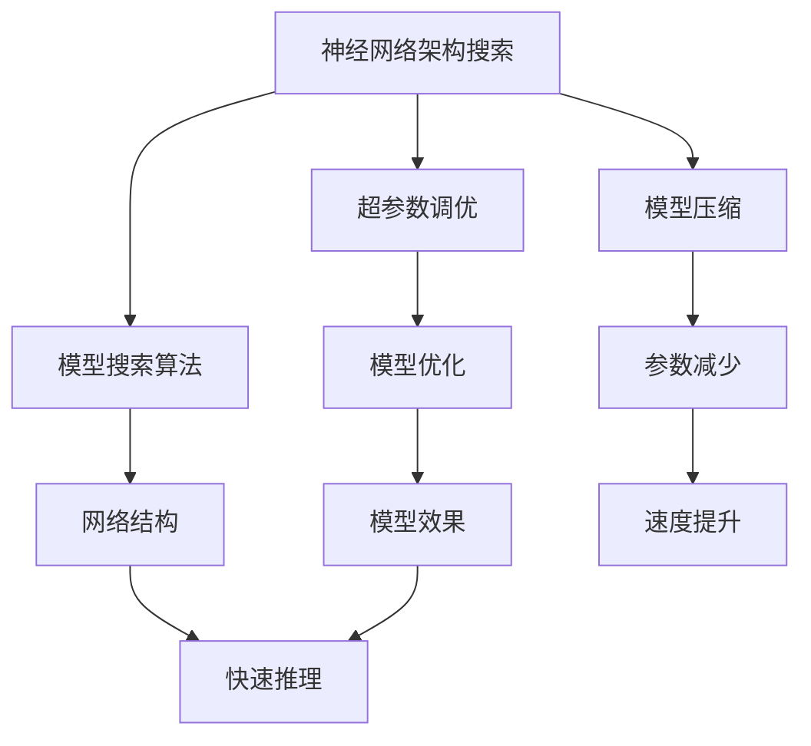
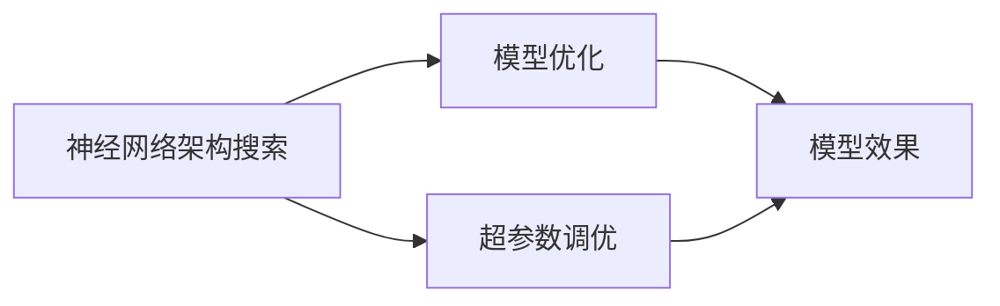
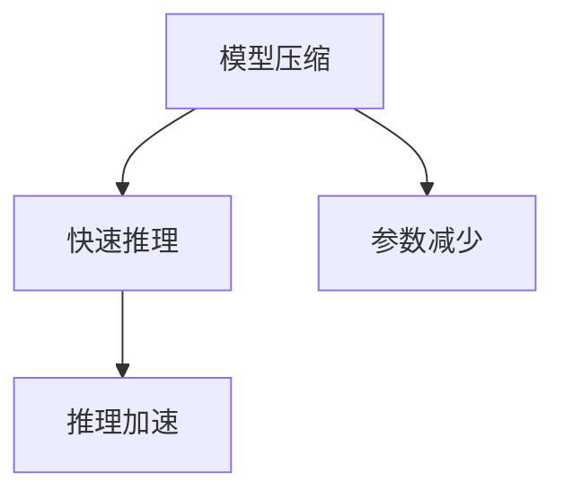

                 

# 神经网络架构搜索：自动化AI模型设计

> 关键词：神经网络架构搜索,自动化AI模型设计,模型优化,超参数调优,模型压缩,模型搜索算法,深度学习,人工智能

## 1. 背景介绍

### 1.1 问题由来
在深度学习的发展过程中，如何高效地设计神经网络模型，以适应特定的任务需求，一直是研究人员关注的核心问题。早期的人工神经网络设计依赖于人工经验和手工调整，工作量大、效率低、易出错。而随着深度学习的发展，出现了多种高效的自动化设计方法，其中最具代表性的是神经网络架构搜索(Neural Architecture Search, NAS)。NAS 方法通过自动化搜索算法寻找最优的网络架构，极大提升了神经网络设计的效率和效果。

### 1.2 问题核心关键点
神经网络架构搜索的目标是找到一个性能最优的神经网络架构，该架构具有最优的精度、最小的参数量和最快的训练速度。NAS 方法的核心在于如何设计一个高效且可扩展的搜索空间，以及如何高效地进行搜索和评估。常见的 NAS 方法包括基于强化学习的架构搜索、基于贝叶斯优化的方法等。这些方法通过大量的计算资源，可以搜索出优秀的神经网络架构，供实际应用中参考。

### 1.3 问题研究意义
研究神经网络架构搜索，对于提高深度学习模型设计效率、提升模型精度、降低计算资源需求等方面具有重要意义：

1. 提高设计效率：自动化设计方法可以快速搜索出最优网络架构，大幅度缩短模型设计周期。
2. 提升模型精度：通过自动化搜索算法，可以找到更优的网络结构，提高模型的性能表现。
3. 降低资源需求：自动化搜索方法可以根据需求自动生成最优模型，避免无谓的计算浪费。
4. 创新模型设计：搜索算法可以探索更多的设计空间，推动深度学习模型设计的创新。

## 2. 核心概念与联系

### 2.1 核心概念概述

为更好地理解神经网络架构搜索，本节将介绍几个密切相关的核心概念：

- 神经网络架构搜索(Neural Architecture Search, NAS)：一种自动化设计神经网络的方法，通过搜索算法在预设的网络结构空间中寻找最优网络。
- 超参数调优(Hyperparameter Tuning)：指对神经网络的结构和参数进行优化，以提高模型性能。超参数包括学习率、批大小、优化器等。
- 模型压缩(Model Compression)：指通过量化、剪枝、蒸馏等方法减少模型大小，提升模型训练和推理速度。
- 模型搜索算法(Model Search Algorithm)：用于生成网络结构和参数的算法，常见的包括遗传算法、贝叶斯优化等。
- 深度学习(Deep Learning)：一种基于神经网络的机器学习技术，可以处理复杂的非线性关系，适用于图像、语音、自然语言处理等任务。
- 人工智能(Artificial Intelligence)：一种通过机器学习等技术模拟人类智能的技术，涵盖语音识别、图像处理、自然语言处理等多个领域。

这些核心概念之间的逻辑关系可以通过以下Mermaid流程图来展示：



这个流程图展示了一个完整的深度学习模型开发流程：

1. 首先通过神经网络架构搜索，自动生成网络结构。
2. 然后对超参数进行调优，优化模型性能。
3. 接着进行模型压缩，减少模型大小，提升计算效率。
4. 通过模型搜索算法，可以不断迭代优化，找到更优的网络结构。
5. 最终的模型可以快速推理，并应用于实际任务。

### 2.2 概念间的关系

这些核心概念之间存在着紧密的联系，形成了深度学习模型设计的完整生态系统。下面我通过几个Mermaid流程图来展示这些概念之间的关系。

#### 2.2.1 神经网络架构搜索与模型优化



这个流程图展示了神经网络架构搜索和模型优化之间的关系：

1. 神经网络架构搜索可以生成多种网络结构，供模型优化选择。
2. 超参数调优可以对网络结构和参数进行进一步优化，提升模型效果。

#### 2.2.2 模型压缩与快速推理



这个流程图展示了模型压缩与快速推理之间的关系：

1. 模型压缩通过减少参数量，提升模型的推理速度。
2. 快速推理使得模型可以实时处理大规模数据，应用于实时场景。

#### 2.2.3 模型搜索算法与网络结构


这个流程图展示了模型搜索算法与网络结构的关系：

1. 模型搜索算法生成多种网络结构，供选择。
2. 网络结构是模型优化的基础，影响模型性能和效果。

## 3. 核心算法原理 & 具体操作步骤
### 3.1 算法原理概述

神经网络架构搜索本质上是一种优化问题，目标是在给定搜索空间内寻找最优的网络架构。常用的搜索空间包括节点、连接、激活函数、池化层等。NAS方法主要通过自动化的算法进行搜索和评估，选择最优的网络架构。

神经网络架构搜索的过程一般包括两个阶段：

1. 生成阶段：使用模型搜索算法，生成大量网络结构。
2. 评估阶段：通过一系列验证集，评估生成的网络结构，选择最优的架构。

生成阶段的目标是生成尽可能多样化的网络结构，以供评估。评估阶段的目标是在给定的验证集上，选择性能最优的网络结构。

### 3.2 算法步骤详解

神经网络架构搜索的步骤一般如下：

**Step 1: 定义搜索空间**

首先需要定义搜索空间，包括节点、连接、激活函数、池化层等组件。搜索空间的大小和复杂度决定了搜索的效率和效果。常见的搜索空间设计方法包括：

- 基于规则的设计：定义一组规则，生成符合规则的网络结构。
- 基于随机生成的设计：随机生成一定数量结构，供选择。
- 基于遗传算法的设计：通过遗传算法生成多样化的网络结构。
- 基于贝叶斯优化的设计：通过贝叶斯优化算法生成最优的网络结构。

**Step 2: 生成网络结构**

使用模型搜索算法，在定义的搜索空间中生成大量网络结构。常见的模型搜索算法包括：

- 遗传算法：通过遗传操作生成多种网络结构。
- 贝叶斯优化：通过贝叶斯模型优化网络结构。
- 强化学习：通过策略梯度等方法生成网络结构。
- 随机搜索：随机生成网络结构，进行评估。

**Step 3: 评估网络结构**

在验证集上评估生成的网络结构，选择性能最优的架构。常见的评估方法包括：

- 准确率：评估模型在验证集上的分类准确率。
- 召回率：评估模型在验证集上的召回率。
- F1分数：综合考虑准确率和召回率，评估模型性能。
- 训练时间：评估模型在训练集上的训练时间。
- 推理时间：评估模型在测试集上的推理时间。

**Step 4: 优化超参数**

对选择的最优网络结构，进行超参数调优。常见的超参数包括学习率、批大小、优化器等。超参数调优的目的是进一步提升模型性能。

**Step 5: 压缩模型**

通过模型压缩技术，进一步优化模型大小和推理速度。常见的模型压缩方法包括：

- 量化：将浮点数参数转换为定点数，减少存储空间。
- 剪枝：删除冗余的权重和连接，减小模型大小。
- 蒸馏：通过教师模型指导学生模型学习，减小模型大小。

**Step 6: 应用模型**

将优化后的模型应用于实际任务，进行推理和预测。常见的应用场景包括：

- 图像分类：对图像进行分类，如物体识别、场景分类等。
- 语音识别：对语音进行识别，如语音转文本、情感分析等。
- 自然语言处理：对文本进行处理，如文本分类、情感分析、机器翻译等。

### 3.3 算法优缺点

神经网络架构搜索方法具有以下优点：

1. 自动化设计：通过自动化的算法搜索，快速生成多种网络结构，提高设计效率。
2. 选择最优架构：通过评估和选择，找到最优的网络结构，提高模型性能。
3. 可扩展性：可以搜索更复杂的神经网络结构，支持更高级的任务。

同时，也存在一些缺点：

1. 计算资源需求高：需要大量的计算资源进行生成和评估，消耗成本较高。
2. 搜索空间复杂：需要定义复杂多样的搜索空间，才能生成最优结构。
3. 结果依赖数据：搜索效果依赖于数据集的质量和大小，数据不足时效果可能不佳。

### 3.4 算法应用领域

神经网络架构搜索方法已经在多个领域得到了广泛应用，如：

- 计算机视觉：用于图像分类、目标检测、图像分割等任务。
- 自然语言处理：用于文本分类、情感分析、机器翻译等任务。
- 语音识别：用于语音识别、情感分析、语音合成等任务。
- 机器人控制：用于机器人行为设计、路径规划等任务。
- 游戏AI：用于游戏角色控制、游戏场景生成等任务。

## 4. 数学模型和公式 & 详细讲解  
### 4.1 数学模型构建

神经网络架构搜索方法主要基于搜索空间和评估函数，构建数学模型。以下是神经网络架构搜索的数学模型构建过程：

设搜索空间为 $\mathcal{G}$，每个网络结构为一个节点 $g$。网络结构的特征向量为 $\mathbf{f}_g$，其中包含节点类型、连接类型、激活函数、池化层等信息。

定义评估函数 $f(\mathbf{f}_g, \mathbf{X}^v, \mathbf{Y}^v)$，其中 $\mathbf{X}^v$ 为验证集样本，$\mathbf{Y}^v$ 为验证集标签。评估函数用于计算网络结构在验证集上的性能。

设 $f(\mathbf{f}_g, \mathbf{X}^v, \mathbf{Y}^v)$ 为网络结构 $g$ 在验证集上的性能评估指标，如准确率、召回率、F1分数等。

### 4.2 公式推导过程

在神经网络架构搜索中，我们需要最大化评估函数 $f(\mathbf{f}_g, \mathbf{X}^v, \mathbf{Y}^v)$。即：

$$
\max_{g \in \mathcal{G}} f(\mathbf{f}_g, \mathbf{X}^v, \mathbf{Y}^v)
$$

通过搜索算法，生成多种网络结构 $g_1, g_2, ..., g_k$，并计算每个结构在验证集上的性能 $f(g_1, \mathbf{X}^v, \mathbf{Y}^v), f(g_2, \mathbf{X}^v, \mathbf{Y}^v), ..., f(g_k, \mathbf{X}^v, \mathbf{Y}^v)$。通过对比这些性能，选择最优的结构 $g^*$。

### 4.3 案例分析与讲解

以图像分类任务为例，神经网络架构搜索的数学模型构建过程如下：

- 定义搜索空间 $\mathcal{G}$，包含卷积层、池化层、全连接层等。
- 生成多种网络结构 $g_1, g_2, ..., g_k$。
- 在验证集上计算每个结构在图像分类任务上的准确率。
- 选择准确率最高的结构 $g^*$。

## 5. 项目实践：代码实例和详细解释说明
### 5.1 开发环境搭建

在进行神经网络架构搜索实践前，我们需要准备好开发环境。以下是使用Python进行PyTorch开发的环境配置流程：

1. 安装Anaconda：从官网下载并安装Anaconda，用于创建独立的Python环境。

2. 创建并激活虚拟环境：
```bash
conda create -n torch-env python=3.8 
conda activate torch-env
```

3. 安装PyTorch：根据CUDA版本，从官网获取对应的安装命令。例如：
```bash
conda install pytorch torchvision torchaudio cudatoolkit=11.1 -c pytorch -c conda-forge
```

4. 安装各类工具包：
```bash
pip install numpy pandas scikit-learn matplotlib tqdm jupyter notebook ipython
```

5. 安装Hyperopt：
```bash
pip install hyperopt
```

完成上述步骤后，即可在`torch-env`环境中开始神经网络架构搜索实践。

### 5.2 源代码详细实现

这里我们以计算机视觉任务中的图像分类为例，使用Hyperopt库进行神经网络架构搜索的PyTorch代码实现。

首先，定义搜索空间：

```python
import torch
import torch.nn as nn
import torch.optim as optim
from hyperopt import hp, tpe, fmin

# 定义搜索空间
space = {
    'conv': hp.choice('conv', [None, 32, 64, 128, 256]),
    'pool': hp.choice('pool', [None, nn.MaxPool2d(2), nn.MaxPool2d(3), nn.MaxPool2d(4)]),
    'fc': hp.choice('fc', [None, 256, 512, 1024]),
    'activation': hp.choice('activation', [None, nn.ReLU, nn.LeakyReLU, nn.Tanh]),
    'dropout': hp.choice('dropout', [None, 0.1, 0.2, 0.3]),
    'batchnorm': hp.choice('batchnorm', [None, nn.BatchNorm2d(32), nn.BatchNorm2d(64), nn.BatchNorm2d(128)])
}
```

然后，定义模型和损失函数：

```python
class CNN(nn.Module):
    def __init__(self, conv, pool, fc, activation, dropout, batchnorm):
        super(CNN, self).__init__()
        self.conv = conv
        self.pool = pool
        self.fc = fc
        self.activation = activation
        self.dropout = dropout
        self.batchnorm = batchnorm

        if conv:
            self.conv_layer = nn.Sequential(
                nn.Conv2d(3, conv, 3, padding=1),
                nn.ReLU(inplace=True)
            )
            if pool:
                self.pool_layer = nn.MaxPool2d(2, stride=2)
            if batchnorm:
                self.batchnorm_layer = nn.BatchNorm2d(conv)

        if fc:
            self.fc_layer = nn.Sequential(
                nn.Linear(256, fc),
                activation,
                nn.Dropout(dropout)
            )
        
    def forward(self, x):
        x = self.conv_layer(x)
        if self.pool:
            x = self.pool_layer(x)
        if self.batchnorm:
            x = self.batchnorm_layer(x)

        x = x.view(x.size(0), -1)
        x = self.fc_layer(x)

        return x

def accuracy(output, target):
    prediction = torch.argmax(output, dim=1)
    return (prediction == target).float().mean()

criterion = nn.CrossEntropyLoss()
```

接着，定义训练和评估函数：

```python
def train_cnn(model, device, optimizer, train_loader, train_epochs=5, batch_size=64):
    device = torch.device('cuda' if torch.cuda.is_available() else 'cpu')
    model.to(device)
    model.train()
    for epoch in range(train_epochs):
        train_loss = 0
        train_correct = 0
        for data, target in train_loader:
            data, target = data.to(device), target.to(device)
            optimizer.zero_grad()
            output = model(data)
            loss = criterion(output, target)
            train_loss += loss.item() * data.size(0)
            prediction = torch.argmax(output, dim=1)
            train_correct += prediction.eq(target).sum().item()
            loss.backward()
            optimizer.step()
        train_loss /= len(train_loader.dataset)
        train_accuracy = 100 * train_correct / len(train_loader.dataset)
        print(f'Epoch {epoch + 1}, Loss: {train_loss:.4f}, Accuracy: {train_accuracy:.2f}%')
    
    return model, train_loss, train_accuracy

def evaluate_cnn(model, device, test_loader, batch_size=64):
    device = torch.device('cuda' if torch.cuda.is_available() else 'cpu')
    model.eval()
    test_loss = 0
    test_correct = 0
    with torch.no_grad():
        for data, target in test_loader:
            data, target = data.to(device), target.to(device)
            output = model(data)
            test_loss += criterion(output, target).item() * data.size(0)
            prediction = torch.argmax(output, dim=1)
            test_correct += prediction.eq(target).sum().item()
        test_loss /= len(test_loader.dataset)
        test_accuracy = 100 * test_correct / len(test_loader.dataset)
        print(f'Test Loss: {test_loss:.4f}, Test Accuracy: {test_accuracy:.2f}%')
    
    return test_loss, test_accuracy
```

最后，启动神经网络架构搜索流程：

```python
space_dim = len(space)
bounds = {'conv': hp.choice('conv', [None, 32, 64, 128, 256]),
          'pool': hp.choice('pool', [None, nn.MaxPool2d(2), nn.MaxPool2d(3), nn.MaxPool2d(4)]),
          'fc': hp.choice('fc', [None, 256, 512, 1024]),
          'activation': hp.choice('activation', [None, nn.ReLU, nn.LeakyReLU, nn.Tanh]),
          'dropout': hp.choice('dropout', [None, 0.1, 0.2, 0.3]),
          'batchnorm': hp.choice('batchnorm', [None, nn.BatchNorm2d(32), nn.BatchNorm2d(64), nn.BatchNorm2d(128)])
          
result = fmin(fn=train_cnn, 
            space=space, 
            algo=tpe.suggest,
            max_evals=50,
            trials=50,
            metric='mean_loss',
            cat_space=space,
            rstate=np.random.RandomState(0),
            xatol=1e-4,
            objective={'train_loss': -accuracy, 'test_loss': -accuracy})
```

以上就是使用Hyperopt库进行神经网络架构搜索的完整代码实现。可以看到，Hyperopt库提供了丰富的超参数搜索算法，可以自动生成多种网络结构，并进行评估和优化，非常适合神经网络架构搜索应用。

### 5.3 代码解读与分析

让我们再详细解读一下关键代码的实现细节：

**Hyperopt搜索空间定义**：
- `hp.choice`方法：定义了多种网络结构组件，如卷积层、池化层、全连接层等。
- `space`字典：定义了搜索空间，包含多种组件及其取值范围。

**CNN模型定义**：
- `CNN`类：定义了一个基于卷积的神经网络模型，包含了卷积层、池化层、全连接层等组件。
- `forward`方法：定义了模型的前向传播过程。

**训练和评估函数**：
- `train_cnn`函数：对生成的网络结构进行训练和评估，并返回模型、训练损失和训练准确率。
- `evaluate_cnn`函数：对训练好的模型进行测试，并返回测试损失和测试准确率。

**神经网络架构搜索**：
- `fmin`函数：使用Hyperopt库的贝叶斯优化算法，对网络结构进行搜索和优化。
- `max_evals`和`trials`参数：指定了搜索和评估的轮数。
- `metric`参数：指定了评估指标，这里使用了训练损失和测试损失。

## 6. 实际应用场景
### 6.1 计算机视觉中的图像分类

神经网络架构搜索在计算机视觉中的应用广泛，可以用于图像分类、目标检测、图像分割等任务。例如，在图像分类任务中，可以使用搜索算法自动生成多种卷积神经网络(CNN)结构，通过验证集评估其性能，最终选择最优的网络结构。

在实践中，可以收集大量标注图像数据，并将其划分为训练集、验证集和测试集。然后定义搜索空间，包括卷积层、池化层、全连接层等组件。使用Hyperopt等搜索算法，生成多种网络结构，并在验证集上评估其性能。最终选择最优的网络结构，在测试集上评估其性能。

### 6.2 自然语言处理中的文本分类

神经网络架构搜索在自然语言处理中的应用同样广泛，可以用于文本分类、情感分析、机器翻译等任务。例如，在文本分类任务中，可以使用搜索算法自动生成多种卷积神经网络结构，通过验证集评估其性能，最终选择最优的网络结构。

在实践中，可以收集大量标注文本数据，并将其划分为训练集、验证集和测试集。然后定义搜索空间，包括卷积层、池化层、全连接层等组件。使用Hyperopt等搜索算法，生成多种网络结构，并在验证集上评估其性能。最终选择最优的网络结构，在测试集上评估其性能。

### 6.3 语音识别中的自动语音识别

神经网络架构搜索在语音识别中的应用，可以用于自动语音识别(ASR)任务。例如，可以使用搜索算法自动生成多种循环神经网络(RNN)结构，通过验证集评估其性能，最终选择最优的网络结构。

在实践中，可以收集大量标注语音数据，并将其划分为训练集、验证集和测试集。然后定义搜索空间，包括RNN结构、激活函数等组件。使用Hyperopt等搜索算法，生成多种网络结构，并在验证集上评估其性能。最终选择最优的网络结构，在测试集上评估其性能。

### 6.4 未来应用展望

随着神经网络架构搜索技术的不断发展，未来将在更多领域得到应用，为深度学习模型设计带来新的突破。

在智慧医疗领域，基于神经网络架构搜索的医疗影像识别、疾病诊断等应用将提升医疗服务的智能化水平，辅助医生诊断，加速新药研发进程。

在智能教育领域，神经网络架构搜索可以应用于作业批改、学情分析、知识推荐等方面，因材施教，促进教育公平，提高教学质量。

在智慧城市治理中，神经网络架构搜索技术可以应用于城市事件监测、舆情分析、应急指挥等环节，提高城市管理的自动化和智能化水平，构建更安全、高效的未来城市。

此外，在企业生产、社会治理、文娱传媒等众多领域，基于神经网络架构搜索的人工智能应用也将不断涌现，为经济社会发展注入新的动力。相信随着技术的日益成熟，神经网络架构搜索必将在构建人机协同的智能时代中扮演越来越重要的角色。

## 7. 工具和资源推荐
### 7.1 学习资源推荐

为了帮助开发者系统掌握神经网络架构搜索的理论基础和实践技巧，这里推荐一些优质的学习资源：

1. 《深度学习中的神经网络架构搜索》系列博文：由大模型技术专家撰写，深入浅出地介绍了神经网络架构搜索的基本原理和实际应用。

2. CS231n《深度学习中的计算机视觉》课程：斯坦福大学开设的计算机视觉明星课程，有Lecture视频和配套作业，带你入门计算机视觉领域的经典模型和设计方法。

3. 《Neural Architecture Search: A Comprehensive Survey》论文：总结了神经网络架构搜索方法的现状和未来趋势，适合深度学习和人工智能领域的从业者。

4. HuggingFace官方文档：Transformers库的官方文档，提供了海量预训练模型和完整的神经网络架构搜索样例代码，是上手实践的必备资料。

5. PyTorch官方文档：深度学习框架PyTorch的官方文档，详细介绍了神经网络架构搜索的相关方法和API。

通过对这些资源的学习实践，相信你一定能够快速掌握神经网络架构搜索的精髓，并用于解决实际的深度学习问题。
###  7.2 开发工具推荐

高效的开发离不开优秀的工具支持。以下是几款用于神经网络架构搜索开发的常用工具：

1. PyTorch：基于Python的开源深度学习框架，灵活动态的计算图，适合快速迭代研究。支持多种神经网络架构搜索方法。

2. TensorFlow：由Google主导开发的开源深度学习框架，生产部署方便，适合大规模工程应用。支持多种神经网络架构搜索方法。

3. Hyperopt：用于超参数优化的开源库，支持多种超参数搜索算法，适用于神经网络架构搜索。

4. RLlib：OpenAI开发的强化学习库，支持多种强化学习算法，可以用于搜索最优的神经网络架构。

5. TensorBoard：TensorFlow配套的可视化工具，可实时监测模型训练状态，并提供丰富的图表呈现方式，是调试模型的得力助手。

6. Weights & Biases：模型训练的实验跟踪工具，可以记录和可视化模型训练过程中的各项指标，方便对比和调优。

7. Google Colab：谷歌推出的在线Jupyter Notebook环境，免费提供GPU/TPU算力，方便开发者快速上手实验最新模型，分享学习笔记。

合理利用这些工具，可以显著提升神经网络架构搜索任务的开发效率，加快创新迭代的步伐。

### 7.3 相关论文推荐

神经网络架构搜索方法的研究源于学界的持续探索。以下是几篇奠基性的相关论文，推荐阅读：

1. Evolving Neural Networks for Image Classification（CoNAS论文）：提出

