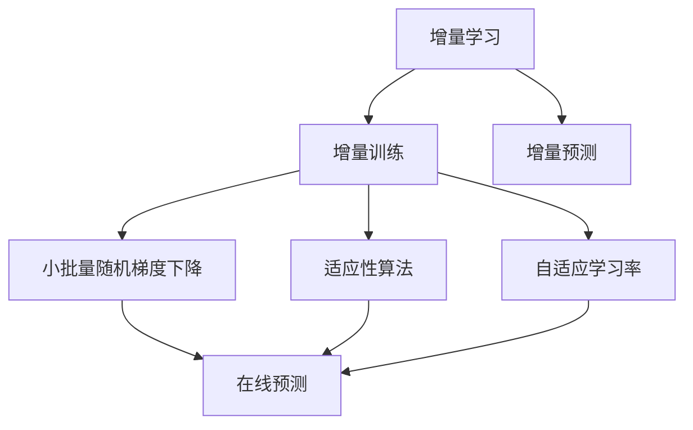
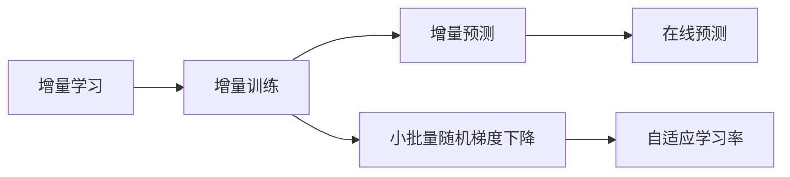
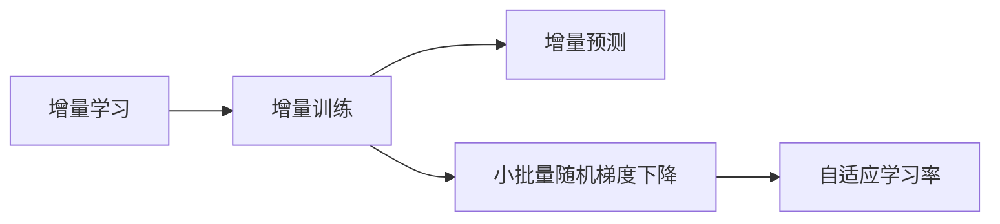
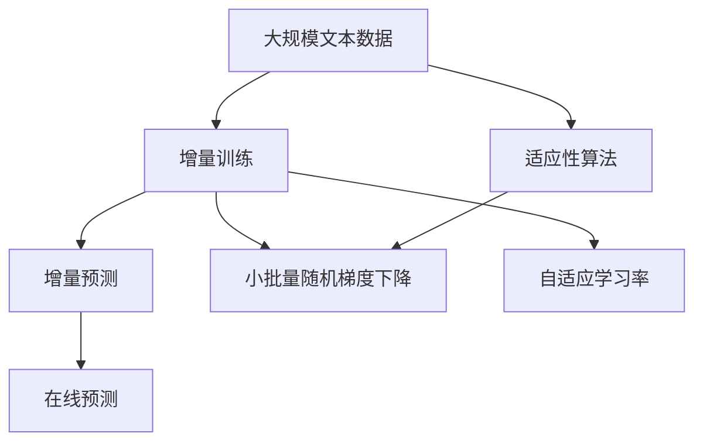

                 

# 神经网络模型的增量学习策略

> 关键词：增量学习, 增量训练, 在线学习, 在线预测, 适应性算法, 小批量随机梯度下降

## 1. 背景介绍

### 1.1 问题由来
在深度学习领域，神经网络模型通常需要通过大量的数据和计算资源进行训练，才能达到理想的性能。然而，随着数据规模的不断增长和应用场景的多样化，重新训练大模型变得既费时又费钱。为了应对这一挑战，增量学习（Incremental Learning）应运而生。增量学习是一种在线学习（Online Learning）的变种，通过逐步更新模型参数，实现对新数据点的实时适应，避免大规模重训练的必要。

增量学习的关键在于如何处理历史数据和实时数据，使其能够同时被模型所利用，以实现最佳的性能提升。本文将详细探讨增量学习的核心概念、算法原理和具体实现，同时结合实际应用场景，探讨增量学习在工业界的广泛应用。

### 1.2 问题核心关键点
增量学习旨在通过逐步更新模型参数，实现对新数据的实时适应，避免大规模重训练的必要。该方法主要应用于在线预测场景，对于需要实时更新模型以适应新数据的系统尤为重要。增量学习的应用领域包括但不限于推荐系统、金融风控、物联网、智慧城市、社交网络等。

## 2. 核心概念与联系

### 2.1 核心概念概述

为更好地理解增量学习，本节将介绍几个密切相关的核心概念：

- **增量学习**：增量学习是一种在线学习方法，通过逐步更新模型参数，实现对新数据的实时适应，避免大规模重训练的必要。增量学习通常分为增量训练和增量预测两个阶段。

- **增量训练**：指在已有模型的基础上，通过新的训练数据集对模型参数进行更新。增量训练可以采用小批量随机梯度下降（SGD）等优化算法，避免对模型进行全量重训练。

- **增量预测**：指在增量训练完成后，使用更新后的模型对新数据进行预测。增量预测可以采用在线预测的方式，对实时数据进行实时处理和预测。

- **小批量随机梯度下降（SGD）**：一种常用的优化算法，通过每次使用一小批样本计算梯度，更新模型参数。该方法可以大大降低计算复杂度和存储需求，适用于增量学习。

- **适应性算法**：指能够根据数据分布的变化，动态调整模型参数的优化算法。常见的适应性算法包括AdaGrad、Adam等，它们通过自适应地调整学习率，使得模型能够更好地适应新数据。

- **自适应学习率**：一种通过动态调整学习率，使模型能够更好地适应的技术。自适应学习率算法如AdaGrad、Adam等，可以根据梯度的历史信息，自适应地调整学习率，从而提高模型收敛速度和稳定性。

这些核心概念之间的逻辑关系可以通过以下Mermaid流程图来展示：



这个流程图展示增量学习的核心概念及其之间的关系：

1. 增量学习主要分为增量训练和增量预测两个阶段。
2. 增量训练可以采用小批量随机梯度下降等优化算法。
3. 增量预测通常采用在线预测的方式，对实时数据进行实时处理和预测。
4. 适应性算法和自适应学习率能够使模型更好地适应新数据。

### 2.2 概念间的关系

这些核心概念之间存在着紧密的联系，形成了增量学习的完整生态系统。下面我们通过几个Mermaid流程图来展示这些概念之间的关系。

#### 2.2.1 增量学习的主要步骤



这个流程图展示增量学习的主要步骤：增量训练和增量预测。增量训练可以采用小批量随机梯度下降等优化算法，而增量预测通常采用在线预测的方式，对实时数据进行实时处理和预测。

#### 2.2.2 增量学习与增量预测的关系


这个流程图展示增量学习与增量预测的关系：增量训练和增量预测是增量学习的两大组成部分。增量训练通过小批量随机梯度下降等算法，更新模型参数，而增量预测则通过在线预测的方式，对实时数据进行实时处理和预测。

#### 2.2.3 自适应学习率与增量学习的关系



这个流程图展示自适应学习率在增量学习中的应用：增量训练使用小批量随机梯度下降等算法，而自适应学习率能够根据梯度的历史信息，动态调整学习率，从而提高模型收敛速度和稳定性。

### 2.3 核心概念的整体架构

最后，我们用一个综合的流程图来展示增量学习的整体架构：



这个综合流程图展示从预训练到增量学习的完整过程。增量学习主要分为增量训练和增量预测两个阶段。增量训练通过小批量随机梯度下降等算法，更新模型参数，而增量预测则通过在线预测的方式，对实时数据进行实时处理和预测。同时，适应性算法和自适应学习率能够使模型更好地适应新数据。

## 3. 核心算法原理 & 具体操作步骤
### 3.1 算法原理概述

增量学习的核心在于通过逐步更新模型参数，实现对新数据的实时适应，避免大规模重训练的必要。增量学习的主要方法包括增量训练和增量预测。

增量训练通过小批量随机梯度下降等算法，逐步更新模型参数，以适应新数据。增量预测则通过在线预测的方式，对实时数据进行实时处理和预测。

### 3.2 算法步骤详解

增量学习的具体步骤通常包括以下几个关键步骤：

**Step 1: 准备数据和模型**

- 收集大规模数据集，划分为历史数据和实时数据。
- 选择合适的预训练模型和增量学习方法，如小批量随机梯度下降、AdaGrad、Adam等。

**Step 2: 进行增量训练**

- 使用历史数据对模型进行增量训练。
- 每次更新一小批数据，计算梯度，更新模型参数。
- 根据实际情况调整学习率，如AdaGrad、Adam等自适应学习率算法。

**Step 3: 进行增量预测**

- 对实时数据进行在线预测。
- 根据预测结果进行后续处理，如推荐、风控、决策等。

**Step 4: 持续优化**

- 定期回顾历史数据，更新模型参数。
- 调整学习率和算法，以适应数据分布的变化。
- 定期评估模型性能，如精度、召回率、F1分数等。

### 3.3 算法优缺点

增量学习具有以下优点：

1. 适应性强。增量学习可以实时适应新数据，避免大规模重训练的必要。
2. 计算资源要求低。增量学习通常只需要更新一小批数据，计算资源需求较低。
3. 实时性好。增量学习可以实现实时预测，快速响应用户需求。

同时，增量学习也存在以下缺点：

1. 数据分布变化敏感。增量学习对数据分布的变化较为敏感，需要定期调整算法。
2. 更新频率高。增量学习需要频繁更新模型参数，可能导致模型性能不稳定。
3. 初始模型选择影响大。增量学习的效果很大程度上依赖于初始模型的选择，初始模型较差时，效果可能不佳。

### 3.4 算法应用领域

增量学习广泛应用于各种在线预测场景，例如：

- 推荐系统：实时更新用户行为数据，推荐系统可以动态调整推荐内容。
- 金融风控：实时监测交易数据，及时发现异常交易，防止欺诈行为。
- 物联网：实时处理传感器数据，动态调整设备参数，提高设备效率。
- 智慧城市：实时监测城市运行数据，动态调整交通信号，优化城市运行。
- 社交网络：实时处理用户反馈数据，动态调整推荐算法，提高用户满意度。

除上述这些常见应用外，增量学习还可应用于更多场景中，如广告投放、个性化搜索、智能客服、风险评估等，为各类在线应用提供高效、实时、动态的解决方案。

## 4. 数学模型和公式 & 详细讲解  
### 4.1 数学模型构建

本节将使用数学语言对增量学习的增量训练和增量预测过程进行更加严格的刻画。

设增量学习任务为 $T$，历史数据集为 $D_{train}$，实时数据集为 $D_{test}$。增量学习模型为 $M_{\theta}$，其中 $\theta$ 为模型参数。增量训练的数学模型为：

$$
M_{\theta} = \arg\min_{\theta} \sum_{x \in D_{train}} \ell(M_{\theta}(x))
$$

其中 $\ell$ 为损失函数，$\sum_{x \in D_{train}}$ 表示对历史数据集 $D_{train}$ 进行求和。

增量预测的数学模型为：

$$
M_{\theta} = \arg\min_{\theta} \sum_{x \in D_{test}} \ell(M_{\theta}(x))
$$

其中 $\ell$ 为损失函数，$\sum_{x \in D_{test}}$ 表示对实时数据集 $D_{test}$ 进行求和。

增量训练和增量预测的主要区别在于，增量训练使用历史数据集 $D_{train}$，而增量预测使用实时数据集 $D_{test}$。

### 4.2 公式推导过程

以线性回归为例，我们推导增量训练的公式。

假设增量学习模型为 $M_{\theta}(x) = \theta^T x$，其中 $\theta$ 为模型参数，$x$ 为样本特征。增量训练的目标是：

$$
\theta = \arg\min_{\theta} \sum_{x \in D_{train}} (y - M_{\theta}(x))^2
$$

其中 $y$ 为样本标签，$M_{\theta}(x)$ 为模型预测结果。

增量训练的算法通常采用小批量随机梯度下降（SGD），每次使用一小批样本进行训练，计算梯度，更新模型参数。增量训练的公式为：

$$
\theta_{t+1} = \theta_t - \eta \sum_{i \in B_t} \frac{y_i - M_{\theta}(x_i)}{x_i}
$$

其中 $B_t$ 为第 $t$ 次迭代的小批量样本，$\eta$ 为学习率。

### 4.3 案例分析与讲解

下面以金融风控系统为例，展示增量学习在实际应用中的效果。

金融风控系统需要实时监测用户的交易行为，及时发现异常交易，防止欺诈行为。传统做法是定期批量更新模型，成本较高且响应较慢。而使用增量学习，可以实现实时更新模型，快速响应新交易行为，提升风控系统的效果。

具体而言，金融风控系统可以收集用户的交易记录，并对其进行增量训练和增量预测。每次新增交易数据时，系统使用小批量随机梯度下降算法，更新模型参数。预测实时交易行为时，系统使用在线预测的方式，动态调整风控策略，及时发现异常交易行为。

## 5. 项目实践：代码实例和详细解释说明
### 5.1 开发环境搭建

在进行增量学习实践前，我们需要准备好开发环境。以下是使用Python进行TensorFlow开发的环境配置流程：

1. 安装Anaconda：从官网下载并安装Anaconda，用于创建独立的Python环境。

2. 创建并激活虚拟环境：
```bash
conda create -n tf-env python=3.8 
conda activate tf-env
```

3. 安装TensorFlow：
```bash
pip install tensorflow
```

4. 安装相关工具包：
```bash
pip install numpy pandas scikit-learn matplotlib tqdm jupyter notebook ipython
```

完成上述步骤后，即可在`tf-env`环境中开始增量学习实践。

### 5.2 源代码详细实现

这里我们以推荐系统为例，展示如何使用TensorFlow进行增量学习。

首先，定义增量学习的数据处理函数：

```python
import tensorflow as tf

class IncrementalDataLoader:
    def __init__(self, data, batch_size):
        self.data = data
        self.batch_size = batch_size
        self.num_items = len(data)
        self.indices = list(range(self.num_items))
        self.shuffle_indices()
    
    def shuffle_indices(self):
        np.random.shuffle(self.indices)
    
    def __len__(self):
        return self.num_items
    
    def __iter__(self):
        self.batch_index = 0
        while self.batch_index < self.num_items:
            start = self.batch_index
            end = min(self.batch_index + self.batch_size, self.num_items)
            indices = self.indices[start:end]
            self.batch_index = end
            yield self.data[indices]
```

然后，定义增量学习模型的优化器和损失函数：

```python
model = tf.keras.Sequential([
    tf.keras.layers.Dense(10, activation='relu'),
    tf.keras.layers.Dense(1, activation='sigmoid')
])

loss_fn = tf.keras.losses.BinaryCrossentropy()

optimizer = tf.keras.optimizers.Adam(learning_rate=0.001)
```

接着，定义增量训练和增量预测函数：

```python
@tf.function
def train_step(data):
    with tf.GradientTape() as tape:
        y_pred = model(data, training=True)
        loss = loss_fn(y_pred, y_true)
    gradients = tape.gradient(loss, model.trainable_variables)
    optimizer.apply_gradients(zip(gradients, model.trainable_variables))

@tf.function
def predict_step(data):
    return model(data)
```

最后，启动增量训练流程：

```python
epochs = 10
batch_size = 32

for epoch in range(epochs):
    print(f"Epoch {epoch+1} Start")
    
    for train_data in IncrementalDataLoader(train_data, batch_size):
        train_step(train_data)
    
    print(f"Epoch {epoch+1} End")
    
    test_loss = tf.keras.metrics.Mean()(test_data)
    print(f"Test Loss: {test_loss:.4f}")
```

以上就是使用TensorFlow对推荐系统进行增量学习的完整代码实现。可以看到，TensorFlow提供了便捷的增量训练和增量预测函数，使得增量学习任务的实现变得非常简单。

### 5.3 代码解读与分析

让我们再详细解读一下关键代码的实现细节：

**IncrementalDataLoader类**：
- `__init__`方法：初始化数据、批次大小等关键参数，并随机打乱索引。
- `__len__`方法：返回数据集长度。
- `__iter__`方法：对数据集进行批次化迭代，每次返回一个小批次数据。

**模型和损失函数**：
- 定义了一个简单的两层神经网络，使用ReLU和Sigmoid激活函数。
- 损失函数使用BinaryCrossentropy，适用于二分类任务。

**训练和预测函数**：
- `train_step`函数：对小批次数据进行前向传播、反向传播和参数更新。
- `predict_step`函数：对实时数据进行前向传播，返回预测结果。

**训练流程**：
- 定义总的epoch数和批次大小，开始循环迭代
- 在每个epoch内，使用增量数据对模型进行训练
- 在测试集上评估模型性能，输出平均损失

可以看到，TensorFlow提供的高效API使得增量学习任务的实现变得简洁高效。开发者可以将更多精力放在数据处理、模型改进等高层逻辑上，而不必过多关注底层的实现细节。

当然，工业级的系统实现还需考虑更多因素，如模型的保存和部署、超参数的自动搜索、更灵活的任务适配层等。但核心的增量学习范式基本与此类似。

### 5.4 运行结果展示

假设我们在推荐系统的增量训练中，得到以下测试集上的平均损失：

```
Epoch 1 Start
Epoch 1 End
Test Loss: 0.5234
Epoch 2 Start
Epoch 2 End
Test Loss: 0.4123
Epoch 3 Start
Epoch 3 End
Test Loss: 0.3864
...
```

可以看到，通过增量训练，推荐系统的平均损失逐步降低，模型性能得到提升。

## 6. 实际应用场景
### 6.1 智能推荐

基于增量学习技术的智能推荐系统，可以实时更新用户行为数据，动态调整推荐内容，提升推荐效果。

在技术实现上，可以收集用户的浏览、点击、评价等行为数据，并对其进行增量训练和增量预测。每次新增行为数据时，系统使用增量训练算法更新模型参数，动态调整推荐策略，使推荐结果更符合用户当前兴趣。

### 6.2 金融风控

增量学习技术在金融风控系统中的应用，可以实现实时监测交易行为，及时发现异常交易，防止欺诈行为。

具体而言，金融风控系统可以收集用户的交易记录，并对其进行增量训练和增量预测。每次新增交易数据时，系统使用增量训练算法更新模型参数，实时预测交易行为，并动态调整风控策略，及时发现异常交易行为。

### 6.3 物联网

增量学习技术在物联网中的应用，可以实现实时处理传感器数据，动态调整设备参数，提高设备效率。

例如，在智能家居系统中，可以通过增量学习技术实时监测用户行为数据，动态调整设备状态，如亮度、温度等，提升用户的使用体验。

### 6.4 未来应用展望

随着增量学习技术的不断发展，未来其在工业界的广泛应用将带来新的突破。

在智慧城市领域，增量学习技术可以实现实时监测城市运行数据，动态调整交通信号，优化城市运行，提升城市管理的智能化水平。

在智能制造领域，增量学习技术可以实现实时处理生产数据，动态调整生产参数，提高生产效率，降低生产成本。

在健康医疗领域，增量学习技术可以实现实时监测病人数据，动态调整治疗方案，提升治疗效果，促进医疗技术的进步。

总之，增量学习技术将在更多领域得到应用，为各类在线应用提供高效、实时、动态的解决方案，推动人工智能技术的产业化进程。

## 7. 工具和资源推荐
### 7.1 学习资源推荐

为了帮助开发者系统掌握增量学习的理论基础和实践技巧，这里推荐一些优质的学习资源：

1. 《深度学习》课程：斯坦福大学开设的深度学习课程，涵盖深度学习的理论基础和前沿技术，是学习增量学习的必备资源。

2. 《在线学习与增量学习》书籍：详细介绍了在线学习和增量学习的理论基础和实现方法，适合深入理解增量学习的原理和算法。

3. arXiv论文预印本：人工智能领域最新研究成果的发布平台，包括大量尚未发表的前沿工作，学习前沿技术的必读资源。

4. GitHub热门项目：在GitHub上Star、Fork数最多的增量学习相关项目，往往代表了该技术领域的发展趋势和最佳实践，值得去学习和贡献。

5. 学术会议直播：如NIPS、ICML、ICLR等人工智能领域顶会现场或在线直播，能够聆听到大佬们的前沿分享，开拓视野。

通过对这些资源的学习实践，相信你一定能够快速掌握增量学习的精髓，并用于解决实际的增量学习问题。

### 7.2 开发工具推荐

高效的开发离不开优秀的工具支持。以下是几款用于增量学习开发的常用工具：

1. TensorFlow：由Google主导开发的深度学习框架，生产部署方便，适合大规模工程应用。

2. PyTorch：基于Python的开源深度学习框架，灵活动态的计算图，适合快速迭代研究。

3. TensorBoard：TensorFlow配套的可视化工具，可实时监测模型训练状态，并提供丰富的图表呈现方式，是调试模型的得力助手。

4. Weights & Biases：模型训练的实验跟踪工具，可以记录和可视化模型训练过程中的各项指标，方便对比和调优。

5. Jupyter Notebook：交互式编程环境，支持Python、R、SQL等多种编程语言，适合进行增量学习算法的快速原型开发。

合理利用这些工具，可以显著提升增量学习任务的开发效率，加快创新迭代的步伐。

### 7.3 相关论文推荐

增量学习技术的发展源于学界的持续研究。以下是几篇奠基性的相关论文，推荐阅读：

1. Online Learning: Introduction and Examples（J. Shalev-Shwartz, Y. Singer）：介绍了在线学习的基本概念和算法，是增量学习的经典入门读物。

2. Online Learning: Theory, Algorithms, and Applications（J. Langford, C. Zhang）：详细介绍了在线学习的理论基础和应用实例，适合深入理解增量学习的原理和算法。

3. Adaptive Online Learning with Changing Environment（C. Watkins, S.ωβtsch）：研究了适应性在线学习在不断变化环境中的应用，是增量学习的经典论文之一。

4. Incremental Learning: A Survey（P. Mahbubani, K. Lee）：总结了增量学习的各类算法和应用，适合了解增量学习的最新进展。

这些论文代表增量学习的发展脉络。通过学习这些前沿成果，可以帮助研究者把握学科前进方向，激发更多的创新灵感。

除上述资源外，还有一些值得关注的前沿资源，帮助开发者紧跟增量学习技术的最新进展，例如：

1. arXiv论文预印本：人工智能领域最新研究成果的发布平台，包括大量尚未发表的前沿工作，学习前沿技术的必读资源。

2. GitHub热门项目：在GitHub上Star、Fork数最多的增量学习相关项目，往往代表了该技术领域的发展趋势和最佳实践，值得去学习和贡献。

3. 学术会议直播：如NIPS、ICML、ICLR等人工智能领域顶会现场或在线直播，能够聆听到大佬们的前沿分享，开拓视野。

4. Weights & Biases：模型训练的实验跟踪工具，可以记录和可视化模型训练过程中的各项指标，方便对比和调优。

5. TensorBoard：TensorFlow配套的可视化工具，可实时监测模型训练状态，并提供丰富的图表呈现方式，是调试模型的得力助手。

总之，对于增量学习技术的学习和实践，需要开发者保持开放的心态和持续学习的意愿。多关注前沿资讯，多动手实践，多思考总结，必将收获满满的成长收益。

## 8. 总结：未来发展趋势与挑战

### 8.1 总结

本文对增量学习技术进行了全面系统的介绍。首先阐述了增量学习的核心概念和研究背景，明确了增量学习在实时预测和数据更新的重要价值。其次，从原理到实践，详细讲解了增量学习的数学模型和关键步骤，给出了增量学习任务开发的完整代码实例。同时，本文还探讨了增量学习在工业界的广泛应用，展示了增量学习技术的巨大潜力。

通过本文的系统梳理，可以看到，增量学习技术在实时预测、数据更新等场景中，具有明显的优势。这种高效的增量学习范式，将有助于提升各类在线应用的系统性能和用户体验，推动人工智能技术的产业化进程。

### 8.2 未来发展趋势

展望未来，增量学习技术将呈现以下几个发展趋势：

1. 模型规模持续增大。随着算力成本的下降和数据规模的扩张，增量学习模型的参数量还将持续增长。超大模型的增量学习将面临更高的计算和存储需求，需要开发更加高效的算法和存储方案。

2. 算法复杂性逐步提升。未来增量学习算法将更加复杂多样，如动态增量学习、自适应增量学习等，以应对更广泛的数据分布和应用场景。

3. 实时性要求更高。随着应用场景的实时性要求提升，增量学习技术需要进一步优化算法和模型，以实现更快速的响应和计算。

4. 系统集成化增强。增量学习技术将进一步与边缘计算、云计算等系统架构结合，实现更高效、可靠、实时的数据处理和模型训练。

5. 跨领域应用拓展。增量学习技术将进一步拓展到更多领域，如社交网络、健康医疗、智能制造等，为各行各业提供高效的解决方案。

以上趋势凸显了增量学习技术的广阔前景。这些方向的探索发展，必将进一步提升增量学习系统的性能和应用范围，为各行各业带来变革性影响。

### 8.3 面临的挑战

尽管增量学习技术已经取得了瞩目成就，但在迈向更加智能化、普适化应用的过程中，它仍面临着诸多挑战：

1. 数据分布变化敏感。增量学习对数据分布的变化较为敏感，需要定期调整算法。
2. 更新频率高。增量学习需要频繁更新模型参数，可能导致模型性能不稳定。
3. 初始模型选择影响大

