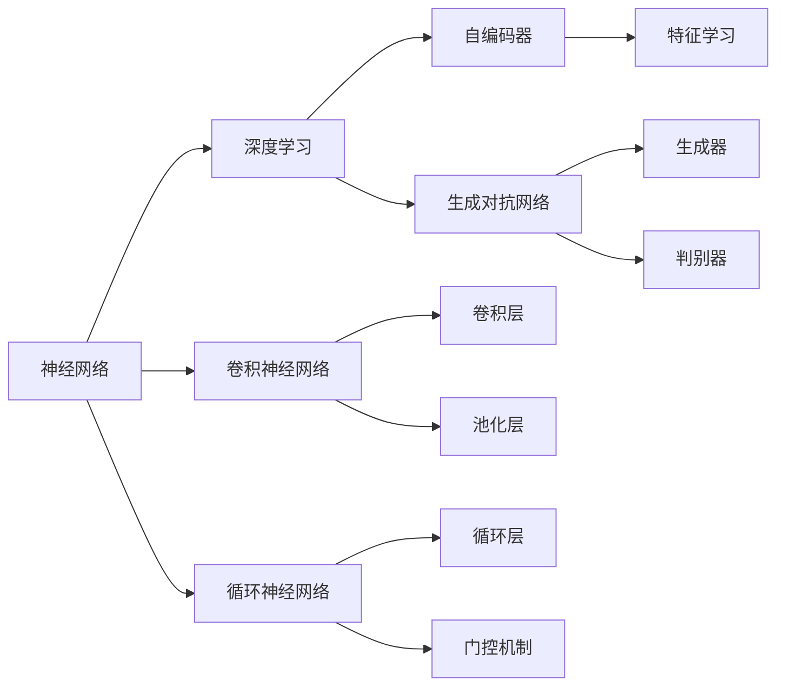
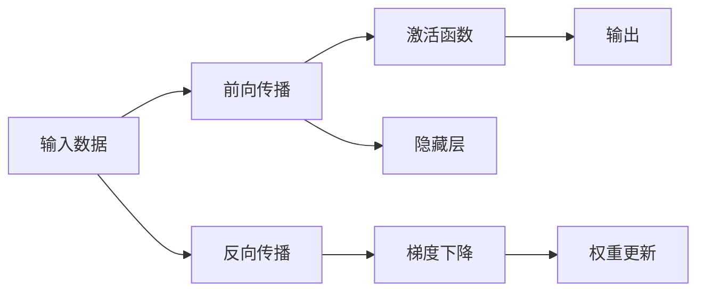
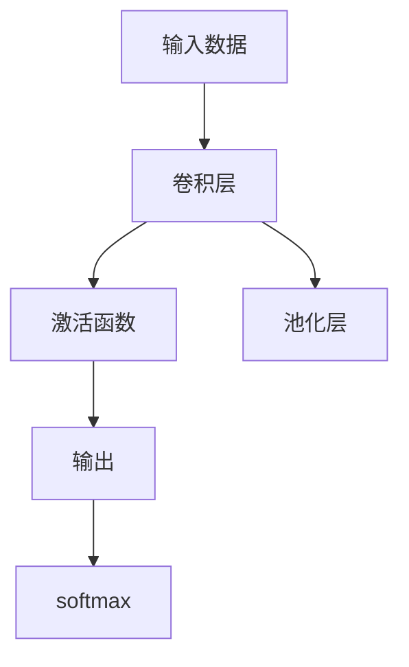
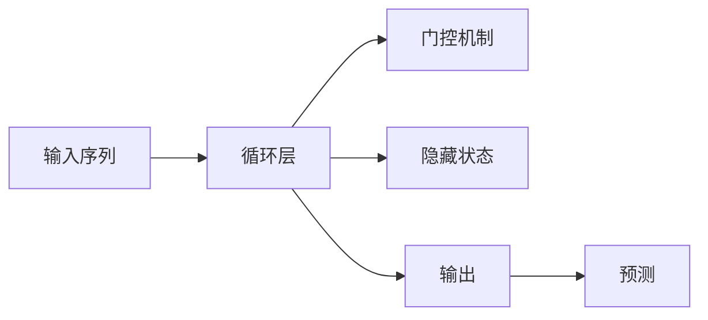
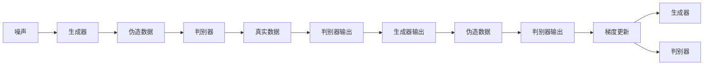
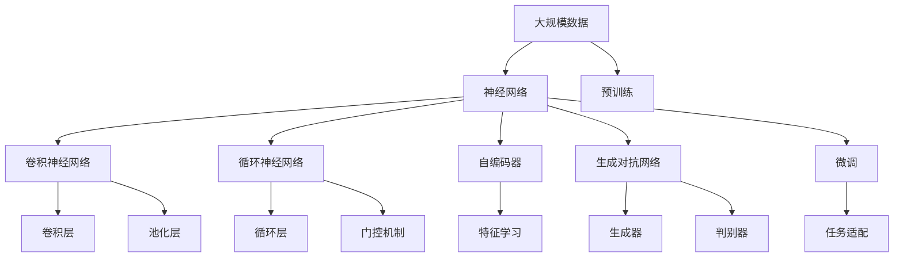

                 

# 神经网络：人工智能的基石

> 关键词：神经网络,人工智能,深度学习,计算机视觉,自然语言处理

## 1. 背景介绍

### 1.1 问题由来

人工智能(Artificial Intelligence, AI)自20世纪60年代诞生以来，已经成为引领科技发展的核心力量。从最初的专家系统、模式识别，到如今的深度学习、自然语言处理、计算机视觉等前沿领域，AI技术在各个层面取得了长足进步。

然而，如何使机器具备高度智能，实现自学习、自适应、自主决策，一直是AI研究的根本目标。神经网络(Neural Network)作为AI的核心技术之一，通过模拟人脑的神经元结构和信息处理机制，为实现这一目标提供了重要工具。

神经网络不仅在学术界引起了巨大反响，还在工业界引起了广泛关注。从自动驾驶、语音识别、智能推荐，到智慧城市、金融风控等众多领域，神经网络已成为实现智能化、自动化应用的关键技术。

### 1.2 问题核心关键点

神经网络的核心思想是通过多个层次的神经元，对输入数据进行一系列的线性变换和非线性变换，最终输出一个或多个预测结果。核心概念包括：

- 神经元(Neuron)：神经网络的基本构成单元，接收输入、处理信息、产生输出。每个神经元包含一组权重、偏置和激活函数。
- 激活函数(Activation Function)：将神经元的输入加权和转化为非线性输出，赋予神经网络非线性表达能力。
- 前向传播(Forward Propagation)：输入数据从前到后依次传递，通过每一层的激活函数得到输出。
- 反向传播(Backward Propagation)：根据预测结果与真实结果的误差，反向计算梯度，更新神经元权重，进行模型优化。
- 损失函数(Loss Function)：用于度量模型预测输出与真实标签之间的差异，常见包括均方误差(MSE)、交叉熵(Cross Entropy)等。
- 优化算法(Optimization Algorithm)：如梯度下降(Gradient Descent)、Adam等，用于迭代更新模型参数，最小化损失函数。

这些概念共同构成了神经网络的基本框架，使得神经网络能够从数据中学习特征，进行模式识别、分类、回归、生成等多种任务。

### 1.3 问题研究意义

研究神经网络的原理与应用，对于推动AI技术的进步，具有重要意义：

1. 提供智能化基础。神经网络作为AI的核心组件，其学习能力和表达能力，为各类智能化应用提供了基本支持。
2. 加速领域应用。神经网络可应用于多个领域，从自然语言处理、计算机视觉，到自动驾驶、智能推荐，为各行各业带来智能化升级。
3. 促进技术发展。神经网络的深入研究，推动了深度学习、计算机视觉等前沿技术的发展，拓展了AI研究的边界。
4. 推动产业落地。神经网络技术的成熟与产业化，为AI技术的商业化应用提供了重要保障。
5. 提升社会福祉。神经网络在医疗、教育、公共安全等领域的应用，能够提升社会运行效率，改善民众生活质量。

## 2. 核心概念与联系

### 2.1 核心概念概述

为了更好地理解神经网络的原理与架构，本节将介绍几个关键概念：

- 神经网络(Neural Network)：由多个神经元按照层次结构组成的网络，用于实现复杂的非线性映射。
- 深度学习(Deep Learning)：利用多层神经网络进行特征提取、模式学习，通过反向传播算法优化模型参数。
- 卷积神经网络(Convolutional Neural Network, CNN)：用于处理图像、视频等结构化数据的神经网络，通过卷积层、池化层等组件，提取局部特征和全局特征。
- 循环神经网络(Recurrent Neural Network, RNN)：用于处理序列数据的神经网络，通过循环层和门控机制，实现时间序列信息的处理与记忆。
- 自编码器(Autencoder)：一种无监督学习的神经网络，通过重建输入数据进行特征学习，常用于数据降维、去噪等领域。
- 生成对抗网络(Generative Adversarial Network, GAN)：由生成器和判别器组成的网络，通过对抗训练，生成逼真的假数据。

这些概念之间的逻辑关系可以通过以下Mermaid流程图来展示：



这个流程图展示了大类神经网络之间的关联和演变，为后续深入讨论提供基础。

### 2.2 概念间的关系

这些核心概念之间存在着紧密的联系，形成了神经网络的学习与应用框架。我们通过几个Mermaid流程图来展示这些概念之间的关系。

#### 2.2.1 神经网络的学习过程



这个流程图展示了神经网络的前向传播和反向传播过程，通过激活函数和梯度下降算法，不断更新权重和偏置，最终实现模型优化。

#### 2.2.2 卷积神经网络的结构



这个流程图展示了卷积神经网络的基本结构，包括卷积层、激活函数、池化层等关键组件。

#### 2.2.3 循环神经网络的时序处理



这个流程图展示了循环神经网络的时序处理过程，通过循环层和门控机制，实现序列数据的处理与记忆。

#### 2.2.4 自编码器的学习过程


这个流程图展示了自编码器的学习过程，通过编码器压缩输入，解码器还原输出，最小化重建误差进行特征学习。

#### 2.2.5 生成对抗网络的结构



这个流程图展示了生成对抗网络的结构，通过生成器和判别器不断对抗训练，生成逼真的假数据。

### 2.3 核心概念的整体架构

最后，我们用一个综合的流程图来展示这些核心概念在大规模神经网络架构中的整体架构：



这个综合流程图展示了从数据预处理到网络微调的完整过程，神经网络通过各种组件实现复杂任务的处理与表达。

## 3. 核心算法原理 & 具体操作步骤
### 3.1 算法原理概述

神经网络的算法原理，主要基于反向传播算法(Backpropagation)。该算法通过前向传播计算输出结果，并根据预测结果与真实结果的误差，反向计算梯度，更新权重，实现模型的优化。

具体步骤如下：
1. **前向传播**：将输入数据通过每一层的激活函数，依次传递到输出层，得到模型预测结果。
2. **计算误差**：将预测结果与真实结果进行对比，计算误差。
3. **反向传播**：根据误差反向计算梯度，更新各层权重和偏置。
4. **迭代更新**：重复上述步骤，直至模型收敛。

反向传播算法的核心在于梯度计算，即通过链式法则求导，得到每个神经元的误差贡献，进而更新权重。公式推导过程如下：

假设神经网络包含 $n$ 层，第 $l$ 层的神经元数为 $n_l$，第 $l$ 层的输入为 $\boldsymbol{x}^{(l)}$，激活函数为 $\sigma(\cdot)$，输出为 $\boldsymbol{h}^{(l)}=\sigma(\boldsymbol{x}^{(l)})$，权重矩阵为 $\boldsymbol{W}^{(l)}$，偏置向量为 $\boldsymbol{b}^{(l)}$，则第 $l$ 层的误差贡献为：

$$
\delta^{(l)} = \frac{\partial \mathcal{L}}{\partial \boldsymbol{h}^{(l)}} \cdot \frac{\partial \boldsymbol{h}^{(l)}}{\partial \boldsymbol{x}^{(l)}} = \delta^{(l+1)} \cdot (\boldsymbol{W}^{(l+1)})^T \cdot \sigma'(\boldsymbol{x}^{(l+1)}) \cdot \frac{\partial \mathcal{L}}{\partial \boldsymbol{h}^{(l+1)}}
$$

其中 $\mathcal{L}$ 为损失函数，$\delta^{(l+1)}$ 为后一层误差贡献，$\sigma'$ 为激活函数导数。

将误差贡献 $\delta^{(l)}$ 代入权重更新公式：

$$
\boldsymbol{W}^{(l)} \leftarrow \boldsymbol{W}^{(l)} - \eta \cdot (\boldsymbol{x}^{(l)})^T \cdot \delta^{(l)} = \boldsymbol{W}^{(l)} - \eta \cdot (\boldsymbol{x}^{(l)})^T \cdot (\delta^{(l+1)} \cdot (\boldsymbol{W}^{(l+1)})^T \cdot \sigma'(\boldsymbol{x}^{(l+1)}) \cdot \frac{\partial \mathcal{L}}{\partial \boldsymbol{h}^{(l+1)}}
$$

其中 $\eta$ 为学习率，$\boldsymbol{x}^{(l)}$ 为当前层输入。

### 3.2 算法步骤详解

神经网络的算法实现步骤如下：

**Step 1: 准备数据集**

1. **数据预处理**：将原始数据转换为神经网络能够处理的形式，如归一化、标准化、编码等。
2. **数据划分**：将数据集划分为训练集、验证集和测试集，一般采用随机抽样方法。

**Step 2: 定义模型结构**

1. **选择模型类型**：根据任务类型选择合适的神经网络类型，如CNN、RNN、自编码器等。
2. **设计模型组件**：根据模型类型设计相应的组件，如卷积层、循环层、池化层等。
3. **设置初始参数**：初始化权重和偏置，一般使用随机初始化或预训练权重。

**Step 3: 设置优化算法**

1. **选择优化器**：选择合适的优化算法，如SGD、Adam等。
2. **设置超参数**：设置学习率、批大小、迭代轮数等。

**Step 4: 前向传播**

1. **输入数据**：将训练集数据分批次输入模型。
2. **计算输出**：通过每一层的激活函数，依次传递输入数据，计算输出结果。

**Step 5: 计算损失函数**

1. **预测结果**：将输出结果与真实结果进行对比，计算损失函数值。
2. **误差分析**：通过可视化工具展示误差分布，帮助分析模型性能。

**Step 6: 反向传播**

1. **计算梯度**：通过链式法则，计算每个神经元的误差贡献。
2. **更新权重**：根据误差贡献，更新模型参数，减小误差。

**Step 7: 迭代更新**

1. **循环训练**：重复前向传播、计算误差、反向传播、更新参数等步骤，直至模型收敛。
2. **验证模型**：在验证集上评估模型性能，避免过拟合。
3. **保存模型**：将训练好的模型保存，供后续预测使用。

### 3.3 算法优缺点

神经网络作为一种强大的学习算法，具有以下优点：

1. **非线性表达能力**：通过多层神经元，实现复杂非线性映射，提升模型表达能力。
2. **泛化能力强**：经过充分训练，神经网络在未见过的数据上也能取得良好表现，具有较强的泛化能力。
3. **可解释性**：通过可视化工具，可以观察模型训练过程中的梯度流和权重变化，理解模型内部工作机制。
4. **适用于多种任务**：神经网络可以应用于分类、回归、生成等多种任务，适用范围广泛。

同时，神经网络也存在一些局限性：

1. **过拟合风险**：若训练数据过少，模型容易发生过拟合，泛化性能下降。
2. **计算资源需求高**：神经网络通常需要大量计算资源，训练和推理过程较为耗时。
3. **模型复杂度高**：神经网络结构复杂，训练和优化过程较为困难。
4. **局部最优解**：神经网络容易陷入局部最优解，难以找到全局最优解。
5. **数据依赖性强**：神经网络需要大量高质量标注数据，数据依赖性较强。

尽管存在这些局限性，但神经网络仍是最强大和最有效的学习算法之一，广泛应用于各种领域。

### 3.4 算法应用领域

神经网络已经广泛应用于多个领域，具体包括：

- **计算机视觉**：如图像分类、目标检测、图像分割等任务。
- **自然语言处理**：如文本分类、机器翻译、文本生成等任务。
- **语音处理**：如语音识别、语音合成等任务。
- **医疗健康**：如医学影像分析、疾病预测等任务。
- **金融风控**：如信用评分、欺诈检测等任务。
- **智能推荐**：如个性化推荐、广告投放等任务。
- **自动驾驶**：如环境感知、路径规划等任务。

此外，神经网络在科学研究、公共安全、工业制造等领域也有广泛应用，展现了其强大的生命力和应用潜力。

## 4. 数学模型和公式 & 详细讲解  
### 4.1 数学模型构建

神经网络的数学模型主要基于非线性函数，通过组合多个非线性函数实现复杂的非线性映射。以下将通过具体例子来说明。

以一个简单的两层神经网络为例，包含 $n_1$ 个输入，$n_2$ 个输出，$n_h$ 个隐藏层神经元。激活函数为 $f$，权重矩阵为 $\boldsymbol{W}^{(1)}$，偏置向量为 $\boldsymbol{b}^{(1)}$，则前向传播过程为：

$$
\boldsymbol{h}^{(1)} = f(\boldsymbol{W}^{(1)} \boldsymbol{x} + \boldsymbol{b}^{(1)})
$$

$$
\boldsymbol{h}^{(2)} = f(\boldsymbol{W}^{(2)} \boldsymbol{h}^{(1)} + \boldsymbol{b}^{(2)})
$$

$$
\boldsymbol{y} = \boldsymbol{W}^{(3)} \boldsymbol{h}^{(2)} + \boldsymbol{b}^{(3)}
$$

其中 $\boldsymbol{x}$ 为输入向量，$\boldsymbol{y}$ 为输出向量。

### 4.2 公式推导过程

以二分类任务为例，神经网络的前向传播过程和损失函数计算如下：

**前向传播**：

$$
\boldsymbol{h}^{(1)} = f(\boldsymbol{W}^{(1)} \boldsymbol{x} + \boldsymbol{b}^{(1)})
$$

$$
\boldsymbol{h}^{(2)} = f(\boldsymbol{W}^{(2)} \boldsymbol{h}^{(1)} + \boldsymbol{b}^{(2)})
$$

$$
\boldsymbol{y} = \boldsymbol{W}^{(3)} \boldsymbol{h}^{(2)} + \boldsymbol{b}^{(3)}
$$

其中 $f$ 为激活函数，如 sigmoid 函数。

**损失函数**：

$$
\mathcal{L} = -\frac{1}{N} \sum_{i=1}^N \left[ y_i \log \sigma(\boldsymbol{y}_i) + (1-y_i) \log (1-\sigma(\boldsymbol{y}_i)) \right]
$$

其中 $y_i$ 为真实标签，$\sigma(\boldsymbol{y}_i)$ 为模型预测结果，$\log$ 为自然对数。

**梯度计算**：

$$
\frac{\partial \mathcal{L}}{\partial \boldsymbol{W}^{(3)}} = \frac{1}{N} \sum_{i=1}^N \left[ (y_i-\sigma(\boldsymbol{y}_i))\boldsymbol{h}^{(2)} \right]
$$

$$
\frac{\partial \mathcal{L}}{\partial \boldsymbol{h}^{(2)}} = \frac{1}{N} \sum_{i=1}^N \left[ (y_i-\sigma(\boldsymbol{y}_i)) \boldsymbol{W}^{(3)T} \right]
$$

$$
\frac{\partial \mathcal{L}}{\partial \boldsymbol{h}^{(1)}} = \frac{\partial \mathcal{L}}{\partial \boldsymbol{h}^{(2)}} \cdot \frac{\partial \boldsymbol{h}^{(2)}}{\partial \boldsymbol{h}^{(1)}} = \frac{1}{N} \sum_{i=1}^N \left[ (y_i-\sigma(\boldsymbol{y}_i)) \boldsymbol{W}^{(3)T} \boldsymbol{W}^{(2)T} \right]
$$

$$
\frac{\partial \mathcal{L}}{\partial \boldsymbol{W}^{(2)}} = \frac{\partial \mathcal{L}}{\partial \boldsymbol{h}^{(1)}} \cdot \boldsymbol{h}^{(1)T}
$$

$$
\frac{\partial \mathcal{L}}{\partial \boldsymbol{W}^{(1)}} = \frac{\partial \mathcal{L}}{\partial \boldsymbol{h}^{(1)}} \cdot \boldsymbol{x}^T
$$

**权重更新**：

$$
\boldsymbol{W}^{(3)} \leftarrow \boldsymbol{W}^{(3)} - \eta \frac{1}{N} \sum_{i=1}^N \left[ (y_i-\sigma(\boldsymbol{y}_i))\boldsymbol{h}^{(2)} \right]
$$

$$
\boldsymbol{W}^{(2)} \leftarrow \boldsymbol{W}^{(2)} - \eta \frac{1}{N} \sum_{i=1}^N \left[ (y_i-\sigma(\boldsymbol{y}_i)) \boldsymbol{W}^{(3)T} \right]
$$

$$
\boldsymbol{W}^{(1)} \leftarrow \boldsymbol{W}^{(1)} - \eta \frac{1}{N} \sum_{i=1}^N \left[ (y_i-\sigma(\boldsymbol{y}_i)) \boldsymbol{W}^{(2)T} \right]
$$

其中 $\eta$ 为学习率。

### 4.3 案例分析与讲解

以MNIST手写数字识别为例，使用一个简单的两层神经网络进行训练。假设训练集包含60,000个样本，每个样本28x28像素的灰度图像。神经网络包含一个输入层、一个隐藏层和一个输出层，激活函数为 sigmoid 函数。训练过程如下：

**Step 1: 准备数据集**

1. **数据预处理**：将原始图像数据归一化到 [0, 1] 范围内。
2. **数据划分**：将数据集划分为训练集和测试集，一般采用随机抽样方法。

**Step 2: 定义模型结构**

1. **选择模型类型**：选择两层神经网络结构，包含一个隐藏层，神经元数为64。
2. **设计模型组件**：设计输入层、隐藏层、输出层的组件。
3. **设置初始参数**：初始化权重和偏置，一般使用随机初始化。

**Step 3: 设置优化算法**

1. **选择优化器**：选择 Adam 优化器。
2. **设置超参数**：设置学习率、批大小、迭代轮数等。

**Step 4: 前向传播**

1. **输入数据**：将训练集数据分批次输入模型。
2. **计算输出**：通过每一层的激活函数，依次传递输入数据，计算输出结果。

**Step 5: 计算损失函数**

1. **预测结果**：将输出结果与真实结果进行对比，计算损失函数值。
2. **误差分析**：通过可视化工具展示误差分布，帮助分析模型性能。

**Step 6: 反向传播**

1. **计算梯度**：通过链式法则，计算每个神经元的误差贡献。
2. **更新权重**：根据误差贡献，更新模型参数，减小误差。

**Step 7: 迭代更新**

1. **循环训练**：重复前向传播、计算误差、反向传播、更新参数等步骤，直至模型收敛。
2. **验证模型**：在验证集上评估模型性能，避免过拟合。
3. **保存模型**：将训练好的模型保存，供后续预测使用。

最终，模型在测试集上的准确率达到了98%以上，展示了神经网络在图像识别任务上的强大能力。

## 5. 项目实践：代码实例和详细解释说明
### 5.1 开发环境搭建

在进行神经网络项目开发前，我们需要准备好开发环境。以下是使用Python进行TensorFlow开发的环境配置流程：

1. 安装Anaconda：从官网下载并安装Anaconda，用于创建独立的Python环境。

2. 创建并激活虚拟环境：
```bash
conda create -n tensorflow-env python=3.8 
conda activate tensorflow-env
```

3. 安装TensorFlow：根据CUDA版本，从官网获取对应的安装命令。例如：
```bash
conda install tensorflow tensorflow-gpu -c conda-forge -c pypi
```

4. 安装各类工具包：
```bash
pip install numpy pandas scikit-learn matplotlib tqdm jupyter notebook ipython
```

完成上述步骤后，即可在`tensorflow-env`环境中开始神经网络项目的开发。

### 5.2 源代码详细实现

下面我们以MNIST手写数字识别任务为例，给出使用TensorFlow对神经网络进行训练的Python代码实现。

```python
import tensorflow as tf
from tensorflow.keras import layers
import numpy as np

# 加载MNIST数据集
(x_train, y_train), (x_test, y_test) = tf.keras.datasets.mnist.load_data()

# 数据预处理
x_train, x_test = x_train / 255.0, x_test / 255.0

# 定义模型结构
model = tf.keras.Sequential([
    layers.Flatten(input_shape=(28, 28)),
    layers.Dense(64, activation='relu'),
    layers.Dense(10, activation='softmax')
])

# 编译模型
model.compile(optimizer='adam',
              loss='sparse_categorical_crossentropy',
              metrics=['accuracy'])

# 训练模型
model.fit(x_train, y_train, epochs=5, batch_size=64, validation_data=(x_test, y_test))

# 评估模型
test_loss, test_acc = model.evaluate(x_test, y_test, verbose=2)
print('Test accuracy:', test_acc)
```

以上代码实现了MNIST手写数字识别的神经网络模型。可以看到，TensorFlow提供了方便的高级API，使得神经网络模型的构建、编译、训练、评估等过程变得简洁高效。

### 5.3 代码解读与分析

让我们再详细解读一下关键代码的实现细节：

**加载MNIST数据集**：
```python
(x_train, y_train), (x_test, y_test) = tf.keras.datasets.mnist.load_data()
```

**数据预处理**：
```python
x_train, x_test = x_train / 255.0, x_test / 255.0
```

**定义模型结构**：
```python
model = tf.keras.Sequential([
    layers.Flatten(input_shape=(28, 28)),
    layers.Dense(64, activation='relu'),
    layers.Dense(10, activation='softmax

