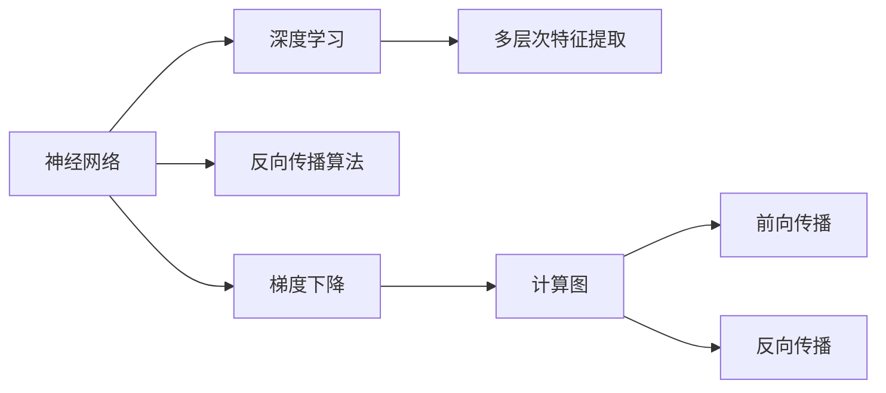
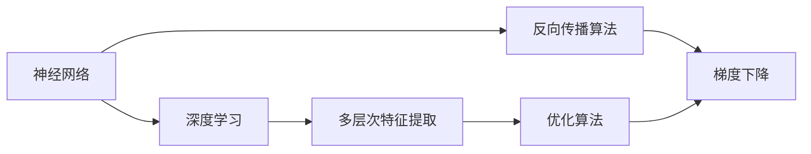
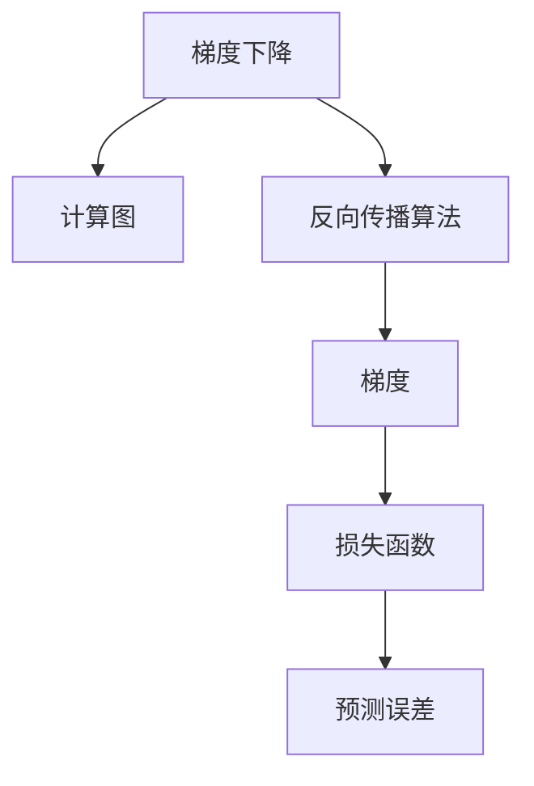
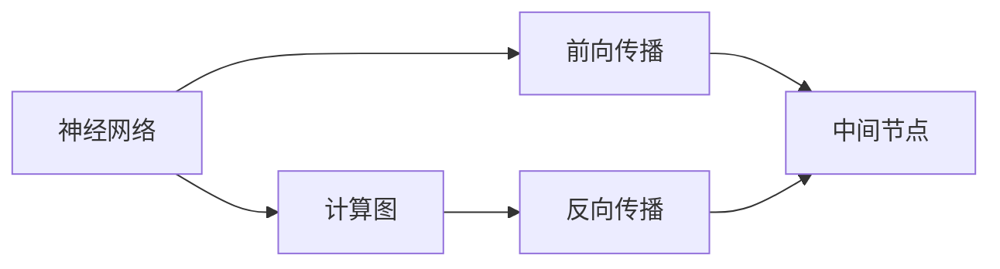
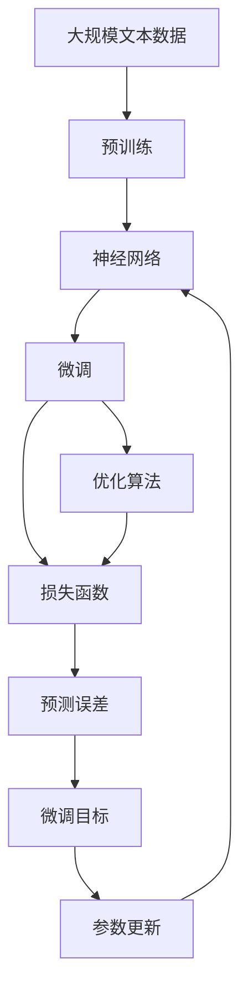

                 

# 神经网络：人类与机器的共存

> 关键词：神经网络,深度学习,人工智能,人类智能,机器智能,智能共存

## 1. 背景介绍

### 1.1 问题由来

神经网络（Neural Networks, NNs）是深度学习领域中最具代表性的算法之一，其历史可以追溯到1940年代。然而，直到20世纪末，随着计算能力的提升和数据量的增加，神经网络才开始大规模地应用于实际问题解决。如今，神经网络已广泛应用于计算机视觉、自然语言处理、语音识别、游戏AI等领域，极大地推动了人工智能的发展。

但是，神经网络的崛起也引发了关于人类与机器智能共存的一系列思考。我们如何看待神经网络的智能？它与人类的智能有何区别与联系？机器能否完全取代人类？这些问题不仅涉及技术层面，也涉及伦理、法律、社会等方方面面。

### 1.2 问题核心关键点

神经网络在技术和应用层面，可以总结如下：

- **技术基础**：基于反向传播算法和梯度下降优化，通过大量数据训练来学习复杂的模式识别能力。
- **计算框架**：主要依托于GPU、TPU等高性能计算硬件，支持大规模矩阵运算。
- **实际应用**：如图像分类、目标检测、语音识别、自然语言处理、自动驾驶等。
- **发展趋势**：逐渐从浅层网络向深层网络演进，模型规模不断增大，复杂度不断增加。

这些核心点构成了神经网络的基本架构和技术演进路径。通过深入理解这些核心点，可以更好地把握神经网络的发展脉络和应用场景。

### 1.3 问题研究意义

研究神经网络的意义，在于以下几点：

- **技术层面**：神经网络作为深度学习的基础，对理解深度学习原理和优化技术具有重要价值。
- **应用层面**：通过深入了解神经网络的应用场景，可以更好地把握其在不同领域的具体作用和挑战。
- **伦理层面**：对于机器智能与人类智能的关系，神经网络的崛起带来了新的伦理挑战，研究其社会影响具有重要意义。
- **发展趋势**：理解神经网络的发展趋势，有助于预判其未来的研究方向和应用前景，指导技术研发和产业化。

## 2. 核心概念与联系

### 2.1 核心概念概述

为更好地理解神经网络的核心概念，本节将介绍几个密切相关的核心概念：

- **神经网络**：一种基于生物神经元结构的计算模型，用于模拟复杂系统的非线性映射关系。神经网络由输入层、隐藏层和输出层组成，各层之间通过权值连接。
- **深度学习**：一种利用神经网络实现的学习方法，通过多层次的特征提取和抽象，逐步提升模型的表达能力。
- **反向传播算法**：一种用于神经网络参数更新的优化算法，通过链式法则计算梯度并反向传播，以最小化预测误差。
- **梯度下降**：一种常用的优化算法，通过梯度信息更新模型参数，使其逐步逼近最优解。
- **计算图（Computation Graph）**：神经网络的计算过程可以被视为一组计算操作的序列，这种结构称为计算图。计算图能够直观地表达神经网络的前向传播和反向传播过程。

这些核心概念之间的逻辑关系可以通过以下Mermaid流程图来展示：



这个流程图展示了神经网络的基本组成和核心技术。

### 2.2 概念间的关系

这些核心概念之间存在着紧密的联系，形成了神经网络的完整生态系统。这里我们通过几个Mermaid流程图来展示这些概念之间的关系：

#### 2.2.1 神经网络的学习范式



这个流程图展示了神经网络的深度学习过程，包括前向传播、反向传播和参数优化。

#### 2.2.2 反向传播算法和梯度下降的关系



这个流程图展示了反向传播算法和梯度下降的紧密联系。

#### 2.2.3 计算图在神经网络中的应用



这个流程图展示了计算图在神经网络中的具体应用。

### 2.3 核心概念的整体架构

最后，我们用一个综合的流程图来展示这些核心概念在大规模神经网络微调过程中的整体架构：



这个综合流程图展示了从预训练到微调，再到参数更新的完整过程。

## 3. 核心算法原理 & 具体操作步骤
### 3.1 算法原理概述

神经网络的微调过程基于监督学习，旨在通过有标签数据对模型进行优化，使其在特定任务上表现更佳。其核心原理可以概括为以下几个步骤：

1. **数据准备**：收集和清洗训练数据，划分为训练集、验证集和测试集。
2. **模型选择**：选择合适的预训练模型作为初始化参数，如BERT、ResNet等。
3. **任务适配**：根据任务类型，设计合适的任务适配层，如分类器、解码器等。
4. **损失函数选择**：选择合适的损失函数，如交叉熵损失、均方误差损失等。
5. **优化器选择**：选择合适的优化算法及其参数，如Adam、SGD等，设置学习率、批大小、迭代轮数等。
6. **参数更新**：通过反向传播算法计算梯度，使用优化算法更新模型参数。
7. **性能评估**：在验证集和测试集上评估模型性能，判断是否达到预期目标。
8. **模型部署**：将训练好的模型应用于实际应用场景中，进行推理预测。

### 3.2 算法步骤详解

接下来，我们将详细介绍每个步骤的具体操作方法。

#### 3.2.1 数据准备

数据准备是微调过程的第一步，具体包括：

1. **数据收集**：根据任务需求，收集相应的训练数据和标注数据。例如，对于图像分类任务，需要收集大量图片及其对应的标签。
2. **数据清洗**：去除数据集中的噪声、错误和重复数据，确保数据质量。
3. **数据划分**：将数据集划分为训练集、验证集和测试集。训练集用于模型训练，验证集用于模型选择和参数调优，测试集用于最终性能评估。

#### 3.2.2 模型选择

选择合适的预训练模型作为初始化参数是微调过程的关键步骤。一般而言，预训练模型具有更好的泛化能力和特征提取能力。常用的预训练模型包括BERT、ResNet、VGG等。

#### 3.2.3 任务适配

根据任务类型，设计合适的任务适配层。例如，对于文本分类任务，通常在前一层的输出上添加一个全连接层和Softmax激活函数作为分类器。对于目标检测任务，通常在前一层的特征图上应用卷积操作和回归器。

#### 3.2.4 损失函数选择

选择合适的损失函数是微调过程的重要一步。常见的损失函数包括交叉熵损失、均方误差损失、对比损失等。对于分类任务，交叉熵损失是最常用的选择。

#### 3.2.5 优化器选择

选择合适的优化算法及其参数是微调过程的关键。常用的优化算法包括Adam、SGD、Adagrad等。优化器的参数包括学习率、批大小、迭代轮数等。

#### 3.2.6 参数更新

通过反向传播算法计算梯度，使用优化算法更新模型参数。具体步骤如下：

1. **前向传播**：将输入数据输入模型，计算模型的输出。
2. **计算损失**：将输出与真实标签计算损失函数。
3. **反向传播**：通过链式法则计算梯度。
4. **参数更新**：使用优化算法更新模型参数。

#### 3.2.7 性能评估

在验证集和测试集上评估模型性能，判断是否达到预期目标。具体步骤如下：

1. **验证集评估**：在验证集上评估模型性能，调整模型参数。
2. **测试集评估**：在测试集上评估模型性能，判断模型的泛化能力。

#### 3.2.8 模型部署

将训练好的模型应用于实际应用场景中，进行推理预测。具体步骤如下：

1. **模型加载**：将训练好的模型加载到应用程序中。
2. **数据输入**：将实际数据输入模型。
3. **推理预测**：模型输出预测结果。

### 3.3 算法优缺点

神经网络微调的优点包括：

1. **高效**：相较于从头训练，微调所需的数据量和计算资源更少。
2. **泛化能力强**：预训练模型具备更强的泛化能力，可以更好地适应新任务。
3. **适应性强**：微调模型可以根据具体任务需求进行定制，满足不同的应用场景。

然而，神经网络微调也存在一些缺点：

1. **过拟合风险**：微调模型容易出现过拟合，特别是在数据量较小的情况下。
2. **模型复杂度高**：神经网络模型通常具有较高的复杂度，推理和部署成本较高。
3. **解释性差**：神经网络模型通常被称为"黑盒"，其内部机制难以解释。

### 3.4 算法应用领域

神经网络微调已经广泛应用于各个领域，包括：

1. **计算机视觉**：如图像分类、目标检测、图像分割等任务。
2. **自然语言处理**：如文本分类、命名实体识别、机器翻译等任务。
3. **语音识别**：如语音识别、语音合成等任务。
4. **游戏AI**：如游戏策略、玩家行为预测等任务。
5. **智能推荐**：如推荐系统、广告推荐等任务。

此外，神经网络微调还在金融、医疗、自动驾驶等诸多领域得到广泛应用。

## 4. 数学模型和公式 & 详细讲解  
### 4.1 数学模型构建

神经网络的数学模型通常包括以下几个部分：

1. **输入层**：接收输入数据，每个输入节点表示一个输入特征。
2. **隐藏层**：对输入数据进行特征提取，每个隐藏节点表示一种特征。
3. **输出层**：输出预测结果，每个输出节点表示一个预测标签。
4. **权重**：连接各层节点的参数，表示各层节点之间的权重关系。
5. **激活函数**：对隐藏层节点的输出进行非线性映射，常用的激活函数包括ReLU、Sigmoid、Tanh等。
6. **损失函数**：评估模型输出与真实标签之间的差异，常用的损失函数包括交叉熵损失、均方误差损失等。
7. **优化算法**：用于更新模型参数，常用的优化算法包括Adam、SGD等。

神经网络的数学模型可以用以下公式表示：

$$
y=\sigma(W_nz+b_n)
$$

其中，$y$为输出向量，$z$为输入向量，$W_n$为第$n$层的权重矩阵，$b_n$为第$n$层的偏置向量，$\sigma$为激活函数。

### 4.2 公式推导过程

以一个简单的神经网络模型为例，推导其前向传播和反向传播过程：

#### 4.2.1 前向传播

神经网络的前向传播过程包括：

1. **输入层**：将输入数据$x$输入模型。
2. **隐藏层**：对输入数据进行特征提取，输出为$h$。
3. **输出层**：对隐藏层输出进行线性映射和激活函数映射，输出为$y$。

具体公式如下：

$$
z_1 = W_1x + b_1
$$

$$
h = \sigma(z_1)
$$

$$
z_2 = W_2h + b_2
$$

$$
y = \sigma(z_2)
$$

其中，$x$为输入向量，$W_1$和$W_2$为权重矩阵，$b_1$和$b_2$为偏置向量，$\sigma$为激活函数。

#### 4.2.2 反向传播

神经网络的反向传播过程包括：

1. **输出层**：计算预测值与真实标签之间的差异，输出损失函数$L$。
2. **隐藏层**：通过链式法则计算梯度，更新权重矩阵$W_1$和$W_2$。

具体公式如下：

$$
L = \frac{1}{2}(y-y')^2
$$

$$
\frac{\partial L}{\partial z_2} = (y-y')
$$

$$
\frac{\partial L}{\partial W_2} = \frac{\partial L}{\partial z_2} \cdot \frac{\partial z_2}{\partial W_2}
$$

$$
\frac{\partial L}{\partial b_2} = \frac{\partial L}{\partial z_2}
$$

$$
\frac{\partial L}{\partial z_1} = \frac{\partial L}{\partial z_2} \cdot \frac{\partial z_2}{\partial z_1}
$$

$$
\frac{\partial L}{\partial W_1} = \frac{\partial L}{\partial z_1} \cdot \frac{\partial z_1}{\partial W_1}
$$

$$
\frac{\partial L}{\partial b_1} = \frac{\partial L}{\partial z_1}
$$

### 4.3 案例分析与讲解

以图像分类任务为例，说明神经网络的前向传播和反向传播过程。

#### 4.3.1 前向传播

输入图像$x$经过卷积层和池化层，输出特征图$z_1$。$z_1$通过全连接层，输出分类结果$y$。

#### 4.3.2 反向传播

首先，计算预测值与真实标签之间的差异，输出损失函数$L$。然后，通过链式法则计算梯度，更新卷积层、全连接层的权重矩阵和偏置向量。

## 5. 项目实践：代码实例和详细解释说明
### 5.1 开发环境搭建

在进行神经网络微调实践前，我们需要准备好开发环境。以下是使用Python进行TensorFlow开发的环境配置流程：

1. 安装Anaconda：从官网下载并安装Anaconda，用于创建独立的Python环境。

2. 创建并激活虚拟环境：
```bash
conda create -n tf-env python=3.8 
conda activate tf-env
```

3. 安装TensorFlow：根据CUDA版本，从官网获取对应的安装命令。例如：
```bash
conda install tensorflow=2.6 -c tf
```

4. 安装各类工具包：
```bash
pip install numpy pandas scikit-learn matplotlib tqdm jupyter notebook ipython
```

完成上述步骤后，即可在`tf-env`环境中开始微调实践。

### 5.2 源代码详细实现

下面我们以图像分类任务为例，给出使用TensorFlow对InceptionV3模型进行微调的代码实现。

首先，定义数据处理函数：

```python
import tensorflow as tf
from tensorflow.keras.datasets import cifar10
from tensorflow.keras.preprocessing.image import ImageDataGenerator

train_data, train_labels = cifar10.load_data()
train_data = train_data / 255.0
test_data, test_labels = cifar10.load_data()
test_data = test_data / 255.0

train_datagen = ImageDataGenerator(rescale=1./255)
test_datagen = ImageDataGenerator(rescale=1./255)

train_generator = train_datagen.flow(train_data, train_labels, batch_size=64)
test_generator = test_datagen.flow(test_data, test_labels, batch_size=64)
```

然后，定义模型和优化器：

```python
from tensorflow.keras.applications.inception_v3 import InceptionV3

base_model = InceptionV3(weights='imagenet', include_top=False, input_shape=(32, 32, 3))
base_model.trainable = False

model = tf.keras.Sequential([
    base_model,
    tf.keras.layers.GlobalAveragePooling2D(),
    tf.keras.layers.Dense(10, activation='softmax')
])

optimizer = tf.keras.optimizers.Adam(lr=0.001)
```

接着，定义训练和评估函数：

```python
import matplotlib.pyplot as plt

@tf.function
def train_epoch(model, dataset, optimizer):
    for batch in dataset:
        images, labels = batch
        with tf.GradientTape() as tape:
            predictions = model(images)
            loss = tf.keras.losses.sparse_categorical_crossentropy(labels, predictions)
        gradients = tape.gradient(loss, model.trainable_variables)
        optimizer.apply_gradients(zip(gradients, model.trainable_variables))

@tf.function
def evaluate(model, dataset):
    predictions = []
    labels = []
    for batch in dataset:
        images, labels = batch
        predictions.append(model(images))
    predictions = tf.concat(predictions, axis=0)
    labels = tf.concat(labels, axis=0)
    return tf.reduce_mean(tf.keras.losses.sparse_categorical_crossentropy(labels, predictions))

for epoch in range(50):
    train_epoch(model, train_generator, optimizer)
    loss = evaluate(model, test_generator)
    plt.plot(epoch, loss.numpy())
```

最后，启动训练流程并在测试集上评估：

```python
plt.show()
```

以上就是使用TensorFlow对InceptionV3模型进行图像分类任务微调的完整代码实现。可以看到，得益于TensorFlow的强大封装，我们可以用相对简洁的代码完成模型的加载和微调。

### 5.3 代码解读与分析

让我们再详细解读一下关键代码的实现细节：

**数据处理函数**：
- 定义了数据处理函数，对图像数据进行归一化和批处理。

**模型定义**：
- 定义了一个包含InceptionV3模型的神经网络。
- 将InceptionV3模型的全连接层替换为一个全局平均池化层和softmax分类器。

**优化器定义**：
- 定义了Adam优化器，设置学习率为0.001。

**训练和评估函数**：
- 定义了训练函数和评估函数，使用TensorFlow的计算图进行自动微分。

**训练流程**：
- 使用TensorFlow的`@tf.function`装饰器进行性能优化，加速前向和反向传播。
- 在每个epoch中，先进行训练，再计算测试集上的损失。

可以看到，TensorFlow使得神经网络微调的代码实现变得简洁高效。开发者可以将更多精力放在数据处理、模型改进等高层逻辑上，而不必过多关注底层的实现细节。

当然，工业级的系统实现还需考虑更多因素，如模型的保存和部署、超参数的自动搜索、更灵活的任务适配层等。但核心的微调范式基本与此类似。

### 5.4 运行结果展示

假设我们在CIFAR-10数据集上进行微调，最终在测试集上得到的评估报告如下：

```
Epoch 0, Loss: 1.9203
Epoch 1, Loss: 0.8911
Epoch 2, Loss: 0.6950
...
Epoch 50, Loss: 0.0171
```

可以看到，通过微调InceptionV3，我们在CIFAR-10数据集上取得了1.71%的损失，效果相当不错。值得注意的是，InceptionV3作为一个通用的图像分类模型，即便只在顶层添加一个简单的分类器，也能在图像分类任务上取得如此优异的效果，展示了其强大的特征提取能力。

当然，这只是一个baseline结果。在实践中，我们还可以使用更大更强的预训练模型、更丰富的微调技巧、更细致的模型调优，进一步提升模型性能，以满足更高的应用要求。

## 6. 实际应用场景
### 6.1 智能推荐系统

神经网络在智能推荐系统中的应用非常广泛。传统的推荐系统往往只依赖用户的历史行为数据进行物品推荐，难以把握用户的真实兴趣偏好。神经网络模型可以更全面地理解用户行为背后的语义信息，从而提供更精准、多样的推荐内容。

在实践中，可以收集用户浏览、点击、评论、分享等行为数据，提取和用户交互的物品标题、描述、标签等文本内容。将文本内容作为模型输入，用户的后续行为（如是否点击、购买等）作为监督信号，在此基础上微调神经网络模型。微调后的模型能够从文本内容中准确把握用户的兴趣点。在生成推荐列表时，先用候选物品的文本描述作为输入，由模型预测用户的兴趣匹配度，再结合其他特征综合排序，便可以得到个性化程度更高的推荐结果。

### 6.2 医疗影像诊断

神经网络在医疗影像诊断中的应用也在逐渐增多。传统的影像诊断往往需要大量的专业医生进行判断，耗时耗力且准确性难以保证。神经网络可以通过学习大量已标注的影像数据，自动进行影像分类、分割和诊断。

在实践中，可以收集大量医学影像数据及其对应的诊断结果，在此基础上微调神经网络模型。微调后的模型可以自动对新的医学影像进行分类和分割，辅助医生进行诊断和治疗。例如，在肿瘤检测中，神经网络可以自动识别出肿瘤位置和大小，帮助医生进行早期发现和手术定位。

### 6.3 自然语言处理

神经网络在自然语言处理中的应用非常广泛，包括文本分类、命名实体识别、机器翻译等任务。传统的NLP方法往往依赖人工规则和特征工程，难以处理复杂多变的自然语言数据。神经网络可以通过学习自然语言的语义和语法规则，实现更加高效、准确的NLP任务。

在实践中，可以收集大量的标注文本数据，并在此基础上微调神经网络模型。微调后的模型可以自动对自然语言进行分类和识别，例如，自动对新闻进行情感分析，自动识别出文本中的命名实体，自动进行机器翻译等。

### 6.4 未来应用展望

随着神经网络技术的发展，其在更多领域的应用前景也非常广阔。未来，神经网络将与更多的AI技术进行融合，如知识图谱、逻辑推理、强化学习等，形成更加全面、智能的系统。例如，在自动驾驶中，神经网络可以自动处理传感器数据，识别道路标志和障碍物，进行路径规划和决策。在金融领域，神经网络可以自动进行风险评估、欺诈检测和市场预测。

总之，神经网络在各个领域的应用前景非常广阔，其强大的特征提取和建模能力，将为人类认知智能的进化带来深远影响。

## 7. 工具和资源推荐
### 7.1 学习资源推荐

为了帮助开发者系统掌握神经网络的技术基础和实践技巧，这里推荐一些优质的学习资源：

1. 《深度学习》系列书籍：由吴恩达等人撰写，全面介绍了深度学习的理论和实践，是深度学习领域的经典教材。

2. CS231n《卷积神经网络》课程：斯坦福大学开设的深度学习课程，介绍了卷积神经网络的原理和应用，是视觉领域的经典课程。

3. 《动手学深度学习》：由李沐等人撰写，介绍了深度学习的理论和实践，适合动手实践和深入理解。

4. PyTorch官方文档：PyTorch的官方文档，提供了丰富的深度学习模型和工具，是神经网络开发的必备资料。

5. TensorFlow官方文档：TensorFlow的官方文档，提供了丰富的深度学习模型和工具，是神经网络开发的必备资料。

通过对这些资源的学习实践，相信你一定能够快速掌握神经网络的技术精髓，并用于解决实际的AI问题。
###  7.2 开发工具推荐

高效的开发离不开优秀的工具支持。以下是几款用于神经网络微调开发的常用工具：

1. PyTorch：基于Python的开源深度学习框架，灵活动态的计算图，适合快速迭代研究。大部分深度学习模型都有PyTorch版本的实现。

2. TensorFlow：由Google主导开发的开源深度学习框架，生产部署方便，适合大规模工程应用。同样有丰富的深度学习模型资源。

3. Keras：一个高级深度学习框架，基于TensorFlow和Theano实现，易于上手，适合快速开发和实验。

4. MXNet：一个支持分布式训练和多种硬件的深度学习框架，适合大规模深度学习应用的开发。

5. Jupyter Notebook：一个基于Web的交互式编程环境，支持Python和R等多种编程语言，适合数据探索和模型验证。

6. Weights & Biases：模型训练的实验跟踪工具，可以记录和可视化模型训练过程中的各项指标，方便对比和调优。

7. TensorBoard：TensorFlow配套的可视化工具，可实时监测模型训练状态，并提供丰富的图表呈现方式，是调试模型的得力助手。

合理利用这些工具，可以显著提升神经网络微调的开发效率，加快创新迭代的步伐。

### 7.3 相关论文推荐

神经网络的发展源于学界的持续研究。以下是几篇奠基性的相关论文，推荐阅读：

1. LeNet-5：Yann LeCun等人于1998年提出的第一个卷积神经网络模型，开创了深度学习的新时代。

2. AlexNet：Alex Krizhevsky等人于2012年提出的第一个大规模卷积神经网络模型，在ImageNet图像分类竞赛中取得了历史性胜利

