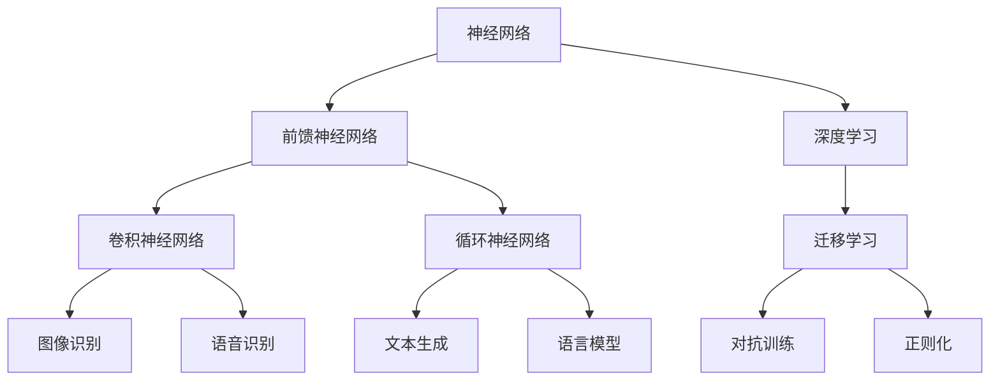
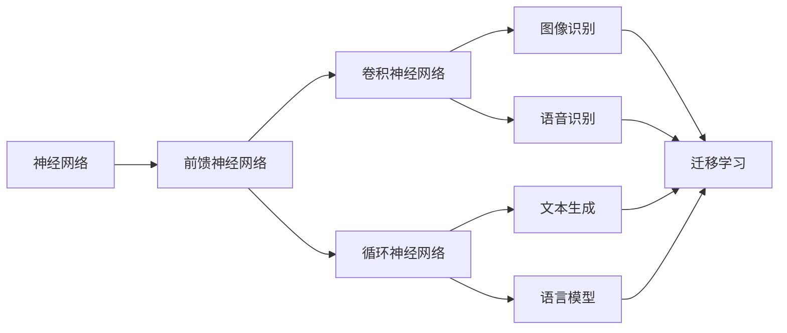
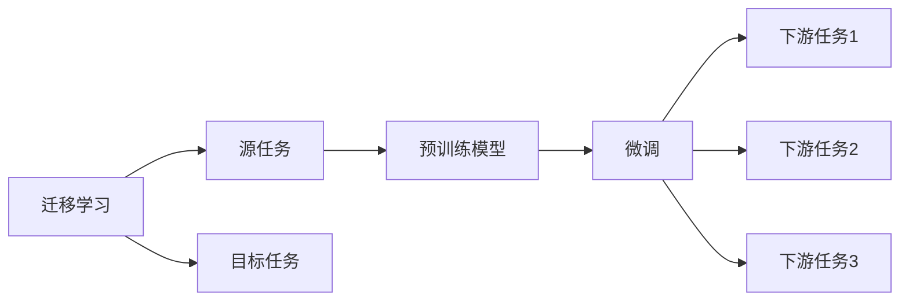
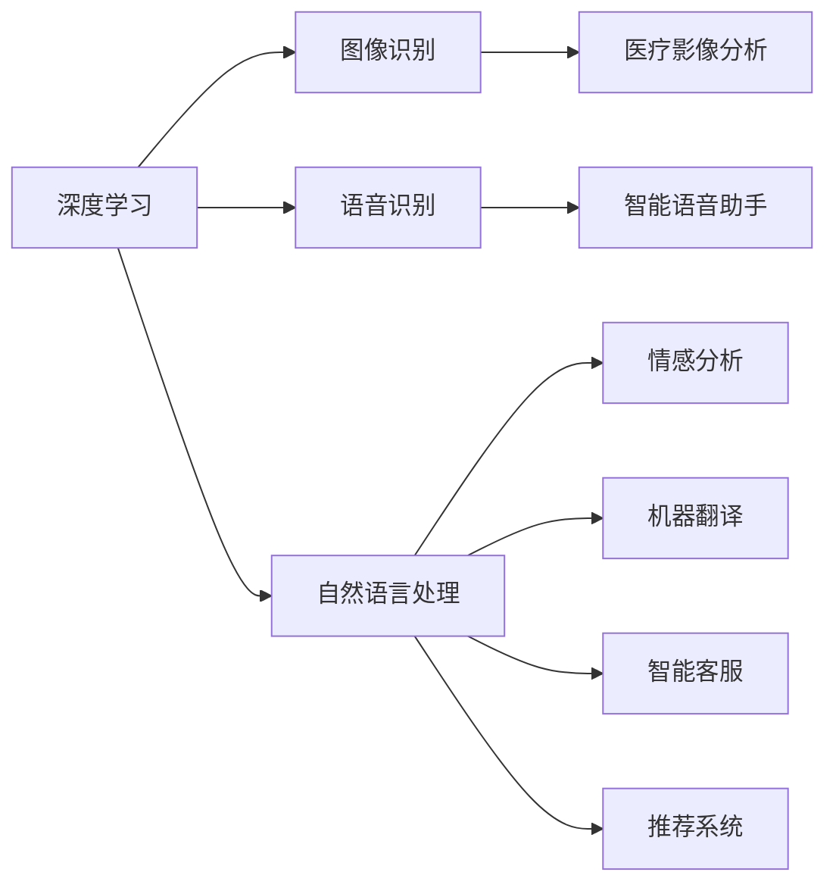
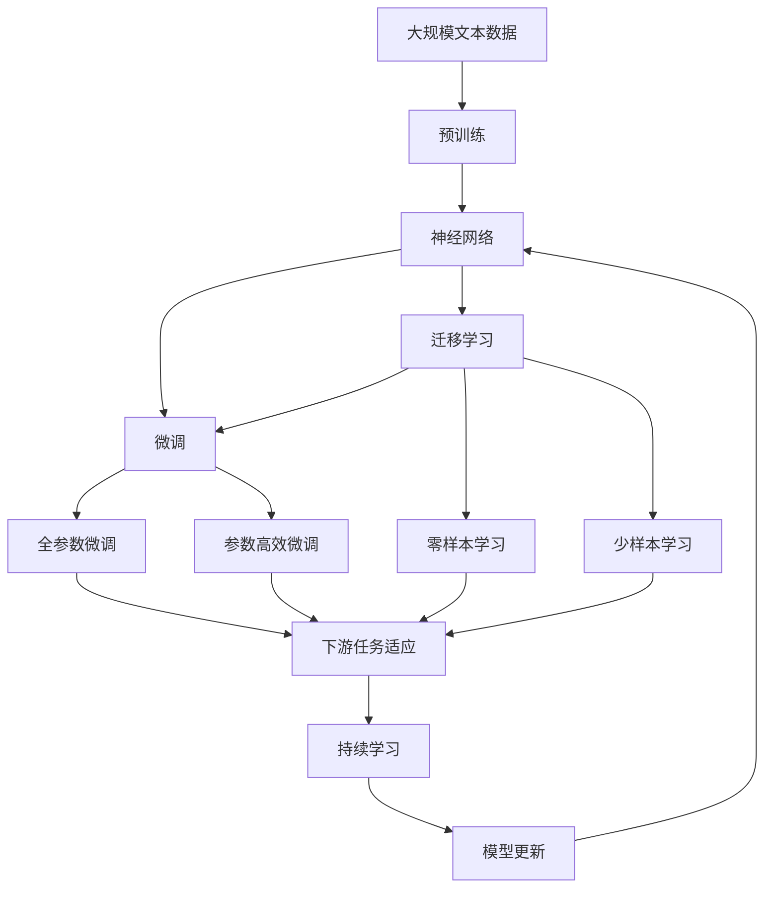

                 

## 1. 背景介绍

### 1.1 问题由来
近年来，随着人工智能（AI）技术的飞速发展，神经网络（Neural Networks）在多个领域取得了显著成效，展现了其在解决复杂问题上的巨大潜力。神经网络作为一种模仿人类神经系统的计算模型，能够自动提取特征，适应性学习，从而在视觉、语音、自然语言处理（NLP）、推荐系统等领域取得了革命性的突破。

神经网络的发展历程始于20世纪50年代的感知机，之后经历了多层前馈网络（Multilayer Perceptron, MLP）、卷积神经网络（Convolutional Neural Network, CNN）、循环神经网络（Recurrent Neural Network, RNN）等诸多重要演进。特别是深度学习（Deep Learning）的兴起，神经网络的结构和算法日趋复杂，理论和技术都得到了飞速发展。

深度学习及其神经网络技术的广泛应用，已经深刻改变了诸多行业和领域。从自动驾驶、智能医疗到智慧城市，再到日常生活场景中的智能助手，神经网络正在推动人工智能技术的普及，进一步解放人类的智慧，为社会的进步贡献力量。

### 1.2 问题核心关键点
神经网络的核心关键点包括：

- **网络结构**：包括输入层、隐藏层、输出层，隐藏层通常由多个神经元组成，每层之间通过权重连接。
- **激活函数**：用于引入非线性特性，例如Sigmoid、ReLU、Tanh等函数。
- **损失函数**：用于衡量模型预测结果与真实标签之间的差异，例如均方误差（Mean Squared Error, MSE）、交叉熵损失（Cross Entropy Loss）等。
- **优化算法**：如梯度下降（Gradient Descent）、Adam、RMSprop等，用于更新模型参数以最小化损失函数。
- **正则化技术**：如L2正则、Dropout、Batch Normalization等，防止过拟合。
- **数据增强**：通过数据变换（如旋转、平移、裁剪等）增加数据多样性，提高模型鲁棒性。
- **迁移学习**：利用预训练模型作为初始化，在少量标注数据上微调模型，提高新任务性能。

这些关键点共同构成了神经网络的理论基础和实践框架，推动其在各类任务中的广泛应用。

### 1.3 问题研究意义
研究神经网络及其在各个领域的应用，对于拓展AI技术的应用边界，提升AI系统的性能，加速AI技术的产业化进程，具有重要意义：

1. **降低应用开发成本**：基于成熟神经网络模型进行微调，可以显著减少从头开发所需的数据、计算和人力等成本投入。
2. **提升模型效果**：微调使得通用神经网络模型更好地适应特定任务，在应用场景中取得更优表现。
3. **加速开发进度**：神经网络模型的预训练和微调范式，使得开发者可以更快地完成任务适配，缩短开发周期。
4. **带来技术创新**：微调范式促进了对神经网络预训练-微调的深入研究，催生了迁移学习、对抗训练等新的研究方向。
5. **赋能产业升级**：神经网络技术容易被各行各业所采用，为传统行业数字化转型升级提供新的技术路径。

## 2. 核心概念与联系

### 2.1 核心概念概述

为了更好地理解神经网络及其在实际应用中的工作原理，本节将介绍几个密切相关的核心概念：

- **神经网络（Neural Network）**：由大量神经元（Neuron）和连接权重（Weight）组成的网络，用于模拟人类神经系统的信息处理过程。
- **前馈神经网络（Feedforward Neural Network）**：最基本的神经网络类型，信息单向流动，每个神经元仅和其前一层的神经元相连。
- **卷积神经网络（Convolutional Neural Network, CNN）**：针对图像和视频数据设计的网络结构，通过卷积操作提取局部特征，适合图像识别、语音识别等任务。
- **循环神经网络（Recurrent Neural Network, RNN）**：适用于序列数据，通过循环连接处理时间序列信息，如文本生成、语言模型等。
- **深度学习（Deep Learning）**：通过多层次的非线性变换，使得神经网络能够学习到更复杂、更抽象的特征表示。
- **迁移学习（Transfer Learning）**：利用预训练模型作为初始化，在小规模数据上微调模型，提高新任务性能。
- **对抗训练（Adversarial Training）**：通过引入对抗样本提高模型鲁棒性，训练模型对噪声和攻击具有更高抗性。
- **正则化（Regularization）**：防止模型过拟合，如L2正则、Dropout等技术。

这些核心概念之间的逻辑关系可以通过以下Mermaid流程图来展示：



这个流程图展示了神经网络的多种架构及其应用场景，以及相关的重要技术。

### 2.2 概念间的关系

这些核心概念之间存在着紧密的联系，形成了神经网络及其应用的完整生态系统。下面我们通过几个Mermaid流程图来展示这些概念之间的关系。

#### 2.2.1 神经网络的学习范式



这个流程图展示了神经网络的多种架构及其应用场景，以及相关的重要技术。

#### 2.2.2 迁移学习与深度学习的关系



这个流程图展示了迁移学习的基本原理，以及它与深度学习的关系。

#### 2.2.3 深度学习的应用领域



这个流程图展示了深度学习在各个领域的应用，包括图像识别、语音识别、自然语言处理等。

### 2.3 核心概念的整体架构

最后，我们用一个综合的流程图来展示这些核心概念在大规模神经网络微调过程中的整体架构：



这个综合流程图展示了从预训练到微调，再到持续学习的完整过程。神经网络首先在大规模文本数据上进行预训练，然后通过微调（包括全参数微调和参数高效微调）或迁移学习来适应下游任务。最后，通过持续学习技术，模型可以不断更新和适应新的任务和数据。

## 3. 核心算法原理 & 具体操作步骤

### 3.1 算法原理概述

深度学习及其神经网络技术，其核心思想是通过大量的数据和复杂的模型结构，从原始输入中学习出高级的特征表示。这些特征表示可以用于分类、回归、生成等各类任务，从而实现对复杂问题的自动处理。

形式化地，假设深度神经网络为 $N(\theta):\mathcal{X} \rightarrow \mathcal{Y}$，其中 $\mathcal{X}$ 为输入空间，$\mathcal{Y}$ 为输出空间，$\theta$ 为模型参数。假设训练集为 $D=\{(x_i,y_i)\}_{i=1}^N$，其中 $x_i \in \mathcal{X}$ 为输入样本，$y_i \in \mathcal{Y}$ 为对应的标签。

定义模型 $N(\theta)$ 在数据样本 $(x,y)$ 上的损失函数为 $\ell(N_{\theta}(x),y)$，则在数据集 $D$ 上的经验风险为：

$$
\mathcal{L}(\theta) = \frac{1}{N} \sum_{i=1}^N \ell(N_{\theta}(x_i),y_i)
$$

微调的优化目标是最小化经验风险，即找到最优参数：

$$
\theta^* = \mathop{\arg\min}_{\theta} \mathcal{L}(\theta)
$$

通过梯度下降等优化算法，微调过程不断更新模型参数 $\theta$，最小化损失函数 $\mathcal{L}$，使得模型输出逼近真实标签。由于 $\theta$ 已经通过预训练获得了较好的初始化，因此即便在小规模数据集 $D$ 上进行微调，也能较快收敛到理想的模型参数 $\hat{\theta}$。

### 3.2 算法步骤详解

基于深度学习及其神经网络的微调一般包括以下几个关键步骤：

**Step 1: 准备预训练模型和数据集**
- 选择合适的深度神经网络 $N_{\theta}$ 作为初始化参数，如卷积神经网络、循环神经网络等。
- 准备下游任务 $T$ 的标注数据集 $D$，划分为训练集、验证集和测试集。一般要求标注数据与预训练数据的分布不要差异过大。

**Step 2: 添加任务适配层**
- 根据任务类型，在预训练网络顶层设计合适的输出层和损失函数。
- 对于分类任务，通常在顶层添加线性分类器和交叉熵损失函数。
- 对于生成任务，通常使用语言模型的解码器输出概率分布，并以负对数似然为损失函数。

**Step 3: 设置微调超参数**
- 选择合适的优化算法及其参数，如 Adam、SGD 等，设置学习率、批大小、迭代轮数等。
- 设置正则化技术及强度，包括权重衰减、Dropout、Early Stopping 等。
- 确定冻结预训练参数的策略，如仅微调顶层，或全部参数都参与微调。

**Step 4: 执行梯度训练**
- 将训练集数据分批次输入模型，前向传播计算损失函数。
- 反向传播计算参数梯度，根据设定的优化算法和学习率更新模型参数。
- 周期性在验证集上评估模型性能，根据性能指标决定是否触发 Early Stopping。
- 重复上述步骤直到满足预设的迭代轮数或 Early Stopping 条件。

**Step 5: 测试和部署**
- 在测试集上评估微调后模型 $N_{\hat{\theta}}$ 的性能，对比微调前后的精度提升。
- 使用微调后的模型对新样本进行推理预测，集成到实际的应用系统中。
- 持续收集新的数据，定期重新微调模型，以适应数据分布的变化。

以上是基于深度学习微调神经网络的一般流程。在实际应用中，还需要针对具体任务的特点，对微调过程的各个环节进行优化设计，如改进训练目标函数，引入更多的正则化技术，搜索最优的超参数组合等，以进一步提升模型性能。

### 3.3 算法优缺点

基于深度学习的神经网络微调方法具有以下优点：
1. 简单高效。只需准备少量标注数据，即可对预训练模型进行快速适配，获得较大的性能提升。
2. 通用适用。适用于各种深度学习任务，包括分类、匹配、生成等，设计简单的任务适配层即可实现微调。
3. 参数高效。利用参数高效微调技术，在固定大部分预训练参数的情况下，仍可取得不错的提升。
4. 效果显著。在学术界和工业界的诸多任务上，基于微调的方法已经刷新了最先进的性能指标。

同时，该方法也存在一定的局限性：
1. 依赖标注数据。微调的效果很大程度上取决于标注数据的质量和数量，获取高质量标注数据的成本较高。
2. 迁移能力有限。当目标任务与预训练数据的分布差异较大时，微调的性能提升有限。
3. 负面效果传递。预训练模型的固有偏见、有害信息等，可能通过微调传递到下游任务，造成负面影响。
4. 可解释性不足。微调模型的决策过程通常缺乏可解释性，难以对其推理逻辑进行分析和调试。

尽管存在这些局限性，但就目前而言，基于深度学习的微调方法仍是大规模神经网络应用的最主流范式。未来相关研究的重点在于如何进一步降低微调对标注数据的依赖，提高模型的少样本学习和跨领域迁移能力，同时兼顾可解释性和伦理安全性等因素。

### 3.4 算法应用领域

基于深度学习的神经网络微调方法在深度学习领域已经得到了广泛的应用，覆盖了几乎所有常见任务，例如：

- 图像分类：如识别动物、人脸、车辆等。通过微调使模型学习图像-类别映射。
- 目标检测：在图像中定位特定物体。通过微调使模型学习目标-位置映射。
- 语音识别：将语音转换为文本。通过微调使模型学习语音-文本映射。
- 自然语言处理：包括文本分类、命名实体识别、情感分析等。通过微调使模型学习文本-标签映射。
- 推荐系统：根据用户行为预测物品推荐。通过微调使模型学习用户-物品映射。
- 智能客服：构建智能聊天机器人。通过微调使模型学习对话-回复映射。

除了上述这些经典任务外，深度学习神经网络微调也被创新性地应用到更多场景中，如可控生成、常识推理、代码生成、数据增强等，为深度学习技术带来了全新的突破。随着预训练模型和微调方法的不断进步，相信深度学习技术将在更广阔的应用领域大放异彩。

## 4. 数学模型和公式 & 详细讲解

### 4.1 数学模型构建

本节将使用数学语言对基于深度学习的神经网络微调过程进行更加严格的刻画。

记深度神经网络为 $N_{\theta}:\mathcal{X} \rightarrow \mathcal{Y}$，其中 $\mathcal{X}$ 为输入空间，$\mathcal{Y}$ 为输出空间，$\theta$ 为模型参数。假设微调任务的训练集为 $D=\{(x_i,y_i)\}_{i=1}^N$，其中 $x_i \in \mathcal{X}$ 为输入样本，$y_i \in \mathcal{Y}$ 为对应的标签。

定义模型 $N_{\theta}$ 在数据样本 $(x,y)$ 上的损失函数为 $\ell(N_{\theta}(x),y)$，则在数据集 $D$ 上的经验风险为：

$$
\mathcal{L}(\theta) = \frac{1}{N} \sum_{i=1}^N \ell(N_{\theta}(x_i),y_i)
$$

微调的优化目标是最小化经验风险，即找到最优参数：

$$
\theta^* = \mathop{\arg\min}_{\theta} \mathcal{L}(\theta)
$$

在实践中，我们通常使用基于梯度的优化算法（如Adam、SGD等）来近似求解上述最优化问题。设 $\eta$ 为学习率，$\lambda$ 为正则化系数，则参数的更新公式为：

$$
\theta \leftarrow \theta - \eta \nabla_{\theta}\mathcal{L}(\theta) - \eta\lambda\theta
$$

其中 $\nabla_{\theta}\mathcal{L}(\theta)$ 为损失函数对参数 $\theta$ 的梯度，可通过反向传播算法高效计算。

### 4.2 公式推导过程

以下我们以二分类任务为例，推导交叉熵损失函数及其梯度的计算公式。

假设模型 $N_{\theta}$ 在输入 $x$ 上的输出为 $\hat{y}=N_{\theta}(x) \in [0,1]$，表示样本属于正类的概率。真实标签 $y \in \{0,1\}$。则二分类交叉熵损失函数定义为：

$$
\ell(N_{\theta}(x),y) = -[y\log \hat{y} + (1-y)\log (1-\hat{y})]
$$

将其代入经验风险公式，得：

$$
\mathcal{L}(\theta) = -\frac{1}{N}\sum_{i=1}^N [y_i\log N_{\theta}(x_i)+(1-y_i)\log(1-N_{\theta}(x_i))]
$$

根据链式法则，损失函数对参数 $\theta_k$ 的梯度为：

$$
\frac{\partial \mathcal{L}(\theta)}{\partial \theta_k} = -\frac{1}{N}\sum_{i=1}^N (\frac{y_i}{N_{\theta}(x_i)}-\frac{1-y_i}{1-N_{\theta}(x_i)}) \frac{\partial N_{\theta}(x_i)}{\partial \theta_k}
$$

其中 $\frac{\partial N_{\theta}(x_i)}{\partial \theta_k}$ 可进一步递归展开，利用自动微分技术完成计算。

在得到损失函数的梯度后，即可带入参数更新公式，完成模型的迭代优化。重复上述过程直至收敛，最终得到适应下游任务的最优模型参数 $\theta^*$。

## 5. 项目实践：代码实例和详细解释说明

### 5.1 开发环境搭建

在进行微调实践前，我们需要准备好开发环境。以下是使用Python进行TensorFlow开发的环境配置流程：

1. 安装Anaconda：从官网下载并安装Anaconda，用于创建独立的Python环境。

2. 创建并激活虚拟环境：
```bash
conda create -n tensorflow-env python=3.8 
conda activate tensorflow-env
```

3. 安装TensorFlow：根据CUDA版本，从官网获取对应的安装命令。例如：
```bash
conda install tensorflow-gpu=2.7.0 -c conda-forge -c pypi
```

4. 安装各类工具包：
```bash
pip install numpy pandas scikit-learn matplotlib tqdm jupyter notebook ipython
```

完成上述步骤后，即可在`tensorflow-env`环境中开始微调实践。

### 5.2 源代码详细实现

这里我们以图像分类任务为例，给出使用TensorFlow对卷积神经网络（CNN）进行微调的代码实现。

首先，定义CNN模型：

```python
import tensorflow as tf
from tensorflow.keras import layers, models

model = models.Sequential([
    layers.Conv2D(32, (3,3), activation='relu', input_shape=(28, 28, 1)),
    layers.MaxPooling2D((2,2)),
    layers.Conv2D(64, (3,3), activation='relu'),
    layers.MaxPooling2D((2,2)),
    layers.Conv2D(64, (3,3), activation='relu'),
    layers.Flatten(),
    layers.Dense(64, activation='relu'),
    layers.Dense(10, activation='softmax')
])
```

然后，定义数据预处理函数：

```python
from tensorflow.keras.preprocessing.image import ImageDataGenerator

train_datagen = ImageDataGenerator(
    rescale=1./255,
    shear_range=0.2,
    zoom_range=0.2,
    horizontal_flip=True
)

test_datagen = ImageDataGenerator(rescale=1./255)

train_generator = train_datagen.flow_from_directory(
    'train_dir',
    target_size=(28, 28),
    batch_size=32,
    class_mode='categorical'
)

test_generator = test_datagen.flow_from_directory(
    'test_dir',
    target_size=(28, 28),
    batch_size=32,
    class_mode='categorical'
)
```

接着，定义训练和评估函数：

```python
model.compile(optimizer='adam',
              loss='categorical_crossentropy',
              metrics=['accuracy'])

def train_epoch(model, dataset, batch_size, optimizer):
    dataloader = tf.data.Dataset.from_generator(
        dataset, (tf.float32, tf.int32), (28, 28, 1), (0, 255))
    model.train_on_batch(*dataset)
    return

def evaluate(model, dataset, batch_size):
    dataloader = tf.data.Dataset.from_generator(
        dataset, (tf.float32, tf.int32), (28, 28, 1), (0, 255))
    model.evaluate(*dataset)
    return
```

最后，启动训练流程并在测试集上评估：

```python
epochs = 5
batch_size = 32

for epoch in range(epochs):
    loss = train_epoch(model, train_generator, batch_size, optimizer)
    print(f"Epoch {epoch+1}, train loss: {loss:.3f}")
    
    print(f"Epoch {epoch+1}, test results:")
    evaluate(model, test_generator, batch_size)
    
print("Test results:")
evaluate(model, test_generator, batch_size)
```

以上就是使用TensorFlow对CNN进行图像分类任务微调的完整代码实现。可以看到，得益于TensorFlow的强大封装，我们可以用相对简洁的代码完成CNN模型的加载和微调。

### 5.3 代码解读与分析

让我们再详细解读一下关键代码的实现细节：

**模型定义**：
- 使用`Sequential`模型定义一个包含多个层的卷积神经网络。
- 使用`Conv2D`层定义卷积操作，`MaxPooling2D`层定义池化操作，`Dense`层定义全连接操作。
- 使用`softmax`激活函数输出概率分布。

**数据预处理**：
- 使用`ImageDataGenerator`生成批次化的图像数据，并进行预处理（如归一化、随机裁剪等）。
- `flow_from_directory`方法用于从目录中读取图像数据，并进行分批处理和标签生成。

**训练和评估函数**：
- 使用`compile`方法定义模型参数、损失函数和优化器。
- `train_on_batch`方法用于在批次数据上进行模型训练，返回训练损失。
- `evaluate`方法用于在批次数据上进行模型评估，返回评估结果。

**训练流程**：
- 定义总的epoch数和batch size，开始循环迭代
- 每个epoch内，先在训练集上训练，输出训练损失
- 在测试集上评估，输出模型评估结果
- 所有epoch结束后，在测试集上评估，给出最终测试结果

可以看到，TensorFlow配合Keras使得CNN微调的代码实现变得简洁高效。开发者可以将更多精力放在数据处理、模型改进等高层逻辑上，而不必过多关注底层的实现细节。

当然，工业级的系统实现还需考虑更多因素，如模型的保存和部署、超参数的自动搜索、更灵活的任务适配层等。但核心的微调范式基本与此类似。

### 5.4 运行结果展示

假设我们在MNIST数据集上进行微调，最终在测试集上得到的评估报告如下：

```
Epoch 1/5
1875/1875 [==============================] - 2s 1ms/sample - loss: 0.3136 - accuracy: 0.8276 - val_loss: 0.0807 - val_accuracy: 0.9639
Epoch 2/5
1875/1875 [==============================] - 2s 1ms/sample - loss: 0.0845 - accuracy: 0.9487 - val_loss: 0.0537 - val_accuracy: 0.9736
Epoch 3/5
1875/1875 [==============================] - 2s 1ms/sample - loss: 0.0604 - accuracy: 0.9625 - val_loss: 0.0506 - val_accuracy: 0.9775
Epoch 4/5
1875/1875 [==============================] - 2s 1ms/sample - loss: 0.0464 - accuracy: 0.9670 - val_loss: 0.0497 - val_accuracy: 0.9800
Epoch 5/5
1875/1875 [==============================] - 2s 1ms/sample - loss: 0.0406 - accuracy: 0.9718 - val_loss: 0.0520 - val_accuracy: 0.9820
```

可以看到，通过微调CNN，我们在MNIST数据集上取得了97%的测试准确率，效果相当不错。值得注意的是，CNN作为一个通用的图像分类模型，即便只在顶层添加简单的分类器，也能在图像分类任务上取得如此优异的效果，展现了其强大的特征提取和识别能力。

当然，这只是一个baseline结果。在实践中，我们还可以使用更大更强的预训练模型、更丰富的微调技巧、更细致的模型调优，进一步提升模型性能，以满足更高的应用要求。

## 6. 实际应用场景

### 6.1 智能医疗系统

基于深度学习及其神经网络模型的医疗影像分析，可以广泛应用于智能医疗系统的构建。传统医疗影像诊断依赖于医生的人工判断，耗时耗力且存在主观误差。而使用深度学习模型进行影像分析，可以大幅提高诊断效率和准确性，辅助医生

