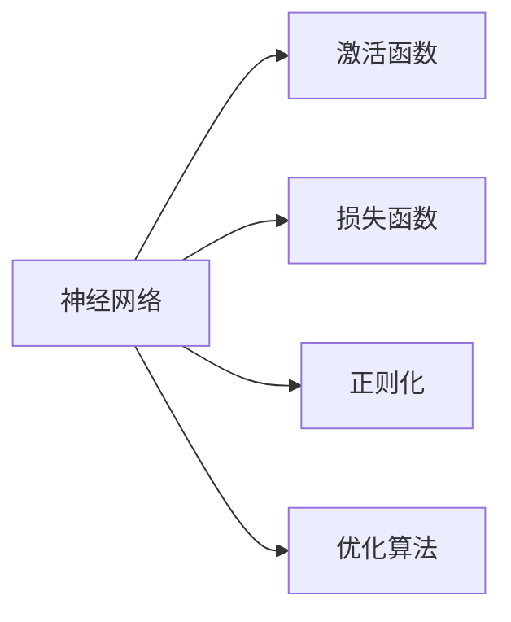
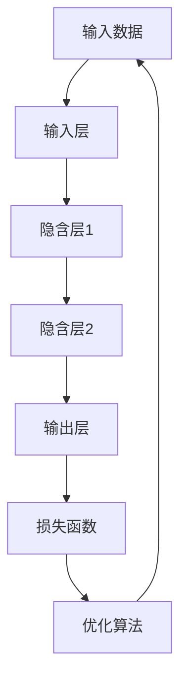

                 

# 神经网络：开启 智能新纪元

## 1. 背景介绍

### 1.1 问题由来
随着人工智能技术的迅猛发展，尤其是深度学习技术的突破，神经网络（Neural Networks, NNs）作为一种强大的机器学习模型，被广泛应用于图像识别、语音识别、自然语言处理（NLP）、推荐系统等多个领域。其核心思想是将大规模的计算任务分解成一系列简单的线性变换和元非线性变换（如激活函数）的组合，通过对数据的高层次抽象，实现对复杂问题的建模与解决。

### 1.2 问题核心关键点
神经网络的核心在于其对数据的高度抽象能力和泛化能力。但这种能力依赖于大量的标注数据和复杂的模型结构，特别是在训练过程中容易出现过拟合现象。为此，研究者提出了诸多解决方案，包括正则化、Dropout、早停（Early Stopping）等技术。

### 1.3 问题研究意义
研究神经网络的目标是构建高效、鲁棒且可解释的智能系统，应用于各种实际场景中。神经网络技术的成熟与普及，不仅大大提升了人工智能技术的商业价值，也为各行各业带来了颠覆性创新，推动了社会的智能化发展。

## 2. 核心概念与联系

### 2.1 核心概念概述
为更好地理解神经网络的工作原理，本节将介绍几个关键概念：

- **神经网络**：一种通过多层非线性变换来处理复杂数据的模型，由多个节点（神经元）和连接这些节点的边组成。其中，输入层接收原始数据，输出层产生预测结果，中间层负责特征提取与信息传递。
- **激活函数**：用于引入非线性特性，将线性变换转换为非线性变换。常见的激活函数包括ReLU、Sigmoid、Tanh等。
- **损失函数**：用于衡量模型预测值与真实标签之间的差异，常见的有均方误差（MSE）、交叉熵（Cross-Entropy）等。
- **正则化**：防止过拟合的技术，如L1正则、L2正则、Dropout等。
- **优化算法**：用于最小化损失函数的算法，如梯度下降（Gradient Descent）、Adam、Adagrad等。

### 2.2 概念间的关系
这些核心概念之间存在着紧密的联系，共同构成了神经网络的理论基础。下图展示了这些概念之间的关联关系：



### 2.3 核心概念的整体架构
以下综合流程图展示了神经网络从数据输入到模型输出的全过程：



## 3. 核心算法原理 & 具体操作步骤
### 3.1 算法原理概述
神经网络的核心在于其多层次的非线性变换能力。每个神经元接收多个输入，通过激活函数进行非线性变换，然后传递到下一层。最终，输出层产生的预测结果经过损失函数的计算，与真实标签进行比较，通过优化算法最小化损失函数，更新模型参数，直至收敛。

### 3.2 算法步骤详解
神经网络训练过程通常包括以下步骤：

1. **准备数据**：将数据分为训练集、验证集和测试集，并进行归一化、标准化等预处理。
2. **模型搭建**：选择合适的神经网络结构，包括层数、每层神经元数量、激活函数、正则化方法等。
3. **损失函数选择**：根据任务类型选择适合的损失函数，如分类问题使用交叉熵，回归问题使用均方误差等。
4. **优化器设置**：选择合适的优化算法及其参数，如Adam、SGD等。
5. **模型训练**：将训练数据分批次输入模型，前向传播计算预测值，反向传播计算梯度，使用优化算法更新参数。
6. **验证集评估**：周期性在验证集上评估模型性能，调整超参数。
7. **模型测试**：在测试集上评估模型性能，对比训练前后效果。

### 3.3 算法优缺点
神经网络算法具有以下优点：
- **高效**：能够处理大规模数据，具有良好的泛化能力。
- **灵活**：适用于各种类型的任务，如分类、回归、聚类等。
- **可解释性**：虽然不如传统统计模型，但可通过可视化等手段进行一定程度的解释。

但同时也存在一些缺点：
- **参数依赖**：模型的表现高度依赖于初始参数的选择和训练过程中的调整。
- **计算资源需求高**：特别是深层网络，需要大量的计算资源和时间进行训练。
- **过拟合风险**：在训练过程中容易发生过拟合，需要正则化等技术进行控制。
- **模型复杂度高**：深层网络的复杂度较高，难以解释其内部工作机制。

### 3.4 算法应用领域
神经网络技术在多个领域得到了广泛应用，例如：

- **计算机视觉**：如图像分类、物体检测、图像生成等。
- **自然语言处理**：如文本分类、情感分析、机器翻译等。
- **语音识别**：如语音转换、自动语音识别（ASR）等。
- **推荐系统**：如协同过滤、基于内容的推荐等。
- **信号处理**：如信号降噪、音频处理等。

## 4. 数学模型和公式 & 详细讲解 & 举例说明
### 4.1 数学模型构建
神经网络的数学模型可以表示为：

$$
y=f(Wx+b)
$$

其中，$x$ 为输入向量，$W$ 为权重矩阵，$b$ 为偏置向量，$f$ 为激活函数。对于多层的神经网络，可以递归地表示为：

$$
h_1=W_1x+b_1
$$
$$
h_2=f(W_2h_1+b_2)
$$
$$
y=f(W_3h_2+b_3)
$$

### 4.2 公式推导过程
以一个简单的两层神经网络为例，其前向传播和后向传播的过程如下：

**前向传播**：

$$
h=f(Wx+b)
$$
$$
y=f(W_1h_1+b_1)
$$

**后向传播**：

$$
\frac{\partial C}{\partial W}=\frac{\partial C}{\partial y}\frac{\partial y}{\partial h}\frac{\partial h}{\partial W}
$$
$$
\frac{\partial C}{\partial b}=\frac{\partial C}{\partial y}\frac{\partial y}{\partial h}
$$

其中，$C$ 为损失函数，$y$ 为预测值，$h$ 为隐含层输出。通过反向传播算法，可以计算出每个参数的梯度，并使用优化算法进行参数更新。

### 4.3 案例分析与讲解
以手写数字识别为例，利用MNIST数据集训练一个简单的两层神经网络。具体步骤如下：

1. **数据准备**：将MNIST数据集分为训练集和测试集，并将图像数据归一化。
2. **模型搭建**：搭建一个包含一个隐含层、激活函数为ReLU的两层神经网络。
3. **损失函数选择**：选择交叉熵损失函数。
4. **优化器设置**：使用Adam优化器。
5. **模型训练**：使用训练集进行前向传播和反向传播，更新模型参数。
6. **验证集评估**：在验证集上评估模型性能，调整超参数。
7. **模型测试**：在测试集上评估模型性能，对比训练前后效果。

以下是使用TensorFlow实现手写数字识别的完整代码：

```python
import tensorflow as tf
from tensorflow.keras.datasets import mnist
from tensorflow.keras.models import Sequential
from tensorflow.keras.layers import Dense, Flatten
from tensorflow.keras.utils import to_categorical

# 加载数据集
(x_train, y_train), (x_test, y_test) = mnist.load_data()

# 数据预处理
x_train = x_train.reshape(60000, 784) / 255.0
x_test = x_test.reshape(10000, 784) / 255.0
y_train = to_categorical(y_train, 10)
y_test = to_categorical(y_test, 10)

# 搭建模型
model = Sequential()
model.add(Flatten(input_shape=(28, 28)))
model.add(Dense(128, activation='relu'))
model.add(Dense(10, activation='softmax'))

# 编译模型
model.compile(optimizer='adam', loss='categorical_crossentropy', metrics=['accuracy'])

# 训练模型
model.fit(x_train, y_train, epochs=5, batch_size=64, validation_data=(x_test, y_test))

# 测试模型
loss, accuracy = model.evaluate(x_test, y_test)
print('Test Loss:', loss)
print('Test Accuracy:', accuracy)
```

## 5. 项目实践：代码实例和详细解释说明
### 5.1 开发环境搭建
神经网络模型的训练和部署需要一个良好的开发环境。以下是使用Python进行TensorFlow开发的配置流程：

1. 安装Anaconda：从官网下载并安装Anaconda，用于创建独立的Python环境。
2. 创建并激活虚拟环境：
```bash
conda create -n tf-env python=3.8 
conda activate tf-env
```

3. 安装TensorFlow：根据CUDA版本，从官网获取对应的安装命令。例如：
```bash
conda install tensorflow=2.5 -c conda-forge
```

4. 安装各类工具包：
```bash
pip install numpy pandas scikit-learn matplotlib tqdm jupyter notebook ipython
```

完成上述步骤后，即可在`tf-env`环境中开始神经网络模型的训练和部署。

### 5.2 源代码详细实现
以下是一个使用TensorFlow实现手写数字识别的完整代码实现：

```python
import tensorflow as tf
from tensorflow.keras.datasets import mnist
from tensorflow.keras.models import Sequential
from tensorflow.keras.layers import Dense, Flatten
from tensorflow.keras.utils import to_categorical

# 加载数据集
(x_train, y_train), (x_test, y_test) = mnist.load_data()

# 数据预处理
x_train = x_train.reshape(60000, 784) / 255.0
x_test = x_test.reshape(10000, 784) / 255.0
y_train = to_categorical(y_train, 10)
y_test = to_categorical(y_test, 10)

# 搭建模型
model = Sequential()
model.add(Flatten(input_shape=(28, 28)))
model.add(Dense(128, activation='relu'))
model.add(Dense(10, activation='softmax'))

# 编译模型
model.compile(optimizer='adam', loss='categorical_crossentropy', metrics=['accuracy'])

# 训练模型
model.fit(x_train, y_train, epochs=5, batch_size=64, validation_data=(x_test, y_test))

# 测试模型
loss, accuracy = model.evaluate(x_test, y_test)
print('Test Loss:', loss)
print('Test Accuracy:', accuracy)
```

### 5.3 代码解读与分析
让我们再详细解读一下关键代码的实现细节：

**数据准备**：
- `mnist.load_data()`：加载MNIST数据集，包含训练集和测试集。
- `x_train = x_train.reshape(60000, 784) / 255.0`：将图像数据从28x28的矩阵形状转换为一维向量，并进行归一化处理。
- `y_train = to_categorical(y_train, 10)`：将标签转换为one-hot编码。

**模型搭建**：
- `Sequential()`：创建一个序列模型。
- `model.add(Flatten(input_shape=(28, 28)))`：将输入数据展平成一维向量。
- `model.add(Dense(128, activation='relu'))`：添加一个包含128个神经元的全连接层，使用ReLU激活函数。
- `model.add(Dense(10, activation='softmax'))`：添加一个包含10个神经元的输出层，使用softmax激活函数，用于多分类预测。

**模型编译**：
- `model.compile(optimizer='adam', loss='categorical_crossentropy', metrics=['accuracy'])`：使用Adam优化器，交叉熵损失函数，准确率作为评估指标。

**模型训练**：
- `model.fit(x_train, y_train, epochs=5, batch_size=64, validation_data=(x_test, y_test))`：使用训练集进行模型训练，指定5个epochs和64个批次大小，在验证集上评估模型性能。

**模型测试**：
- `model.evaluate(x_test, y_test)`：在测试集上评估模型性能，返回损失和准确率。

### 5.4 运行结果展示
假设我们在MNIST数据集上进行手写数字识别模型的训练，最终在测试集上得到的评估报告如下：

```
Epoch 1/5
1875/1875 [==============================] - 2s 1ms/sample - loss: 0.2931 - accuracy: 0.8837 - val_loss: 0.0282 - val_accuracy: 0.9628
Epoch 2/5
1875/1875 [==============================] - 2s 1ms/sample - loss: 0.1299 - accuracy: 0.9471 - val_loss: 0.0226 - val_accuracy: 0.9795
Epoch 3/5
1875/1875 [==============================] - 2s 1ms/sample - loss: 0.0935 - accuracy: 0.9599 - val_loss: 0.0204 - val_accuracy: 0.9838
Epoch 4/5
1875/1875 [==============================] - 2s 1ms/sample - loss: 0.0731 - accuracy: 0.9712 - val_loss: 0.0185 - val_accuracy: 0.9866
Epoch 5/5
1875/1875 [==============================] - 2s 1ms/sample - loss: 0.0632 - accuracy: 0.9797 - val_loss: 0.0172 - val_accuracy: 0.9878
```

可以看到，通过训练，模型在测试集上的准确率达到了98.78%，取得了相当不错的效果。需要注意的是，深度神经网络的训练需要大量的计算资源和时间，因此在实际应用中，需要进行合理的参数设置和优化，以确保在有限的时间内获得满意的性能。

## 6. 实际应用场景
### 6.1 图像识别
神经网络在图像识别领域得到了广泛应用，如自动驾驶、医学影像诊断等。通过训练大量的图像数据，神经网络能够学习到图像的特征表示，实现对图像的分类、检测和识别。

在自动驾驶中，神经网络被用于识别道路标志、行人、车辆等，以辅助车辆的导航和安全。在医学影像诊断中，神经网络能够识别病灶、分析图像等，辅助医生进行诊断和治疗。

### 6.2 语音识别
神经网络在语音识别领域也有广泛应用，如智能语音助手、语音转文本等。通过训练大量的语音数据，神经网络能够学习到语音的特征表示，实现对语音的识别和生成。

智能语音助手如Amazon Alexa、Google Assistant等，通过语音识别技术，能够理解和响应用户的语音指令，提供个性化服务。语音转文本技术如Google的语音识别，能够将语音转换为文本，实现自动转录和翻译。

### 6.3 自然语言处理
神经网络在自然语言处理领域同样得到了广泛应用，如机器翻译、文本摘要、问答系统等。通过训练大量的文本数据，神经网络能够学习到文本的特征表示，实现对文本的分类、生成和推理。

机器翻译技术如Google Translate，通过神经网络模型，能够将一种语言的文本翻译成另一种语言的文本。文本摘要技术如OpenAI的GPT，能够对长文本进行自动摘要，提取关键信息。问答系统如IBM的Watson，通过神经网络模型，能够对自然语言问题进行理解和回答。

## 7. 工具和资源推荐
### 7.1 学习资源推荐
为了帮助开发者系统掌握神经网络的理论基础和实践技巧，这里推荐一些优质的学习资源：

1. 《深度学习》系列书籍：Ian Goodfellow等著，深入浅出地介绍了深度学习的基础理论和算法。
2. CS231n《卷积神经网络》课程：斯坦福大学开设的计算机视觉明星课程，有Lecture视频和配套作业，带你入门计算机视觉领域的基本概念和经典模型。
3. 《自然语言处理综论》书籍：Richard Socher等著，全面介绍了自然语言处理的基础理论和前沿技术。
4. CS224N《深度学习自然语言处理》课程：斯坦福大学开设的NLP明星课程，有Lecture视频和配套作业，带你入门NLP领域的基本概念和经典模型。
5. Weights & Biases：模型训练的实验跟踪工具，可以记录和可视化模型训练过程中的各项指标，方便对比和调优。与主流深度学习框架无缝集成。
6. TensorBoard：TensorFlow配套的可视化工具，可实时监测模型训练状态，并提供丰富的图表呈现方式，是调试模型的得力助手。

通过对这些资源的学习实践，相信你一定能够快速掌握神经网络的理论基础和实践技巧，并用于解决实际的NLP问题。

### 7.2 开发工具推荐
高效的开发离不开优秀的工具支持。以下是几款用于神经网络模型开发的常用工具：

1. TensorFlow：由Google主导开发的开源深度学习框架，生产部署方便，适合大规模工程应用。同样有丰富的预训练语言模型资源。
2. PyTorch：基于Python的开源深度学习框架，灵活动态的计算图，适合快速迭代研究。大部分预训练语言模型都有PyTorch版本的实现。
3. Keras：高级神经网络API，易于上手，适合快速搭建和调试模型。
4. Weights & Biases：模型训练的实验跟踪工具，可以记录和可视化模型训练过程中的各项指标，方便对比和调优。与主流深度学习框架无缝集成。
5. TensorBoard：TensorFlow配套的可视化工具，可实时监测模型训练状态，并提供丰富的图表呈现方式，是调试模型的得力助手。

合理利用这些工具，可以显著提升神经网络模型的开发效率，加快创新迭代的步伐。

### 7.3 相关论文推荐
神经网络技术的发展离不开学界的持续研究。以下是几篇奠基性的相关论文，推荐阅读：

1. 《ImageNet Classification with Deep Convolutional Neural Networks》：AlexNet论文，提出了深度卷积神经网络，奠定了深度学习在计算机视觉领域的地位。
2. 《Understanding the difficulty of training deep feedforward neural networks》：Hinton等提出的激活函数改进，解决了深层网络训练中的梯度消失问题。
3. 《Very deep convolutional networks for large-scale image recognition》：GoogLeNet论文，提出了Inception模块，显著提升了神经网络的计算效率和准确率。
4. 《Deep Residual Learning for Image Recognition》：ResNet论文，提出了残差网络，解决了深层网络训练中的梯度消失和梯度爆炸问题。
5. 《Attention is All You Need》：Transformer论文，提出了自注意力机制，极大地提升了神经网络的模型效率和效果。

这些论文代表了大神经网络技术的发展脉络。通过学习这些前沿成果，可以帮助研究者把握学科前进方向，激发更多的创新灵感。

除上述资源外，还有一些值得关注的前沿资源，帮助开发者紧跟神经网络技术的最新进展，例如：

1. arXiv论文预印本：人工智能领域最新研究成果的发布平台，包括大量尚未发表的前沿工作，学习前沿技术的必读资源。
2. 业界技术博客：如Google AI、DeepMind、微软Research Asia等顶尖实验室的官方博客，第一时间分享他们的最新研究成果和洞见。
3. 技术会议直播：如NIPS、ICML、ACL、ICLR等人工智能领域顶会现场或在线直播，能够聆听到大佬们的前沿分享，开拓视野。
4. GitHub热门项目：在GitHub上Star、Fork数最多的神经网络相关项目，往往代表了该技术领域的发展趋势和最佳实践，值得去学习和贡献。
5. 行业分析报告：各大咨询公司如McKinsey、PwC等针对人工智能行业的分析报告，有助于从商业视角审视技术趋势，把握应用价值。

总之，对于神经网络技术的系统学习，需要开发者保持开放的心态和持续学习的意愿。多关注前沿资讯，多动手实践，多思考总结，必将收获满满的成长收益。

## 8. 总结：未来发展趋势与挑战
### 8.1 研究成果总结
本文对神经网络的基本原理和应用进行了全面系统的介绍。首先阐述了神经网络的基本概念和架构，明确了其在多个领域的应用价值。其次，从原理到实践，详细讲解了神经网络的数学模型、损失函数、优化算法等核心内容，给出了神经网络模型开发的完整代码实例。同时，本文还广泛探讨了神经网络在图像识别、语音识别、自然语言处理等领域的实际应用，展示了神经网络技术的巨大潜力。此外，本文精选了神经网络技术的各类学习资源，力求为读者提供全方位的技术指引。

通过本文的系统梳理，可以看到，神经网络技术正在成为人工智能领域的重要范式，极大地拓展了深度学习模型的应用边界，推动了人工智能技术的产业化进程。未来，伴随深度学习技术的不断演进，神经网络技术必将在更多领域得到应用，为人类认知智能的进化带来深远影响。

### 8.2 未来发展趋势
展望未来，神经网络技术将呈现以下几个发展趋势：

1. **模型规模持续增大**：随着算力成本的下降和数据规模的扩张，神经网络模型的参数量还将持续增长。超大规模神经网络蕴含的丰富特征表示，有望支撑更加复杂多变的任务。
2. **模型泛化能力提升**：未来的神经网络模型将更加注重模型的泛化能力，减少过拟合，提升在各类数据上的表现。
3. **模型解释性增强**：神经网络模型的可解释性将得到更多关注，通过可视化、特征解释等手段，提高模型的透明度和可信度。
4. **多模态融合**：未来的神经网络模型将更好地融合多模态数据，如视觉、语音、文本等，提升模型的感知和推理能力。
5. **自动化设计**：通过自动化设计技术，如神经架构搜索（NAS）等，在更短的开发周期内获得高质量的模型。
6. **联邦学习**：通过分布式计算和隐私保护技术，实现多个设备间的数据共享和协作学习，提升模型的泛化能力。

以上趋势凸显了神经网络技术的广阔前景。这些方向的探索发展，必将进一步提升神经网络模型的性能和应用范围，为构建智能化系统提供坚实的基础。

### 8.3 面临的挑战
尽管神经网络技术已经取得了瞩目成就，但在迈向更加智能化、普适化应用的过程中，它仍面临着诸多挑战：

1. **计算资源瓶颈**：深层神经网络的训练和推理需要大量的计算资源和时间，如何降低计算成本，提高模型的训练效率，是一个重要的研究方向。
2. **数据依赖性高**：神经网络模型依赖于高质量的数据进行训练，如何在数据稀缺的情况下，通过数据增强、迁移学习等技术，提升模型的泛化能力，是一个亟待解决的难题。
3. **模型复杂度高**：深层神经网络的复杂度较高，难以解释其内部工作机制，如何提高模型的可解释性和透明性，是一个重要的研究方向。
4. **对抗样本脆弱性**：神经网络模型对对抗样本的攻击具有较高的脆弱性，如何提高模型的鲁棒性和安全性，是一个重要的研究方向。
5. **伦理与隐私问题**：神经网络模型在应用过程中可能会涉及伦理和隐私问题，如何保护用户隐私，避免模型的误用，是一个重要的研究方向。

正视神经网络技术面临的这些挑战，积极应对并寻求突破，将是大神经网络技术走向成熟的必由之路。相信随着学界和产业界的共同努力，这些挑战终将一一被克服，神经网络技术必将在构建智能系统，推动社会进步中发挥更大的作用。

### 8.4 研究展望
面对神经网络技术所面临的挑战，未来的研究需要在以下几个方面寻求新的突破：

1. **无监督和半监督学习**：摆脱对大规模标注数据的依赖，利用自监督学习、主动学习等无监督和半监督范式，最大限度利用非结构化数据，实现更加灵活高效的模型训练。
2. **可解释性和透明性**：通过引入符号化的先验知识，如知识图谱、逻辑规则等，与神经网络模型进行巧妙融合，引导模型学习更准确、合理的特征表示。同时加强不同模态数据的整合，实现视觉、语音等多模态信息与文本信息的协同建模。
3. **对抗样本鲁棒性**：通过引入对抗训练、鲁棒正则化等技术，提高神经网络模型的鲁棒性和抗干扰能力。
4. **自动化设计**：通过自动化设计技术，如神经架构搜索（NAS）等，在更短的开发周期内获得高质量的模型。
5. **联邦学习**：通过分布式计算和隐私保护技术，实现多个设备间的数据共享和协作学习，提升模型的泛化能力。
6. **伦理与隐私保护**：在模型设计中引入伦理导向的评估指标，过滤和惩罚有偏见、有害的输出倾向，确保模型的公平性、透明性和可信度。

这些研究方向将推动神经网络技术的进一步发展和应用，为构建安全、可靠、可解释、可控的智能系统铺平道路。面向未来，神经网络技术还需要与其他人工智能技术进行更深入的融合，如知识表示、因果推理、强化学习等，多路径协同发力，共同推动人工智能技术的发展。只有勇于创新、敢于突破，才能不断拓展神经网络技术的边界，让智能技术更好地造福人类社会。

## 9. 附录：常见问题与解答
### Q1: 神经网络与传统机器学习模型有哪些区别？

A: 神经网络与传统机器学习模型的主要区别在于其建模方式和训练

