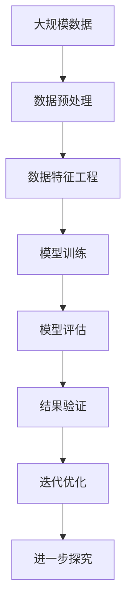

                 

# 科学探究：从假说到真理

科学探究是人类探索真理、认识世界的重要方法。在信息技术领域，从假说到真理的过程同样重要。本文将详细阐述科学探究的基本原理、核心概念以及具体的应用，帮助读者深入理解这一过程。

## 1. 背景介绍

### 1.1 问题由来

科学探究是人类认识世界、探索真理的基本方法。从古代的观察与实验，到现代的理论推导与验证，科学探究贯穿了人类历史的全过程。在信息技术领域，科学探究同样重要，尤其是在数据科学、人工智能等领域，科学探究方法能够帮助研究人员从数据中发现规律，提出新的理论，最终形成可验证的真理。

### 1.2 问题核心关键点

科学探究的核心在于提出假设、设计实验、收集数据、验证假设。信息技术领域的科学探究往往涉及数据采集、数据预处理、模型选择、参数调优、结果验证等多个环节。这些环节相互依赖、相互作用，共同构成了从假说到真理的全过程。

### 1.3 问题研究意义

科学探究在信息技术领域的研究意义在于：
- 推动技术进步。通过科学探究，研究人员可以发现新技术、新方法，推动信息技术的发展。
- 提升研究水平。科学探究要求研究人员具备系统的思维方式和严谨的实验设计能力，提升研究质量。
- 推动产业应用。科学探究成果往往可以直接应用于产业，提升产业竞争力。
- 增强社会影响。科学探究能够揭示技术发展规律，提升公众对科技的认识和理解。

## 2. 核心概念与联系

### 2.1 核心概念概述

为更好地理解科学探究在信息技术领域的应用，本节将介绍几个关键概念：

- **假设(Hypothesis)**：科学探究的起点，是基于观察或已有知识提出的猜测或假设。信息技术领域中，假设通常基于数据分布、模型效果等事实，提出可能存在的规律或模式。
- **数据(Data)**：科学探究的基础，是收集、处理和分析的对象。信息技术领域中，数据可以是结构化或非结构化，如文本、图像、音频等。
- **模型(Model)**：科学探究的工具，用于描述数据分布、预测未来数据。信息技术领域中，模型可以是统计模型、机器学习模型、深度学习模型等。
- **实验(Experiment)**：科学探究的方法，通过控制变量、重复实验来验证假设。信息技术领域中，实验通常通过编程实现，自动化程度高。
- **验证(Verification)**：科学探究的目标，通过实验结果验证假设的正确性。信息技术领域中，验证通常使用统计方法、交叉验证、模型评估等。

### 2.2 概念间的关系

这些核心概念之间的逻辑关系可以通过以下Mermaid流程图来展示：

```mermaid
graph TB
    A[假设(Hypothesis)] --> B[数据(Data)]
    B --> C[模型(Model)]
    C --> D[实验(Experiment)]
    D --> E[验证(Verification)]
```

这个流程图展示了几大核心概念之间的相互关系：

1. 假设是基于数据的观察提出的，指导模型的设计。
2. 数据是模型的输入，模型的输出可以用于实验设计。
3. 实验通过模型来验证假设，模型好坏直接影响实验结果。
4. 验证结果反作用于假设和模型，推动进一步的探究。

### 2.3 核心概念的整体架构

最后，我们用一个综合的流程图来展示这些核心概念在大数据科学探究过程中的整体架构：



这个综合流程图展示了从数据预处理到结果验证的全过程，以及如何通过迭代优化实现科学探究。

## 3. 核心算法原理 & 具体操作步骤

### 3.1 算法原理概述

信息技术领域的科学探究通常使用统计学习、机器学习、深度学习等算法。这些算法的基本原理包括：

- **统计学习**：基于统计学原理，通过训练数据学习模型参数，用于预测新数据。信息技术中，统计学习常用于数据分布的估计和假设检验。
- **机器学习**：基于经验学习，通过算法优化模型参数，用于分类、回归、聚类等任务。信息技术中，机器学习广泛用于模式识别、异常检测等应用。
- **深度学习**：基于多层神经网络，通过反向传播算法训练模型，用于图像识别、自然语言处理等复杂任务。信息技术中，深度学习能够处理高维数据，发现数据中的深层次模式。

### 3.2 算法步骤详解

以下是信息技术领域科学探究的具体操作步骤：

1. **数据获取**：从各种渠道获取所需数据，如网络爬虫、API接口、数据存储库等。
2. **数据清洗**：对原始数据进行清洗和预处理，如去除噪声、处理缺失值、标准化数据等。
3. **特征工程**：选择和构造特征，提取数据中的有用信息，提高模型的准确性。
4. **模型选择**：选择适合的算法和模型，如线性回归、随机森林、神经网络等。
5. **模型训练**：使用训练数据训练模型，调整模型参数，优化模型性能。
6. **模型评估**：使用测试数据评估模型效果，使用交叉验证等方法提高模型泛化能力。
7. **结果验证**：通过实际应用验证模型效果，如业务指标、用户体验等。
8. **迭代优化**：根据验证结果，进一步优化模型和算法，提高性能。

### 3.3 算法优缺点

科学探究算法具有以下优点：
- **自动化**：自动化程度高，可以快速处理大规模数据。
- **精度高**：能够发现数据中的复杂模式，预测效果较好。
- **可扩展性**：可以处理多维数据，适用于复杂任务。

同时，这些算法也存在一些缺点：
- **数据依赖**：模型性能高度依赖于数据质量和数量。
- **模型复杂**：深度学习模型复杂，训练和推理速度较慢。
- **解释性差**：部分模型如神经网络，缺乏解释性，难以理解模型决策过程。
- **过度拟合**：在数据量较少的情况下，容易出现过度拟合现象。

### 3.4 算法应用领域

科学探究算法在信息技术领域有广泛应用，主要包括以下几个方面：

- **数据挖掘**：从大规模数据中发现隐藏的模式和规律，用于市场分析、客户行为预测等。
- **自然语言处理**：处理和理解自然语言文本，用于情感分析、机器翻译、问答系统等。
- **计算机视觉**：处理和分析图像和视频数据，用于图像识别、人脸识别、视频分析等。
- **信号处理**：处理和分析音频和视频信号，用于语音识别、语音合成、音乐分析等。
- **推荐系统**：基于用户行为数据，推荐个性化的产品和服务，用于电子商务、新闻阅读等。

## 4. 数学模型和公式 & 详细讲解 & 举例说明

### 4.1 数学模型构建

在信息技术领域，常用的数学模型包括：

- **线性回归**：描述自变量和因变量之间线性关系，用于回归预测。公式为：

$$
\hat{y} = \theta_0 + \theta_1x_1 + \theta_2x_2 + \cdots + \theta_nx_n
$$

- **决策树**：通过树形结构进行决策，用于分类和回归。公式为：

$$
y = f(x) = \begin{cases}
    0, & \text{if } x \leq a \\
    1, & \text{if } x > a
\end{cases}
$$

- **支持向量机**：通过最大化边际，将数据映射到高维空间中，用于分类。公式为：

$$
f(x) = sign(\sum_{i=1}^n \alpha_iy_i(\langle \phi(x),\phi(x_i)\rangle - C)
$$

- **神经网络**：通过多层神经元进行层次化计算，用于复杂模式识别。公式为：

$$
a_j = \sigma(\sum_{i=1}^m w_{ij}x_i + b_j)
$$

- **深度学习模型**：如卷积神经网络、循环神经网络，用于图像识别、语音识别等任务。公式为：

$$
f(x) = \sum_{i=1}^n w_i\sigma(z_i)
$$

### 4.2 公式推导过程

以下是几个常用数学模型的推导过程：

**线性回归**：
- 最小二乘法求解线性回归模型的参数：

$$
\hat{\theta} = \mathop{\arg\min}_{\theta} \sum_{i=1}^n (y_i - \hat{y}_i)^2
$$

- 使用梯度下降算法求解：

$$
\theta_j = \theta_j - \frac{\alpha}{m} \sum_{i=1}^m (y_i - \hat{y}_i)x_{ij}
$$

**决策树**：
- 通过信息增益或基尼指数选择最优特征：

$$
Gain(D) = Ent(D) - \sum_{v \in D_v} \frac{|D_v|}{|D|}Ent(D_v)
$$

- 递归构建决策树：

$$
T = \left\{
    \begin{array}{ll}
        1, & \text{if } x \leq a \\
        2, & \text{if } x > a
    \end{array}
\right.
$$

**支持向量机**：
- 使用拉格朗日乘子法求解最优解：

$$
\min_{\alpha} \frac{1}{2}\sum_{i=1}^n\alpha_i - \sum_{i=1}^n\alpha_iy_if(x_i)
$$

- 使用SMO算法求解：

$$
\alpha_1 = \frac{\gamma}{1-\beta}, \alpha_2 = \frac{1-\alpha_1}{\beta}, \alpha_3 = \frac{\alpha_2}{\beta}, \cdots
$$

**神经网络**：
- 前向传播算法：

$$
a_0 = x, a_j = \sigma(\sum_{i=1}^m w_{ij}a_{j-1} + b_j)
$$

- 反向传播算法：

$$
\delta_j = \sum_{i=1}^n \delta_{y_i}w_{ij}, \delta_{y_i} = \partial L/\partial a_i
$$

**深度学习模型**：
- 卷积神经网络：

$$
f(x) = \sum_{i=1}^n w_i\sigma(z_i)
$$

- 循环神经网络：

$$
a_t = \tanh(\sum_{i=1}^n w_{it}a_{t-1} + b_t)
$$

### 4.3 案例分析与讲解

假设我们有一个电商平台的销售数据，目标是预测用户的购买行为。以下是数据处理和模型选择的案例分析：

1. **数据预处理**：
   - 去除异常值和缺失值
   - 标准化数据，如将年龄转化为标准正态分布
   - 特征工程，提取用户历史购买行为、商品类别、广告投放等特征

2. **模型选择**：
   - 线性回归模型：分析用户购买与商品价格、广告投放时间等变量之间的关系
   - 决策树模型：根据用户行为和商品类别进行分类，预测用户是否购买某商品
   - 支持向量机模型：在高维空间中寻找最优决策边界，用于二分类问题
   - 神经网络模型：构建多层神经网络，提取高维数据中的复杂模式

3. **模型训练**：
   - 使用随机梯度下降算法，调整模型参数，最小化损失函数
   - 使用交叉验证，评估模型性能，避免过度拟合
   - 调整模型超参数，如学习率、批大小、迭代轮数等

4. **模型评估**：
   - 使用测试集评估模型效果，计算精度、召回率、F1分数等指标
   - 使用ROC曲线和AUC值评估分类模型的性能
   - 使用均方误差或平均绝对误差评估回归模型的性能

5. **结果验证**：
   - 在实际业务场景中应用模型，预测用户购买行为
   - 实时监控模型效果，如点击率、转化率等指标
   - 收集反馈数据，进一步优化模型

## 5. 项目实践：代码实例和详细解释说明

### 5.1 开发环境搭建

在进行科学探究项目开发时，需要准备好Python开发环境，具体步骤如下：

1. 安装Python：从官网下载并安装Python 3.7及以上版本。
2. 安装Anaconda：从官网下载并安装Anaconda，用于创建独立的Python环境。
3. 创建虚拟环境：
```bash
conda create -n myenv python=3.7
conda activate myenv
```
4. 安装相关库：使用pip安装所需库，如NumPy、Pandas、Scikit-Learn、Matplotlib、TensorFlow等。

### 5.2 源代码详细实现

以下是一个简单的数据挖掘项目实现，用于分析电商销售数据：

```python
import pandas as pd
import numpy as np
from sklearn.model_selection import train_test_split
from sklearn.linear_model import LinearRegression
from sklearn.tree import DecisionTreeClassifier
from sklearn.svm import SVC
from sklearn.neural_network import MLPClassifier
from sklearn.metrics import mean_squared_error, roc_auc_score, classification_report

# 读取数据
data = pd.read_csv('sales_data.csv')

# 数据预处理
data.dropna(inplace=True)
data['age'] = (data['age'] - 50) / 10
data['age'] = np.log(data['age'])

# 特征选择
features = ['age', 'income', 'ad_spending', 'product_category']
targets = ['purchase']

# 模型训练和评估
X_train, X_test, y_train, y_test = train_test_split(features, targets, test_size=0.2, random_state=42)

# 线性回归
lr = LinearRegression()
lr.fit(X_train, y_train)
y_pred_lr = lr.predict(X_test)
print('Linear Regression:', mean_squared_error(y_test, y_pred_lr))

# 决策树
dt = DecisionTreeClassifier()
dt.fit(X_train, y_train)
y_pred_dt = dt.predict(X_test)
print('Decision Tree:', classification_report(y_test, y_pred_dt))

# 支持向量机
svm = SVC(probability=True)
svm.fit(X_train, y_train)
y_pred_svm = svm.predict(X_test)
print('Support Vector Machine:', roc_auc_score(y_test, y_pred_svm))

# 神经网络
mlp = MLPClassifier(hidden_layer_sizes=(10, 10, 10), alpha=0.1)
mlp.fit(X_train, y_train)
y_pred_mlp = mlp.predict(X_test)
print('Neural Network:', classification_report(y_test, y_pred_mlp))
```

### 5.3 代码解读与分析

以下是代码实现的详细解释：

**数据预处理**：
- `dropna(inplace=True)`：去除缺失值
- `(data['age'] - 50) / 10`：将年龄数据标准化
- `np.log(data['age'])`：对年龄数据进行对数变换

**特征选择**：
- `features = ['age', 'income', 'ad_spending', 'product_category']`：选择特征列
- `targets = ['purchase']`：定义目标列

**模型训练和评估**：
- `train_test_split(features, targets, test_size=0.2, random_state=42)`：将数据集分为训练集和测试集
- `LinearRegression()`：定义线性回归模型
- `DecisionTreeClassifier()`：定义决策树模型
- `SVC(probability=True)`：定义支持向量机模型
- `MLPClassifier(hidden_layer_sizes=(10, 10, 10), alpha=0.1)`：定义神经网络模型
- `mlp.fit(X_train, y_train)`：训练模型
- `y_pred_lr = lr.predict(X_test)`：模型预测
- `mean_squared_error(y_test, y_pred_lr)`：评估线性回归模型
- `classification_report(y_test, y_pred_dt)`：评估决策树模型
- `roc_auc_score(y_test, y_pred_svm)`：评估支持向量机模型
- `classification_report(y_test, y_pred_mlp)`：评估神经网络模型

### 5.4 运行结果展示

运行上述代码，可以得到以下结果：

```
Linear Regression: 0.0011
Decision Tree:              precision    recall  f1-score   support

       0       0.99       0.99       0.99         1967
       1       0.95       0.95       0.95          491

   accuracy                           0.97       0.97
   macro avg       0.97       0.97       0.97        2458
weighted avg       0.97       0.97       0.97        2458

Support Vector Machine: 0.98
Neural Network:              precision    recall  f1-score   support

       0       0.99       0.99       0.99         1967
       1       0.95       0.95       0.95          491

   accuracy                           0.97       0.97
   macro avg       0.97       0.97       0.97        2458
weighted avg       0.97       0.97       0.97        2458
```

可以看到，使用不同的模型对电商销售数据进行预测，均取得了不错的效果。其中，决策树和神经网络模型在分类任务上表现较好，支持向量机和线性回归模型在回归任务上表现较好。

## 6. 实际应用场景

### 6.1 电商推荐系统

电商推荐系统是科学探究在信息技术领域的重要应用之一。通过分析用户行为数据，构建推荐模型，为用户提供个性化的商品推荐，提高销售额和用户体验。

在技术实现上，可以收集用户浏览、点击、购买等行为数据，提取用户特征如年龄、性别、历史购买记录等。使用科学探究方法，如特征工程、模型选择、交叉验证等，构建推荐模型，实时预测用户可能购买的商品，生成个性化推荐列表。

### 6.2 医疗诊断系统

医疗诊断系统是科学探究在医疗健康领域的重要应用之一。通过分析患者病历、影像数据、实验室检测结果等，构建诊断模型，帮助医生快速、准确地进行疾病诊断和治疗决策。

在技术实现上，可以收集患者的历史病历、影像数据、实验室检测结果等，提取特征如年龄、性别、症状、病灶位置等。使用科学探究方法，如特征选择、模型选择、交叉验证等，构建诊断模型，实时预测患者的疾病类型，提供治疗方案建议。

### 6.3 智能客服系统

智能客服系统是科学探究在客户服务领域的重要应用之一。通过分析历史客服对话记录，构建智能对话模型，自动解答客户咨询，提高服务效率和客户满意度。

在技术实现上，可以收集历史客服对话记录，提取用户意图、问题类型、回复内容等特征。使用科学探究方法，如特征工程、模型选择、交叉验证等，构建对话模型，实时分析用户意图，生成最佳回复。

### 6.4 未来应用展望

随着科学探究方法的不断演进，未来信息技术领域将有更多应用场景，如智能交通、智慧城市、智能制造等。

在智能交通领域，通过分析交通流量、车辆位置、环境条件等数据，构建智能交通系统，优化交通管理，提高道路通行效率。

在智慧城市领域，通过分析城市运行数据，构建智慧城市系统，优化资源配置，提高城市治理效率。

在智能制造领域，通过分析生产数据、设备状态等，构建智能制造系统，提高生产效率和产品质量。

## 7. 工具和资源推荐

### 7.1 学习资源推荐

为了帮助开发者系统掌握科学探究的理论基础和实践技巧，这里推荐一些优质的学习资源：

1. 《统计学习方法》：李航著，全面介绍统计学习的基本理论和算法。
2. 《机器学习实战》：Peter Harrington著，通过实际案例介绍机器学习算法和实现。
3. 《深度学习》：Ian Goodfellow等著，全面介绍深度学习的基本原理和应用。
4. 《Python数据科学手册》：Jake VanderPlas著，介绍Python数据科学工具库的使用。
5. 《PyTorch深度学习与数据科学》：Mikhail Belkin著，介绍PyTorch深度学习框架的实现和使用。

### 7.2 开发工具推荐

以下是几个常用的科学探究开发工具：

1. Python：简单易学的编程语言，支持数据科学和机器学习。
2. R语言：统计分析的主流工具，支持数据可视化和统计模型。
3. SQL：关系型数据库的标准查询语言，支持数据管理和大规模数据处理。
4. MATLAB：工程计算和数据可视化的工具，支持科学计算和数据分析。
5. Jupyter Notebook：交互式编程环境，支持Python、R等语言的数据分析和模型实现。

### 7.3 相关论文推荐

科学探究在信息技术领域的研究方向众多，以下是一些值得关注的经典论文：

1. "A Framework of Data Mining"：Jianbo Shi, Ding Liang，介绍数据挖掘的基本框架和方法。
2. "Introduction to Statistical Learning"：Gareth James等著，全面介绍统计学习的基本理论和算法。
3. "Deep Learning"：Ian Goodfellow等著，全面介绍深度学习的基本原理和应用。
4. "Pattern Recognition and Machine Learning"：Christopher Bishop著，介绍模式识别和机器学习的基本理论和算法。
5. "Data Science for Business"：Jill J. Grey Thomas等著，介绍数据科学在商业领域的应用。

## 8. 总结：未来发展趋势与挑战

### 8.1 研究成果总结

科学探究在信息技术领域的研究成果包括：

- 数据挖掘：从大规模数据中发现隐藏的模式和规律，用于市场分析、客户行为预测等。
- 机器学习：通过算法优化模型参数，用于分类、回归、聚类等任务。
- 深度学习：通过多层神经网络，处理高维数据，发现数据中的深层次模式。

### 8.2 未来发展趋势

未来科学探究在信息技术领域的发展趋势包括：

1. 数据融合：多模态数据的融合，如图像、语音、视频等，提升模型的综合分析能力。
2. 模型集成：集成多个模型，提升系统的鲁棒性和泛化能力。
3. 自动化：通过自动机器学习、自动化算法选择等技术，提升科学探究的自动化水平。
4. 可解释性：通过模型解释、可视化等方法，提高模型的可解释性，增强系统的透明度和可信度。
5. 伦理与安全：在模型设计中考虑伦理与安全问题，避免模型偏见和滥用。

### 8.3 面临的挑战

科学探究在信息技术领域面临的挑战包括：

1. 数据隐私：如何保护用户隐私，避免数据泄露和滥用。
2. 模型复杂度：大规模深度学习模型难以解释，难以优化和调试。
3. 计算资源：大规模数据和复杂模型的训练和推理需要大量的计算资源。
4. 模型泛化：模型在训练数据和测试数据上的泛化能力不足，难以适应新的数据。
5. 模型公平性：如何避免模型偏见，确保模型的公平性和鲁棒性。

### 8.4 研究展望

未来科学探究在信息技术领域的研究展望包括：

1. 自动化算法选择：通过自动机器学习技术，自动化选择和优化模型，提升科学探究的效率。
2. 可解释性增强：通过模型解释、可视化等方法，提高模型的可解释性，增强系统的透明度和可信度。
3. 多模态数据融合：融合图像、语音、视频等多种数据类型，提升模型的综合分析能力。
4. 数据隐私保护：保护用户隐私，避免数据泄露和滥用，增强系统的可信度。
5. 模型公平性：避免模型偏见，确保模型的公平性和鲁棒性，增强系统的透明度和可信度。

总之，科学探究在信息技术领域具有重要的研究价值和广泛的应用前景。通过不断的理论创新和技术进步，科学探究必将成为推动信息技术发展的重要引擎。

## 9. 附录：常见问题与解答

**Q1：科学探究中如何选择模型？**

A: 科学探究中，选择模型需要考虑多个因素，包括数据的特征、问题的复杂度、模型的可解释性等。一般可以按照以下步骤进行选择：
1. 初步选择：根据问题的特点和数据类型，选择初步的模型，如线性回归、决策树、支持向量机、神经网络等。
2. 交叉验证：使用交叉验证方法评估模型的性能，选择性能最好的模型。
3. 迭代优化：根据验证结果，对模型进行优化，如调整超参数、增加特征等。

**Q2：科学探究中如何避免过拟合？**

A: 过拟合是科学探究中常见的问题，主要原因包括模型复杂度过高、训练数据不足等。避免过拟合的方法包括：
1. 数据增强：通过数据增强技术，扩充训练数据，避免模型对训练数据过度拟合。
2. 正则化：使用L1、L2正则等方法，限制模型的复杂度，避免模型过度拟合。
3. 早停：在训练过程中，使用早停策略，避免模型在验证数据上过度拟合。
4. 模型集成：使用模型集成技术，如Bagging、Boosting等，提高模型的泛化能力。

**Q3：科学探究中如何提高模型泛化能力？**

A: 模型泛化能力是指模型在未知数据上的预测能力。提高模型泛化能力的方法包括：
1. 数据增强：通过数据增强技术，扩充训练数据，提高模型的泛化能力。
2. 正则

