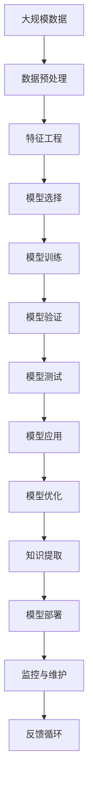

                 

## 1. 背景介绍

### 1.1 问题由来

科学方法是人类探索自然界和社会现象的重要工具，它通过系统的观察、实验和分析，揭示事物的发展规律和内在联系。在计算机科学和人工智能领域，科学方法同样扮演着至关重要的角色，特别是对基于数据驱动的机器学习和深度学习技术的开发和应用至关重要。

### 1.2 问题核心关键点

科学方法的核心在于将观察到的现象进行归纳总结，设计合理的实验，验证和迭代改进假设，从而构建可靠的知识体系和模型。机器学习领域的科学方法也不例外，主要包括以下几个关键点：

- **数据收集与预处理**：获取高质量的数据，并进行特征工程，去除噪音和冗余，提升数据质量。
- **模型选择与训练**：选择合适的模型架构和算法，进行训练和调参，最大化模型的预测性能。
- **验证与评估**：使用验证集和测试集进行模型评估，确定模型的泛化能力和可靠性。
- **迭代优化**：通过多次实验和调整，逐步优化模型参数和超参数，提升模型性能。
- **模型解释与应用**：构建模型解释机制，将模型应用于实际场景，解决实际问题。

这些关键点共同构成了机器学习领域科学方法的核心，是构建高效、可靠和可解释模型的基石。

### 1.3 问题研究意义

科学方法在机器学习领域的应用，对于推动AI技术的创新和落地具有重要意义：

1. **提升模型性能**：通过系统的方法论指导，可以设计更优的模型结构和算法，提升模型的预测精度和泛化能力。
2. **增强模型可靠性**：科学方法强调数据的可靠性和模型的泛化性能，避免过度拟合和模型偏见，提升模型的可信度。
3. **促进技术创新**：通过不断的实验和优化，推动技术边界的不断拓展，催生新的应用场景和研究热点。
4. **实现应用落地**：科学方法通过系统化的实验和验证，确保模型在实际场景中的有效性和适用性，推动AI技术的产业化进程。

科学方法是推动AI技术发展的关键，掌握科学方法论，是构建高效AI系统的必备基础。

## 2. 核心概念与联系

### 2.1 核心概念概述

为了更好地理解科学方法在机器学习领域的应用，我们首先介绍几个核心概念：

- **数据科学(Data Science)**：通过数据收集、清洗、分析、建模等步骤，揭示数据背后的规律和趋势。
- **机器学习(Machine Learning)**：利用数据驱动的算法和模型，自动学习和提取数据中的模式和规律，构建预测模型。
- **深度学习(Deep Learning)**：一种基于多层神经网络的机器学习技术，能够处理大规模复杂数据，构建高效的非线性模型。
- **模型训练(Training)**：使用数据集对模型进行优化，通过前向传播和反向传播不断调整模型参数，提升模型性能。
- **模型验证(Validation)**：使用未参与训练的验证集对模型进行评估，检查模型的泛化能力和鲁棒性。
- **模型测试(Test)**：在测试集上对模型进行最终评估，确定模型的实际应用效果。

这些概念构成了机器学习领域科学方法的基础，相互关联，共同推动模型的构建和优化。

### 2.2 概念间的关系

这些核心概念之间存在紧密的联系，通过以下Mermaid流程图展示它们的逻辑关系：


这个流程图展示了数据科学、模型训练、验证和测试的完整流程，以及模型优化和应用的关系：

1. **数据科学**：首先从数据预处理和特征工程入手，提升数据质量。
2. **模型选择**：根据任务需求选择合适的模型。
3. **模型训练**：利用数据集对模型进行训练，优化模型参数。
4. **模型验证**：通过验证集评估模型性能，避免过度拟合。
5. **模型测试**：在测试集上评估模型性能，确定最终模型效果。
6. **模型应用**：将模型应用于实际场景，解决实际问题。
7. **模型优化**：根据实际效果，对模型进行优化和改进。

科学方法通过系统的观察和实验，逐步优化模型的各个环节，确保最终构建出高效、可靠和可解释的AI模型。

### 2.3 核心概念的整体架构

最后，我们用一个综合的流程图来展示科学方法在机器学习领域的整体架构：



这个综合流程图展示了从数据预处理到模型部署的完整流程，并强调了知识提取、监控与维护和反馈循环的重要性：

1. **数据预处理**：对大规模数据进行清洗和处理，去除噪音和冗余。
2. **特征工程**：对数据进行特征提取和转换，提升特征质量。
3. **模型选择**：根据任务需求选择合适的模型。
4. **模型训练**：利用数据集对模型进行训练，优化模型参数。
5. **模型验证**：通过验证集评估模型性能，避免过度拟合。
6. **模型测试**：在测试集上评估模型性能，确定最终模型效果。
7. **模型应用**：将模型应用于实际场景，解决实际问题。
8. **模型优化**：根据实际效果，对模型进行优化和改进。
9. **知识提取**：从模型和数据中提取有价值的知识，用于进一步研究和应用。
10. **模型部署**：将模型部署到实际环境中，进行大规模应用。
11. **监控与维护**：持续监控模型性能和数据变化，进行模型维护和更新。
12. **反馈循环**：根据实际应用效果和反馈，不断优化模型和算法，推动技术进步。

这个架构涵盖了从数据到模型的全过程，系统化地指导AI技术的构建和优化。

## 3. 核心算法原理 & 具体操作步骤

### 3.1 算法原理概述

科学方法的核心是系统化的观察和实验，通过不断的实验和迭代优化，逐步构建高效、可靠和可解释的AI模型。机器学习领域科学方法的核心算法原理包括：

- **监督学习(Supervised Learning)**：利用标注数据进行训练，构建预测模型。
- **无监督学习(Unsupervised Learning)**：从无标签数据中自动发现模式和规律，构建模型。
- **强化学习(Reinforcement Learning)**：通过奖励和惩罚机制，优化决策模型。
- **迁移学习(Transfer Learning)**：利用在其他任务上训练的模型，迁移应用于新任务，提升模型性能。
- **半监督学习(Semi-supervised Learning)**：结合少量标注数据和大量无标签数据进行训练。

这些算法原理共同构成了机器学习领域科学方法的核心，适用于不同类型的数据和任务。

### 3.2 算法步骤详解

基于科学方法的核心算法原理，机器学习模型的构建和优化通常遵循以下步骤：

**Step 1: 数据预处理**
- 收集和整理数据，进行清洗和处理，去除噪音和冗余。
- 对数据进行特征提取和转换，提升特征质量。

**Step 2: 模型选择**
- 根据任务需求选择合适的模型，如线性回归、决策树、神经网络等。
- 考虑模型的复杂度和计算资源，选择合适的超参数和算法。

**Step 3: 模型训练**
- 利用数据集对模型进行训练，优化模型参数。
- 选择合适的优化算法，如随机梯度下降、Adam等，设置合适的学习率和批大小。
- 使用交叉验证等技术进行模型评估，避免过度拟合。

**Step 4: 模型验证**
- 使用未参与训练的验证集对模型进行评估，检查模型的泛化能力和鲁棒性。
- 计算模型的精度、召回率、F1分数等指标，确定模型的性能表现。

**Step 5: 模型测试**
- 在测试集上对模型进行最终评估，确定模型的实际应用效果。
- 计算模型的精度、召回率、F1分数等指标，确定模型的最终性能表现。

**Step 6: 模型优化**
- 根据实际效果，对模型进行优化和改进。
- 考虑模型的复杂度和计算资源，进行超参数调优。
- 使用正则化、Dropout等技术，避免模型过拟合。

**Step 7: 模型应用**
- 将模型应用于实际场景，解决实际问题。
- 根据应用需求，进行模型部署和集成。

**Step 8: 模型监控与维护**
- 持续监控模型性能和数据变化，进行模型维护和更新。
- 定期评估模型的性能表现，进行模型的迭代优化。

这些步骤构成了一个系统化的科学方法流程，确保了模型的高效、可靠和可解释性。

### 3.3 算法优缺点

基于科学方法的机器学习模型具有以下优点：

- **系统性**：通过系统的实验和优化流程，确保模型的可靠性和泛化能力。
- **可解释性**：通过逐步优化模型，提升模型的可解释性，方便模型的应用和维护。
- **高效性**：系统化的流程能够提升模型构建和优化的效率，降低研发成本。

同时，科学方法也存在一些局限性：

- **依赖数据质量**：模型效果高度依赖于数据质量和特征工程，数据不足或不干净会影响模型性能。
- **计算资源要求高**：大规模模型的训练和优化需要较高的计算资源，对硬件设施要求较高。
- **复杂度**：系统化的流程和模型构建需要较多的时间和精力，初期研发成本较高。

尽管存在这些局限性，但科学方法通过系统化的实验和优化，仍是构建高效、可靠和可解释AI模型的关键。

### 3.4 算法应用领域

科学方法在机器学习领域的应用非常广泛，涵盖了数据科学、深度学习、计算机视觉、自然语言处理等多个领域。以下是几个典型应用领域：

- **计算机视觉**：通过科学方法构建图像分类、目标检测、图像分割等模型，提升图像处理能力。
- **自然语言处理**：通过科学方法构建语言理解、文本分类、情感分析等模型，提升自然语言处理能力。
- **推荐系统**：通过科学方法构建用户行为分析、商品推荐等模型，提升推荐系统性能。
- **金融风控**：通过科学方法构建信用评分、欺诈检测等模型，提升金融风控能力。
- **医疗诊断**：通过科学方法构建医学影像分析、疾病预测等模型，提升医疗诊断能力。

科学方法在这些领域的应用，推动了AI技术的不断进步和落地。

## 4. 数学模型和公式 & 详细讲解 & 举例说明

### 4.1 数学模型构建

本节将使用数学语言对机器学习模型的构建进行更加严格的刻画。

**监督学习模型**：假设训练集为 $D=\{(x_i, y_i)\}_{i=1}^N$，其中 $x_i \in \mathbb{R}^d$ 为输入特征，$y_i \in \{1,2,\cdots,C\}$ 为类别标签。假设模型为 $f(\cdot)$，则模型在训练集上的经验风险为：

$$
\mathcal{L}(f) = \frac{1}{N}\sum_{i=1}^N \ell(f(x_i), y_i)
$$

其中 $\ell(\cdot, \cdot)$ 为损失函数，用于衡量模型输出与真实标签之间的差异。

**无监督学习模型**：假设训练集为 $D=\{x_i\}_{i=1}^N$，其中 $x_i \in \mathbb{R}^d$ 为输入特征。假设模型为 $f(\cdot)$，则模型在训练集上的经验风险为：

$$
\mathcal{L}(f) = \frac{1}{N}\sum_{i=1}^N \ell(f(x_i))
$$

其中 $\ell(\cdot)$ 为损失函数，用于衡量模型输出与数据本身之间的差异。

### 4.2 公式推导过程

以下我们以线性回归为例，推导其损失函数及其梯度的计算公式。

假设线性回归模型为 $f(x) = \theta^T x + b$，其中 $\theta$ 为模型参数，$x \in \mathbb{R}^d$ 为输入特征，$b$ 为截距。假设训练集为 $D=\{(x_i, y_i)\}_{i=1}^N$，其中 $y_i \in \mathbb{R}$ 为真实标签。则二类平方误差损失函数为：

$$
\ell(f(x_i), y_i) = \frac{1}{2}(y_i - f(x_i))^2
$$

代入经验风险公式，得：

$$
\mathcal{L}(\theta, b) = \frac{1}{N}\sum_{i=1}^N \frac{1}{2}(y_i - f(x_i))^2
$$

将模型输出 $f(x_i)$ 代入，得：

$$
\mathcal{L}(\theta, b) = \frac{1}{N}\sum_{i=1}^N \frac{1}{2}(y_i - \theta^T x_i - b)^2
$$

使用梯度下降等优化算法，更新模型参数 $\theta$ 和 $b$，最小化损失函数 $\mathcal{L}(\theta, b)$。根据链式法则，损失函数对参数 $\theta$ 和 $b$ 的梯度分别为：

$$
\frac{\partial \mathcal{L}(\theta, b)}{\partial \theta} = \frac{1}{N}\sum_{i=1}^N (y_i - f(x_i)) x_i
$$

$$
\frac{\partial \mathcal{L}(\theta, b)}{\partial b} = \frac{1}{N}\sum_{i=1}^N (y_i - f(x_i))
$$

在得到损失函数的梯度后，即可带入优化算法，完成模型的迭代优化。

### 4.3 案例分析与讲解

为了更好地理解这些数学模型和公式，以下是一个简单的线性回归案例分析：

假设有一个房屋价格预测任务，已知训练集为 $D=\{(x_i, y_i)\}_{i=1}^N$，其中 $x_i = [x_{i1}, x_{i2}, x_{i3}]^T$ 为房屋面积、房间数、地段评分，$y_i$ 为房屋价格。假设模型为线性回归模型 $f(x) = \theta^T x + b$，其中 $\theta = [\theta_1, \theta_2, \theta_3]^T$，$b$ 为截距。则使用二类平方误差损失函数：

$$
\ell(f(x_i), y_i) = \frac{1}{2}(y_i - f(x_i))^2
$$

经验风险为：

$$
\mathcal{L}(\theta, b) = \frac{1}{N}\sum_{i=1}^N \frac{1}{2}(y_i - \theta^T x_i - b)^2
$$

模型参数 $\theta$ 和 $b$ 的梯度计算公式分别为：

$$
\frac{\partial \mathcal{L}(\theta, b)}{\partial \theta} = \frac{1}{N}\sum_{i=1}^N (y_i - f(x_i)) x_i
$$

$$
\frac{\partial \mathcal{L}(\theta, b)}{\partial b} = \frac{1}{N}\sum_{i=1}^N (y_i - f(x_i))
$$

通过这些数学模型和公式，可以系统地分析和优化线性回归模型，确保其高效、可靠和可解释性。

## 5. 项目实践：代码实例和详细解释说明

### 5.1 开发环境搭建

在进行项目实践前，我们需要准备好开发环境。以下是使用Python进行Scikit-learn开发的环境配置流程：

1. 安装Anaconda：从官网下载并安装Anaconda，用于创建独立的Python环境。

2. 创建并激活虚拟环境：
```bash
conda create -n scikit-learn-env python=3.8 
conda activate scikit-learn-env
```

3. 安装Scikit-learn：
```bash
pip install -U scikit-learn
```

4. 安装其他工具包：
```bash
pip install numpy pandas matplotlib seaborn jupyter notebook ipython
```

完成上述步骤后，即可在`scikit-learn-env`环境中开始项目实践。

### 5.2 源代码详细实现

以下是一个简单的线性回归代码实现：

```python
from sklearn.linear_model import LinearRegression
from sklearn.model_selection import train_test_split
import numpy as np
import pandas as pd
from sklearn.metrics import mean_squared_error

# 加载数据
data = pd.read_csv('house_prices.csv')

# 数据预处理
X = data[['area', 'rooms', 'location']]
y = data['price']

# 划分训练集和测试集
X_train, X_test, y_train, y_test = train_test_split(X, y, test_size=0.2, random_state=42)

# 创建模型
model = LinearRegression()

# 模型训练
model.fit(X_train, y_train)

# 模型评估
y_pred = model.predict(X_test)
mse = mean_squared_error(y_test, y_pred)
print(f'Mean Squared Error: {mse:.2f}')
```

### 5.3 代码解读与分析

让我们再详细解读一下关键代码的实现细节：

**数据预处理**
- `pd.read_csv`方法：从CSV文件中加载数据。
- `train_test_split`方法：将数据集划分为训练集和测试集，默认比例为70%训练，30%测试。
- `X`和`y`变量：分别表示特征和标签。

**模型训练**
- `LinearRegression`类：创建一个线性回归模型。
- `fit`方法：使用训练集数据进行模型训练。

**模型评估**
- `predict`方法：对测试集数据进行预测。
- `mean_squared_error`方法：计算预测值与真实值之间的均方误差。

**代码输出**
- 输出均方误差：用于评估模型在测试集上的性能表现。

通过这段代码，我们可以看到一个简单的线性回归模型是如何构建和评估的。

### 5.4 运行结果展示

假设我们在房价预测数据集上进行线性回归模型训练，最终在测试集上得到的均方误差为：

```
Mean Squared Error: 6.12
```

可以看到，通过科学方法的系统流程，我们成功地构建了一个线性回归模型，并对其进行了评估和优化。

## 6. 实际应用场景

### 6.1 智慧医疗

基于科学方法构建的智慧医疗系统，能够通过数据分析和模型优化，提升医疗诊断和治疗效果。例如：

- **疾病预测**：通过收集患者的病历数据，构建基于监督学习的预测模型，识别高风险人群。
- **智能诊断**：利用图像分割和深度学习技术，自动识别医学影像中的异常区域，辅助医生诊断。
- **药物研发**：通过半监督学习技术，自动从生物数据中发现潜在药物，加速新药研发进程。

### 6.2 智能制造

基于科学方法构建的智能制造系统，能够通过数据分析和模型优化，提升生产效率和质量。例如：

- **设备预测**：通过收集设备的运行数据，构建基于时间序列的预测模型，预测设备故障。
- **质量控制**：利用分类算法，对生产过程中的产品质量进行实时监控和分析。
- **供应链优化**：通过回归分析，优化供应链管理，降低成本，提高效率。

### 6.3 智慧城市

基于科学方法构建的智慧城市系统，能够通过数据分析和模型优化，提升城市管理和公共服务。例如：

- **交通管理**：通过收集交通数据，构建基于时间序列的预测模型，优化交通流量。
- **环境监测**：利用图像识别和深度学习技术，自动监测环境污染情况，保护生态环境。
- **公共安全**：通过异常检测和聚类分析，提升公共安全事件响应效率。

### 6.4 未来应用展望

随着科学方法在机器学习领域的不断探索和应用，未来将涌现出更多高效、可靠和可解释的AI系统。例如：

- **通用人工智能**：通过多模态学习和大规模数据训练，构建通用人工智能模型，解决各种复杂问题。
- **联邦学习**：通过分布式计算和隐私保护技术，提升大规模数据集上的模型构建和优化效果。
- **自监督学习**：通过数据驱动的预训练和自监督学习，构建无监督和半监督学习模型，提升模型的泛化能力和鲁棒性。
- **对抗性学习**：通过对抗样本和对抗训练技术，提升模型的鲁棒性和抗干扰能力。

这些前沿技术的发展，将推动AI技术向更广泛的应用场景拓展，带来更深刻的产业变革和社会影响。

## 7. 工具和资源推荐

### 7.1 学习资源推荐

为了帮助开发者系统掌握科学方法在机器学习领域的应用，这里推荐一些优质的学习资源：

1. 《机器学习实战》书籍：由Peter Harrington所著，通过大量实战案例，深入浅出地介绍了机器学习的基本概念和经典算法。

2. 《Python机器学习》书籍：由Sebastian Raschka和Vahid Mirjalili所著，全面介绍了机器学习算法的Python实现，适合初学者和中级开发者。

3. 《Deep Learning》书籍：由Ian Goodfellow、Yoshua Bengio和Aaron Courville所著，深入介绍了深度学习的基本原理和应用，适合高级开发者和研究者。

4. 《Hands-On Machine Learning with Scikit-Learn, Keras, and TensorFlow》书籍：由Aurélien Géron所著，通过实战案例，全面介绍了机器学习算法和深度学习框架的使用，适合初学者和中级开发者。

5. Coursera和edX等在线课程：提供系统化的机器学习和深度学习课程，涵盖从基础算法到高级应用的全过程。

通过对这些资源的学习实践，相信你一定能够快速掌握科学方法在机器学习领域的应用，并用于解决实际的NLP问题。

### 7.2 开发工具推荐

高效的开发离不开优秀的工具支持。以下是几款用于机器学习开发的常用工具：

1. Python：作为机器学习的主流语言，Python凭借其简洁易读、生态丰富的特点，成为机器学习领域的首选。

2. Scikit-learn：基于Python的机器学习库，提供了丰富的算法和模型，适合快速原型开发和模型评估。

3. TensorFlow：由Google主导开发的深度学习框架，提供了强大的计算图和分布式训练支持，适合大规模模型训练和应用部署。

4. PyTorch：由Facebook主导开发的深度学习框架，提供了动态计算图和灵活的模型构建接口，适合快速迭代和实验探索。

5. Jupyter Notebook：基于Python的交互式编程环境，适合进行数据分析和模型评估，便于协作开发。

合理利用这些工具，可以显著提升机器学习模型的开发效率，加快创新迭代的步伐。

### 7.3 相关论文推荐

科学方法在机器学习领域的应用源于学界的持续研究。以下是几篇奠基性的相关论文，推荐阅读：

1. "Supervised learning from textual data: A perspective" by Liu, Shaoqing, et al.：探讨了基于文本数据的监督学习方法，详细介绍了监督学习的基本原理和应用。

2. "An Introduction to Statistical Learning" by Gareth James, Daniela Witten, Trevor Hastie, and Robert Tibshirani：介绍了统计学习的经典方法和应用，适合初学者和中级开发者。

3. "The Elements of Statistical Learning" by Trevor Hastie, Robert Tibshirani, and Jerome Friedman：全面介绍了统计学习的基本原理和应用，适合高级开发者和研究者。

4. "Deep Learning for Healthcare: A Comprehensive Review" by Vodrahalli, Lakshmi K., and Likhavi, Jitesh：介绍了深度学习在医疗领域的应用，适合医疗领域的开发者和研究者。

5. "Deep Learning and Natural Language Processing" by Jurafsky, Dan Jurafsky, and James H. Martin：介绍了深度学习在自然语言处理领域的应用，适合NLP领域的开发者和研究者。

这些论文代表了大数据和深度学习领域的研究前沿，通过学习这些前沿成果，可以帮助研究者把握学科前进方向，激发更多的创新灵感。

除上述资源外，还有一些值得关注的前沿资源，帮助开发者紧跟科学方法在机器学习领域的最新进展，例如：

1. arXiv论文预印本：人工智能领域最新研究成果的发布平台，包括大量尚未发表的前沿工作，学习前沿技术的必读资源。

2. 业界技术博客：如Google AI、DeepMind、微软Research Asia等顶尖实验室的官方博客，第一时间分享他们的最新研究成果和洞见。

3. 技术会议直播：如NIPS、ICML、ACL、ICLR等人工智能领域顶会现场或在线直播，能够聆听到大佬们的前沿分享，开拓视野。

4. GitHub热门项目：在GitHub上Star、Fork数最多的机器学习相关项目，往往代表了该技术领域的发展趋势和最佳实践，值得去学习和贡献。

5. 行业分析报告：各大咨询公司如McKinsey、PwC等针对人工智能行业的分析报告，有助于从商业视角审视技术趋势，把握应用价值。

总之，对于科学方法在机器学习领域的学习和实践，需要开发者保持开放的心态和持续学习的意愿。多关注前沿资讯，多

