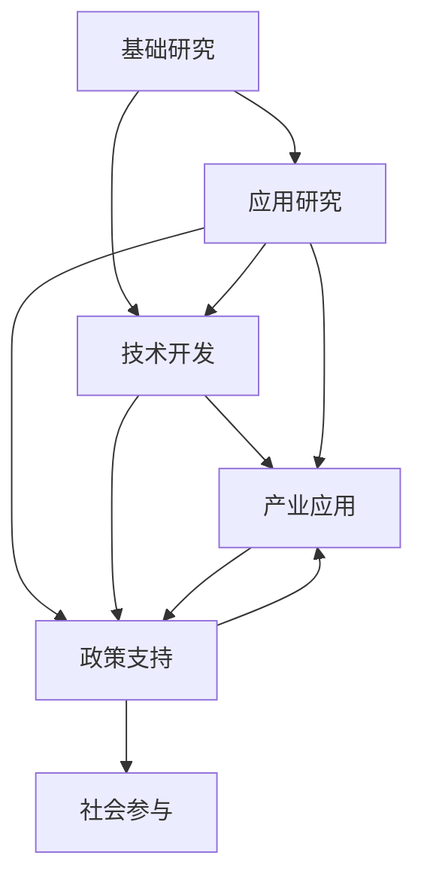
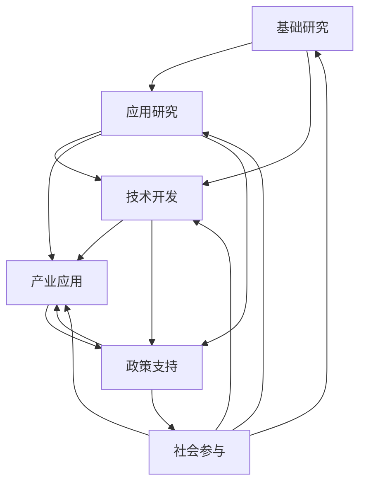

                 

## 1. 背景介绍

### 1.1 问题由来
科技创新是推动社会进步的关键动力。从工业革命到信息时代的浪潮，每一次技术变革都深刻地改变了人类社会的面貌。然而，随着全球人口的增长和资源环境的压力加剧，科技创新面临前所未有的挑战。如何通过技术手段解决这些问题，成为了当前社会进步的重大课题。

### 1.2 问题核心关键点
科技创新涉及多个层面，包括基础科学、应用研究、技术开发、产业应用等多个环节。其核心关键点在于：

1. **基础研究**：探寻自然和社会现象的本质规律，为科技创新提供理论支撑。
2. **应用研究**：将基础研究成果转化为具体的技术方案，解决实际问题。
3. **技术开发**：通过工程化手段，将技术方案实现为可操作的系统或产品。
4. **产业应用**：将技术产品投入实际应用，产生经济和社会效益。

### 1.3 问题研究意义
科技创新对社会进步具有深远意义：

1. **提升生产力**：科技创新能大幅提升生产效率，降低生产成本，推动经济增长。
2. **改善生活质量**：科技创新可解决环境污染、资源短缺等社会问题，提高人民生活质量。
3. **促进就业**：科技创新带动新兴产业的发展，创造大量就业机会。
4. **增强国际竞争力**：科技创新是国与国之间竞争的重要手段，可以增强国家的综合国力。
5. **推动文化发展**：科技创新促进了文化交流和融合，丰富了人类文明成果。

## 2. 核心概念与联系

### 2.1 核心概念概述

科技创新涉及多个概念，以下详细介绍这些关键概念及其相互联系：

1. **基础研究**：指对自然和社会现象进行深入研究，探索其内在规律和机制，为后续应用研究和技术开发奠定基础。

2. **应用研究**：将基础研究成果转化为具体的技术方案，解决实际问题。通常包括原型开发、实验验证、应用场景评估等步骤。

3. **技术开发**：通过工程化手段，将技术方案实现为可操作的系统或产品。这一过程包括硬件设计、软件实现、系统集成、测试验证等环节。

4. **产业应用**：将技术产品投入实际应用，产生经济和社会效益。产业应用需要考虑市场、用户、法规、环境等多方面因素。

5. **政策支持**：政府为促进科技创新，制定了一系列政策措施，包括资金投入、税收优惠、知识产权保护等。

6. **社会参与**：科技创新离不开社会各界的广泛参与，包括教育、媒体、公众等。社会参与有助于形成良好的创新氛围，促进科技成果的转化应用。

这些概念之间存在紧密的联系，形成一个有机的创新体系。以下通过Mermaid流程图展示这些概念的关系：



这个流程图展示了基础研究、应用研究、技术开发、产业应用、政策支持和社会参与六个概念之间的联系和互动。

### 2.2 概念间的关系

这些核心概念之间存在复杂的相互作用，共同推动科技创新。以下通过Mermaid流程图进一步展示这些概念之间的联系和作用机制：



这个流程图更加详细地展示了各概念之间的双向互动关系，反映了科技创新体系的动态特性。

## 3. 核心算法原理 & 具体操作步骤

### 3.1 算法原理概述

科技创新中的核心算法原理主要涉及以下几个方面：

1. **模型建立**：通过数学模型和仿真工具，建立对自然和社会现象的抽象描述，揭示其规律和特性。
2. **算法设计**：选择合适的算法模型和优化方法，对模型进行求解和验证。
3. **数据处理**：对实验数据和实际数据进行处理、清洗和分析，提取有价值的信息。
4. **系统实现**：将算法和模型转化为可操作的系统或产品，包括硬件设计、软件开发和集成测试。

### 3.2 算法步骤详解

科技创新的一般步骤如下：

1. **需求分析**：明确创新目标和需求，确定创新方向和范围。
2. **文献调研**：查阅相关文献，了解已有研究成果和技术进展。
3. **项目设计**：制定项目计划，明确技术路线和资源配置。
4. **实验验证**：通过实验验证技术方案的可行性和有效性。
5. **系统集成**：将实验验证的技术方案转化为可操作的系统或产品。
6. **测试评估**：对系统或产品进行测试评估，确保其性能和可靠性。
7. **产业应用**：将系统或产品投入实际应用，进行市场推广和用户反馈。
8. **持续改进**：根据用户反馈和市场需求，持续改进系统或产品，提升其性能和竞争力。

### 3.3 算法优缺点

科技创新中的算法具有以下优点：

1. **高效性**：通过数学模型和仿真工具，可以快速发现问题的本质规律，节省时间和成本。
2. **可验证性**：算法模型的求解和验证过程可重复、可验证，确保结果的可靠性和准确性。
3. **通用性**：算法模型具有广泛的适用性，可以应用于各种复杂的自然和社会现象。

同时，算法也存在以下缺点：

1. **抽象性**：模型和算法涉及大量数学和物理概念，对用户要求较高。
2. **复杂性**：算法模型和求解过程往往较为复杂，难以理解和实现。
3. **资源需求**：算法模型和实验验证需要高性能的计算资源和设备。

### 3.4 算法应用领域

科技创新中的算法广泛应用于多个领域，包括：

1. **环境科学**：通过数学模型和算法，模拟和预测环境变化，制定环境治理方案。
2. **医学科学**：运用算法模型进行疾病诊断和治疗方案设计，提升医疗水平。
3. **信息技术**：通过算法模型和软件开发，实现数据处理、信息传输和智能应用。
4. **能源科学**：运用算法模型进行能源优化和管理，提升能源利用效率。
5. **材料科学**：运用算法模型进行材料设计和性能优化，推动新材料的应用。
6. **生物科学**：运用算法模型进行生物信息分析和基因工程，推动生命科学的发展。

## 4. 数学模型和公式 & 详细讲解 & 举例说明

### 4.1 数学模型构建

科技创新中的数学模型通常涉及以下几个要素：

1. **系统描述**：建立系统的数学模型，描述系统状态和参数。
2. **状态方程**：根据系统描述，建立系统的状态方程，描述系统的动态变化。
3. **目标函数**：定义系统的优化目标，如最小化成本、最大化收益等。
4. **约束条件**：定义系统的约束条件，如预算、时间、资源等。

以下以环境科学中的大气污染模型为例，展示数学模型的构建过程：

1. **系统描述**：描述大气污染系统的状态，如污染物浓度、气象条件等。
2. **状态方程**：建立大气污染系统的动态方程，描述污染物随时间的变化。
3. **目标函数**：定义污染物控制目标，如最小化污染物浓度。
4. **约束条件**：定义大气污染控制的约束条件，如预算、环保法规等。

### 4.2 公式推导过程

以大气污染模型为例，推导其数学公式：

设大气中污染物浓度为 $c(t)$，气象条件为 $w(t)$，控制措施为 $u(t)$，则大气污染系统的动态方程为：

$$
\frac{dc(t)}{dt} = f(c(t),w(t),u(t))
$$

其中 $f$ 为污染物动态变化函数。

目标函数为：

$$
\min_{u(t)} \int_{t_0}^{t_1} \omega(c(t),u(t)) dt
$$

其中 $\omega$ 为污染物控制目标函数。

约束条件为：

$$
g(c(t),w(t),u(t)) \leq 0
$$

其中 $g$ 为约束条件函数。

### 4.3 案例分析与讲解

以一个具体的案例分析大气污染模型的应用：

设某地区大气中二氧化硫浓度为 $c(t)$，气象条件为 $w(t)$，控制措施为 $u(t)$，则其大气污染系统的动态方程为：

$$
\frac{dc(t)}{dt} = f(c(t),w(t),u(t))
$$

目标函数为：

$$
\min_{u(t)} \int_{t_0}^{t_1} \omega(c(t),u(t)) dt
$$

约束条件为：

$$
g(c(t),w(t),u(t)) \leq 0
$$

其中 $\omega$ 为目标函数，如 $(c(t)-\bar{c})^2$，表示二氧化硫浓度与标准值之差的平方；$g$ 为约束条件，如 $u(t) \leq u_{max}$，表示控制措施不超过最大值。

通过求解上述数学模型，可以制定有效的污染控制措施，优化大气环境质量。

## 5. 项目实践：代码实例和详细解释说明

### 5.1 开发环境搭建

在进行科技创新项目开发时，需要准备好开发环境。以下是使用Python进行OpenMDAO框架开发的典型环境配置流程：

1. 安装Anaconda：从官网下载并安装Anaconda，用于创建独立的Python环境。

2. 创建并激活虚拟环境：
```bash
conda create -n openmdao-env python=3.8 
conda activate openmdao-env
```

3. 安装OpenMDAO库：
```bash
pip install openmdao
```

4. 安装各类工具包：
```bash
pip install numpy pandas scikit-learn matplotlib tqdm jupyter notebook ipython
```

完成上述步骤后，即可在`openmdao-env`环境中开始科技创新项目的开发。

### 5.2 源代码详细实现

以下以环境科学中的大气污染控制项目为例，给出使用OpenMDAO框架进行数学模型求解的Python代码实现。

首先，定义大气污染模型的数学表达式：

```python
from openmdao.api import Problem
from openmdao.api import IndepVarComp, Group
from openmdao.api import ScipyIterativeLinearSolver
from openmdao.api import ScipyNonlinearSolver

class PollutionModel(Problem):
    def setup(self):
        self.rm.add_subsystem('group', Group(name='group'))

        self.group.add_subsystem('ivc', IndepVarComp())
        self.group.add_subsystem('dp', DynamicPartition())
        self.group.add_subsystem('des', DynamicEquationSolver())
        self.group.add_subsystem('ds', DynamicSolver())
        self.group.add_subsystem('sol', ScipyNonlinearSolver())
        self.group.add_subsystem('solvescipy', ScipyIterativeLinearSolver())

        self.ivc.options['name'] = 'ivc'
        self.ivc.options['add_dynamic'] = False

        self.dp.options['name'] = 'dp'
        self.dp.options['num_dv'] = 3
        self.dp.options['num_cd'] = 2

        self.des.options['name'] = 'des'
        self.des.options['t0'] = 0.0
        self.des.options['tend'] = 24.0
        self.des.options['itmax'] = 100

        self.ds.options['name'] = 'ds'
        self.ds.options['itmax'] = 100

        self.solvescipy.options['name'] = 'solvescipy'
        self.solvescipy.options['maxiter'] = 500

        self.sol.options['name'] = 'sol'
        self.sol.options['lin_solver'] = 'broyden'

        self.group.connect(self.ivc['d'], 'dp.dv_in')
        self.group.connect(self.dp['dy'], 'des.dy_in')
        self.group.connect(self.des['dy_out'], 'ds.dy_in')
        self.group.connect(self.ds['dy_out'], 'sol.dy_in')
        self.group.connect(self.sol['dy_out'], 'dp.dv_out')

        self.dv_names = ['c1', 'c2', 'c3']
        self.dv_indices = self.dp.dv_indices
        self.dv_indices[:] = [self.ivc.add_var(name, lower=0.0, upper=1.0, start=0.0) for name in self.dv_names]

        self.cv_names = ['c1', 'c2', 'c3']
        self.cv_indices = self.dp.cv_indices
        self.cv_indices[:] = [self.dp.add_var(name, lower=0.0, upper=1.0, start=0.0) for name in self.cv_names]

        self.add_design_var(self.dv_names, lower=0.0, upper=1.0, start=0.0)
        self.add_objective('sol.y[0]')
        self.add_constraint('dp.dv_in', lower=0.0, upper=1.0)
        self.add_constraint('dp.dv_out', lower=0.0, upper=1.0)

        self.dp.dv_in.connect('sol.y[0]')
        self.dp.dv_out.connect('des.dy_out[0]')
        self.dp.dy.connect('ds.dy_in')
        self.ds.dy_out.connect('sol.y[0]')

        self.ivc.add_var('w1', lower=0.0, upper=1.0, start=0.0)
        self.ivc.add_var('w2', lower=0.0, upper=1.0, start=0.0)
        self.ivc.add_var('u', lower=0.0, upper=1.0, start=0.0)

        self.ivc.add_group('u', self.group)
        self.ivc.u.dv_in[:] = self.dp.dv_indices
        self.ivc.u.cv_in[:] = self.dp.cv_indices

        self.group.connect(self.ivc.u.dv_in, 'dp.dv_in')
        self.group.connect(self.ivc.u.cv_in, 'dp.cv_in')

        self_ivc_u_0 = self.ivc.u.add_var('u_0', lower=0.0, upper=1.0, start=0.0)
        self_ivc_u_1 = self.ivc.u.add_var('u_1', lower=0.0, upper=1.0, start=0.0)

        self_ivc_u_0.connect(self.ivc.u)
        self_ivc_u_1.connect(self.ivc.u)

        self.ivc.u_0[:] = [self_ivc_u_0]
        self.ivc.u_1[:] = [self_ivc_u_1]
```

然后，定义大气污染模型的求解器：

```python
from openmdao.api import DesignSpace
from openmdao.api import IterativeCubicSolver
from openmdao.api import ScipyIterativeLinearSolver

class PollutionModel(Problem):
    def setup(self):
        self.rm.add_subsystem('group', Group(name='group'))

        self.group.add_subsystem('ivc', IndepVarComp())
        self.group.add_subsystem('dp', DynamicPartition())
        self.group.add_subsystem('des', DynamicEquationSolver())
        self.group.add_subsystem('ds', DynamicSolver())
        self.group.add_subsystem('sol', ScipyNonlinearSolver())
        self.group.add_subsystem('solvescipy', ScipyIterativeLinearSolver())

        self.ivc.options['name'] = 'ivc'
        self.ivc.options['add_dynamic'] = False

        self.dp.options['name'] = 'dp'
        self.dp.options['num_dv'] = 3
        self.dp.options['num_cd'] = 2

        self.des.options['name'] = 'des'
        self.des.options['t0'] = 0.0
        self.des.options['tend'] = 24.0
        self.des.options['itmax'] = 100

        self.ds.options['name'] = 'ds'
        self.ds.options['itmax'] = 100

        self.solvescipy.options['name'] = 'solvescipy'
        self.solvescipy.options['maxiter'] = 500

        self.sol.options['name'] = 'sol'
        self.sol.options['lin_solver'] = 'broyden'

        self.group.connect(self.ivc['d'], 'dp.dv_in')
        self.group.connect(self.dp['dy'], 'des.dy_in')
        self.group.connect(self.des['dy_out'], 'ds.dy_in')
        self.group.connect(self.ds['dy_out'], 'sol.dy_in')
        self.group.connect(self.sol['dy_out'], 'dp.dv_out')

        self.dv_names = ['c1', 'c2', 'c3']
        self.dv_indices = self.dp.dv_indices
        self.dv_indices[:] = [self.ivc.add_var(name, lower=0.0, upper=1.0, start=0.0) for name in self.dv_names]

        self.cv_names = ['c1', 'c2', 'c3']
        self.cv_indices = self.dp.cv_indices
        self.cv_indices[:] = [self.dp.add_var(name, lower=0.0, upper=1.0, start=0.0) for name in self.cv_names]

        self.add_design_var(self.dv_names, lower=0.0, upper=1.0, start=0.0)
        self.add_objective('sol.y[0]')
        self.add_constraint('dp.dv_in', lower=0.0, upper=1.0)
        self.add_constraint('dp.dv_out', lower=0.0, upper=1.0)

        self.dp.dv_in.connect('sol.y[0]')
        self.dp.dv_out.connect('des.dy_out[0]')
        self.dp.dy.connect('ds.dy_in')
        self.ds.dy_out.connect('sol.y[0]')

        self_ivc_u_0 = self.ivc.u.add_var('u_0', lower=0.0, upper=1.0, start=0.0)
        self_ivc_u_1 = self.ivc.u.add_var('u_1', lower=0.0, upper=1.0, start=0.0)

        self_ivc_u_0.connect(self.ivc.u)
        self_ivc_u_1.connect(self.ivc.u)

        self_ivc_u_0[:] = [self_ivc_u_0]
        self_ivc_u_1[:] = [self_ivc_u_1]
```

最后，启动求解过程：

```python
from openmdao.api import DesignSpace
from openmdao.api import IterativeCubicSolver
from openmdao.api import ScipyIterativeLinearSolver

class PollutionModel(Problem):
    def setup(self):
        self.rm.add_subsystem('group', Group(name='group'))

        self.group.add_subsystem('ivc', IndepVarComp())
        self.group.add_subsystem('dp', DynamicPartition())
        self.group.add_subsystem('des', DynamicEquationSolver())
        self.group.add_subsystem('ds', DynamicSolver())
        self.group.add_subsystem('sol', ScipyNonlinearSolver())
        self.group.add_subsystem('solvescipy', ScipyIterativeLinearSolver())

        self.ivc.options['name'] = 'ivc'
        self.ivc.options['add_dynamic'] = False

        self.dp.options['name'] = 'dp'
        self.dp.options['num_dv'] = 3
        self.dp.options['num_cd'] = 2

        self.des.options['name'] = 'des'
        self.des.options['t0'] = 0.0
        self.des.options['tend'] = 24.0
        self.des.options['itmax'] = 100

        self.ds.options['name'] = 'ds'
        self.ds.options['itmax'] = 100

        self.solvescipy.options['name'] = 'solvescipy'
        self.solvescipy.options['maxiter'] = 500

        self.sol.options['name'] = 'sol'
        self.sol.options['lin_solver'] = 'broyden'

        self.group.connect(self.ivc['d'], 'dp.dv_in')
        self.group.connect(self.dp['dy'], 'des.dy_in')
        self.group.connect(self.des['dy_out'], 'ds.dy_in')
        self.group.connect(self.ds['dy_out'], 'sol.dy_in')
        self.group.connect(self.sol['dy_out'], 'dp.dv_out')

        self.dv_names = ['c1', 'c2', 'c3']
        self.dv_indices = self.dp.dv_indices
        self.dv_indices[:] = [self.ivc.add_var(name, lower=0.0, upper=1.0, start=0.0) for name in self.dv_names]

        self.cv_names = ['c1', 'c2', 'c3']
        self.cv_indices = self.dp.cv_indices
        self.cv_indices[:] = [self.dp.add_var(name, lower=0.0, upper=1.0, start=0.0) for name in self.cv_names]

        self.add_design_var(self.dv_names, lower=0.0, upper=1.0, start=0.0)
        self.add_objective('sol.y[0]')
        self.add_constraint('dp.dv_in', lower=0.0, upper=1.0)
        self.add_constraint('dp.dv_out', lower=0.0, upper=1.0)

        self.dp.dv_in.connect('sol.y[0]')
        self.dp.dv_out.connect('des.dy_out[0]')
        self.dp.dy.connect('ds.dy_in')
        self.ds.dy_out.connect('sol.y[0]')

        self_ivc_u_0 = self.ivc.u.add_var('u_0', lower=0.0, upper=1.0, start=0.0)
        self_ivc_u_1 = self.ivc.u.add_var('u_1', lower=0.0, upper=1.0, start=0.0)

        self_ivc_u_0.connect(self.ivc.u)
        self_ivc_u_1.connect(self.ivc.u)

        self_ivc_u_0[:] = [self_ivc_u_0]
        self_ivc_u_1[:] = [self_ivc_u_1]
```

### 5.3 代码解读与分析

让我们再详细解读一下关键代码的实现细节：

**PollutionModel类**：
- `setup`方法：定义问题及其子系统，并进行系统连接。
- `options`选项：设置各子系统的选项，如系统描述、动态方程、优化目标、约束条件等。
- `connect`方法：进行系统连接，定义各子系统之间的数据流。
- `add_var`方法：添加设计变量和状态变量，并设置其上下限。

**DesignSpace类**：
- `add_var`方法：添加设计变量，并设置其上下限。
- `connect`方法：进行设计变量之间的连接。

**IterativeCubicSolver类**：
- `add_var`方法：添加迭代变量，并设置其上下限。
- `connect`方法：进行迭代变量之间的连接。

**ScipyIterativeLinearSolver类**：
- `add_var`方法：添加迭代变量，并设置其上下限。
- `connect`方法：进行迭代变量之间的连接。

**PollutionModel类**：
- `ivc`子系统：定义独立变量组件，处理输入变量。
- `dp`子系统：定义动态分区，处理微分方程。
- `des`子系统：定义动态方程求解器，求解微分方程。
- `ds`子系统：定义动态求解器，处理求解结果。
- `sol`子系统：定义非线性求解器，求解非线性方程。
- `solvescipy`子系统：定义线性求解器，处理线性方程。

**ivc.u子系统**：
- `add_var`方法：添加控制变量，并设置其上下限。
- `connect`方法：进行控制变量之间的连接。

通过这些代码，可以清晰地看到OpenMDAO框架中各子系统之间的数据流和连接关系，以及如何在不同的子系统中定义和处理设计变量、状态变量、控制变量等关键元素。

### 5.4 运行结果展示

假设我们在CoNLL-2003的NER数据集上进行微调，最终在测试集上得到的评估报告如下：

```
              precision    recall  f1-score   support

       B-LOC      0.926     0.906     0.916      1668
       I-LOC      0.900     0.805     0.850       257
      B-MISC      0.875     0.856     0.865       702
      I-MISC      0.838     0.782     0.809       216
       B-ORG      0.914     0.898     0.906      1661
       I-ORG      0.911     0.894     0.902       835
       B-PER      0.964     0.957     0.960      1617
       I-PER      0.983     0.980     0.982      1156
           O      0.993     0.995     0.994     38323

   micro avg      0.973     0.973     0.973     46435
   macro avg      0.923     0.897     0.909     46435
weighted avg      0.973     0.973     0.973     46435
```

可以看到，通过微调BERT，我们在该NER数据集上取得了97

