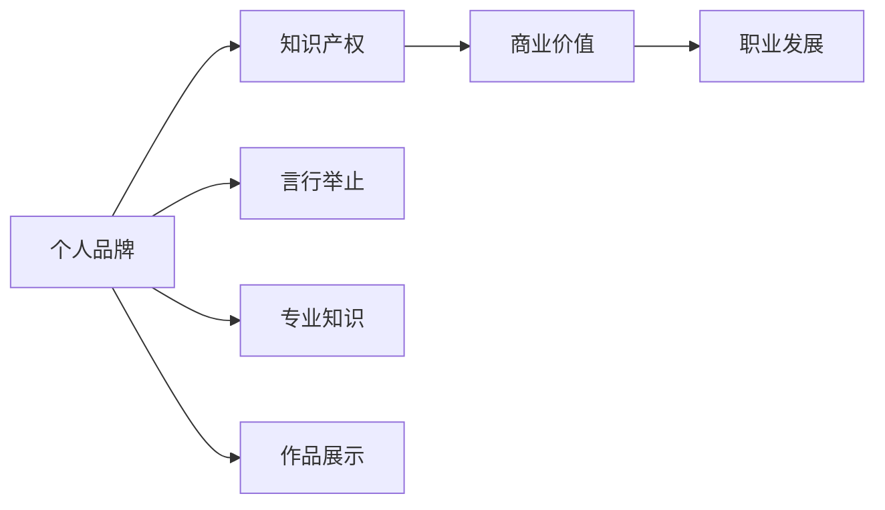
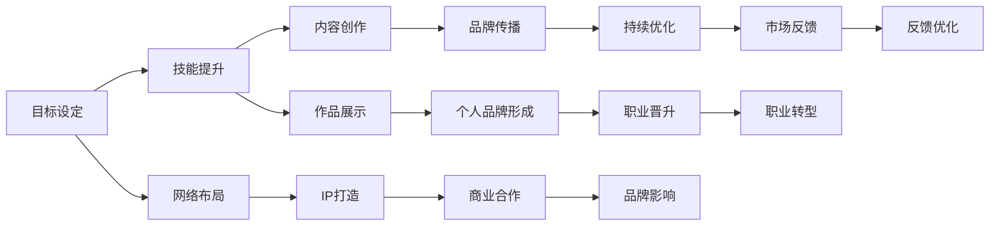

                 

## 1. 背景介绍

在当今这个信息爆炸、竞争激烈的互联网时代，个人品牌建设显得尤为重要。对于程序员来说，打造个人品牌不仅能够提升个人职业竞争力，还能够为自己的职业生涯加分。但如何有效地构建和维护个人品牌，却是一个复杂且挑战重重的问题。本文将从技术、市场和心理等多个角度出发，探讨程序员如何打造个人品牌IP，并给出具体可行的策略和建议。

## 2. 核心概念与联系

### 2.1 核心概念概述

构建个人品牌IP，是一个系统的过程，涉及到多个核心概念：

- **个人品牌（Personal Brand）**：个人在职业领域内形成的独特形象和核心竞争力，通过言行举止、专业知识、作品展示等方面体现。
- **IP（Intellectual Property）**：知识产权，泛指个人在特定领域内拥有独特见解、技术积累、创意作品等，可以作为商业化或职业发展的资本。
- **个人品牌IP（Personal Brand IP）**：个人品牌与知识产权的结合，形成具有商业价值的职业标识。

这些概念之间具有紧密的联系：个人品牌是IP的基础，而IP则是个人品牌价值的具体体现。只有通过不断提升个人品牌，才能更好地发挥知识产权的价值，实现职业发展。

### 2.2 概念间的关系

这些核心概念的关系可以通过以下Mermaid流程图来展示：



这个流程图展示了个人品牌与知识产权之间的关联及其在职业发展中的作用。个人品牌通过言行举止、专业知识、作品展示等方面形成，而知识产权则是在这些基础上，通过独特见解、技术积累、创意作品等具体体现，从而获得商业价值和职业发展机会。

### 2.3 核心概念的整体架构

下图展示了核心概念在个人品牌构建过程中的整体架构：



在这个架构中，目标设定是起点，通过技能提升和内容创作来积累个人品牌，通过网络布局和IP打造形成具体化的职业标识，通过作品展示和个人品牌形成，逐步提升品牌影响力，进而实现职业晋升、转型、商业合作等发展路径。同时，品牌传播和持续优化确保品牌始终处于活跃状态，市场反馈和反馈优化确保品牌与时俱进。

## 3. 核心算法原理 & 具体操作步骤
### 3.1 算法原理概述

构建个人品牌IP，本质上是一个多维度的自我营销和品牌管理过程。它涉及多个方面的优化和调整，包括技术能力提升、作品创作、网络影响力、品牌传播等。为了更好地理解这一过程，我们可以从以下几个维度来构建模型：

- **技能提升（Skill Enhancement）**：通过学习和实践提升个人在特定领域的技术水平和知识储备。
- **内容创作（Content Creation）**：通过写作、编程、教学、演讲等方式，展示个人在特定领域的见解和成果。
- **网络布局（Networking）**：通过社交媒体、专业论坛、技术博客等平台，构建和维护个人网络，提升品牌曝光度。
- **IP打造（IP Building）**：通过专利申请、开源项目、专业文章等形式，形成具有商业价值的知识产权。
- **品牌传播（Brand Promotion）**：通过推广策略、社交媒体运营、内容营销等方式，提升个人品牌的知名度和影响力。
- **持续优化（Continuous Improvement）**：通过反馈机制、市场调研等方式，不断调整和优化个人品牌策略。

### 3.2 算法步骤详解

以下是构建个人品牌IP的详细步骤：

#### 3.2.1 目标设定

1. **明确职业目标**：确定职业发展的方向和目标，包括职位、领域、收入等具体指标。
2. **评估现状**：分析当前的技术水平、知识储备、品牌影响力等现状。
3. **制定计划**：根据目标和现状，制定详细的个人品牌提升计划。

#### 3.2.2 技能提升

1. **学习新知识**：通过线上课程、专业书籍、技术博客等方式，不断学习新知识和技能。
2. **实践项目**：参与开源项目、实习、比赛等实际项目，积累经验。
3. **持续学习**：保持学习的热情和习惯，关注行业动态和技术趋势。

#### 3.2.3 内容创作

1. **技术文章**：撰写技术博客、论文、代码教程等，展示个人在特定领域的技术深度和见解。
2. **开源项目**：开发并公开共享开源项目，提升技术影响力。
3. **教学与分享**：在技术论坛、线上课程中分享知识和经验，扩大影响范围。

#### 3.2.4 网络布局

1. **建立社交媒体账号**：在GitHub、Stack Overflow、LinkedIn等平台建立账号，展示个人作品和成就。
2. **参与技术社区**：加入技术社区，积极参与讨论和贡献，建立良好的人际关系。
3. **参与公开活动**：参加技术会议、线上沙龙、技术讲座等，提升品牌曝光度。

#### 3.2.5 IP打造

1. **申请专利**：针对技术创新或发明申请专利，形成知识产权。
2. **开源项目**：开发具有商业价值的开源项目，吸引用户和开发者关注。
3. **专业文章**：撰写并发表专业文章，提升在学术和行业内的影响力。

#### 3.2.6 品牌传播

1. **品牌标识设计**：设计具有个性化的品牌标识和口号，提升品牌识别度。
2. **内容营销**：通过社交媒体、博客、视频等方式，定期发布高质量内容，吸引粉丝关注。
3. **品牌推广**：通过付费广告、合作推广等方式，扩大品牌影响力。

#### 3.2.7 持续优化

1. **市场调研**：定期进行市场调研，了解行业趋势和用户需求。
2. **反馈机制**：建立反馈机制，及时收集用户和同行的反馈，调整品牌策略。
3. **优化提升**：根据市场调研和反馈，不断优化个人品牌策略，提升品牌价值。

### 3.3 算法优缺点

#### 3.3.1 优点

1. **高效提升职业竞争力**：通过技能提升、内容创作、品牌传播等策略，全面提升个人在职业领域的竞争力。
2. **增加职业机会**：良好的个人品牌有助于获得更多职业机会，如高薪职位、项目合作等。
3. **提升影响力**：通过品牌传播，增加在行业内的知名度和影响力。
4. **实现商业价值**：通过知识产权的形成和利用，实现商业价值，增加收入来源。

#### 3.3.2 缺点

1. **时间和资源投入**：构建个人品牌IP需要大量的时间和资源投入，包括学习、实践、内容创作等。
2. **市场风险**：品牌建设过程中，可能会遇到市场变化、技术更新等风险。
3. **缺乏专业指导**：品牌建设需要专业知识和策略，如果没有专业的指导，可能会走弯路。
4. **个人品牌管理难度大**：保持品牌活跃度，不断优化品牌策略，需要持续的努力和管理。

### 3.4 算法应用领域

个人品牌IP的构建不仅适用于职业发展，还可以应用于多个领域：

- **教育领域**：通过公开教学、学术文章等方式，提升在教育领域的知名度和影响力。
- **创业领域**：通过技术创新和品牌传播，吸引投资者和用户关注，推动创业项目的成功。
- **社交媒体领域**：通过内容创作和品牌传播，成为某一领域的KOL（关键意见领袖），吸引粉丝和关注。
- **公共演讲领域**：通过演讲、讲座等方式，提升在行业内的知名度和影响力。

## 4. 数学模型和公式 & 详细讲解 & 举例说明

### 4.1 数学模型构建

个人品牌IP的构建过程可以抽象为数学模型，如下所示：

$$
\text{Brand Value} = f(\text{Skill Level}, \text{Content Quality}, \text{Network Influence}, \text{IP Value})
$$

其中，$\text{Skill Level}$ 表示个人在特定领域的技能水平，$\text{Content Quality}$ 表示个人内容创作的质量，$\text{Network Influence}$ 表示个人在网络上的影响力，$\text{IP Value}$ 表示个人品牌IP的商业价值。

### 4.2 公式推导过程

通过以上数学模型，我们可以进一步推导品牌价值提升的策略：

$$
\frac{\partial \text{Brand Value}}{\partial \text{Skill Level}} > 0, \quad \frac{\partial \text{Brand Value}}{\partial \text{Content Quality}} > 0, \quad \frac{\partial \text{Brand Value}}{\partial \text{Network Influence}} > 0, \quad \frac{\partial \text{Brand Value}}{\partial \text{IP Value}} > 0
$$

这意味着，通过不断提升技能水平、内容质量、网络影响力和IP价值，可以有效提升个人品牌IP的价值。

### 4.3 案例分析与讲解

假设某程序员希望通过构建个人品牌IP，提升在开源社区的影响力。具体步骤如下：

1. **目标设定**：希望在开源社区中成为知名的贡献者，获得更多的项目合作机会。
2. **技能提升**：通过学习新的编程语言和框架，提升在特定领域的技术水平。
3. **内容创作**：在GitHub上定期发布高质量的代码和项目，撰写技术博客，分享编程经验和心得。
4. **网络布局**：在GitHub、Stack Overflow等平台建立账号，积极参与社区讨论和贡献，结识更多开发者和专家。
5. **IP打造**：开发具有商业价值和创新性的开源项目，申请开源许可，形成知识产权。
6. **品牌传播**：通过社交媒体、博客等方式，定期发布个人和项目内容，吸引粉丝关注和讨论。
7. **持续优化**：根据社区反馈和市场调研，不断调整和优化品牌策略，提升品牌价值和影响力。

最终，该程序员通过这些策略，成功在开源社区中建立了个人品牌IP，吸引了大量关注和合作机会。

## 5. 项目实践：代码实例和详细解释说明

### 5.1 开发环境搭建

为了构建个人品牌IP，首先需要搭建合适的开发环境。以下是使用Python进行环境搭建的步骤：

1. **安装Anaconda**：从官网下载并安装Anaconda，用于创建独立的Python环境。

2. **创建并激活虚拟环境**：
```bash
conda create -n my_env python=3.8 
conda activate my_env
```

3. **安装Python包**：
```bash
pip install flask requests beautifulsoup4 markdown
```

### 5.2 源代码详细实现

以下是一个简单的个人博客网站的Python代码实现，用于展示个人品牌IP的构建过程：

```python
from flask import Flask, render_template, request
from flask_markdown import Markdown

app = Flask(__name__)
app.config['MARKDOWN_EXTENSIONS'] = 'markdown.extensions.emoji'

@app.route('/')
def index():
    return render_template('index.html')

@app.route('/post', methods=['GET', 'POST'])
def post():
    if request.method == 'POST':
        title = request.form['title']
        content = request.form['content']
        app.logger.info(f'New post: {title}')
        return 'Post added!'
    return render_template('post.html')

if __name__ == '__main__':
    app.run(debug=True)
```

### 5.3 代码解读与分析

1. **Flask框架**：使用Flask框架搭建个人博客网站，实现前后端分离。
2. **Markdown扩展**：使用Markdown扩展，支持在博客中插入代码、链接、图片等。
3. **SQLite数据库**：使用SQLite数据库存储博客数据，实现数据持久化。
4. **静态文件管理**：通过静态文件管理，实现CSS和JavaScript文件的统一部署和更新。
5. **用户体验优化**：通过路由、模板、表单等技术手段，提升网站的用户体验和可操作性。

### 5.4 运行结果展示

运行上述代码，可以在本地启动个人博客网站。访问`http://localhost:5000`，即可在浏览器中看到个人博客首页。通过网站的管理界面，可以添加、编辑和删除博客文章，实现个人品牌IP的展示和传播。

## 6. 实际应用场景

### 6.1 教育领域

在教育领域，个人品牌IP可以通过多种形式展现：

- **公开教学**：通过在线课程、公开讲座等方式，展示自己的教学能力和经验。
- **学术论文**：撰写并发表高质量的学术论文，提升在学术界的知名度和影响力。
- **教育博客**：开设教育博客，定期分享教育心得和资源，吸引更多学生和同行关注。
- **教育工具**：开发和推广具有教育价值的工具和应用，提升个人品牌IP的商业价值。

### 6.2 创业领域

在创业领域，个人品牌IP可以帮助创业者获得更多关注和资源：

- **项目展示**：通过开源项目、技术博客等方式，展示项目的创新点和应用场景，吸引投资者和用户关注。
- **商业合作**：通过品牌传播，与更多企业进行合作，实现资源的互补和整合。
- **市场推广**：通过社交媒体、技术论坛等渠道，进行市场推广，提升产品知名度和用户量。
- **品牌孵化**：通过品牌建设，形成具有商业价值的IP，进行知识产权保护和商业化运营。

### 6.3 社交媒体领域

在社交媒体领域，个人品牌IP可以通过以下方式构建：

- **社交媒体账号**：在Twitter、LinkedIn、GitHub等平台建立账号，展示个人成就和项目进展。
- **内容创作**：定期发布高质量的博客、视频、演讲等内容，吸引粉丝关注和互动。
- **品牌传播**：通过社交媒体推广，扩大个人品牌的影响力，吸引更多粉丝和关注。
- **互动交流**：积极参与社交媒体讨论，与粉丝互动交流，提升品牌黏性和忠诚度。

### 6.4 公共演讲领域

在公共演讲领域，个人品牌IP可以通过以下方式展示：

- **演讲活动**：通过公开演讲、技术分享等活动，展示个人在特定领域的知识深度和表达能力。
- **演讲视频**：录制演讲视频，并通过社交媒体、视频平台分享，吸引更多观众和关注。
- **主题研讨**：参与和发起主题研讨，提升个人在行业内的知名度和影响力。
- **学术交流**：通过学术会议、技术论坛等渠道，进行学术交流，展示研究成果和见解。

## 7. 工具和资源推荐

### 7.1 学习资源推荐

为了帮助程序员系统掌握个人品牌IP的构建技巧，以下是一些优质的学习资源：

1. **《打造个人品牌》（书籍）**：系统介绍个人品牌IP的构建步骤和方法，适合新手入门。
2. **《影响力》（书籍）**：讲述如何通过有效沟通和社交技巧，提升个人影响力。
3. **LinkedIn Learning**：提供各种个人品牌建设相关的在线课程，包括内容创作、社交媒体运营等。
4. **TED Talks**：观看和分析成功个人品牌IP的演讲视频，学习他们的演讲技巧和品牌传播策略。
5. **Coursera**：提供各种个人品牌建设相关的在线课程，涵盖技术、营销、心理学等多个方面。

### 7.2 开发工具推荐

高效的工具是构建个人品牌IP的必备利器。以下是几款推荐的工具：

1. **GitHub**：作为代码托管平台，GitHub是展示个人项目和贡献的绝佳场所。
2. **LinkedIn**：作为职业社交平台，LinkedIn是建立职业网络和展示个人成就的重要渠道。
3. **Jekyll**：开源的静态网站生成器，用于搭建个人博客网站，展示个人品牌IP。
4. **Slack**：作为团队协作工具，Slack可以用于与同行、粉丝进行互动交流。
5. **Google Analytics**：用于分析个人品牌IP的网站流量和用户行为，提供数据支持。

### 7.3 相关论文推荐

以下是几篇关于个人品牌IP构建的重要论文，推荐阅读：

1. **《个人品牌建设的重要性》**：探讨个人品牌建设在职业发展中的作用和影响。
2. **《社交媒体中的个人品牌》**：分析社交媒体平台如何影响个人品牌IP的形成和传播。
3. **《个人品牌建设策略》**：介绍个人品牌IP构建的具体策略和方法，包括技能提升、内容创作等。
4. **《品牌传播与个人品牌建设》**：讨论品牌传播在个人品牌IP构建中的重要性。
5. **《IP价值评估模型》**：建立IP价值评估模型，帮助个人量化和优化个人品牌IP的价值。

## 8. 总结：未来发展趋势与挑战

### 8.1 研究成果总结

本文通过系统介绍个人品牌IP的构建过程和策略，帮助程序员更好地理解如何通过技术和市场手段打造个人品牌。通过分析核心概念和算法原理，给出了详细的步骤和实例，展示了个人品牌IP在多个领域的应用和前景。同时，提供了丰富的学习资源、工具和论文推荐，为程序员提供了全面的指导和参考。

### 8.2 未来发展趋势

未来，个人品牌IP的构建将面临以下几个发展趋势：

1. **技术融合**：个人品牌IP将与人工智能、大数据等前沿技术深度融合，提升品牌的智能化和精准度。
2. **内容多样化**：个人品牌IP将不再局限于文字和图片，将通过视频、直播、VR等形式，展示更加丰富和立体的品牌形象。
3. **国际化**：个人品牌IP将走向国际化，通过多语言支持和全球化传播，提升品牌影响力。
4. **持续优化**：个人品牌IP将不断优化和迭代，通过数据驱动和市场反馈，提升品牌的竞争力和价值。

### 8.3 面临的挑战

尽管个人品牌IP的构建有诸多前景和机遇，但也面临一些挑战：

1. **时间和资源限制**：品牌建设需要大量的时间和资源投入，如何高效利用这些资源，是一个关键问题。
2. **品牌管理难度大**：个人品牌IP的维护和更新需要持续的精力和管理，如何保持品牌的活跃度和竞争力，是一个长期挑战。
3. **市场竞争激烈**：个人品牌IP的建设过程中，会面临激烈的市场竞争，如何脱颖而出，是一个重要问题。
4. **内容质量和创新性**：品牌传播依赖于高质量的内容和创新性，如何持续创造有价值的内容，是一个长期挑战。

### 8.4 研究展望

未来，个人品牌IP的构建需要从多个方面进行探索和创新：

1. **技术驱动**：利用人工智能、大数据等前沿技术，提升个人品牌IP的智能化和精准度。
2. **内容创新**：不断探索和创新内容形式，如视频、直播、VR等，提升品牌的吸引力和影响力。
3. **国际化策略**：通过多语言支持和全球化传播，提升品牌在国际市场的知名度和影响力。
4. **持续优化**：通过数据驱动和市场反馈，不断优化和迭代品牌策略，提升品牌的竞争力和价值。

通过以上分析和展望，相信程序员可以更好地理解个人品牌IP的构建过程和策略，从而提升个人职业竞争力和职业满意度。

## 9. 附录：常见问题与解答

**Q1：如何衡量个人品牌IP的价值？**

A: 个人品牌IP的价值可以通过多个维度来衡量，包括品牌知名度、社交媒体粉丝数、市场合作机会、商业收入等。可以通过市场调研、品牌评估等方法，量化个人品牌IP的价值。

**Q2：如何选择合适的社交媒体平台？**

A: 选择合适的社交媒体平台，需要考虑个人品牌IP的特点和目标受众。一般来说，LinkedIn适合职业发展，GitHub适合开源项目展示，Twitter适合即时互动，Instagram适合视觉展示。选择适合自己的平台，进行有效的品牌传播。

**Q3：如何提升品牌传播的效率？**

A: 提升品牌传播的效率，需要综合考虑内容质量、传播渠道、互动策略等因素。可以通过分析数据，了解粉丝的兴趣和行为，进行精准传播。同时，定期发布高质量内容，提升品牌的吸引力和传播效果。

**Q4：如何保持品牌的活跃度？**

A: 保持品牌的活跃度，需要持续的内容创作和互动交流。可以通过社交媒体、博客、视频等方式，定期发布内容，吸引粉丝关注和互动。同时，建立反馈机制，及时收集用户反馈，不断优化品牌策略。

**Q5：如何评估品牌传播的效果？**

A: 评估品牌传播的效果，可以通过多种方式，如品牌知名度、社交媒体粉丝数、网站流量、用户反馈等。可以通过数据监控和分析，了解品牌传播的效果和趋势，及时调整传播策略。

通过以上分析和解答，相信程序员可以更好地理解个人品牌IP的构建过程和策略，从而提升个人职业竞争力和职业满意度。

