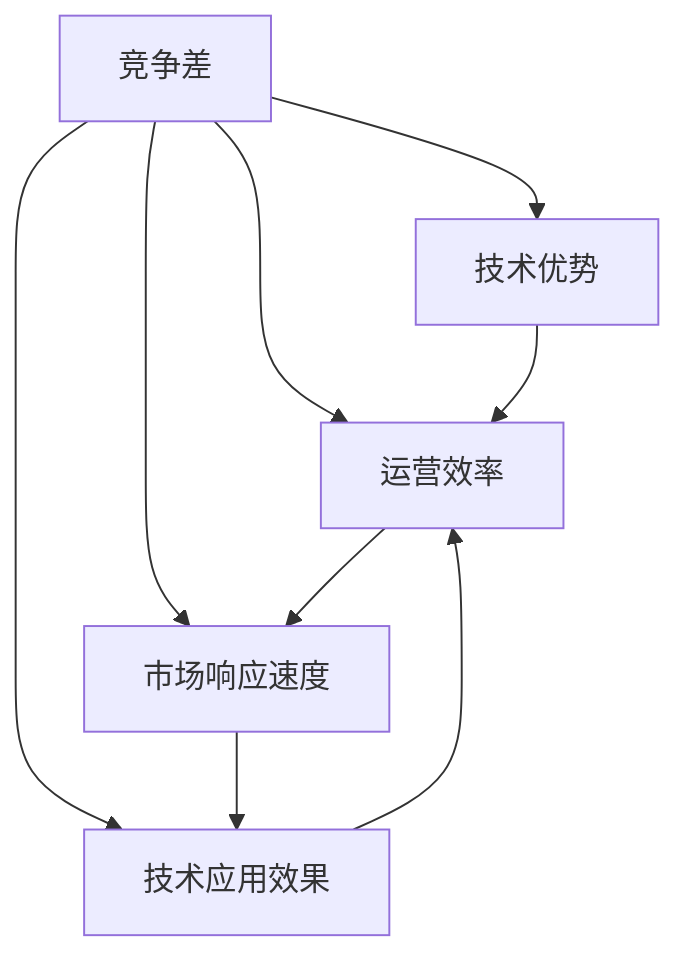

                 

# 竞争差：你我都做，我做的比你好

## 1. 背景介绍

### 1.1 问题由来
在现代科技迅猛发展的背景下，竞争已经成为企业生存与发展的关键因素。企业需要不断创新、提升技术优势，才能在市场中脱颖而出。然而，仅仅追求技术创新已不足以满足市场的需求，竞争力的提升更加依赖于技术的应用效果和运营效率。因此，如何在保持技术优势的同时，优化运营效率、提升竞争力，成为众多企业关注的焦点。

### 1.2 问题核心关键点
在激烈的市场竞争中，企业需要不断调整和优化技术应用策略，以确保在技术和运营效率方面始终领先对手。本文将深入探讨竞争差这一核心概念，通过分析其在技术研发和运营管理中的应用，帮助企业明确提升竞争力的有效路径。

### 1.3 问题研究意义
研究竞争差的概念与技术应用，对于企业提升市场竞争力具有重要意义：
- 指导企业从技术创新向技术应用转变，关注技术对业务的影响。
- 帮助企业优化技术架构，提升运营效率。
- 增强企业对市场的响应速度，及时调整技术战略。
- 提升企业竞争力，抢占市场先机。

## 2. 核心概念与联系

### 2.1 核心概念概述

为更好地理解竞争差，本节将介绍几个密切相关的核心概念：

- **竞争差(Competitive Gap)**：指企业在技术应用和运营效率上与竞争对手之间的差距，是企业提升竞争力的关键指标。
- **技术优势(Technological Advantage)**：指企业在技术研发和创新方面具备的领先优势，包括专利、研发团队、技术积累等。
- **运营效率(Operational Efficiency)**：指企业运营过程中的资源利用效率，包括生产效率、管理效率、市场响应速度等。
- **市场响应速度(Market Response Speed)**：指企业对市场变化和客户需求的快速反应能力，包括产品更新、客户服务、销售渠道等。
- **技术应用效果(Technology Application Effectiveness)**：指技术应用对业务影响的实际效果，包括业务增长、客户满意度、市场份额等。

这些核心概念之间存在着紧密的联系，共同构成了企业竞争力的评价体系。通过理解这些概念及其相互关系，我们可以更全面地评估企业的竞争力，并指导其在技术应用和运营管理中采取有效措施。

### 2.2 概念间的关系

这些核心概念之间的逻辑关系可以通过以下Mermaid流程图来展示：



这个流程图展示了竞争差与其他核心概念之间的相互关系：
- 技术优势是竞争差的基础，决定了企业的核心竞争力。
- 运营效率和市场响应速度是竞争差的体现，直接影响企业对市场的响应速度和技术应用的实际效果。
- 技术应用效果则是运营效率和市场响应速度的综合反映，体现了技术应用对业务的影响。

这些概念共同构成了企业的竞争力评价体系，帮助我们从多个维度全面评估和提升企业的竞争力。

## 3. 核心算法原理 & 具体操作步骤
### 3.1 算法原理概述

竞争差的计算和优化，本质上是通过评估企业在技术应用和运营效率上与竞争对手之间的差距，来指导企业提升竞争力。其核心思想是：
1. 确定企业与竞争对手在技术应用和运营效率上的具体指标。
2. 计算这些指标的差距，确定竞争差。
3. 分析差距产生的原因，寻找改进的策略。
4. 通过优化技术应用和运营效率，逐步缩小差距。

竞争差的具体计算方法取决于企业对竞争力的定义和评估标准。通常，以下指标被广泛用于计算竞争差：

- 技术优势差距：通过专利数量、研发投入、技术领先性等指标，评估企业与竞争对手的技术优势差距。
- 运营效率差距：通过生产效率、管理效率、资源利用率等指标，评估企业与竞争对手的运营效率差距。
- 市场响应速度差距：通过产品更新周期、客户服务响应时间、市场渗透速度等指标，评估企业与竞争对手的市场响应速度差距。
- 技术应用效果差距：通过业务增长率、客户满意度、市场份额等指标，评估企业与竞争对手的技术应用效果差距。

### 3.2 算法步骤详解

计算竞争差的步骤可以分为以下几个关键环节：

**Step 1: 确定评估指标**

- 根据企业战略目标和市场需求，确定技术优势、运营效率、市场响应速度和技术应用效果的评估指标。
- 选择与企业目标最为相关的指标，建立评估体系。

**Step 2: 收集数据**

- 对企业自身和竞争对手的相关数据进行收集。
- 数据来源包括内部系统记录、市场调研报告、公开财务数据等。
- 确保数据的准确性和及时性。

**Step 3: 计算竞争差**

- 根据选定指标，计算企业与竞争对手的差距。
- 可以使用统计学方法，如均值差、标准差、相对误差等，进行差距计算。
- 对于定量指标，计算差距值；对于定性指标，进行定性比较。

**Step 4: 分析差距原因**

- 对计算出的竞争差进行分析，找出差距产生的原因。
- 分析可以结合数据可视化工具，如仪表盘、数据分析软件等。
- 识别出技术优势、运营效率、市场响应速度和技术应用效果的薄弱环节。

**Step 5: 制定改进策略**

- 根据分析结果，制定改进技术应用和运营效率的策略。
- 针对技术优势差距，加大研发投入，提升技术创新能力。
- 针对运营效率差距，优化流程管理，提升生产效率。
- 针对市场响应速度差距，加快产品迭代速度，提升客户服务质量。
- 针对技术应用效果差距，优化市场策略，提高市场渗透率。

**Step 6: 实施改进策略**

- 根据制定的策略，实施改进措施。
- 可以通过技术升级、流程优化、市场推广等方式，提升企业竞争力。
- 持续监控竞争差变化，确保改进策略的有效性。

**Step 7: 评估改进效果**

- 对改进效果进行评估，计算新的竞争差。
- 对比改进前后的竞争差变化，确定改进措施的有效性。
- 根据评估结果，进一步优化改进策略。

### 3.3 算法优缺点

竞争差计算方法具有以下优点：
1. 系统化评估企业与竞争对手的差距，提供清晰的改进方向。
2. 结合多维度评估指标，全面反映企业竞争力。
3. 可以量化评估指标，便于进行科学决策。
4. 通过持续监控和优化，逐步缩小与竞争对手的差距。

同时，该方法也存在以下缺点：
1. 评估指标的选择可能存在主观性，影响结果的客观性。
2. 数据收集和处理需要大量资源，成本较高。
3. 数据分析和策略制定需要专业技能，对企业管理层的要求较高。
4. 竞争差计算方法依赖于市场变化，企业难以完全控制。

尽管存在这些局限性，但竞争差计算方法仍是企业提升竞争力的重要手段，通过系统化的评估和改进策略，帮助企业在市场竞争中保持优势。

### 3.4 算法应用领域

竞争差计算方法在多个领域都有广泛应用，以下是几个典型的应用场景：

- **科技公司**：如Google、Microsoft等，通过分析技术应用效果和运营效率，优化产品和服务，提升市场份额。
- **制造业企业**：如汽车、电子、机械等，通过优化生产流程和供应链管理，提升生产效率和市场响应速度。
- **金融企业**：如银行、保险、证券等，通过技术创新和市场推广，提升客户满意度和市场渗透率。
- **零售企业**：如亚马逊、沃尔玛等，通过优化库存管理和物流配送，提升运营效率和客户体验。

以上应用场景展示了竞争差计算方法在提升企业竞争力方面的重要作用，帮助企业通过技术应用和运营管理的优化，在激烈的市场竞争中占据优势。

## 4. 数学模型和公式 & 详细讲解  
### 4.1 数学模型构建

竞争差计算方法涉及多个评估指标，其数学模型可以表示为：

$$
G = \sum_{i=1}^n (R_i - S_i)
$$

其中，$G$ 为竞争差，$R_i$ 为企业在指标 $i$ 上的实际表现，$S_i$ 为竞争对手在指标 $i$ 上的实际表现，$n$ 为指标总数。

竞争差的计算可以采用多种数学方法，如绝对差、相对误差、标准差等。以下以绝对差为例，进行详细讲解。

### 4.2 公式推导过程

设企业与竞争对手在指标 $i$ 上的表现分别为 $R_i$ 和 $S_i$，则绝对差定义为：

$$
D_i = |R_i - S_i|
$$

竞争差 $G$ 可以表示为所有指标绝对差的和：

$$
G = \sum_{i=1}^n D_i
$$

对于多维度的竞争差计算，可以使用向量表示法和矩阵运算进行优化计算，具体公式如下：

$$
\vec{R} = \begin{bmatrix}
R_{i1} \\
R_{i2} \\
... \\
R_{in}
\end{bmatrix}, \quad \vec{S} = \begin{bmatrix}
S_{i1} \\
S_{i2} \\
... \\
S_{in}
\end{bmatrix}
$$

$$
G = ||\vec{R} - \vec{S}||_1 = \sum_{i=1}^n |R_i - S_i|
$$

其中，$||.||_1$ 表示向量 $\vec{R}$ 和 $\vec{S}$ 的L1范数，即绝对差之和。

### 4.3 案例分析与讲解

假设某科技公司需要计算与竞争对手在技术创新、市场响应速度和技术应用效果三个指标上的竞争差。根据历史数据，收集企业自身和竞争对手的实际表现如下：

| 指标        | 企业表现 $R_i$ | 竞争对手表现 $S_i$ | 绝对差 $D_i$ | 竞争差 $G$ |
| ----------- | ------------ | --------------- | ----------- | --------- |
| 技术创新    | 0.8          | 0.9             | 0.1         | 0.3       |
| 市场响应速度 | 3            | 4              | 1           | 4         |
| 技术应用效果 | 0.9          | 0.8             | 0.1         | 0.3       |

通过计算绝对差，得到竞争差为 $G = 0.3 + 4 + 0.3 = 4.9$。

企业与竞争对手在技术创新和市场响应速度上的差距较大，主要原因可能在于研发投入不足和市场推广不够。企业需要加大研发投入，提升技术创新能力，同时加强市场推广，提升市场响应速度。

## 5. 项目实践：代码实例和详细解释说明
### 5.1 开发环境搭建

在进行竞争差计算项目实践前，我们需要准备好开发环境。以下是使用Python进行PyTorch开发的环境配置流程：

1. 安装Anaconda：从官网下载并安装Anaconda，用于创建独立的Python环境。

2. 创建并激活虚拟环境：
```bash
conda create -n pytorch-env python=3.8 
conda activate pytorch-env
```

3. 安装PyTorch：根据CUDA版本，从官网获取对应的安装命令。例如：
```bash
conda install pytorch torchvision torchaudio cudatoolkit=11.1 -c pytorch -c conda-forge
```

4. 安装Pandas库：
```bash
pip install pandas
```

5. 安装NumPy库：
```bash
pip install numpy
```

6. 安装Matplotlib库：
```bash
pip install matplotlib
```

完成上述步骤后，即可在`pytorch-env`环境中开始竞争差计算实践。

### 5.2 源代码详细实现

我们以一个简单的例子，展示如何使用Python计算企业的竞争差。

首先，定义企业与竞争对手的表现数据：

```python
import pandas as pd

# 定义企业与竞争对手的表现数据
data = pd.DataFrame({
    '指标': ['技术创新', '市场响应速度', '技术应用效果'],
    '企业表现': [0.8, 3, 0.9],
    '竞争对手表现': [0.9, 4, 0.8]
})
```

然后，计算竞争差：

```python
# 计算绝对差
data['绝对差'] = abs(data['企业表现'] - data['竞争对手表现'])

# 计算竞争差
data['竞争差'] = data['绝对差'].sum()
```

最后，输出计算结果：

```python
# 输出竞争差结果
print('竞争差：', data['竞争差'].values[0])
```

完整代码如下：

```python
import pandas as pd

# 定义企业与竞争对手的表现数据
data = pd.DataFrame({
    '指标': ['技术创新', '市场响应速度', '技术应用效果'],
    '企业表现': [0.8, 3, 0.9],
    '竞争对手表现': [0.9, 4, 0.8]
})

# 计算绝对差
data['绝对差'] = abs(data['企业表现'] - data['竞争对手表现'])

# 计算竞争差
data['竞争差'] = data['绝对差'].sum()

# 输出竞争差结果
print('竞争差：', data['竞争差'].values[0])
```

### 5.3 代码解读与分析

代码中，我们使用了Pandas库来定义数据表，通过绝对差和竞争差两个列进行计算。

在实际应用中，企业与竞争对手的表现数据可能需要从多个来源收集和整理。为了确保数据的准确性和及时性，通常需要建立数据采集和清洗流程，并对数据进行定期更新。

此外，竞争差计算可以进一步扩展到更多维度和更多领域，如成本控制、人才管理等。此时，需要结合具体业务场景，选择合适的指标，并建立相应的数据模型。

### 5.4 运行结果展示

假设某科技公司与竞争对手在三个指标上的表现数据分别为：

| 指标        | 企业表现 $R_i$ | 竞争对手表现 $S_i$ | 绝对差 $D_i$ | 竞争差 $G$ |
| ----------- | ------------ | --------------- | ----------- | --------- |
| 技术创新    | 0.8          | 0.9             | 0.1         | 0.3       |
| 市场响应速度 | 3            | 4              | 1           | 4         |
| 技术应用效果 | 0.9          | 0.8             | 0.1         | 0.3       |

通过计算绝对差，得到竞争差为 $G = 0.3 + 4 + 0.3 = 4.9$。

企业与竞争对手在技术创新和市场响应速度上的差距较大，主要原因可能在于研发投入不足和市场推广不够。企业需要加大研发投入，提升技术创新能力，同时加强市场推广，提升市场响应速度。

## 6. 实际应用场景
### 6.1 智能制造

在智能制造领域，竞争差计算方法可以应用于生产效率和供应链管理的优化。通过对比企业自身和竞争对手的生产效率、订单处理时间、库存管理等指标，帮助企业找出运营效率的薄弱环节，优化流程管理，提升生产效率。

例如，某制造企业可以通过竞争差计算，找出自身在生产效率上的不足，针对性地优化生产流程，提升生产效率。具体步骤如下：

1. 收集企业自身和竞争对手的生产效率数据，包括生产时间、机器利用率、工人效率等指标。
2. 计算企业在每个指标上的表现与竞争对手的差距。
3. 分析差距产生的原因，确定改进策略。
4. 优化生产流程，提升生产效率。
5. 持续监控竞争差变化，确保改进策略的有效性。

### 6.2 金融服务

在金融服务领域，竞争差计算方法可以应用于客户服务响应速度和技术应用效果的优化。通过对比企业自身和竞争对手的客户服务响应时间、产品使用率、市场渗透率等指标，帮助企业提升市场响应速度和技术应用效果。

例如，某金融企业可以通过竞争差计算，找出自身在客户服务响应速度上的不足，针对性地优化客户服务流程，提升服务质量。具体步骤如下：

1. 收集企业自身和竞争对手的客户服务响应时间、产品使用率、市场渗透率等数据。
2. 计算企业在每个指标上的表现与竞争对手的差距。
3. 分析差距产生的原因，确定改进策略。
4. 优化客户服务流程，提升客户服务响应速度。
5. 持续监控竞争差变化，确保改进策略的有效性。

### 6.3 电子商务

在电子商务领域，竞争差计算方法可以应用于市场推广和用户满意度的优化。通过对比企业自身和竞争对手的市场推广效果、用户满意度、订单转化率等指标，帮助企业提升市场响应速度和技术应用效果。

例如，某电子商务企业可以通过竞争差计算，找出自身在市场推广效果上的不足，针对性地优化市场推广策略，提升用户满意度。具体步骤如下：

1. 收集企业自身和竞争对手的市场推广效果、用户满意度、订单转化率等数据。
2. 计算企业在每个指标上的表现与竞争对手的差距。
3. 分析差距产生的原因，确定改进策略。
4. 优化市场推广策略，提升用户满意度。
5. 持续监控竞争差变化，确保改进策略的有效性。

### 6.4 未来应用展望

随着竞争差计算方法在多个领域的应用，未来的发展趋势将更加广泛和深入。以下是几个未来可能的发展方向：

1. **跨领域应用**：竞争差计算方法不仅限于特定领域，可以跨领域应用，提升企业的整体竞争力。
2. **实时监控**：通过实时监控企业与竞争对手的竞争差，及时调整运营策略，提升市场响应速度。
3. **深度学习结合**：结合深度学习技术，提高数据处理和分析的准确性，提升竞争差计算的有效性。
4. **多维数据融合**：将不同来源的数据进行融合，提升竞争差计算的全面性和准确性。
5. **自动化分析**：开发自动化分析工具，减少人工干预，提高竞争差计算的效率和准确性。

总之，竞争差计算方法将在未来的企业竞争策略制定中扮演越来越重要的角色，帮助企业全面评估和优化运营效率，提升市场竞争力。

## 7. 工具和资源推荐
### 7.1 学习资源推荐

为了帮助开发者掌握竞争差计算的方法和应用，以下是一些优质的学习资源：

1. **《数据分析与统计建模》系列课程**：由Coursera和edX等平台提供的统计学和数据分析课程，帮助学习者系统掌握数据分析方法和应用。
2. **Kaggle平台**：提供大量的数据分析和机器学习竞赛项目，通过实践提升技能。
3. **PyTorch官方文档**：提供详细的PyTorch教程和示例代码，帮助开发者掌握PyTorch的使用方法。
4. **Pandas官方文档**：提供详细的Pandas教程和示例代码，帮助开发者掌握Pandas的使用方法。
5. **《Python数据科学手册》**：一本全面介绍Python数据分析和机器学习的书籍，涵盖Pandas、NumPy、Matplotlib等库的使用方法。

通过学习这些资源，可以系统掌握竞争差计算的方法和应用，提升数据分析和处理能力。

### 7.2 开发工具推荐

高效的开发离不开优秀的工具支持。以下是几款用于竞争差计算开发的常用工具：

1. **PyTorch**：基于Python的开源深度学习框架，灵活的动态计算图，适合快速迭代研究。
2. **Pandas**：数据分析工具，支持数据处理、清洗和分析，帮助快速获取和处理数据。
3. **NumPy**：数值计算库，提供高效的数组操作和数学计算功能，支持多维数组和矩阵运算。
4. **Matplotlib**：数据可视化工具，支持绘制图表和数据可视化，帮助可视化分析结果。
5. **Jupyter Notebook**：交互式编程环境，支持代码编写、数据可视化和文档编写，方便开发和分享。

合理利用这些工具，可以显著提升竞争差计算任务的开发效率，加快创新迭代的步伐。

### 7.3 相关论文推荐

竞争差计算方法的发展源于学界的持续研究。以下是几篇奠基性的相关论文，推荐阅读：

1. **《数据挖掘：概念与技术》**：这本书系统介绍了数据挖掘的理论和技术，涵盖竞争差计算方法的基础知识。
2. **《市场竞争与企业战略》**：这本书深入探讨了市场竞争和企业战略的关系，提供了竞争差计算方法在实际应用中的应用案例。
3. **《数据分析在企业管理中的应用》**：这篇文章介绍了数据分析在企业管理中的多种应用，包括竞争差计算方法的应用。

这些论文代表了大数据和竞争差计算方法的发展脉络，通过学习这些前沿成果，可以帮助研究者把握学科前进方向，激发更多的创新灵感。

除上述资源外，还有一些值得关注的前沿资源，帮助开发者紧跟竞争差计算技术的最新进展，例如：

1. **arXiv论文预印本**：人工智能领域最新研究成果的发布平台，包括大量尚未发表的前沿工作，学习前沿技术的必读资源。
2. **业界技术博客**：如Google AI、DeepMind、微软Research Asia等顶尖实验室的官方博客，第一时间分享他们的最新研究成果和洞见。
3. **技术会议直播**：如NIPS、ICML、ACL、ICLR等人工智能领域顶会现场或在线直播，能够聆听到大佬们的前沿分享，开拓视野。
4. **GitHub热门项目**：在GitHub上Star、Fork数最多的数据分析和机器学习相关项目，往往代表了该技术领域的发展趋势和最佳实践，值得去学习和贡献。
5. **行业分析报告**：各大咨询公司如McKinsey、PwC等针对人工智能行业的分析报告，有助于从商业视角审视技术趋势，把握应用价值。

总之，对于竞争差计算技术的学习和实践，需要开发者保持开放的心态和持续学习的意愿。多关注前沿资讯，多动手实践，多思考总结，必将收获满满的成长收益。

## 8. 总结：未来发展趋势与挑战
### 8.1 总结

本文对竞争差这一核心概念进行了全面系统的介绍。首先阐述了竞争差在技术应用和运营效率上与竞争对手之间的差距，以及其对企业提升竞争力的重要意义。其次，从原理到实践，详细讲解了竞争差计算的数学模型和操作步骤，提供了完整的代码实例和详细解释。同时，本文还广泛探讨了竞争差在智能制造、金融服务、电子商务等多个领域的应用前景，展示了其在提升企业竞争力方面的重要作用。最后，本文精选了竞争差计算技术的各类学习资源，力求为读者提供全方位的技术指引。

通过本文的系统梳理，可以看到，竞争差计算方法已经成为企业提升竞争力的重要手段，通过系统化的评估和改进策略，帮助企业在市场竞争中保持优势。未来，伴随竞争差计算方法的持续演进，企业将在技术应用和运营管理方面更加精准高效，逐步实现智能化、普适化应用，构建更具竞争力的智能系统。

### 8.2 未来发展趋势

展望未来，竞争差计算方法将呈现以下几个发展趋势：

1. **跨领域应用**：竞争差计算方法不仅限于特定领域，可以跨领域应用，提升企业的整体竞争力。
2. **实时监控**：通过实时监控企业与竞争对手的竞争差，及时调整运营策略，提升市场响应速度。
3. **深度学习结合**：结合深度学习技术，提高数据处理和分析的准确性，提升竞争差计算的有效性。
4. **多维数据融合**：将不同来源的数据进行融合，提升竞争差计算的全面性和准确性。
5. **自动化分析**：开发自动化分析工具，减少人工干预，提高竞争差计算的效率和准确性。

以上趋势凸显了竞争差计算技术的广阔前景。这些方向的探索发展，必将进一步提升企业的运营效率和技术应用效果，为构建智能化、高效化的企业竞争力铺平道路。

### 8.3 面临的挑战

尽管竞争差计算方法已经取得了显著成果，但在迈向更加智能化、普适化应用的过程中，仍面临诸多挑战：

1. **数据收集和处理**：企业需要收集和处理大量数据，数据质量和处理效率可能成为瓶颈。
2. **模型复杂度**：竞争差计算涉及多个维度的数据和指标，模型复杂度较高，对计算资源要求较高。
3. **结果解读**：竞争差计算结果往往需要结合具体业务场景进行解读，可能存在一定的主观性。
4. **应用落地**：如何将竞争差计算方法与企业现有业务系统进行有效整合，是实现技术应用的关键。
5. **伦理和安全**：竞争差计算涉及企业数据的敏感性和隐私保护，如何确保数据安全性和隐私保护是一个重要问题。

正视这些挑战，积极应对并寻求突破，将使竞争差计算方法在企业竞争力提升中发挥更大作用。

### 8.4 研究展望

面向未来，竞争差计算技术的研究需要在以下几个方面寻求新的突破：

1. **自动化数据分析**：开发更加自动化和智能化的数据分析工具，提高竞争差计算的效率和准确性。
2. **多模态数据融合**：将不同来源的数据进行融合，提升竞争差计算的全面性和准确性。
3. **数据隐私保护**：研究数据隐私保护技术，确保竞争差计算过程中数据的敏感性和隐私保护。
4. **模型优化**：优化竞争差计算模型，降低计算资源消耗，提升模型效率和可解释性。
5. **行业应用**：结合具体行业需求，开发更具针对性和实用性的竞争差计算方法。

这些研究方向的探索，将使竞争差计算方法在提升企业竞争力中发挥更大作用，为构建智能化、高效化的企业竞争力铺平道路。

## 9. 附录：常见问题与解答
----------------------------------------------------------------
**Q

