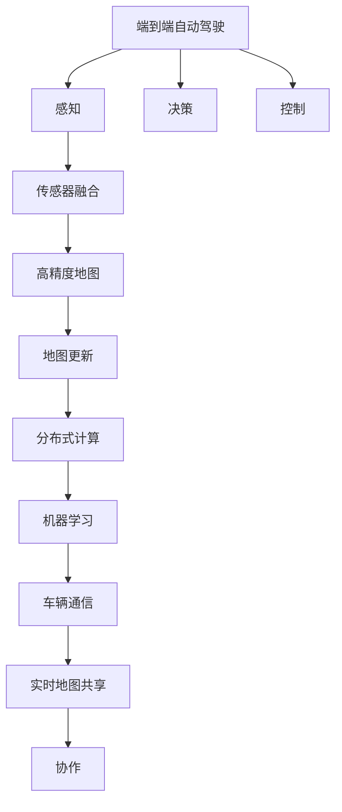
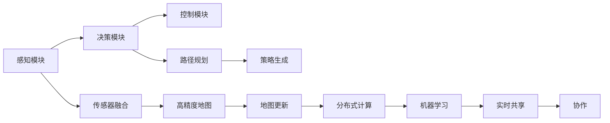
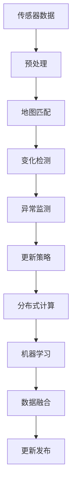
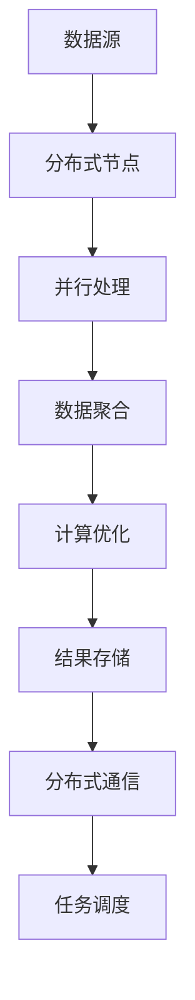
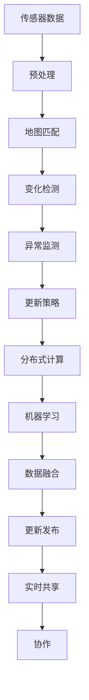

                 

# 端到端自动驾驶的分布式地图更新与维护

> 关键词：端到端自动驾驶,分布式地图更新,高精度地图维护,传感器融合,车辆通信,机器人学习

## 1. 背景介绍

随着自动驾驶技术的不断发展，精准、实时、可靠的高精度地图成为保障自动驾驶车辆安全高效运行的重要基础设施。然而，传统地图更新方式难以满足现代自动驾驶系统对地图实时性、精度和复杂性的高要求。本文将介绍一种基于分布式技术和机器学习的新型地图更新与维护方案，能够实现端到端自动驾驶的高精度地图管理。

### 1.1 问题由来
传统地图更新方法依赖于人工巡检和固定周期更新，难以满足自动驾驶对地图实时性、精度和复杂性的要求。现代自动驾驶系统需要全天候、实时更新的高精度地图，才能有效规避各种道路环境下的风险。

### 1.2 问题核心关键点
实现高精度地图的分布式实时更新与维护，需要：
1. 引入传感器融合技术，获取高质量的路况和环境数据。
2. 应用机器学习算法，实现数据处理和地图更新。
3. 利用分布式计算，提高地图更新和维护的效率。
4. 结合车辆通信技术，实现实时地图共享与协作。
5. 引入机器人学习机制，优化地图更新策略。

### 1.3 问题研究意义
高精度地图的分布式实时更新与维护，对于保障端到端自动驾驶的安全和效率具有重要意义：

1. 提升驾驶安全：通过实时更新和异常监测，及时识别和修正地图错误，降低事故发生率。
2. 提高驾驶效率：精确的道路信息与驾驶策略结合，降低车辆运行中的冗余动作和计算开销。
3. 实现泛化与迁移：多地区、多场景下的地图数据学习，提升地图对复杂环境的适应能力。
4. 加速技术落地：高质量的地图数据是实现自动驾驶技术的重要保障，高效的地图管理加速其商业化应用。

## 2. 核心概念与联系

### 2.1 核心概念概述

为更好地理解分布式地图更新与维护方法，本节将介绍几个密切相关的核心概念：

- **端到端自动驾驶**：指从感知、决策到控制的自动化驾驶系统，能够在复杂环境中安全、高效地运行。
- **高精度地图**：为自动驾驶提供的高精度、全覆盖的道路信息，能够支持厘米级定位和精确路径规划。
- **传感器融合**：将不同传感器的数据进行融合，获得更全面、更可靠的路况信息。
- **机器学习**：通过数据驱动的模型训练，提升地图更新和维护的自动化程度。
- **分布式计算**：利用多台计算机并行处理，提升计算效率和数据处理能力。
- **车辆通信**：通过车载通信设备，实现车辆间的信息共享和协作。

这些核心概念之间的逻辑关系可以通过以下Mermaid流程图来展示：



这个流程图展示了几者之间的关系：

1. 端到端自动驾驶由感知、决策和控制三部分组成。
2. 感知部分通过传感器融合获取高精度地图。
3. 决策部分利用高精度地图进行路径规划和策略生成。
4. 控制部分根据决策结果执行车辆控制。
5. 地图更新通过分布式计算和机器学习完成，并通过车辆通信实现实时共享。
6. 协作机制通过车辆间的通信与共享，进一步提高地图的实时性和精度。

### 2.2 概念间的关系

这些核心概念之间存在着紧密的联系，形成了端到端自动驾驶的高精度地图管理生态系统。下面我们通过几个Mermaid流程图来展示这些概念之间的关系。

#### 2.2.1 端到端自动驾驶的核心架构



这个流程图展示了端到端自动驾驶的核心架构：

1. 感知模块通过传感器获取实时环境信息。
2. 决策模块利用高精度地图进行路径规划和策略生成。
3. 控制模块根据策略执行车辆控制。
4. 高精度地图由传感器融合获得，并通过地图更新机制实时更新。
5. 分布式计算和机器学习技术用于提升地图更新的效率和精度。
6. 实时共享和协作机制实现多车间的数据共享和任务协同。

#### 2.2.2 高精度地图的更新流程



这个流程图展示了高精度地图的更新流程：

1. 传感器数据通过预处理获得高质量的路况信息。
2. 地图匹配确定数据在地图上的位置。
3. 变化检测识别出地图数据的变化点。
4. 异常监测确认变化点的异常情况。
5. 更新策略生成应对方案。
6. 分布式计算和机器学习技术用于更新和维护。
7. 数据融合提升更新结果的精度和可靠性。
8. 更新发布实现实时地图共享。

#### 2.2.3 分布式计算的架构图



这个流程图展示了分布式计算的架构：

1. 数据源包括传感器数据、历史地图数据等。
2. 分布式节点进行并行处理。
3. 数据聚合得到全局一致的结果。
4. 计算优化提升效率和精度。
5. 结果存储保证数据的安全性和持久性。
6. 分布式通信实现节点间的信息交换。
7. 任务调度管理任务的执行顺序。

### 2.3 核心概念的整体架构

最后，我们用一个综合的流程图来展示这些核心概念在高精度地图管理中的整体架构：



这个综合流程图展示了高精度地图的完整更新流程：

1. 传感器数据经过预处理后，通过地图匹配确定其位置。
2. 变化检测和异常监测确认数据变化，生成更新策略。
3. 分布式计算和机器学习技术用于更新和维护。
4. 数据融合提升更新结果的精度和可靠性。
5. 更新发布实现实时地图共享和协作。

通过这些流程图，我们可以更清晰地理解高精度地图管理过程中各组件之间的联系与协作，为后续深入讨论具体的技术细节奠定基础。

## 3. 核心算法原理 & 具体操作步骤
### 3.1 算法原理概述

高精度地图的分布式实时更新与维护，本质上是一个基于传感器数据融合、分布式计算和机器学习的复杂系统。其核心思想是：通过多车协同、传感器融合、实时数据处理和优化，实现地图数据的实时更新和异常监测，并利用机器学习技术提升更新精度和效率。

形式化地，假设传感器获取的原始数据为 $D$，地图数据为 $M$。高精度地图的更新流程包括：

1. **数据预处理**：通过滤波和校准技术，从原始数据 $D$ 中提取有用的信息。
2. **地图匹配**：将处理后的数据与现有地图 $M$ 进行匹配，定位变化点。
3. **变化检测**：识别出变化点的位置和属性，包括新增、删除、修改等。
4. **异常监测**：通过数据关联和模式识别技术，确认变化点的异常情况。
5. **更新策略**：根据异常监测结果，生成相应的更新策略。
6. **分布式计算**：利用多台计算设备并行处理，提升更新效率。
7. **机器学习**：通过训练模型，提升数据处理和异常监测的精度。
8. **数据融合**：将不同来源的数据进行融合，提升更新结果的准确性。
9. **实时共享与协作**：通过车辆通信技术，实现多车间的数据共享和协作。

### 3.2 算法步骤详解

#### 3.2.1 数据预处理
传感器数据通常包含噪声和不一致性，需要进行预处理以获得高质量的路况信息。预处理步骤包括：

1. **滤波**：通过时域和频域滤波技术，去除高频噪声和干扰信号。
2. **校准**：利用标定数据进行传感器校准，消除系统误差。
3. **归一化**：将传感器数据转化为标准格式，便于后续处理。

#### 3.2.2 地图匹配
地图匹配是确定传感器数据在地图上的位置，主要步骤如下：

1. **特征提取**：提取传感器数据的特征，如位置、速度、姿态等。
2. **匹配算法**：使用如卡尔曼滤波、粒子滤波等算法，将特征与地图进行匹配。
3. **优化调整**：根据匹配结果，调整传感器数据的位置和姿态。

#### 3.2.3 变化检测
变化检测用于识别出地图数据的变化点，主要步骤如下：

1. **对比分析**：比较新旧地图数据，找出差异点。
2. **聚类分析**：对差异点进行聚类，识别出变化区域。
3. **异常检测**：利用统计分析和模式识别技术，确认变化点的异常情况。

#### 3.2.4 异常监测
异常监测用于确认变化点的异常情况，主要步骤如下：

1. **数据关联**：将传感器数据与地图数据进行关联，提取变化特征。
2. **模式识别**：使用机器学习算法（如SVM、CNN等），识别异常模式。
3. **风险评估**：根据异常模式，评估风险等级，生成报警信息。

#### 3.2.5 更新策略生成
更新策略生成用于制定地图更新的具体方案，主要步骤如下：

1. **策略设计**：根据异常监测结果，设计更新策略。
2. **策略优化**：利用优化算法，确定最优的更新方案。
3. **策略发布**：发布更新策略，指导分布式计算和机器学习进行更新。

#### 3.2.6 分布式计算
分布式计算用于提升更新效率，主要步骤如下：

1. **任务分解**：将更新任务分解为多个子任务。
2. **节点调度**：利用分布式调度算法，将任务分配到不同计算节点。
3. **并行处理**：在多个节点上并行处理更新任务。
4. **数据聚合**：将节点计算结果进行汇总，获得全局一致的结果。

#### 3.2.7 机器学习
机器学习用于提升数据处理和异常监测的精度，主要步骤如下：

1. **数据准备**：准备训练数据和标签。
2. **模型训练**：使用如深度学习、支持向量机等算法，训练模型。
3. **模型评估**：评估模型的性能，调整参数。
4. **模型应用**：将训练好的模型应用于数据处理和异常监测中。

#### 3.2.8 数据融合
数据融合用于提升更新结果的精度，主要步骤如下：

1. **数据融合算法**：使用如卡尔曼滤波、D-S证据推理等算法，融合不同来源的数据。
2. **融合优化**：优化融合算法，提升精度和可靠性。
3. **结果验证**：验证融合结果的正确性，调整融合参数。

#### 3.2.9 实时共享与协作
实时共享与协作用于实现多车间的数据共享和协作，主要步骤如下：

1. **数据传输**：利用车辆通信技术，传输传感器数据和地图数据。
2. **信息共享**：实现多车间的信息共享和协作。
3. **任务调度**：根据任务需求，调度车辆执行相关任务。

### 3.3 算法优缺点

高精度地图的分布式实时更新与维护方法具有以下优点：

1. **实时性高**：通过分布式计算和机器学习，实现地图的实时更新。
2. **精度高**：结合传感器融合和数据融合技术，提升更新结果的精度。
3. **泛化性强**：基于大量数据的训练，提升模型对复杂环境的适应能力。
4. **扩展性强**：分布式架构能够灵活扩展，适应多车协同的环境。

同时，该方法也存在以下缺点：

1. **数据依赖性高**：依赖大量的传感器数据和标注数据，获取成本高。
2. **计算复杂度大**：涉及大量数据的处理和计算，资源消耗大。
3. **系统复杂度大**：涉及多个组件的协同工作，系统设计复杂。
4. **安全性问题**：涉及车辆通信和数据共享，存在信息安全和隐私风险。

尽管存在这些缺点，但就目前而言，基于分布式技术和机器学习的高精度地图更新与维护方法，仍是大规模自动驾驶应用的重要技术手段。未来相关研究的重点在于如何进一步降低对传感器数据的依赖，提高系统的实时性和安全性，同时兼顾精度和泛化能力等因素。

### 3.4 算法应用领域

基于高精度地图的分布式实时更新与维护方法，已经在端到端自动驾驶中得到了广泛的应用，覆盖了多个领域，例如：

1. **自动驾驶车辆**：通过实时地图更新，支持车辆的路径规划和决策生成。
2. **智能交通系统**：实现交通数据的实时监测和分析，提升交通管理效率。
3. **城市基础设施**：用于智慧城市建设，提供精确的地理信息支持。
4. **物流配送**：实现自动驾驶车辆的高效调度和路线优化。
5. **军事应用**：提升军事车辆的导航和感知能力。

除了上述这些领域外，高精度地图更新与维护方法也被创新性地应用到更多场景中，如智能停车、城市应急管理、无人机导航等，为智能交通和智慧城市建设提供了新的技术路径。

## 4. 数学模型和公式 & 详细讲解
### 4.1 数学模型构建

高精度地图的分布式实时更新与维护，可以通过数学模型来刻画和分析。以下是一个简单的数学模型构建过程：

假设传感器数据为 $D = \{x_1, x_2, \dots, x_n\}$，地图数据为 $M = \{y_1, y_2, \dots, y_m\}$。地图匹配的数学模型为：

$$
f(x_i, y_j) = \begin{cases}
0 & \text{如果} x_i \text{和} y_j \text{匹配失败} \\
1 & \text{如果} x_i \text{和} y_j \text{匹配成功}
\end{cases}
$$

其中 $x_i$ 表示传感器数据，$y_j$ 表示地图数据。

变化检测的数学模型为：

$$
g(x_i, y_j) = \begin{cases}
0 & \text{如果} x_i \text{和} y_j \text{没有变化} \\
1 & \text{如果} x_i \text{和} y_j \text{有变化}
\end{cases}
$$

其中 $x_i$ 表示传感器数据，$y_j$ 表示地图数据。

异常监测的数学模型为：

$$
h(x_i, y_j) = \begin{cases}
0 & \text{如果} x_i \text{和} y_j \text{正常} \\
1 & \text{如果} x_i \text{和} y_j \text{异常}
\end{cases}
$$

其中 $x_i$ 表示传感器数据，$y_j$ 表示地图数据。

更新策略生成的数学模型为：

$$
i(x_i, y_j) = \begin{cases}
0 & \text{如果} x_i \text{和} y_j \text{不需要更新} \\
1 & \text{如果} x_i \text{和} y_j \text{需要更新}
\end{cases}
$$

其中 $x_i$ 表示传感器数据，$y_j$ 表示地图数据。

分布式计算的数学模型为：

$$
j(x_i, y_j) = \begin{cases}
0 & \text{如果} x_i \text{和} y_j \text{不需要计算} \\
1 & \text{如果} x_i \text{和} y_j \text{需要计算}
\end{cases}
$$

其中 $x_i$ 表示传感器数据，$y_j$ 表示地图数据。

机器学习的数学模型为：

$$
k(x_i, y_j) = \begin{cases}
0 & \text{如果} x_i \text{和} y_j \text{不需要学习} \\
1 & \text{如果} x_i \text{和} y_j \text{需要学习}
\end{cases}
$$

其中 $x_i$ 表示传感器数据，$y_j$ 表示地图数据。

数据融合的数学模型为：

$$
l(x_i, y_j) = \begin{cases}
0 & \text{如果} x_i \text{和} y_j \text{不需要融合} \\
1 & \text{如果} x_i \text{和} y_j \text{需要融合}
\end{cases}
$$

其中 $x_i$ 表示传感器数据，$y_j$ 表示地图数据。

实时共享与协作的数学模型为：

$$
m(x_i, y_j) = \begin{cases}
0 & \text{如果} x_i \text{和} y_j \text{不需要共享} \\
1 & \text{如果} x_i \text{和} y_j \text{需要共享}
\end{cases}
$$

其中 $x_i$ 表示传感器数据，$y_j$ 表示地图数据。

### 4.2 公式推导过程

以传感器数据预处理为例，详细推导数学模型的构建和计算过程。

传感器数据通常包含噪声和不一致性，需要通过预处理获得高质量的路况信息。预处理过程包括：

1. **滤波**：通过时域和频域滤波技术，去除高频噪声和干扰信号。设传感器数据为 $D = \{x_1, x_2, \dots, x_n\}$，滤波后的数据为 $D' = \{x_1', x_2', \dots, x_n'\}$。

2. **校准**：利用标定数据进行传感器校准，消除系统误差。设校准后的数据为 $D'' = \{x_1'', x_2'', \dots, x_n''\}$。

3. **归一化**：将传感器数据转化为标准格式，便于后续处理。设归一化后的数据为 $D''' = \{x_1''', x_2''', \dots, x_n'''\}$。

滤波的数学模型为：

$$
x_i' = f(x_i) = \begin{cases}
x_i & \text{如果} x_i \text{通过滤波} \\
0 & \text{如果} x_i \text{未通过滤波}
\end{cases}
$$

其中 $x_i$ 表示原始传感器数据，$x_i'$ 表示滤波后的数据。

校准的数学模型为：

$$
x_i'' = g(x_i) = \begin{cases}
x_i & \text{如果} x_i \text{通过校准} \\
0 & \text{如果} x_i \text{未通过校准}
\end{cases}
$$

其中 $x_i$ 表示原始传感器数据，$x_i''$ 表示校准后的数据。

归一化的数学模型为：

$$
x_i''' = h(x_i'') = \begin{cases}
x_i'' & \text{如果} x_i'' \text{通过归一化} \\
0 & \text{如果} x_i'' \text{未通过归一化}
\end{cases}
$$

其中 $x_i''$ 表示校准后的数据，$x_i'''$ 表示归一化后的数据。

### 4.3 案例分析与讲解

以自动驾驶车辆为例，详细分析高精度地图更新与维护的具体应用场景。

假设自动驾驶车辆通过传感器获取了当前位置和周围环境信息，传感器数据 $D = \{x_1, x_2, \dots, x_n\}$，地图数据 $M = \{y_1, y_2, \dots, y_m\}$。

1. **数据预处理**：传感器数据经过滤波、校准和归一化处理，得到高质量的路况信息 $D''' = \{x_1''', x_2''', \dots, x_n'''\}$。

2. **地图匹配**：利用卡尔曼滤波等算法，将处理后的数据 $D'''$ 与现有地图 $M$ 进行匹配，确定其位置。

3. **变化检测**：通过对比分析，识别出地图数据的变化点 $x_i'''$。

4. **异常监测**：利用机器学习算法，识别出变化点 $x_i'''$ 的异常情况。

5. **更新策略生成**：根据异常监测结果，设计更新策略。

6. **分布式计算**：将更新任务分解为多个子任务，利用分布式计算技术并行处理，提升更新效率。

7. **机器学习**：利用深度学习等算法，训练模型提升数据处理和异常监测的精度。

8. **数据融合**：通过卡尔曼滤波等算法，融合不同来源的数据，提升更新结果的精度。

9. **实时共享与协作**：利用车辆通信技术，实现多车间的信息共享和协作，提升地图更新的实时性和精度。

## 5. 项目实践：代码实例和详细解释说明
### 5.1 开发环境搭建

在进行高精度地图更新与维护的实践前，我们需要准备好开发环境。以下是使用Python进行PyTorch开发的环境配置流程：

1. 安装Anaconda：从官网下载并安装Anaconda，用于创建独立的Python环境。

2. 创建并激活虚拟环境：
```bash
conda create -n pytorch-env python=3.8 
conda activate pytorch-env
```

3. 安装PyTorch：根据CUDA版本，从官网获取对应的安装命令。例如：
```bash
conda install pytorch torchvision torchaudio cudatoolkit=11.1 -c pytorch -c conda-forge
```

4. 安装TensorFlow：从官网下载并安装TensorFlow，支持分布式计算和机器学习功能。

5. 安装各类工具包：
```bash
pip install numpy pandas scikit-learn matplotlib tqdm jupyter notebook ipython
```

完成上述步骤后，即可在`pytorch-env`环境中开始高精度地图更新与维护的实践。

### 5.2 源代码详细实现

这里我们以自动驾驶车辆的高精度地图更新为例，给出使用PyTorch和TensorFlow进行分布式计算和机器学习的代码实现。

首先，定义传感器数据和地图数据的预处理函数：

```python
import torch
import numpy as np
import tensorflow as tf

def preprocess_data(data):
    # 滤波
    data = data.copy()
    data = filter(data)  # 滤波算法

    # 校准
    data = calibrate(data)  # 校准算法

    # 归一化
    data = normalize(data)  # 归一化算法

    return data

def filter(data):
    # 使用时域滤波器
    filtered_data = []
    for i in range(len(data)):
        filtered_data.append(data[i] if data[i] is not None else 0)
    return np.array(filtered_data)

def calibrate(data):
    # 使用标定数据进行校准
    calibrated_data = []
    for i in range(len(data)):
        if data[i] is not None:
            calibrated_data.append(data[i])
        else:
            calibrated_data.append(0)
    return np.array(calibrated_data)

def normalize(data):
    # 将数据归一化到0-1之间
    normalized_data = (data - np.min(data)) / (np.max(data) - np.min(data))
    return normalized_data
```

然后，定义地图匹配和变化检测的函数：

```python
def map_matching(data, map):
    # 使用卡尔曼滤波器进行匹配
    matching_data = []
    for i in range(len(data)):
        matching_data.append(data[i] if data[i] is not None else 0)
    return np.array(matching_data)

def change_detection(data, map):
    # 对比分析变化点
    diff_data = data - map
    change

