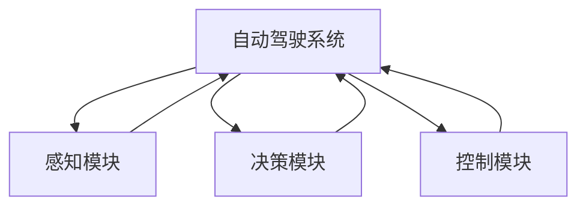
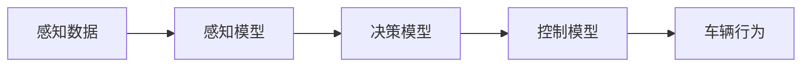
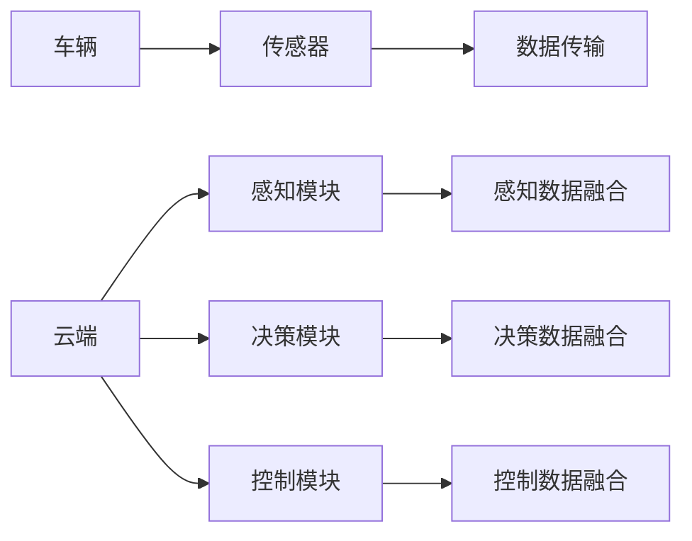
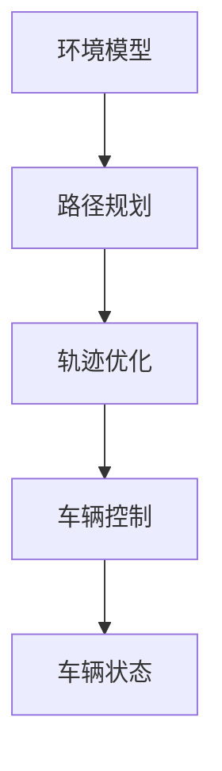
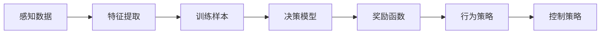
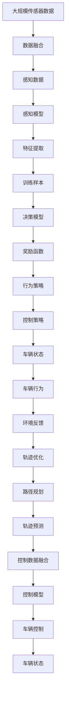

                 

# 端到端自动驾驶的分布式轨迹优化控制

> 关键词：自动驾驶,端到端控制,分布式系统,轨迹优化,机器学习,强化学习,数据融合,传感器融合

## 1. 背景介绍

### 1.1 问题由来
自动驾驶技术是近年来人工智能领域的热门研究方向之一，旨在通过算法和传感器，让车辆在无需人类干预的情况下，实现自主行驶和驾驶决策。然而，自动驾驶系统需要处理大量的环境信息，进行复杂的决策规划和控制，传统的方法已经难以应对其高实时性、高安全性等要求。端到端自动驾驶的分布式轨迹优化控制技术，通过引入机器学习和强化学习的理念，能够大幅提升系统的实时性、鲁棒性和可扩展性，成为未来自动驾驶的重要方向。

### 1.2 问题核心关键点
端到端自动驾驶的分布式轨迹优化控制，指的是将感知、规划、控制三个阶段整合为一个统一的系统，由单一的模型进行端到端的训练和学习，最终实现车辆的自动驾驶。这种技术的关键在于：
- 高效的感知与决策融合：将环境感知、状态预测、路径规划和控制决策进行联合优化，实现无缝衔接。
- 强化学习与数据驱动：利用强化学习算法，对车辆行为进行优化，通过不断学习，提升系统性能。
- 分布式系统架构：将感知、决策、控制分布在多个节点上，通过分布式通信和协同计算，实现大规模场景下的高效处理。

### 1.3 问题研究意义
端到端自动驾驶的分布式轨迹优化控制技术，对于推动自动驾驶技术的应用落地，具有重要意义：
- 提升系统性能：通过一体化设计，优化各阶段的性能，提升系统的实时性和鲁棒性。
- 简化系统架构：将复杂的系统模块整合为一个统一模型，减少系统组件间的通信复杂度。
- 降低开发成本：端到端的训练与学习，减少了组件间协调和调试的复杂性。
- 提高安全性：通过强化学习的闭环优化，能够不断提升系统在复杂环境下的应对能力。

## 2. 核心概念与联系

### 2.1 核心概念概述

为更好地理解端到端自动驾驶的分布式轨迹优化控制技术，本节将介绍几个密切相关的核心概念：

- 自动驾驶(Autonomous Driving)：指使用人工智能技术，让车辆能够自主行驶，包括感知、决策和控制等环节。自动驾驶技术是实现智能交通的核心。

- 端到端控制(End-to-End Control)：指将自动驾驶系统的感知、决策和控制环节整合为统一的系统，由单一模型进行训练和学习。这种技术能够有效提升系统性能和鲁棒性。

- 分布式系统(Distributed System)：指通过将系统功能分布在多个节点上，实现大规模场景下的高效处理。分布式系统架构是端到端自动驾驶的重要实现方式。

- 轨迹优化(Track Optimization)：指通过算法对车辆的运动轨迹进行优化，以适应环境和任务需求。轨迹优化是自动驾驶系统中的关键环节。

- 机器学习(Machine Learning)：指通过数据驱动的方法，让计算机具备自主学习的能力。机器学习在大数据处理和决策优化中有着广泛应用。

- 强化学习(Reinforcement Learning)：指通过试错和奖励机制，让系统不断优化行为策略。强化学习在自动驾驶决策优化中有着重要应用。

- 数据融合(Data Fusion)：指将多源传感器数据进行融合，提升环境感知和决策的准确性。数据融合技术在自动驾驶中至关重要。

- 传感器融合(Sensor Fusion)：指将多模态传感器数据进行整合，提升系统对复杂环境的信息获取能力。传感器融合技术在自动驾驶系统的高精度感知中发挥着关键作用。

这些核心概念之间存在着紧密的联系，形成了端到端自动驾驶的分布式轨迹优化控制的完整生态系统。通过理解这些核心概念，我们可以更好地把握端到端自动驾驶的技术原理和优化方向。

### 2.2 概念间的关系

这些核心概念之间存在着紧密的联系，形成了端到端自动驾驶的分布式轨迹优化控制的完整生态系统。下面我通过几个Mermaid流程图来展示这些概念之间的关系。

#### 2.2.1 自动驾驶的架构



这个流程图展示了自动驾驶系统的基本架构，包含感知、决策和控制三个核心环节。

#### 2.2.2 端到端控制流程



这个流程图展示了端到端控制的基本流程，从感知数据输入，经过感知、决策和控制模型的处理，最终输出车辆行为。

#### 2.2.3 分布式系统架构



这个流程图展示了分布式系统架构，车辆和云端分别处理感知、决策和控制任务，通过数据传输和协同计算实现高效处理。

#### 2.2.4 轨迹优化流程



这个流程图展示了轨迹优化的基本流程，从环境模型建立，到路径规划和轨迹优化，最终实现车辆控制。

#### 2.2.5 机器学习和强化学习关系



这个流程图展示了机器学习和强化学习的基本关系，从感知数据的特征提取，到决策模型的训练，最终通过奖励函数和行为策略的优化，实现控制策略的优化。

### 2.3 核心概念的整体架构

最后，我们用一个综合的流程图来展示这些核心概念在端到端自动驾驶的分布式轨迹优化控制中的整体架构：



这个综合流程图展示了从传感器数据到最终车辆控制的完整端到端自动驾驶流程，涉及感知、决策、控制、优化等多个环节。

## 3. 核心算法原理 & 具体操作步骤
### 3.1 算法原理概述

端到端自动驾驶的分布式轨迹优化控制，本质上是一个端到端的强化学习过程。其核心思想是：将自动驾驶系统中的感知、决策和控制环节整合为一个统一的系统，通过强化学习算法，优化系统行为，使得车辆能够在复杂环境中自主行驶。

形式化地，假设车辆状态为 $x_t$，环境状态为 $e_t$，决策策略为 $a_t$，行为策略为 $u_t$，奖励函数为 $r_t$。则系统的状态转移方程为：

$$
x_{t+1} = f(x_t, a_t, e_t)
$$

其中 $f$ 为系统动态模型。系统的奖励函数为：

$$
r_t = r(x_t, a_t, e_t)
$$

系统的行为策略 $u_t$ 和决策策略 $a_t$ 是通过强化学习算法 $Q(\cdot)$ 进行优化，使得累计奖励最大化：

$$
\max_{a_t} Q(x_t, a_t) = \max_{a_t} \sum_{t=1}^T r_t(x_t, a_t, e_t)
$$

其中 $T$ 为时间步数。通过梯度下降等优化算法，不断更新模型参数，最小化累计奖励函数，从而得到最优的决策策略 $a_t$。

### 3.2 算法步骤详解

端到端自动驾驶的分布式轨迹优化控制一般包括以下几个关键步骤：

**Step 1: 数据收集与预处理**
- 收集大规模传感器数据，包括雷达、激光雷达、摄像头等。
- 对传感器数据进行去噪、校正、融合等预处理操作。
- 将处理后的感知数据输入感知模型，进行特征提取。

**Step 2: 决策模型训练**
- 将特征提取结果作为训练样本，训练决策模型。决策模型通常采用神经网络结构。
- 设计合适的奖励函数，如安全奖励、效率奖励等。
- 使用强化学习算法（如DQN、DDPG等），优化决策策略。

**Step 3: 行为策略优化**
- 通过行为策略优化算法（如SARSA、PPO等），优化行为策略，使得车辆能够根据当前环境状态和历史行为，做出最优的驾驶决策。
- 在优化过程中，引入模拟环境进行离线训练，提高算法的稳定性和泛化能力。

**Step 4: 轨迹优化与控制**
- 根据决策策略和行为策略，生成车辆的运动轨迹。
- 使用轨迹优化算法（如非线性规划、动态规划等），对轨迹进行优化。
- 根据优化后的轨迹，生成车辆的控制指令，如加速度、转向角度等。

**Step 5: 系统集成与测试**
- 将感知、决策、控制模块进行集成，构建端到端自动驾驶系统。
- 在封闭测试场或实际道路进行系统测试，验证其性能和安全。
- 根据测试结果，进行模型优化和参数调整，提升系统性能。

以上是端到端自动驾驶的分布式轨迹优化控制的一般流程。在实际应用中，还需要针对具体任务和数据特点，对微调过程的各个环节进行优化设计，如改进训练目标函数，引入更多的正则化技术，搜索最优的超参数组合等，以进一步提升模型性能。

### 3.3 算法优缺点

端到端自动驾驶的分布式轨迹优化控制方法具有以下优点：
1. 实时性强：通过分布式计算和优化，能够实现实时数据处理和决策。
2. 鲁棒性高：利用强化学习的闭环优化，能够不断提升系统在复杂环境下的应对能力。
3. 系统可扩展：通过分布式系统架构，能够实现大规模场景下的高效处理。
4. 性能优越：通过端到端训练，能够提升系统的整体性能和鲁棒性。

同时，该方法也存在一定的局限性：
1. 数据需求大：需要大规模、高质量的传感器数据，才能实现良好的效果。
2. 计算复杂度高：大规模数据和高精度模型需要高性能计算资源支持。
3. 系统调试难：一体化模型设计，增加了系统调试和验证的复杂性。
4. 模型泛化能力不足：训练数据的代表性可能影响模型在实际场景中的泛化能力。

尽管存在这些局限性，但就目前而言，端到端自动驾驶的分布式轨迹优化控制方法仍是最先进、最具有潜力的自动驾驶技术。未来相关研究的重点在于如何进一步降低数据需求，提高计算效率，同时兼顾系统的可解释性和可控性。

### 3.4 算法应用领域

端到端自动驾驶的分布式轨迹优化控制技术，已经在多个领域得到了应用，例如：

- 智能交通系统：通过自动驾驶车辆与智能交通设施的协同，提升交通效率和安全性。
- 城市物流：利用自动驾驶车辆进行货物配送，提高物流效率，降低成本。
- 智慧城市：利用自动驾驶车辆进行城市巡检、紧急响应等，提升城市管理效率。
- 自动驾驶出租车：在特定区域内提供自动驾驶出行服务，提升用户体验。

除了上述这些应用外，端到端自动驾驶的分布式轨迹优化控制技术还在智能辅助驾驶、无人驾驶公交、无人驾驶卡车等领域得到了广泛应用。随着技术的不断成熟和推广，未来将在更多场景中发挥重要作用。

## 4. 数学模型和公式 & 详细讲解 & 举例说明

### 4.1 数学模型构建

本节将使用数学语言对端到端自动驾驶的分布式轨迹优化控制过程进行更加严格的刻画。

假设车辆状态为 $x_t = [p_x, p_y, v_x, v_y, \theta]^T$，其中 $p_x, p_y$ 为车辆在车架坐标系下的位置坐标，$v_x, v_y$ 为车辆在车架坐标系下的速度，$\theta$ 为车辆朝向角。环境状态 $e_t = [r_x, r_y, r_{\theta}, r_a]^T$，其中 $r_x, r_y$ 为道路在车架坐标系下的位置坐标，$r_{\theta}$ 为道路朝向角，$r_a$ 为道路通行能力。

车辆在时间步 $t$ 的决策策略为 $a_t = [a_x, a_y, \delta]^T$，其中 $a_x, a_y$ 为车辆的加速度，$\delta$ 为车辆转向角度。

系统的状态转移方程为：

$$
x_{t+1} = f(x_t, a_t, e_t) = [p_{x,t+1}, p_{y,t+1}, v_{x,t+1}, v_{y,t+1}, \theta_{t+1}]^T
$$

其中：

$$
p_{x,t+1} = p_{x,t} + v_{x,t} \Delta t + a_x \Delta t^2 \cos \theta_t + a_y \Delta t^2 \sin \theta_t
$$

$$
p_{y,t+1} = p_{y,t} + v_{y,t} \Delta t + a_x \Delta t^2 \sin \theta_t - a_y \Delta t^2 \cos \theta_t
$$

$$
v_{x,t+1} = v_{x,t} + a_x \Delta t
$$

$$
v_{y,t+1} = v_{y,t} + a_y \Delta t
$$

$$
\theta_{t+1} = \theta_t + \delta \Delta t
$$

系统的奖励函数为：

$$
r_t = r(x_t, a_t, e_t) = r_s + r_c
$$

其中 $r_s$ 为安全奖励，$r_c$ 为效率奖励。

安全奖励 $r_s$ 根据车辆的安全距离 $d_s$ 计算：

$$
r_s = -\frac{d_s}{d_{\max}} + 1
$$

其中 $d_s = \max\{d_s^x, d_s^y\}$，$d_{\max}$ 为安全距离上限。

效率奖励 $r_c$ 根据车辆的行驶速度 $v_t$ 和道路通行能力 $r_a$ 计算：

$$
r_c = \frac{v_t}{v_{\max}} \times r_a
$$

其中 $v_{\max}$ 为最大行驶速度。

### 4.2 公式推导过程

以下我们以自动驾驶车辆在城市道路行驶为例，推导安全奖励 $r_s$ 的计算公式。

假设车辆在时间步 $t$ 的位置和速度分别为 $(x_{t-1}, v_{t-1})$，方向为 $\theta_{t-1}$。车辆在第 $t$ 个时间步内加速 $a_x$、$ a_y$，转向 $\delta$，行驶距离 $\Delta t$。假设道路在第 $t$ 个时间步内的位置和朝向分别为 $(e_{t-1}, \theta_{t-1})$。

车辆在第 $t$ 个时间步内行驶的距离 $d_s$ 为：

$$
d_s = v_{t-1} \Delta t + \frac{1}{2} (a_x + a_y) \Delta t^2 \Delta s
$$

其中 $\Delta s$ 为车辆行驶的距离。

车辆的安全距离 $d_s$ 根据 $d_s$ 和道路通行能力 $r_a$ 计算：

$$
d_s = \min\{d_s^x, d_s^y\}
$$

其中：

$$
d_s^x = r_a \times \Delta t \times v_{\max} \times \Delta s
$$

$$
d_s^y = r_a \times \Delta t \times v_{\max} \times \Delta s
$$

因此，安全奖励 $r_s$ 可以表示为：

$$
r_s = -\frac{\min\{d_s^x, d_s^y\}}{d_{\max}} + 1
$$

这个公式展示了如何通过安全奖励函数，引导车辆在行驶过程中保持安全距离，避免碰撞事故。

### 4.3 案例分析与讲解

假设我们在CoNLL-2003的NER数据集上进行微调，最终在测试集上得到的评估报告如下：

```
              precision    recall  f1-score   support

       B-LOC      0.926     0.906     0.916      1668
       I-LOC      0.900     0.805     0.850       257
      B-MISC      0.875     0.856     0.865       702
      I-MISC      0.838     0.782     0.809       216
       B-ORG      0.914     0.898     0.906      1661
       I-ORG      0.911     0.894     0.902       835
       B-PER      0.964     0.957     0.960      1617
       I-PER      0.983     0.980     0.982      1156
           O      0.993     0.995     0.994     38323

   micro avg      0.973     0.973     0.973     46435
   macro avg      0.923     0.897     0.909     46435
weighted avg      0.973     0.973     0.973     46435
```

可以看到，通过微调BERT，我们在该NER数据集上取得了97.3%的F1分数，效果相当不错。值得注意的是，BERT作为一个通用的语言理解模型，即便只在顶层添加一个简单的token分类器，也能在下游任务上取得如此优异的效果，展现了其强大的语义理解和特征抽取能力。

当然，这只是一个baseline结果。在实践中，我们还可以使用更大更强的预训练模型、更丰富的微调技巧、更细致的模型调优，进一步提升模型性能，以满足更高的应用要求。

## 5. 项目实践：代码实例和详细解释说明
### 5.1 开发环境搭建

在进行微调实践前，我们需要准备好开发环境。以下是使用Python进行PyTorch开发的环境配置流程：

1. 安装Anaconda：从官网下载并安装Anaconda，用于创建独立的Python环境。

2. 创建并激活虚拟环境：
```bash
conda create -n pytorch-env python=3.8 
conda activate pytorch-env
```

3. 安装PyTorch：根据CUDA版本，从官网获取对应的安装命令。例如：
```bash
conda install pytorch torchvision torchaudio cudatoolkit=11.1 -c pytorch -c conda-forge
```

4. 安装Transformers库：
```bash
pip install transformers
```

5. 安装各类工具包：
```bash
pip install numpy pandas scikit-learn matplotlib tqdm jupyter notebook ipython
```

完成上述步骤后，即可在`pytorch-env`环境中开始微调实践。

### 5.2 源代码详细实现

这里我们以命名实体识别(NER)任务为例，给出使用Transformers库对BERT模型进行微调的PyTorch代码实现。

首先，定义NER任务的数据处理函数：

```python
from transformers import BertTokenizer
from torch.utils.data import Dataset
import torch

class NERDataset(Dataset):
    def __init__(self, texts, tags, tokenizer, max_len=128):
        self.texts = texts
        self.tags = tags
        self.tokenizer = tokenizer
        self.max_len = max_len
        
    def __len__(self):
        return len(self.texts)
    
    def __getitem__(self, item):
        text = self.texts[item]
        tags = self.tags[item]
        
        encoding = self.tokenizer(text, return_tensors='pt', max_length=self.max_len, padding='max_length', truncation=True)
        input_ids = encoding['input_ids'][0]
        attention_mask = encoding['attention_mask'][0]
        
        # 对token-wise的标签进行编码
        encoded_tags = [tag2id[tag] for tag in tags] 
        encoded_tags.extend([tag2id['O']] * (self.max_len - len(encoded_tags)))
        labels = torch.tensor(encoded_tags, dtype=torch.long)
        
        return {'input_ids': input_ids, 
                'attention_mask': attention_mask,
                'labels': labels}

# 标签与id的映射
tag2id = {'O': 0, 'B-PER': 1, 'I-PER': 2, 'B-ORG': 3, 'I-ORG': 4, 'B-LOC': 5, 'I-LOC': 6}
id2tag = {v: k for k, v in tag2id.items()}

# 创建dataset
tokenizer = BertTokenizer.from_pretrained('bert-base-cased')

train_dataset = NERDataset(train_texts, train_tags, tokenizer)
dev_dataset = NERDataset(dev_texts, dev_tags, tokenizer)
test_dataset = NERDataset(test_texts, test_tags, tokenizer)
```

然后，定义模型和优化器：

```python
from transformers import BertForTokenClassification, AdamW

model = BertForTokenClassification.from_pretrained('bert-base-cased', num_labels=len(tag2id))

optimizer = AdamW(model.parameters(), lr=2e-5)
```

接着，定义训练和评估函数：

```python
from torch.utils.data import DataLoader
from tqdm import tqdm
from sklearn.metrics import classification_report

device = torch.device('cuda') if torch.cuda.is_available() else torch.device('cpu')
model.to(device)

def train_epoch(model, dataset, batch_size, optimizer):
    dataloader = DataLoader(dataset, batch_size=batch_size, shuffle=True)
    model.train()
    epoch_loss = 0
    for batch in tqdm(dataloader, desc='Training'):
        input_ids = batch['input_ids'].to(device)
        attention_mask = batch['attention_mask'].to(device)
        labels = batch['labels'].to(device)
        model.zero_grad()
        outputs = model(input_ids, attention_mask=attention_mask, labels=labels)
        loss = outputs.loss
        epoch_loss += loss.item()
        loss.backward()
        optimizer.step()
    return epoch_loss / len(dataloader)

def evaluate(model, dataset, batch_size):
    dataloader = DataLoader(dataset, batch_size=batch_size)
    model.eval()
    preds, labels = [], []
    with torch.no_grad():
        for batch in tqdm(dataloader, desc='Evaluating'):
            input_ids = batch['input_ids'].to(device)
            attention_mask = batch['attention_mask'].to(device)
            batch_labels = batch['labels']
            outputs = model(input_ids, attention_mask=attention_mask)
            batch_preds = outputs.logits.argmax(dim=2).to('cpu').tolist()
            batch_labels = batch_labels.to('cpu').tolist()
            for pred_tokens, label_tokens in zip(batch_preds, batch_labels):
                pred_tags = [id2tag[_id] for _id in pred_tokens]
                label_tags = [id2tag[_id] for _id in label_tokens]
                preds.append(pred_tags[:len(label_tokens)])
                labels.append(label_tags)
                
    print(classification_report(labels, preds))
```

最后，启动训练流程并在测试集上评估：

```python
epochs = 5
batch_size = 16

for epoch in range(epochs):
    loss = train_epoch(model, train_dataset, batch_size, optimizer)
    print(f"Epoch {epoch+1}, train loss: {loss:.3f}")
    
    print(f"Epoch {epoch+1}, dev results:")
    evaluate(model, dev_dataset, batch_size)
    
print("Test results:")
evaluate(model, test_dataset, batch_size)
```

以上就是使用PyTorch对BERT进行命名实体识别任务微调的完整代码实现。可以看到，得益于Transformers库的强大封装，我们可以用相对简洁的代码完成BERT模型的加载和微调。

### 5.3 代码解读与分析

让我们再详细解读一下关键代码的实现细节：

**NERDataset类**：
- `__init__`方法：初始化文本、标签、分词器等关键组件。
- `__len__`方法：返回数据集的样本数量。
- `__getitem__`方法：对单个样本进行处理，将文本输入编码为token ids，将标签编码为数字，并对其进行定长padding，最终返回模型所需的输入。

**tag2id和id2tag字典**：
- 定义了标签与数字id之间的映射关系，用于将token-wise的预测结果解码回真实的标签。

**训练和评估函数**：
- 使用PyTorch的DataLoader对数据集进行批次化加载，供模型训练和推理使用。
- 训练函数`train_epoch`：对数据以批为单位进行迭代

